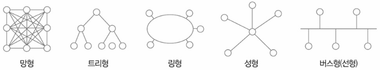
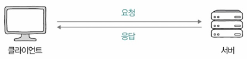
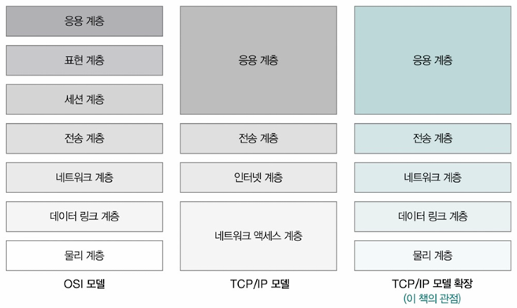
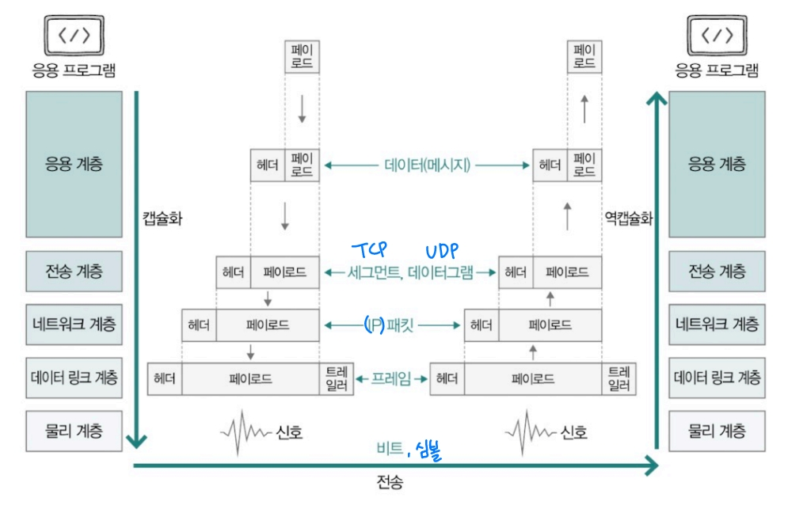
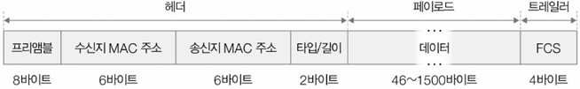
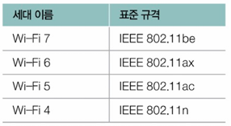
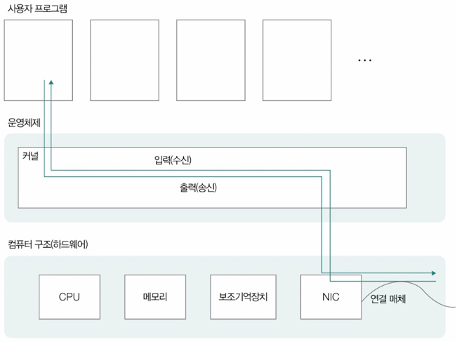
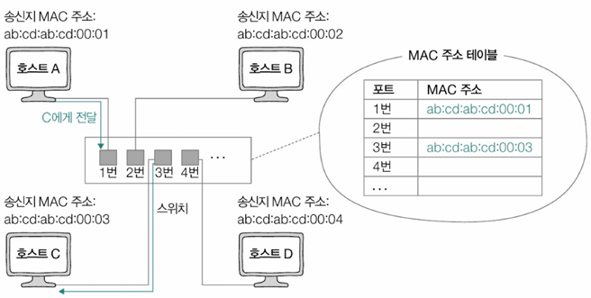

# Ch5. 네트워크
# 1. 네트워크의 큰 그림

## 네트워크의 기본 구조
- 그래프 구조로 노드와 링크로 구성
- `네트워크 토폴로지(Network Topology)` - 망형, 트리형, 링형, 성형(스타형), 버스형(선형)
  
- 구성 요소
  - 호스트: 네트워크 가장자리 위치, 네트워크 정보 최초 송신/수신하는 노드
  - **클라이언트(client)**: 서비스 `요청(request)` 호스트
  - **서버(server)**: `응답(response)` 제공 호스트
    
  - 중간 노드: 데이터 전송 보조 장치 (라우터, 스위치, 공유기 등)

### LAN과 WAN
- **LAN(Local Area Network)**: 비교적 가까운 거리 내 호스트 연결 네트워크
- **WAN(Wide Area Network)**: 넓은 지역 분산 네트워크 연결 → 인터넷 가능하게 만드는 네트워크
  - ISP(Internet Service Provider): 인터넷 서비스 업체가 WAN 구축 및 관리

### 패킷 교환 네트워크
- 데이터를 작은 단위인 패킷으로 분할하여 전송
- 패킷(packet): 네트워크 통해 송수신되는 데이터 단위
- 패킷 구조 = 페이로드 + 헤더 (+ 트레일러)
  - 페이로드: 실제 전송 데이터
  - 헤더: 출발지/목적지 주소, 프로토콜 정보 포함, 부가 정보
  - 트레일러: 오류 검출용 정보 (선택적), 부가 정보

### 주소의 개념과 전송 방식
- 주소(address): 패킷의 헤더에 명시되는 정보 ex) IP주소, MAC주소
- 전송 방식
  - **유니캐스트(Unicast)**: 특정 한 대의 호스트에만 데이터 전송
  - **브로드캐스트(Broadcast)**: 네트워크 내 모든 호스트에 데이터 전송
    - 브로드캐스트 도메인(Broadcast Domain): 브로드캐스트가 전송되는 범위
    - 호스트가 같은 브로드캐스트 도메인에 속해 있는 경우, 같은 LAN에 속해 있다고 간주
  - 멀티캐스트(Multicast): 네트워크 내 동일 그룹에 속한 호스트에게만 전송
  - 애니캐스트(Anycast): 네트워크 내 동일 그룹에 속한 호스트 중 가장 가까운 호스트에게 전송

## 두 호스트가 패킷을 주고받는 과정

### 프로토콜
- 네트워크에서 통신 주고받는 노드 간 **합의된 규칙이나 방법**
- 프로토콜마다 `목적`, `특징` 다름
  - IP - 네트워크 간 주소 지정 `목적`
  - ARP - IP주소와 MAC주소 대응시기는 `목적`
  - HTTPS - HTTP보다 보안상 안전한 `특징`
  - TCP - UDP보다 신뢰성 높다는 `특징`
- 패킷은 패킷 구성하는 프로토콜의 목적과 특징에 따라 걸맞는 패킷 헤더를 가짐

### 네트워크 참조 모델
  : 통신이 이뤄지는 단계를 계층적으로 표현
- 패킷 송신) 상위 계층 → 하위 계층
- 패킷 수신) 하위 계층 → 상위 계층

#### OSI 모델(OSI 7계층)
주로 네트워크의 이론적 기술 목적으로 사용
1. 물리 계층
   - 가장 최하위 계층
   - 비트 신호 전송
   - 신호를 유무선 통신 매체 통해 운반
2. 데이터 링크 계층
   - LAN에 속한 호스트끼리 올바르게 정보 주고받기 위한 계층
   - 역할
     - 같은 네트워크 속한 호스트 식별할 수 있는 주소(MAC주소) 사용
     - 물리계층 통해 주고받는 정보 오류 검출
3. 네트워크 계층
   - 네트워크 간 통신 가능하게 하는 계층
   - LAN을 넘어 다른 네트워크와 통신 위해 필요한 계층
   - 호스트 식별 주소(IP주소) 필요
4. 전송 계층
   - 네트워크 통해 송수신되는 패킷은 전송 도중 유실되거나 순서 바뀔 수 있음
   - 신뢰성 있는 전송 가능 하게 대비하는 계층
   - `포트(port)`란 정보로 특정 응용 프로그램의 연결 다리 역할 수행
   - ex) TCP, IP
5. 세션 계층
   - 세션 관리
     - `세션(session)`: 응용 프로그램 간 연결 상태
   - 응용 프로그램 간 연결 상태 유지하거나 새롭게 생성, 필요 시 연결 끊는 역할
6. 표현 계층 - 번역가
   - 인코딩, 압축, 암호화 같은 작업 수행
   - 세션 계층, 표현 계층은 다른 계층처럼 두 계층 명확히 구분X, 응용 계층에 포함하기도
7. 응용 계층
   - 사용자와 가까워서 여러 네트워크 서비스 제공하는 계층
   - 중요한 프로토콜 다수 포함
   - ex) HTTP, HTTPS, DNS 등

#### TCP/IP모델(TCP/IP 4계층)
구현과 프로토콜에 중점
1. 네트워크 액세스 계층(=링크 계층 =네트워크 인터페이스 계층): OSI의 물리, 데이터 링크 계층에 해당
2. 인터넷 계층: OSI의 네트워크 계층에 해당, IP 프로토콜 사용
3. 전송 계층: OSI의 전송 계층에 해당, TCP/UDP 프로토콜 사용
4. 응용 계층: OSI의 세션/표현/응용 계층에 해당

### 캡슐화, 역캡슐화
- 캡슐화: 상위 계층에서 하위 계층으로 데이터 전달 시(송신 과정) 각 계층의 헤더(및 트레일러) 추가
- 역캡슐화: 하위 계층에서 상위 계층으로 데이터 전달 시(수신 과정) 각 계층의 헤더(및 트레일러) 제거
- 계층별 패킷 이름
    | 계층           | 패킷의 이름                                      |
    |--------------|----------------------------------|
    | 그 이상의 계층 | 데이터(data) 또는 메시지(message)             |
    | 전송 계층     | TCP 기반 패킷의 경우  | 세그먼트(segment)  |
    |              | UDP 기반 패킷의 경우  | 데이터그램(datagram) |
    | 네트워크 계층 | 패킷(이하 IP 패킷) 또는 데이터그램            |
    | 데이터 링크 계층 | 프레임(frame)                           |
    | 물리 계층     | 심볼(symbol) 또는 비트(bit)               |

    

---

# 2. 물리 계층과 데이터 링크 계층

## 이더넷(Ethernet)
- 통신 매체를 통해 신호 송수신하는 방법, 데이터 링크 계층에서 주고받는 데이터(프레임) 형식 등이 정의된 기술
- 현대 대부분의 (유선)LAN은 이더넷 기반

### 이더넷 표준
- IEEE 802.3 - 국제 표준
- 속도에 따라 다양한 표준 존재
- ⭐
  - 대다수 LAN 장비들이 특정 이더넷 표준 따름
  - 이더넷 표준이 달라지면 통신 매체의 종류를 비롯한 신호 송수신 방법, 최대 지원 속도도 달라질 수 있음

### 이더넷 프레임(Ethernet Frame)
- 이더넷 기반 네트워크에서 주고받는 프레임
- 사실상 프레임이 이더넷 프레임 지칭한다고 봐도 무방
- 구조
  
  

  - 프리앰블: 송수신지 동기화 위해 사용되는 8바이트(64bit) 정보
    - 프리앰블 첫 7 바이트는 10101010 // 마지막 바이트는 10101011
    - 수신자 입장에서는 프리앰블 비트를 통해 현재 이더넷 프레임 수신되고 있음을 알아
  - 송수신지 MAC 주소
    - 출발지 장치의 물리 주소 (6바이트(48bit))
    - 목적지 장치의 물리 주소 (6바이트(48bit))
    - `콜론(:)`으로 구분된 12자리 16진수로 표현
        > ab : cd : ab : cd : 00 : 01
    - MAC주소: 네트워크 인터페이스마다 하나씩 부여되는 주소, 물리적 주소
    - 보통 NIC라는 장치가 네트워크 인터페이스 담당
    - 네트워크 인터페이스: 네트워크 향하는 통로, 연결 매체와의 연결 지점
  - 타입/길이
    - 필드에 명시된 크기가 1500 이하(16진수 05DC) ; 크기
    - 1536 이상(0600) ; 타입
  - 데이터: 실제 전송 정보 - 페이로드
    - 페이로드: 상위 계층으로 전달하거나 받을 데이터 명시
    - 데이터 최대 크기 정해져 있음 - `1500byte`
    - 이보다 크면 여러 패킷으로 나눠서 보내짐
    - 점보 프레임: 일반적인 1500바이트 보다 큰 데이터 포함할 수 있는 특별한 프레임
  - FCS
    - 트레일러
    - 프레임의 오류 확인 필드 - CRC 명시
      - 송신지에서 CRC 값 계산해서 보내면
      - 수신지에서 전달받은 데이터에 대한 CRC 값 계산해서 전달 받은 CRC 값과 대조
    - 오류 검출 정보 (4바이트)

## 유무선 통신 매체
호스트가 아무리 빠르게 데이터 처리할 수 있어도 그를 뒷받침 하는 연결 매체의 성능이 뒷받침 안 되면 무소용!

### 유선 매체 - 트위스티드 페어 케이블(Twisted Pair Cable)
- 두 개(pair)의 절연된 구리선을 꼬아서(twisted) 제작, 노이즈 간섭 감소 목적
- 카테고리: 전송 속도와 대역폭에 따라 Cat1~Cat8까지 분류(카테고리마다 대응되는 이더넷 표준이 다름)
- 노이즈: 잡음 → 트위스티드 페어 케이블은 구리선으로 전기 신호 주고 받아서 왜곡을 줄 수 있는 주변 잡음에 취약
- 차폐 방식(Shielding)
  - 브레이드 실드: 그룸 모양 철사로 차폐
  - 포일 실드: 얇은 금속 포일로 차폐
- 케이블 종류
  - FTP(Foil Twisted Pair): 포일로 차폐된 케이블
  - UTP(Unshielded Twisted Pair): 차폐 없이 구리선만 있는 케이블
- 실드의 상세한 표기
  - S/UTP: 전체가 브레이드로 차폐된 케이블
  - F/UTP: 전체가 포일로 차폐된 케이블
  - SF/UTP: 포일과 브레이드로 모두 차폐된 케이블 - 케이블 외부는 브레이드 실드, 포일 실드로 감싸고 각각의 구리선은 포일 실드로 감싼 케이블
  - U/UTP: 차폐되지 않은 케이블

### 무선 매체 - 전파와 WiFi
- 전파: 약 3kHz ~ 3THz 진동수를 갖는 전자기파 → `2.4GHz, 5GHz`
- 와이파이: IEEE 802.11 표준을 따르는 무선 네트워크 기술, 무선 LAN의 가장 대중적 사용 기술
  - 숫자 뒤에 붙는 알파벳으로 규격 구분
  - 와이파이 뒤에 붙는 숫자로 세대 구분 
    
- 채널: 주파수 대역을 나눈 것으로 간섭 감소 목적 → 하위 주파수 대역으로 세분화
- 참고
  - AP(Access Point): 무선 장치들을 연결해주는 중계 장치 ex) 무선 공유기
  - 서비스 셋(Service Set): AP 중심으로 구성된 무선 네트워크
  - SSID(Service Set Identifier): 서비스 셋 식별자 ex) 와이파이 이름

#### 네트워크 인터페이스: NIC
- **네트워크 인터페이스(Network Interface)**: 네트워크 상 노드와 통신 매체가 연결되는 시점
- **NIC(Network Interface Controller)**: 컴퓨터와 네트워크를 연결하는 하드웨어
  - 네트워크 인터페이스 카드, 네트워크 어댑터, LAN 카드, 네트워크 카드, (이더넷 네트워크 경우)이더넷 카드 등으로 불림
  - 역할
    - 통신 매체의 신호를 호스트가 이해하는 프레임으로 변환하거나
    - 호스트가 이해하는 프레임을 통신 매체의 신호로 변환
    - MAC 주소를 토대로 잘못 전송된 패킷 없는지 확인
  - 예전에는 확장 카드 형태였지만 최근 다양한 형태로 변화
  - NIC의 지원 속도가 저마다 다르고, 이는 네트워크 속도에 큰 영향 미침 
  
  - NIC 작동 시스템 콜 호출 → (커널 모드 전환 후) 송수신 수행 → 입출력 완료되면 인터럽트 통해 CPU에 작업 완료 알림
  - 대부분 DMA도 지원
- 티밍/본딩: 여러 NIC를 하나로 묶어 대역폭 증가 또는 이중화 구현(RAID와 유사)

#### 허브와 스위치

##### 물리 계층의 허브
- 허브: 여러 대의 호스트 연결
- 리피터 허브라고 부르기도
- 이더넷 (네트워크) 허브
- 포트: 케이블을 연결하는 허브의 소켓 (포트 다른 의미도 있음)

**중요 특징:**
1. 전달 받은 신호를 모든 포트로 내보냄: 신호 전달받으면 어떠한 조작/판단 없이 모든 포트에 단순히 신호 내보냄
2. 반이중 모드로 통신: 한 번에 한 방향으로만 통신 가능(동시 송수신 불가)
   cf) 전이중 모드: 동시 송수신 가능 - 스위치는 전이중 모드

**충돌과 충돌 도메인:**
- 두 장치가 동시에 데이터 전송 시 충돌 발생 ← 반이중 모드로 통신하니까
- 충돌 도메인(collision domain): 충돌 발생할 수 있는 영역

##### 데이터 링크 계층의 스위치

- 스위치: 데이터 링크 계층에서 동작, MAC 주소 기반 패킷 전달
  - 허브와 달리 전달받은 신호를 목적지 호스트가 연결된 포트로만 내보내고 전이중 모드 지원
  - 허브보다 콜리전 도메인 좁음
  - MAC 주소 학습 기능으로 전달받은 신호를 원하는 포트에만 내보낼 수 있음
- MAC 주소 학습 기능: 프레임의 출발지 MAC 주소를 통해 포트와 MAC 주소 관계 학습
- MAC 주소 테이블: 학습한 MAC 주소와 포트 정보 저장
- VLAN(Virtual LAN): 하나의 물리적 네트워크를 여러 논리적 네트워크로 분할하는 기술

---
# Question

## Q1. 브로드캐스트와 유니캐스트를 비교해서 설명해주세요.

유니캐스트(Unicast)는 특정 한 대의 호스트에만 데이터를 전송하는 방식입니다.
1:1 통신 방식으로, 지정된 목적지에만 패킷이 전달됩니다.

반면 브로드캐스트는 네트워크 내 모든 호스트에 데이터를 전송하는 방식입니다.
브로드캐스트 도메인(Broadcast Domain)이라는 개념이 있으며 이는 브로드캐스트가 전송되는 범위를 의미합니다.
호스트가 같은 브로드캐스트 도메인에 속해 있는 경우, 같은 LAN에 속해 있다고 간주합니다.

## Q2. 캡슐화와 역캡슐화에 대해 설명해주세요.

캡슐화란 상위 계층에서 하위 계층으로 데이터 전달 시(송신 과정) 각 계층의 헤더(및 트레일러)가 추가되는 과정입니다.

역캡슐화는 하위 계층에서 상위 계층으로 데이터 전달 시(수신 과정) 각 계층의 헤더(및 트레일러)가 제거되는 과정입니다.

## Q3. 물리계층의 허브와 데이터링크 계층의 스위치를 비교해주세요.

물리계층의 허브는 물리 계층에서 동작하며 여러 호스트를 단순히 연결해주는 장치로, 전달받은 신호를 어떠한 판단 없이 모든 포트로 내보내는 특징이 있습니다. 
이러한 특성 때문에 허브는 리피터 허브라고도 불리며 반이중 모드로 통신하기 때문에 한 번에 한 방향으로만 데이터 전송이 가능합니다. 
이로 인해 두 장치가 동시에 데이터를 전송하면 충돌이 발생할 수 있어 충돌 도메인이 넓다는 단점이 있습니다.

반면, 스위치는 데이터 링크 계층에서 동작하며 MAC 주소를 기반으로 패킷을 전달합니다. 
스위치는 허브와 달리 목적지 MAC 주소를 확인하여 해당 포트로만 데이터를 전송하므로 네트워크 효율성이 높습니다. 
그리고 전이중 모드를 지원하여 동시에 데이터 송수신이 가능하며 각 포트가 독립적인 충돌 도메인을 형성하므로 허브보다 충돌 도메인이 현저히 좁습니다. 
이러한 특징으로 인해 스위치는 네트워크 성능을 향상시키고 충돌 발생 가능성을 크게 줄여줍니다.