# 전송 계층 - TCP와 UDP

# TCP와 UDP의 목적과 특징
## 포트를 통한 프로세스 식별
- 전송계층
  - 데이터의 신뢰성과 효율적인 송수신을 담당 - 주요 프로토콜로 TCP와 UDP가 있음
  - 네트워크 통신에서 데이터를 송수신하는 프로세스를 식별하기 위해 포트 번호를 사용
- 포트를 통한 식별
  - IP 주소와 MAC 주소를 통해 호스트를 특정하고 포트 번호를 통해 실행 중인 프로세스를 구분
  - `IP 주소:포트번호` 형식으로 **특정 호스트의 특정 프로세스를 식별** 가능 (EX: 192.168.0.15:8000)
  - 패킷의 최종 송수신 대상은 호스트가 실행하는 프로세스임
  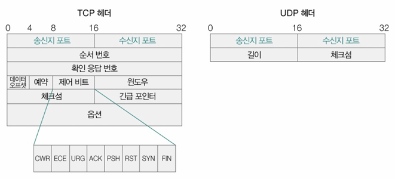

## 2. 포트 번호
- **16비트(65536개, 0~65535)로 표현**되며, 세 가지 종류로 나뉨
  - **잘 알려진 포트 (Well-known Port, 0~1023):** HTTP(80), HTTPS(443), FTP(21) 등 범용적으로 사용되는 프로토콜 이 주로 사용하는 포트 번호 목록  
    | 잘 알려진 포트 번호 | 설명 |
    |-------------|------|
    | 20, 21      | FTP  |
    | 22          | SSH  |
    | 23          | TELNET |
    | 53          | DNS  |
    | 67, 68      | DHCP |
    | 80          | HTTP |
    | 443         | HTTPS |

  - **등록된 포트 (Registered Port, 1024~49151):** 특정 애플리케이션 할당 가능  
    | 등록된 포트 번호 | 설명 |
    |------------------|------|
    | 1194             | OpenVPN |
    | 1433             | Microsoft SQL Server 데이터베이스 |
    | 3306             | MySQL 데이터베이스 |
    | 6379             | Redis |
    | 8080             | HTTP 대체 |

  - **동적 포트 (Dynamic Port, 49152~65535) =사설 포트 =임시 포트:** 주로 클라이언트 프로그램에서 임시 사용, 웹 브라우저 등에서 자동 할당됨

- **포트별 주요 할당 프로그램**
  - 잘 알려진 포트, 등록된 포트 → 주로 `서버`로 동작하는 프로그램에 할당
  - 동적 포트 → 주로 `클라이언트`로서 동작하는 프로그램에 임의로 할당

## 3. NAT와 NAPT
- **NAT(Network Address Translation)**: 사설 IP와 공인 IP 간 변환을 수행하는 기술 
  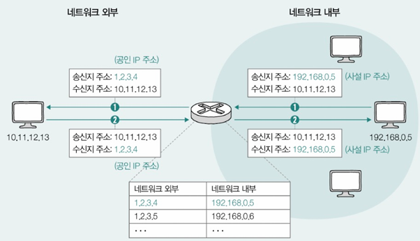

  - 대부분의 라우터와 (가정용) 공유기는 NAT 기능 내장
  - 사설 네트워크 → 외부: 사설 IP 주소 → 공인 IP 주소 변환
  - 외부 → 사설 네트워크: 공인 IP 주소 → 사설 IP 주소 변환
  - 대중적 NAT는 변환하려는 IP주소를 일대일로 대응X, 다수의 사설 IP 주소를 그보다 적은 수의 공인 IP 주소로 변환 ; 사설IP 주소를 사용하는 여러 호스트가 적은 수의 공인 IP 주소 공유
- **NAPT(Network Address Port Translation)**: 포트 번호까지 변환하여 다수의 사설 IP를 소수의 공인 IP로 매핑
  - IP 주소뿐만 아니라 포트 번호까지 함께 변환하여 N:1 관계 구현
  - 서로 다른 사설 IP 주소가 같은 공인 IP 주소를 사용하더라도 다른 포트 번호로 변환하여 네트워크 내부 호스트 식별 가능
  - 공인 IP 주소 부족 문제를 해결하는 중요한 기술  
  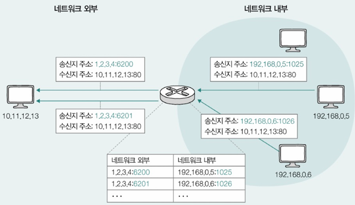

## 4. TCP와 UDP의 차이점
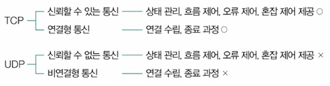

| 구분 | TCP (Transmission Control Protocol) | UDP (User Datagram Protocol) |
|------|-----------------------------------|---------------------------|
| 연결 방식 | 연결형 (Connection-oriented) | 비연결형 (Connectionless) |
| 신뢰성 | 신뢰성 보장 (패킷 손실 시 재전송) | 신뢰성 낮음 (패킷 손실 가능) |
| 흐름 및 혼잡 제어 | 있음 | 없음 |
| 속도 | 상대적으로 느림 (시간과 연산 소요) | 빠름 |
| 오류 제어 | 재전송 및 오류 제어 지원 | 유실 시 재전송 없음 |
| 상태 관리 | 있음 (Stateful Protocol) | 없음 |
| 사용 사례 | HTTP, HTTPS, FTP, 이메일 등 | DNS, 스트리밍, 온라인 게임, VoIP 등 |

## 5. TCP와 UDP 헤더 구조

### 5.1 UDP 헤더 구조
- TCP보다 훨씬 간단한 구조 
  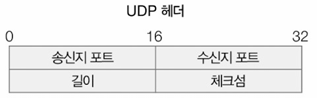 
- **송신지 포트:** 송신 프로세스가 할당된 포트 번호
- **수신지 포트:** 수신 프로세스가 할당된 포트 번호
- **길이:** 헤더를 포함한 UDP 패킷(데이터그램)의 바이트 크기
- **체크섬:** 송수신 과정에서의 데이터그램 훼손 여부 확인용

### 5.2 TCP 헤더 구조
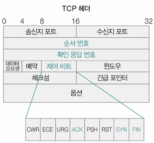
- **송신지 포트(Source Port), 수신지 포트(Destination Port)**: 통신하는 프로세스 식별
- **순서 번호(Sequence Number):** 데이터의 순서를 보장, 세그먼트 첫 바이트에 매겨진 번호
- **확인 응답 번호(Acknowledgment Number):** 수신된 패킷을 확인, 다음으로 수신하길 기대하는 순서 번호 (올바르게 수신한 순서 번호 + 1)
- **제어 비트(Flags)**
  - **ACK:** 응답 확인 (확인 응답 번호 값을 보내기 위해 1로 설정) - 세그먼트 승인 나타냄
  - **SYN:** 연결 요청
  - **FIN:** 연결 종료
- **윈도우 필드:** 수신 호스트가 한 번에 처리할 수 있는 `수신 윈도우(RWND)` 크기 명시

## 6. TCP의 연결 과정과 종료 과정

### 6.1 TCP 연결 과정 (3-Way Handshake)
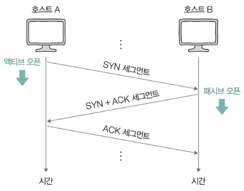  
1. **클라이언트 → 서버**: `SYN` 패킷 전송 (SYN=1, Seq=x)  
   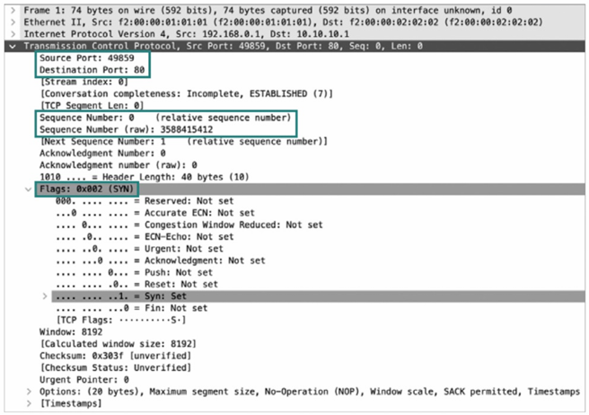

   - `액티브 오픈(active open)`: 처음 연결을 시작하는 과정 → 주로 클라이언트에 의해 수행
   - 클라이언트가 SYN 비트가 1로 설정된 세그먼트 전송, 순서 번호에 클라이언트의 순서 번호 포함

2. **서버 → 클라이언트**: `SYN + ACK` 패킷 응답 (SYN=1, ACK=1, Seq=y, Ack=x+1)  
   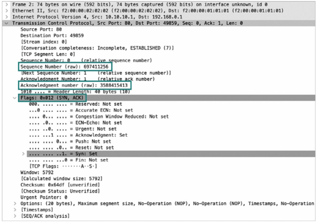

   - `패시브 오픈(passive open)`: 연결 요청을 수신한 뒤 그에 대한 연결을 수립하는 과정 → 주로 서버에 의해 수행
   - 서버가 ACK 비트와 SYN 비트가 1로 설정된 세그먼트 전송
   - 순서 번호에 서버의 순서 번호와 클라이언트 세그먼트에 대한 확인 응답 번호 포함

3. **클라이언트 → 서버**: `ACK` 패킷 전송 (ACK=1, Seq=x+1, Ack=y+1) → 연결 수립  
   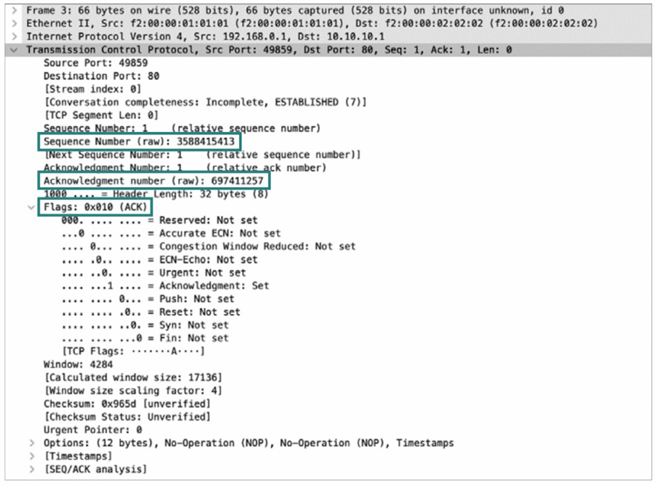

   - ACK 비트가 1로 설정된 세그먼트 전송
   - 순서 번호에 클라이언트의 순서 번호와 서버 세그먼트에 대한 확인 응답 번호 포함

<정리>  
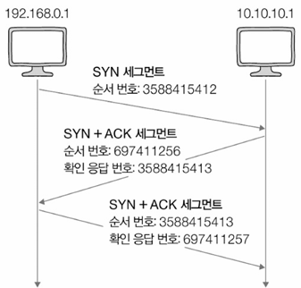

### 6.2 TCP 연결 종료 (4-Way Handshake)
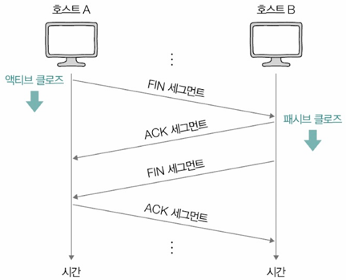
1. **클라이언트 → 서버**: `FIN` 패킷 전송 (연결 종료 요청, FIN=1)
   - `액티브 클로즈(active close)`: 먼저 연결을 종료하려는 호스트에 의해 수행되는 동작

2. **서버 → 클라이언트**: `ACK` 패킷 전송 (종료 요청 확인, ACK=1)

3. **서버 → 클라이언트**: `FIN` 패킷 전송 (연결 종료 요청, FIN=1)
   - `패시브 클로즈(passive close)`: 연결 종료 요청을 받아들이는 호스트에 의해 수행되는 동작

4. **클라이언트 → 서버**: `ACK` 패킷 전송 (종료 확인, ACK=1) → 연결 종료

## 7. TCP의 신뢰성 보장 기능

### 7.1 오류 제어
- 송수신 과정에서 잘못 전송된 세그먼트가 있을 경우 **재전송을 통해 오류를 제어**하는 기능
- **중복된 ACK 세그먼트가 도착했을 때 재전송**
  - 송신한 세그먼트의 일부가 전송 중 유실되어 중복으로 ACK 세그먼트를 수신하게 되는 상황
- **타임아웃 발생 시 재전송**
  - 타임아웃 발생 시점까지 ACK 세그먼트를 받지 못한 상황
  - 타임아웃(timeout): 호스트는 세그먼트 전송 시마다 `재전송 타이머`를 시작하는데 이 타이머의 카운트다운이 끝난 상황

- **파이프라이닝 전송** 
  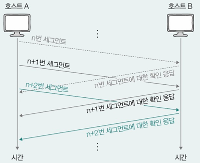
  - 확인 응답을 받기 전이라도 여러 메시지를 보내는 방식으로 송신하는 방법
  - 기본적인 TCP는 확인 응답을 받기 전까지 다음 세그먼트를 보낼 수 없음
  - 한 번에 여러 세그먼트를 보내고, 한 번에 각 세그먼트에 대한 확인 응답을 받는 방식이 더 효율적

### 7.2 흐름 제어 (Flow Control)
- 송신 호스트가 수신 호스트의 처리 속도를 고려하며 송수신 속도를 균일하게 맞추는 기능
- 수신 호스트가 한 번에 처리할 수 있는 데이터 크기(윈도우 크기)를 지정하여 전송 속도를 조절
- 수신 호스트는 TCP 헤더의 윈도우 필드를 통해 송신 호스트에게 한 번에 처리 가능한 양(RWND) 전달
- 수신 호스트가 한 번에 받을 수 있는 전송량은 TCP 수신 버퍼의 크기에 의해 결정됨
  - 수신 버퍼: 수신된 세그먼트가 애플리케이션 프로세스에 의해 읽히기 전에 임시 저장되는 공간(커널에 정의됨)

### 7.3 혼잡 제어 (Congestion Control)
- 네트워크 혼잡을 제어하기 위한 기능
- 혼잡: 많은 트래픽으로 인해 패킷의 처리 속도가 느려지거나 유실될 수 있는 상황
- **혼잡 윈도우(CWND, Congestion Window)**: 혼잡 없이 한 번에 전송할 수 있을 정도의 양
  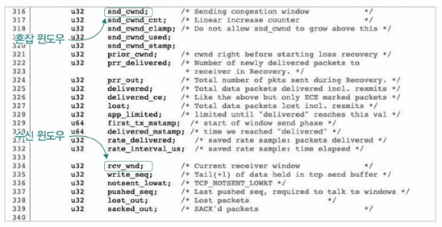
- 송신 호스트는 주체적으로 네트워크의 혼잡 정도를 판단하고, 그에 따라 세그먼트 전송량 조절
- 혼잡 여부의 판단 기준: 중복된 ACK 세그먼트가 도착했을 때, 타임아웃이 발생했을 때
- 혼잡 제어 알고리즘: 혼잡 윈도우 크기가 어느 정도가 적당한지? == 혼잡 제어 수행하는 일련의 과정
  - **AIMD 알고리즘 (Additive Increase/Multiplicative Decrease)**:
    - 세그먼트를 보내고 그에 대한 응답이 오기까지 혼잡이 감지되지 않으면 혼잡 윈도우를 1씩 증가시킴
    - 혼잡이 감지되면 혼잡 윈도우를 절반으로 감소시킴
    - RTT(Round Trip Time): 패킷을 보내고 그에 대한 응답이 수신되기까지의 시간
    - 특징: 혼잡 윈도우는 톱니 모양으로 변화  
        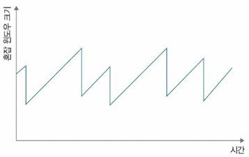

## 8. TCP의 상태 관리 (Stateful Protocol)
TCP는 통신의 진행 상황을 추적하는 `상태 기반 프로토콜(stateful protocol)`
(주요 상태 위주로 기억! - 3가지)
- 상태(state): 현재 어떤 통신 과정에 있는지 나타내는 정보
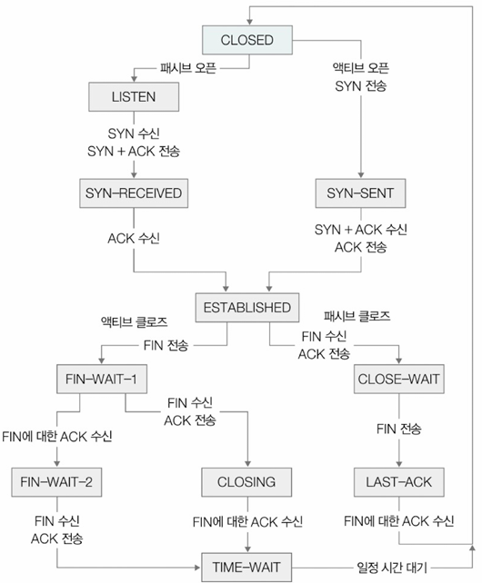

### 8.1 연결 수립 안 되었을 때의 상태
- **CLOSED:** 아무런 연결이 없는 상태
- **LISTEN:** 연결 대기 상태(3-way handshake의 첫 단계인 SYN 세그먼트를 대기하는 상태)
  - 서버로서 동작하는 패시브 오픈 호스트는 항상 LISTEN 상태로 연결 요청 기다림

### 8.2 연결 수립 과정에서의 상태
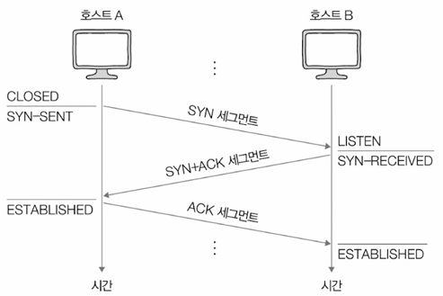  
- **SYN-SENT:** 액티브 오픈 호스트가 SYN 세그먼트를 보낸 뒤, SYN + ACK 세그먼트를 기다리는 상태(연결 요청 전송)
- **SYN-RECEIVED:** 패시브 오픈 호스트가 SYN + ACK 세그먼트를 보낸 뒤, ACK 세그먼트를 기다리는 상태(연결 요청 수신)
- **ESTABLISHED:** 3-way handshake가 끝난 뒤 데이터를 송수신할 수 있는 상태(연결 수립)

### 8.3 연결 종료 과정에서의 상태
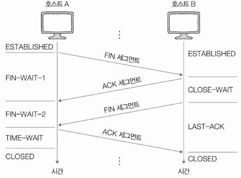  
- **FIN-WAIT-1:** 액티브 클로즈 호스트가 FIN 세그먼트로 연결 종료 요청을 보낸 상태(연결 종료 요청 전송)
- **CLOSE-WAIT:** FIN 세그먼트를 받은 패시브 클로즈 호스트가 ACK 세그먼트를 보낸 후 대기하는 상태(연결 종료 요청 승인)
- **FIN-WAIT-2:** FIN-WAIT-1 상태에서 ACK 세그먼트를 받은 상태
- **LAST-ACK:** CLOSE-WAIT 상태에서 FIN 세그먼트를 전송한 뒤 대기하는 상태
- **TIME-WAIT:** 액티브 클로즈 호스트가 마지막 ACK 세그먼트를 전송한 뒤 접어드는 상태
  - 패시브 클로즈 호스트가 마지막 ACK 세그먼트를 수신하면 CLOSED 상태로 전환
  - TIME-WAIT 상태에 접어든 액티브 클로즈 호스트는 **일정 시간 대기 후 CLOSED 상태로 전환**
  - 일정 시간 대기하는 이유: 마지막 ACK 세그먼트가 올바르게 전송되지 않았을 때 재전송 필요
- **CLOSING:** 서로 FIN 세그먼트를 보내고 받은 뒤 각자 ACK 세그먼트를 보냈지만, 아직 자신의 FIN 세그먼트에 대한 ACK 세그먼트를 받지 못했을 때 접어드는 상태
  - 양쪽이 동시에 연결 종료를 요청하고 서로의 종료 응답을 기다릴 경우에 발생
  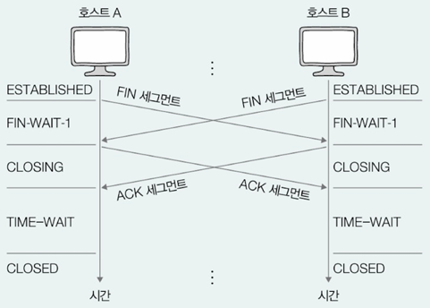

---
# Question
## Q1. TCP와 UDP의 차이점은 무엇인가요?

TCP와 UDP는 모두 전송 계층에서 사용되는 프로토콜이지만 여러 면에서 차이가 있습니다. 

TCP는 연결 지향적이고 신뢰성이 높은 반면, UDP는 비연결적이고 신뢰성이 낮습니다. 
TCP는 데이터의 정확한 전송을 보장하기 위해 연결 설정, 데이터 전송 및 연결 해제의 3단계 핸드셰이크를 사용합니다. 그리고 TCP는 데이터가 손실되거나 손상된 경우 재전송을 시도하고 흐름 제어 및 혼잡 제어 기능을 제공합니다. 

반면 UDP는 이러한 절차를 거치지 않아 오버헤드가 적고 빠른 전송이 가능하지만, 데이터의 정확한 전송을 보장하지 않습니다. 

따라서 TCP는 파일 전송, 이메일 및 웹과 같이 신뢰성이 중요한 응용 프로그램에 적합하고, UDP는 스트리밍, 온라인 게임 및 VoIP와 같이 실시간성이 중요하거나 작은 오류가 허용되는 응용 프로그램에 적합합니다.

## Q2. NAT와 NAPT의 차이점은 무엇인가요?

NAT와 NAPT는 모두 사설 IP 주소와 공용 IP 주소 간의 변환을 수행하는 기술이지만 NAPT는 추가적으로 포트 번호까지 변환합니다. 

NAT는 일대일 변환을 수행하는 반면, NAPT는 일대다의 관계로 하나의 공용 IP 주소를 사용하여 여러 개의 사설 IP 주소를 변환할 수 있어 공용 IP 주소의 부족 문제를 해결하는 데 유용합니다. 

## Q3. TCP의 신뢰성 보장 기능에는 어떤 것들이 있나요?

TCP는 신뢰성을 보장하기 위해 여러 가지 기능을 제공합니다. 

첫째, 오류 제어 기능을 통해 송수신 과정에서 잘못 전송된 세그먼트가 있을 경우 재전송을 시도합니다. 
둘째, 흐름 제어 기능을 통해 수신 호스트의 처리 속도를 고려하여 송수신 속도를 조절합니다. 
셋째, 혼잡 제어 기능을 통해 네트워크 혼잡을 감지하고 그에 따라 세그먼트 전송량을 조절합니다. 