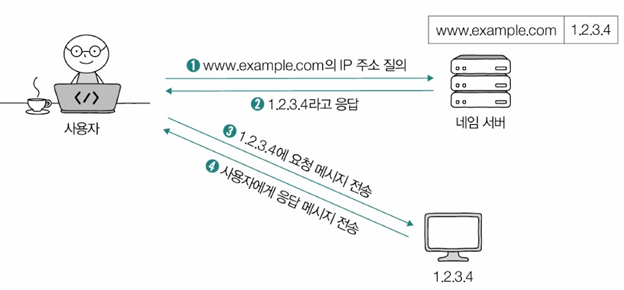
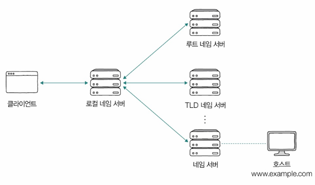
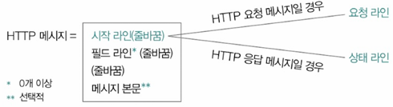
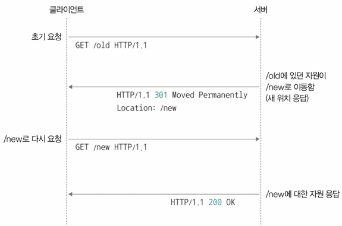
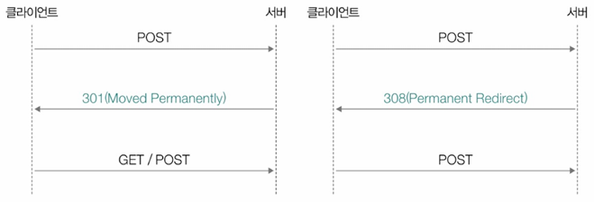
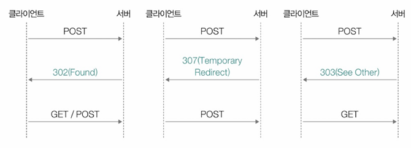
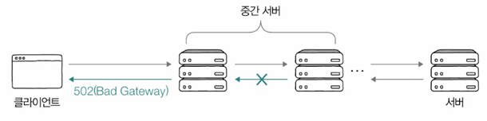
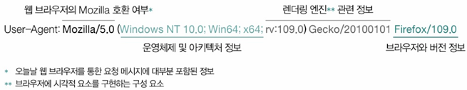

# 5. 응용 계층 - HTTP의 기초

# 1. DNS와 URI/URL

## 1.1 도메인 네임과 DNS

- 도메인 네임(Domain Name): 문자열 형태의 호스트 특정 정보 - 호스트의 IP주소와 대응
- **DNS(Domain Name System)**
  - 사람이 이해하기 쉬운 도메인 네임을 컴퓨터가 이해할 수 있는 IP 주소로 변환하는 시스템
  - 호스트가 이런 DNS 이용할 수 있도록 하는 애플리케이션 **계층 프로토콜**
- 네임 서버(Name Server): DNS 조회를 처리하는 서버(도메인 네임 ↔ IP 주소)
- DNS 서버: 도메인 네임 관리하는 네임 서버
- **resolving**: IP 주소 모르는 상태에서 도메인 네임에 대응되는 IP 주소 알아내는 과정
> www.example.com.
- FQDN(Fully Qualified Domain Name): `www.example.com`처럼 전체 주소를 포함한 도메인 네임
- 루트 도메인: 최상단
- 최상위 도메인(TLD): `.com`, `.org`, `.kr` 같은 최상위 도메인 
- 2단계 도메인(세컨드 레벨 도메인) ... 일반적으로 3~5단계 정도로 구성
- 서브 도메인(sub domain) - ex) example.com의 서브 도메인; mail.example.com, www.example.com, developer.example.com
---

- 네임 서버
  - 루트 네임 서버: DNS 계층의 최상위 서버
  - TLD 네임 서버: 특정 최상위 도메인을 담당
  - 공개 DNS 서버: Google(8.8.4.4), Cloudflare(1.1.1.1) 등
  - 로컬 네임 서버: ISP에서 제공하는 기본 DNS 서버
- DNS 캐시: 자주 조회하는 DNS 정보를 저장하여 속도를 향상
  - DNS 캐시 저장 용도로만 활용되는 서버도 有
  - 보다 적은 트래픽으로, 보다 짧은 시간 안에 원하는 IP 주소 얻어낼 수 있음
- DNS 레코드(Resource Record): 네임 서버에 도메인 네임에 대한 정보를 추가로 저장
  - A 레코드: IPv4 주소  
  - AAAA 레코드: IPv6 주소  
  - CNAME: 별칭(도메인에 대한 별명)
  - NS: IP 주소 정보
  - MX: 메일 서버 정보  

## 1.2 자원과 URI/URL
- 인터넷에서 각 자원을 식별하기 위한 체계가 `URI(Uniform Resource Identifier)`
- **URI = URN(Uniform Resource Name) + URL(Uniform Resource Locator)**

- URN: 리소스의 고유한 이름 → 이름 기반 자원 식별 (예: ISBN)  
- URL: 특정 리소스를 찾을 수 있는 주소 → 위치 기반 자원 식별  
- URL 구조
  > foo://www.example.com:8042/over/there?name=ferret#nose
  1. Scheme: 자원 접근 방법, 프로토콜 정보 (http, https, ftp 등) - `foo:`
  2. Authority: IP 주소, 도메인 네임, 포트 번호 (`www.example.com:8042`)
  3. Path: 자원의 경로 - **슬래시(/)**를 기준으로 계층적으로 표현 (`over/there`)  
  4. Query: 요청 파라미터 (`?name=ferret`)
    - 쿼리 문자열, 쿼리 파라미터
    - schene, authority, path만으로 표현 어려운 추가 정보
  5. Fragment: 자원의 특정 부분 (`#nose`)  

# 2. HTTP의 특징과 메시지 구조

## 2.1 HTTP의 특징
- HTTP(Hypertext Transfer Protocol): 클라이언트와 서버 간의 통신을 위한 프로토콜

1. 요청-응답 기반 프로토콜  
  - 클라이언트가 요청(Request)을 보내면 서버가 응답(Response)을 반환  
2. 미디어 독립적 프로토콜  
  - 전송하는 데이터의 유형에 제한이 없음 (MIME 타입 사용)
  - 추가)MIME 타입
    - Content-Type HTTP 헤더를 통해 전달됨
    - 타입/서브타입 형식으로 구성됨
      - 타입: 데이터의 유형
      - 서브타입: 주어진 타입에 대한 세부 유형
  - MIME 타입 예시: `text/html`, `application/json`, `image/png`  
3. 스테이트리스(Stateless) 프로토콜  
  - 서버가 클라이언트의 상태를 저장하지 않음 → 클라이언트의 모든 HTTP 요청은 독립적인 요청으로 간주
  - 확장성(Scalability) 향상 - 필요한 경우 언제든 쉽게 서버 추가 가능 
  - 견고성(Robustness) 증가 - 서버 중 하나에 문제가 생겨도 쉽게 다른 서버로 대체 가능  
  - 단점
    - 클라이언트의 상태를 저장하지 않으므로, 로그인 상태 유지와 같은 기능을 구현하려면 쿠키, 세션, 토큰 등을 사용해야
    - 같은 사용자가 연속된 요청을 보낼 때마다 모든 정보를 다시 포함해야 하므로, 네트워크 오버헤드가 발생할 수 있음
4. 지속 연결(Persistent Connection) 지원  
  - 한 번 연결을 맺으면 여러 개의 요청을 처리 가능  
  - Keep-Alive 헤더 사용  

### HTTP 버전별 특징
- HTTP 1.1  
  - 기본적으로 지속 연결 지원  
  - 파이프라이닝(Pipelining) 가능하지만 브라우저에서 비활성화  
- HTTP 2.0  
  - 멀티플렉싱(Multiplexing) 지원 (한 연결에서 여러 요청 동시 처리)  
  - 헤더 압축(HPACK) 적용  
- HTTP 3.0
  - QUIC 프로토콜 기반 (UDP 사용)  
  - 연결 지연 시간 단축 및 성능 개선  

# 3. HTTP 메시지 구조

## 3.1 시작 라인(Start Line)

- 요청(Request) 라인  
  - 형식: `METHOD URI HTTP/VERSION`  
  - 예시: `GET /index.html HTTP/1.1`  
- 상태(Status) 라인  
  - 형식: `HTTP/VERSION STATUS_CODE REASON_PHRASE`  
  - 예시: `HTTP/1.1 200 OK`  

| 구분     | 필드 이름                | 설명 |
|----------|-------------------------|------------------------------------------------------------|
| 요청 라인 | 메서드(method)          | 클라이언트가 서버의 자원에 대해 수행할 작업의 종류를 나타냅니다. |
|          | 요청 대상(request-target) | 요청을 보낼 서버의 자원을 명시합니다. 일반적으로 쿼리 문자열이 포함된 URL의 path가 표시됩니다. |
|          |                          | **(예1)** `http://example.com/hello?q=network`에 요청을 보낼 경우 → `/hello?q=network` |
|          |                          | **(예2)** `http://example.com/`에 요청을 보낼 경우 → `/` |
|          | HTTP 버전(HTTP-version)  | 사용된 HTTP 버전입니다. `HTTP/(버전)` 형식으로 표시됩니다. |
|          |                          | **(예)** `HTTP/1.1` |
| 상태 라인 | HTTP 버전(HTTP-version)  | 사용된 HTTP 버전입니다. `HTTP/(버전)` 형식으로 표시됩니다. |
|          | 상태 코드(status code)   | 요청에 대한 결과를 나타내는 3자리 정수를 나타냅니다. |
|          | 이유 구문(reason phrase) | 상태 코드에 대한 문자열 형태의 설명입니다. |

## 3.2 HTTP 메서드와 상태 코드
| HTTP 메서드 | 설명 |
|------------|-----------------------------------------|
| GET        | 자원을 습득하기 위한 메서드 |
| HEAD       | GET과 동일하나, 헤더만을 응답받는 메서드 |
| POST       | 서버로 하여금 특정 작업을 처리하게끔 하는 메서드 |
| PUT        | 자원을 대체하기 위한 메서드 |
| PATCH      | 자원에 대한 부분적 수정을 위한 메서드 |
| DELETE     | 자원을 삭제하기 위한 메서드 |
| CONNECT    | 자원에 대한 양방향 연결을 시작하는 메서드 |
| OPTIONS    | 사용 가능한 메서드 등 통신 옵션을 확인하는 메서드 |
| TRACE      | 자원에 대한 루프백 테스트를 수행하는 메서드 |

### HTTP 중요 메서드
- GET, HEAD: 리소스 요청 (HEAD는 본문 없이 헤더만 반환)  
- POST: 새로운 리소스 생성  
- PUT, PATCH: 리소스 전체 수정(PUT), 부분 수정(PATCH)  
- DELETE: 리소스 삭제  

### HTTP 상태 코드
| 상태 코드 범위 | 코드  | 의미 |
|--------------|------|----------------------|
| **200번대 (성공)** | 200  | 정상 응답 (OK) |
|              | 201  | 리소스 생성 완료 (Created) |
|              | 202  | 요청 성공, 아직 요청한 작업 안 끝남 (Accepted) |
|              | 204  | 요청 성공, 메시지 본문 표시할 데이터 없음 (No Content) |
| **300번대 (리다이렉션)** | 301  | 영구적 이동 (Moved Permanently) - 재요청 메서드 변경될 수 있음 |
|              | 308  | 영구적 - 재요청 메서드 변경 안 됨 (Permanent Redirect) |
|              | 302  | 임시 - 재요청 메서드 변경될 수 있음  (Found) |
|              | 303  | 임시 - 재요청 메서드 GET으로 변경 (See Other) |
|              | 307  | 임시 - 재요청 메서드 변경 안 됨 (Temporary Redirect) |
|              | 304  | 캐시 - 자원 변경X (Not Modified) |
| **400번대 (클라이언트 오류)** | 400  | 잘못된 요청 (Bad Request) |
|              | 401  | 인증 필요 (Unauthorized) |
|              | 403  | 접근 권한 없음 (Forbidden) |
|              | 404  | 리소스를 찾을 수 없음 (Not Found) |
|              | 405  | 요청한 메서드 지원X (Method Not Allowed) |
| **500번대 (서버 오류)** | 500  | 서버 내부 오류 (Internal Server Error) |
|              | 502  | 게이트웨이 오류 (Bad Gateway) |
|              | 503  | 서비스 이용 불가 (Service Unavailable) |

- 100번대: 정보성 상태 코드
- 200 
  
- 301과 308(애매모호함 보완) 
  
- 302, 307, 303 
  
- 401과 403
  - 401(Unauthorized): 인증(authentication) 요구
  - 403(Forbidden): 권한=인가(authorization) 요구
- 502 
  

# 4. HTTP 주요 헤더

## 4.1 요청 메시지에 주로 사용되는 HTTP 헤더
- Host: 요청을 보낼 서버 도메인 (`Host: example.com`)  
- User-Agent: 클라이언트의 정보 (`User-Agent: Mozilla/5.0`) 
  
- Referer: 이전 페이지 정보 (`Referer: https://google.com`)  

## 4.2 응답 메시지에 주로 사용되는 HTTP 헤더
- Server: 서버의 정보 (`Server: Apache/2.4`)  
- Allow: 지원하는 HTTP 메서드 (`Allow: GET, POST`)  
- Location: 리다이렉션할 URL (`Location: https://new-site.com`)  

## 4.3 요청과 응답 메시지 모두에서 활용되는 HTTP 헤더
- Date: 응답이 생성된 날짜 (`Date: Tue, 04 Mar 2025 12:00:00 GMT`)  
- Content-Length: 본문 길이 (`Content-Length: 512`)  
- Content-Type: 본문 유형 (`Content-Type: application/json`)  
- Content-Language: 본문 언어 (`Content-Language: en-US`)  
  - 하이픈(-)으로 여러 서브 태그 구분된 구조
- Content-Encoding: 인코딩 방식 (`Content-Encoding: gzip`)  
- Connection: 연결 유지 여부 (`Connection: keep-alive`)

### 표현 헤더(Representation Header)
- Content-Type, Content-Language, Content-Encoding
- 어떻게 '표현' 되었는지 관련한 헤더

---
# Question
## Q1. HTTP는 스테이트리스(stateless) 프로토콜이라고 하는데, 이를 설명하고 장점과 단점을 말해보세요.
HTTP는 스테이트리스(stateless) 프로토콜이므로, 서버가 클라이언트의 상태를 저장하지 않는다. 즉, 클라이언트가 요청을 보낼 때마다 새로운 요청으로 처리된다. 장점으로는 확장성과 견고성이 있다. 서버가 상태를 유지하지 않기 때문에 요청을 여러 서버에서 쉽게 분산 처리할 수 있으며, 특정 서버에 장애가 발생해도 클라이언트의 상태를 유지하지 않으므로 다른 서버로 쉽게 요청을 넘길 수 있다.

단점으로는 클라이언트의 상태를 저장하지 않기 때문에 로그인 상태 유지 같은 기능을 구현하려면 쿠키, 세션, 토큰 등의 기술이 필요하며, 같은 사용자가 연속된 요청을 보낼 때마다 모든 정보를 다시 포함해야 하므로 네트워크 오버헤드가 발생할 수 있다.

## Q2. HTTP 상태 코드 301과 302의 차이를 설명하고, 308과 307이 추가된 이유는?
301 Moved Permanently는 요청한 리소스가 영구적으로 이동되었음을 의미하며 이후에는 새로운 URL을 사용해야 한다. 반면, 302 Found는 요청한 리소스가 일시적으로 다른 URL로 이동했음을 의미하며 원래 URL을 유지할 수 있다.

하지만, 301과 302는 브라우저마다 다르게 동작할 수 있는 문제가 있었다. 특히, 301과 302 응답을 받았을 때 브라우저가 요청 메서드를 GET으로 바꿔버리는 경우가 있었다. 이를 명확하게 하기 위해 308 Permanent Redirect와 307 Temporary Redirect가 추가되었다.

308은 301과 동일하지만, 요청 메서드를 변경하지 않는다는 점이 다르다. 즉, 클라이언트가 POST 요청을 보냈다면, 308 응답을 받을 경우 동일한 POST 요청을 새로운 URL로 다시 보낸다. 307도 같은 방식으로 동작하며 302와 동일한 역할을 하지만 요청 메서드를 변경하지 않는다.

## Q3.  HTTP 요청에서 GET과 POST의 차이를 설명하고, 각각의 사용 사례를 들어보세요.
GET과 POST는 HTTP에서 가장 많이 사용되는 요청 메서드이다.

GET 요청은 서버에서 정보를 가져올 때 사용되며 요청하는 데이터가 URL의 쿼리 문자열에 포함된다. 따라서 브라우저에서 쉽게 캐싱할 수 있고, 북마크가 가능하며, 요청을 쉽게 공유할 수 있다. 하지만 요청 데이터가 URL에 노출되므로 보안이 중요한 데이터에는 적절하지 않다.
사용 사례: 검색 엔진의 검색 요청, 뉴스 사이트에서 특정 기사 조회

POST 요청은 데이터를 서버로 전송할 때 사용되며 요청 본문(Body)에 데이터를 포함한다. 따라서 URL에 데이터가 노출되지 않아 GET보다 보안성이 높으며 대량의 데이터를 전송하는 데 적합하다. 하지만 브라우저에서 캐싱되지 않고, 요청을 공유하기 어렵다는 단점이 있다.
사용 사례: 로그인 폼 제출, 회원가입, 파일 업로드

요약하자면 GET은 조회(Read) 요청에 적합하고, POST는 데이터를 변경(Create, Update)하는 요청에 적합하다.