- [6. 응용 계층 - HTTP의 응용](#6-응용-계층---http의-응용)
- [1. 쿠키(Cookie)](#1-쿠키cookie)
  - [1.1 응답 메시지 (HTTP Response)](#11-응답-메시지-http-response)
  - [1.2 요청 메시지 (HTTP Request)](#12-요청-메시지-http-request)
  - [1.3 쿠키 데이터의 대표적 속성](#13-쿠키-데이터의-대표적-속성)
  - [1.4 웹 스토리지(Web Storage)](#14-웹-스토리지web-storage)
- [2. 캐시](#2-캐시)
  - [2.2 캐시 신선도 (Cache Freshness)](#22-캐시-신선도-cache-freshness)
    - [캐시 데이터의 유효기간 지나면 반드시 서버로부터 자원 응답 받아야 하는가?](#캐시-데이터의-유효기간-지나면-반드시-서버로부터-자원-응답-받아야-하는가)
    - [`If-Modified-Since` 헤더 사용 시 서버 응답](#if-modified-since-헤더-사용-시-서버-응답)
    - [`If-None-Match` 헤더 사용 시 서버 응답](#if-none-match-헤더-사용-시-서버-응답)
- [3. 콘텐츠 협상](#3-콘텐츠-협상)
  - [3.1 표현(Expression)](#31-표현expression)
  - [3.2 콘텐츠 협상(Content Negotiation)](#32-콘텐츠-협상content-negotiation)
    - [대표적인 콘텐츠 협상 헤더](#대표적인-콘텐츠-협상-헤더)
    - [\<참고\> 클라이언트가 우선순위 반영해서 여러 표현에 대한 선호도 서버에 알릴 수 있음](#참고-클라이언트가-우선순위-반영해서-여러-표현에-대한-선호도-서버에-알릴-수-있음)
- [4. 보안: SSL/TLS와 HTTPS](#4-보안-ssltls와-https)
  - [4.1 HTTPS](#41-https)
  - [4.2 SSL/TLS](#42-ssltls)
  - [4.3 TLS 1.3 기반 HTTPS 메시지 송수신 과정](#43-tls-13-기반-https-메시지-송수신-과정)
    - [암호화 통신을 위한 키](#암호화-통신을-위한-키)
    - [인증서 및 인증 기관(CA)](#인증서-및-인증-기관ca)
    - [TLS 인증서 및 인증서 검증](#tls-인증서-및-인증서-검증)
- [7. 프록시와 안정적인 트래픽](#7-프록시와-안정적인-트래픽)
  - [1. 오리진 서버와 중간 서버: 포워드 프록시와 리버스 프록시](#1-오리진-서버와-중간-서버-포워드-프록시와-리버스-프록시)
    - [1.1 대표적 HTTP 중간 서버 유형](#11-대표적-http-중간-서버-유형)
  - [2. 고가용성: 로드 밸런싱과 스케일링](#2-고가용성-로드-밸런싱과-스케일링)
    - [2.1 고가용성](#21-고가용성)
    - [2.2 로드 밸런싱(Load Balancing)](#22-로드-밸런싱load-balancing)
      - [로드 밸런싱 알고리즘](#로드-밸런싱-알고리즘)
    - [2.3 스케일링: 스케일 업 스케일 아웃 오토스케일링](#23-스케일링-스케일-업-스케일-아웃-오토스케일링)
  - [3. Nginx를 활용한 로드 밸런싱](#3-nginx를-활용한-로드-밸런싱)
  - [\<추가 학습\> 웹 서버와 웹 애플리케이션 서버](#추가-학습-웹-서버와-웹-애플리케이션-서버)
  - [\<추가 학습\> 소켓 프로그래밍](#추가-학습-소켓-프로그래밍)
- [Question](#question)
  - [Q1. HTTP에서 상태를 유지하는 방법에는 무엇이 있나요?](#q1-http에서-상태를-유지하는-방법에는-무엇이-있나요)
  - [Q2. HTTP 응답을 더 빠르게 받을 수 있도록 하는 방법은?](#q2-http-응답을-더-빠르게-받을-수-있도록-하는-방법은)
  - [Q3. HTTPS는 어떻게 보안을 강화하나요?](#q3-https는-어떻게-보안을-강화하나요)


# 6. 응용 계층 - HTTP의 응용

# 1. 쿠키(Cookie)
- 쿠키
  - 클라이언트의 상태 정보를 저장하고 관리하는 작은 데이터 조각으로, 주로 HTTP 요청과 함께 서버와 클라이언트 간에 전송
  - HTTP의 Stateless한 특성 보완 수단
  - <이름, 값> 쌍 형태
- 주요 기능: 사용자 인증, 세션 관리, 사용자 선호도 저장
- 종류: 세션 쿠키, 영구 쿠키, 보안 쿠키

## 1.1 응답 메시지 (HTTP Response)
- 서버가 클라이언트에 쿠키를 설정할 때 `Set-Cookie` 헤더를 사용
- 쿠키의 이름과 값, 세미콜론(;)으로 구분한 쿠키의 속성 명시
- 여러 쿠키 전달 시, 여러 개의 Set-Cookie 헤더 사용
> Set-Cookie: 이름=값
> Set-Cookie: 이름=값; 속성1
> Set-Cookie: 이름=값; 속성1; 속성2

## 1.2 요청 메시지 (HTTP Request)
- 클라이언트가 서버로 쿠키를 전달할 때 `Cookie` 헤더를 사용
- 여러 쿠키 전달 시, 세미콜론(;)으로 여러 쿠키의 <이름, 값> 쌍 구분
- 특정 서버로부터 쿠키 전달받으면 다음부터 해ㅐ당 서버 요청 보낼 때 전달받은 쿠키 자동으로 전송
> Cookie: 이름=값; 이름=값;


## 1.3 쿠키 데이터의 대표적 속성
- 경로
  - 도메인과 경로 제한 → `domain`, `path` 속성 통해
  ```
  Set-Cookie: name=minchul domain=minchul.net
  Set-Cookie: name=minchul path=/lectures
  ```
- 유효기간
  - `Expire`: [요일, DD-MM-YY HH:MM:SS GMT] 형식으로 쿠키 만료 시점
  - `Max-Age`: 초 단위 유효기간
  ```
  Set-Cookie: sessionID=abc123; Expire=Fri, 23 Aug 2024 09:00:00 GMT
  Set-Cookie: sessionID=abc123; Max-Age=2592000
  ```
- **보안**
  - `Secure`: HTTP의 더 안전한 방식인 HTTPS 통해서만 쿠키 송수신하게 하는 속성
  - `HttpOnly`: JavaScript 통한 쿠키 접근 제한, 오직 HTTP 송수신 통해서만(HTTP 헤더 통해 주고받는 형식으로만) 쿠키 접근 가능
  ```
  Set-Cookie: sessionID=abc123; Secure
  Set-Cookie: sessionID=abc123; HttpOnly
  ```

## 1.4 웹 스토리지(Web Storage)
- 클라이언트 상태 추측할 수 있는 <키, 값> 쌍 형태의 정보
- 웹 브라우저에서 데이터를 저장할 수 있는 기술 → 웹 브라우저 내 저장 공간
- cf) 
  - 쿠키 - 서버 자동 전송
  - 웹 스토리지 - 서버 자동 전송X
1. **로컬 스토리지(Local Storage)**: 브라우저를 닫아도 데이터가 유지(영구 저장)
2. **세션 스토리지(Session Storage)**: 브라우저 세션이 종료되면 데이터가 삭제됨

# 2. 캐시
- 응답받은 자원의 사본 임시 저장해서 불필요한 대역폭 낭비, 응답 지연 방지
- 서버에서 응답을 저장하여 이후 동일한 요청 시 더 빠르게 응답할 수 있도록 하는 기술
- 캐시의 종류
  - 개인 전용 캐시 (Private Cache): 클라이언트(주로 웹 브라우저)에 저장되는 캐시
  - 공용 캐시 (Shared Cache): 클라이언트-서버 중간 서버에 저장되는 캐시

## 2.2 캐시 신선도 (Cache Freshness)
- 대부분 캐시된 데이터는 유효기간 有
- `Cache-Control: max-age=<초>` 또는 `Expires` 헤더를 이용하여 캐시 유효 기간을 설정
- 즉, 캐시 유효기간 설정하고 만료된 자원 재요청함으로써 캐시 신선도 검사 → 원본 데이터 변경되었을 때 해당 자원 다시 응답받음으로써 캐시 신선도 높게 유지
### 캐시 데이터의 유효기간 지나면 반드시 서버로부터 자원 응답 받아야 하는가?
**원본 자원 변경 여부 확인**
- 클라이언트가 `If-Modified-Since` 또는 `If-None-Match` 헤더를 사용하여 자원의 변경 여부를 확인
  - If-Modified-Since: 날짜와 시각
  - If-None-Match: 엔티티 태그(Etag; Entity Tage) - 자원의 버전

### `If-Modified-Since` 헤더 사용 시 서버 응답
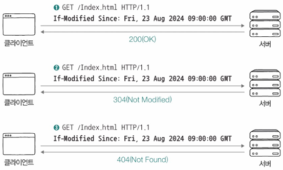
1. 요청한 자원이 변경된 경우: `200 OK` 응답과 함께 새로운 자원 반환
2. 요청한 자원이 변경되지 않은 경우: `304 Not Modified` 응답
   - 304(Not Modified) - 자원이 변경되지 않음 → 캐시된 자원을 참조하라
   - Last-Modified = 마지막 변경 시점<br>
  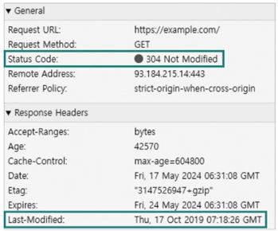
3. 요청한 자원이 삭제된 경우: `404 Not Found` 응답

### `If-None-Match` 헤더 사용 시 서버 응답
1. 요청한 자원이 변경된 경우: `200 OK` 응답과 함께 새로운 자원 반환
2. 요청한 자원이 변경되지 않은 경우: `304 Not Modified` 응답 - 자원이 변경되지 않음 → 캐시된 자원을 참조하라
3. 요청한 자원이 삭제된 경우: `404 Not Found` 응답 - 자원 존재하지 않음

# 3. 콘텐츠 협상
## 3.1 표현(Expression)
  - 송수신 가능한 자원의 형태
  - 같은 자원도 여러 가지 표현 있을 수 있음 ex) URI(URL)로 식별
  - GET 메서드의 정확한 목적: 자원 조회X, `자원의 특정 표현 조회`O

## 3.2 콘텐츠 협상(Content Negotiation)
  같은 자원에 대해 할 수 있는 여러 표현 중 클라이언트가 가장 적합한 자원의 표현 제공하는 기술

### 대표적인 콘텐츠 협상 헤더
- `Accept`: 선홓하는 미디어 타입 나타내는 헤더 (예: `text/html, application/json`)
- `Accept-Language`: 선호하는 언어 나타내는 헤더 (예: `en-US, ko-KR`)
- `Accept-Encoding`: 선호하는 인코딩 방식 나타내는 헤더 (예: `gzip, deflate`)

### <참고> 클라이언트가 우선순위 반영해서 여러 표현에 대한 선호도 서버에 알릴 수 있음
- **q(Quality Value)값**: 특정 표현 얼마나 선호하는지 나타내는 값 (0~1)
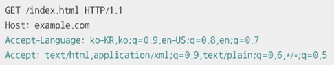

# 4. 보안: SSL/TLS와 HTTPS

## 4.1 HTTPS
- HTTP에 SSL/TLS를 적용한 보안 프로토콜
- 통신을 암호화하여 도청 및 데이터 변조를 방지

## 4.2 SSL/TLS
- **SSL(Secure Sockets Layer)**: 초기 보안 프로토콜, 현재는 거의 사용되지 않음
- **TLS(Transport Layer Security)**: SSL의 개선 버전으로 현재 사용되는 표준 프로토콜

## 4.3 TLS 1.3 기반 HTTPS 메시지 송수신 과정
1. TCP 3-way Handshake: 클라이언트와 서버 간 연결 설정
2. **TLS Handshake**: 보안 연결 설정, 대칭 키 교환
   - HTTPS 메시지 송수신 = 일반적 HTTP 메시지 송수신 + TLS 핸드셰이크
   - TLS 핸드셰이크의 핵심
     - TLS 핸드셰이크를 통해 암호화 통신을 위한 키를 생성/교환 가능
     - TLS 핸드셰이크를 통해 인증서 송수신과 검증 이뤄질 수 있음<br>
    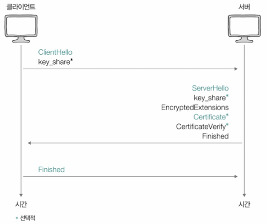
3. 메시지 송수신: 암호화된 데이터 전송

### 암호화 통신을 위한 키
- 암호화 알고리즘: 암호화 수행하는 알고리즘
- TLS에서 활용되는 암호화 알고리즘 통해 평문을 암호화하거나 복호화하는데 `키` 필요
- **키(Key)**<br>
  - TLS 핸드셰이크 과정에서 ClientHello 메시지, ServerHello 메시지 주고받으면서 키 생성/교환
  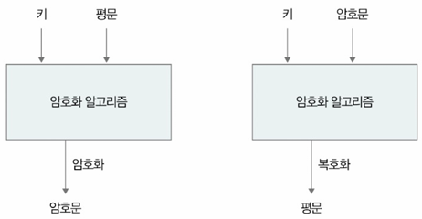
  - **대칭키 암호화**: 동일한 키를 사용하여 암호화 및 복호화
  - **비대칭키 암호화**: 공개키(public key)와 개인키(private key) 사용
- 암호 스위트 (Cipher Suite)
    암호화 알고리즘 및 해시 함수(키 교환 방식)의 조합을 정의한 집합
    - 예: `TLS_AES_128_GCM_SHA256`

### 인증서 및 인증 기관(CA)
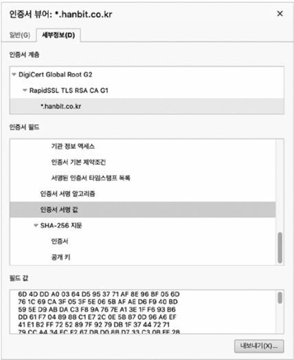
- **SSL/TLS 인증서**: 서버의 신원을 보장하는 전자 문서
- **CA (Certificate Authority, 인증 기관)**: 신뢰할 수 있는 제3자(공인 기관)로 인증서를 발급 및 관리

### TLS 인증서 및 인증서 검증
- Certificate 메시지: 인증서 서명 값 등 인증서 내용들 포함
- CertificateVerify 메시지: 인증서 내용이 올바른지 검증하기 위한 메시지
- 이렇게 서버-클라이언트 간 암호화에 사용할 키 획득하고 서로 인증하면 마지막으로 TLS 핸드셰이크 마지막인 Finishied 메시지를 주고받고 이후부터 TLS 핸드셰이크 통해 얻어낸 키를 기반으로 암호화된 데이터 주고 받음<br>
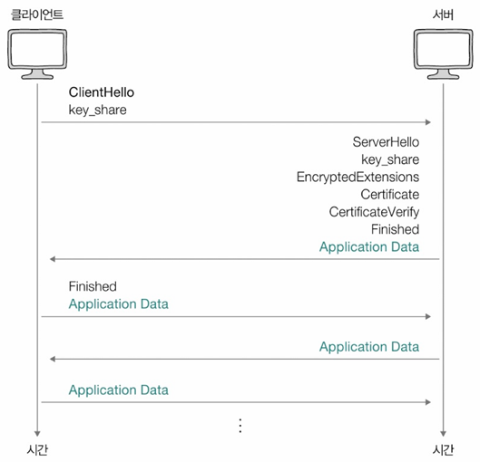

---
# 7. 프록시와 안정적인 트래픽

## 1. 오리진 서버와 중간 서버: 포워드 프록시와 리버스 프록시
- **오리진 서버**
  - 자원을 생성하고 클라이언트에게 권한 있는 응답 보낼 수 있는 HTTP 서버
  - 클라이언트의 요청을 직접 처리하는 서버 → 원본 데이터를 저장하고 응답을 제공하는 역할
  - 하지만 대량의 트래픽이 발생하면 부하가 증가할 수 있어서 **프록시(proxy)**를 통해 요청을 중개하는 방식이 활용
  - 다중화된 오리진 서버<br>
    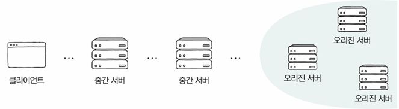

<추가>
- 가용성(availability): 서버, 네트워크, 특정 HW 부품 비롯한 특정 컴퓨터 시스템이 주어진 기능 실제로 수행할 수 있는 시간의 비율
- 고가용성(HA; High availability) == 가용성이 높다 : 주어진 기능 문제없이 수행하는 시간의 비율 높으면
- 서버의 다중화 → 고가용성을 위한 설계

### 1.1 대표적 HTTP 중간 서버 유형
1. **프록시(Proxy)**
   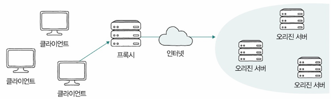
   - 클라이언트가 선택한 메시지 전달의 대리자(심부름꾼, 대리인)
   - 주로 캐시 저장, 클라언트 암호화 및 접근 제한 등의 기능 제공
   - 일반적으로 오리진 서버보다 클라이언트와 더 가까이 위치
2. **게이트웨이(Gateway)**
   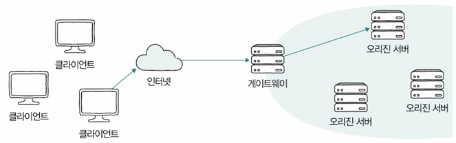
   - 오리진 서버(들) 향하는 요청 메시지를 먼저 받아서 오리진 서버(들)에게 전달하는 문지기 및 경비
   - 요청 메시지 보내는 네트워크 외부 클라이언트 시각에서 보면 오리진 서버같이 보임
   - 그래서 일반적으로 클라이언트보다 오리진 서버(들)에 더 가까이 위치
   - 캐시 저장, 부하 분산하는 로드 밸런서 동작

<추가>
- 포워드 프록시 ≒ 프록시
  - 클라이언트의 요청을 대신 수행하는 서버로 익명성을 제공하고 보안을 강화하는 역할
  - 기업 내부망에서 인터넷 접근을 통제하거나 캐싱을 활용해 성능을 최적화하는 데 사용 
- 리버스 프록시 ≒ 리버스 프록시+α
  - 클라이언트의 요청을 오리진 서버 대신 받아 처리하는 서버
  - 로드 밸런싱을 통해 부하를 분산, SSL 암호화를 수행, 캐싱을 활용해 응답 속도를 최적화하는 기능

## 2. 고가용성: 로드 밸런싱과 스케일링
### 2.1 고가용성
> 가용성 = 업타임 / (업타임 + 다운타임)
- 업타임(uptime): 정상적인 사용 시간
- 다운타임(downtime): 모종의 이유로 정상적인 사용 불가능한 시간
  - 다운 타임 발생 원인(아주 다양)
    - 과도한 트래픽으로 인한 서비스 다운
    - 예기치 못한 SW 상 오류 또는 HW 장애
    - 보안 공격
    - 자연 재해 등
  - 다운 타임 원인 원천 차단은 현실적으로 불가능
⇒ **결함 감내(Fault Tolerance)**
    - 문제 원천 차단 불가
    - 고가용성 유지하기 위해 `문제 발생해도 계속 기능할 수 있도록 설계`
    - 결함 감내 대표 기술: 다중화 - 서버 다중화 시, 특정 서버 문제 생겨도 다른 예비 서버가 대신 동작 가능
    - 페일오버(Failover): 동작하는 시스템 문제 생겼을 때 예비된 시스템으로 자동 전환
- 특정 시스템 안정성 평가위해 가용성 백분율 값 사용
  - 예: 파이브 나인스(=99.999%) - 일반적으로 '안정적'이라 평가받는 가용성 백분율 값

<추가>
- 헬스 체크(Health Check): 다중화된 서버 환경에서 현재 문제 있는 서버가 있는지, 현재 요청에 올바른 응답 가능한 상태인지 주기적으로 검사<br>
    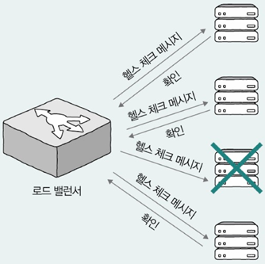
- 하트비트(heartbeat): 서버 간 주기적으로 하트비트 메시지 주고 받다가 메시지 끊기면 문제 발생 감지

### 2.2 로드 밸런싱(Load Balancing)
여러 서버에 트래픽을 분산해 부하를 줄이는 기술

- 로드 밸런서(Load Balancer)
  - 로드 밸런싱 수행
  - 다중화된 서버와 클라이언트 사이 위치해서 클라이언트의 요청(들)을 각 서버에 균등하게 분배
- 대표적인 로드 밸런싱 SW: HAProxy, Envoy 등 (Nginx는 로드 밸런싱 기능 내장)
- 
#### 로드 밸런싱 알고리즘
부하 균등하게 분산되도록 요청 전달할 서버 선택하는 방법
- **라운드 로빈 알고리즘**: 순차적으로 서버에 요청 분배
- **최소 연결 알고리즘**: 현재 연결이 가장 적은 서버로 분배
- 해시 이용, 단순 무작위 부하 전달, 응답시간 가장 짧은 서버로 분배 등 여럿 있음
- **가중치 기반 분배** - 서버 성능에 따라 트래픽을 차등 분배
  - 다중화된 모든 서버에 균일한 부하 부여는 모든 서버의 성능이 동일하단 전제에서만 유효
  - 각각 알고리즘을 바탕으로 동작하되, 가중치가 높은 서버가 더 많이 선택되어 더 많은 부하 받도록<br>
    

### 2.3 스케일링: 스케일 업 스케일 아웃 오토스케일링
- 꼭 비싼 장비만으로 가용성이 높아지는 건 아님!
- **스케일링**: 트래픽 증가에 맞춰 서버 자원을 확장하는 방법
  - **스케일 업(=수직적 확장)(scale-up)**은 기존 서버의 성능을 향상시키는 방식<br>
    
    - 장점: 설치와 구성 단순 - 더 좋은 장비로 교체하면 됨
    - 단점: 스케일 아웃 보다 유연성↓ - 하나의 스케일 업 장비 성능에 한계 있으면 스케일 아웃 하지 않는 이상 계속 더 비싸고 성능 좋은 장비 필요
  - **스케일 아웃(=수평적 확장)(scale-down)**은 서버의 개수를 증가시키는 방식<br>
  - 
    - 장점: 스케입 업 확장 보다 결함 감내 용이 - 장비 하나 고장나도 다른 장비가 그 장비 대체 용이
  - 오토스케일링(Auto Scaling): 실시간 트래픽 변화에 따라 서버를 자동으로 확장하거나 축소하는 기술
    - 필요할 때마다 시스템 동적으로 확대/축소 가능
    - 자원 더욱 경제적, 탄력적 이용 가능한

## 3. Nginx를 활용한 로드 밸런싱
로드 밸런싱을 구현하는 대표적인 방법 - **Nginx**를 활용
1. `${nginx}/nginx.conf` - 가장 기본적인 설정 파일이나 모든 설정들의 시작점 파일
2. `${nginx}/log/nginx/디렉터리` - Nginx 관련 로그 정보 저장
3. `${nginx}/conf.d/디렉터리` - 각종 설정 파일 포함
  - http: 웹 서버 관련 설정
  - access log: 웹 서버가 수신한 개별 요청 관련 로그 - '/var/log/nginx/access.log'
  - error log: 웹 서버와 관련한 오류 관련 로그 - '/var/log/nginx/error.log'
  - conf.d: '/etc/nginx/conf.d' 경로에 놓인 <파일명>.conf 내용은 모두 웹 서버 관련 설정으로 간주

<추가>
오리진 서버가 최상위 위치한 서버로 간주 시,<br>
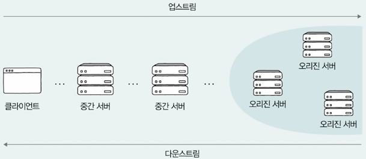
- 업스트림(upstream): 상위 서버로 데이터 보내는 방향
  - 업스트림 트래픽: 클라이언트에서 오리진 서버로 향하는 트래픽  
- 다운스트림(downstream): 상위 서버에서 클라이언트로 데이터 보내는 방향

- 인바운드(inbound) 트래픽: 외부에서 서버로 접근하려는 요청
  - 예: 외부 인터넷 사용자들이 회사 웹사이트 접속하는 트래픽 - 회사 입장에서 인바운드 트래픽
- 아웃바운드(outbound) 트래픽: 서버에서 클라이언트로 나가는 트래픽
  - 예: 회사 직원이 외부 웹사이트 방문할 때 생성되는 트래픽 - 회사 입장에서 아웃바운드 트래픽

## <추가 학습> 웹 서버와 웹 애플리케이션 서버
- **웹 서버** 
  - 서버의 역할 수행하는 HW + 서버 역할의 SW
    - SW 맥락에서의 웹 서버 - Nginx, 아파치 HTTP 서버, 마이크로소프트 IIS 등
  - `정적인 정보` 응답
    - 송수신 과정에서 수정, 처리 필요 없는 정보
    - 언제, 어디서, 누가 봐도 변치 않을 정보
    - 예: HTML, CSS, JavaScript 등의 파일, 이미지 파일, 동영상 파일 등
  - HTTP 요청을 처리하는 역할
  +) 동적인 정보: 송수신 과정에서 수정, 처리 필요한 정보 → DB에 저장된 값을 다양하게 조회하거나 데이터를 다양하게 전처리해야 하는 정보
    
- **웹 애플리케이션 서버(WAS; Web Application Server)**: 데이터베이스와의 연동, 비즈니스 로직 실행 등 동적 콘텐츠 처리를 담당
  - 예: 아파치 톰캣, JBOSS, WebSphere 등
- 웹 서비스에서 웹 서버 & 웹 애플리케이셥 서버 동시에 사용되는 경우 많음
  - 예: 웹 서비스가 수신하는 요청 - 정적인 정보는 웹 서버가 응답, 동적인 정보는 WAS가 응답
  - 이런 식으로 설계하면 과도한 부하 분산 가능, 여러 웹 애플리케이션 연동해서 확장에도 유리<br>
    
- **미들웨어(Middleware)**
  - OS와 응용 프로그램 사이 조정하고 중개하는 중간 다리 역할의 SW
  - 웹 애플리케이션 서버는 미들웨어의 일종
  - 서버 개발 맥락에서 응용 프로그램 예시: 각종 웹 프레임워크로 만든 프로그램 
    - SpringBoot 실행 후 로그에 웹 애플리케이션 서버(Tomcat)도 덩달아 실행<br>
    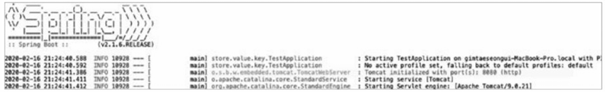

## <추가 학습> 소켓 프로그래밍
- **네트워크 소켓(socket)** - Like. 우체통
  프로세스 간 네트워크 동신의 엔드포인트(endpoint)
  - 두 프로세스가 소켓 '열고', 송신지 프로세스가 메시지를 소켓에 '쓰고', 수신지 프로세스가 메시지를 소켓에서 '읽음'
  - 많은 OS에서 파일처럼 간주
  - 소켓 입출력과 관련해 다양한 시스템 콜 존재
    
---
# Question
## Q1. HTTP에서 상태를 유지하는 방법에는 무엇이 있나요?
HTTP는 기본적으로 상태를 유지하지 않는 Stateless 특성을 가지고 있기 때문에 클라이언트와 서버 간의 상태 정보를 유지하려면 별도의 방법이 필요합니다. 이를 위해 쿠키와 웹 스토리지가 사용됩니다.

쿠키는 클라이언트의 상태 정보를 저장하고 관리하는 작은 데이터 조각으로 서버에 자동으로 저장됩니다.

웹 스토리지는 클라이언트에서 데이터를 저장하는 공간으로, 서버에 자동으로 전송되지 않습니다. 웹 스토리지에는 로컬 스토리지와 세션 스토리지가 있는데 로컬 스토리지는 브라우저를 닫아도 데이터가 유지되지만, 세션 스토리지는 브라우저 세션이 종료되면 데이터가 삭제됩니다. 이를 통해 클라이언트 측에서 상태를 유지하면서도 서버의 부하를 줄일 수 있습니다.

## Q2. HTTP 응답을 더 빠르게 받을 수 있도록 하는 방법은?
HTTP 응답을 빠르게 받기 위해서는 캐시를 활용하는 것이 가장 효과적입니다. 

캐시는 서버에서 응답받은 자원의 사본을 임시 저장해서 이후 동일한 요청이 발생할 때 불필요한 네트워크 사용을 줄이고 응답 시간을 단축하는 역할을 합니다.

## Q3. HTTPS는 어떻게 보안을 강화하나요?
HTTPS는 HTTP에 SSL/TLS 프로토콜을 적용하여 데이터를 암호화하고 도청 및 데이터 변조를 방지하는 보안 프로토콜입니다.

HTTPS는 TLS Handshake 과정을 거쳐 보안 연결을 설정합니다. 이 과정에서 클라이언트와 서버는 ClientHello 및 ServerHello 메시지를 주고받으며 서버가 SSL/TLS 인증서를 제공하여 신뢰성을 검증합니다.

이후 암호화 키를 교환하고 대칭키 암호화를 통해 데이터를 안전하게 주고받습니다.

HTTPS에서는 SSL/TLS 인증서를 통해 서버의 신뢰성을 검증할 수 있습니다. 인증서는 CA에 의해 발급되며 이를 통해 클라이언트가 신뢰할 수 있는 서버와 통신하고 있음을 보장합니다.