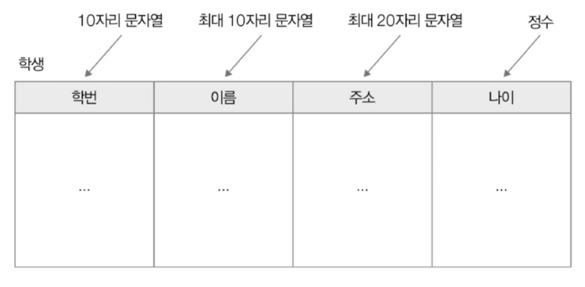
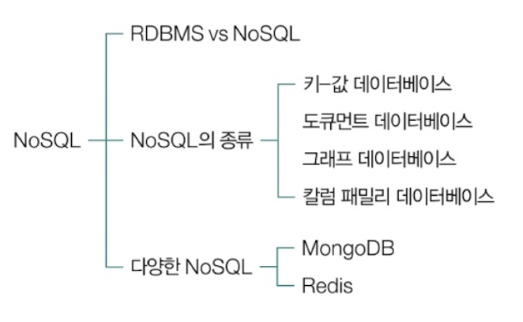
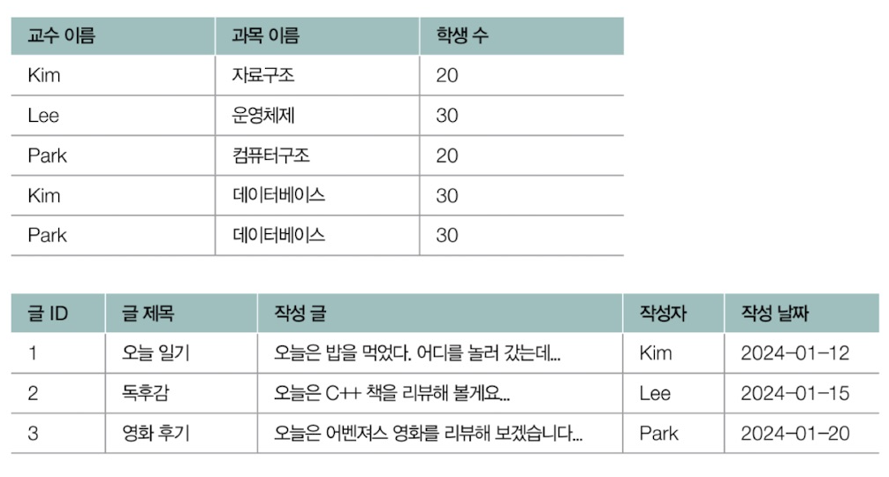

- [6장 데이터베이스](#6장-데이터베이스)
- [1. 데이터베이스의 큰 그림](#1-데이터베이스의-큰-그림)
  - [1-1. 데이터베이스와 DBMS](#1-1-데이터베이스와-dbms)
    - [(1) DBMS의 종류](#1-dbms의-종류)
    - [(2) 서버로서의 DBMS](#2-서버로서의-dbms)
  - [1-2. 파일 대신 데이터베이스를 이용하는 이유](#1-2-파일-대신-데이터베이스를-이용하는-이유)
    - [(1) 데이터 일관성 및 무결성 제공이 어려움](#1-데이터-일관성-및-무결성-제공이-어려움)
    - [(2) 불필요한 중복 저장이 많아짐](#2-불필요한-중복-저장이-많아짐)
    - [(3) 데이터 변경 시 연관 데이터 변경이 어려움](#3-데이터-변경-시-연관-데이터-변경이-어려움)
    - [(4) 정교한 검색이 어려움](#4-정교한-검색이-어려움)
    - [(5) 백업 및 복구가 어려움](#5-백업-및-복구가-어려움)
  - [1-3. 데이터베이스의 저장 단위와 트랜잭션](#1-3-데이터베이스의-저장-단위와-트랜잭션)
    - [(1) 데이터베이스의 저장 단위](#1-데이터베이스의-저장-단위)
      - [1. 논리적 개념](#1-논리적-개념)
      - [2. 물리적 개념](#2-물리적-개념)
    - [(2) 스키마](#2-스키마)
    - [(3) 트랜잭션과 ACID](#3-트랜잭션과-acid)
      - [🚫 여기서 잠깐, 트랜잭션이라는 범용적 용어](#-여기서-잠깐-트랜잭션이라는-범용적-용어)
      - [1. 원자성](#1-원자성)
      - [🚫 여기서 잠깐, 커밋과 롤백](#-여기서-잠깐-커밋과-롤백)
      - [2. 일관성](#2-일관성)
      - [3. 격리성](#3-격리성)
      - [4. 지속성](#4-지속성)
  - [1-4. 데이터베이스 지도 그리기](#1-4-데이터베이스-지도-그리기)
- [2. RDBMS의 기본](#2-rdbms의-기본)
  - [2-1. 테이블의 구성: 필드와 레코드](#2-1-테이블의-구성-필드와-레코드)
    - [(1) 필드 타입](#1-필드-타입)
    - [(2) 키](#2-키)
      - [1. 후보 키](#1-후보-키)
      - [2. 복합 키](#2-복합-키)
      - [3. 슈퍼 키](#3-슈퍼-키)
      - [4. 기본 키](#4-기본-키)
      - [5. 대체 키](#5-대체-키)
      - [6. 외래 키](#6-외래-키)
  - [2-2. 테이블의 관계](#2-2-테이블의-관계)
    - [(1) 일대일 대응 관계](#1-일대일-대응-관계)
    - [(2) 일대다 대응 관계](#2-일대다-대응-관계)
    - [(3) 다대다 대응 관계](#3-다대다-대응-관계)
  - [2-3. 무결성 제약 조건](#2-3-무결성-제약-조건)
    - [(1) 도메인 제약 조건](#1-도메인-제약-조건)
      - [🚫 여기서 잠깐, 원자 값](#-여기서-잠깐-원자-값)
    - [(2) 키 제약 조건](#2-키-제약-조건)
    - [(3) 엔티티 무결성 제약 조건](#3-엔티티-무결성-제약-조건)
    - [(4) 참조 무결성 제약 조건](#4-참조-무결성-제약-조건)
      - [🚫 여기서 잠깐, 참조하는 테이블이 삭제/수정되는 경우](#-여기서-잠깐-참조하는-테이블이-삭제수정되는-경우)
- [Q\&A](#qa)
  - [Q1. 트랜잭션의 의미와 ACID에 대해 설명하세요.](#q1-트랜잭션의-의미와-acid에-대해-설명하세요)
  - [Q2. 키의 종류에 대해 설명하세요.](#q2-키의-종류에-대해-설명하세요)
  - [Q3. 무결성 제약 조건에 대해 설명해주세요.](#q3-무결성-제약-조건에-대해-설명해주세요)

# 6장 데이터베이스
# 1. 데이터베이스의 큰 그림
- 데이터베이스 관리 체계 : DBMS

## 1-1. 데이터베이스와 DBMS 
- **데이터베이스** 
  - 사전적 정의 : 여러 사람이 공유하여 사용할 목적으로 체계화해 통합, 관리하는 데이터의 집합 
  - 의미적 정의 : 원하는 기능을 동작시키기 위해 마땅히 저장해야 하는 `정보의 집합`
- **데이터베이스 관리 시스템 (DBMS, Database Management System)**
  - 데이터베이스를 관리하기 위한 프로그램

### (1) DBMS의 종류
- DBMS의 2가지 유형
  1. **관계형 데이터베이스 관리 시스템 (RDBMS, Relational DataBase Management System, 관계형 데이터 베이스)**
     - 예 : MySQL, Oracle, PostgreSQL, SQLite, MariaDB, Microsoft SQL Server
     - 주로 사용됨
  2. **NoSQL 데이터베이스 관리 시스템 (NoSQL DBMS, NoSQL 데이터베이스)**
     - MongoDB, Redis

### (2) 서버로서의 DBMS 
- DBMS : 데이터베이스 관리를 위해 개발자가 만든 프로그램과 상호작용하며 실행되는 프로그램
   
  - 응용 프로그램들의 입장에서 바라본 `DBMS는 서버와 같음`
    - 클라이언트-서버 간 동작과 유사
    - 쓰리웨이 핸드셰이크로 TCP 연결
    - 데이터베이스 접속을 위한 인증
    - DBMS 클라이언트가 DBMS에 `쿼리`를 보냄 (클라이언트가 서버에 요청하듯)
      - DBMS의 데이터베이스 언어를 통해 데이터베이스를 다룰 수 있음
        - 예 : SQL (Structured Query Language) - 데이터를 조작하고 관리하기 위한 언어로 데이터베이스에 `질의(Query)`하기 위해 구조화된 언어

<br>

- **SQL의 4가지 종류**
  - DDL (Data Definition Language) : 데이터 정의
  - DML (Data Manipulation Language) : 데이터 조작
  - DCL (Data Control Language) : 데이터 제어
  - TCL (Transaction Control Language) : 트랜잭션을 제어

| 종류  |   명령    |                               설명                               |
| :---: | :-------: | :--------------------------------------------------------------: |
|  DDL  |  CREATE   | 데이터베이스 혹은 테이블, 뷰, 인덱스 등의 데이터베이스 객체 생성 |
|       |   ALTER   |                      데이터베이스 객체 갱신                      |
|       |   DROP    |                      데이터베이스 객체 삭제                      |
|       | TRUNCATE  |             테이블 구조를 유지한 채 모든 레코드 삭제             |
|  DML  |  SELECT   |                       테이블의 레코드 조회                       |
|       |  INSERT   |                       테이블의 레코드 삽입                       |
|       |  UPDATE   |                       테이블의 레코드 갱신                       |
|       |  DELETE   |                       테이블의 레코드 삭제                       |
|  TCL  |  COMMIT   |                     데이터베이스에 작업 반영                     |
|       | ROLLBACK  |                    작업 이전의 상태로 되돌림                     |
|       | SAVEPOINT |                        롤백의 기준점 설정                        |
|  DCL  |   GRANT   |                       사용자에게 권한 부여                       |
|       |  REVOKE   |                      사용자로부터 권한 회수                      |

## 1-2. 파일 대신 데이터베이스를 이용하는 이유
### (1) 데이터 일관성 및 무결성 제공이 어려움
- 여러 명의 사용자, 프로그램이 동시다발적으로 데이터베이스를 사용함  
  => `레이스 컨디션` 문제 발생
  - 데이터 일관성 훼손 가능성 존재 (= 데이터 무결성 보장이 어려움)
    - 저장된 파일에 대한 모든 접근에 일일이 동기화 도구를 사용하는 것은 번거로움
    - 파일에 명시된 데이터의 무결성을 일일이 검사하는 것도 번거로움  

### (2) 불필요한 중복 저장이 많아짐
- 다량의 데이터 관리 시 불필요한 중복 저장은 큰 저장 공간 낭비로 이어질 수 있음
- 파일에서 필요성에 따라 정보를 저장했지만 파일끼리 중복된 정보가 있을 수 있음

### (3) 데이터 변경 시 연관 데이터 변경이 어려움 
- 정보를 업데이트 하는 경우 동일한 정보가 여러 파일에 있어 모두 찾아 수정해야함

### (4) 정교한 검색이 어려움 
- 파일 내 검색은 문자열에 국한되어 정교한 검색이 어려움 

### (5) 백업 및 복구가 어려움 
- 데이터베이스는 여러 사용자 및 프로그램이 동시다발적으로 이용하여 많은 데이터베이스에서 백업과 복구 기능을 제공
- 단순입출력에서는 애초에 백업 및 복구 기능을 제공하지 않거나 부족한 수준으로 지원

## 1-3. 데이터베이스의 저장 단위와 트랜잭션 
- 데이터베이스에 저장 대상
- 데이터베이스의 연산
- 데이터베이스 저장 단위 : 엔티티, 스키마, 트랜잭션 

### (1) 데이터베이스의 저장 단위 
#### 1. 논리적 개념
  - **엔티티 (Entity) : 독립적으로 존재할 수 있는 객체**
    - 어떠한 특성을 가진 대상이면 모두 엔티티가 될 수 있음
    - 
  - **속성 (Attribute) : 엔티티의 특성** 
    - 그램에서 구매자 ID, 구매자의 이름과 성별, 제품 번호와 이름 
    - 예시   
  ① 구매자 ID 속성 = 123, 구매자 이름 속성 = ' 김한빛 ', 구매자 성별 속성 = 남자  
  ② 구매자 ID 속성 = 321, 구매자 이름 속성 =' 김빛한 ', 구매자 성별 속성 = 여자  
  ③ 제품 번호 속성 = abc123, 제품 이름 속성 =' 혼공 노트북'  
  ④ 제품 번호 속성 = def321, 제품 이름 속성 =
  '이것이 키보드'  

  - **엔티티 집합 : 같은 속성을 공유하는 개별 엔티티**
    - ①, ② : `구매자` 엔티티 집합
    - ③, ④ : `제품` 엔티티 집합
    - 
    - 데이터베이스 내에 엔티티 집합이 정의될 수 있음
    - 엔티티 집합에 속한 다양한 개별 엔티티들이 저장될 수 있음
    - **릴레이션 (relation)** : RDBMS 표현되는 이차원 테이블 형태의 엔티티 집합
    - **컬렉션 (collection)** : NoSQL DBMS의 엔티티 집합

  - **도메인 : 엔티티 속성이 가질 수 있는 값의 집합**
    - 구매자 성별의 도메인 : {남자, 여자}

#### 2. 물리적 개념
  - **레코드 : 데이터베이스에 저장된 대상으로 기록된 각각의 엔티티**
    - RDBMS : 레코드 = 테이블의 행
    - NoSQL DBMS : 레코드 = Json 형태의 도큐먼트
  - **필드 : 데이터베이스에 저장된 엔티티 속성**
    - RDBMS : 필드 = 테이블의 열
    - NoSQL DBMS : 필드 = Json 키
    - **차수 (degree)** : 필드의 수 
    - **카디널리티 (cardinality)** : 한 필드의 고유 값의 수
      - 카디널리티가 낮을수록 중복된 속성이 많음

| 구분                        | 논리적 개념                          | 물리적 개념 : RDBMS (관계형 DB)                        | 물리적 개념 : NoSQL (비관계형 DB)                | 설명                                         |
| --------------------------- | ------------------------------------ | ---------------------------------------- | ---------------------------------- | -------------------------------------------- |
| **엔티티(Entity)**          | 독립적으로 존재할 수 있는 객체       | 테이블(Table)                            | 컬렉션(Collection)                 | 엔티티가 실제로 테이블이나 컬렉션으로 구현됨 |
| **속성(Attribute)**         | 엔티티의 특성                        | 필드(Field) → 테이블의 열(Column)        | 필드(Field) → 도큐먼트의 키(Key)   | 엔티티의 속성이 필드로 저장됨                |
| **도메인(Domain)**          | 속성이 가질 수 있는 값의 집합        | 값의 제약 조건 (예: 성별 = {남자, 여자}) | 값의 제약 조건이 느슨함            | 속성이 가질 수 있는 값의 집합                |
| **엔티티 집합(Entity Set)** | 같은 속성을 공유하는 엔티티들의 집합 | 릴레이션(Relation) → 테이블의 구조       | 컬렉션(Collection) → 도큐먼트 집합 | 같은 구조의 데이터 묶음                      |
| **튜플(Tuple)**             | 엔티티의 구체적인 값 집합            | 레코드(Record) → 테이블의 행(Row)        | 도큐먼트(Document)                 | 엔티티의 개별 값이 저장됨                    |
| **차수(Degree)**            | 속성(열)의 개수                      | 열(Column)의 개수                        | 필드(Key)의 개수                   | 속성의 개수가 차수가 됨                      |
| **카디널리티(Cardinality)** | 고유 값의 개수                       | 고유 값의 개수                           | 고유 값의 개수                     | 속성 값에서 중복되지 않는 개수               |


### (2) 스키마
- **스키마** : 데이터베이스에 저장되는 **레코드의 구조와 제약 조건**을 정의한 것
  - 레코드가 지켜야 할 틀이자 청사진
    - 개별 레코드 : 붕어빵
    - 스키마 : 붕어빵 틀
  - 스키마가 `명확`히 정의되어 있으면 `정형화된 데이터`를 저장하고 관리하기 용이
    - RDBMS : 레코드를 테이블 내의 행으로 저장, 명확한 스키마 존재
      - 레코드는 스키마로 정해진 테이블의 구조, 필드의 데이터 타입, 제약 조건을 따라야 함
      - 
  - 스키마가 `없다면` `유연`한 형태의 데이터를 저장하고 관리하기가 용이 
    - NoSQL : 레코드를 컬렉션 내 도큐먼트로 저장, 명확한 스키마 없음, 스키마리스 데이터베이스 
      - 자유로운 형태의 레코드를 저장
      - 첫번째 도큐먼트
        ```Json
        {
            "name": "hanbit",
            "age": 30,
            "email": "hanbit@example.com"
        }
        ```
      - 두번째 도큐먼트
        ```Json
        {
            "name": "media",
            "age": 25,
            "email": "media@example.com",
            "address": {
                "street": "123 Main St",
                "city": "Somewhere",
                "zipcode": "12345"
            }
        }
        ```

### (3) 트랜잭션과 ACID 
- **트랜잭션 (Transaction) : 데이터베이스와의 논리적 상호작용의 단위** 
  - 여러개의 쿼리를 포함할 수 있음
    - 예시 : 아래 두가지 쿼리가 한 트랜잭션에 포함될 수 있음
      - 한빛이의 계좌 잔액 -5,000원
      - 빛한이의 계좌 잔액 +5,000원
  - **초당 트랜잭션 (TPS, Transaction Per Second)** : 데이터베이스가 처리하는 작업의 단위
    - 데이터베이스의 작업 성능을 나타냄 

#### 🚫 여기서 잠깐, 트랜잭션이라는 범용적 용어 
- `트랜잭션 용어, TPS 지표`는 `데이터베이스`에서 주로 언급되나 `하드웨어 부품(메모리)`와 `전자상거래의 거래 단위`로도 사용됨

<br>

- **ACID : 여러 작업을 내포하는 트랜잭션이 동시다발적으로 실행될 때 안전한 트랜잭션을 보장하기 위해 지켜야 하는 4가지 성질**
  - 원자성, 일관성, 격리성, 지속성

#### 1. 원자성
- **원자성 (Atomicity) : 하나의 트랜잭션 결과가 모두 성공하거나 모두 실패하는 성질**
  - 예시 : 아래 두가지 쿼리가 한 트랜잭션에 포함
      - 한빛이의 계좌 잔액 -5,000원
      - 빛한이의 계좌 잔액 +5,000원  
      `=> 둘 다 성공하거나, 한개가 실패해도 둘 다 취소되어야 함`
  - `All or Nothing`
    - 일부 성공, 일부 실패는 허용 X

#### 🚫 여기서 잠깐, 커밋과 롤백
- 원자성 : 트랜잭션이 반드시 커밋되거나 롤백되는 성질
- **커밋 (commit)** : 트랜잭션을 성공적으로 수행하여 트랜잭션을 종료하는 것
  - 트랜잭션으로 인한 변경 사항을 `확정`한다는 의미
- **롤백 (rollback)** : 이전 트랜잭션을 취소하는 작업
  - 트랜잭션이 이루어지기 전으로 `되돌릴 수 있음`


#### 2. 일관성
- **일관성 (Consistency) : 트랜잭션 전후로 데이터베이스가 일관된 상태를 유지하는 성질**
  - `일관된 상태` : 데이터베이스가 지켜야 하는 `일련의 규칙을 지키는 상태`
- **유의점**
  - 트랜잭션 이후 새로운 일관된 상태로 전이될 수 있지만 이 때에도 저장된 데이터는 모두 일관된 상태를 유지해야 함 
    - 규칙이 변경되더라도 `변경된 규칙이 모두 일관적으로 적용`되어야 함
  - 

#### 3. 격리성
- **격리성 (Isolation) : 동시에 수행되는 여러 트랜잭션이 서로 간섭하지 않도록 보장하는 성질**
  - 한 트랜잭션이 데이터에 접근하여 조작 중일 때 다른 트랜잭션이 동일한 데이터에 접근할 수 없음
  - `레이스 컨디션`을 `방지`하기 위한 성질

#### 4. 지속성
- **지속성 (Durability) : 트랜잭션이 성공적으로 완료된 후에 그 결과가 영구적으로 반영되는 성질**
  - 시스템 장애가 발생하더라도 완료된 트랜잭션의 결과는 손실되지 않아야 함
  - 오늘날 DBMS는 지속성을 보장하기 위한 회복 메커니즘이 구현되어 있음

## 1-4. 데이터베이스 지도 그리기
- RDBMS의 기본
  
- SQL 주요 개념, 쿼리 효율화
  
- 데이터베이스 설계
  
- NoSQL
  

<br>

- 데이터베이스의 큰 그림


<br> <br>

# 2. RDBMS의 기본
- 관계형 데이터베이스의 핵심
  1. 테이블의 구성
  2. 관계

## 2-1. 테이블의 구성: 필드와 레코드 
- RDBMS의 레코드 (행) = 테이블 형태

- **필드 타입** : 각 필드로 사용 가능한 `데이터 유형`
- **키** : 테이블 내의 `특정 레코드`를 식별할 수 있는 `필드의 집합`
  - 레코드의 식별, 테이블 간의 참조에 사용됨
- 필드 타입, 키를 통해 레코드의 데이터 유형을 확인하고 테이블 내 특정 레코드를 식별할 수 있음

### (1) 필드 타입
- RDBMS의 `테이블 필드`에는 `다양한 데이터 형식(타입, 필드 타입)`이 저장될 수 있음
- `MySQL`을 기준으로 정리된 `대표적인 필드 타입`


### (2) 키
- **키** : 테이블의 `레코드를 식별`할 수 있는 `하나 이상의 필드`
- 예시 : 키 - 레코드를 식별하기 위한 필드의 조합 

    - 첫번째 테이블 : 교수이름 + 과목이름
    - 두번째 테이블 : 글 ID / 글 제목 + 작성 날짜

<br>

- `테이블 간 참조`, `테이블의 접근 속도`를 높이기 위한 **다양한 종류의 키**
  1. 후보 키
  2. 복합 키
  3. 슈퍼 키
  4. 기본 키
  5. 대체 키
  6. 외래 키

#### 1. 후보 키
- **후보 키 (candidate key) : 테이블의 한 레코드를 식별하기 위한 필드의 최소 집합**
  - 후보 키는 `유일성`과 `최소성`을 모두 만족하는 키
    - **유일성** : 특정 레코드를 `유일하게 식별` 
    - **최소성** : `최소한의 정보`로 레코드를 식별 
  - 후보 키는 `하나 이상`의 필드로 구성될 수 있음 
  - 후보 키 중 하나라도 `생략`하면 레코드를 `고유하게 식별할 수 없음`

<br>

- 후보 키는 테이블 내 **여러 개 (하나 이상)** 존재할 수 있음
  - 예시 : 학생 테이블에서 여러 개의 후보 키
  
    - 학번, 이메일, 전화번호가 고유한 값인 경우 => 학번, 이메일, 전화번호 모두 각각 후보 키가 될 수 있음

#### 2. 복합 키
- **복합 키 (composite key) : 두 필드 이상으로 구성된 후보 키**
  - 예시 : 성적 테이블에서 복합 키
    
    - 후보 키 : 학번 + 과목 코드

#### 3. 슈퍼 키
- **슈퍼 키 (super key) : 레코드를 식별하기 위한 필드의 집합**
  - 레코드를 식별하기 위한 필드의 `최소 집합이 아님`
  - 유일성 만족, `최소성 만족 X`
    - 레코드 식별에 꼭 필요하지 않은 필드도 포함 가능

#### 4. 기본 키 
- **기본 키 (primary key, PK) : 한 레코드를 식별하도록 선정되어 테이블 당 하나만 존재할 수 있는 키**
  - 여러 후보 키 중 테이블의 `레코드를 대표하도록 선택된 키`
  - 후보 키의 일부로 `유일성, 최소성 만족`
    - 레코드를 구분하기 위한 `최소한의 정보`만으로 이루어짐
  - **중복 값이 없어야 하고 반드시 값이 존재해야 함**
    - NULL 값을 가질 수 없음
      - NULL : 값이 존재 하지 않는 것을 표기하는 방법
  - 여러 필드로 구성된 `복합 키도 기본 키로 선정 가능`
  - 예시 : 학생 테이블의 기본 키
    
    - 기본 키 : 학번

#### 5. 대체 키 
- **대체 키 (alternative key) : 기본 키가 아닌 후보키**
  - 기본 키 선정 이후에 남은 후보 키가 곧 대체 키

#### 6. 외래 키
- **외래 키 (foreign key, FK) : 다른 테이블의 기본 키를 참조하는 필드**
  - 테이블 간의 `참조 관계`를 형성할 때 사용하는 키
  - 예시 : 학생-과목 테이블 외래키 = 학생 테이블 (수강 과목), 과목 테이블 (개설 과목)
    
  - 예시 : 구매자-상품 목록 테이블 외래키 = 구매자 테이블 (장바구니), 상품 목록 테이블 (상품 ID)
    

## 2-2. 테이블의 관계
- 외래 키를 통해 테이블 간 참조하게 되며 발생한 **외래 키를 매개로 하는 테이블 간의 관계**
  1. 일대일 대응 관계
  2. 일대다 대응 관계
  3. 다대다 대응 관계

### (1) 일대일 대응 관계
- **일대일 대응 관계 : 하나의 레코드가 다른 테이블의 레코드 하나에만 대응되는 경우**
  - 예시 : 여권 테이블 (고객 번호) <-> 승객 테이블 (고객 번호)
    - 한 사람 당 오직 하나의 여권을 가질 수 있음
    
    - `여권 테이블에 속한 하나의 엔티티`는 `승객 테이블에 속한 하나의 엔티티`에 `대응`될 수 있음
    

### (2) 일대다 대응 관계
- **일대다 대응 관계 : 하나의 레코드가 다른 테이블의 여러 레코드와 대응될 수 있는 경우**
  - 예시 : 주문 테이블 (고객 ID) <-> 고객 테이블 (고객 ID)
    - `한 고객이 여러 건의 주문`을 할 수 있지만 `주문은 한 명의 고객에게만 속함`
      
    - `고객 테이블에 속한 엔티티 하나`는 `주문 테이블에 속한 여러 개의 엔티티`에 `대응`
      

### (3) 다대다 대응 관계
- **다대다 대응 관계 : 한 테이블의 여러 레코드가 다른 테이블의 여러 레코드와 대응되는 경우**
  - 예시 : 사용자 테이블 (사용자 ID) <-> 그룹 테이블 (사용자 ID)
    
    - `각 사용자는 여러 그룹에 가입`할 수 있고 각 그룹에는 `여러 사용자가 속할 수 있음`
    - 다대다 대응 관계는 일반적으로 `중간 테이블을 수반`
      - 중간 테이블 : 사용자 그룹
      - `중간 테이블`에 대한 `일대다 대응이 두번` 이루어진 것과 같음
        
        - 일대다 대응
          - 사용자 ID를 통한 사용자 그룹 <-> 사용자 그룹 테이블 
          - 그룹 ID를 통한 그룹 테이블 <-> 사용자 그룹 테이블

## 2-3. 무결성 제약 조건
- **무결성 : 일관되며 유효한 데이터의 상태**
- 무결성 오류

- **무결성 제약 조건** : 데이터베이스에 저장된 데이터의 `일관성과 유효성을 유지`하기 위해 `마땅히 지켜야 하는 조건`
    1. 도메인 제약 조건
    2. 키 제약 조건
    3. 엔티티 무결성 제약 조건
    4. 참조 무결성 제약 조건

### (1) 도메인 제약 조건
- **도메인 제약 조건 (domain constraint) : 테이블이 가질 수 있는 필드 타입과 범위에 대한 규칙**
  - `필드 데이터`가 `원자 값`을 가짐
  - 지정된 `필드 타입` 준수
  - `값의 범위나 기본값`이 지정되었을 경우 준수
  - `NULL 허용 조건` 준수

<br>

- 위의 제약 조건을 위배하는 데이터가 삽입/수정되는 경우 => `도메인 제약 조건 위배`
    

#### 🚫 여기서 잠깐, 원자 값 
- **원자 값 (atomic value) : 더 이상 쪼갤 수 없는 단일한 값**
  - DBMS는 `도메인 제약 조건`을 지키기 위해 `필드 데이터가 원자 값을 유지`해야 함
  - 예시 : 아래 테이블의 필드 데이터인 이름, 나이, 성별
    
  - 예시 : 원자 값이 아닌 테이블 
    


### (2) 키 제약 조건
- **키 제약 조건 (key constraint) : 레코드를 고유하게 식별할 수 있는 키로 지정된 필드에 `중복된 값이 존재해서는 안됨`**

### (3) 엔티티 무결성 제약 조건
- **엔티티 무결성 제약 조건 (entity integrity constraint) :  기본 키로 지정한 필드는 고유한 값이어야 하며, NULL이 되어서는 안됨**
  - `기본 키 제약 조건`이라고도 부름
    - 레코드를 식별할 수 있는 기본 키가 갖추어야 할 조건

### (4) 참조 무결성 제약 조건
- **참조 무결성 제약 조건 (referential integrity constraint) : 외래 키를 통한 다른 테이블을 참조할 때 데이터의 일관성을 지키기 위한 제약 조건**
  - `외래 키 제약 조건`이라고도 부름
    - `외래 키`는 참조하는 테이블의 `기본 키와 같은 값을 갖거나` `NULL 값`을 가져야 함

  

#### 🚫 여기서 잠깐, 참조하는 테이블이 삭제/수정되는 경우
- 예시 :  학생 테이블 (과목 필드) <-> 과목 테이블 (개설 과목) 참조
  - 외래 키로 참조하는 테이블의 레코드가 변경이나 삭제되는 경우
    - 개설 과목이 삭제되는 경우
        
    - 개설 과목이 변경되는 경우
        
    1. **연산 제한 (restrict) : 주어진 수정 및 삭제 연산 자체를 거부**
       - `학생 테이블`에서 `컴퓨터 구조 과목`을 참조하는 레코드가 존재하는 경우 `과목 테이블`의 `컴퓨터 구조 과목`을 삭제하거나 이름 `변경 불가`
    2. **기본값 설정 (set default) : 참조하는 레코드를 미리 지정한 기본값으로 설정**
       - `과목 테이블`의 `컴퓨터 구조 과목`이 `삭제`되면 학생 테이블의 해당 수강 과목이 `기본값으로 변경`됨
    3. **NULL 값 설정 (set null) : 참조하는 레코드를 NULL로 설정**
       - `과목 테이블`의 `컴퓨터 구조 과목`이 `삭제`되면 학생 테이블의 해당 수강 과목이 `NULL로 변경`
    4. **연쇄 변경 (cascade) : 참조하는 레코드도 함께 수정되거나 삭제**
       - `과목 테이블`의 `컴퓨터 구조 과목`이 `삭제`되면 `학생 테이블`의 `수강 과목 레코드도 삭제`됨
       - `과목 테이블`의 `컴퓨터 구조 과목` 이름이 `컴퓨터구조론및설계실습`으로 `변경`되면 `학생 테이블의 과목 이름도 변경`됨

# Q&A 
## Q1. 트랜잭션의 의미와 ACID에 대해 설명하세요.
A1. 트랜잭션은 데이터베이스와 논리적 상호작용의 단위를 의미하며 ACID는 여러 작업을 내포하는 트랜잭션이 동시다발적으로 실행될 때 안전한 트랜잭션을 보장하기 위해 지켜야 하는 4가지 성질을 의미합니다.

ACID에는 원자성, 일관성, 격리성, 지속성이 있습니다.
원자성이란 하나의 트랜잭션 결과가 모두 성공하거나 모두 실패하는 성질을 말하며 일관성은 트랜잭션 전후로 데이터베이스가 일관된 상태를 유지하는 성질을 말합니다.
격리성이란 동시에 수행되는 여러 트랜잭션이 서로 간섭하지 않도록 보장하는 성질을 말하며 레이스 컨디션을 방지합니다.
지속성은 트랜잭션이 성공적으로 완료된 후에 그 결과가 영구적으로 반영되는 성질을 말합니다.

## Q2. 키의 종류에 대해 설명하세요.
A2. 키의 종류에는 후보키, 복합키, 슈퍼키, 기본키, 대체키, 외래키가 있습니다.
후보키는 유일성과 최소성을 만족하는 키로 테이블의 한 레코드를 식별하기 위한 필드의 최소 집합입니다.
복합키는 두 필드 이상으로 구성된 후보 키이며, 슈퍼 키는 레코드를 식별하기 위한 필드의 집합으로 최소성을 만족하지 않습니다.
기본키는 한 레코드를 식별하도록 선정되어 테이블 당 하나만 존재할 수 있는 키로 유일성, 최소성을 만족하며 중복값이 없고 반드시 존재해야만 합니다.
대체키는 기본키가 아닌 후보키들을 말하며 외래키는 다른 테이블의 기본 키를 참조하는 필드를 말합니다.


## Q3. 무결성 제약 조건에 대해 설명해주세요.
A3. 무결성 제약 조건이란 데이터베이스에 저장된 데이터의 일관성과 유효성을 유지하기 위해 지켜야 하는 조건으로 도메인 제약 조건, 키 제약 조건, 엔티티 무결성 제약조건, 참조 무결성 제약 조건이 있습니다.
도메인 제약 조건은 테이블이 가질 수 있는 필드 타입과 범위에 대한 규칙으로 필드 데이터의 원자 값 여부, 필드 타입, 값의 범위나 기본값, NULL 허용 조건 등이 있습니다.
키 제약 조건은 레코드를 고유하게 식별할 수 있는 키로 지정된 필드는 중복된 값이 없어야 한다는 것이며,
엔티티 무결성 제약 조건은 기본 키로 지정한 필드는 고유한 값이며 NULL이 있으면 안된다는 것으로 기본 키 제약 조건과 동일합니다.
참조 무결성 제약 조건은 외래 키를 통한 다른 테이블을 참조할 때 데이터의 일관성을 지키기 위한 제약 조건으로 기본 키와 같은 값을 갖거나 NULL을 갖고 외래 키 제약 조건이라고 부릅니다.
