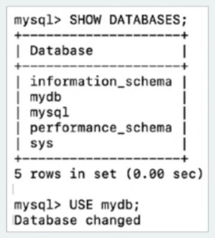
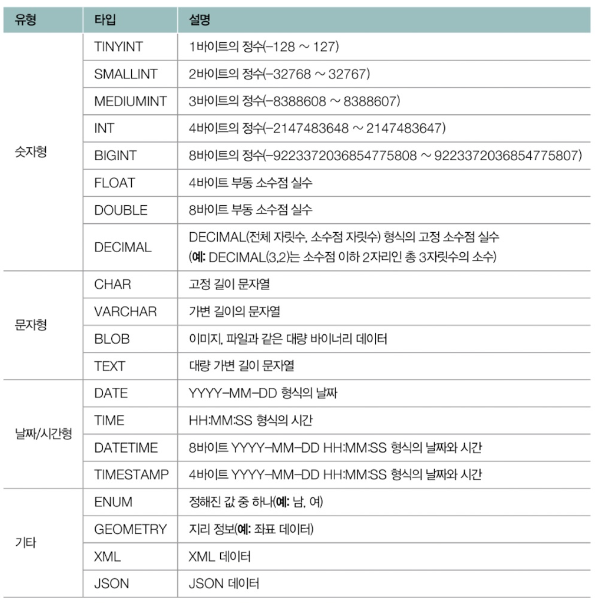
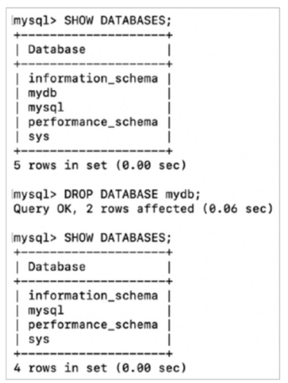
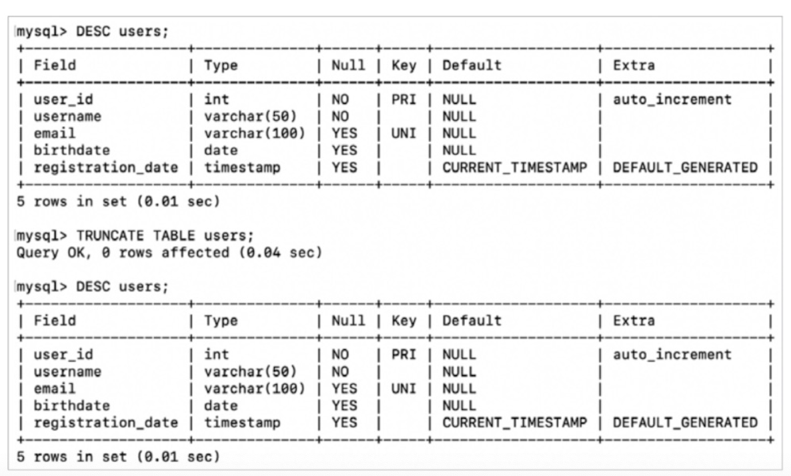

- [6장 데이터베이스](#6장-데이터베이스)
- [3. SQL](#3-sql)
  - [3-1. 데이터 정의 언어 (DDL, Data Definition Language)](#3-1-데이터-정의-언어-ddl-data-definition-language)
    - [(1) CREATE](#1-create)
    - [(2) ALTER](#2-alter)
    - [(3) DROP](#3-drop)
    - [(4) TRUNCATE](#4-truncate)
  - [3-2. 데이터 조작 언어 (DML, Data Manipulation Language)](#3-2-데이터-조작-언어-dml-data-manipulation-language)
    - [(1) INSERT](#1-insert)
    - [(2) UPDATE와 DELETE](#2-update와-delete)
      - [🚫 여기서 잠깐, 외래키 제약 조건 - ON UPDATE, ON DELETE](#-여기서-잠깐-외래키-제약-조건---on-update-on-delete)
    - [(3) SELECT](#3-select)
      - [🚫 여기서 잠깐, 패턴 검색과 연산/집계 함수](#-여기서-잠깐-패턴-검색과-연산집계-함수)
    - [(4) GROUP BY](#4-group-by)
    - [(5) HAVING](#5-having)
    - [(6) ORDER BY](#6-order-by)
    - [(7) LIMIT](#7-limit)
    - [(8) SELECT문 실행 순서](#8-select문-실행-순서)
  - [3-3. 트랜잭션 제어 언어 (TCL, Transaction Control Language)](#3-3-트랜잭션-제어-언어-tcl-transaction-control-language)
    - [(1) 트랜잭션 시작 : START TRANSACTION / BEGIN](#1-트랜잭션-시작--start-transaction--begin)
    - [(2) 트랜잭션 결과 : COMMIT](#2-트랜잭션-결과--commit)
    - [(3) 트랜잭션 결과 : ROLLBACK](#3-트랜잭션-결과--rollback)
      - [🚫 여기서 잠깐, 자동 커밋](#-여기서-잠깐-자동-커밋)
    - [(4) 저장 : SAVEPOINT](#4-저장--savepoint)
  - [3-4. 데이터 제어 언어 (DCL, Data Control Language)](#3-4-데이터-제어-언어-dcl-data-control-language)
    - [(1) GRANT](#1-grant)
    - [(2) REVOKE](#2-revoke)


# 6장 데이터베이스 
# 3. SQL 
## 3-1. 데이터 정의 언어 (DDL, Data Definition Language)
- DDL

    | 종류     | 설명                                                                       |
    | :------- | :------------------------------------------------------------------------- |
    | CREATE   | 데이터베이스 혹은 데이터베이스 객체 생성                                   |
    | ALTER    | 데이터베이스 객체 갱신 <br> (예 : 테이블에 필드 및 제약 조건을 추가, 삭제) |
    | DROP     | 데이터베이스 객체 삭제 <br> (예 : 테이블이나 데이터베이스를 삭제)          |
    | TRUNCATE | 테이블 구조를 유지한 채 모든 레코드 삭제                                   |
    - 데이터베이스 객체 : 데이터베이스에서 정의될 수 있는 대상을 통칭하는 용어
      - 예 : 인덱스, 뷰 등

### (1) CREATE 
- 데이터베이스 (CREATE DATABASE), 테이블 (CREATE TABLE), 뷰 (CREATE VIEW)나 인덱스 (CREATE INDEX), 그 외 사용자 (CREATE USER)까지 데이터베이스에서 관리될 수 있는 `다양한 대상을 정의`

<br>

- **데이터베이스 생성**  
`CREATE DATABASE 데이터베이스_이름 ;`

<br>

- **데이터베이스 조회**  
`SHOW DATABASES;`
    - 현재 DBMS에 생성된 모든 데이터베이스

    
<br>

- **특정 데이터베이스 사용**
`USE 데이터베이스 _ 이름 ;`

<br>

- **테이블 생성**
    ```SQL
        CREATE TABLE 테이블 _ 이름 (
        필드_ 이름 1 필드_ 타입 ,
        필드_ 이름 2 필드_ 타입 ,
        필드_ 이름 3 필드_ 타입 ,
        [CONSTRAINT 제약_조건 이름 ] PRIMARY KEY (필드_이름),
        [CONSTRAINT 제약_조건_이름 ] FOREIGN KEY (필드_이름) REFERENCES 테이블_이름2 (필드_이름),
        [CONSTRAINT 제약_조건_이름] UNIQUE (필드_이름),
        );
    ```
    - 소괄호의 한 줄, 한 줄(필드_이름 필드_타입) =  테이블의 열인 `필드`
    - 필드 타입 종류
        
    - **필드 제약 조건**
      - 필드 타입 `우측` 혹은 CREATE TABLE 문 `하단`에 키워드 명시

        | 키워드          | 제약 조건                                |
        | :-------------- | :--------------------------------------- |
        | PRIMARY KEY     | 특정 필드를 기본 키로 지정               |
        | UNIQUE          | 특정 필드가 고유한 값을 갖도록 설정      |
        | FOREIGN KEY     | 특정 필드를 외래 키로 지정               |
        | DEFAULT 기본값  | 기본값 지정                              |
        | NULL / NOT NULL | 특정 필드에 NULL 값을 허용/허용하지 않음 |
        - 고유키 (UNIQUE KEY) : UNIQUE 제약 조건이 명시된 필드
          - 기본 키와 유사점 : 중복되는 값을 가질 수 없음
          - 기본 키와 차이점 : 테이블 내 여러개 존재 가능, NULL 값을 가질 수 있음
      - 예시 : 필드 제약 조건 - 필드 타입 우측 작성
        ```SQL
        CREATE TABLE users (
            user_id INT PRIMARY KEY AUTO_INCREMENT,
            username VARCHAR(50) NOT NULL,
            email VARCHAR(100) UNIQUE,
            birthdate DATE,
            registration date TIMESTAMP DEFAULT CURRENT_TIMESTAMP,
            FOREIGN KEY (user_id) REFERENCES users(user_id)
        );
        ```
        - **use_id (기본 키)** : 레코드가 추가될 때마다 1씩 자동 증가(AUTOINCREMENT)
        - **username** : 최대 길이 50인 가변 길이 문자열, NULL 허용 X (NOT NULL)
        - **email** : 최대 길이 100, 고유한 값(UNIQUE)
        - **birthday** : 날짜 형식
        - **registration_date** : 기본값이 현재 타임스탬프 (DEFAULT CURRENT_TIMESTAMP)
        - **FOREIGN KEY** : use_id는 외래 키로 users 테이블의 use_id를 참조함
      - 예시 : 필드 제약 조건 - 하단 작성
        ```SQL
            CREATE TABLE tests (
            post_id INT AUTO_INCREMENT,
            user_id INT,
            title VARCHAR(50) NOT NULL,
            content VARCHAR (50),
            created_at TIMESTAMP DEFAULT CURRENT_TIMESTAMP,
            PRIMARY KEY (post_id),
            CONSTRAINT FK user_id FOREIGN KEY (user_id) REFERENCES users(user_id),
            CONSTRAINT UQ_title UNIQUE ( title )
        );
        ```

<br>

- **테이블 구조 조회**
    ```SQL
    DESCRIBE 테이블 _ 이름 ;
    -- 축약형
    DESC 테이블 _ 이름 ; 
    ```
    


<br>

- **데이터베이스에 속한 전체 테이블 확인**
    ```SQL
    SHOW TABLES;
    SHOW TABLES FROM 데이터베이스 _ 이름 ;
    ```
    - 현재 사용 중인 데이터베이스에 해당되는 모든 테이블

    

### (2) ALTER
- 이미 생성된 테이블에 새로운 **필드**를 **추가**하거나 기존의 필드를 **수정**, **삭제**할 수 있음
- 제약 조건을 새롭게 추가, 수정, 삭제할 수 있음
- 예시
    ```SQL
    -- 새로운 필드 추가
    -- ALTER TABLE 테이블 _ 이름 ADD COLUMN 필드_ 이름 필드_ 타입 [ 제약 조건 ]
    ALTER TABLE posts ADD COLUMN new_field VARCHAR(50) NOT NULL;

    -- 기존 필드 수정
    -- ALTER TABLE 테이블 _ 이름 CHANGE COLUMN 기존_필드_이름 새_필드_이름 필드_타입 [ 제약 조건 ]
    ALTER TABLE posts CHANGE COLUMN new_field old_field VARCHAR(30) NOT NULL;

    -- 기존 필드 삭제
    -- ALTER TABLE 테이블_이름 DROP COLUMN 필드_이름
    ALTER TABLE posts DROP COLUMN old_field;

    -- 외래 키 제약 조건 추가
    -- ALTER TABLE 테이블_이름 [ADD CONSTRAINT 제약_조건_이름 ]
        -- ADD FOREIGN KEY (필드_이름 ) REFERENCES 참조_테이블_이름 ( 참조_필드 )
    ALTER TABLE posts ADD FOREIGN KEY (user_id) REFERENCES users(user_id);

    -- UNIQUE 제약 조건 추가
    -- ALTER TABLE 테이블 _ 이름 [ADD CONSTRAINT 제약_조건_이름 ] UNIQUE ( 필드_이름 )
    ALTER TABLE postS ADD UNIQUE (title);

    -- NOT NULL 제약 조건 추가
    -- ALTER TABLE 테이블_이름 MODIFY 필드_이름 필드_타입 NOT NULL
    ALTER TABLE users MODIFY email VARCHAR(100) NOT NULL;

    -- 기본 키 설정 (PRIMARY KEY 로 사용 중인 필드가 없을 경우
    -- ALTER TABLE 테이블 _ 이름 ADD PRIMARY KEY ( 필드 _ 이름 )
    ALTER TABLE posts ADD PRIMARY KEY (post_id);
    ```
  - 테이블, 뷰, 인덱스 등에서도 적용 가능

### (3) DROP
- 테이블이나 데이터베이스를 **삭제**할 수 있음
    ```SQL
    DROP DATABASE 데이터베이스 _ 이름 ;
    DROP TABLE 테이블 _ 이름 ;
    ```
    

### (4) TRUNCATE
- 테이블의 **구조를 유지**한 채로 테이블의 모든 레코드를 **삭제**
  - `DESC` 명령 시 테이블이 존재하여 확인 가능 => 테이블 구조를 유지  
`TRUNCATE TABLE 테이블 _ 이름 ;`

  

## 3-2. 데이터 조작 언어 (DML, Data Manipulation Language)
- 정의된 데이터베이스에 입력된 레코드를 조회, 수정, 삭제
  - SELECT, INSERT, UPDATE, DELETE

    | 종류   | 설명                 |
    | :----- | :------------------- |
    | SELECT | 테이블의 레코드 조회 |
    | INSERT | 테이블에 레코드 삽입 |
    | UPDATE | 테이블의 레코드 수정 |
    | DELETE | 테이블의 레코드 삭제 |

### (1) INSERT
- 새로운 레코드(들)를 **삽입**
    ```SQL
    INSERT INTO 테이블 _ 이름 ( 필드 1, 필드 2, 필드 3) VALUES
        (값 1, 값2, 값3),
        (값 1, 값2, 값3),
        (값 1, 값2, 값3);
    ```
    - 테이블 (테이블_이름)에서 `필드에 맞는 값`들을 삽입
    - 삽입할 값이 `지정되지 않은 필드`인 경우 `기본값`이 채워지거나 `NULL`이 채워짐
  - 예시 : `users`테이블 - 레코드 추가
    ```SQL
    INSERT INTO users (username, email, birthdate) VALUES
      ( 'lee', 'leesexample.com', '1994-03-22'),
      ('park', 'parkgexample.com', '1988-07-11'),
      ('choi', 'choicexample.com', '2000-01-30'),
      ('jung', 'jungsexample.com', '1992-12-05');
    ```
    - `user id`와 `registration_date` 필드는 삽입할 데이터를 지정하지 않아도 기본값으로 각각 1 부터 증가하는 `정수`와 `현재 시간`이 삽입
      - CREATE, ALTER 예시 참고

<br>

- **레코드 삽입 시 유의점 : 무결성 제약 조건**
  - CREATE TABLE을 통해 테이블을 생성할 때 필드마다 지켜야 하는 제약 조건 명시
  - INSERT문으로 삽입되는 모든 레코드는 해당 제약 조건을 지켜야만 올바르게 실행됨
    - 제약 조건에 `위배`되거나 `존재하지 않는 레코드`를 `참조`하는 경우 (외래 키 참조 시 발생 가능)에는 무결성 제약 조건에 위배되어 INSERT문 실행 `거부`됨
  - 예시
    ```SQL
    -- NOT NULL 제약 조건 위배: username은 NULL 이 될 수 없기 때문에 실행되지 않음
    INSERT INTO users (username, email) VALUES (NULL, 'no_namebexample.com');

    -- UNIQUE 제약 조건 위배 : kimeexample.com 이 이미 존재할 경우 실행되지 않음
    INSERT INTO users (username, email) VALUES ('kim', 'kimeexample.com');

    -- 외래 키 제약 조건 위배: users 테이블에 user_id 가 10인 레코드가 존재하지 않을 경우 실행되지 않음 (존재하지 않는 레코드 참조)
    INSERT INTO posts (user_id, title, Content) VALUES (10, Hi', 'Hel10');
    ```

### (2) UPDATE와 DELETE
- **UPDATE : 레코드 수정**
  ```SQL
  UPDATE 테이블_이름
    SET 필드 1= 값 1, 필드 2 = 값 2, …
    WHERE 조건식 ;
  ```
  - `테이블_이름`의 테이블에서 `조건식에 맞는 필드의 값`을 업데이트

  <br>

  - 예시 : `users` 테이블에서 `username`이 `Kim`인 `사용자의 이메일 주소`를 `kim_new @example.com`으로 수정
    ```SQL
    UPDATE users
      SET email = 'kim_newgexample.com'
      WHERE username = 'kim' ;
    ```
    - `SET에서 =` : 대입 연산자
    - `WHERE 절 =` : 비교 연산자
  - 예시 : 하나의 UPDATE 문으로 조건에 부합하는 여러 레코드를 수정
    - `posts` 테이블에서 `post_id`가 `5`보다 큰 모든 게시글의 `title`을 `Updated Title`로 수정
  ```SQL
    UPDATE posts
      SET title = 'Updated Title'
      WHERE post_id › 5;
    ```
    - `SET에서 =` : 대입 연산자
    - `WHERE 절 =` : 비교 연산자

<br>

- **DELETE : 레코드 삭제**
  ```SQL
  DELETE 테이블_이름
    WHERE 조건식 ;
  ```
  - UPDATE문과 유사하게 **WHERE절을 통해 삭제하고자 하는 레코드 식별**
  - `WHERE절 없이` 사용하면 테이블의 `모든 데이터(값)을 삭제`

    <br>

  - 예시 : `posts` 테이블에서 `title`이 `Hi`인 게시글 삭제
    ```SQL
    DELETE FROM posts
      WHERE title = 'Hi';
    ```

<br>

- **WHERE 절 비교 연산자**

  | 연산자              | 설명                                             |
  | :------------------ | :----------------------------------------------- |
  | =                   | 같을 경우 참                                     |
  | \>                  | 클 경우 참                                       |
  | <                   | 작을 경우 참                                     |
  | \>=                 | 크거나 같을 경우 참                              |
  | <=                  | 작거나 같을 경우 참                              |
  | <>                  | 다를 경우 참                                     |
  | 조건식1 AND 조건식2 | 조건식1과 조건식2가 모두 만족할 경우 참          |
  | 조건식1 OR 조건식2  | 조건식1과 조건식2 중 하나만 만족할 경우 참       |
  | NOT 조건식          | 조건식이 아닐 경우 참                            |
  | IN                  | IN 뒤에 명시되는 값과 하나 이상이 일치할 경우 참 |

<br>


#### 🚫 여기서 잠깐, 외래키 제약 조건 - ON UPDATE, ON DELETE 
- **외래 키가 `참조`된 레코드가 `수정/삭제` 되는 경우 레코드의 동작 방식**

  | 제약 조건   | 설명                                           |
  | :---------- | :--------------------------------------------- |
  | CASCADE     | 참조하는 데이터도 함께 수정/삭제               |
  | SET NULL    | 참조하는 데이터를 NULL로 변경                  |
  | SET DEFAULT | 참조하는 데이터를 기본값(default)으로 변경     |
  | RESTRICT    | 수정/삭제를 허용하지 않음                      |
  | NO ACTION   | (MySQL의 경우) 사실상 RESTRICT와 동일하게 동작 |

<br>

- **제약 조건 정의 : CREATE TABLE, ALTER TABLE**
  - FOREIGN KEY 설정 시 외래 키 제약 조건을 정의할 수 있음
    - ON UPDATE : 업데이트 방식 정의
    - ON DELETE : 삭제 방식 정의
  
  <br>

  - 예시 : 외래 키 제약 조건 설정
    ```SQL
    CREATE TABLE posts (
      post_id INT PRIMARY KEY AUTO_INCREMENT,
      user_id INT,
      title VARCHAR(50) NOT NULL,
      content VARCHAR(50),
      created at TIMESTAMP DEFAULT CURRENT_TIMESTAMP,
      FOREIGN KEY (user_id) REFERENCES users(user_id)
        ON UPDATE CASCADE
        ON DELETE SET NULL
    );
    ```
    - `posts` 테이블의 `user_id`는 `users` 테이블의 `user_id`를 외래 키로 참조
    - **ON UPDATE CASCADE** 
      - `users` 테이블 `user_id` 수정 =>  `posts` 테이블 `user_id`도 수정
    - **ON DELETE SET NULL** 
      - `users` 테이블 `user_id` 삭제 =>  `posts` 테이블 `user_id`를 `NULL`로 설정

### (3) SELECT
- **삽입된 레코드를 조회하는 명령**
  ```SQL
  SELECT 필드 1, 필드2, ...
    FROM 테이블 _ 이름
    WHERE 조건식
    GROUP BY 그룹화할_필드
    HAVING 필터_조건
    ORDER BY 정렬할_필드
    LIMIT 레코드_제한
  ```
  - 레코드를 다양하게 `정렬`하거나 `필터링`하여 조회 가능
  - SQL에서 가장 자주 사용되고 가장 중요한 구문
  - 필드에 `*`가 사용되면 모든 필드를 의미함
  - WHERE절은 `UPDATE`, `DELETE`의 사용된 조건식과 같음

<br>

- 예시 : `students` 테이블 생성, 5개 레코드 삽입 후 모든 필드 조회
  ```SQL
  CREATE TABLE students (
    id INT AUTO_INCREMENT PRIMARY KEY,
    first_name VARCHAR(50),
    last_name VARCHAR(50),
    age INT,
    major VARCHAR(50),
    gpa DECIMAL (3, 2),
    enrollment_date DATE
  ) ;

  INSERT INTO students (first_name, last_name, age, major, gpa, enrollment_date) VALUES
    ('Alice', 'Johnson', 20 , 'Computer Science', 3.8, '2022-09-01'),
    ( 'Bob', 'Smith', 22, 'Mathematics', 3.5, '2020-09-01'),
    ('Charlie', 'Brown', 21, 'Physics', 3.9, '2021-09-01'),
    ('David', 'Williams', 23, 'Chemistry', 3.2, '2019-09-01'),
    ('Eve', 'Davis', 19, 'Biology', 3.6, '2023-09-01');
  ```
  ```SQL
  SELECT * FROM students;
  ```
  

- 예시 : `students` 테이블에서 `Computer Science` 전공의 학생 이름과 전공 조회
  ```SQL
  SELECT first_name, last_name, major
    FROM students
    WHERE major = 'Computer Science';
  ```
  

<br>

#### 🚫 여기서 잠깐, 패턴 검색과 연산/집계 함수
- **패턴 검색 : 문자열 데이터에서 특정 패턴을 찾는 기능**
  - `LIKE` 연산자 : 와일드 카드인 `%`,`_`를 사용해 패턴 검색 가능
      - `%` : 0개 이상의 임의의 문자와 일치
        - 예시 : `major`에 `Science`라는 단어가 포함된 모든 학생과 전공명을 검색
          ```SQL
          SELECT first_name, last_name, major
            FROM students
            WHERE major LIKE 'Science%';
          ```
      - `_` : 정확히 1개인 임의의 문자와 일치
        - 예시 : `major`에 두 번째 문자가 `a`인 모든 학생을 검색
          ```SQL
          SELECT first_name, last_name, major
            FROM students
            WHERE major LIKE '_a%;
          ```

<br>

- **연산/집계 함수 : 조회된 레코드에 대한 특정 연산을 수행하거나 집계하는 함수**

  | 함수  | 설명                          |
  | :---- | :---------------------------- |
  | COUNT | 조회된 레코드 개수를 반환     |
  | SUM   | 조회된 레코드의 총합을 반환   |
  | AVG   | 조회된 레코드의 평균을 반환   |
  | MAX   | 조회된 레코드의 최댓값을 반환 |
  | MIN   | 조회된 레코드의 최솟값을 반환 |

  - 예시 : `students` 테이블의 레코드 수(학생 수)와 평균 학점, 최고 학점, 최저 학점을 조회
    ```SQL
    SELECT COUNT(*), AVG(gpa), MAX(gpa), MIN(gpa) FROM students;
    ```
    

### (4) GROUP BY
- 특정 필드를 기준으로 **필드를 그룹화**하기 위해 사용
  - 주로 연산/집계 함수와 함께 사용됨

<br>

- 예시 : `students` 테이블에서 `전공별 학생 수` 조회 
    ```SQL
    SELECT major, COUNT(*) AS student_count
      FROM students
      GROUP BY major;
    ```
    
    - `major 필드`를 기준으로 `레코드를 그룹화`하여 그룹별 학생 수 조회
    - **AS : 앞부분을 `AS`의 뒷부분으로 지칭**

<br>

- 예시 : `students` 테이블에서 나이별 학생 수를 조회
  ```SQL
  SELECT age, COUNT(*) AS student_count
    FROM students
    GROUP BY age;
  ```
  


### (5) HAVING
- **GROUP BY절로 그룹화된 결과에 조건을 적용**하기 위해 사용됨
- `WHERE`절 VS `GROUP BY`절
  - WHERE : 그룹화되기 전 `개별 레코드`에 대한 조건식
  - GROUP BY : `그룹화된` 레코드

<br>

- 예시 : `students` 테이블에서 `평균 GPA가 3.6이상인 전공` 조회
  ```SQL
  SELECT major, AVG(gpa)
    FROM students
    GROUP BY major
    HAVING AVG(gpa) >= 3.6;
  ```
  

<br>

- 예시 : `students` 테이블에서 `평균 나이가 21세 이상인 전공` 조회
  ```SQL
  SELECT major, AVG(age)
    FROM students
    GROUP BY major
    HAVING AVG(age) >= 21;
  ```
  


### (6) ORDER BY
- **특정 필드를 기준으로 데이터 정렬**
  - `ASC` : 오름차순, 기본 
  - `DESC` : 내림차순

<br>

- 예시 : 정렬
```SQL
SELECT first_name, last_name, gpa
  FROM students
  ORDER BY gpa DESC;

SELECT first_name, last name, major
  FROM students
  -- 정렬 방식이 생략된 경우 기본값인 ASC (오름차순)으로 정렬됨
  ORDER BY last_name;

SELECT first_name, last_name, enrollment_date
  FROM students
  ORDER BY enrollment_date ASC;
```

### (7) LIMIT
- **조회할 레코드 수 제한**
- 예시 : `users` 테이블 레코드 중 3개 레코드만 조회
  ```SQL
  SELECT * FROM students LIMIT 3;
  ```
  
  - `상위 3개의 레코드`만 조회됨

<br>

- **레코드 제한 시 조회할 레코드의 시작점 설정**
  ```SQL
  SELECT * FROM students LIMIT 2, 2;
  ```
  
  - 상위에서 두 번째로 떨어진 레코드부터 2개의 레코드를 조회

### (8) SELECT문 실행 순서
`FROM → WHERE → GROUP BY → HAVING → SELECT → ORDER BY → LIMIT`
- 문법 순서 (작성 순서)와 실제 실행 순서에 차이가 있음
- 실행 순서에 유의해야 다수 레코드 조회 시 예기치 못한 성능 저하나 의도치 않은 결과를 얻지 않을 수 있음

## 3-3. 트랜잭션 제어 언어 (TCL, Transaction Control Language)
- **트랜잭션을 제어하는데 사용되는 SQL 명령**
  - COMMIT, ROLLBACK, SAVEPOINT

  | 종류      | 설명                      |
  | :-------- | :------------------------ |
  | COMMIT    | 데이터베이스에 작업 반영  |
  | ROLLBACK  | 작업 이전의 상태로 되돌림 |
  | SAVEPOINT | 롤백의 기준점 설정        |

<br>

### (1) 트랜잭션 시작 : START TRANSACTION / BEGIN
- `START TRANSACTION` 또는 `BEGIN` : 여러 작업을 포함하는 트랜잭션을 나타낼 때 DBMS에 **트랜잭션을 시작됨**을 알리는 명령
  - 예시 : 여러 작업을 포함하는 트랜잭션
    ```SQL
    START TRANSACTION:

    UPDATE accounts SET balance = balance - 100 WHERE account_id = 1;
    UPDATE accounts SET balance = balance + 100 WHERE account_id = 2;
    ```

<br>

### (2) 트랜잭션 결과 : COMMIT
- `COMMIT` : 트랜잭션이 성공하여 변경된 내용을 영구적으로 적용한 뒤 종료
  - 예시 : 
    ```SQL
    START TRANSACTION;
    -- 시점 ①: 2개의 레코드 확인
    SELECT * FROM accounts;
    UPDATE accounts SET balance = balance - 100 WHERE account_id = 1 ;
    UPDATE accounts SET balance = balance + 100 WHERE account_id = 2;
    -- 시점 ②: 두 UPDATE 문이 실행되었음을 확인 후 COMMIT
    SELECT * FROM accounts;
    COMMIT;
    -- 시점 ③
    SELECT * FROM accounts ;
    ```
    - 시점 3의 결과 : UPDATE문 실행 후 시점 2과 동일


### (3) 트랜잭션 결과 : ROLLBACK
- `ROLLBACK` : 트랜잭션에서 수행된 변경 사항을 적용하지 않고 트랜잭션 시작 이전의 상태로 되돌린 후 종료
  - 예시 : 모종의 이유로 롤백되는 상황
    ```SQL
    START TRANSACTION;

    -- 시점 ①: 레코드 확인
    SELECT * FROM accounts ;
    UPDATE accounts SET balance = balance - 100 WHERE account_id = 1 ;

    -- 시점 ②: account_id 가 1인 레코드의 balance 가 100 감소되었음을 확인 후 ROLLBACK
    SELECT * FROM accounts;
    ROLLBACK;

    -- 시점 ③
    SELECT * FROM accounts;
    ```
    - 시점 3의 결과 : UPDATE문 실행 전 시점 1과 동일

#### 🚫 여기서 잠깐, 자동 커밋
- 자동 커밋 (auto commit) : 실행하는 매 SQL문이 자동으로 커밋되도록 하는 기능
  - MySQL에서는 기본으로 자동 커밋이 켜져있음
  - `START TRANSACTION`, `BEGIN`을 실행하면 자동 커밋이 꺼짐 
    - `START TRANSACTION` 혹은 `BEGIN` 직후에 명시된 작업들은 `COMMIT`이나 `ROLLBACK`을 만나기 전까지는 커밋되지 않음

<br>

- 자동 커밋 키는 명령어 : `SET autocommit=1;`
- 자동 커밋 끄는 명령어 : `SET autocommit=0;`

### (4) 저장 : SAVEPOINT
- `SAVEPOINT` : ROLLBACK으로 되돌아갈 시점을 지정하는 기능
  - **되돌아갈 시점 지정 : `SAVEPONT 세이프포인트 _ 이름`**
  - **특정 세이브 포인트로 되돌리기 : `ROLLBACK TO SAVEPOINT 세이프포인트_이름`**

<br>

- 예시 : 세이브포인트 생성 후 중간 저장 지점으로 되돌리기
  ```SQL
  START TRANSACTION:

  -- 세이브포인트 생성 ①
  SAVEPOINT sp1;

  UPDATE accounts SET balance = balance - 100 WHERE account_id = 1;
  UPDATE accounts SET balance = balance + 100 WHERE account_id = 2;

  -- 세이브포인트 생성 ②
  SAVEPOINT sp2;
  UPDATE accounts SET account_name = 'new_Kim' WHERE account_id = 1;
  UPDATE accounts SET account _name = 'new_Lee' WHERE account_id = 2;

  -- 세이브포인트 생성 ③
  SAVEPOINT sp3;
  SELECT * FROM accounts ;

  -- 특정 세이브포인트로 롤백
  ROLLBACK TO SAVEPOINT sp2;
  ROLLBACK TO SAVEPOINT sp1;
  ```
  - sp2, sp1로 되돌아가는 과정

## 3-4. 데이터 제어 언어 (DCL, Data Control Language)
- RDBMS에서 접속 가능한 사용자 계정을 생성 (CREATE USER)하거나 삭제 (DROP USER) 할 수 있음
- 사용자마다 사용 가능한 SQL 명령을 제한하는 등의 `권한 관리 가능`

### (1) GRANT
- 사용자에게 권한 부여

### (2) REVOKE
- 사용자로부터 권한 회수