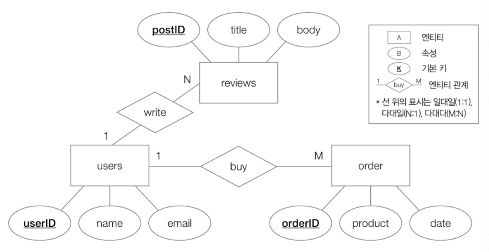
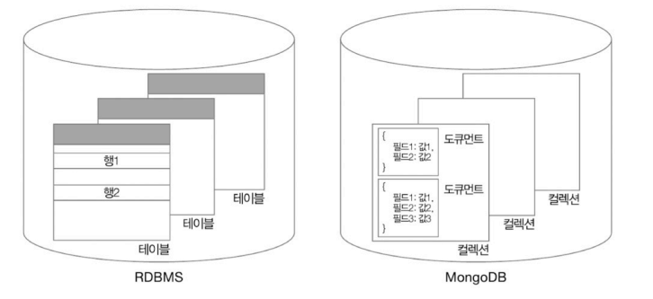
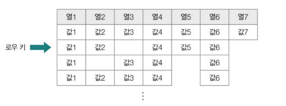
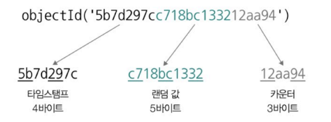

- [6장 데이터베이스](#6장-데이터베이스)
- [5. 데이터베이스 설계](#5-데이터베이스-설계)
  - [5-1. ER 다이어그램](#5-1-er-다이어그램)
    - [(1) 피터 첸 표기법](#1-피터-첸-표기법)
    - [(2) IE (Information Engineering notation)표기법 (새 발 표기법, 까마귀 발 표기법)](#2-ie-information-engineering-notation표기법-새-발-표기법-까마귀-발-표기법)
      - [🚫 여기서 잠깐, 식별/비식별 관계](#-여기서-잠깐-식별비식별-관계)
  - [5-2. 정규화](#5-2-정규화)
    - [(1) 제 1 정규형](#1-제-1-정규형)
    - [(2) 제2 정규형](#2-제2-정규형)
    - [(3) 제3 정규형](#3-제3-정규형)
    - [(4) 보이스/코드 정규형](#4-보이스코드-정규형)
    - [(5) 정리](#5-정리)
      - [🚫 여기서 잠깐, 역정규화 : 정규화가 무조건적인 미덕일까](#-여기서-잠깐-역정규화--정규화가-무조건적인-미덕일까)
- [6. NoSQL](#6-nosql)
  - [6-1. RDBMS vs NoSQL : NoSQL의 특징](#6-1-rdbms-vs-nosql--nosql의-특징)
    - [(1) 키-값 데이터베이스](#1-키-값-데이터베이스)
    - [(2) 도큐먼트 데이터베이스](#2-도큐먼트-데이터베이스)
    - [(3) 그래프 데이터베이스](#3-그래프-데이터베이스)
    - [(4) 칼럼 패밀리 데이터베이스](#4-칼럼-패밀리-데이터베이스)
  - [6-2. 다양한 NoSQL: MongoDM와 Redis 맛보기](#6-2-다양한-nosql-mongodm와-redis-맛보기)
    - [(1) MongoDB](#1-mongodb)
      - [1. 데이터베이스와 컬렉션 생성](#1-데이터베이스와-컬렉션-생성)
      - [2. 생성된 데이터베이스와 컬렉션 조회](#2-생성된-데이터베이스와-컬렉션-조회)
      - [3. 사용 중인 데이터베이스와 컬렉션 삭제](#3-사용-중인-데이터베이스와-컬렉션-삭제)
      - [4. 단일 레코드를 삽입하는 방법](#4-단일-레코드를-삽입하는-방법)
      - [🚫 여기서 잠깐, MongoDB의 연산자](#-여기서-잠깐-mongodb의-연산자)
      - [5. 여러 도큐먼트를 삽입하는 방법](#5-여러-도큐먼트를-삽입하는-방법)
      - [6. 단일 도큐먼트를 갱신하는 방법](#6-단일-도큐먼트를-갱신하는-방법)
      - [7. 여러 도큐먼트를 갱신하는 방법](#7-여러-도큐먼트를-갱신하는-방법)
      - [8. 도큐먼트 삭제](#8-도큐먼트-삭제)
    - [(2) Redis](#2-redis)
- [✍ Note, 데이터베이스 분할과 샤딩](#-note-데이터베이스-분할과-샤딩)

# 6장 데이터베이스 
# 5. 데이터베이스 설계
- 효율적으로 테이블을 설계하고 관리하는 방법
  - 데이터베이스 내 테이블과 테이블 간의 관계 설계
  - 한 테이블 내 필드 설계

## 5-1. ER 다이어그램
- **엔티티** : **데이터베이스의 저장 단위**로 데이터베이스에 저장 가능하며 **다양한 속성을 가진 객체**
  - 지금까지는 엔티티 집합과 엔티티 간의 관계를 테이블과 테이블의 관계로 표현

<br>

- **엔티티 관계 (ER, Entity Relationship)** : 데이터베이스를 구성하는 요소들의 관계를 나타내는 그림
  - `ER 다이어그램 (ERD)`라고 부름
  - 데이터베이스에 저장되는 엔티티 구조를 `모델링`
    - 엔티티 구조의 모델링 : 데이터베이스로 표현할 대상을 시각적으로 설계 
    - 데이터베이스 `설계 초기 단계`에서 `시각적 표현인 모델링이 매우 중요`
    - 정의를 잘 해두면 추후 확정 수정 시 영향 받는 곳을 쉽게 파악하여 유지보수가 용이하고 소통이 쉬움
  - 비효율적인 데이터베이스 설계는 데이터의 중복과 불일치 발생 가능성을 높여 데이터베이스에 대한 질의의 성능을 저하시킬 수 있음

### (1) 피터 첸 표기법

- 엔티티를 개념적으로 모델링하는데 유용
- 엔티티가 많아질 경우 그림이 복잡해지고 RDBMS 상에서 어떻게 테이블의 형태로 표현하는지 파악이 어려움

### (2) IE (Information Engineering notation)표기법 (새 발 표기법, 까마귀 발 표기법)


- 테이블 형태를 띄고 있어 직관적
- 상단 사각형 = 테이블 이름, 사각형 내부 = 속성(필드) 이름, 필드 타입
- 기본 키 : 밑줄 또는 PK로 표기
- 외래 키 : FK로 표기

#### 🚫 여기서 잠깐, 식별/비식별 관계

- 식별 관계 (identifying relationship) : 참조되는 엔티티가 존재해야만 참조하는 엔티티가 존재할 수 있는 관계 
- 비식별 관계 (non-indenfying relationship) : 참조되는 엔티티가 존재하지 않아도 참조하는 엔티티가 존재할 수 있는 관계
  - 예 : 외래 키

## 5-2. 정규화
- **정규화 (Normal Form, NF)** : 잠재적인 문제가 발생하지 않도록 테이블의 필드를 구성하고 필요할 경우 테이블을 나누는 작업
  - 정규화 종류
    1. 제1 정규형
    2. 제2 정규형
    3. 제3 정규형
    4. 보이스/코드 정규형
    5. 제4 정규형
    6. 제5 정규형
  - 정규화는 각각의 정규형을 만드는 일종의 `규칙`

### (1) 제 1 정규형
- **제1 정규형 : 모든 속성이 원자 값을 가짐**
  - 제1 정규형 : 필드 데이터가 더 이상 쪼개질 수 없는 값을 가져야 한다는 의미

<br>

- 예시
  - 1정규형 만족X

  - 1정규형 실행  
    1.`중복 레코드를 감수하고 하나의 테이블로 설계`

    2. `테이블 쪼개기`


<br>

- 각 방법들이 완벽하지 않고 제1 정규화를 거쳐도 여전히 문제의 여지가 있어 추가적인 정규화 필요

### (2) 제2 정규형
- **제2 정규형 : 제1 정규형을 만족함과 동시에 기본 키가 아닌 모든 필드들이 모든 기본 키에 완전히 종속될 것**
  - 보통 `기본 키가 2개 이상의 필드로 구성될 때 고려`
  - 기본 키의 일부만 종속되는 필드가 있는 경우 이를 제거하여 `기본 키 전체에 종속되도록 필드를 구성해야 함`
  - 즉, 모든 필드가 기본 키에 완전히 종속되어야 하고 일부 기본 키에만 종속되면 안되는 것

<br>

- **종속성**
  - 특정 필드(속성) `X의 값`을 통해 특정 필드(속성) `Y의 유일한 값이 결정`될 경우, `Y는 X에 종속적`이라고 표현합니다.
    - 이때 **X를 결정자**, **Y를 종속자**라고 함
  - **결정자** : 어떤 값을 알면 다른 값을 결정할 수 있는 속성
  - **종속자** : 결정자에 의해 결정되는 속성
  - **함수적 종속** : X → Y : X의 값이 Y의 값을 유일하게 결정

  <br>

  - 예시
    - 이름 + 생년월일 (기본키, 결정자)
    - 학번 (종속자)  
    => `(이름 + 생년월일) -> 학번` 관계의 함수적 종속 성립

<br><br>

- **함수적 종속 종류**
  - **부분 함수 종속성 (partial functional dependency)** : 기본 키가 아닌 필드가 **기본 키의 일부에 종속**되어 있는 경우

  - **완전 함수 종속성(full functional dependency)** : 기본 키 전체에 완전하게 종속되어 있는 경우
    - `제2 정규형` : 부분 함수 종속성이 없는 `완전 함수 종속인 상태`

<br>

- **예시 : 부분 함수 종속**

  - 기본 키 : 회원 ID + 구매항목
  - `가격` 필드 : `구매항목`에만 종속, 회원 ID에 종속되지 않음 => `부분 함수 종속`  
    => `제2 정규형을 만족하지 않음`

  <br>

  
  - 기본 키 : 학번 + 과목
  - `이름` 필드 : `학번`에만 종속, 회원 ID에 종속되지 않음 => `부분 함수 종속`  
    => `제2 정규형을 만족하지 않음, 테이블 분할 필요`

  <br>

  - **테이블 분할**
  
    - 분할된 테이블은 각각 기본 키를 가지며 제 2정규형을 만족하는 상태가 됨

<br>

### (3) 제3 정규형
- **제3 정규형 : 제2 정규형을 만족하면서, 기본 키가 아닌 모든 필드가 기본 키에 이행적 종속성이 없는 상태**
  - 제2 정규형 : `부분 함수 종속성`이 없고, `완전 함수 종속성`이 있어야 함
  - 제3 정규형 : `이행 함수 종속성`이 없어야 함

<br>

- **이행적 종속 관계** : A, B, C 필드가 있을 때 **A가 B를 결정(A -> B)** 하고 **B가 C를 결정(B -> C)** 한다면 **A도 C를 결정(A -> C)** 하게 되어 **종속 관계**가 발생
  - 기본 키가 아닌 `나머지 모든 필드`들이 `간접적으로라도 종속되면 안됨`
  - 기본 키가 아닌 나머지 모든 필드는 `서로 유추하거나 결정할 수 없어야 함`

  <br>

  - 예시 : 학번, 학과, 사무실 위치
    - (학번 -> 학과), (학과 -> 사무실 위치), `(학번 -> 사무실 위치, 이행적 종속 관계)`
      
    - 이행적 종속을 없애기 위한 테이블 쪼개기
      


### (4) 보이스/코드 정규형
- **보이스/코드 정규형(이하 BCNF, Boyce-Codd Normal Form)** : 제3 정규형을 만족하는 동시에 **모든 결정자가 후보 키**여야 함
  - 결정자 : 특정 필드를 식별할 수 있는 필드 
    - A 필드가 B를 결정할 경우(B가 A에 종속적일 경우) A는 B의 결정자
      - A -> B

<br>

- **예시 : 학번, 과목 코드, 담당 교수**
  
  - 이행적 종속 관계 : 없음
    - 결정자 : 학번 + 과목 코드
    - 종속자 : 담당 교수
    - 서로 종속적으로 영향을 미치는 필드 없음****
  - BCNF : 만족 X
    - `담당 교수` 필드는 키가 아니지만 `과목 코드`의 결정자 역할을 함
    - BCNF를 만족하기 위해서는 `학번`+ `과목 코드` 테이블 , `과목 코드` + `담당 교수` 테이블로 분리해야함

<br>

### (5) 정리
- 제1 정규형부터 BCNF까지 테이블이 정규화되는 과정


#### 🚫 여기서 잠깐, 역정규화 : 정규화가 무조건적인 미덕일까
- 정규화가 항상 최선은 아님
  - **정규화 장점** : 정규화 단계를 거듭하면 데이터가 깔끔하게 정돈되고 이상 현상이 줄어듦
  - **정규화 단점** : 성능을 저해할 수 있음
  - 정규화를 거듭하다보면 `테이블이 쪼개지고` 그로 인해 `조인 연산`이 빈번해지고 다른 테이블을 참조하기 위한 `성능상의 비용이 늘어날 수 있음` 

- **역정규화 : 검색의 속도를 높이기 위해 분할되어 있는 테이블을 하나로 합치는 작업**
  - 성능상의 이점을 최대한 활용하고자 할 때 어느 정도 데이터 중복과 삽입/수정/삭제 연산의 번거로움을 감수하더라도 하나의 테이블로 관리함

  

<br>

# 6. NoSQL
## 6-1. RDBMS vs NoSQL : NoSQL의 특징
- **NoSQL** : Not Only SQL
  - 레코드를 테이블 형태 이외의 다양한 형태로 저장할 수 있고 SQL 이외의 방법으로 저장된 데이터도 다룰 수 있음
  - 주어진 상황과 필요한 장단점에 따라 RDBMS와 NoSQL을 선택하여 사용
  
  <br>

  - NoSQL의 특징
    - 확장성, 유연성, 가용성, 성능
      - 높은 부하를 감당하거나 대용량 데이터를 다루는 분산 환경에 적합
    - 스케일 아웃 (수평적 확장)에 용이함
    - 성능 향상을 위해 ACID와 정규화를 엄격히 준수하지 않음
      - 데이터 무결성과 일관성을 다소 저하될 수 있는 대신 큰 성능 향상을 얻음

  
  <br>
  
- **대표적인 NoSQL 데이터 베이스 유형**
  1. 키-값 데이터베이스
  2. 도큐먼트 데이터베이스
  3. 그래프 데이터베이스
  4. 칼럼 패밀리 데이터베이스

### (1) 키-값 데이터베이스
- **키-값 데이터베이스 (key-value database) : 데이터베이스에 레코드를 키(필드)와 값의 쌍으로 저장하는 데이터베이스**
  - 가장 간단한 형태의 NoSQL 데이터베이스 유형
  - 키-값 데이터베이스 중 인메모리 데이터베이스인 경우가 있음
    - 예 : Redis, Memcached 등
    - **인메모리 데이터베이스 (in-memory database)** : 레코드를 보조기억장치가 아닌 메모리에 저장해 빠른 데이터베이스 접근 속도를 제공
  - 캐시나 세션 등 비교적 `가벼운 정보를 저장`하는 경우가 많음
  - 키-값 데이터베이스를 `보조 데이터베이스로써 사용`하는 경우가 많음

### (2) 도큐먼트 데이터베이스
- **도큐먼트 데이터베이스 (문서지향 데이터베이스, document-oriented database) : 레코드를 도큐먼트라는 단위로 저장하고 관리하는 데이터베이스**
  - **도큐먼트** : 정형화되어 있지 않은 NoSQL 레코드의 단위
    - JSON, XML 같은 형식 활용
    - 예 : MongoDB
      - JSON의 **키** = 필드
      - JSON의 **데이터** : RDBMS의 행
      - **컬렉션** : 도큐먼트의 모임
        - RDBMS에서 레코드가 모여 **테이블**이 된 것과 동일
      - 고정된 스키마가 없어 유연한 스키마를 가질 수 있음
      

### (3) 그래프 데이터베이스
- **그래프 데이터베이스 (graph database) : 데이터를 그래프의 노드 형태로 저장하는 데이터베이스**
  - 방향 그래프로 표현하기 위해 활용
  - 노드 간의 연결 관계와 방향을 표현할 수 있음 => `관계성`이 중요한 레코드를 저장하기 위해 주로 사용됨
    - 활용 예시 : SNS의 친구 관계, 교통망
  - 예 : neo4j

### (4) 칼럼 패밀리 데이터베이스
- **칼럼 패밀리 데이터베이스 (column family database)** : RDMS와 같이 **행, 열, 키 개념**이 있고 키처럼 **로우 키(row key)**를 사용함, 다만 RDBMS와 달리 **정규화나 조인을 사용하지 않고** 스키마가 고정되지 않아 **자유롭게 열 추가 가능**
  - 동적으로 변할 수 있는 열들이 있고 거기에 행 데이터들이 대응되는 것에 가까움
  
  - **칼럼 패밀리** : 열들이 모여서 형성된 단위
    - RDBMS의 데이터베이스와 동일
  - **키스페이스** : 여러 칼럼 패밀리들을 포괄하는 칼럼 패밀리 데이터베이스의 최상위 단위  
    - RDBMS의 테이블과 동일  

<br>

- 칼럼 패밀리 DB는 유연한 스키마를 가진 NoSQL 구조로 `Keyspace > Column Family > Column` 순으로 구성됨
- 관계형 DB의 `데이터베이스 > 테이블 > 열` 구조와 유사  
- 관계형 DB보다 더 유연하고 다양한 형태의 데이터를 저장할 수 있음

## 6-2. 다양한 NoSQL: MongoDM와 Redis 맛보기
### (1) MongoDB
- 도큐먼트 (레코드) < 컬렉션 < 데이터베이스

<br>

#### 1. 데이터베이스와 컬렉션 생성
    ```
    use 데이터베이스_이름 # 데이터베이스 생성/사용

    db.createCollection("컬렉션_이름") # 컬렉션 생성
    ```
  - 예시 : mydb 데이터베이스, mycollection 컬렉션 생성
    ```
    test> use mydb
    switched to db mydb
    mydb> db. createCollection("mycollection"){ok: 1}
    mydb>
    ```

<br><br>

#### 2. 생성된 데이터베이스와 컬렉션 조회
    ```
    show dbs
    show collections
    ```

<br><br>

#### 3. 사용 중인 데이터베이스와 컬렉션 삭제

    ```
    db.dropDatabase()
    db.컬렉션_이름.drop()
    ``` 

<br><br>

#### 4. 단일 레코드를 삽입하는 방법
  - 단일 레코드 삽입 : `db.컬렉션_이름.insertOne()`
    ```
    mydb> db.mycollection.insertOne( { name: "Kim", age: 30 } )
    {
      acknowledged: true,
      insertedId: ObjectId('66892c529e1f8a9c9d8db60c")
    }
    ```
  - `ObjectId` : 도큐먼트마다 부여되는 고유한 값 => 특정 도큐먼트를 식별할 수 있음
    - 타임스탬프, 랜덤 값, 증가하는 값인 카운터의 조합으로 이루어짐
    

  <br>

  - `JSON 형태의 도큐먼트`는 `변수` 형태로도 사용 가능  
    ① `mydoc` 변수에 저장
      ```
      mydb> var mydoc = { name: "Lee", age: 15, gender: "male" }
      mydb> db.mycollection. insertOne(mydoc)
      {
        acknowledged: true,
        insertedId: Objectld('66892c529e1f8a9c9d8db60c’)

      }
      ```
    ② 특정 컬렉션의 도큐먼트를 확인
    - 특정 컬렉션의 도큐먼 확인 :  `db.컬렉션_이름.find()`
    ```
    mydb> db.mycollection.find()
    [
      {_id: ObjectId('66892c529e1f8a9c9d8db6ec'), name: 'Kim', age: 30},
      {
      _id: ObjectId('66892ca89e1f8a9c9d8db6ed'),
      name: 'Lee',
      gender: male'
      age: 15,
      }
    ]
    ```
    ③ 원하는 도큐먼트만 필터링하여 조회
    - `name`이 `Kim`인 도큐먼트 검색
    ```
    mydb> db.mycollection.find({ name: "Kim" })
    [{_id: ObjectId('66892c529e1f8a9c9d8db60c), name: Kim, age: 30}]
    mydb> db.mycollection.find({ name: "Kim", age: 30})
    [{_id: ObjectId('66892c529e1f8a9c9d8db60c), name: Kim, age: 30}]
    ```

#### 🚫 여기서 잠깐, MongoDB의 연산자


<br>

#### 5. 여러 도큐먼트를 삽입하는 방법
- 여러 도큐먼트 삽입 : `db.컬렉션_이름.insertMany()`
  - 소괄호 안 삽입할 여러 도큐먼트를 리스트 형태로 명시
    - 리스트는 대괄호로 표기
  ```
  mydb> db.mycollection.insertMany ([
  ... { name: "Park", age: 30}, 
  ... { name: "Kang", age: 25, address: "Seoul" }, 
  ... { name: "Jang", hobbies: ["reading", "traveling"], age: 28},
  ... { name: "Choi", gender: "male" }
  ... ])
  {
    acknowledged: true,
    insertedIds: {
    '0': ObjectId('668928459e1f8a9c9d8db60e'), '1': ObjectId('668926459e1f8a9c9d8db60f'), '2': ObjectId('668926459e1f8a9c9d8db610'), '3': ObjectId('668926459e1f8a9c9d8db611')
    }
  }
  ```

#### 6. 단일 도큐먼트를 갱신하는 방법
- 단일 도큐먼트 갱신 : `db.컬렉션_이름.updateOne()`
  - 첫번째 인자 : 갱신할 도큐먼트 식별하는 필터
  - 두번재 인자 : 갱신할 내용 의미
    - 갱신할 내용을 명시할 때는 MongoDB의 연산자 활용
    - `$set: {변경할 필드: 변경할_내용, ...}`
- 예시 : `name`이 `Kang`과 일치하는 도큐먼트를 찾아 `age`를 `30`으로 변경
    ```
    mydb> db.mycollection.updateOne({ name: "Kang" }, { $set: { age: 30} })
    {
      acknowledged: true,
      insertedId: null,
      matchedCount: 1,
      modified Count: 1,
      upsertedCount: 0
    }
    ```

#### 7. 여러 도큐먼트를 갱신하는 방법
- 여러 도큐먼트 갱신 : `db.컬렉션_이름.updateMany()`
  - updateOne과 유사
  - 예시 : `age`가 `20` 이상인 모든 도큐먼트의 `status` 필드를 `active`로 갱신
    ```
    mydb> db.mycollection.updateMany({age: { $gte: 28} }, { $set: { status: "active" }})
    {
      acknowledged: true,
      insertedId: null,
      matched Count: 4,
      modifiedCount: 4,
      upsertedCount: 8
    }
    ```
    - `status` 필드가 없다면 새로 생성하게 됨
    - 갱신 결과
      

<br>

- 특정 필드를 삭제
  - $unset 연산자 사용
  - 예시 : `age`가 `10`이상인 모든 도큐먼트의 `status` 필드 삭제
    ```
    mydb> db.mycollection.updateMany({age: { $gte: 20} }, { $unset: { status: "active" }})
    acknowledged: true,
    {
      insertedId: null,
      matchedCount: 4,
      modifiedCount: 4,
      upsertedCount: 8
    }
    ```

#### 8. 도큐먼트 삭제
- 단일 도큐먼트 삭제 : `db.컬렉션_이름.deleteOne()`
- 여러 도큐먼트 삭제 : `db.컬렉션_이름.deleteMany()`
- 예시 : `name` 필드가 `Lee`인 도큐먼트 삭제 + `age` 필드가 `20`이상인 도큐먼트 삭제
  ```
  mydb> db.mycollection.deleteOne({ name: "Lee" })
  { acknowledged: true, deletedCount: 1 }

  mydb> db.mycollection.deleteMany({ age: { $gte: 20 } })
  { acknowledged: true, deletedCount: 4 }

  ```

<br>

### (2) Redis
- Redis : 키-값 데이터베이스, 인 메모리 데이터베이스
  - 저장되는 레코드를 키-값 대응 쌍으로 관리
    - 값의 자료구조 : 문자열, 리스트, 해시 테이블, 집합
    

<br>

- **문자열 타입의 값을 다룰 때 가능한 명령**

  - 문자열 저장 : `SET`
    - 예시 : `k1` 키에 문자열 값 대응하여 저장
    ```
    127.0.0.1:6379> SET k1 "Thank You" 
    OK
    ```
    - 올바르게 입력하면 `OK` 출력

  <br>

  - 키가 존재하지 않을 경우에만 문자열 저장 : `SETNX`
    - `SET if Not eXists`
    - 예시 
    ```
    127.0.0.1:6379> SETNX k1 "For Reading This Book" (integer) 0 
    127.0.0.1:6379> SETNX k2 "For Reading This Book" (integer) 1
    ```
    - 첫번째 명령은 k1이 존재하여 명령 실패
    - 두번째 명령은 성공
  
  <br>

  - 키에 대응된 값 조회
    - 단일 조회 : `GET`
    - 다중 조회 : `MGET`
    - 예시
    ```
    127.0.0.1:6379> GET k1 "Thank You"
    127.0.0.1:6379> GET k2 "For Reading This Book"
    127.0.0.1:6379> MGET k1 k2
    1) "Thank You"
    2) "For Reading This Book"
    ```

  <br>

  - 키에 대응된 값 삭제 : `DEL`
    - 예시
    ```
    127.0.0.1:6379> DEL k2 (integer) 
    1 127.0.0.1:6379> GET k2 (nil)
    ```

<br>

- **리스트 타입의 값을 다룰 때 가능한 명령**

  - 리스트 왼쪽 (앞)에 새로운 요소 추가 : `LPUSH`
    - 리스트가 비어있을 경우 새 리스트를 생성하고 리스트의 왼쪽에 키에 대응하는 요소 생성
    - 예시
    ```
    127.0.0.1:6379> LPUSH 1k "Computer"
    (integer) 1
    ```
      - 1K : ["Computer"]

  <br>

  - 리스트의 오른쪽 (뒤)에 새로운 요소 추가 : `RPUSH`
    - 예시
    ```
    127.0.0.1:6379> LPUSH 1k "This was" 
    (integer) 2 
    127.0.0.1:6379> RPUSH 1k "Science" (integer) 3
    ```
      - 1k : ["This was", "Computer", "Science"]
      - 

  <br>

  - 리스트의 키 요소 조회 : `LRANGE`
    - 지정된 범위의 요소들을 반환
      - 리스트 첫번째 요소 : 0
      - 리스트 마지막 요소 : -1
    - 예시 : `1k` 전체 리스트 요소 반환
    ```
    127.0.0.1:6379> LRANGE 1k 0-1
    1) "This was"
    2) "Computer"
    3) "Science"
    ```
  
  <br>

  - 리스트의 길이 확인 : `LLEN`
    - 예시 : `1k : ["This was", "Computer", "Science"]`
    ```
    127.0.0.1:6379> LLEN 1k
    (integer) 3
    ```
  
  <br>

  - 리스트 왼쪽(앞) 요소 제거 후 반환 : `LPOP`
    - 예시 : `1k : ["This was", "Computer", "Science"]`
    ```
    127.0.0.1:6379> LPOP 1k
    "This was"
    127.0.0.1:6379> LRANGE 1k 0 -1
    1) "Computer"
    2) "Science"
    ```

  <br>

  - 리스트 왼쪽(앞) 요소 제거 후 반환 : `RPOP`
    - 예시 : `1k : ["Computer", "Science"]`
    ```
    127.0.0.1:6379> RPOP 1k "Science" 
    127.0.0.1:6379> LRANGE 1k 0-1 
    1) "Computer"
    ```
  
# ✍ Note, 데이터베이스 분할과 샤딩
- **데이터 분할** (데이터 파티셔닝, data partitioning) : 안정적이고 확장성 높은 데이터베이스 레코드 관리를 위해 테이블을 **물리적으로 분할**하여 레코드를 저장하는 기술
  - 테이블 내 수많은 레코드가 효율적으로 저장되어야 하거나 데이터베이스에 대한 부하의 분산을 고려해야하는 경우 유용하게 사용
  - **파티션** : 분할되어 저장되는 단위
  - **수평적 분할** : 테이블의 행을 기준으로 테이블을 나누어 저장하는 방식
    - 테이블의 레코드를 참조할 때마다 모든 레코드를 한번에 불러들일 필요 없는 경우
    - `대중적으로 활용됨`
  - **수직적 분할** : 테이블의 열을 기준으로 테이블을 나누어 저장하는 방식
    - 트랜잭션 수에 비해 테이블 내에 열이 과도하게 많거나 특정 열에 속하는 레코드의 데이터 크기가 다른 열의 레코드보다 과도하게 큰 경우
    - 보안 상의 이유로 열을 별개의 테이블로 나누어 저장해야 하는 경우

  

<br>

- **수평적 분할 방법**
1. 범위 분할 (Range Partitioning)
   - 레코드 데이터가 가질 수 있는 범위 정의
   - 해당 범위를 기준으로 테이블을 나눔
   - 예시 : 회원 가입 연도를 범위로 정의하고 테이블 분할한 경우
      ```
      CREATE TABLE members (
        username VARCHAR(16) NOT NULL,
        registered_date DATE NOT NULL
      )
      PARTITION BY RANGE (YEAR(registered_date)) (
        PARTITION p0 VALUES LESS THAN (2000),
        PARTITION p1 VALUES LESS THAN (2010),
        PARTITION p2 VALUES LESS THAN (2020),
        PARTITION p3 VALUES LESS THAN MAXVALUE
      );

      ```

<br>

2. 목록 분할 (List Partitioning)
     - 레코드 데이터가 특정 목록(리스트)에 포함된 값을 가질 경우 해당 레코드를 별도의 테이블로 분할
     - 예시 
        ```
        CREATE TABLE customers (
          name VARCHAR(25),
          address VARCHAR(15)
        )
        PARTITION BY LIST COLUMNS(address) (
          PARTITION p0 VALUES IN ('Seoul', 'Busan', 'Daegu'),
          PARTITION p1 VALUES IN ('Incheon', 'Gwangju', 'Daejeon'),
          PARTITION p2 VALUES IN ('Ulsan', 'Sejong', 'Gyeonggi-do'),
          PARTITION p3 VALUES IN ('Gangwon-do', 'Chungcheongbuk-do','Chungcheongnam-do')
        );

        ```

<br>

3. 해시 분할 (Hash Partitioning)
     - 특정 열 데이터에 대한 해시 값을 기준으로 별도의 테이블로 분할
     - 해시 함수를 적용하여 생성된 해시 값에 따라 테이블이 나눠짐
     - 예시
       ```
       CREATE TABLE students (
         id INT NOT NULL,
         name VARCHAR(30),
         major_id INT
       )
       PARTITION BY HASH(major_id)
       PARTITIONS 4;

       ```

<br>

4. 키 분할 (Key Partitioning)
     - 키를 기준으로 별도의 테이블로 분할
     - 키를 기준으로 균등하게 분배됨
     - 예시
       ```
       CREATE TABLE students (
         id INT NOT NULL PRIMARY KEY,
         name VARCHAR(20)
       )
       PARTITION BY KEY()
       PARTITIONS 2:
       ```

<br>

- **샤딩 (sharding)**
  - 수평적 분할을 통해 만들어진 파티션들은 기본적으로 동일한 데이터베이스 서버 내 위치
  - 이런 경우 결국 서버에 요청이 몰려 부하 분산이 어려움  
  => 이를 해결한 기술이 `샤딩`

  <br>

  - **샤딩 : 분할된 테이블을 별개의 데이터베이스 서버에 분산하여 저장하는 기술**
    - **샤드** : 분할되어 저장된 단위