# Chapter 06. 데이터베이스
- [Chapter 06. 데이터베이스](#chapter-06-데이터베이스)
- [06-5.  데이터베이스의 설계](#06-5--데이터베이스의-설계)
  - [ER 다이어그램(ERD)](#er-다이어그램erd)
    - [ERD 종류 및 표기법](#erd-종류-및-표기법)
  - [정규화(Normal Form)](#정규화normal-form)
    - [제1 정규형](#제1-정규형)
    - [제2 정규형](#제2-정규형)
    - [제3 정규형](#제3-정규형)
    - [보이스/코드 정규형(BCNF)](#보이스코드-정규형bcnf)
- [06-6. NoSQL](#06-6-nosql)
  - [RDBMS vs NoSQL : NoSQL의 특징](#rdbms-vs-nosql--nosql의-특징)
    - [키-값 데이터베이스](#키-값-데이터베이스)
    - [도큐먼트 데이터베이스(문서지향 데이터베이스)](#도큐먼트-데이터베이스문서지향-데이터베이스)
    - [그래프 데이터베이스](#그래프-데이터베이스)
    - [칼럼 패밀리 데이터베이스](#칼럼-패밀리-데이터베이스)
  - [다양한 NoSQL : MongoDB와 Redis 맛보기](#다양한-nosql--mongodb와-redis-맛보기)
    - [MongoDB](#mongodb)
    - [Redis](#redis)
  - [추가 학습 - 데이터베이스 분할과 샤딩](#추가-학습---데이터베이스-분할과-샤딩)
- [Q\&A](#qa)
  - [1. 데이터 관리에 있어 반드시 정규화를 해야하나요?](#1-데이터-관리에-있어-반드시-정규화를-해야하나요)
  - [2. BNCF 정규형에 대해 설명해보세요.](#2-bncf-정규형에-대해-설명해보세요)
  - [3. NoSQL과 RDBMS는 데이터베이스의 종류인데, NoSQL이 RDBMS를 완전히 대체할 수 있나요?](#3-nosql과-rdbms는-데이터베이스의-종류인데-nosql이-rdbms를-완전히-대체할-수-있나요)


# 06-5.  데이터베이스의 설계

## ER 다이어그램(ERD)

**엔티티 관계**를 표현하는 그림

- 목적 : 데이터베이스에 저장되는 엔티티의 구조를 모델링
    - **엔티티 구조의 모델링** : 데이터베이스로 표현할 대상을 시각적으로 설계하는 것
        - 데이터베이스 설계 초기 단계에서 중요
        - 추후 데이터베이스 확장 및 수정할 때 파악 및 유지보수 용이, 개발자 간 원활한 소통 가능
- draw.io, ERWin, ERDCloud 등으로 그림

### ERD 종류 및 표기법

**피터 첸 표기법(Peter Chen diagram)**

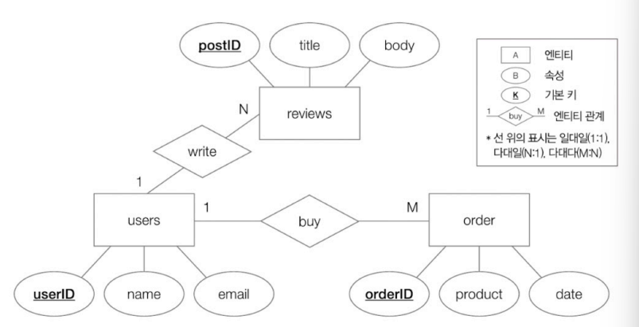

- 장점
    - 엔티티를 개념적으로 모델링하는 데 유용
- 단점
    - 엔티티가 많아질 경우 그림 다소 복잡
    - RDBMS 상에서 어떻게 테이블 형태로 표현되는지 한 눈에 파악하기 어려움

**IE 표기법(Information Engineering notation)/새 발 표기법/까마귀 발 표기법**

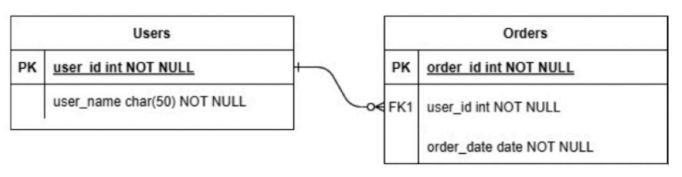

- 세부 설명
    - 사각형 : 테이블(상단 - 테이블 이름, 내부 - 속성(필드, 필드 타입))
    
    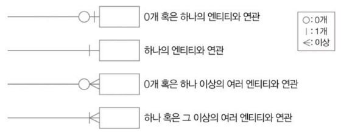
    
    - 식별 관계 : 실선
        - 참조되는 엔티티가 존재해야만 참조하는 엔티티가 존재할 수 있는 관계
        - 참조되는 테이블의 기본 키를 참조하는 테이블의 외래 키이자 기본 키로 활용하는 경우
        
            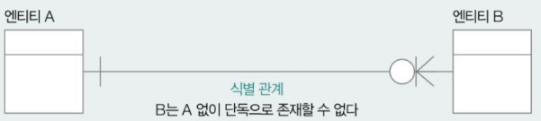
        
    - 비식별 관계 : 점선
        - 참조되는 엔티티가 존재하지 않아도 참조하는 엔티티가 존재할 수 있는 관계
        - 참조되는 테이블의 기본 키를 참조하는 테이블의 일반적인 외래 키로 이용할 경우
        
            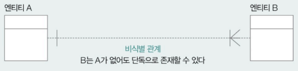
        

## 정규화(Normal Form)

하나의 테이블을 어떤 필드로 구성해야 할 지 결정하기 위한 작업

잠재적인 문제가 발생하지 않도록 테이블의 필드를 구성하고, 필요할 경우 테이블을 나누는 작업

- **정규형** : 정규화된 테이블의 형태
    - 제1 정규형, 제2 정규형, 제3 정규형, 보이스/코드 정규형, 제4 정규형, 제5 정규형

### 제1 정규형

✨ **모든 속성이 원자 값을 가짐**

필드 데이터가 더 이상 쪼개질 수 없는 값을 가져야 함

- 중복되는 레코드를 감수하고 하나의 테이블로 설계 방법
- 테이블을 여러 개로 쪼개는 방법

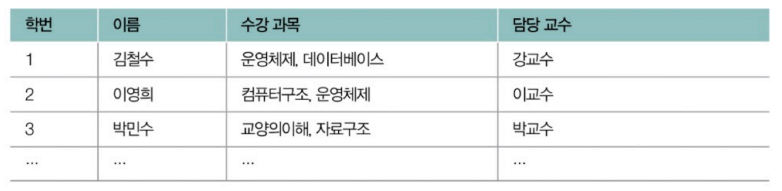

### 제2 정규형

✨ **제1 정규형을 만족** + **기본 키가 아닌 모든 필드들이 모든 기본 키에 완전히 종속됨(**부분 함수 종속성이 없고, 완전 함수 종속인 상태**)**

- 특정 필드(속성) X의 값을 통해 특정 필드(속성) Y의 유일한 값이 결정될 경우 ‘Y가 X에 종속적’이라고 표현
    - X : 결정자
    - Y : 종속자
- **부분 함수 종속성** : 기본 키가 아닌 필드가 기본 키의 일부에 종속되어 있는 경우
- **완전 함수 종속성** : 기본 키 전체에 완전히 종속되어 있는 경우

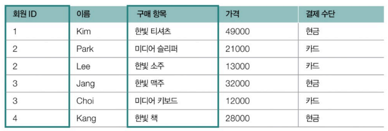

가격은 구매 항목과 관계가 있으나 ‘회원 ID’와 관계 없음 ⇒ 부분 함수 종속

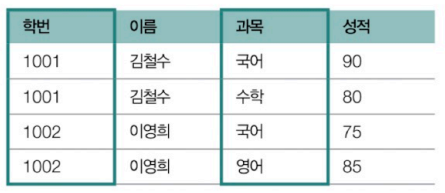

이름은 학번과 관계가 있으나 ‘과목’과 관계 없음 ⇒ 부분 함수 종속

### 제3 정규형

✨ **제2 정규형 만족** + 기본 키가 아닌 모든 필드가 **기본 키에 이행적 종속성이 없는 상태**

기본 키가 아닌 나머지 모든 필드들이 간접적으로라도 종속되어서는 안 됨

즉, 기본 키가 아닌 나머지 모든 필드는 서로를 유추하거나 결정할 수 없어야 함

- **이행적 종속성** : A → C, B → C일 때 A → C 관계

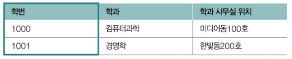

학번 → 학과, 학과 → 학과 사무실 위치, 학번 → 학과 사무실 위치

### 보이스/코드 정규형(BCNF)

✨ **제3 정규형 만족** + **모든 결정자가 후보 키여야 함**

- **결정자** : 특정 필드를 식별할 수 있는 필드

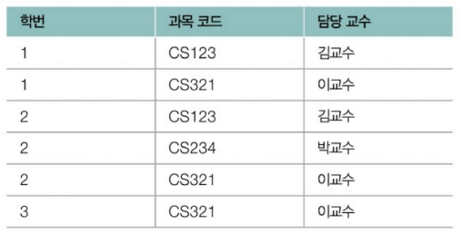

‘담당 교수’는 과목 코드의 결정자이나 키는 아님

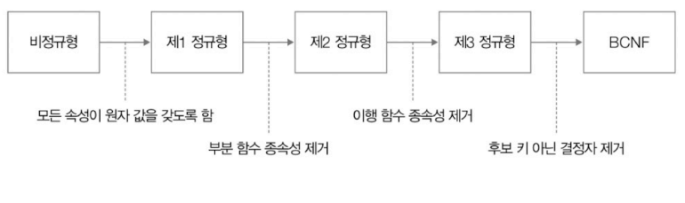

<detatils>
<summary>참고 - 제4 정규형, 제5 정규형</summary>

- 제4 정규형 : **BCNF 만족** + **다치 종속 없어야 함**
    - 다치 종속
        - A → B일 때, 하나의 A값에 여러 개의 B값이 존재 (A ↠ B)
        - 최소 3개의 필드 존재
        - R(A, B, C)라면 A와 B 사이에 다치 종속성이 있을 때, B와 C가 독립적
        
        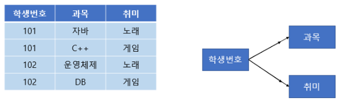
        
        학생 번호-과목, 학생번호-취미로 테이블 분리
        
- 제5 정규형 : **제4 정규형 만족** + **조인 종속 없음** + **조인 연산 했을 때 손실 없어야 함**
    - 중복 제거를 위해 분해할 수 있을 만큼 전부 분해
    - 만약 분해한 관계를 다시 결합할 수 있다면 조인 종속
    
    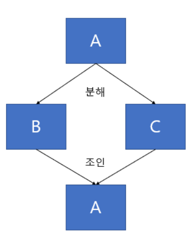
    
    조인 종속
    
    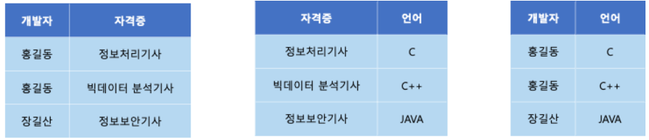
    
</details>

<br/>

> **역정규화**
> 
> 
> 검색의 속도를 높이기 위해 분할되어 있는 테이블을 하나로 합치는 작업
> 
> - 정규화를 거듭하다보면 테이블이 쪼개지는데, 테이블이 많아지면 조인 연산이 빈번해지고, 다른 테이블을 참조하기 위한 성능상 비용이 늘어날 수 있음
> - 따라서 성능상의 이점을 활용하기 위해 어느 정도의 데이터 중복과 삽입/수정/삭제 연산에서의 번거로움을 감수하고 가급적 하나의 테이블로 데이터를 관리하기도 함
> - NoSQL에서는 정규화 하지 않음


# 06-6. NoSQL

## RDBMS vs NoSQL : NoSQL의 특징

**Not Only SQL의 약자**

레코드를 (테이블 형태 이외의) **다양한 형태로 저장 가능한 데이터베이스**

SQL 이외의 방법으로 저장된 데이터도 다룰 수 있음

- 키-값 데이터베이스, 도큐먼트 데이터베이스, 그래프 데이터베이스, 칼럼 패밀리 데이터베이스

**특징**

- 높은 부하를 감당하거나 대용량 데이터를 다루는 분산 환경에 용이
    - 스케일 아웃이 용이해 확장성과 가용성이 높음
    - 데이터가 정형화되어  있지 않아 유용성 뛰어남
- 성능 향상을 위해 ACID와 정규화를 엄격히 준수하지는 않음
    - 경우에 따라 AICD 옵션으로 지원
    - RDBMS에 비해 데이터 무결성과 일관성 다소 저하됨
    - RDBMS에 비해 큰 성능 향상 얻을 수 있음

| **환경 조건** | **적합한 데이터베이스** |
| --- | --- |
| ACID에 대한 엄격한 준수 | RDBMS |
| 데이터의 무결성, 일관성 유지 중요 | RDBMS |
| 저장해야 하는 데이터가 비교적 정형화 | RDBMS |
| 확장성 염두에 둠 | NoSQL |
| 가용성에 중점을 둠 | NoSQL |
| 비정형화된 형태를 다룸 | NoSQL |

### 키-값 데이터베이스

데이터베이스에 레코드를 키(필드)와 값의 쌍으로 저장하는 데이터베이스

- Redis, Memcached 등

**특징**

- 레코드 구조가 단순한 키-값 데이터베이스의 특성 상 레코드를 (보조기억장치가 아닌) 메모리에 저장해 빠른 데이터베이스 접근 속도를 제공하는 경우 있음
    - **인 메모리 데이터 베이스** : 메모리에 저장되는 데이터베이스(Redis, Memcached)
- 캐시나 세션 등 비교적 가벼운 정보를 저장하는 경우 많음
    - 다른 주요 데이터베이스의 보조 데이터베이스로써 사용되는 경우 많음

### 도큐먼트 데이터베이스(문서지향 데이터베이스)

레코드를 도큐먼트 단위로 저장하고 관리하는 데이터베이스

- **도큐먼트** : 정형화되어 있지 않은 NoSQL 레코드의 단위(JSON, XML 등)
- MongoDB 등

**MongoDB**

- 하나의 레코드를 JSON 형태(BNON, Binary JSON)의 데이터로 만들어 관리
- 키 - 필드, JSON 데이터 - 하나하나 RDBMS의 행
- RDBMS와 달리 고정된 스키마가 없어 유연한 스키마 가질 수 있음
- **도큐먼트**가 모여 **컬렉션** 이룸 → **컬렉션** 모여 **데이터베이스** 이룸

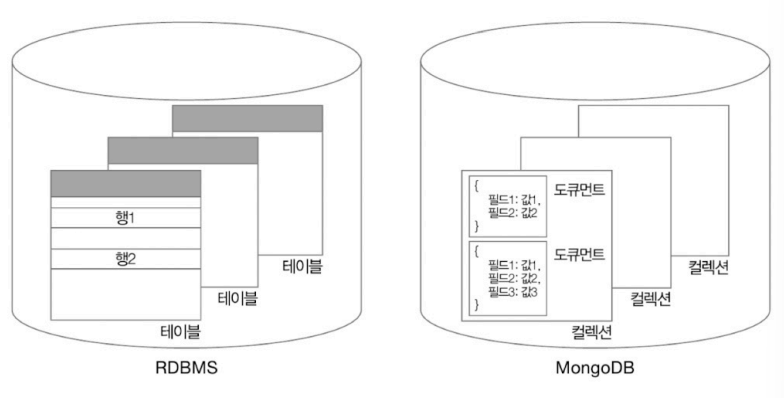

### 그래프 데이터베이스

그래프 노드 형태로 데이터를 저장하는 데이터베이스

- neo4j

**특징**

- 방향 그래프를 표현하기 위해 활용
- 노드 간의 연결 관계와 방향을 표현할 수 있기 때문에 데이터 간의 관계성이 중요한 레코드를 저장하기 위해 주로 사용

### 칼럼 패밀리 데이터베이스

동적으로 변할 수 있는 열과 그에 대응된 행으로 구성된 데이터 베이스

- Cassandra, HBase 등

**특징**

- 로우 키(row key)를 통해 특정 행을 식별
    
    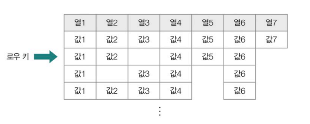
    
- RDBMS와 달리 정규화나 조인을 사용하지 않음
- 스키마가 고정되어 있지 않아 자유롭게 열을 추가할 수 있음
- 관련 있는 **열**들이 모여 **칼럼 패밀리** 형성 → **칼럼 패밀리**가 모여 **키스페이스**(최상위) 단위 형성

## 다양한 NoSQL : MongoDB와 Redis 맛보기

### MongoDB

- 레코드는 도큐먼트 단위로 저장
- 레코드 > 컬렉션 > 데이터베이스

**명령어**

- 데이터베이스/컬렉션 생성 및 조회, 삭제
    
    ```sql
    use 데이터베이스_이름              # 데이터베이스 생성/사용
    db.createCollection("컬렉션_이름") # 컬렉션 생성 
    
    show dbs             # 데이터베이스 조회
    show collections     # 컬렉션 조회
    
    dp.dropDatabase()    # 현재 사용중인 데이터베이스 삭제
    dp.컬렉션_이름.drop() # 현재 사용중인 컬력션 삭제
    ```
    
- 데이터 조회
    
    ```sql
    db.컬렉션_이름.find()          # 특정 컬렉션의 도큐먼트 확인
    db.컬렉션_이름.find({키 : 값}) # 필터링하여 조회 가능
    ```
    
    - `ObjectId` : 도큐먼트마다 부여되는 고유한 값
        - 특정 도큐먼트를 식별할 수 있는 정보
        - 타임스탬프, 랜덤 값, 증가하는 값인 카운터의 조합으로 이루어짐
            
            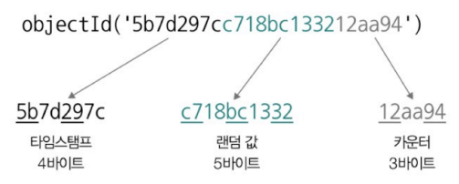
            
    - 조회 연산자
        
        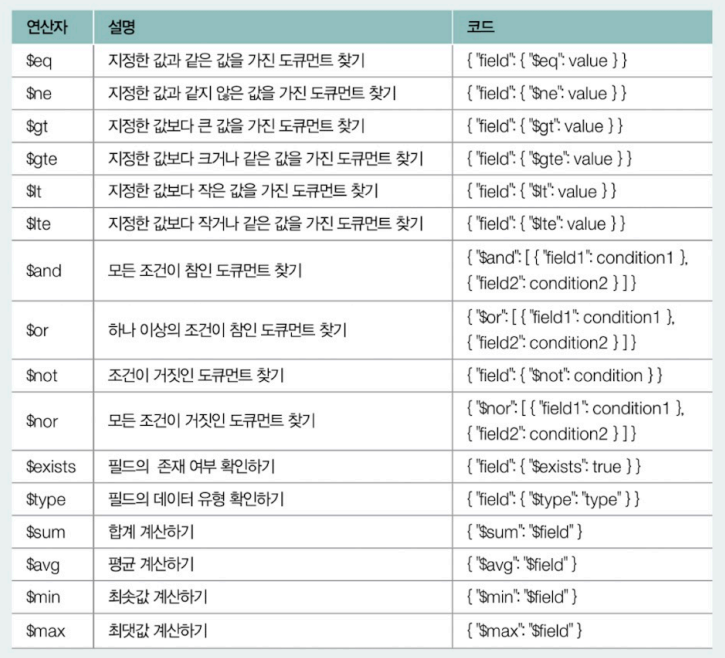
        
- 데이터 삽입
    - 단일 레코드 삽입
        
        ```sql
        db.컬렉션_이름.insertOne({키 : 값})
        
        var mydoc = {키 : 값}           # 변수형태로도 가능
        db.컬렉션_이름.insertOne(mydoc)
        ```
        
    - 여러 레코드 삽입
        
        ```sql
        db.컬렉션_이름.insertMany([       # 삽입할 여러 도큐먼트는 리스트 형태로 명시
        	{키 : 값, 키 : 값},
        	{키 : 값, 키 : [값, 값, 값]},
        ])
        ```
        
- 데이터 갱신
    - 단일 도큐먼트 갱신
        
        ```sql
        db.컬렉션_이름.updateOne(갱신할 도큐먼트 식별하는 필터, 갱신할 내용)
        db.컬렉션_이름.updateOne({갱신할 도큐먼트 식별하는 필터}, {$set: {변경할_필드 : 변경할_내용}})
        ```
        
    - 여러 도큐먼트 갱신
        
        ```sql
        db.컬렉션_이름.updateMany({갱신할 도큐먼트 식별하는 필터}, {$set: {변경할_필드 : 변경할_내용}})
        db.컬렉션_이름.updateMany({갱신할 도큐먼트 식별하는 필터}, {$unset: {변경할_필드 : 변경할_내용}}) # 특정 필드 없앨 때
        ```
        
        - 변경할 필드가 없으면 새로 생성
- 데이터 삭제 - 연산자 사용 가능
    - 단일 도큐먼트 삭제
        
        ```sql
        db.컬렉션_이름.deleteOne({삭제할 도큐먼트의 필드})
        ```
        
    - 여러 도큐먼트 삭제
        
        ```sql
        	db.컬렉션_이름.deleteMany({삭제할 도큐먼트의 필드})
        ```
        

### Redis

- 키-값  데이터베이스, 인 메모리 데이터베이스의 일종
    - 값 : 문자열, 리스트, 해시 테이블, 집합
        
        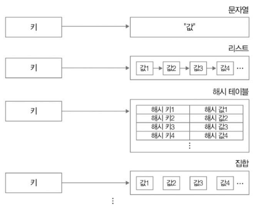
        
    - 문자열
        
        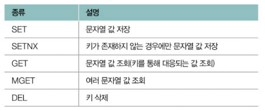
        
        ```sql
        SET k1 "Thank you" # k1(키)에 "Thank you" 대응되어 저장됨
        SETNX k1 "For Reading This Book" # SET if Not eXists : 키가 존재하지 않는 경우에만 값 저장
        GET k1      # k1 조회
        MERGE k1 k2 # k1 k2 조회
        DEL k1      # k1와 대응되는 값 삭제
        ```
        
        - SET : 올바르게 입력했다면 OK 출력
        - SETNX : 이미 키가 존재하면 0 반환되고 값 저장 안 함, 아니면 1 반환되고 값 저장
        - GET, MERGE : 해당 값이 없다면 nil(아무것도 조회 안 됨)
    - 리스트
        
        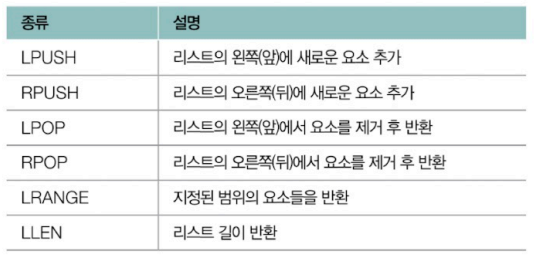
        
        ```sql
        LPUSH 1k "computer" # lk라는 키에 대응되는 리스트 왼쪽에 computer 문자열 요소 추가
        RPUSH 1k "science" # lk라는 키에 대응되는 리스트 오른쪽에 computer 문자열 요소 추가
        LRANGE lk 0 -1     # 리스트 첫번째부터 마지막번째의 요소 반환
        LLEN 1k
        LPOP 1k            # 리스트의 왼쪽에서 요소 제거하고 반환
        RPOP 1k            # 리스트의 오른쪽에서 요소 제거하고 반환
        ```
        
        - LPUSH : 리스트가 비어 있을 경우 새 리스트 생성하고 추가

## 추가 학습 - 데이터베이스 분할과 샤딩

**데이터베이스 분할(데이터베이스 파티셔닝)** : 안정적이고 확장성 높은 데이터베이스 레코드 관리를 위해 테이블을 물리적으로 분할해 레코드를 저장하는 기술

- **파티션** : 분할되어 저장되는 단위
    - 테이블 내에 수많은 레코드가 효율적으로 저장되어야 하는 경우
    - 데이터베이스에 대한 부하의 분산을 고려해야하는 경우
    - 수평적 분할을 의미하는 경우 많음
- **수평적 분할** : 테이블의 **행**을 기준으로 테이블을 나누어 저장하는 방식
    - 테이블에 수많은 레코드가 존재하고 테이블의 레코드를 참조할 때마다 모든 레코드를 한 번에 불러들일 필요가 없는 경우
    - **범위 분할(Range Partitioning)**
        - 레코드 데이터가 가질 수 있는 범위 정의, 해당 범위를 기준으로 테이블 나눔
            
            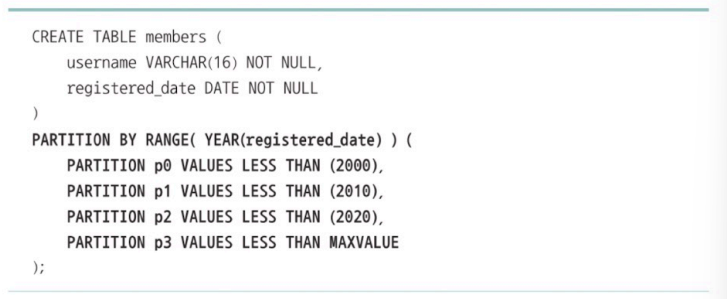
            
    - **목록 분할(List Partitioning)**
        - 레코드 데이터가 특정 목록(리스트)에 포함된 값을 가질 경우 해당 레코드를 별도의 테이블로 분할
            
            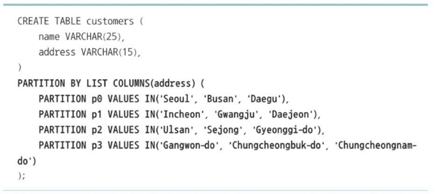
            
    - **해시 분할(Hash Partitioning)**
        - 특정 열 데이터에 대한 해시 값을 기준으로 별도의 테이블로 분할
        - 파티션별 레코드가 해시 값을 기준으로 균등하게 배분
            
            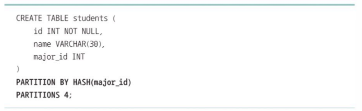
            
    - **키 분할(Key Partitioning)**
        - 키를 기준으로 별도의 테이블로 분할
        - 파티션별 레코드가 키를 기준으로 균등하게 분배
            - 분할된 테이블을 조회할 때, 특정 레코드가 속한 파티션의 식별은 파티셔닝 키를 통해 이루어짐
            - 파티셔닝 키는 테이블의 열을 기준으로 만들어짐
            
            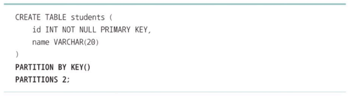
            
    - 동일한 데이터베이스 서버 내에 위치
        - 모두 같은 데이터베이스 서버에 위치할 경우 해당 서버에 요청 몰림
        - ✨ **샤딩(sharding)** : 분할된 테이블을 별개의 데이터베이스 서버에 분산하여 저장하는 기술
            - **샤드(shard)** : 분할되어 저장된 단위
            - 분산 효과 얻을 수도 있음
- **수직적 분할** : 테이블의 **열**을 기준으로 테이블을 나누어 저장하는 방식
    - 테이블에 발생하는 트랜잭션 수에 비해 테이블 내에 열이 과도하게 많을 경우
    - 특정 열에 속하는 레코드의 데이터 크기가 다른 열의 레코드에 비해 과도하게 큰 경우
    - 보안 상의 이유로 특정 열을 별개의 테이블로 나누어 저장해야 하는 경우
  
    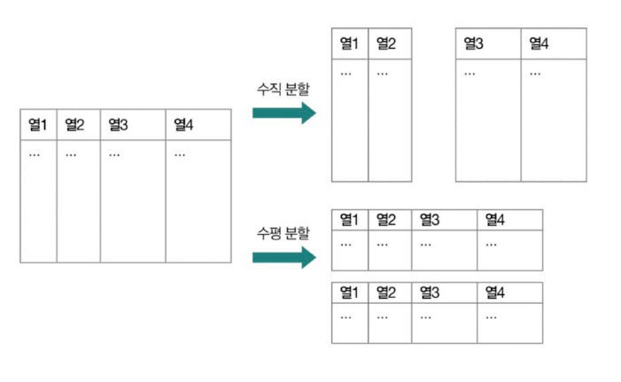


# Q&A
## 1. 데이터 관리에 있어 반드시 정규화를 해야하나요?
아니요. 정규화를 반드시 해야 하는 것은 아닙니다.    
정규화는 데이터의 일관성과 무결성을 높이지만 테이블을 많이 쪼개다보면 빈번해진 조인 연산으로 인해 검색 성능이 저하될 수 있습니다.  
따라서 검색 성능이 중요한 경우 데이터 중복과 연산의 번거로움을 감수하더라도 하나의 테이블로 관리하는 역정규화를 고려해야 합니다.  
또한 NoSQL 데이터베이스의 경우 성능 최적화를 위해 기본적으로 데이터를 정규화하지 않습니다.

## 2. BNCF 정규형에 대해 설명해보세요.
보이스/코드 정규형은 제3 정규형을 만족하면서 모든 결정자가 후보 키여야 한다는 조건입니다.  
여기서 결정자란 특정 필드를 식별할 수 있는 필드를 의미합니다.  
만일 후보 키가 아닌데 결정자 역할을 한다면 테이블을 분리하여 정규화해야 합니다.

## 3. NoSQL과 RDBMS는 데이터베이스의 종류인데, NoSQL이 RDBMS를 완전히 대체할 수 있나요?
아니요. 그렇지는 않습니다.  
ACID에 대한 엄격한 준수나 데이터의 무결성, 일관성 유지가 중요한 환경에서는 RDBMS가 더 적합합니다.  
또한 저장해야 하는 데이터가 비교적 정형화되어 있거나 확장성을 크게 염두에 두고 있지 않다면 굳이 가용성에 중점을 두고 비정형화된 현태를 다루는 NoSQL을 사용할 이유가 없습니다.  
따라서 RDBMS와 NoSQL은 주어진 상황과 필요한 장단점에 따라 선택하는 것이 좋습니다. 