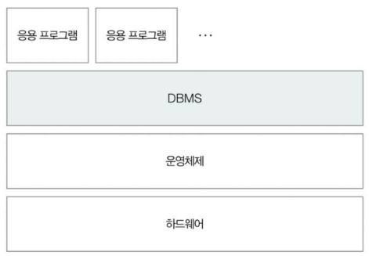
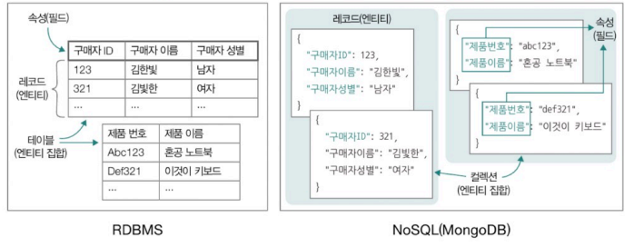
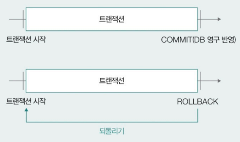
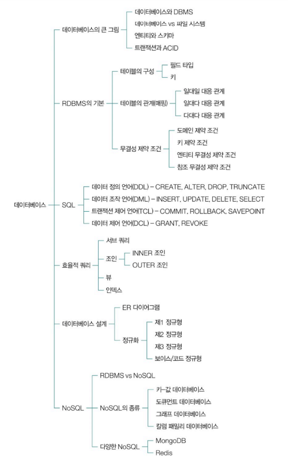
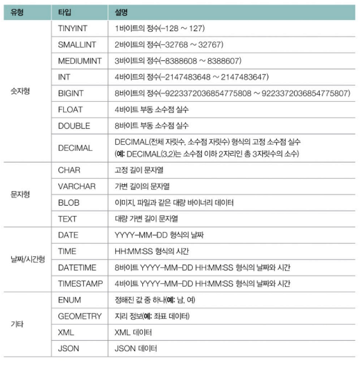
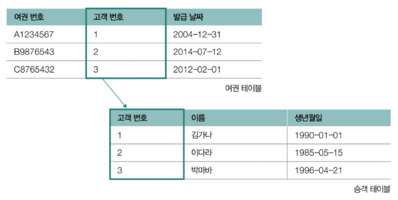
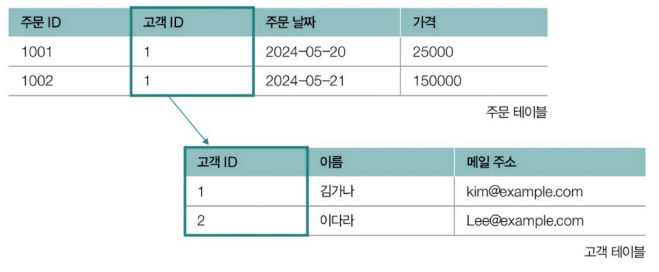
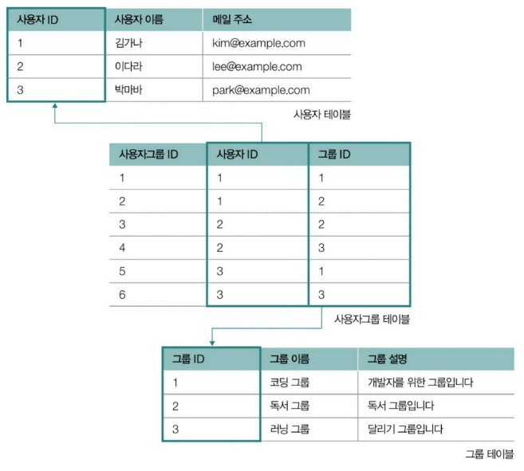

# Chapter 06. 데이터베이스
- [Chapter 06. 데이터베이스](#chapter-06-데이터베이스)
- [06-1. 데이터베이스의 큰 그림](#06-1-데이터베이스의-큰-그림)
  - [데이터베이스와 DBMS](#데이터베이스와-dbms)
    - [DBMS의 종류](#dbms의-종류)
    - [서버로서의 DBMS](#서버로서의-dbms)
  - [파일 대신 데이터베이스를 이용하는 이유](#파일-대신-데이터베이스를-이용하는-이유)
  - [데이터베이스의 저장 단위와 트랜잭션](#데이터베이스의-저장-단위와-트랜잭션)
    - [데이터베이스의 저장 단위](#데이터베이스의-저장-단위)
    - [스키마(schema)](#스키마schema)
    - [트랜잭션과 ACID](#트랜잭션과-acid)
  - [데이터베이스 지도 그리기](#데이터베이스-지도-그리기)
- [06-2. RDBMS의 기본](#06-2-rdbms의-기본)
  - [테이블의 구성 : 필드와 레코드](#테이블의-구성--필드와-레코드)
    - [필드 타입](#필드-타입)
    - [키(key)](#키key)
  - [테이블의 관계](#테이블의-관계)
    - [일대일 대응 관계](#일대일-대응-관계)
    - [일대다 대응 관계](#일대다-대응-관계)
    - [다대다 대응 관계](#다대다-대응-관계)
  - [무결성 제약 조건](#무결성-제약-조건)

---

# 06-1. 데이터베이스의 큰 그림

## 데이터베이스와 DBMS

- **데이터베이스(database)** : 원하는 기능을 동작시키기 위해 마땅히 저장해야 하는 정보의 집합
    - 사전적 정의 : 여러 사람이 공유하여 사용할 목적으로 체계화해 통합, 관리하는 데이터의 집합
- **데이터베이스 관리 시스템(DBMS, Database Management System)** : 데이터베이스를 관리하기 위한 프로그램

### DBMS의 종류

- 관계형 데이터베이스 관리 시스템(RDBMS, Relational DataBase Management System)
    - MySQL, Oracle, PostgreSQL, SQLite, MariaDB, Microsoft SQL Server 등
- NoSQL 데이터베이스 관리 시스템(NoSQL DBMS)
    - MongoDB, Redis 등

### 서버로서의 DBMS

응용 프로그램이지만 사용자(개발자)가 만든 프로그램과 상호작용하며 실행

다른 컴퓨터의 응용 프로그램에서도 접속 가능

- 응용 프로그램 입장에서는 DBMS가 서버와 같음
    - 3-way-handshake를 통해 TCP 연결을 맺고, 때로는 데이터베이스에 접속하기 위한 인증이 필요함
    - DBMS 클라이언트가 DBMS에 쿼리를 보낼 수 있게 데이터베이스 언어 제공
        - 즉, 사용자/응용 프로그램은 DBMS의 데이터베이스 언어를 통해 데이터베이스를 다룸
        - **SQL(Structured Query Language)** : RDBMS에서 데이터를 조작 및 관리하기 위한 언어
            - 데이터베이스에 질의하기 위해 구조화된 언어
            - SQL의 종류
                
                
                | **종류** | **명령** | **설명** |
                | --- | --- | --- |
                | **DDL** (Data Definition Language) | CREATE | 데이터베이스, 테이블, 뷰, 인덱스 등의 데이터베이스 객체 생성 |
                |  | ALTER | 데이터베이스 객체 갱신 |
                |  | DROP | 데이터베이스 객체 삭제 |
                |  | TRUNCATE | 테이블 구조를 유지한 채 모든 레코드 삭제 |
                | **DML** (Data Manipulation Language) | SELECT | 테이블의 레코드 조회 |
                |  | INSERT | 테이블에 레코드 삽입 |
                |  | UPDATE | 테이블의 레코드 갱신 |
                |  | DELETE | 테이블의 레코드 삭제 |
                | **DCL** (Data Control Language) | COMMIT | 데이터베이스에 작업 반영 |
                |  | ROLLBACK | 작업 이전의 상태로 되돌림 |
                |  | SAVEPOINT | 콜백의 기준점 설정 |
                | **TCL** (Transaction Control Language) | GRANT | 사용자에게 권한 부여 |
                |  | REVOKE | 사용자로부터 권한 회수 |

## 파일 대신 데이터베이스를 이용하는 이유

운영체제의 파일 시스템을 활용하면 데이터를 파일과 디렉터리의 형태로 관리할 수 있음

그렇다면 왜 파일 시스템 대신 데이터베이스를 이용할까?

**① 일관성 및 무결성을 띠는 데이터 제공이 어려움**

- 여러 명의 사용자, 프로그램이 동시다발적으로 데이터베이스를 이용함으로써 레이스 컨디션 문제가 발생할 여지가 있고, 이로 인해 데이터의 일관성이 훼손되기 쉬움 (모든 접근에 동기화 도구 사용도 번거로움 )
- 개발자가 파일에 명시된 데이터의 무결함을 일일이 검사하기 번거로움

**② 불필요한 중복 저장이 많아짐**

- 다량의 데이터를 관리할 때 불필요한 중복 저장이 많아지면 스노우볼이 되어 큰 저장 공간 낭비로 이어질 수 있음

**③ 데이터 변경 시 연관 데이터 변경이 어려움**

**④ 정교한 검색이 어려움**

**⑤ 백업 및 복구가 어려움**

## 데이터베이스의 저장 단위와 트랜잭션

### 데이터베이스의 저장 단위

- **엔티티(entity)** : 독립적으로 존재할 수 있는 객체
    - 어떠한 특성을 가진 대상, 데이터베이스에 저장 가능한 대상
    - **속성(attribute)** : 엔티티의 특성
        - 같은 속성을 공유하는 개별 엔티티는 같은 엔티티 집합에 속한다고 할 수 있음
        - **도메인(domain)** : 엔티티의 속성이 가질 수 있는 값의 집합
- **레코드(record)** : 데이터베이스에 저장된 대상, 데이터베이스에 기록된 각각의 엔티티
    - **필드(field)** : 레코드의 속성
        - **차수(degree)** : 필드의 수
        - **카디날리티(cardinality)** : 한 필드에 대한 고유 값의 수, 낮을수록 중복된 속성이 많음을 시사

| **파일 시스템** | **데이터베이스 모델링** | **RDBMS** | **MongoDB** |
| --- | --- | --- | --- |
| 파일(File) | 엔터티(Entity) | 테이블(Table) 또는 관계(Relation) | 컬렉션(Collection) |
| 레코드(Record) | 튜플(Tuple) | 테이블의 행(Row) | 도큐먼트(Document, Json 형태의 데이터) |
| 필드(Field) | 속성(Attribute) | 테이블의 열(Column) | 필드(Field), Key-Value 구조 |

### 스키마(schema)

데이터베이스에 저장되는 레코드의 구조와 제약 조건을 정의한 틀

- 레코드가 지켜야 할 틀이자 청사진
- RDBMS와 NoSQL을 구분하는 기준
    - RDBMS - 명확한 스키마 정의
        - 레코드들은 스키마로 정해진 테이블의 구조, 필드의 데이터 타입 및 제약 조건 따라야 함
        - 정형화된 데이터의 저장 및 관리 용이
    - NoSQL - 명확한 스키마 정의되지 않음 (= 스키마리스 데이터베이스)
        - 유연한 형태의 데이터 저장 및 관리 용이

### 트랜잭션과 ACID

- **트랜잭션(transaction)** : 데이터베이스와의 논리적인 상호작용의 단위
    - 데이터베이스가 처리하는 작업의 단위
    - 초당 트랜잭션(TPS, Transactions Per Second, 지표)으로 데이터베이스의 작업 성능을 나타냄
    - 하나의 쿼리만 포함하는 것은 아님
- ACID - 트랜잭션이 지켜야 하는 성질
    - **A**tomicity(원자성) : 하나의 트랜잭션 결과가 모두 성공하거나 모두 실패하는 성질 (All or Nothing)
        - 트랜잭션이 반드시 커밋되거나 롤백되는 성질
        - **commit** :  트랜잭션을 성공적으로 수행하여 트랜색션을 종료하는 것, 트랜잭션으로 인한 변경 사항 확정
        - **rollback** :  이전 트랜잭션을 취소하는 작업, 트랜잭션이 이루어지기 전으로 되돌릴 수 있음
            
            
            
    - **C**onsistency(일관성) : 트랜잭션 전후로 데이터베이스가 일관된 상태를 유지하는 성질
        - 일관된 상태 - 데이터베이스가 지켜야 하는 일련의 규칙들을 지키는 상태
    - **I**solation(격리성) : 동시에 수행되는 여러 트랜잭션이 서로 간섭하지 않도록 보장하는 성질
        - 레이스 커디션을 방지하기 위한 성질
    - **D**urability(지속성) : 트랜잭션이 성공적으로 완료된 후에 그 결과가 영구적으로 반영되는 성질
        - 시스템 장애가 발생하더라도 완료되었으면 그 결과가 손실되지 않아야 함
        - 오늘날 DBMS는 이를 보장하기 위한 회복 메커니즘 구현되어 있음

## 데이터베이스 지도 그리기

 

---

# 06-2. RDBMS의 기본

## 테이블의 구성 : 필드와 레코드

필드 타입과 키를 이해하면 레코드를 구성하는 데이터의 유형을 이해할 수 있고, 테이블 내 특정 레코드를 식별할 수 있음

### 필드 타입

각 필드로 사용 가능한 데이터 유형(형식, 타입)

MySQL 기준 대표 필드 타입

### 키(key)

테이블의 레코드를 식별할 수 있는 하나 이상의 필드

- 테이블 간의 참조 또는 테이블의 접근 속도를 높이기 위해 사용되기도 함
- **유일성** : 하나의 레코드를 유일하게 식별할 수 있는 성질
- **최소성** : 불필요한 속성 없이 최소한의 속성만으로 레코드를 식별하는 성질

**키의 종류**

| **키 유형** | **유일성** | **최소성** |
| --- | --- | --- |
| 후보 키 | O | O |
| 복합 키 | O | O/X |
| 슈퍼 키 | O | X |
| 기본 키 | O | O |
| 대체 키 | O | O |
| 외래 키 | O/X | O |
- **후보 키(candidate key)**
    - 테이블의 한 레코드를 식별하기 위한 필드의 최소 집합
    - 하나 이상의 필드로 구성
    - 테이블 내에 하나 이상 존재
    - **복합 키(composite key)** : 두 개 이상의 필드 구성된 후보 키
    - **슈퍼 키(super key)** : 레코드를 식별하기 위한 필드의 집합
- **기본 키, 프라이머리 키(PK, primary key)**
    - 한 레코드를 식별하도록 선정되어 테이블당 하나만 존재할 수 있는 키
    - 여러 후보 키 중 테이블의 레코드를 대표하도록 선택된 키
    - 여러 필드로 구성된 기본 키도 가능
    - ✨ 중복된 값이 없어야 함
    - ✨ NULL 값을 가질 수 없음 ⇒ 반드시 값이 존재해야 함
    - **대체 키(alternate key)** : 기본 키가 아닌 후보 키
- **외래 키(FK, foreign key)**
    - 다른 테이블의 기본 키를 참조하는 필드
    - 테이블 간의 참조 관계를 형성할 때 사용하는 키
    - 중복 가능 => 같은 외래 키 값을 가진 여러 행이 있을 수 있음
    - NULL 값 가능
    - 여러 관계 표현 가능 => 하나의 테이블에서 여러 개의 외래 키를 가질 수 있음
    

## 테이블의 관계

외래 키를 매개로 하는 테이블 간 연관 관계

### 일대일 대응 관계

하나의 레코드가 다른 테이블의 레코드 하나에만 대응되는 경우

### 일대다 대응 관계

하나의 레코드가 다른 테이블의 여러 레코드와 대응될 수 있는 경우

### 다대다 대응 관계

한 테이블의 여러 레코드가 다른 테이블의 여러 레코드와 대응되는 경우

- 일반적으로 중간 테이블 수반함

## 무결성 제약 조건

- **무결성** : 일관되고 유효한 데이터의 상태
- **무결성 제약 조건** : 데이터베이스에 저장된 데이터의 일관성과 유효성을 유지하기 위해 마땅히 지켜야 하는 조건
    
    **① 도메인 제약 조건**
    
    - 테이블이 가질 수 있는 필드 타입과 범위에 대한 규칙
        - 각각의 필드 데이터는 원자 값 + 지정된 필드 타입 준수 + 값의 범위나 기본 값이 지정되었을 경우 따라야 함 + NULL이 허용되지 않았다면 NULL 저장 안 됨
            - **원자 값(atomic value)** : 더 이상 쪼갤 수 없는 단일한 값
    
    **② 키 제약 조건**
    
    - 레코드를 고유하게 식별할 수 있는 키로 지정된 필드에 중복된 값이 존재하면 안 됨
    
    **③ 엔티티 무결성 제약 조건 (= 기본 키 제약 조건)**
    
    - 기본 키로 지정한 필드는 고유한 값 + NULL이 되면 안 됨
    
    **④ 참조 무결성 제약 조건 (= 외래 키 제약 조건)**
    
    - 외래 키를 통해 다른 테이블을 참조할 때 데이터의 일관성을 지키기 위한 제약 조건
    - 외래 키는 참조하는 테이블의 기본 키와 같은 값을 갖거나 NULL 값을 가져야 함
    - 참조하는 테이블이 수정/삭제되면?
        - 연산 제한(restrict) : 주어진 수정 및 삭제 연산 자체를 거부
        - 기본 값 설정(set default) : 참조하는 레코드를 미리 지정한 기본 값으로 설정
        - NULL 값 설정(set null) : 참조하는 레코드를 NULL로 설정
        - 연쇄 변경(cascade) : 참조하는 레코드도 함께 수정되거나 삭제