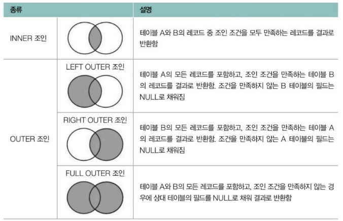
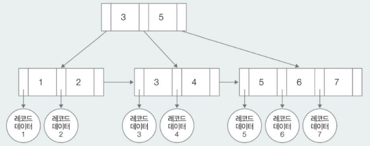

# Chapter 06. 데이터베이스
- [Chapter 06. 데이터베이스](#chapter-06-데이터베이스)
- [06-4. 효율적 쿼리](#06-4-효율적-쿼리)
  - [서브 쿼리와 조인](#서브-쿼리와-조인)
    - [여러 테이블에 질의하기](#여러-테이블에-질의하기)
    - [서브 쿼리](#서브-쿼리)
    - [조인](#조인)
  - [뷰](#뷰)
  - [인덱스](#인덱스)
- [Q\&A](#qa)
  - [1. 인덱스란 무엇이며, 인덱스를 통해 어떻게 성능을 향상시킬 수 있는지 설명해보세요.](#1-인덱스란-무엇이며-인덱스를-통해-어떻게-성능을-향상시킬-수-있는지-설명해보세요)
  - [2. INNER 조인과 OUTER 조인의 차이점은 무엇인가요?](#2-inner-조인과-outer-조인의-차이점은-무엇인가요)
  - [3. SQL에서 뷰를 사용하는 목적은 무엇인가요?](#3-sql에서-뷰를-사용하는-목적은-무엇인가요)

# 06-4. 효율적 쿼리

## 서브 쿼리와 조인

- **서브 쿼리(subquery)** : (내부에) 다른 SQL문이 포함된 SQL문
- **조인(join)** : 2개 이상의 테이블을 하나로 합치는 것

### 여러 테이블에 질의하기

하나의 SELECT문으로 여러 테이블의 레코드 조회 가능

```sql
SELECT 테이블1.필드1, 테이블1.필드2, 테이블2.필드3
	FROM 테이블1, 테이블2
	WHERE 테이블1.필드1 = 테이블2.필드2;
	
-- 예시
SELECT users.username, users.email, posts.title
	FROM users, posts
	WHERE users.user_id = posts.user_id;
```

### 서브 쿼리

MySQL에서의 서브 쿼리 : 다른 SQL문 안에 있는 SELECT문

- 서브 쿼리를 소괄호()로 감싸 외부 쿼리와 구분
- 다른 SELECT, INSERT, UPDATE, DELETE문 안에 포함될 수 있음
    - SELECT문 안에 SELECT문이 포함된 서브 쿼리
        
        ```sql
        -- 사용자별로 작성한 글의 개수 조회
        SELECT
        	users.username,
        	(SELECT COUNT(*)
        	FROM posts
        	WHERE posts.user_id = users.user_id) AS post_count
        FROM users;
        ```
        
    - DELETE문 안에 SELECT문이 포함된 서브 쿼리
        
        ```sql
        -- email이 kim@example.com인 사용자의 글을 삭제
        DELETE FROM posts
        WHERE user_id = (
        	SELECT user_id
        	FROM users
        	WHERE email = 'kim@example.com'
        );
        ```
        

### 조인



INNER JOIN(내부 조인), OUTER JOIN(외부 조인), FULL OUTER JOIN(완전 외부 조인)

- **INNER JOIN**
    - 가장 일반적인 조인, 조인 조건을 모두 만족하는 데이터만을 선택해 결합 (교집합)
    - INNER 생략 가능
    
    ```sql
    SELECT 필드
    FROM 테이블1
    	INNER JOIN 테이블2 ON 조인 조건;
    	(WHERE 가능)
    ```
    
- OUTER JOIN
    - **LEFT OUTER JOIN** : 테이블1의 모든 레코드를 기준으로 테이블2의 레코드를 합치되, 대응되는 레코드가 없다면 해당 값을 NULL로 간주
        
        ```sql
        SELECT 필드
        FROM 테이블1
        	LEFT OUTER JOIN 테이블2 ON 조인 조건;
        
        -- 사용자별로 작성한 글의 개수 조회
        SELECT users,username, COUNT(posts.post_id) AS post_count
        FROM users
        	LEFT JOIN posts ON users.user_id = posts.user_id
        	GROUP BY users.username;
        ```
        
    - **RIGHT OUTER JOIN** : 테이블2의 모든 레코드를 기준으로 테이블1의 레코드를 합치되, 대응되는 레코드가 없다면 해당 값을 NULL로 간주
        
        ```sql
        SELECT 필드
        FROM 테이블1
        	RIGHT OUTER JOIN 테이블2 ON 조인 조건;
        ```
        
    - **FULL OURTER JOIN** : 두 테이블의 모든 레코드를 선택하되, 대응되지 않는 모든 레코드를 NULL로 표기
        - MySQL 등 RDBMS에서 지원 안 하는 문법 ⇒ LEFT OUTER JOIN + RIGHT OUTER JOIN
        - **UNION** : 여러 SQL문을 결합하는 키워드 (합집합)
            
            ```sql
            SELECT 필드
            FROM 테이블1
            	LEFT JOIN 테이블2 ON 조인 조건
            	UNION
            SELECT 필드
            FROM 테이블1
            	RIGHT JOIN 테이블2 ON 조인 조건;
            ```
            

## 뷰

- **뷰(view)** : SELECT문의 결과로 만들어진 가상의 테이블
    - 테이블에 대한 SQL문을 단순화하기 위해 사용 ⇒ **쿼리의 단순화, 재사용성 높이기 위해**
    - 특정 사용자에게 테이블의 특정 데이터만을 보여주고자 할 때 사용
        - 테이블 상의 노출 가능한 데이터만을 포함하는 뷰를 만들어 특정 사용자에게 GRANT를 통해 접근 권한 부여
    - 특징
        - 생성한 뷰는 하나의 논리적인 테이블처럼 활용 가능(SHOW TABLE을 통해 조회 가능)
        - SELECT는 제한이 없으나 INSERT, UPDATE, DELETE 등은 불가능할 수 있음
            - 여러 테이블을 SELECT한 결과로 만들어진 뷰는 삽입/수정/삭제 연산이 제약 조건을 어기기 쉽기 때문
            - 따라서 조회 목적으로 사용되는 경우 많음
    
    ```sql
    -- 뷰 생성
    CREATE VIEW 뷰_이름 AS SELECT문;
    
    -- 뷰 생성 예시
    CREATE VIEW myview AS
    	SELECT users.username, users.email, posts.title
    	FROM users, posts
    	WHERE users.user_id = posts.user_id;
    
    -- 뷰 삭제
    DROP VIEW 뷰_이름;
    ```
    

## 인덱스

- **인덱스(Index)** : 검색 속도 향상을 목적으로 만드는 하나 이상의 데이터 필드에 대한 자료구조
    - 수많은 레코드를 조회하는 작업이 빈번한 RDBMS의 성능을 향상시키는 가장 대중적인 방법
    - 특정 필드에 대한 인덱스를 생성하면 원하는 레코드에 더 빠르게 접근 가능
    - 한 테이블에 2개의 인덱스가 있을 수 있음
    - 테이블(필드)에 종속된 개념이기 때문에 테이블이 삭제되면 관련된 인덱스는 모두 삭제됨
        <details>
        <summary>B-Tree와 B+Tree</summary>
        
        인덱스로 사용되는 자료구조(해시 테이블도 있음)
        
        **B-Tree** : 균형잡힌 트리 구조로, 이진탐색트리에 기반하여 2개 이상의 자녀 노드를 가질 수 있음(오름차순 정렬)
        
        **B+Tree** : B-Tree에서 리프 노드 간 연결성이 추가된 자료구조
        
        - 하나만 선형 검색을 통해 위치를 알게 되면 나머지 값 탐색 가능
        1. **메모리 효율** : B-Tree는 각 노드에 데이터의 주소와 데이터가 있는 반면, B+Tree에는 리프 노드엠나 실제 데이터가 있어 메모리 측면에서는 B+Tree가 효율적
        2. **생성 및 삭제 효율** : B+Tree는 리프 노드 간 연결을 나타내는 데이터도 관리되어야 하기 때문에 B-Tree가 더 효율적
        
        
        
        각 노드에 키로써 인덱스 값 포함됨, 인덱스 값을 탐색하면 실제 데이터(레코드)가 저장된 위치 알 수 있음
        
        [[MySQL] Index의 구조 : B-Tree, B+Tree](https://velog.io/@juhyeon1114/MySQL-Index%EC%9D%98-%EA%B5%AC%EC%A1%B0-B-Tree-BTree)
        

**MySQL에서의 인덱스 종류**

- **클러스터형 인덱스(clustered index)**
    - 테이블당 하나씩 만들 수 있는 인덱스, 기본 키
        - 기본 키가 없을 경우 NOT NULL 제약 조건과 UNIQUE 제약 조건이 있는 필드
- **세컨더리 인덱스(secondary index)**
    - 클러스터령 인덱스가 아닌 인덱스(=논클러스터형 인덱스 non-clustered index)
    - 테이블당 여러 개가 존재할 수 있지만 클러스형 인덱스를 활용한 검색보다 느림
    
    ```sql
    -- '테이블 이름'의 '필드'에 세컨더리 인덱스인 '인덱스 이름'을 생성
    CREATE INDEX 인덱스_이름 ON 테이블_이름 (필드);
    
    -- 예시
    CREATE INDEX idxuser ON users(nickname);
    
    -- 인덱스 조회
    SHOW INDEX FROM 테이블_이름
    
    -- 인덱스 삭제
    DROP INDEX 인덱스_이름 FROM 테이블_이름:
    ```
    

**인덱스를 생성할 때 주의할 점**

1. 모든 필드에 대해 인덱스 생성 지양
    - 인덱스도 여러 데이터를 포함하는 자료구조이기 때문에 저장 공간과 생성 시간이 점점 커질 수 있음
    - 조회 성능은 향상시킬 수 있으나 그 외의 작업에선 오히려 성능을 떨어뜨릴 수 있음
        - 새로운 데이터를 삽입하거나 기존의 데이터를 수정/삭제할 때 인덱스에 대한 작업도 동시에 이루어져야 하기 때문에 추가 자원 및 연산 필요
    - 데이터가 충분히 많은 테이블, 조회가 빈번히 이루어지는 테이블 필드에 만들어 활용하는 것이 좋음
        - SELECT문 중 자주 조인되거나 WHERE, ORDER BY에서 자주 언급되는 필드

1. 테이블당 지나치게 많은 인덱스 지양
    - 테이블당 3개 이하의 인덱스 권고

1. 중복되는 데이터가 많은 필드에 대해 인덱스 생성 지양
    - 중복 데이터가 많으면 인덱스를 사용하든 안 하든 많은 레코드를 탐색해야 한다는 것이 크게 달라지지 않음

# Q&A
## 1. 인덱스란 무엇이며, 인덱스를 통해 어떻게 성능을 향상시킬 수 있는지 설명해보세요.
인덱스는 특정 테이블 열에 대한 자료구조로, 검색 속도를 향상시키기 위해 사용됩니다.  
인덱스를 생성하면 해당 테이블의 열 값들이 정렬된 형태로 저장되므로 테이블 전체를 탐색하지 않고도 빠르게 데이터를 찾을 수 있어 검색 성능이 향상됩니다.

## 2. INNER 조인과 OUTER 조인의 차이점은 무엇인가요?
INNER 조인은 조인 조건을 만족하는 행들만 결과에 포함되며, 공통된 데이터가 있는 경우에만 데이터를 추출합니다.  
OUTER 조인은 공통된 값이 없는 행도 포함하여 반환합니다.  
LEFT OUTER 조인은 왼쪽 테이블의 모든 행과 오른쪽 테이블의 일치하는 값을 반환하고, 일치하지 않는 경우 NULL을 반환합니다.  
반면, RIGHT OUTER 조인은 오른쪽 테이블의 모든 행과 왼쪽 테이블의 일치하는 값을 반환하고, 일치하지 않는 경우 NULL을 반환합니다.  
또 FULL OUTER 조인은 양쪽 테이블의 모든 행을 반환하고, 어느 한 쪽에서 일치하는 값이 없는 경우 NULL을 반환합니다.

## 3. SQL에서 뷰를 사용하는 목적은 무엇인가요?
뷰는 SQL 쿼리의 단순화와 재사용성을 위해 사용합니다.  
복잡한 쿼리를 자주 실행해야 하는 경우 뷰를 생성하여 동일한 결과를 간단하게 얻을 수 있습니다. 더불어 특정 사용자에게 테이블의 특정 데이터만을 보여주고자 할 때 사용됩니다.