- [6. 데이터베이스](#6-데이터베이스)
- [6.1\_데이터베이스의 큰 그림](#61_데이터베이스의-큰-그림)
  - [데이터베이스와 DBMS](#데이터베이스와-dbms)
    - [DBMS의 종류](#dbms의-종류)
    - [서버로서의 DBMS](#서버로서의-dbms)
  - [파일 대신 데이터베이스를 이용하는 이유](#파일-대신-데이터베이스를-이용하는-이유)
  - [데이터베이스의 저장 단위와 트랜잭션](#데이터베이스의-저장-단위와-트랜잭션)
    - [데이터베이스의 저장 단위](#데이터베이스의-저장-단위)
    - [스키마](#스키마)
    - [트랜잭션과 ACID](#트랜잭션과-acid)
  - [데이터베이스 지도 그리기](#데이터베이스-지도-그리기)
- [6.2 RDBMS의 기본](#62-rdbms의-기본)
  - [테이블의 구성: 필드와 레코드](#테이블의-구성-필드와-레코드)
    - [필드 타입](#필드-타입)
    - [키](#키)
  - [테이블의 관계](#테이블의-관계)
    - [일대일 대응 관계](#일대일-대응-관계)
    - [일대다 대응 관계](#일대다-대응-관계)
    - [다대다 대응 관계](#다대다-대응-관계)
  - [무결성 제약 조건](#무결성-제약-조건)
- [Q\&A](#qa)

# 6. 데이터베이스
# 6.1_데이터베이스의 큰 그림

## 데이터베이스와 DBMS
데이터베이스(database): 여러 사람이 공유하여 사용할 목적으로 체계화해 통합, 관리하는 데이터의 집합
- 원하는 기능을 동작시키기 위해 마땅히 저장해야 하는 정보의 집합(ex: 쇼핑몰 웹 사이트의 품목 데이터)

데이터베이스 관리 시스템(이하 DBMS_Database Management System): 데이터베이스를 관리하기 위한 수단

### DBMS의 종류
1. 관계형 데이터 베이스 관리 시스템(이하 RDBMS 혹은 관계형 데이터베이스_Relational DataBase Management System)
  - ex) MySQL, Oracle, PostgreSQL, SQLite, MariaDB, MicrosoftSQL Server 등
2. NoSQL 데이터베이스 관리 시스템(이하 NoSQL DBMS, 혹은 NoSQL 데이터베이스)
   - ex) MongoDB, Redis 등
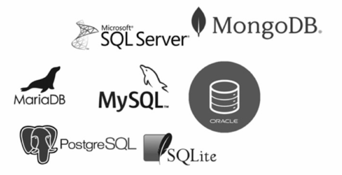

▼ DBMS 점유율(개발자들이 주로 사용하고 있는 DBMS)\
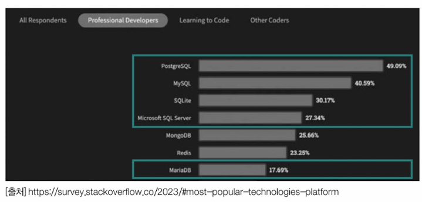

※ 이후 언급하는 DBMS는 기본적으로 RDBMS를 지칭. 그 중 MySQL 8.0을 위주로 다룰 예정(MongoDB와 Redis로 대표되는 NoSQL DBMS는 6절에서 학습 예정)

### 서버로서의 DBMS
- DBMS는 사용자와 직접적으로 상호작용하기보다는 사용자(개발자)가 만든 프로그램과 상호작용하며 실행되는 응용 프로그램
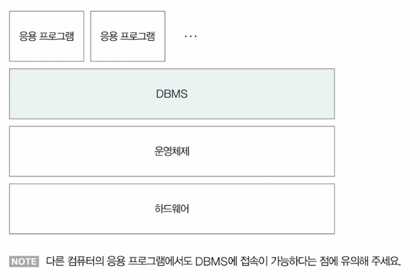
- 응용 프로그램(들)의 입장에서는 DBMS는 마치 서버와 같음
- 응용 프로그램이 DBMS를 이용하는 과정은 '(네트워크의) 클라이언트-서버'간의 동작과 유사함(쓰리 웨이 핸드셰이크를 통한 TCP 연결, 때론 DB에 접속하기 위한 인증이 필요)
- 네트워크에서 클라이언트가 서버에 요청을 보내듯, DBMS 클라이언트는 DBMS에 **쿼리(query)**를 보냄
- 데이터베이스 언어: DBMS가 제공하는 데이터베이스를 다루기 위한 언어
  - ex) SQL(Structured Query Language): RDBMS에서 데이터를 조작/관리하기 위한 언어. DB에 질의(Query)하기 위한 구조화된(Structured) 언어(Language)
  - 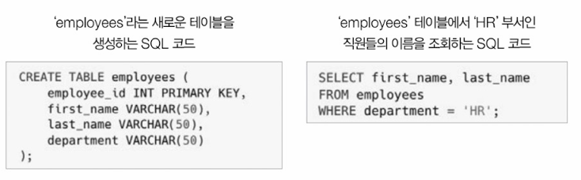

**SQL의 종류**\
| 종류 | 용도 |
| :-: | :-: |
|DDL(Data Definition Language)|데이터 정의|
|DML(Data Manipulation Language)| 데이터 조작|
|DCL(Data Control Language)|데이터 제어|
|TCL(Transaction Control Language)|트랜잭션 제어|

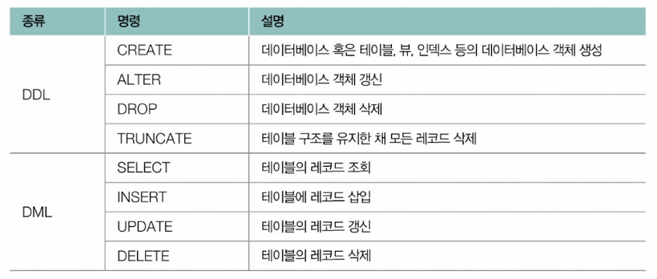
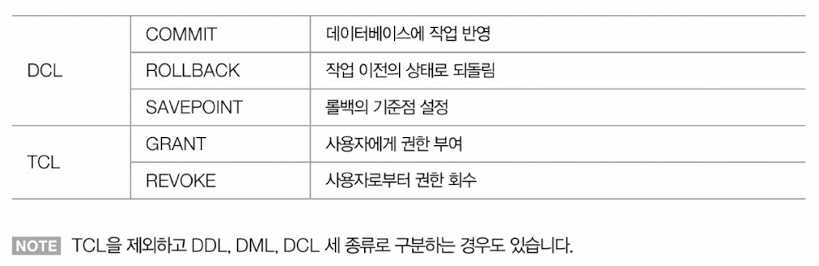

> 기술 면접에서의 SQL\
> 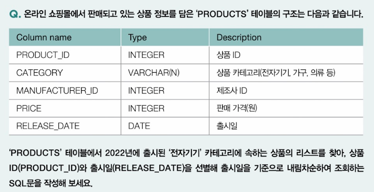

## 파일 대신 데이터베이스를 이용하는 이유
▼ 파일 저장 예\
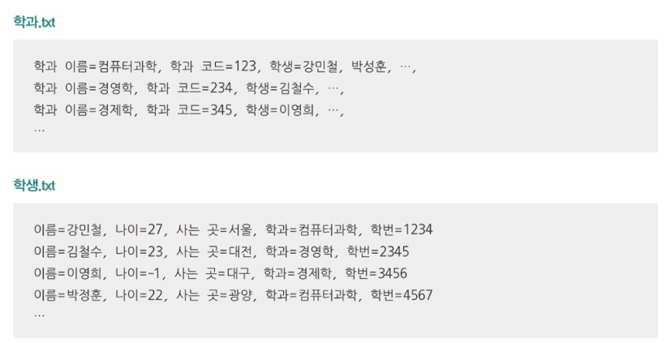

1. 데이터 일관성 및 무결정 제공이 어려움
   - 여러 명의 사용자, 프로그램이 동시다발적으로 데이터베이스를 이용 -> 레이스 컨디션 문제가 발생할 여지가 있음 -> 데이터의 일관성 훼손 위험
   - 데이터의 무결성 보장이 어려움(예시 사진에서 '이영희'의 나이가 잘못된 값 '-1'로 저장됨_잘못된 값 검출 어려움)

2. 불필요한 중복 저장이 많아짐

3. 데이터 변경 시 연관 데이터 변경이 어려움
   - 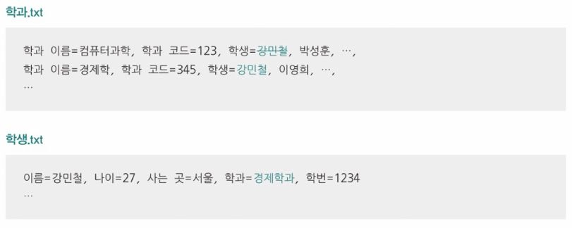
   - ex) 학과 이름이 '컴퓨터과학'에서 '컴퓨터학과'로 변경되었을 때 일일히 변경해야함

4. 정교한 검색이 어려움
   - '나이가 25살 이상인 컴퓨터과학과인 서울 거주자'라는 식의 정교한 검색은 파일만으로는 어려움

5. 백업 및 복구가 어려움

## 데이터베이스의 저장 단위와 트랜잭션
### 데이터베이스의 저장 단위
- 데이터베이스에는 다양한 속성을 가진 독립적 객체들이 저장될 수 있음
- 엔티티(entity): 독립적으로 존재할 수 있는 객체
▼ 엔티티 예시\
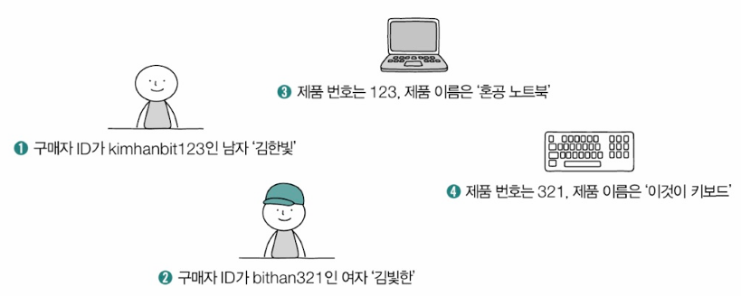

- 속성(attribute): 엔티티의 특성
  - 위의 사진에서 구매자 ID, 구매자 이름, 성별 등 각각이 엔티티의 속성
  - 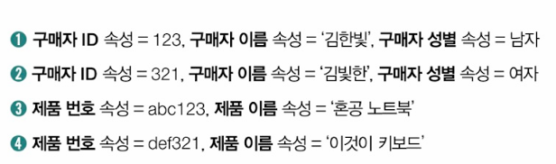
  - 같은 속성을 공유하는 개별 엔티티는 같은 **엔티티 집합**에 속한다고 할 수 있음
  - 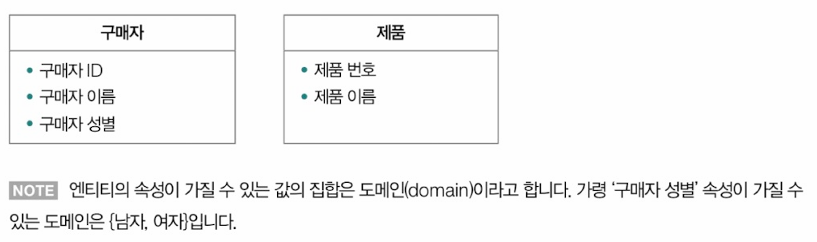

<엔티티 집합 표현 방식>\
RDBMS는 엔티티 집합을 테이블(표)의 형태로 표현함
- 릴레이션(relation): RDBMS에서 표현되는 이차원 테이블 형태의 엔티티 집합
- 컬렉션(collection): NoSQL DBMS의 일종인 MongoDB에서 엔티티 집합을 표현하는 단위

<엔티티 저장 전/후에 따른 용어 정리>
|데이터베이스에 저장 전|데이터베이스에 저장 후|
|엔티티('저장 가능한 대상')|레코드(record, '저장된 대상')|
|속성|필드(field)|

- RDBMS에서는 개별 레코드를 테이블의 행으로, 필드를 테이블의 열로 표현
- NoSQL DBMS인 MongoDB에서는 개별 레코드를 도큐먼트(document, Json 형태의 데이터)라는 단위로, 필드를 Json 키의 형태로 표현
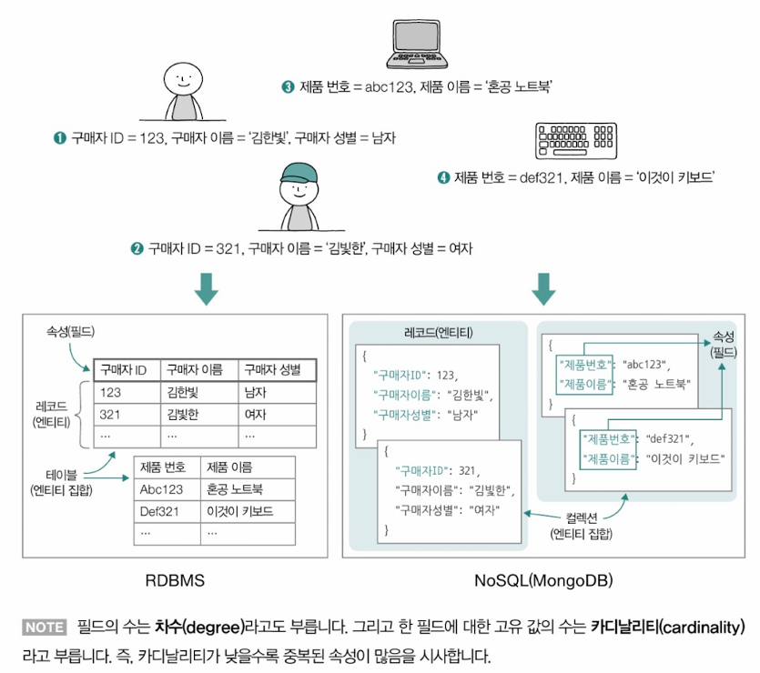

### 스키마
- 스키마(schema): 데이터베이스에 저장되는 레코드의 구조와 제약 조건
  - 레코드가 지켜야 할 틀이자 청사진
  - RDBMS와 NoSQL을 구분하는 주요 기준 중 하나
  - 스키마가 명확히 정의되어 있다면, 레코드를 틀(스키마)에 맞는 정형화된 데이터로 저장하고 관리하기가 용이해짐
  
  - RDBMS는 명확한 스키마가 정의됨
    - 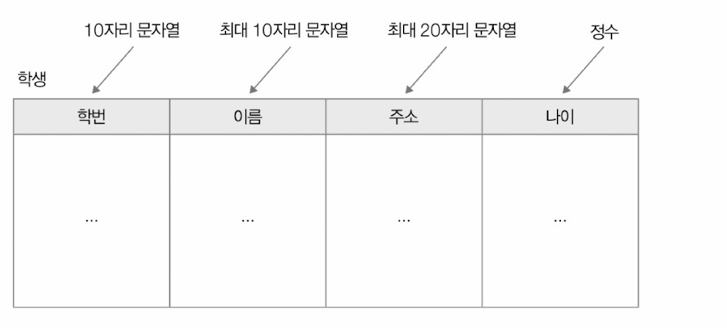
    - 위의 테이블에서 테이블의 구조, 각 필드의 데이터 타입, 제약 조건 등이 정의된 틀이 스키마임
  - NoSQL은 명확한 스키마가 정의되지 않음 -> 스키마-리스(schema-less) 데이터베이스라고도 부름
    - RDBMS보다 자유로운 형태의 레코드 저장 가능
    - ex) '학생'이라는 컬렉션이 있다고 가정했을 때 해당 컬렉션에는 아래와 같은 도큐먼트가 저장될 수 있음
    - 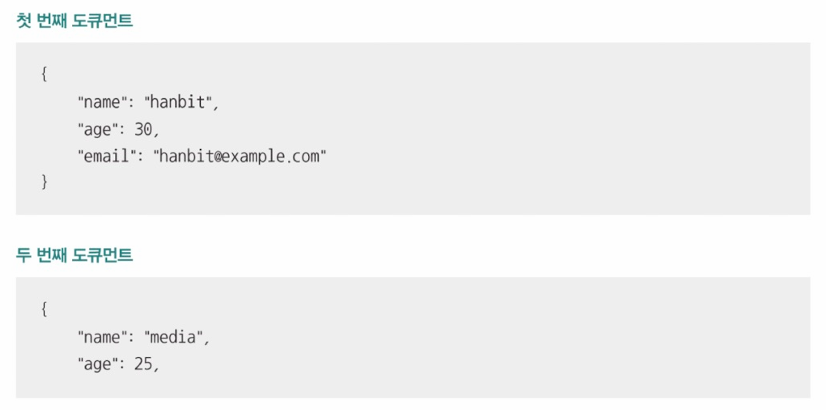
    - 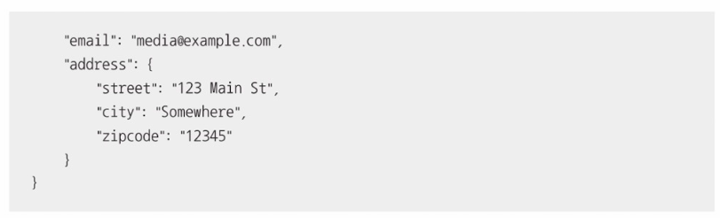

### 트랜잭션과 ACID
- 트랜잭션(transaction): 데이터베이스와의 논리적 상호작용의 단위
  - 초당 트랜잭션(TPS, Transactions Per Second)이라는 지표로 데이터베이스의 작업 성능을 나타내기도 함
  - 트랜잭션이 하나의 쿼리만 포함하는 것은 아님
  - ex) '한빛'이가 '빛한'이에게 5,000원을 이체하는 트랜잭션에서는 아래와 같은 2개 이상의 쿼리가 포함될 수 있음
  - 

여러 작업을 내표하는 트랜잭션이 동시다발적으로 실행될 때 안전한 트랜잭션을 보장하기 위해 지켜야 하는 성질 4가지: ACID(원자성, 일관성, 격리성, 지속성)

1. 원자성(Atomicity)
   - 하나의 트랜잭션 결과가 모두 성공하거나 모두 실패하는 성질
   - ex) 빛한이의 계좌 잔액을 5,000원 증가시키는 작업이 실행되는 도중 DBMS가 다운되었다면 한빛이의 계좌 잔액을 5,000원 감소시켰던 작업도 취소되어야 함
   - 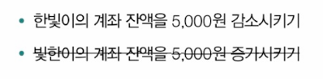

> **커밋과 롤백**\
> - 원자성을 트랙잭션이 반드시 커밋되거나 롤백되는 성질이라고도 표현
> - 커밋(commit): 트랜잭션을 성공적으로 수행하여 트랜잭션을 종료하는 것
>   - 트랜잭션으로 인한 변경 사항을 확정한다는 의미로도 사용됨
> - 롤백(rollback): 이전 트랜잭션을 취소하는 작업을 의미
>   - 데이터베이스를 롤백하면 트랜잭션이 이루어지기 전으로 되돌릴 수 있음
> 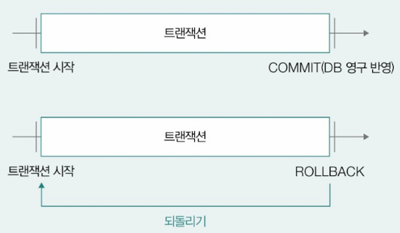

2. 일관성(Consistency)
   - 트랜잭션 전후로 데이터베이스가 일관된 상태를 유지하는 성질
     - 일관된 상태: 데이터베이스가 지켜야 하는 일련의 규칙들을 지키는 상태
   - 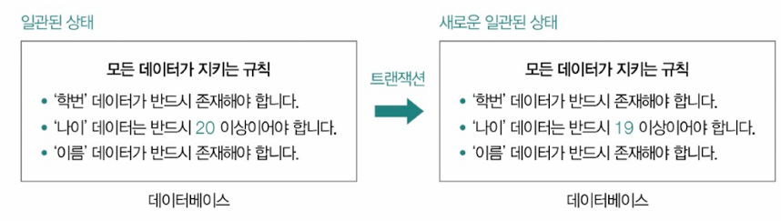

3. 격리성(Isolation)
   - 동시에 수행되는 여러 트랜잭션이 서로 간섭하지 않도록 보장하는 성질
     - 즉, 레이스 컨디션을 방지하기 위한 성질
     - 한 트랜잭션이 어떤 데이터에 접근하여 조작 중일 때는 다른 트랜잭션이 접근할 수 없음

4. 지속성(Durability)
   - 트랜잭션이 성공적으로 완료된 후에 그 결과가 영구적으로 반영되는 성질
   - 시스템 장애가 발생하더라도 완료된 트랜잭션의 결과는 손실되지 않아야 함
   - ex) 은행에서 특정 계좌에 돈을 입금하는 트랜잭션이 성공적으로 완료 -> 그 결과가 디스크에 기록되어 시스템 장애가 발생하더라도 입금 내역이 사라지지 않아야 함

## 데이터베이스 지도 그리기

▼ 2절 학습 내용\
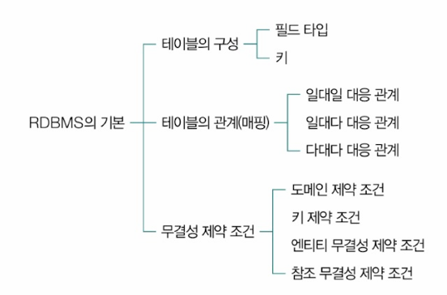

▼ 3, 4절 학습 내용\
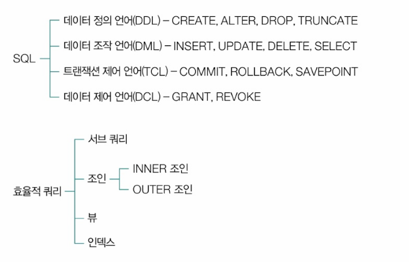

▼ 5절 학습 내용\
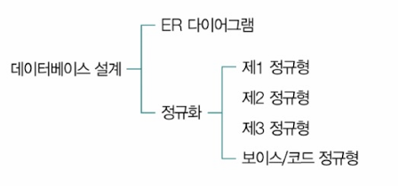

▼ 6절 학습 내용\
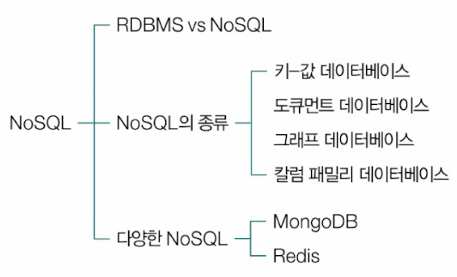

▼ 전체 그래프\
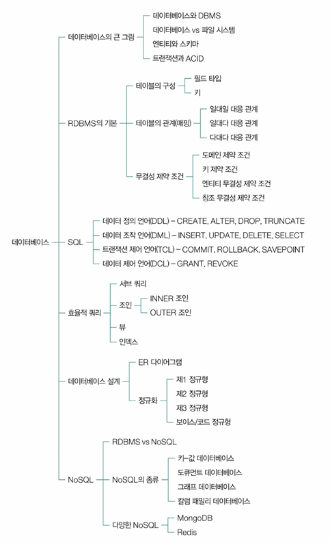

# 6.2 RDBMS의 기본
## 테이블의 구성: 필드와 레코드
- 필드 타입: 필드로 사용 가능한 데이터 유형
- 키: 테이블 내의 특정 레코드를 식별할 수 있는 필드의 집합
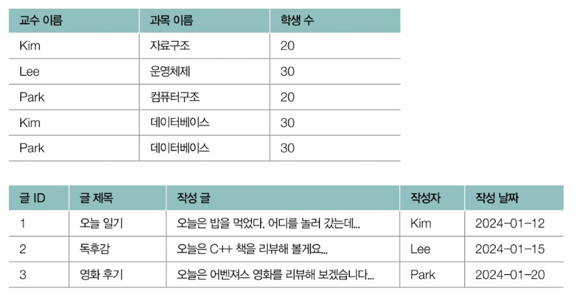

### 필드 타입
- RDBMS의 테이블 필드에는 다양한 데이터 형식(타입)이 저장될 수 있음
▼ MySQL을 기준으로 정리한 대표적인 필드 타입\
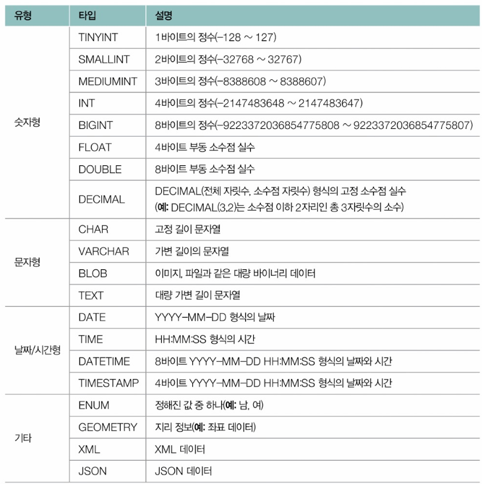

### 키
- 키(key): 테이블의 레코드를 식별할 수 있는 하나 이상의 필드(ex: '교수 이름'과 '과목 이름'의 조합, '글 ID', '글 제목'과 '작성 날짜'의 조합)
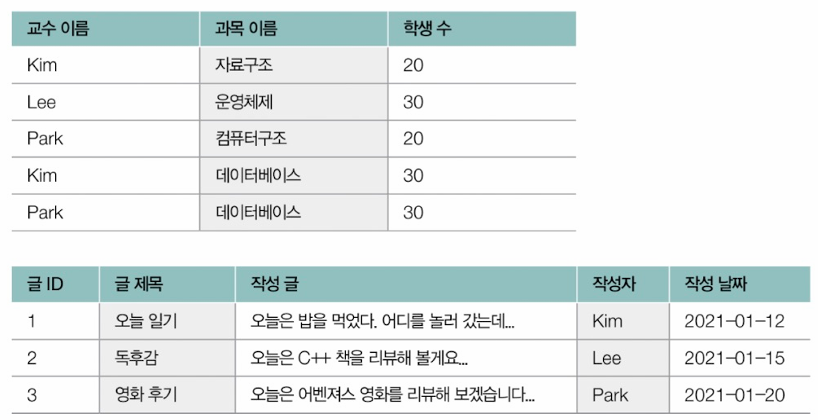
- 용도
  - 각 레코드의 식별
  - 테이블 간의 참조
  - 테이블의 접근 속도 향상 등

- 종류
  - 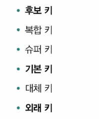
  
  - 후보 키(candidate key)
    - 테이블의 한 레코드를 식별하기 위한 필드의 최소 집합
    - 하나 이상의 필드로 구성될 수 있음
    - 후보 키에 포함된 필드 중 하나라도 생략하면 레코드를 고유하게 식별할 수 없게 됨
    - 유일성과 최소성을 모두 만족하는 키
    
    - ex) 아래 '학생' 테이블에서 '학번, 이메일, 전화번호'가 고유한 값이라면 '학번', '이메일', '전화번호' 각각이 후보 키로 간주될 수 있음
    - 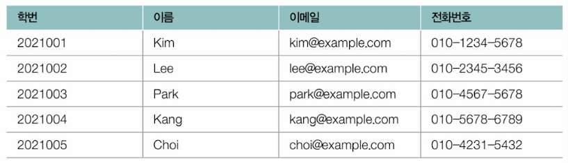
    
    - ex) 아래 '성적' 테이블에서의 후보 키는 {학번, 과목 코드}가 됨. (최소 이 두 개의 필드로 레코드를 식별할 수 있기 때문)
    - 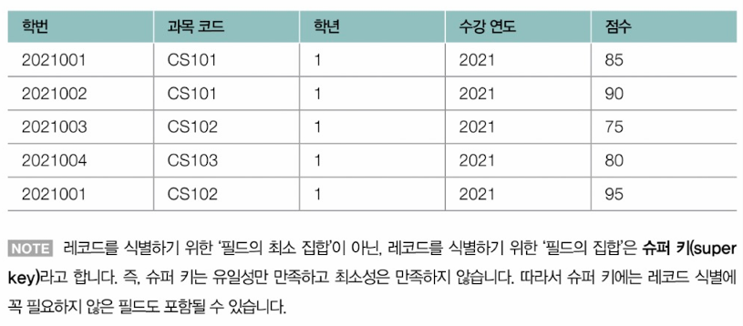

    > 복합 키(composite key): 두 필드 이상으로 구성된 후보 키

  - 기본 키(primary key, PK)
    - 한 레코드를 식별하도록 선정되어 테이블당 하나만 존재할 수 있는 키
    - 여러 후보 키 중에서 테이블의 레코드를 대표하도록 선택된 키 -> 유일성과 최소성을 모두 만족
    - 여러 필드로 구성된 기본 키도 존재할 수 있음
    - 중복된 값이 없어야하고 반드시 값이 존재해야 함
    - 레코드를 구분하기 위한 최소한의 정보만으로 이루어져 있어야 함
  
    - ex) '학생' 테이블에서는 후보 키들 중 '학번' 필드를 기본 키로 삼을 수 있음
    - 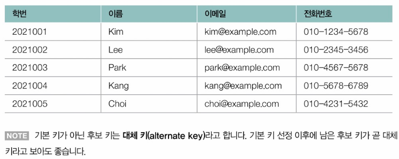
  
  - 외래 키(foreign key, FK)
    - 다른 테이블의 기본 키를 참조하는 필드로, 테이블 간의 참조 관계를 형성할 때 사용하는 키
    
    - ex) '학생' 테이블과 '과목' 테이블에서 '학생' 테이블의 '수강 과목' 필드는 '과목' 테이블의 '개설 과목'을 참조하는 외래 키로 활용할 수 있음
    - 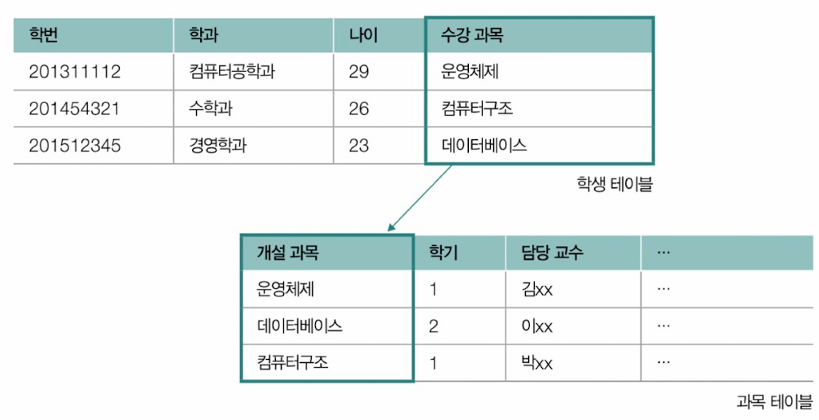
    
    - ex) '구매자' 테이블과 '상품 목록' 테이블에서 '구매자' 테이블의 '장바구니' 필드는 '상품 목록' 테이블의 '상품 ID'를 참조할 수 있음
    - 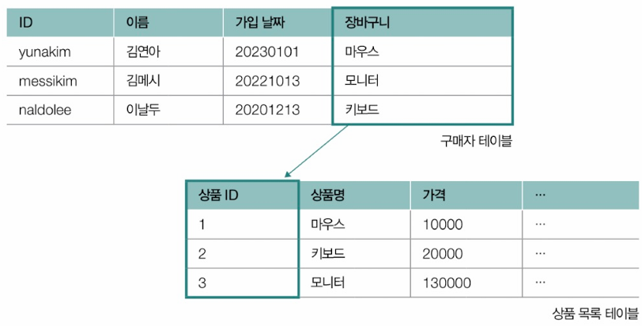

## 테이블의 관계
- 외래 키를 매개로 하는 테이블 간 연관 관계 종류
  - 일대일 대응 관계
  - 일대다 대응 관계
  - 다대다 대응 관계

### 일대일 대응 관계
- 하나의 레코드가 다른 레코드 하나에만 대응되는 경우
  
- ex) '여권' 테이블은 '고객 번호'를 외래 키 삼아 '승객' 테이블을 참조하고 있음
- 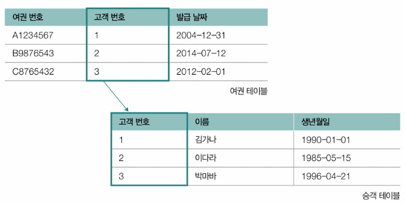
- 한 사람당 오직 하나의 여권만 가질 수 있기 때문에 두 테이블은 일대일 대응 관계라고 할 수 있음
- 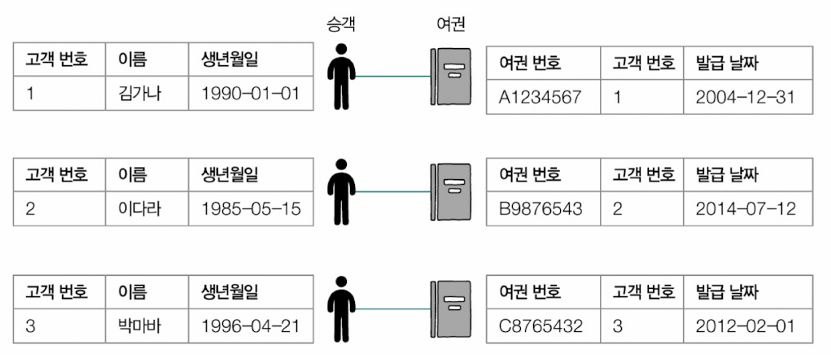

### 일대다 대응 관계
- 하나의 레코드가 다른 테이블의 여러 레코드와 대응될 수 있는 경우

- ex) '주문' 테이블과 '고객' 테이블이 있다고 가정했을 때, 한 고객은 여러 건의 주문을 할 수 있지만, 각 주문은 한 명의 고객에게만 속함(일대다 관계)
- 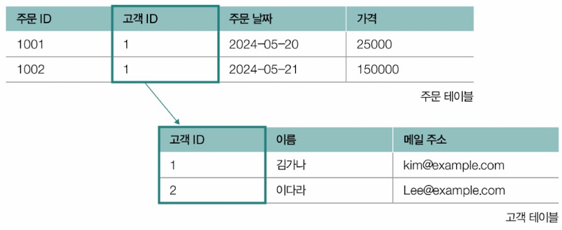
- '고객' 테이블에 속한 엔티티 하나는 '주문' 테이블에 속한 여러 개의 엔티티에 대응될 수 있음
- 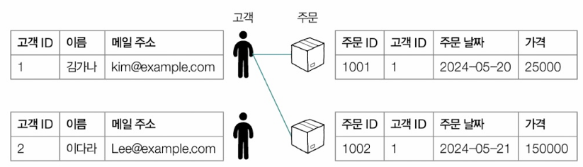

### 다대다 대응 관계
- 한 테이블의 여러 레코드가 다른 테이블의 여러 레코드와 대응되는 경우
- 테이블 간 다대다 대응 관계는 일반적으로 중간 테이블을 수반함
  - 중간 테이블을 통한 다대다 대응 관계는 중간 테이블에 대한 일대다 대응이 두 번 이뤄진 것과 같음

- eX) 하나의 사용자 계정이 여러 그룹에 가입할 수 있는 SNS
- 각 사용자는 여러 그룹에 가입할 수 있고, 각 그룹에는 여러 사용자가 속할 수 있음
- '사용자' 테이블과 '그룹' 테이블의 다대다 대응 관계를 표현하기 위해 '사용자그룹' 테이블을 사용
  - '사용자' 테이블과 '사용자그룹' 테이블이 '사용자 ID'를 매개로 일대다 관계를 형성
  - '그룹' 테이블과 '사용자그룹' 테이블이 '그룹 ID'를 매개로 일대다 관계를 형성
- 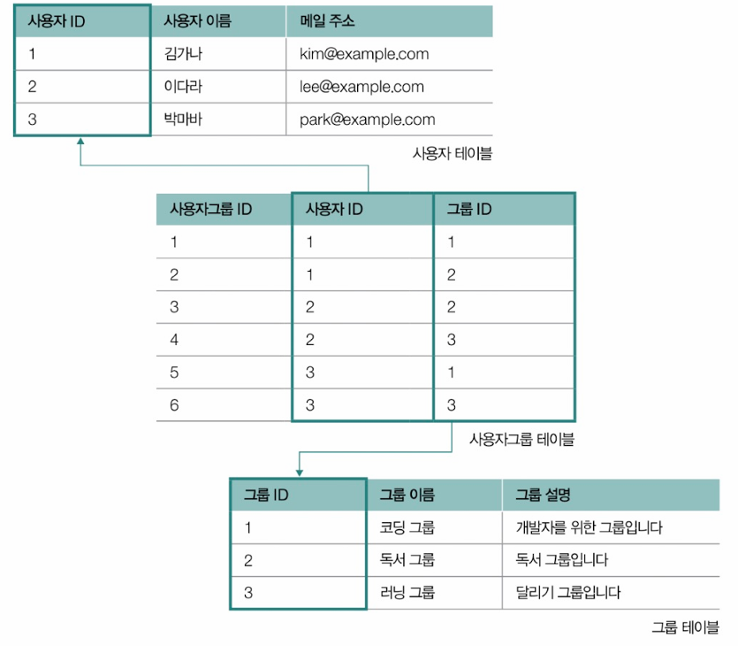
- 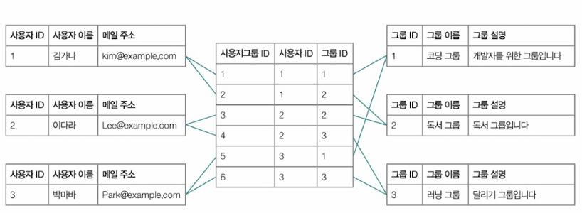

## 무결성 제약 조건
- 무결성: 일관되며 유효한 데이터의 상태
- 무결성 제약 조건: 데이터베이스에 저장된 데이터의 일관성과 유효성을 유지하기 위해 마땅히 지켜야 하는 조건

▼ 무결성 제약 조건을 지키지 않을 경우 오류 메시지\
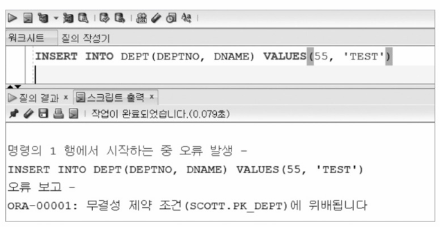

1. 도메인 제약 조건(domain constraint)
   - 테이블이 가질 수 있는 필드 타입과 범위에 대한 규칙
     - 각각의 필드 데이터는 원자 값을 가져야 함
     - 지정된 필드 타입을 준수해야 함
     - 값의 범위나 기본값이 지정되었을 경우 그를 따라야 함
     - NULL이 허용되지 않았다면 NULL이 저장되어서는 안됨

  - ex) 아래와 같이 조건이 명시된 테이블에서 제약 조건을 위배하는 데이터가 삽입/수정될 경우 '도메인 제약 조건에 위배'된 것으로 간주
  - 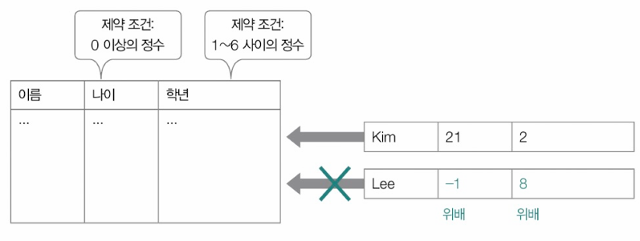

> **원자 값(atomic value)**\
> - 더 이상 쪼갤 수 없는 단일한 값
> - 테이블의 각 필드 데이터는 더 이상 쪼갤 수 없는 단일한 값이어야 함
> - ex) 아래 테이블의 필드 데이터인 '이름, 나이, 성별'은 각각 원자 값이라 할 수 있음
> 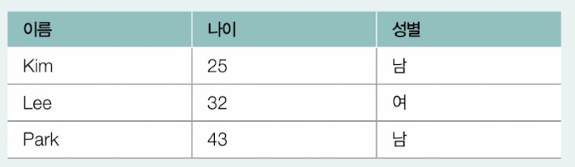
>
> - ex) 아래 테이블의 필드 데이터는 더 많은 유형으로 쪼개질 여지가 있기 때문에 원자 값이라고 보기 어려움
> 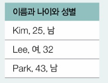

2. 키 제약 조건(key constraint)
   - 레코드를 고유하게 식별할 수 있는 키로 지정된 필드에 중복된 값이 존재해서는 안 된다는 제약 조건

3. 엔티티 무결성 제약 조건(entity integrity constraint)
   - 기본 키로 지정한 필드는 고유한 값이어야 하며, NULL이 되어서는 안 된다는 규칙
   - 기본 키 제약 조건이라고도 부름

4. 참조 무결성 제약 조건(referential integrity constraint)
   - 외래 키를 통해 다른 테이블을 참조할 때 데이터의 일관성을 지키기 위한 제약 조건으로, 외래키는 참조하는 테이블의 기본 키와 같은 값을 갖거나 NULL 값을 가져야 한다는 규칙
   - 외래 키 제약 조건이라고도 부름
   - 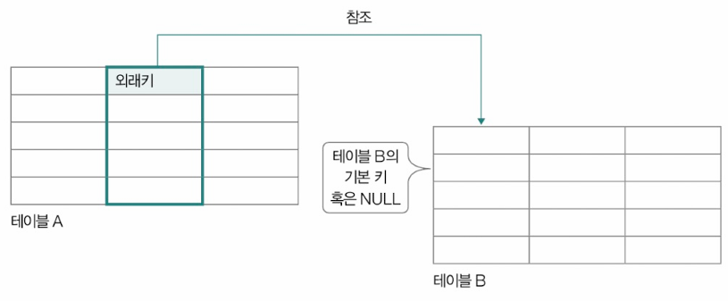

> 참조하는 테이블이 삭제/수정되는 경우\
> ex) '학생' 테이블의 '과목' 필드가 '과목' 테이블의 '개설 과목' 필드를 참조한다 가정. 이때 참조하는 개설 과목이 폐강되어 참조하는 레코드가 삭제되거나, 개설 과목의 이름이 바뀌어 참조하는 레코드가 수정되는 경우\
> 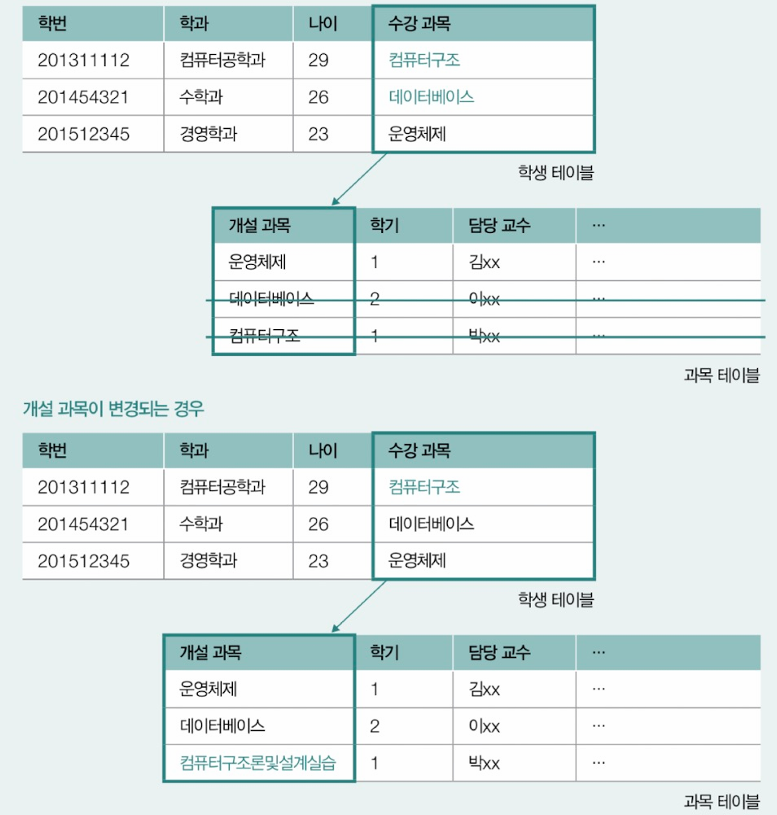
>
> 이런 경우 RDBMS는 크게 아래와 같은 4가지 동작을 취할 수 있음
> 1. 연산 제한(restrict)
>   - 주어인 수정 및 삭제 연산 자체를 거부
>
> 2. 기본값 설정(set default)
>   - 참조하는 레코드를 미리 지정한 기본값으로 설정
>   - ex) '과목' 테이블의 '컴퓨터구조' 과목이 삭제되면 '학생' 테이블의 해당 수강 과목이 기본값으로 변경됨
>
> 3. NULL 값 설정(set null)
>   - 참조하는 레코드를 NULL로 설정함
>   - ex) '과목' 테이블의 '컴퓨터구조' 과목이 삭제되면 '학생' 테이블의 해당 수강 과목이 NULL로 변경됨
>
> 4. 연쇄 변경(cascade)
>   - 참조하는 레코드도 함께 수정되거나 삭제함
>   - ex) '과목' 테이블의 '컴퓨터구조' 과목이 삭제되면 '학생' 테이블의 해당 '수강 과목' 레코드도 함께 삭제됨.
>   - ex) '과목' 테이블의 '컴퓨터구조' 과목 이름이 '컴퓨터구조론및설계실습'으로 변경되면 '학생' 테이블의 해당 과목 이름도 '컴퓨터구조론및설계실습'으로 변경됨

# Q&A

Q1. DBMS에서 스키마가 정의되었을 때와 정의되지 않았을 때 각각의 장점을 설명하시오.

A1. DBMS에서 스키마가 정의되었을 때의 장점은 레코드를 틀(스키마)에 맞는 정형화된 데이터로 저장하고 관리하기가 용이해진다는 것이고, 스키마가 정의되어 있지 않을 때는 보다 자유로운 형태의 레코드를 저장할 수 있다는 장점이 있습니다.

Q2. 안전한 트랜잭션을 보장하기 위해 지켜야 하는 성질 4가지 성질에 대해 말해보시오.

A2. 안전한 트랜잭션을 보장하기 위해 지켜야 하는 성질은 원자성, 일관성, 격리성, 지속성입니다.\
(상세 답변)\
원자성은 하나의 트랜잭션 결과가 모두 성공하거나 모두 실패하는 성질\
일관성은 트랜잭션 전후로 데이터베이스가 일관된 상태를 유지하는 성질\
격리성은 동시에 수행되는 여러 트랜잭션이 서로 간섭하지 않도록 보장하는 성질\
지속성은 트랜잭션이 성공적으로 완료된 후에 그 결과가 영구적으로 반영되는 성질을 말합니다.

Q3. 외래 키란 무엇인지 말해보시오.

A3. 외래키는 다른 테이블의 기본 키를 참조하는 필드로, 테이블 간의 참조 관계를 형성할 때 사용하는 키 입니다.

