- [6-3. SQL](#6-3-sql)
  - [데이터 정의 언어(DDL)](#데이터-정의-언어ddl)
    - [CREATE](#create)
    - [ALTER](#alter)
    - [DROP](#drop)
    - [TRUNCATE](#truncate)
  - [데이터 조작 업어(DML)](#데이터-조작-업어dml)
    - [INSERT](#insert)
    - [UPDATE와 DELETE](#update와-delete)
    - [SELECT](#select)
      - [GROUP BY](#group-by)
      - [HAVING](#having)
      - [ORDERY BY](#ordery-by)
      - [LIMIT](#limit)
  - [트랜잭션 제어 언어(TCL)](#트랜잭션-제어-언어tcl)
  - [데이터 제어 언어(DCL)](#데이터-제어-언어dcl)
- [Q\&A](#qa)


# 6-3. SQL
## 데이터 정의 언어(DDL)
DDL: Data Definition Language\
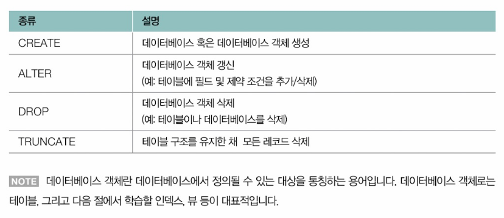

### CREATE
- 데이터 베이스(CREATE DATABASE), 테이블(CREATE TABLE), 뷰(CREATE VIEW), 인덱스(CREATE INDEX), 사용자(CREATE USER)까지 데이터베이스에서 관리될 수 있는 다양한 대상을 정의함

<데이터베이스 만들기>
- 테이블(들)을 만드려면 테이블이 저장될 데이터베이스가 먼저 만들어져야 함
- SQL 문데서는 끝을 표기하기 위해 세미콜론 기호(;)를 사용함

```SQL
-- 데이터베이스 생성
CREATE DATABASE 데이터베이스_이름; 
```

> **데이터베이스의 조회 및 사용**\
> ```SQL
> -- 데이터베이스 조회
> SHOW DATABASE; 
> ```
>
> 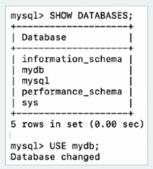
> 
> ```SQL
> -- 데이터베이스 사용
> USE 데이터베이스_이름; 
> ```
> - 이미 존재하거나 만들어진 특정 데이터베이스를 사용할 때의 명령
> - 만약 `USE mydb;`를 실행시키면 'mydb'라는 데이터베이스에서 작업을 이어갈 수 있음

<테이블 만들기>
```SQL
-- 테이블 생성
CREATE TABLE 테이블_이름(
  필드_이름1 필드_타입,
  필드_이름2 필드_타입,
  필드_이름3 필드_타입,
); 
```
- 소관호 한 줄 === 테이블의 열(필드)
- '필드_타입'에 필드 타입을 명시 (ex: VARCHAR(50))
  - 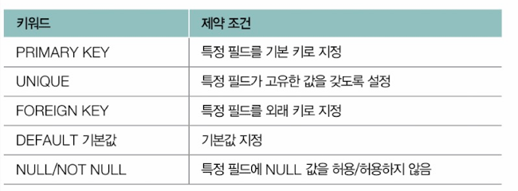
  - > UNIQUE 제약 조건이 명시된 필드를 고유 키(UNIQUE KEY)라고도 부름. 기본키와 유사하게 중복되는 값을 가질 수 없지만 기본 키와 달리 테이블 내에 여러 개 존재할 수 있고, NULL값을 가질 수도 있음

ex) 'users'라는 테이블을 생성하는 예제\
```SQL
-- db/create_users.sql
CREATE TABLE users (
  user_id  INT PRIMARY KEY AUTO_INCREMENT,
  username VARCHAR(50) NOT NULL,
  email VARCHAR(100) UNIQUE,
  birthdate DATE,
  registration_date TIMESTAMP DEFAULT CURRENT_TIMESTAMP
); 
```
- `AUTO_INCREMENT`: 레코드가 추가될 때마다 자동으로 1씩 증가되는 값
- `CURRENT_TIMESTAMP`: 현재 시간

ex) 'posts'라는 테이블을 생성하는 예제\
```SQL
-- db/create_users.sql
CREATE TABLE posts (
  posts_id  INT PRIMARY KEY AUTO_INCREMENT,
  user_id INT,
  title VARCHAR(50) NOT NULL,
  content VARCHAR(50),
  created_at TIMESTAMP DEFAULT CURRENT_TIMESTAMP,
  FOREIGN KEY (user_id) REFERENCES users(user_id)
); 
```
- `FOREIGN KEY (user_id) REFERENCES users(user_id)`:  `user_id`가 외래 키(FOREIGN KEY)로써 `users`테이블의 `user_id`를 참조한다(REFERENCES)

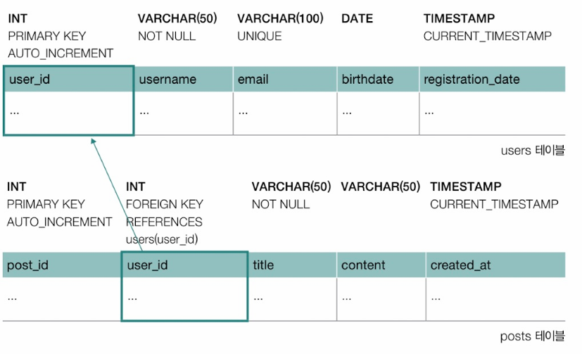


- PRIMARY KEY, UNIQUE, FOREIGN KEY 제약 조건은 아래와 같이 CREATE TABLE 문 하단에 추가될 수도 있음
- 선택적으로 제약 조건에 이름을 붙일 수도 있음

```SQL
-- 테이블 생성(하단에 제약 조건 추가ver)
CREATE TABLE 테이블_이름(
  필드_이름1 필드_타입,
  필드_이름2 필드_타입,
  필드_이름3 필드_타입,
  ...
  [CONSTRAINT 제약_조건_이름] PRIMARY KEY (필드_이름),
  [CONSTRAINT 제약_조건_이름] FOREIGN KEY (필드_이름) REFERENCES 테이블_이름2 (필드_이름),
  [CONSTRAINT 제약_조건_이름] UNIQUE (필드_이름),
); 
```

ex)
```SQL
-- db/create_tests.sql
CREATE TABLE tests (
  posts_id  INT AUTO_INCREMENT,
  user_id INT,
  title VARCHAR(50) NOT NULL,
  content VARCHAR(50),
  created_at TIMESTAMP DEFAULT CURRENT_TIMESTAMP,

-- 하단 제약 조건
  PRIMARY KEY (post_id),
  CONSTRAINT FK_user_id FOREIGN KEY (user_id) REFERENCES users(user_id),
  CONSTRAINT UQ_title UNIQUE (title)
); 
```
- `post_id`를 기본 키로 추가하고, `users`테이블 `user_id`를 참조하는 `FK_user_id`라는 이름의 외래 키 제약 조건을 추가함
- `title`필드가 고유한 값을 갖도록 하는 `UQ_title`이라는 이름의 고유 키 제약 조건도 추가함

> **테이블의 조회**\
> - 테이블의 구조를 확인하고자 할 때
> 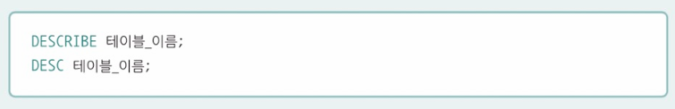
> 
> ▼ `DESCRIBE users;` 결과\
> 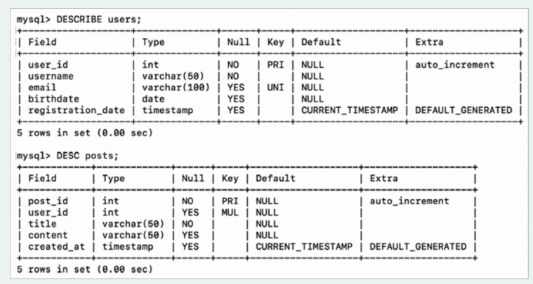
>
> - 데이터베이스에 속한 전체 테이블을 확인하고자 할 때
> 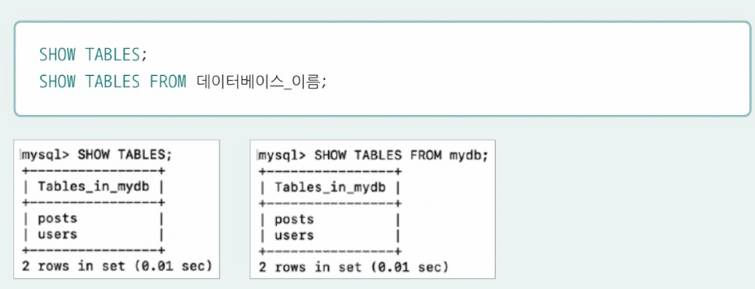


### ALTER
- CREATE TABLE문을 통해 생성된 테이블에 새로운 필드를 추가하거나 기존의 필드를 수정/ 삭제할 수 있음
- 제약 조건 또한 새롭게 추가하거나 수정/삭제할 수 있음

```SQL
-- 새로운 필드 추가
-- ALTER TABLE 테이블_이름 ADD COLUMN 필드_이름 필드_타입 [제약 조건]
ALTER TABLE posts ADD COLUMN new_field VARCHAR(50) NOT NULL;

-- 기존 필드 수정
-- ALTER TABLE 테이블_이름 CHANGE COLUMN 기존_필드_이름 새_필드_이름 필드_타입 [제약 조건]
ALTER TABLE posts CHANGE COLUMN new_field old_field VARCHAR(30) NOT NULL;

-- 기존 필드 삭제
-- ALTER TABLE 테이블_이름 DROP COLUMN 필드_이름
ALTER TABLE posts DROP COLUMN old_field;

-- 외래 키 제약 조건 추가
-- ALTER TABLE 테이블_이름 [ADD CONSTRAINT 제약_조건_이름]
  -- ADD FOREIGN KEY (필드_이름) REFERENCES 참조_테이블_이름(참조_필드)
ALTER TABLE posts ADD FOREIGN KEY (user_id) REFERENCES users(user_id);

-- UNIQUE 제약 조건 추가
-- ALTER TABLE 테이블_이름 [ADD CONSTRAINT 제약_조건_이름] UNIQUE (필드_이름)
ALTER TABLE posts ADD UNIQUE (title);

-- NOT NULL 제약 조건 추가
-- ALTER TABLE 테이블_이름 MODIFY 필드_이름 필드_타입 NOT NULL
ALTER TABLE users MODIFY email VARCHAR(100) NOT NULL;

-- 기본 키 설정(PRIMARY KEY로 사용중인 필드가 없을 경우)
-- ALTER TABLE 테이블_이름 ADD PRIMARY KEY (필드_이름)
ALTER TABLE posts ADD PRIMARY KEY (post_id);
```
> ALTER 문은 테이블뿐만 아니라 뷰, 인덱스 등에서도 적용 가능


### DROP
- 테이블이나 데이터베이스를 삭제할 수 있음

```SQL
DROP DATABASE 데이터베이스_이름;
DROP TABLE 테이블_이름;
```

▼ 'mydb'라는 데이터베이스를 삭제하는 모습
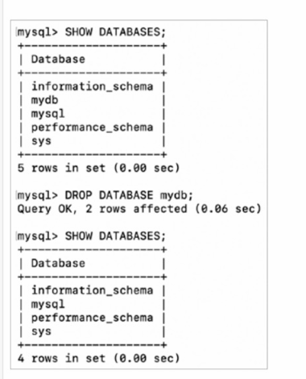
> DROP문 또한 테이블뿐만 아니라 뷰, 인덱스 등에 적용 가능함


### TRUNCATE
- 테이블의 구조를 유지한 채로 테이블의 모든 레코드를 삭제함
- 테이블의 레코드는 모두 삭제하되, 테이블 자체를 삭제하지는 않음

```SQL
TRUNCATE TABLE 테이블_이름;
```

▼ ex) 'users'테이블을 TRUNCATE해도 DESC 명령으로 'user'테이블을 볼 수 있음\
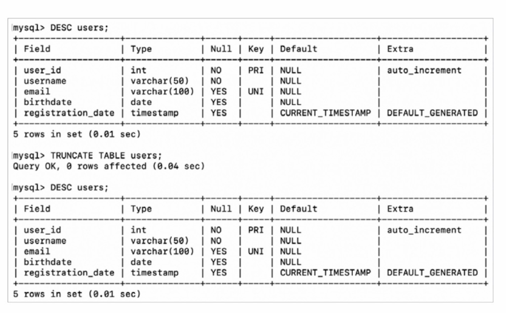


## 데이터 조작 업어(DML)
- SELECT, INSERT, UPDATE, DELETE
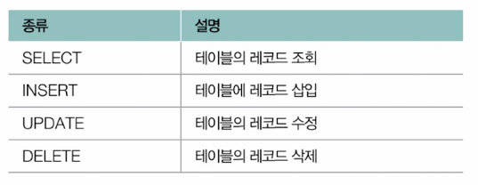

### INSERT
- 테이블에 레코드를 삽입하는 방법
- '테이블_이름'이라는 테이블에 '필드'에 맞는 '값'들을 삽입하는 명령어
- 삽입할 값이 지정되지 않은 필드의 경우, 기본값이 있다면 기본값이 채워지고 없다면 NULL로 채워짐

```SQL
INSERT INTO 테이블_이름(필드1, 필드2) VALUES (값1, 값2);
```

- 여러 레코드를 한 번에 삽입하고 싶을 경우
- 소괄호 () 하나가 레코드 하나라고 생각하면 됨
```SQL
INSERT INTO 테이블_이름(필드1, 필드2, 필드3) VALUES
  (값1, 값2, 값3),
  (값1, 값2, 값3),
  (값1, 값2, 값3);
  ...
  ;
```

ex) 레코드 삽입 예
```SQL
-- db/insert_users.sql
INSERT INTO users (username, email, birthdate) VALUES
  ('kim', 'kim@example.com', '1996-05-15');

```

```sql
-- db/insert_users.sql
INSERT INTO users (username, email, birthdate) VALUES
  ('lee', 'lee@example.com', '1994-03-22'),
  ('park', 'park@example.com', '198-07-11'),
  ('choi', 'choi@example.com', '2000-01-30'),
  ('jung', 'jung@example.com', '1992-12-05');
```
> 'user_id'와 'registration_date' 필드는 삽입할 데이터를 지정하지 않아도 기본값으로 각각 '1부터 증가하는 정수'와 '현재 시간'이 삽입됨


- `SELECT * FROM users;`라고 입력하면 레코드를 조회할 수 있음
  - 'users'테이블의 모든 레코드를 조회하겠다는 의미
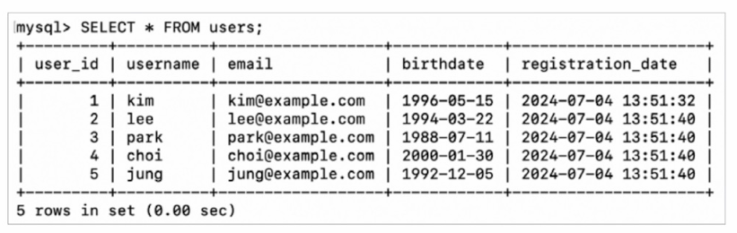

ex) 'posts' 테이블에 레코드를 삽입하여 외래 키 참조 상황에서의 INSERT 문
```sql
-- db/insert_posts.sql
INSERT INTO posts (user_id, title, content) VALUES (1, 'Hi', 'Hello');
```

▼ `SELECT * FROM posts;`\
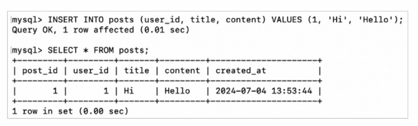

※ 레코드 삽입 시 무결성 제약 조건을 지켜야 함. 만약 제약을 지키지 않고 INSERT문으로 삽입을 시도할 경우 무결성 제약 조건에 위배되어 INSERT문의 실행이 거부됨

**무결성 제약 조건에 위배된 레코드 삽입**
```sql
-- NOT NULL 제약 조건 위배: username은 NULL이 될 수 없기 때문에 실행되지 않음
INSERT INTO users (username, email) VALUES (NULL, 'no_name@example.com');

-- UNIQUE 제약 조건 위배: kim@example.com이 이미 존재할 경우 실행되지 않음
INSERT INTO users (username, email) VALUES ('kim', 'kim@example.com');

-- 외래 키 제약 조건 위배: users 테이블에 user_id가 10인 레코드가 존재하지 않을 경우 실행되지 않음
INSERT INTO posts (user_id, title, content) VALUES (10, 'Hi', 'Hello');
```

### UPDATE와 DELETE
- UPDATE: 레코드 수정 명령어
- DELETE: 레코드 삭제 명령어

**UPDATE**
```SQL
UPDATE 테이블_이름
  SET 필드1 = 값1, 필드2 = 값2, ...
  WHERE 조건식;
```
- '테이블_이름': 갱신하고자 하는 테이블의 이름
- '필드1 = 값1, 필드2 = 값2, ...': 각 필드에 대한 대입 연산
- 'WHERE 조건식'은 생략이 가능하지만, 일반적으로 대부분의 UPDATE문에서 사용됨
  - 특정 조건에 부합하는(조건식이 참이 되는) 레코드만 선별하기 위한 일종의 필터
  - WHERE절이 생략될 경우 모든 레코드가 갱신됨
  - SET에서 명시되는 '='는 대입 연산자, WHERE절에 명시되는 '='는 비교 연산자
  
  - 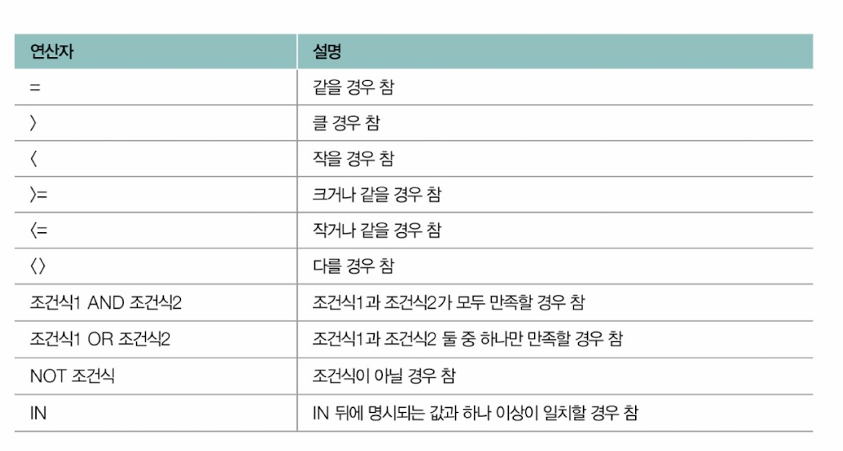 


ex) 'users' 테이블에서 'username'이 'kim'인 사용자의 이메일 주소를 'kim_new@example.com'으로 수정하는 예
```sql
UPDATE users
  SET email = 'kim_new@example.com'
  WHERE username = 'kim';
```

- WHERE절을 활용해서 UPDATE문으로 조건에 부합하는 여러 레코드를 수정할 수 있음

ex) 'posts' 테이블에서 'post_id'가 '5'보다 큰 모든 게시글의 'title'을 'Updated Title'로 수정하는 예
```sql
UPDATE posts
  SET title = 'Update Title'
  WHERE post_id > 5;
```


**DELETE**
- WHERE절을 통해 삭제하고자 하는 레코드를 식별할 수 있음
  - 명시하지 않을 경우 테이블의 모든 데이터를 삭제하는 명령이 됨

```SQL
DELETE FROM 테이블_이름
  WHERE 조건식;
```

ex) 'posts' 테이블에서 'title'이 'Hi'인 게시글을 삭제하라는 명령
```sql
-- db/delete_posts.sql
DELETE FROM posts
  WHERE title = 'Hi'
```

> **외래 키 제약 조건 - ON UPDATE, ON DELETE**\
> - 한 테이블에 다른 테이블이 외래 키로 참조하는 상황에서 참조되는 레코드가 수정되거나 삭제될 경우\
> 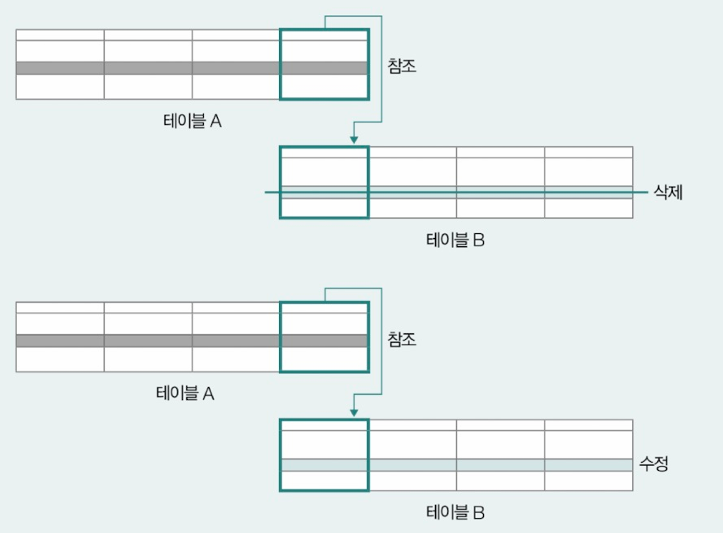
>
> 참조하는 레코드는 아래와 같은 방법으로 동작할 수 있음\
> 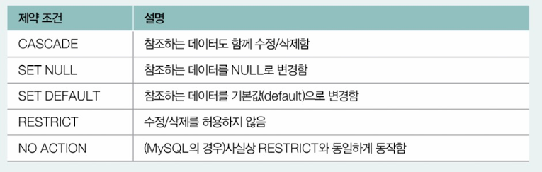
> - CREATE TABLE 문이나 ALTER TABLE문에서 제약 조건으로써 정의될 수 있음
> - 참조된 레코드가 수정될 경우의 제약 조건은 ON UPDATE 뒤에 명시되고, 참조된 레코드가 삭제될 경우의 제약 조건은 ON DELETE 뒤에 명시됨
>
> ex) CREATE TABLE문에서 외래키 제약 조건을 정의하는 예\
> 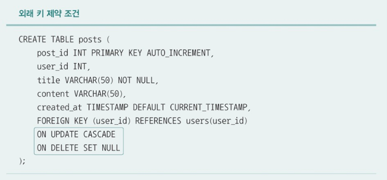
>
> - `ON UPDATE CASCADE` : 'users' 테이블의 'user_id'가 수정되면 (ON UPDATE) 이를 참조하는 'posts'테이블의 'user_id'도 함께 수정하겠다(CASECADE)
> - `ON DELETE SET NULL` : 'users' 테이블의 'user_id'가 삭제되면(ON DELETE) 이를 참조하는 'posts' 테이블의 'user_id'를 NULL로 변경하겠다(SET NULL)


### SELECT
- 삽입된 레코드를 조회하는 명령
- 테이블 내 레코드를 다양하게 정렬하거나 필터링하여 조회하는 것도 가능

▼ SELECT문의 기본 구조
```SQL
SELECT 필드1, 필드2, ...
  FROM 테이블_이름
  WHERE 조건식
  GROUP BY 그룹화할_필드
  HAVING 필터_조건
  ORDER BY 정렬할_필드
  LIMIT 레코드_제한
```
> 필드에 '*'이 사용되는 경우, 이는 모든 필드를 의미함


- SELECT 뒤에는 하나 이상의 필드 이름이 명시될 수 있음
- FROM 절에는 조회하고자 하는 테이블의 이름을 명시
- WHERE절에 명시되는 조건식은 UPDATE문과 DELETE문에서 사용된 조건식과 같음

ex) 'students' 테이블에 5개의 레코드 삽입 예
```sql
-- db/create_insert_students.sql
CREATE TABLE students (
  id INT AUTO_INCREMENT PRIMARY KEY,
  first_name VARCHAR(50),
  last_name VARCHAR(50),
  age INT,
  major VARCHAR(50),
  gpa DECIMAL(3, 2),
  enrollment_date DATE
);


INSERT INTO students (first_name, last_name, age, major, gpa, enrollment_date) VALUES
  ('Alice', 'Johnson', 20, 'Computer Science', 3.8, '2022-09-01'),
  ('Bob', 'Smith', 22, 'Mathematics', 3.5, '2020-09-01'),
  ('Charlie', 'Brown', 21, 'Physics', 3.9, '2021-09-01'),
  ('David', 'Williams', 23, 'Chemistry', 3.2, '2019-09-01'),
  ('Eve', 'Davis', 19, 'Biology', 3.6, '2023-09-01');
```

▼  `SELECT * FROM students;`\
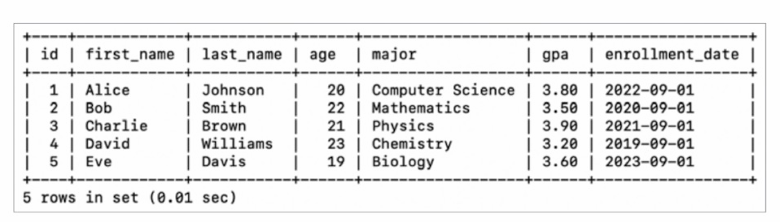


- WHERE절을 이용해 조회할 레코드 제한
  - ex) 'students'테이블에서 특정 전공('major'가 'Computer Science'인) 학생들의 이름과 전공을 조회하는 예
```SQL
-- db/select_students.sql
SELECT first_name, last_name, major
  FROM students
  WHERE major = 'Computer Science';
```
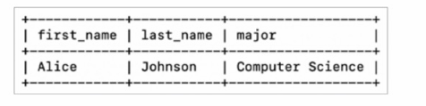


ex) 나이가 21 이상인 학생들만 조회
```sql
-- db/select_student.sql
SELECT first_name, last_name, age
  FROM students
  WHERE age >= 21;
```
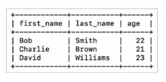


> **패턴 검색과 연산/집계 함수**\
> - 패턴 검색: 문자열 데이터에서 특정 패턴을 찾는 기능
>   - Like 연산자와 와일드카드 문자인 '%_'를 사용해 패턴 검색을 수행할 수 있음
> 
>   - 여기서 '%'는 0개 이상의 임의의 문자와 일치한다는 의미
>   - '_'는 정확히 1개인 임의의 문자와 일치한다는 의미
>
> 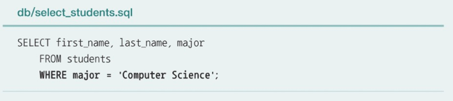\
> 위의 명령은 'students' 테이블에서 'major'가 'Computer Science'와 정확히 일치하는 레코드만을 선택하라는 명령과 같음
>
> 'students' 테이블의 'major'에 'Science'라는 단어가 포함된 모든 학생과 전공명을 찾고자 할 경우에는 아래와 같이 LIKE 연산자를 사용할 수 있음\
> 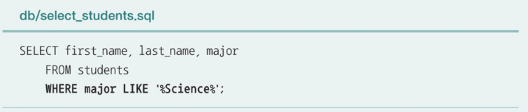
>
> ▼ 'major'의 두 번째 문자가 'a'인 모든 학생을 반환하는 예\
> 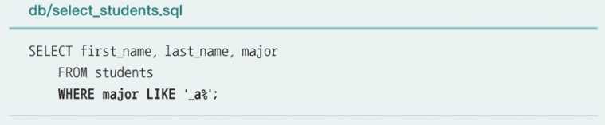
>
> - 연산 집계 함수: 조회된 레코드에 대한 특정 연산을 수행하거나 집계하는 함수
> 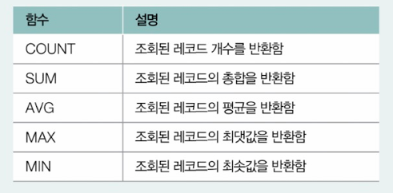
>
> ▼ 'students' 테이블의 레코드 수(학생 수)와 평균 학점, 최저 학점을 조회하는 명령\
> 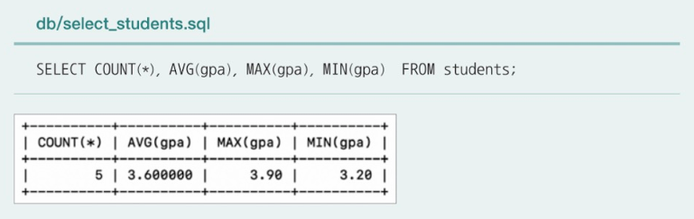


#### GROUP BY
- 특정 필드를 기준으로 필드를 그룹화하기 위해 사용
- 연산/집계 함수와 함께 사용되는 경우가 많음

ex) 'students' 테이블에서 **전공별 학생 수**를 조회하고 싶다면
```sql
-- db/select_students.sql
SELECT major, COUNT(*) AS student_count
  FROM students
  GROUP BY major;
```
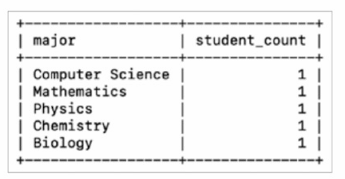

> 위에서 사용된 'AS'는 AS 앞부분을 AS 뒷부분으로 지칭하겠다는 의미

ex) 나이별 학생수 조회_'age' 필드를 기준으로 각 레코드를 그룹화 해야 함
```SQL
-- db/select_students.sql
SELECT age, COUNT(*) AS student_count
  FROM students
  GROUP BY age;
```
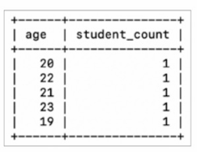


#### HAVING
- GROUP BY절로 그룹화된 결과에 조건을 적용하기 위해 사용됨
- WHERE절과 유사하지만 다름
  - WHERE절에 명시되는 조건식: '그룹화되기 전 개별 레코드'에 대한 조건식
  - HAVING절에 명시되는 조건식: '그룹화된 레코드'에 대한 조건식

ex) 'students' 테이블에서 **평균 GPA가 3.6 이상인 전공**을 조회하고 싶은 상황
1. 우선 'major'필드를 기준으로 그룹화한 'gpa'필드의 평균을 구해야 함

```sql
-- db/select_students.sql
SELECT major, AVG(gpa)
  FROM students
  GROUP BY major;
```
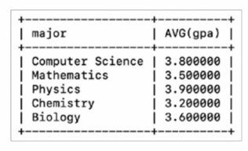

2. 위의 결과에서 평균 GPA가 3.6 이상인 레코드를 조회하면 '평균 GPA가 3.6 이상인 전공'이 됨

```sql
-- db/select_students.sql
SELECT major, AVG(gpa)
  FROM students
  GROUP BY major
  HAVING AVG(gpa) >= 3.6;
```
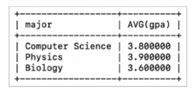 


ex) 'students' 테이블에서 **평균 나이가 21세 이상인 전공** 조회
1. 우선 전공별 평균 나이를 조회해야 함
```sql
-- db/select_students.sql
SELECT major, AVG(age)
  FROM students
  GROUP BY major;
```
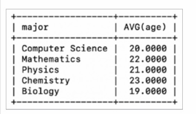

2. 위의 결과에서 평균 나이가 21 이상인 레코드만 조회하면 '평균 나이가 21세 이상인 전공'이 됨
```sql
-- db/select_students.sql
SELECT major, AVG(age)
  FROM students
  GROUP BY major
  HAVING AVG(age) >= 21;
```
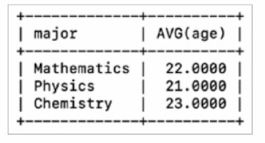


#### ORDERY BY
- 특정 필드를 기준으로 데이터를 정렬하는 데 사용
- 오름차순(ASC)으로 정렬되는 것이 기본이지만, DESC 키워드를 사용하여 내림차순으로 정렬할 수 있음

```SQL
-- db/select_students.sql
SELECT first_name, last_name, gta
  FROM students
  ORDER BY gpa DESC;

SELECT first_name, last_name, gta
  FROM students
  ORDER BY last_name ASC;


SELECT first_name, last_name, enrollment_date
  FROM students
  ORDER BY enrollment_date ASC;
```


#### LIMIT
- 조회할 레코드 수를 제한하기 위해 사용

ex) `SELECT * FROM studensts LIMIT 3;` 이라는 명령으로 조회하면 상위 3개의 레코드만 조회됨\
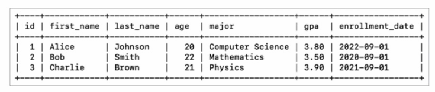

- 레코드의 시작점을 설정할 수도 있음

ex) `LIMIT 2, 2`: 두 번째로 떨어진 레코드부터 2개의 레코드를 조회하라는 뜻\
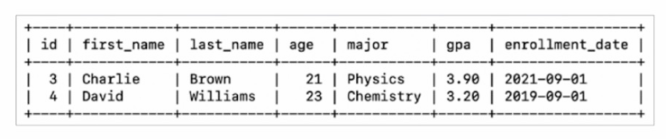


**SELECT문의 실행 순서**\


## 트랜잭션 제어 언어(TCL)
TCL(Transaction Control Language)
- COMMIT, ROLLBACK, SAVEPOINT
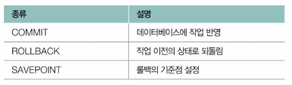

ex) 'accounts' 테이블에 2개의 레코드가 삽입되어 있다고 가정\
```sql
-- db/create_insert_accounts.sql
CREATE TABLE accounts (
  account_id INT PRIMARY KEY,
  account_name VARCHAR(50),
  balance INT
);

INSERT INTO accounts (account_id, account_name, balance) VALUES (1, 'Kim', 1000);
INSERT INTO accounts (account_id, account_name, balance) VALUES (2, 'Lee', 500);
```

이때 아래 2개의 UPDATE문이 반드시 함께 실행되어야 하는 경우, 두 UPDATE문을 하나의 트랜잭션으로 구성될 수 있음

```SQL
UPDATE account SET balance = balance - 100 WHERE account_id = 1;
UPDATE account SET balance = balance + 100 WHERE account_id = 2;
```

- 여러 작업을 포함하는 트랜잭션을 나타낼 때는 START TRANSACTION 혹은 BEGIN 명령을 사용
  - DBMS에게 '이제부터 트랜잭션이 시작됨'을 알리는 명령

```SQL
START TRANSACTION;

UPDATE account SET balance = balance - 100 WHERE account_id = 1;
UPDATE account SET balance = balance + 100 WHERE account_id = 2;
```

트랜잭션의 결과
- COMMIT : 트랜잭션이 성공적으로 완료되어 트랜잭션에서 수행된 모든 변경 사항을 데이터베이스에 영구적으로 반영한다는 의미
- ROLLBACK : 트랜잭션에서 수행된 변경 사항을 취소하고, 데이터베이스를 트랜잭션 시작 이전의 상태로 되돌리겠다는 의미


ex) 트랜잭션이 실행되는 도중 모종의 이후로 롤백되는 상황\
START TRANSACTION 이후에
1. UPDATE문을 한 번 실행했고
2. 커밋하지 않고 ROLLBACK을 했다면

시점 3의 'ACCOUNTS' 테이블은 UPDATE문이 실행되기 전 시점인 시점 1과 같아짐\
```SQL
-- db/rollback_accounts.sql
START TRANSACTION;

-- 시점 1: 2개의 레코드 확인
SELECT * FROM accounts;
UPDATE accounts SET balance = balance - 100 WHERE account_id = 1;

-- 시점 2: account_id가 1인 레코드의 balance가 100 감소되었음을 확인
SELECT * FROM accounts;
ROLLBACK;

-- 시점 3
SELECT * FROM accounts;
```


ex) 트랜잭션이 실행되는 도중 COMMIT이 이루어지는 예\
START TRANSACTION 이후에
1. 2개의 UPDATE문이 모두 실행되고
2. COMMIT을 통해 이들의 작업이 데이터베이스에 영구적으로 반영됨

시점 3의 'accounts' 테이블은 시점 2와 같아짐\
```SQL
-- db/commit_accounts.sql
START TRANSACTION;

-- 시점 1: 2개의 레코드 확인
SELECT * FROM accounts;
UPDATE accounts SET balance = balance - 100 WHERE account_id = 1;
UPDATE accounts SET balance = balance + 100 WHERE account_id = 2;

-- 시점 2: 두 UPDATE문이 실행되었음을 확인
SELECT * FROM accounts;
COMMIT;

-- 시점 3
SELECT * FROM accounts;
```


> **자동 커밋**\
> - MySQL DDL문은 자동으로 커밋됨
> - START TRANSACION이나 BEGIN을 실행하면 자동 커밋이 꺼진 상태로 실행됨
>
> - 자동 커밋 기능은 아래와 같이 명시적으로 끌 수도 있음(자동 커밋 켜는 명령: `SET autocommit = 1`)
> ```sql
> SET autocommit = 0;
> ```


- SAVEPOINT : ROLLBACK으로 되돌아갈 시점을 지정하는 기능을 수행함

▼ '세이브포인트_이름'이라는 되돌아갈 시점을 지정하는 명령
```SQL
SAVEPOINT 세이브포인트_이름
```

▼ '세이브포인트_이름'으로 되돌아가는 명령
```SQL
ROLLBACK TO SAVEPOINT 세이브포인트_이름
```

ex) 세이브포인트를 생성하고 중간 저장 지점으로 되돌아가는 예
- 'SP1, SP2, SP3'라는 되돌아갈 시점을 생성하고, 'SP2, SP1'로 되돌아가는 과정

```SQL
-- db/savepoint_accounts.sql
START TRANSACTION;

-- 세이브포인트 생성 1
SAVEPOINT sp1;

UPDATE accounts SET balance = balance - 100 WHERE account_id = 1;
UPDATE accounts SET balance = balance + 100 WHERE account_id = 2;

-- 세이브포인트 생성 2
SAVEPOINT sp2;

UPDATE accounts SET account_name = 'new_Kim' WHERE account_id = 1;
UPDATE accounts SET account_name = 'new_Lee' WHERE account_id = 2;

-- 세이브포인트 생성 3
SAVEPOINT sp3;

SELECT * FROM accounts;

-- 특정 세이브포인트로 롤백
ROLLBACK TO SAVEPOINT sp2;
ROLLBACK TO SAVEPOINT sp1;
```

## 데이터 제어 언어(DCL)
DCL(Data Control Language)
- GRANT, REVOKE
  - 사용자 권한과 관련된 명령
  - GRANT: 사용자에게 권한을 부여하는 명령어
  - REVOKE: 사용자로부터 권한을 회수하는 명령어


# Q&A

Q1. INSERT문을 이용하여 레코드 삽입 시, 특정 필드의 필드 타입을 지키지 않고 레코드 삽입을 시도할 경우 어떻게 되나요?

A1. 필드 타입 제약을 지키지 않고 INSERT문으로 삽입을 시도할 경우 무결성 제약 조건에 위배되어 INSERT문의 실행이 거부됩니다.

Q2. 'posts'테이블의 'user_id'가 'users' 테이블의 'user_id'를 외래키로 참조하는 상황이라 가정했을 때, CREATE TABLE posts 문에서의 `ON UPDATE CASCADE`의 의미가 무슨 뜻인지 설명하시오.

A2. 'users' 테이블의 'user_id'가 수정되면 이를 참조하는 'posts'테이블의 'user_id'도 함께 수정하겠다는 뜻입니다.

Q3. 아래 명령어는 'Users' 테이블에서 'username'이 'kim'인 사용자의 이메일 주소를 수정하고자 하는 명령이다. 이때, (가) ~ (다)에 들어갈 키워드를 차례대로 말해보시오.


```sql
(가) users
  (나) email = 'kim_new@example.com'
  (다) username = 'kim';
```


A3. (가): UPDATE, (나): SET, (다): WHERE

