- [6-4. 효율적 쿼리](#6-4-효율적-쿼리)
  - [서브 쿼리와 조인](#서브-쿼리와-조인)
    - [여러 테이블에 질의하기](#여러-테이블에-질의하기)
    - [서브 쿼리](#서브-쿼리)
    - [조인](#조인)
      - [INNER 조인](#inner-조인)
      - [OUTER 조인](#outer-조인)
  - [뷰](#뷰)
  - [인덱스](#인덱스)
- [Q\&A](#qa)


# 6-4. 효율적 쿼리
## 서브 쿼리와 조인
- 서브 쿼리(subquery): 다른 SQL문이 포함된 SQL문
- 조인(join): 2개의 테이블을 하나로 합치는 것
- 서브쿼리와 조인 모두 데이터베이스에 복잡한 요청을 해야할 때(ex: 여러 테이블에 질의) 유용하게 사용될 수 있음

### 여러 테이블에 질의하기
- 하나의  SELECT문으로 여러 테이블의 레코드를 조회하 수 있음
- ex) 'users', 'posts'테이블에 레코드가 삽입된 예제

```sql
-- db/create_insert_users_posts.sql
CREATE TABLE users (
  user_id INT PRIMARY KEY AUTO_INCREMENT,
  username VARCHAR(50) NOT NULL,
  email VARCHAR(100) UNIQUE,
  birthdate DATE,
  registration_date TIMESTAMP DEFAULT CURRENT_TIMESTAMP
);

CREATE TABLE posts (
  post_id INT PRIMARY KEY AUTO_INCREMENT,
  user_id INT,
  title VARCHAR(50) NOT NULL,
  content VARCHAR(50),
  created_at TIMESTAMP DEFAULT CURRENT_TIMESTAMP,
  FOREIGN KEY (user_id) REFERENCES users(user_id)
);

INSERT INTO users (username, email, birthdate) VALUES
  ('kim', 'kim@example.com', '1990-01-01'),
  ('lee', 'lee@example.com', '1985-05-15'),
  ('park', 'park@example.com', '1992-08-22');

INSERT INTO posts (user_id, title, content) VALUES
  (1, 'One', 'This is the content of the first post.'),
  (2, 'Two', 'This is the content of the second post.'),
  (3, 'Three', 'This is a post by lee.'),
  (4, 'Four', 'This is a post by park.');

```

- 하나의 SELECT문으로 여러 테이블 레코드를 조회하는 명령
  - SELECT문의 FROM에 여러 테이블의 이름을 명시하면 됨
  - 조회하고자 하는 테이블의 필드는 '테이블_이름.필드'와 같이 특정 테이블 이름과 함께 명시
- ex) 테이블1의 필드1과 필드2, 테이블2의 필트3을 조회하는 SQL문
```sql
SELECT 테이블1.필드1, 테이블1.필드2, 테이블2.필드3
  FROM 테이블1, 테이블2
  WHERE 테이블1.필드1 = 테이블2.필드2;
```

- ex) 'users' 테이블의 'user_id'와 'posts'테이블의 'user_id'가 같은 레코드 중에서 'user'테이블의 'username', 'email'과 'posts' 테이블의 'title'을 하나의 SELECT문으로 조회하는 예
```SQL
-- db/select_users_posts.sql
SELECT users.username, users.email, posts.title
  FROM users, posts
  WHERE users.user_id = posts.user_id;
```
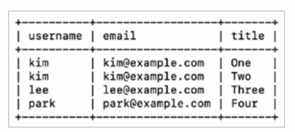

### 서브 쿼리
- 서브 쿼리(subquery): 내부에 다른 SQL문이 포함되어 있는 SQL문
- 서브 쿼리는 또 다른 서브 쿼리를 포함할 수 있음
- MySQL에서의 서브 쿼리: 다른 SQL문 안에 있는 SELECT문. 
  - 서브 쿼리를 소괄호로 감싸 외부 쿼리와 구분
  - SELECT문은 소괄호로 감싸진 서브 쿼리의 형태로, 다른 SELECT, INSERT, UPDATE, DELETE문 안에 포함될 수 있음


책에서 다룰 대표적인 2가지 유형의 서브쿼리
- SELECT문 안에 SELECT문이 포함된 서브 쿼리
- DELETE문 안에 SELECT문이 포함된 서브 쿼리


▼ ex) SELECT문 안에 SELECT문이 포함된 서브 쿼리_사용자별로 작성한 글의 개수를 조회
```SQL
-- db/select_select_subquery.sql
SELECT
  users.username,
  (SELECT COUNT(*)
  FROM posts
  WHERE posts.user_id = users.user_id) AS post_count
FROM users;
```
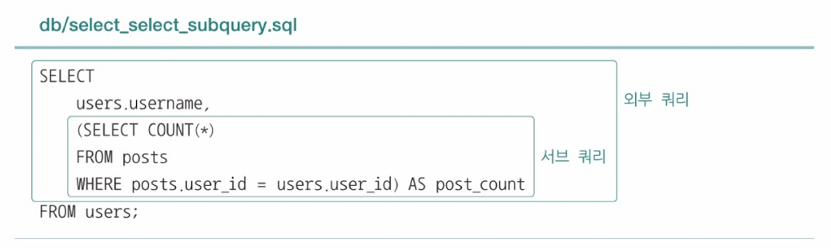
- 외부 쿼리는 'users'테이블에서 'username'과 서브 쿼리의 결과를 조회
- 서브 쿼리의 결과를 'post_count'라고 간주
- 서브 쿼리는 'posts'테이블의 'user_id'와 'users'테이블의 'user_id'가 같은 'posts'테이블의 레코드 수를 조회


▼ ex) DELETE문 안에 SELECT문이 포함된 서브 쿼리_'email'이 'kim@example.com'인 사용자의 글을 삭제하는 SQL문
```sql
-- db/delete_select_subquery.sql
DELETE FROM posts
WHERE user_id = (
  SELECT user_id
  FROM users
  WHERE email = 'kim@example.com'
);
```
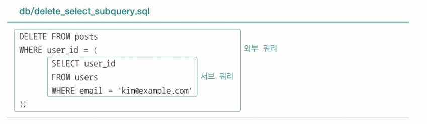
- 외부 쿼리는 'posts' 테이블에서 'user_id'가 서브 쿼리의 결과와 같은 레코드를 삭제
- 서브 쿼리는 'users'테이블에서 'email'이 'kim@example.com'인 레코드를 조회

### 조인
- 여러 테이블을 기반으로 SQL문을 작성할 때 적용할 수 있는 또 다른 방법
- 조인(join): 여러 테이블을 하나로 합치는 것
  - INNER 조인
  - OUTER 조인
    - LEFT OUTER 조인
    - RIGHT OUTER 조인
    - FULL OUTER 조인
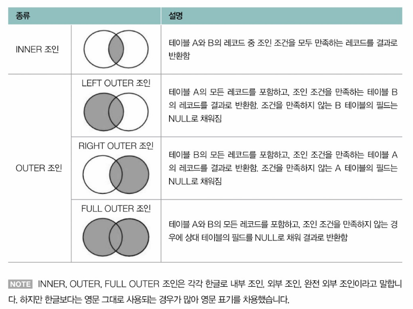

▼ 조인을 실습할 테이블과 레코드
```SQL
-- db/create_insert_customers_orders.sql
CREATE TABLE customers (
  id INT PRIMARY KEY AUTO_INCREMENT,
  name VARCHAR(50),
  age INT,
  email VARCHAR(100) UNIQUE
);

INSERT INTO customers (name, age, email) VALUES
  ('kim', 30, 'kim@example.com'),
  ('lee', 25, 'lee@example.com'),
  ('park', 40, 'park@example.com'),
  ('kang', 20, 'kang@example.com'),
  ('kwon', 18, 'kwon@example.com'),
  ('gwak', 21, 'gwak@example.com'),
  ('na', 45, 'na@example.com'),
  ('jo', 22, 'jo@example.com'),
  ('yang', 50, 'yang@example.com');

CREATE TABLE orders (
  id INT PRIMARY KEY AUTO_INCREMENT,
  customer_id INT,
  product_id INT,
  quantity INT,
  amount INT
);

INSERT INTO ordrs (customer_id, product_id, quantity, amount) VALUES
  (1, 1, 10, 1000),
  (2, 2, 20, 2000),
  (2, 3, 30, 3000),
  (3, 4, 40, 4000),
  (3, 5, 50, 5000),
  (4, 6, 60, 6000),
  (4, 7, 70, 7000),
  (5, 8, 80, 8000),
  (5, 9, 90, 9000),
  (10, 9, 90, 9000);
```
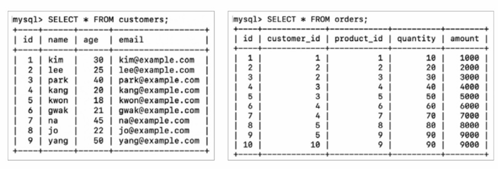

#### INNER 조인
  - 테이블1과 테이블2의 레코드 중에서 조인 조겅능ㄹ 모두 만족하는 데이터만을 선택해 결합하는, 일종의 교집합 연산
```SQL
SELECT 필드
FROM 테이블1
  INNER JOIN 테이블2 ON 조인 조건;
```

ex) 'orders.customer_id'와 'customers.id'를 기분으로 INNER 조인
```SQL
-- db/inner_join.sql
SELECT customers.name, customers.age, customers.email, orders.id, orders.product_id, orders.quantity, orders.amount
FROM customers
  INNER JOIN orders ON customers.id = orders.customer_id;
```
> INNER JOIN에서 INNER는 생략 가능함

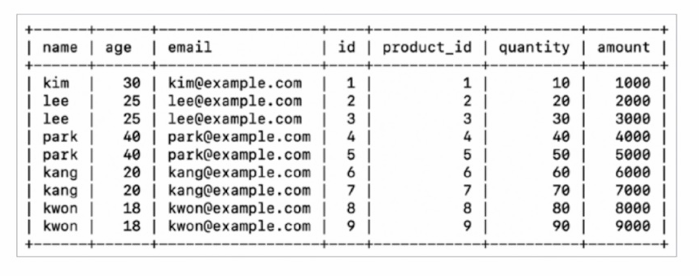

- 아래와 같이 WHERE절을 추가하면 조건에 따라 레코드를 필터링하여 조회할 수 있음
```SQL
-- db/inner_join.sql
SELECT customers.name, customers.age, customers.email, orders.id, orders.product_id, orders.quantity, orders.amount
FROM customers
  INNER JOIN orders ON customers.id = orders.customer_id
  WHERE orders.amount >= 5000;
```
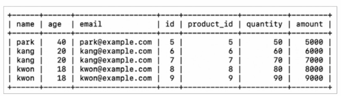

#### OUTER 조인
1) LEFT OUTER 조인
   
- 테이블1에 대해 테이블 2를 LEFT OUTER 조인하는 SQL문 
```SQL
SELECT 필드
FROM 테이블1
  LEFT OUTER JOIN 테이블2 ON 조인 조건;
```

- 테이블1의 모든 레코드를 기준으로 테이블2의 레코드를 합치되, 테이블 2에 대응되는 레코드가 없다면 해당 값을 NULL로 간주하는 조인 방식

ex) 'customers'테이블과 'orders'테이블의 LEFT OUTER 조인 결과
```SQL
-- db/left_outer_join.sql
SELECT customers.name, orders.id AS order_id, orders.product_id, orders.quantity, orders.amount
FROM customers
  LEFT OUTER JOIN orders ON customers.id = orders.customer_id;
```
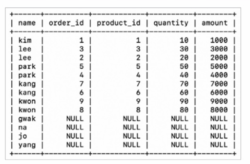


2) RIGHT OUTER 조인
- 테이블2의 레코드를 모두 선택하고, 이를 기준으로 테이블1을 합치되 대응되는 레코드가 없다면 NULL이 되는 조인 방식
```SQL
SELECT 필드
FROM 테이블1
  RIGHT OUTER JOIN 테이블2 ON 조인 조건;
```

ex) 'customers'테이블과 'orders'테이블의 RIGHT OUTER 조인 결과
```SQL
-- db/right_outer_join.sql
SELECT customers.name, orders.id AS order_id, orders.product_id, orders.quantity, orders.amount
FROM customers
  RIGHT OUTER JOIN orders ON customers.id = orders.customer_id;
```

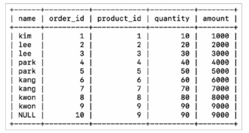


3) FULL OUTER 조인
- 기본적으로 두 테이블의 모든 레코드를 선택하되, 대응되지 않는 모든 레코드를 NULL로 표기하는 조인 방식
- MySQL을 포함한 많은 RDBMS에서는 FULL OUTER 조인 문법을 따로 지원하지 않음.
  - 하지만 LEFT OUTER 조인과 RIGHT OUTER 조인의 결과를 하나로 합치면 FULL OUTER 조인을 구현할 수 있음
  - 여러 SQL문을 결합하는 키워드인 UNION이 사용될 수도 있음
    - UNION: SQL문 실행 결과의 합집합을 구하는 키워드
```SQL
SELECT 필드
FROM 테이블1
  LEFT JOIN 테이블2 ON 조인 조건
  UNION
SELECT 필드
FROM 테이블1
  RIGHT JOIN 테이블2 ON 조인 조건;
```

ex) 'customers' 테이블과 'orders' 테이블을 각각 LEFT OUTER 조인, RIGHT OUTER 조인한 뒤, 그 결과를 하나로 합친 형태
```SQL
-- db/full_outer_join.sql
SELECT customers.name, orders.id AS orders.product_id, orders.quantity, orders.amount
FROM customers
  LEFT OUTER JOIN orders ON customers.id = orders.customer_id
  UNION
SELECT customers.name, orders.id AS order_id, orders.product_id, orders.quantity, orders.amount
FROM customers
  RIGHT OUTER JOIN orders ON customers.id = orders.customer_id;
```

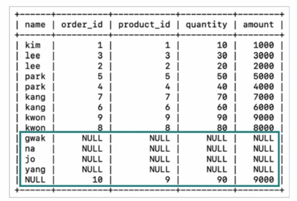

ex) 사용자별로 작성한 글의 개수를 조회하는 SQL문을 아래와 같이 조인으로 대체할 수 있음
```sql
-- db/subquery_to_join.sql
SELECT users.username, COUNT(posts.post_id) AS post_count
FROM users
  LEFT JOIN posts ON users.user_id = posts.user_id
  GROUP BY users.username;
```
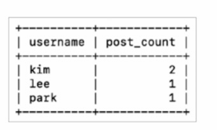


## 뷰
```sql
-- 여러 테이블의 레코드를 조회하는 SELECT문
SELECT users.username, users.email, posts.title
  FROM users, posts
  WHERE users.user_id = posts.user_id;
```
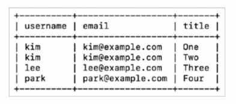

위와 같은 SELECT문의 결과를 가상의 테이블로 간주하고 다양한 SQL문을 사용하고자 한다면? -> 서브 쿼리를 이용하면 됨

```SQL
-- 다양한 SQL문을 사용하는 서브 쿼리
SELECT result.username, result.email, result.title
FROM
  (SELECT user.username, user.email, posts.title
  FROM users, posts
  WHERE users.user_id = posts.user_id) AS result
WHERE result.username = 'kim';
```
- 위와 같이 SELECT문을 FROM문에 포함한 서브 쿼리로 간주하면 SELECT문을 테이블처럼 다룰 수 있음
- 그러나 SELECT문의 결과를 토대로 SQL문을 자주 실행해야할 경우, 매번 서브쿼리를 작성하기에는 중복되는 쿼리가 많아 번거로움 -> 뷰 사용

- 뷰(view): SELECT문의 결과로 만들어진 가상의 테이블
- SELECT문의 결과를 뷰로 생성한 뒤, 해당 뷰에 다양한 SQL문을 실행할 수 있음
- 주로 테이블에 대한 SQL문을 단순화 하기 위해 사용됨

▼ 뷰 생성 방법
```SQL
CREATE VIEW 뷰_이름 AS SELECT문;
```
> 뷰를 삭제하는 명령은 DROP VIEW

ex) 'myview'라는 뷰 만들기
```sql
-- db/create_select_view.sql
CREATE VIEW myview AS
  SELECT users.username, users.email, posts.title
  FROM users, posts
  WHERE users.user_id = posts.user_id;
```
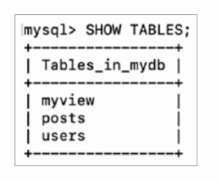

- 위의 'myview'뷰는 하나의 논리적인 테이블처럼 활용할 수 있음
  - `SHOW TABLES;`를 통해 'myview'를 조회할 수도 있음

▼ 서브 쿼리 예제를 아래와 같이 표현할 수 있음
```sql
-- db/create_select_view.sql
SELECT username, email, title
  FROM myview
  WHERE username = 'kim'
```

- 뷰는 SQL문을 단순화하기 위해 사용되기도 하고, 특정 사용자에게 테이블의 특정 데이터만을 보여주고자 할 때도 사용할 수 있음
  - 테이블 상의 노출 가능한 데이터만을 포함하는 뷰를 만들어 특정 사용자에게만 해당 뷰에 대한 접근 권한을 부여하면 됨
  - > 특정 사용자에게 특정 테이블(뷰)에 대한 권한을 부여하는 명령은 GRANT
- 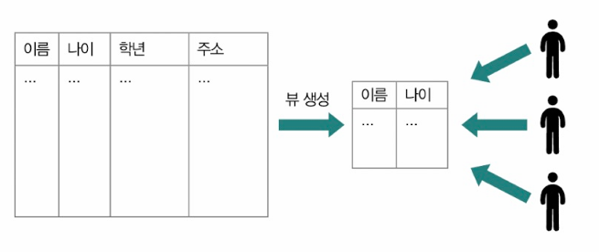

**뷰를 사용할 때 유의할 점**
- 조회(SELECT)에는 제한이 없지만, 삽입(INSERT)과 수정(UPDATE), 삭제(DELETE) 등이 불가능 할 수도 있음
- 특히 여러 테이블을 SELECT한 결과로 만들어진 뷰의 경우, 삽입/수정/삭제 연산이 제약 조건을 어기기 쉬움

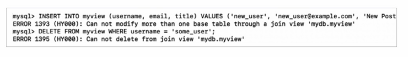

## 인덱스
- RDBMS의 성능을 향상시키는 가장 대중적인 방법
- 수많은 레코드를 조회하는 작업이 빈번한 RDBMS에서 대부분 활용됨

- 인덱스(index): 검색 속도 향상을 목적으로 만드는 하나 이상의 테이블 필드에 대한 자료구조
- 특정 필드에 대한 인덱스를 생성하면 인덱스를 기준으로 원하는 레코드에 더 빠르게 접근할 수 있음

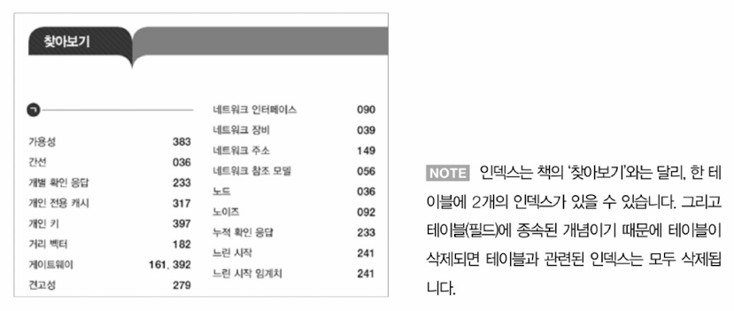
- '찾아보기'의 페이지 == 찾고자 하는 레코드, '찾아보기'의 용어 = 데이터베이스의 필드
- 특정 필드에 인덱스를 생성한다 === 해당 필드를 기준으로 레코드를 조회하겠다


ex) '학생'테이블에서 '학번' 필드에 인덱스를 생성할 경우, 데이터베이스 내부에 '학번' 필드를 기준으로 정렬된 인덱스 자료구조가 생성됨 -> '학번' 필드를 기준으로 빠른 레코드 조회가 가능\
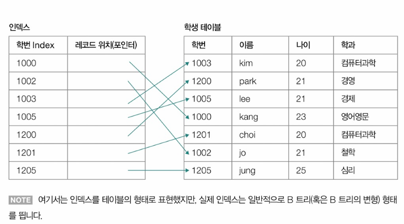


**MySQL에서의 인덱스 종류**
- 클러스터형 인덱스(clustered index): 테이블 당 하나씩 만들 수 있는 인덱스
  - 기본키. 테이블 내에 기본키(PRIMARY KEY)로 지정된 필드는 기본적으로 클러스터형 인덱스로 간주됨
  - 기본키로 지정된 필드가 없는 경우에는 NOT NULL 제약 조건과 UNIQUE 제약 조건이 있는 필드(NULL값이 될 수 없는 고유한 값을 갖는 필드)를 클러스터형 인덱스로 간주
- 세컨더리 인덱스(secondary index): 클러스터형 인덱스가 아닌 인덱스
  - 논클러스터형 인덱스(non-clustered index)라고도 부름
  - 테이블당 여러 개가 존재할 수 있지만 클러스터형 인덱스를 활용한 검색보다 일반적으로 느림

▼ MySQL에서 세컨더리 인덱스를 생성하고 조회, 삭제할 수 있는 명령어
```sql
-- '테이블_이름'의 '필드'에 세컨더리 인덱스인 '인덱스_이름'을 생성
CREATE INDEX 인덱스_이름 ON 테이블_이름 (필드);

-- 인덱스 조회
SHOW INDEX FROM 테이블_이름;

-- 인덱스 삭제
DROP INDEX 인덱스_이름 FROM 테이블_이름;
```

> **인덱스로 사용되는 자료구조**\
> - 인덱스로 사용되는 대표적인 자료구조: 해시테이블, B 트리
>
> ex) '제품' 테이블에 있는 '제품 번호'를 기본 키로 간주하여 클러스터형 인덱스를 생성했다고 가정\
> 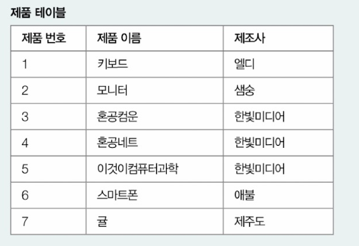
>
> - 데이터베이스 내에는 아래와 같은 B 트리(혹은 B+트리)가 생성됨
> - 각 노드에는 키로써 인덱스 값이 포함되어 있고, 인덱스 값을 검색하면 실제 데이터(레코드)가 저장된 위치를 알 수 있음
>
> 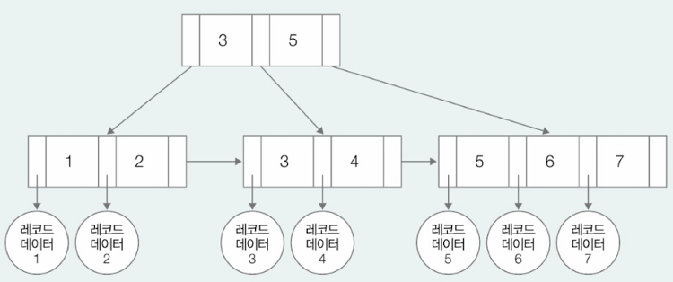


**인덱스를 통한 성능 향상 확인**
- ex) (세컨더리) 인덱스 예_ 70만 개의 레코드가 삽입된 테이블 가정. 현재 생성된 인덱스는 없음

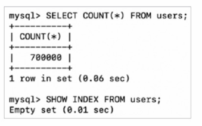

- 테이블에 삽입되어 있는 레코드는 아래와 같은 형태

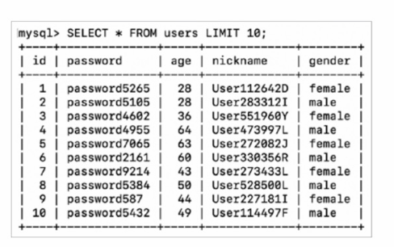

- 인덱스가 없는 상태에서 아래와 같은 3개의 SELECT문을 실행할 경우 각각 0.21초, 0.22초, 0.19초가 소요된 것을 확인할 수 있음

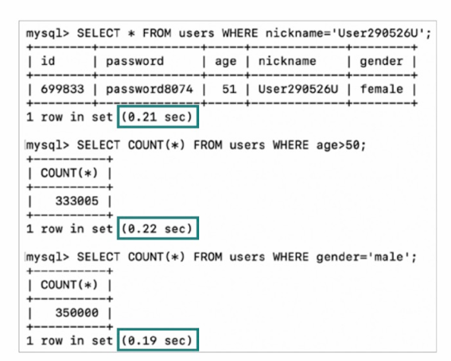

- 인덱스를 만들어 다시 확인_'nickname'에 인덱스 만들기

▼ 인덱스 생성
```sql
CREATE INDEX idx_user ON users(nickname);
```
- 'nickname'에 인덱스를 생성했기 때문에 'nickname'에 대한 조회 성능이 빨라진 것을 확인할 수 있음

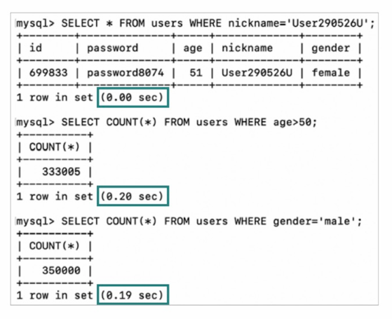

**모든 필드에 대해 인덱스를 생성하지 않는 이유**
- 인덱스 생성과 관리에 부작용이 따름
  - 인덱스의 저장 공간과 생성 시간을 고려해야함
  - 인덱스가 차지하는 공간이나 생성 시간이 점점커질 수 있기 때문
- 조회(SELECT) 성능은 향상 시킬 수 있지만, 그 외의 작업(INSERT, UPDATE, DELETE)에 대해서는 성능 향상을 가져오지 않음
  - 새로운 데이터를 삽입하거나 기존 데이터를 수정/삭제할 때 인덱스에 대한 작업도 동시에 이루어져야 함 -> 인덱스를 유지하고 갱신하는 추가적인 자원과 연산이 필요

**인덱스 활용 주의점**
- 데이터가 충분히 많고 조회가 빈번히 이루어지는 테이블 필드에 만들어 활용하는 것이 좋음
- 테이블당 인덱스 개수가 지나치게 많은 것도 지양해야 함
  - 일반적으로 테이블당 3개 이하의 인덱스를 권고
- 중복되는 데이터가 많은 필드에 대해 인덱스를 생성하는 것은 그렇지 않은 필드에 대해 인덱스를 생성하는 것에 비해 인덱스의 효능을 떨어뜨림


# Q&A

Q1. 테이블1에 대해 테이블 2를 LEFT OUTER 조인하는 것과 RIGHT OUTER 조인 하는 것은 어떤 차이가 있는지 설명하시오.

A1. LEFT OUTER 조인의 결과는 테이블1의 모든 레코드를 기준으로 테이블2의 레코드를 합치되, 테이블 2에 대응되는 레코드가 없다면 해당 값을 NULL로 간주하여 조인 되고, 반대로 RIGHT OUTER 조인은 테이블2의 모든 레코드를 기준으로 테이블1의 레코드를 합치되, 테이블 1에 대응되는 레코드가 없다면 해당 값을 NULL로 간주하여 조인하는 방식입니다.

Q2. SQL에서 뷰는 어떨 때 주로 사용되는지, 다시말해 뷰를 사용하는 이유는 무엇일지 말해보시오.

A2. 뷰는 쿼리의 단순화, 재사용성을 높이기 위해 많이 사용됩니다. 또 특정 사용자에게 테이블의 특정 데이터만을 보여주고자 할 때도 사용할 수 있습니다.

Q3. 테이블 필드에 인덱스를 생성하는 이유에 대해 말해보시오.

A3. 특정 필드에 대한 인덱스를 생성하면 인덱스를 기준으로 원하는 레코드에 더 빠르게 접근할 수 있기 때문입니다.

