# 6.5_데이터베이스 설계

## ER 다이어그램
- ER 다이어그램(이하 ERD_ER diagram): 엔티티 관계(ER, Entity Relationship)를 표현하는, 즉 데이터베이스를 구성하는 요소들의 관계를 나타내는 그림
- ERD로 데이터 베이스 구조 정의 -> 추후 데이터베이스를 확장하거나 수정할 때 어떤 부분이 영향을 받는지 쉽게 파악할 수 있어, 유지보수가 용이하고 개발자 간 원활한 소통이 가능함

**ERD 표기법**\
▼ 피터 첸 표기법(Peter Chan diagram)\
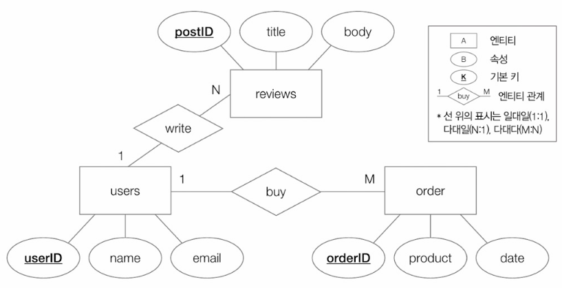
- 엔티티를 개념적으로 모델링하는 데 유용
- 엔티티가 많아질 경우 그림이 다소 복잡해지고 RDBMS 상에서 어떻게 테이블의 형태로 표현되는지 한 눈에 파악하기 어려울 수 있음

▼ IE 표기법(Information Engineering notation), (새 발 표기법, 까마귀 발 표기법(crow feet notation))\
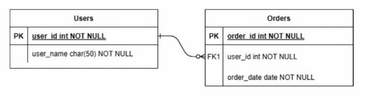
- 사각형 하나 === 테이블 하나
- 상단 사각형 = 테이블 이름
- 사각형 내부 = 속성(필드) 이름
  - 필드 타입을 함께 명시하기도 함
  - 기본 키를 특별히 밑줄 또는 PK라고 표기하기도 함
  - 외래키는 FK라고 표기하는 경우도 있음
- 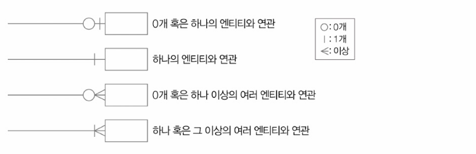
- 위의 ERD 예시에선 한 명의 고객('users' 엔티티)이 0개 이상의 주문('orders' 엔티티)을 할 수 있다는 의미


> **식별/비식별 관계**\
> - 식별 관계(identifying replationship): 참조되는 엔티티가 존재해야만 참조하는 엔티티가 존재할 수 있는 관계
>   - ex) 참조되는 테이블의 기본 키를 참조하는 테이블의 외래 키이자 기본키로 활용하는 경우
> - 비식별 관계(non-identifying replationship): 참조되는 엔티티가 존재하지 않아도 참조하는 엔티티가 존재할 수 있는 관계
>   - ex) 참조되는 테이블의 기본 키를 참조하는 테이블의 기본 키가 아닌 일반적인 외래 키로 이용할 경우
>
> 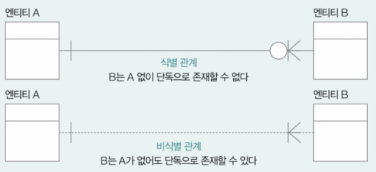


ERD를 그리기 위한 도구: draw.io, ERWin, ERDCloud 등


## 정규화
▼ ex1) '학번'이 기본 키인 테이블\
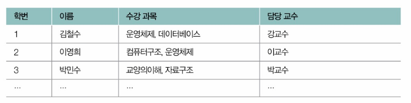

=> '수강 과목' 필드의 값이 단일한 값을 가지고 있지 않음
- '수강 과목'의 데이터 중 일부를 검색하거나 일부 과목의 이름을 수정해야 할 때 번거로움
- 검색 성능 저하 우려

▼ ex2) \
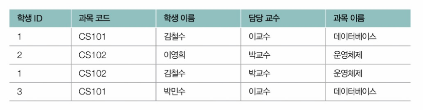

=> '데이터베이스'과목의 담당 교수가 '김교수'로 변경된다면 'CS101'과 관련된 모든 행을 수정해야 함 -> 담당 교수나 과목 이름이 변경될 때마다 관련된 모든 행을 일일이 수정해야 함

- 정규화(Normal Form): 잠재적인 문제가 발생하지 않도록 테이블의 필드를 구성하고, 필요할 경우 테이블을 나누는 작업
- 정규형(Normal Form, NF): 정규화된 테이블의 형태
- 정규형의 종류:
  - 제1 정규형
  - 제2 정규형
  - **제3 정규형**
  - **보이스/코드 정규형**
  - 제4 정규형
  - 제5 정규형

### 제1 정규형
- 제1 정규형 ⇔ 모든 속성이 원자 값을 가진다
- 즉, 필드 데이터가 더 이상 쪼개질 수 없는 값을 가져야 함

▼ 제1 정규형을 만족하지 않은 예\
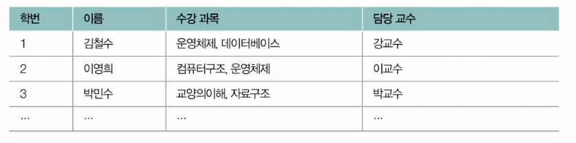

위의 테이블이 제1 정규형을 만족하도록 만드는 방법으로는 아래와 같은 방법들이 있음
|제1 정규형-A|제1 정규형-B|
|:-:|:-:|
|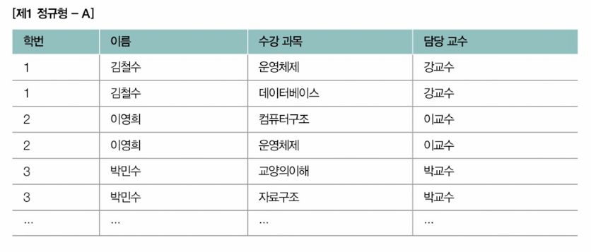|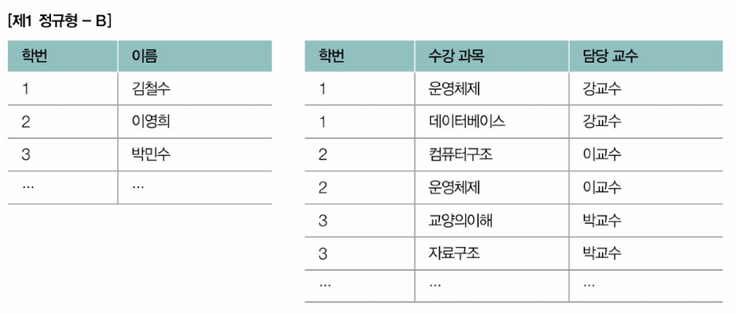|

제1 정규화를 거쳤다 하더라도 여전히 문제의 여지가 있을 경우 추가적인 정규화가 필요함


### 제2 정규형
- 제2 정규형  ⇔ 제1 정규형 ∧ 기본 키가 아닌 모든 필드들이 모든 기본 키에 완전히 종속될 것
- 테이블의 모든 필드가 기본 키에 완전히 종속되어야 하고, (기본 키가 여러 필드로 구성될 경우) 일부 기본 키에만 종속되어서도 안된다는 조건

> 특정 필드(속성) X의 값을 통해 특정 필드(속성) Y의 유일한 값이 결정될 경우 'Y가 X에 종속적'이라고 표현.\
> X: 결정자, Y: 종속자


- 부분 함수 종속성(pertial functional dependency): 기본 키가 아닌 필드가 기본 키의 일부에 종속되어 있는 경우
- 완전 함수 종속성(full functional dependency): 기본 키 전체에 완전하게 종속되어 있는 경우
=> 제2 정규형: 부분 함수 종속정이 없는 상태. 즉, 후보 키에 속하지 않는 모든 필드가 기본 키에 완전 함수 종속인 상태

ex1) 하나의 레코드를 식별하기 위해 필요한 정보: '회원 ID', '구매 항목'\
기본 키: {회원 ID, 구매 항목}\
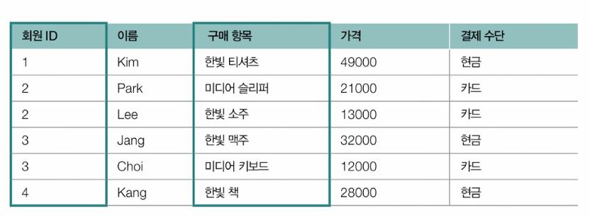

=> '가격'은 '구매 항목'과의 종속 관계가 있을 뿐, '회원 ID'와는 아무런 관계가 없음 -> 기본 키 일부에만 종속된 필드 존재 => 제2 정규형 만족X

ex2) 레코드를 고유하게 식별하기 위해 필요한 정보: '학번', '과목'\
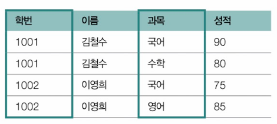

=> '이름'은 '학번'과의 종속 관계는 있을 수 있지만, '과목'과는 관계가 없음 => 제2 정규형 만족X

아래와 같이 분할하면 각각의 테이블은 제2 정규형을 만족하는 상태가 됨\
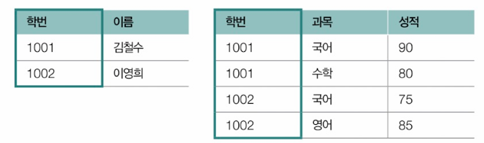


### 제3 정규형
- 제3 정규형 ⇔ 제2 정규형 ∧ 기본 키가 아닌 모든 필드가 기본 키에 이행적 종속성이 없는 상태


이행적 종속 관계(transitive dependency) 예시:\
어떤 테이블에서 A, B, C라는 필드가 있을 때
- A가 B를 결정(A → B) 
- B가 C를 결정(B → C) 
=> A도 C를 결정하게 됨(A → C). 이때 A와 C 사이에는 이행적 종속 관계, 이행 함수 종속성이 있다고 표현함

ex) '학과'와 '학과 사무실 위치'에 대한 정보가 '학번'과 함께 저장되어 있는 테이블\
기본 키: '학번'\
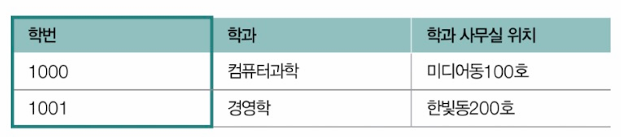
- 한 학생당 하나의 학과에 속해있고 학과당 학과 사무실 위치가 하나뿐이라면
  - '학번'이 '학과'를 결정(학번 → 학과) 
  - '학과'가 '학과 사무실 위치'를 결정(학과 → 학과 사무실 위치) 
  - => '학번'이 '학과 사무실 위치'를 결정하게 됨(학번 → 학과 사무실 위치)
  - ∴ '학번'과 '학과 사무실 위치'는 이행적 종속 관계

- 즉, 제3 정규형은 '기본 키가 아닌 나머지 모든 필드들이 간접적으로라도 종속되어서는 안된다, 기본키가 아닌 나머지 모든 필드는 서로를 유추하거나 결정할 수 없어야 한다'는 조건

아래와 같이 쪼개면 제3 정규형을 만족하게 됨\
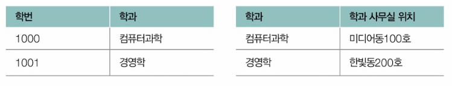


### 보이스/코드 정규형
- 보이스/코드 정규형(이하 BCNF, Boyce-Codd Normal Form) ⇔ 제3 정규형 ∧ 모든 결정자가 후보 키
  - 결정자: 특정 필드를 식별할 수 있는 필드
  - 가령 필드 A가 필드 B를 결정할 경우(B가 A에 종속적일 경우) A는 B의 결정자라고 할 수 있음

ex) 한 교수가 한 과목을 담당한다 가정. 아래 테이블의 레코드는 '학번', '과목 코드' 필드의 조합으로 고유하게 식별 가능\
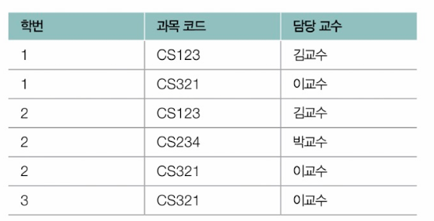
- 이행적 종속 관계 없음 -> 제3 정규형 만족
- BCNF를 만족하진 않음
  - '담당 교수'필드는 키가 아니지만 '과목 코드'의 결정자 역할을 함
  - => '학번'과 '과목 코드' 필드를 하나의 테이블로, '과목 코드'와 '담당 교수'필드를 다른 하나의 테이블로 분리해야 함

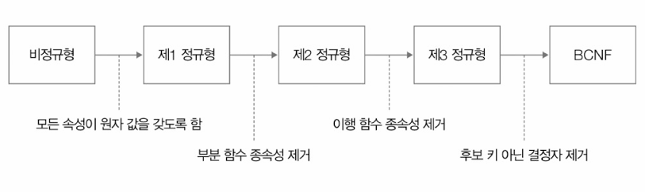

> **역정규화: 정규화가 무조건적인 미덕일까**\
> - 정규화를 거듭하다 보면 테이블이 쪼개지는 경향이 있음
> - 테이블이 많아짐 -> 조인 연산이 빈번해짐 -> 다른 테이블을 참조하기 위한 성능상의 비용이 늘어날 수 있음
>
> - 역정규화(denormalization): 검색의 속도를 높이기 위해 분할되어 있는 테이블을 하나로 합치는 작업
> 
> 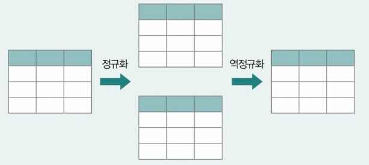


# 6.6_NoSQL
## RDBMS vs NoSQL: NoSQL의 특징
NoSQL(Not Only SQL)
- 테이블의 형태로 레코드를 저장하고 SQL로 다루는 RDBMS와는 달리 레코드를 (테이블 형태 이외의) 다양한 형태로 저장할 수 있음
- SQL 이외의 방법으로 저장된 데이터도 다룰 수 있음
- 대표적인 NoSQL 데이터베이스 유형: 
  - 키-캆 데이터베이스
  - 도큐먼트 데이터베이스
  - 그래프 데이터베이스
  - 칼럼 패밀리 데이터베이스

### 키-값 데이터베이스
- 키-값 데이터베이스(key-value database): 데이터베이스에 레코드를 키(필드)와 값의 쌍으로 저장하는 데이터베이스
- 키-값 데이터베이스 중에서는 레코드를 보조기억장치가 아닌 메모리에 저장해 빠른 데이터베이스 접근 속도를 제공하는 경우도 있음
- 캐시나 세션 등 비교적 가벼운 정보를 저장하는 경우가 많음
  - 키-값 데이터베이스를 단독으로 사용하는 경우도 있지만, 다른 주요 데이터베이스릐 보조 데이터베이스로써 사용되는 경우도 많음
- 대표적인 키-값 데이터베이스: Redis, Mencached 등 -> 레코드를 메모리에 저장함
- 인 메모리 데이터베이스(in-memory database): 메모리에 저장되는 데이터베이스

### 도큐먼트 데이터베이스
- 도큐먼트 데이터베이스(document database, 혹은 문서지향 데이터베이스, document-oriented database): 레코드를 도큐먼트라는 단위로 저장하고 관리하는 데이터베이스
  - 도큐먼트(document): 정형화되어 있지 않은 NoSQL 레코드의 단위
  - 많은 데이터베이스에서 JSON이나 XML과 같은 형식을 도큐먼트로 활용
- 대표적인 도큐먼트 데이터베이스: MongoDB


- 하나의 레코드를 JSON 형태의 데이터로 만들어 관리
- JSON의 키 === 필드
- JSON 데이터 하나 === RDBMS의 행
- MongoDB에서는 RDBMS와는 달리 고정된 스키마가 없기 때문에 각 도큐먼트가 아래 그림과 같이 유연한 스키마를 가질 수 있음
- RDBMS에서는 레코드가 모여 테이블을 이루고 테이블이 모여 데이터 베이스를 이룸
- MongoDB에서는 도큐먼트가 모여 컬렉션(collection)을 이루고 컬렉션이 모여 데이터베이스를 이룸
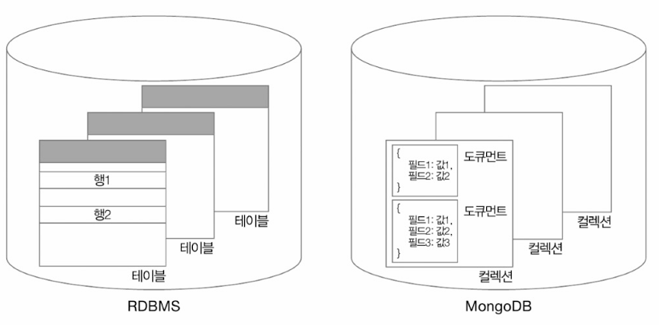

### 그래프 데이터베이스
- 그래프 데이터베이스(graph database): 데이터베이스에 저장하고자 하는 데이터를 그래프의 노드 형태로 저장하는 데이터베이스
- 대표적인 그래프 데이터베이스: neo4j
- 방향 그래프를 표현하기 위해 활용됨
- 노드 간 연결 관계와 방향 표시 가능 -> SNS 친구 관계나 교통망 같이 데이터 간의 관계성이 중요한 레코드를 저장하기 위해 주로 사용됨

### 칼럼 패밀리 데이터베이스
- 칼럼 패밀리 데이터베이스(column family database): RDBMS와 같이 행과 열이라는 개념이 있고, RDBMS에서 키를 통해 특정 행을 식별하듯 로우 키(row key)를 통해 특정 행을 식별함
- RDBMS와 달리 정규화나 조인을 사용하지 않고, 스키마가 고정되어 있지 않아 자유롭게 열을 추가할 수 있음
- 대표적인 칼럼 패밀리 데이터베이스: Cassandra, HBase 등

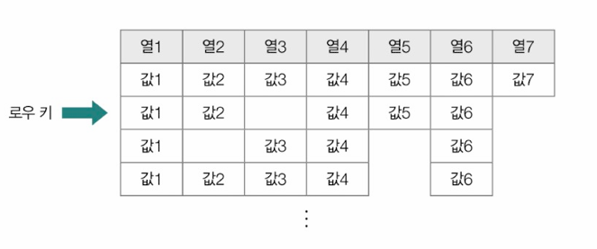

단위: 열 -> 칼럼 패밀리(colum family) -> 키스페이스(keyspace)
- 키스페이스: 여러 칼럼 패밀리들을 포괄하는 칼럼 패밀리 데이터 베이스의 최상위 단위
  - 일반적으로는 애플리케이션마다 키스페이스가 하나씩 사용됨

NoSQL은 높은 부하를 감당하거나 대용량 데이터를 다루는 분산 환경에서 사용하기 좋음

## 다양한 NoSQL: MongoDB와 Redis 맛보기
### MongoDB
- 레코드는 도큐먼트 단위로 저장됨
- 레코드 -> 컬렉션 -> 데이터베이스

▼ 데이터베이스와 컬렉션 생성 명령
```py
use 데이터베이스_이름     # 데이터베이스 생성/사용
db.createCollection("컬렉션_이름")     # 컬렉션 생성
```
ex) 'mydb'라는 데이터베이스와 'mycollection'이라는 컬렉션 생성\
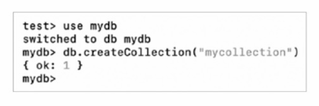

▼ 생성된 데이터베이스와 컬렉션 조회 명령
```py
show dbs
show collections
```
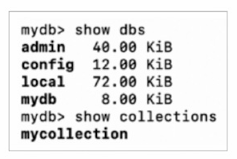

▼ 현재 사용 중인 데이터베이스와 컬렉션을 삭제하는 명령
```py
db.dropDatabase()
db.컬렉션_이름.drop()
```

**<데이터를 삽입하는 방법>**
1. 단일 레코드를 삽입하는 방법
```py
db.컬렉션_이름.insertOne()
# 소괄호 안에 삽입하고자 하는 도큐먼트(레코드)를 JSON형태로 명시
```
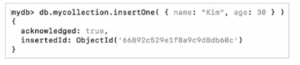
- 실행 결과에서 'ObjectId': 도큐먼트마다 부여되는 고유한 값
  - 특정 도큐먼트를 식별할 수 있는 정보
  - 타임스탬프, 랜덤 값, 증가하는 값인 카운터의 조합으로 이뤄짐
  - 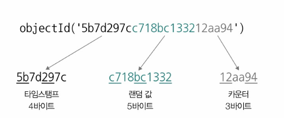

- JSON 형태의 도큐먼트는 아래와 같이 변수 형태로도 사용 가능
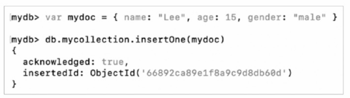

▼ 특정 컬렉션의 도큐먼트를 확인하는 명령
```
db.컬렉션_이름.find()
```
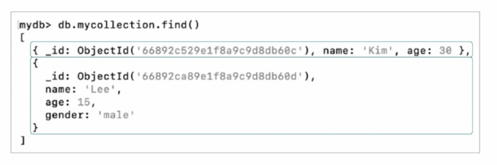
- 인자로 도큐먼트의 필드(JSON의 키)의 값을 하나 이상 명시하면 원하는 도큐먼트만 필터링하여 조회 가능
- ex) 'name'이 'Kim'인 도큐먼트 조회
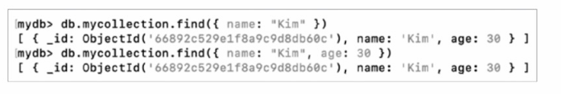


> **MongoDB의 연산자**\
> 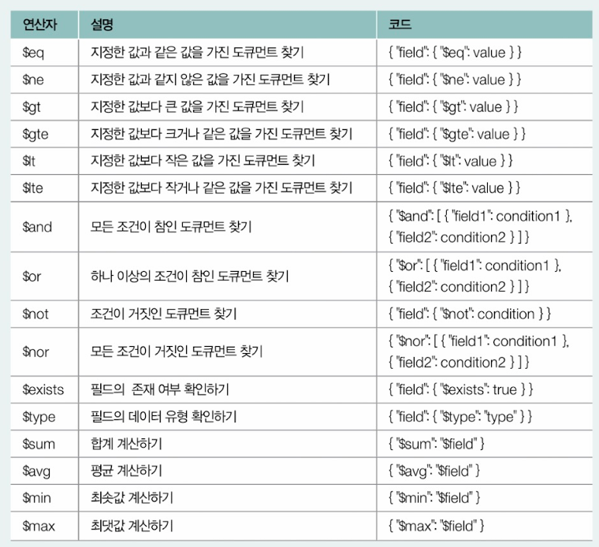
>
> 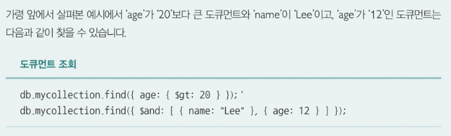


2. 여러 레코드를 삽입하는 방법
```py
db.컬렉션_이름.insertMany()
# 소괄호 안에 삽입할 여러 도큐먼트를 리스트 형태로 명시하면 됨
```
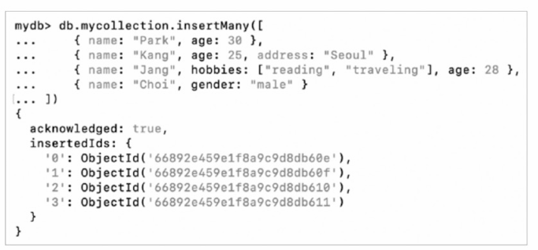


**<도큐먼트를 갱신하는 방법>**
1. 단일 도큐먼트를 갱신하는 방법
```py
db.컬렉션_이름.updateOne()
# 첫 번째 인자: 갱신할 도큐먼트를 식별하는 필터
# 두 번째 인자: 갱신할 내용
  # $set: {변경할_필드: 변경할_내용, ...}
```
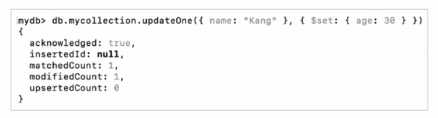

2. 여러 도큐먼트를 갱신하는 방법
```
db.컬렉션_이름.updateMany()
```

ex)  'age'가 '20' 이상인 모든 도큐먼트 (age: {$gte:20})의 'status'필드를 'active'로 설정하도록 갱신하는 명령\
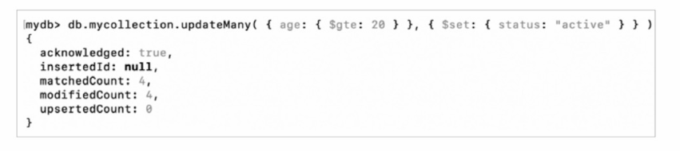

갱신 결과:
- 도큐먼트에 'status' 필드가 없었다면 새로 생성하게 됨
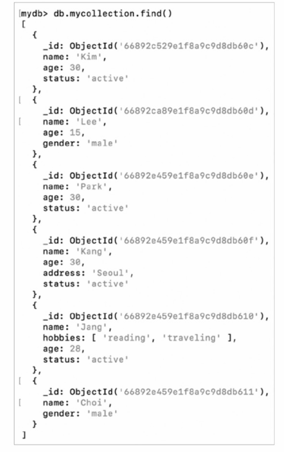


▼ 특정 필드를 없앨 때\
`$unset` 연산자가 사용됨
ex) 'age'가 '20'이상인 모든 도큐먼트의 'status' 필드를 없애는 명령\
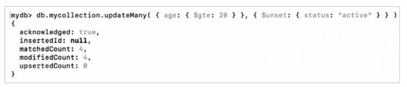


▼ 도큐먼트 삭제 명령
```py
db.컬렉션_이름.deleteOne()    # 단일 도큐먼트 삭제
db.컬렉션_이름.deleteMany()     # 여러 도큐먼트 삭제
```
- 첫 번째 인자를 통해 삭제하고자 하는 도큐먼트의 필드를 필터로 지정 가능 
- 연산자 사용 가능

- ex) 'name' 필드가 'Lee'인 도큐먼트를 삭제하는 예시와 'age'필드가 '20' 이상인 도큐먼트를 삭제하는 예시
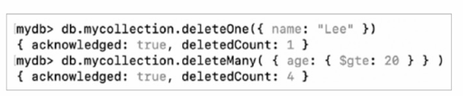


### Redis
- 키-값 데이터베이스이자 인 메모리 데이터베이스의 일종
- '값'으로 활용될 수 있는 자료 구조: 문자열, 리스트, 해시 테이블, 집합 등

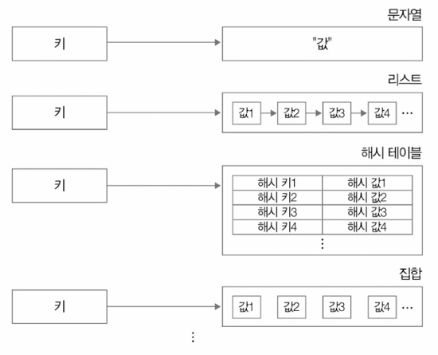

▼ Redis에서 **문자열 타입**을 다룰 때 사용 가능한 대표적인 명령\
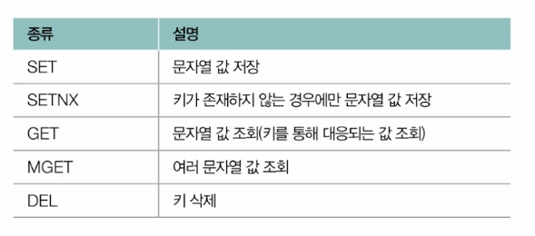

- SET
  - Redis 설치 환경에서 아래와 같이 입력하면 'k1'이라는 키에 'Thank You'라는 문자열 값이 대응되어 저장됨
  - 올바르게 입력했다면 'OK'가 출력됨
  - 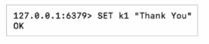

- SETNX
  - 'SET if Not eXists'의 약자
  - 키가 존재하지 않는 경우에만 값을 저장하라는 뜻
  - 키가 존재하지 않는 경우 -> '1'이 반환되고 값이 저장
  - 키가 이미 존재하는 경우 -> '0'이 반환되고 값이 저장되지 않음
  - 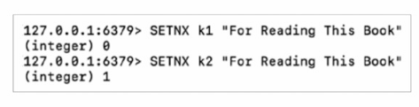

- GET/MGET
  - GET 명령 뒤에 키 이름을 명시하면 해당 키에 대응된 값 조회 가능
  - MGET 명령 뒤에 여러 키 이름을 나열하면 해당 키들에 대응된 값들을 볼 수 있음
  - 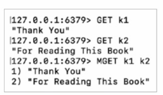

- DEL
  - DEL 명령 뒤에 키 이름을 명시하면 해당 키-값의 대응 관계가 삭제됨
  - 삭제된 값을 조회할 경우 아무것도 조회되지 않음(nil)
  - 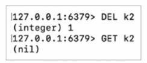

▼ Redis에서 **리스트 타입**을 다룰 때 사용 가능한 대표적인 명령\
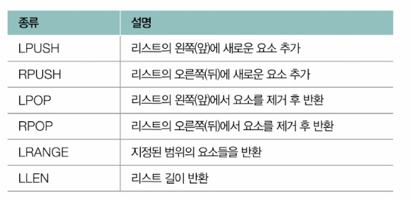

- LPUSH/RPUSH
  - LPUSH: 아래 사진은 'lk'라는 키에 대응되는 리스트 왼쪽(앞)에 'Computer'라는 문자열 요소를 추가하는 명령
  - 리스트가 비어있을 경우 새 리스트를 생성하고 리스트의 왼쪽에 첫 번째 요소를 추가함
  - 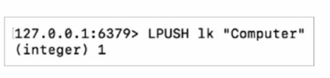

  - 실행 이후 'lk'라는 키에 대응되는 리스트는 ["Computer"]가 됨
  - LPUSH, RPUSH를 통해 아래의 명령을 실행하면 'lk'라는 키에 대응되는 리스트는 ["This was", "Computer", "Science"]가 됨
  - 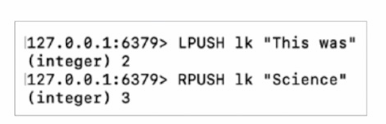

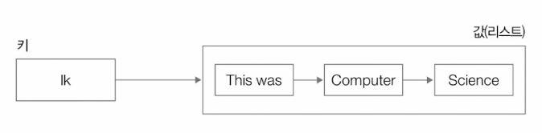

- LRANGE
  - 지정된 범위의 요소들을 반환
  - '0'은 리스트 첫 번째 요소, '-1'은 리스트의 마지막 요소를 의미
  - '0 -1'은 리스트의 처음부터 끝까지의 모든 요소를 반환하라는 의미
  - 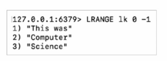

- LLEN
  - 리스트의 길이를 확인하는 명령
  - 아래의 명령은 'lk'리스트의 길이, 즉 요소의 개수를 반환
  - 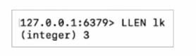

- LPOP/RPOP
  - LPOP: 리스트의 왼쪽(앞)에서 요소를 제거하고 반환하는 명령
  - 아래의 명령을 실행할 경우 'lk'리스트의 첫 번째 요소가 제거되고, 제거된 요소가 반환됨
  - 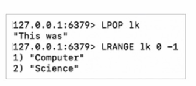
  - RPOP: 리스트의 오른쪽(뒤)에서 요소를 제거하고 반환하는 명령
  - 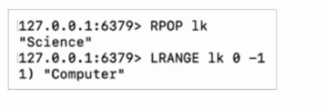


# 추가학습 NOTE
## 데이터베이스 분할과 샤딩
데이터베이스 분할(database partitioning, 데이터베이스 파티셔닝): 테이블을 물리적으로 분할하여 레코드를 저장하는 기술
- 파티션: 분할되어 저장되는 단위
- 테이블 내에 수많은 레코드가 효율적으로 저장되어야 하는 경우, 혹은 데이터베이스에 대한 부하의 분산을 고려해야 하는 경우에 유용하게 사용할 수 있는 기술

- 수평적 분할(thorizontal partitioning): 테이블의 행을 기준으로 테이블을 나누어 저장하는 방식
- 수직적 분할(vertical partitioning): 테이블의 열을 기준으로 테이블을 나누어 저장하는 방식

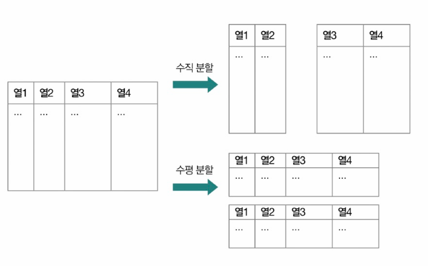

- (정규화된 테이블이라 할지라도) 물리적으로 테이블의 열을 분리하여 저장하는 것이 효율적일 때가 있음
  - 테이블에 발생하는 트랜잭션 수에 비해 테이블 내에 열이 과도하게 많은 경우
  - 특정 열에 속하는 레코드의 데이터 크기가 다른 열의 레코드에 비해 과도하게 큰 경우
  - 보안 상의 이유로 특정 열을 별개의 테이블로 나누어 저장해야 하는 경우

ex) 아래와 같이 '제품' 테이블이 있다고 가정했을 때\
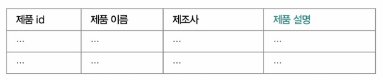
- '제품 설명' 열의 데이터가 다른 열에 비해 포함된 정보의 크기가 크다고 가정
- '제품 설명'열을 별도의 테이블로 분리한 뒤 필요할 때에만 조회하는 것이 성능상 유리함

<수평적 분할 방법>
1. 범위 분할
- 방식에서는 레코드 데이터가 가질 수 있는 범위를 정의하고, 해당 범위를 기준으로 테이블을 나눔
- ex) 회원들의 데이터를 관리하는 경우
  - 회원들의 가입 연도를 범위로 정의하고, 그 범위에 따라 테이블을 분할함
  - 2000년부터 2009년 사이에 가입한 회원들은 'p1' 파티션
  - 2010년부터 2019년 사이에 가입한 회원들은 'p2' 파티션
  - 2020년 이후에 가입한 회원들은 'p3' 파티션에 저장하는 예
  - 

2. 목록 분할
- 레코드 데이터가 특정 목록(리스트)에 포함된 값을 가질 경우 해당 레코드를 별도의 테이블로 분할함
- ex) 고객의 주소 데이터를 관리하는 경우
  - 'customers'라는 테이블의 주소(address) 열을 기준으로 분할했으며, 'address'의 값이 특정 목록에 포함된 경우 해당 레코드는 정의된 파티션(p0, p1, p2, p3)으로 분할됨
  - 'Seoul'인 고객 레코드는 'p0'파티션에 저장하고, 주소가 'Incheon'인 고객 레코드는 'p1' 파티션에 저장하는 예제
  - 

3. 해시 분할
- 특정 열 데이터에 대한 해시 값을 기준으로 별도의 테이블로 분할함
- 즉, 파이션별 레코드가 해시 값을 기준으로 균등하게 분배됨
- ex) 학생들의 전공 과목 데이터를 관리하는 예
  - 'students'라는 테이블을 'major_id'열을 기준으로 분할했으며, 레코드는 'major_id' 값에 해시 함수를 적용하여 생성된 해시 값에 따라 4개의 파티션으로 나뉘어 저장됨(PARTITIONS 4)
  - 


4. 키 분할
- 키를 기준으로 별도의 테이블로 분할함
- 즉, 파티션별 레코드가 키를 기준으로 균등하게 분배됨
- ex) 학생 데이터를 관리하는 경우
  - 'students'라는 테이블의 기본 키 'id'를 기준으로 파티셔닝 되는 예
  - 레코드가 'id' 값에 따라 2개의 파티션으로 나뉘게 됨(PARTITIONS 2)
  - 


- 수평적 분할을 통해 만들어진 파티션들은 기본적으로 동일한 데이터베이스 서버 내에 위치함
  - 해당 서버에 요청이 몰리는 상황에서 부하 분산을 기대하기 어려움

=> 샤딩을 통해 해결

샤딩(sharding): 분할된 테이블을 별개의 데이터베이스 서버에 분산하여 저장하는 기술
- 샤드(shard): 분할되어 저장된 단위
- 분할된 샤드들은 여러 서버에 분산되어 저장되기 때문에 부하 분산 효과를 얻을 수 있음


# Q&A

Q1. 이행적 종속 관계란 무엇인지 설명해보시오.

A1. 가령 어떤 테이블에서 A, B, C라는 필드가 있을 때, 만약 A가 B를 결정하고, B가 C를 결정하는 상황이라면 자연스럽게 A도 C를 결정하게 됩니다. 이때 A와 C의 관계를 이행적 종속 관계라고 합니다.

Q2. 제1 정규형, 제2 정규형, 제3 정규형의 필요충분조건에 대해 말해보시오.

A2. 제1 정규형의 필요충분 조건은 모든 속성이 원자 값을 갖도록 하는 것입니다. 제2 정규형의 필요충분 조건은 제1 정규형을 만족하며 기본 키가 아닌 모든 필드들이 모든 기본 키에 완전히 종속되는 것이며, 제3 정규형은 제2 정규형이며 기본 키가 아닌 모든 필드가 기본 키에 이행적 종속성이 없는 상태를 말합니다.

Q3. NoSQL은 어떤 환경에서 사용하기 좋은지 말해보시오.

A3. NoSQL은 높은 부하를 감당하거나 대용량 데이터를 다루는 분산 환경에서 사용하기 좋습니다. 왜냐하면 NoSQL의 주요 이점이 확장성과 유연성, 가용성, 성능이기 때문입니다.

