- [Ch.6-1. 데이터베이스의 큰 그림](#ch6-1-데이터베이스의-큰-그림)
- [1. 데이터베이스와 DBMS](#1-데이터베이스와-dbms)
  - [1.1 DBMS의 종류](#11-dbms의-종류)
  - [1.2 서버로서의 DBMS](#12-서버로서의-dbms)
    - [SQL의 주요 분류](#sql의-주요-분류)
- [2. 파일 대신 데이터베이스를 이용하는 이유](#2-파일-대신-데이터베이스를-이용하는-이유)
- [3. 데이터베이스의 저장 단위와 트랜잭션](#3-데이터베이스의-저장-단위와-트랜잭션)
  - [3.1 데이터베이스의 저장 단위](#31-데이터베이스의-저장-단위)
  - [3.2 스키마(Schema)](#32-스키마schema)
  - [3.3 트랜잭션과 ACID](#33-트랜잭션과-acid)
    - [ACID 원칙](#acid-원칙)
- [4. 데이터베이스 지도 그리기](#4-데이터베이스-지도-그리기)
- [Ch.6-2 RDBMS의 기본](#ch6-2-rdbms의-기본)
- [1. 테이블의 구성: 필드와 레코드](#1-테이블의-구성-필드와-레코드)
  - [1.1 필드 타입](#11-필드-타입)
  - [1.2 키(key)](#12-키key)
    - [키의 종류](#키의-종류)
- [2. 테이블의 관계](#2-테이블의-관계)
  - [2.1 일대일(1:1) 대응 관계](#21-일대일11-대응-관계)
  - [2.2 일대다(1:N) 대응 관계](#22-일대다1n-대응-관계)
  - [2.3 다대다(M:N) 대응 관계](#23-다대다mn-대응-관계)
- [3. 무결성 제약 조건](#3-무결성-제약-조건)
  - [3.1 도메인 제약 조건(Domain Constraint)](#31-도메인-제약-조건domain-constraint)
  - [3.2 키 제약 조건(Key Constraint)](#32-키-제약-조건key-constraint)
  - [3.3 엔티티 무결성 제약 조건(=기본 키 제약 조건) (Entity Integrity Constraint)](#33-엔티티-무결성-제약-조건기본-키-제약-조건-entity-integrity-constraint)
  - [3.4 참조 무결성 제약 조건(= 외래 키 제약 조건) (Referential Integrity Constraint)](#34-참조-무결성-제약-조건-외래-키-제약-조건-referential-integrity-constraint)
  - [\<참고\> 참조하는 테이블이 삭제/수정될 경우의 처리 방식](#참고-참조하는-테이블이-삭제수정될-경우의-처리-방식)
- [Question](#question)
  - [Q1. RDBMS와 NoSQL 데이터베이스의 차이점은 무엇인가요?](#q1-rdbms와-nosql-데이터베이스의-차이점은-무엇인가요)
  - [Q2. 트랜잭션과 ACID 원칙에 대해 설명해 주세요.](#q2-트랜잭션과-acid-원칙에-대해-설명해-주세요)
  - [Q3. 기본 키(Primary Key)와 외래 키(Foreign Key)의 차이점은 무엇인가요?](#q3-기본-키primary-key와-외래-키foreign-key의-차이점은-무엇인가요)

# Ch.6-1. 데이터베이스의 큰 그림

# 1. 데이터베이스와 DBMS  
- **데이터베이스(Database)**
  - 사전적 정의: 여러 사람이 공유하여 사용할 목적으로 체계화해 통합, 관리하는 데이터의 집합
  - **원하는 기능을 동작시키기 위해 반드시 저장해야 하는 정보의 집합**
- **데이터베이스 관리 시스템(DBMS; Database Management System)**
  - 데이터베이스를 관리하기 위한 프로그램
  - 데이터를 효율적으로 저장, 관리, 검색, 수정할 수 있도록 해주는 소프트웨어

## 1.1 DBMS의 종류  
- **관계형 데이터베이스 관리 시스템(RDBMS; Relational DataBase Management System)**: 테이블 형식으로 데이터를 저장하며, SQL을 사용하여 관리하는 방식
  - 예: MySQL, Oracle, PostgreSQL, SQLite, MariaDB, Microsoft SQL Server 등
- **NoSQL 데이터베이스 관리 시스템**: 비정형 데이터나 대규모 데이터를 처리하기 위해 관계형 모델을 따르지 않는 방식 → RDBMS 보다 유연한 형태로 대규모 데이터 다루기 용이, 확장성 좋아서 최근 상승세
  - 예: MongoDB, Redis 등

## 1.2 서버로서의 DBMS
- DBMS는 사용자와 직접적 상호작용X, 사용자(개발자)가 만든 프로그램과 상호작용하며 실행
- 응용 프로그램(들) 입장 - DBMS는 서버 같음
  - 클라이언트-서버 간 동작과 유사
  - 쓰리 웨이 핸드셰이크 통한 TCP 연결, DB 접속 위한 인증 필요 → 이럴 때 네트워크에서 클라이언트가 서버에 요청 보내듯이 DBMS 클라이언트는 DBMS에 `쿼리`를 보냄
  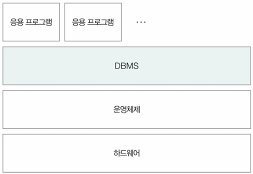
- **쿼리(Query)**: 데이터베이스에 명령을 전달하는 방식
- **SQL(Structured Query Language)**: 관계형 데이터베이스에서 데이터를 조작하고 정의하기 위한 `언어` - 데이터베이스에 질의(Query)하기 위한 구조화된(Structured) 언어(Language) 
⇒ 사용자/응용 프로그램은 DBMS의 데이터베이스 언어(SQL)을 통해(쿼리) 데이터베이스를 다룰 수 있음
### SQL의 주요 분류
  - **DDL(Data Definition Language)**: 데이터 정의어
    - CREATE: DB 혹은 테이블,뷰,인덱스 등의 DB 객체 생성
    - ALTER: DB 객체 갱신
    - DROP: DB 객체 삭제
    - TRUNCATE: 테이블 구조를 유지한 채 모든 레코드 삭제
  - **DML(Data Manipulation Language)**: 데이터 조작어
    - SELECT: 테이블의 레코드 조회
    - INSERT: 테이블의 레코드 삽입
    - UPDATE: 테이블의 레코드 갱신
    - DELETE: 테이블의 레코드 삭제
  - **DCL(Data Control Language)**: 데이터 제어어
    - GRANT: 사용자에게 권한 부여
    - REVOKE: 사용자로부터 권한 회수
  - **TCL(Transaction Control Language)**: 트랜잭션 제어어
    - COMMIT: 데이터베이스에 직접 반영
    - ROLLBACK: 작업 이전의 상태로 되돌림
    - SAVEPOINT: 롤백의 기준점 설정
  - TCL을 제외하고 DDL, DML, DCL로 구분하기도

# 2. 파일 대신 데이터베이스를 이용하는 이유
암기까지 할 건 아님
1. **데이터 일관성 및 무결성 제공이 어렵습니다.**
  - 레이스 컨디션(race condition) 문제 발생 가능 → 데이터 일관성 훼손되기 쉬움
  - 데이터의 무결성 보장 어려움 - 모든 데이터 파일을 기반으로 저장할 경우, 잘못된 값 검출하기 어려움
2. **불필요한 중복 저장이 많아집니다.**: 동일한 데이터를 여러 파일에 저장하는 비효율 발생 → 저장 공간 낭비
3. **데이터 변경 시 연관 데이터 수정이 어렵습니다.**: 참조 무결성을 유지하기 어려움
  - 참조 무결성: 한 테이블에서 다른 테이블을 참조할 때, 참조된 데이터(부모 테이블의 기본 키)가 삭제되거나 변경되어도 참조하는 데이터(자식 테이블의 외래 키)가 무효한 상태가 되지 않도록 유지
4. **정교한 검색이 어렵습니다.**: 복잡한 질의를 효율적으로 처리하기 어려움(파일에서도 데이터 검색 가능하지만, 많은 경우 파일 내 문자열 검색에 국한)
5. **백업 및 복구의 어렵습니다.**
  - DB는 보통 여러 명의 사용자 및 프로그램이 동시다발적으로 이용 → 백업&복구 기능 제공(단순 파일은 제공X)
  - 데이터 손실 발생 시 복구가 까다로움

# 3. 데이터베이스의 저장 단위와 트랜잭션  

## 3.1 데이터베이스의 저장 단위
- **엔티티(Entity)**: 독립적으로 존재할 수 있는 객체 → 어떠한 특성 가진 대상이면 모두 엔티티
- **속성(Attribute)**: 엔티티가 가지는 개별적인 특성
- **엔티티 집합**: 동일한 유형의 엔티티들의 집합 
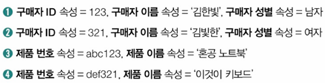
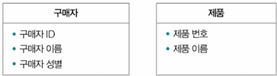
  - 1, 2: '구매자' 엔티티 집합
  - 3, 4: '제품' 엔티티 집합
- **도메인(Domain)**: 특정 속성이 가질 수 있는 값들의 범위 예: 성별 - {남자, 여자}
- **릴레이션(Relation, 테이블)**
  - RDBMS에서 표현되는 이차원 테이블 형태의 엔티티 집합
  - RDBMS에서 데이터를 저장하는 기본 단위
- **컬렉션(Collection)**: NoSQL(Like. MongoDB) 데이터베이스에서 데이터를 저장하는 기본 단위
- **레코드(Record, 튜플)**: 테이블에서 한 개의 행(row)
- **필드(Field, 속성)**: 테이블에서 한 개의 열(column)
- **도큐먼트(Document)**: NoSQL 데이터베이스에서 하나의 데이터 객체 → 개별 레코드를 JSON 형태의 데이터인 도큐먼트 단위로 표현, 필드를 JSON 키 형태로 표현 
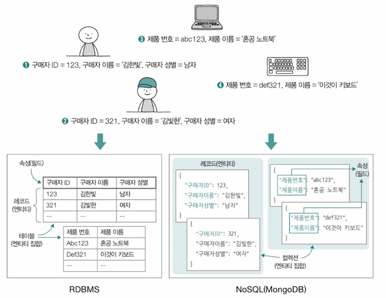
- **차수(Degree)**: 필드의 수
- **카디날리티(Cardinality)**: 한 필드에 대한 고유 값의 수
  - 카디날리티가 낮을수록 중복된 속성 많음

## 3.2 스키마(Schema)
- 데이터베이스의 구조와 제약 조건을 정의하는 설계
- RDBMS와 NoSQL을 구분하는 주요 기준
- **NoSQL 데이터베이스**는 **스키마-리스(Schema-less) 데이터베이스**로, 사전에 스키마를 정의하지 않고 유연한 데이터 구조를 가짐

## 3.3 트랜잭션과 ACID
- **트랜잭션(Transaction)**: 데이터베이스에서 하나의 논리적인 상호작용의 단위
- **초당 트랜잭션(TPS; Transactions Per Second)**: 데이터베이스 작업 성능을 평가하는 주요 지표
### ACID 원칙
  - **원자성(Atomicity)**
    - 트랜잭션이 하나의 단위로 처리
    - 작업이 모두 수행되거나 전혀 수행되지 않아야 함 (All or Nothing)
  - **일관성(Consistency)**: 트랜잭션 실행 전후의 데이터 상태가 유지되어야 함 
    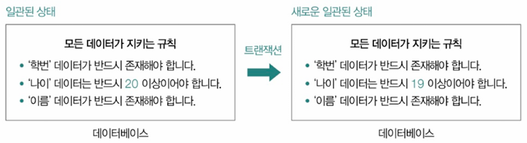
  - **격리성(Isolation)**: 동시 실행되는 트랜잭션들이 서로 영향을 미치지 않아야 함
  - **지속성(Durability)**: 트랜잭션이 완료된 후 데이터가 영구적으로 저장되어야 함

- **Commit과 Rollback** 
  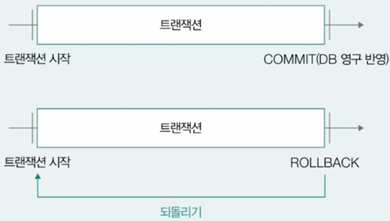
  - **Commit**: 트랜잭션의 모든 작업을 확정하여 데이터베이스에 반영하는 연산
  - **Rollback**: 트랜잭션 수행 도중 오류 발생 시, 변경된 데이터를 원래 상태로 되돌리는 연산

# 4. 데이터베이스 지도 그리기
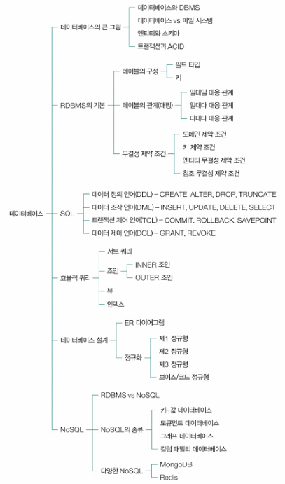

---
# Ch.6-2 RDBMS의 기본

# 1. 테이블의 구성: 필드와 레코드  
- **필드(Field)**: 테이블의 열(column), 하나의 속성을 의미  
- **레코드(Record, 튜플)**: 테이블의 행(row), 하나의 개별 데이터 항목을 의미  

## 1.1 필드 타입
> RDBMS 내 레코드들은 테이블 형태 
> → 이때 각 필드로 사용 가능한 데이터 유형 ; **필드 타입**
<MySQL 기준>

| **유형**      | **타입**     | **설명** |
|--------------|------------|----------|
| **숫자형**   | TINYINT    | 1바이트의 정수(-128 ~ 127) |
|              | SMALLINT   | 2바이트의 정수(-32768 ~ 32767) |
|              | MEDIUMINT  | 3바이트의 정수(-8388608 ~ 8388607) |
|              | INT        | 4바이트의 정수(-2147483648 ~ 2147483647) |
|              | BIGINT     | 8바이트의 정수(-9223372036854775808 ~ 9223372036854775807) |
|              | FLOAT      | 4바이트 부동 소수점 실수 |
|              | DOUBLE     | 8바이트 부동 소수점 실수 |
|              | DECIMAL    | DECIMAL(전체 자리수, 소수점 자리수) 형식의 고정 소수점 실수 (예: DECIMAL(3,2)는 소수점 이하 2자리로 총 3자리의 숫자) |
| **문자형**   | CHAR       | 고정 길이 문자열 |
|              | VARCHAR    | 가변 길이의 문자열 |
|              | BLOB       | 이미지, 미디어 같은 대형 바이너리 데이터 |
|              | TEXT       | 대량 텍스트 문자열 |
| **날짜/시간형** | DATE       | YYYY-MM-DD 형식의 날짜 |
|              | TIME       | HH:MM:SS 형식의 시간 |
|              | DATETIME   | 8바이트 YYYY-MM-DD HH:MM:SS 형식의 날짜와 시간 |
|              | TIMESTAMP  | 4바이트 YYYY-MM-DD HH:MM:SS 형식의 타임스탬프 |
| **기타**     | ENUM       | 정해진 값 중 하나 (예: 남, 여) |
|              | GEOMETRY   | 지리 정보 데이터 타입 (좌표) |
|              | XML        | XML 데이터 |
|              | JSON       | JSON 데이터 |

## 1.2 키(key)
- 테이블 내에서 레코드를 식별할 수 있는 하나 이상의 필드
- 테이블 간 참조하거나 테이블 접근 속도 높이기 위해 사용
### 키의 종류
- **후보 키(Candidate Key)**
  - 유일성과 최소성을 모두 만족하는 키
  - 테이블 내 하나 이상 존재 가능 
  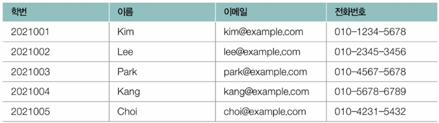
    - 학번, 이메일, 전화번호 고유한 값 → 각각 후보 키로 간주
- **복합 키(Composite Key)**
  - 최소 2개 이상 필드로 구성된 후보 키 
  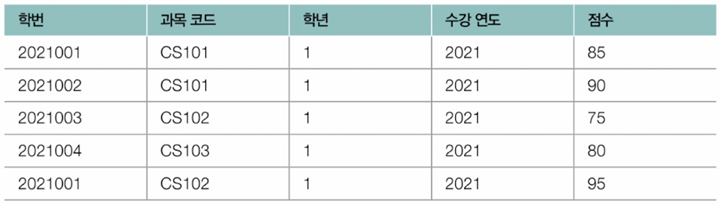
    - 후보 키: 학번, 과목 코드 → 최소 이 2개 필드로 레코드 식별 가능해서
    - 두 필드 이상으로 구성된 후보 키 → 복합 키
- 슈퍼 키(Super Key)
  - 레코드 식별하기 위한 필드의 최소 집합이 아닌, `레코드 식별하기 위한 필드의 집합`
  - 유일성을 만족하지만 최소성을 만족하지 않는 키 → 슈퍼 키에는 레코드 식별에 꼭 필요하지 않은 필드도 포함될 수 있음
- **기본 키(PK; Primary Key)**
  - 테이블 당 하나만 존재
  - 여러 후보 키 중, 테이블 레코드 대표하도록 선택된 키
  - 후보 키 중에서 한 개를 선택하여 테이블의 주 식별자로 지정 
  - 후보 키 일부 → 유일성, 최소성 모두 만족
  - 여러 필드로 구성된 기본 키도 존재할 수 있음
  - 단, NULL 값은 가질 수 없음 
- 대체 키(Alternate Key): 후보 키 중에서 기본 키로 선택되지 않은 나머지 키
- **외래 키(FK; Foreign Key)**: 다른 테이블의 기본 키를 참조하여 관계를 맺는 키
  - '학생' 테이블의 '수강 과목' 필드가 '과목' 테이블의 '개설 과목' 참조하는 외래 키로 사용 
    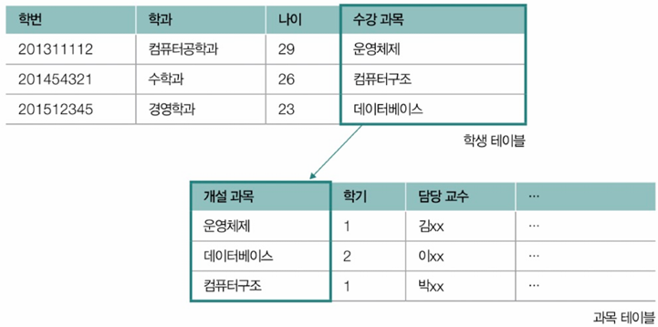
  - '구매자' 테이블의 '장바구니' 필드가 '상품 목록' 테이블의 '상품 ID' 참조 → **외래 키로 다른 테이블에 연결(참조), 테이블 간 관계 표현도 가능**
  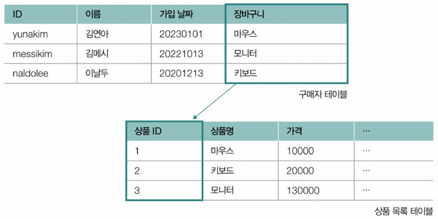

# 2. 테이블의 관계 
## 2.1 일대일(1:1) 대응 관계  
- 한 테이블의 한 레코드가 다른 테이블의 한 레코드와만 대응  
- 예: 승객 테이블과 여권 테이블 
  
  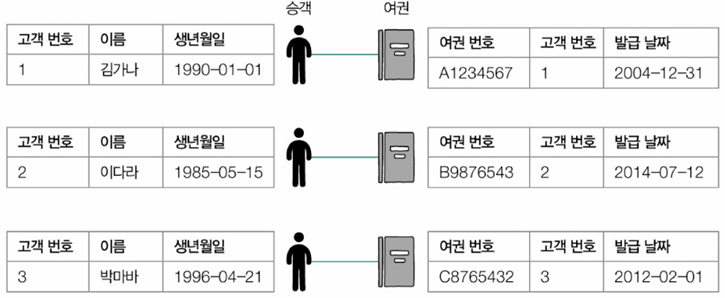

## 2.2 일대다(1:N) 대응 관계  
- 한 테이블의 한 레코드가 다른 테이블의 여러 레코드와 대응  
- 예: 고객 테이블과 주문 테이블 (한 명의 고객이 여러 개의 주문을 가질 수 있지만, 각 주문은 한 명의 고객에게만 속함) 
  
  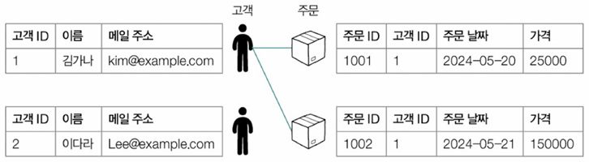

## 2.3 다대다(M:N) 대응 관계
- 한 테이블의 여러 레코드가 다른 테이블의 여러 레코드와 대응되는 경우
- 예: SNS - 하나의 사용자 계정이 여러 그룹에 가입(각 사용자는 여러 그룹 가입, 각 그룹에는 여러 사용자가 속함) 
  
  

# 3. 무결성 제약 조건  
- 데이터베이스에 저장된 데이터의 일관성과 유효성을 유지하기 위해 적용되는 제약 조건
- 무결성 제약 조건의 종류 4가지 있음
- 안지키면 오류 메시지 
  

## 3.1 도메인 제약 조건(Domain Constraint)
- 특정 필드가 가질 수 있는 값의 범위를 제한하는 규칙  
- 예: `AGE` 필드는 `0~150` 사이의 값만 가질 수 있음
- 각각 필드 데이터는 원자 값 가져야 함
- 지정된 필드 타입 준수
- 값의 범위나 기본값이 지정되면 따라야 함
- NULL 허용되지 않으면 NULL 저장X
- 예: 제약 조건 위배하는 데이터가 삽입/ 수정된 경우 → 도메인 제약 조건 위배
  
- **원자 값(Atomic Value)**
  - 더 이상 쪼갤 수 없는 단일한 값
  - 필드에는 하나의 값만 저장되어야 함 (정규화의 원칙)  

## 3.2 키 제약 조건(Key Constraint)
레코드를 고유하게 식별할 수 있는 키로 지정된 필드에 중복 값 존재하면 안 됨

## 3.3 엔티티 무결성 제약 조건(=기본 키 제약 조건) (Entity Integrity Constraint)
- **각 레코드는 고유해야 함**
- **기본 키는 NULL 값을 가질 수 없음** 

## 3.4 참조 무결성 제약 조건(= 외래 키 제약 조건) (Referential Integrity Constraint)
- 외래 키는 참조하는 테이블의 기본 키와 같은 값을 같거나 NULL 값을 가져야 함
- 외래 키를 통해 다른 테이블 참조할 때, 데이터의 일관성 지키기 위한 제약 조건 
  

## <참고> 참조하는 테이블이 삭제/수정될 경우의 처리 방식
RDBMS는 참조 무결성을 유지하기 위해 4가지 동작

1. **연산 제한 (RESTRICT / NO ACTION)**  
   - 부모 테이블의 데이터가 참조되고 있으면 삭제/수정을 허용하지 않음(거부)
   - 기본 설정 (참조 무결성 제약 조건을 명시하지 않았을 때, RDBMS가 기본적으로 적용하는 동작)
   - 외래 키로 참조된 부모 테이블의 데이터가 삭제 또는 수정될 때, 해당 데이터를 참조하는 자식 테이블의 데이터가 존재하면 삭제/수정을 막음

2. **기본값 설정 (SET DEFAULT)**  
   - 부모 테이블의 데이터가 삭제되면, 자식 테이블의 외래 키 값을 기본값으로 변경  

3. **NULL 값 설정 (SET NULL)**  
   - 부모 테이블의 데이터가 삭제되면, 자식 테이블의 외래 키 값을 `NULL`로 변경  

4. **연쇄 변경 (CASCADE)**  
   - 부모 테이블의 데이터가 삭제/수정되면, 자식 테이블의 데이터도 자동으로 삭제/수정됨  

---
# Question
## Q1. RDBMS와 NoSQL 데이터베이스의 차이점은 무엇인가요?

RDBMS는 데이터를 테이블 형태로 저장하고 관계를 기반으로 데이터를 관리하는 데이터베이스 시스템입니다. 관계형 데이터베이스는 정규화를 통해 데이터 중복을 최소화하고 SQL을 사용하여 데이터를 조작합니다. 대표적인 RDBMS로는 MySQL, PostgreSQL, Oracle 등이 있습니다.

반면, NoSQL 데이터베이스는 정형화되지 않은 데이터를 저장하고 관계형 모델을 따르지 않는 방식으로 데이터를 관리합니다. 대규모 데이터를 처리하는 데 유리합니다. 그리고 스키마가 없고 유연하여 확장성이 뛰어나고 수평 확장이 쉬운 장점이 있습니다. 대표적인 NoSQL 데이터베이스로는 MongoDB, Redis 등이 있습니다.

## Q2. 트랜잭션과 ACID 원칙에 대해 설명해 주세요.

트랜잭션은 데이터베이스에서 하나의 논리적인 작업 단위를 의미합니다.

트랜잭션은 ACID 원칙을 따라야 합니다.

1. 원자성: 트랜잭션의 모든 연산이 모두 수행되거나 전혀 수행되지 않아야 합니다.
2. 일관성: 트랜잭션이 실행된 후에도 데이터베이스는 일관된 상태를 유지해야 합니다.
3. 격리성: 동시에 실행되는 트랜잭션들이 서로 영향을 주지 않아야 합니다.
4. 지속성: 트랜잭션이 성공적으로 완료되면, 그 결과가 영구적으로 저장되어야 합니다.

## Q3. 기본 키(Primary Key)와 외래 키(Foreign Key)의 차이점은 무엇인가요?

기본 키는 테이블에서 각 레코드를 유일하게 식별할 수 있는 키입니다. 기본 키는 테이블 내에서 중복될 수 없으며 NULL 값을 가질 수 없습니다. 각 테이블에는 하나의 기본 키만 존재할 수 있고 기본 키를 통해 레코드를 빠르게 찾고 참조할 수 있습니다.

외래 키는 한 테이블이 다른 테이블의 기본 키를 참조할 때 사용하는 키입니다. 외래 키를 통해 테이블 간의 관계를 설정할 수 있고 이를 통해 데이터의 무결성을 유지할 수 있습니다. 