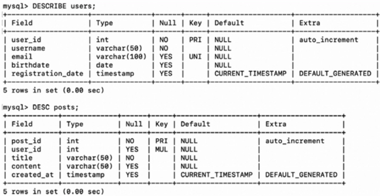
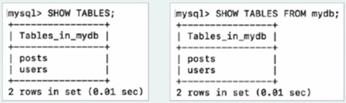
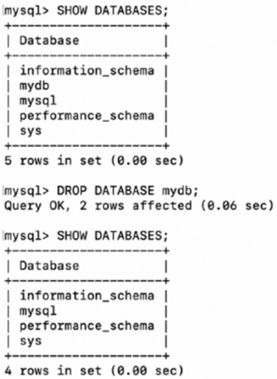
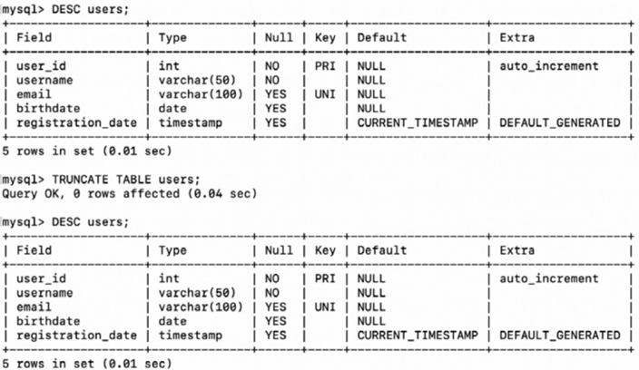

# Ch.6-3 SQL

# 1. 데이터 정의 언어(DDL; Data Definition Language)

## 1.1 CREATE
데이터베이스 혹은 데이터베이스 객체 생성
- 데이터베이스 객체
  - 데이터베이스에서 정의도리 수 있는 대상 통칭
  - 테이블, 인덱스, 뷰 등
- SQL문의 끝마다 `세미콜론(;)` 표기해야
EX) <br>
```sql
CREATE DATABASE     -- 데이터베이스
CREATE TABLE        -- 테이블
CREATE VIEW         -- 뷰
CREATE INDEX        -- 인덱스
CREATE USER         -- 사용자
```

### ➕ 데이터베이스 조회 및 사용
- 현재 데이터베이스 조회
    ```sql
    SHOW DATABASES;
    ```
    
- 특정 데이터베이스 사용
    ```sql
    USE 데이터베이스_이름;
    ```

### CREATE TABLE 문
```sql
CREATE TABLE 테이블_이름 (
    필드_이름1 필드_타입,
    필드_이름2 필드_타입,
    필드_이름3 필드_타입,
    ...
);
```

#### 테이블 생성 및 제약 조건
- `CREATE TABLE` 문 하단에서 **특정 필드에 대한 제약 조건 명시** 가능
    - `PRIMARY KEY`: 특정 필드를 기본 키로 지정
    - `UNIQUE`: 특정 필드가 고유한 값 갖도록 설정
      - 고유키(UNIQUE KEY): UNIQUE 제약 조건 명시된 필드
        - 기본 키와 유사하게 중복되는 값 가질 수 없음
        - 기본 키와 달리 테이블 내 여러 개 존재할 수 있음, NULL 값 가질 수 있음
    - `FOREIGN KEY`: 특정 필드를 외래 키로 지정
    - `DEFAULT 기본값`: 기본값 지정
    - `NULL/NOT NULL`: 특정 필드에 NULL 값 허용/허용하지 않음
```sql
CREATE TABLE 테이블_이름 (
    필드_이름1 필드_타입,
    필드_이름2 필드_타입,
    필드_이름3 필드_타입,
    ...
    [CONSTRAINT 제약_조건_이름] PRIMARY KEY (필드_이름),
    [CONSTRAINT 제약_조건_이름] FOREIGN KEY (필드_이름) REFERENCES 테이블_이름2 (필드_이름),
    [CONSTRAINT 제약_조건_이름] UNIQUE (필드_이름),
);
```

➕ 추가
- AUTO_INCREMENT: 레코드 추가될 때마다 자동으로 1씩 증가
- CURRENT_TIMESTAMP: 현재 시간

### ➕ 테이블 조회
- 테이블 구조 조회
    ```sql
    DESCRIBE 테이블_이름;
    DESC 테이블_이름;
    ```
    
- 데이터베이스 내 모든 테이블 조회
    ```sql
    SHOW TABLES;
    SHOW TABLES FROM 데이터베이스_이름;
    ```
    

## 1.2 ALTER
데이터베이스 객체 갱신

### 새로운 필드 추가
> ALTER TABLE 테이블_이름 ADD COLUMN 필드_이름 필드_타입 [제약 조건];
```sql
ALTER TABLE posts ADD COLUMN new_field VARCHAR(50) NOT NULL;
```

### 기존 필드 수정
> ALTER TABLE 테이블_이름 CHANGE COLUMN 기존_필드_이름 새_필드_이름 필드_타입 [제약 조건];
```sql
ALTER TABLE posts CHANGE COLUMN old_field new_field VARCHAR(30) NOT NULL;
```

### 기존 필드 삭제
> ALTER TABLE 테이블_이름 DROP COLUMN 필드_이름;
```sql
ALTER TABLE posts DROP COLUMN old_field;
```

### 외래 키 제약 조건 추가
> ALTER TABLE 테이블_이름 [ADD CONSTRAINT 제약_조건_이름]
>    ADD FOREIGN KEY (필드_이름) REFERENCES 참조_테이블_이름(참조_필드)
```sql
ALTER TABLE posts ADD FOREIGN KEY (user_id) REFERENCES users(user_id);
```

### UNIQUE 제약 조건 추가
> ALTER TABLE 테이블_이름 ADD UNIQUE (필드_이름);
```sql
ALTER TABLE posts ADD UNIQUE (title);
```

### NOT NULL 제약 조건 추가
> ALTER TABLE 테이블_이름 MODIFY 필드_이름 필드_타입 NOT NULL;
```sql
ALTER TABLE users MODIFY email VARCHAR(100) NOT NULL;
```

### 기본 키 설정(PRIMARY KEY로 사용 중인 필드가 없을 경우)
> ALTER TABLE 테이블_이름 ADD PRIMARY KEY (필드_이름);
```sql
ALTER TABLE posts ADD PRIMARY KEY (post_id);
```

## 1.3 DROP
- 데이터베이스 객체 삭제
- DROP 문 테이블, 뷰, 인덱스 등 적용 가능
```sql
DROP DATABASE 데이터베이스_이름;

DROP TABLE 테이블_이름;
```
DROP 명령 이후 조회X


## 1.4 TRUNCATE
**테이블 구조를 유지한 채** 모든 레코드 삭제
```sql
TRUNCATE TABLE 테이블_이름;
```
TRUNCATE 명령 후에도 테이블 조회O



# 2. 데이터 조작 언어(DML)

## 2.1 SELECT
테이블의 레코드 조회 → 가장 중요한 SQL 문
```sql
SELECT 필드1, 필드2, ...
    FROM 테이블_이름
    WHERE 조건식
    GROUP BY 그룹화할_필드
    HAVING 필터_조건
    ORDER BY 정렬할_필드
    LIMIT 레코드_제한
```
- `*` : 모든 필드 의미
- ➕ 패턴 검색과 연산/집계 함수
  - SELECT 문은 패턴 검색이나 연산/집계 함수와 사용 多
  - 패턴 검색: 문자열 데이터에서 특정 패턴 찾는 기능
      - LIKE 연산자
      - %: 0개 이상 임의의 문자와 일치
      - _: 정확히 1개인 임의의 문자와 일치
      - 연산/집계 함수: `COUNT()`, `SUM()`, `AVG()`, `MAX()`, `MIN()`

### GROUP BY
- 특정 필드를 기준으로 그룹화
- ‘A AS B’: A를 B로 지칭

### HAVING
- GROUP BY 절로 그룹화된 데이터에 조건 적용
  - WHERE절 조건식 - `그룹화 되기 전 개별 레코드` 에 대한 조건식
  - HAVING절 조건식 - `그룹화된 레코드` 에 대한 조건식

### ORDER BY
- 특정 필드 기준으로 데이터 정렬
    - `ASC` : 오름차순 (기본값)
    - `DESC` : 내림차순

### LIMIT
- 조회할 레코드 수 제한

### SELECT문 실행 순서
**FROM → WHERE → GROUP BY → HAVING → SELECT → ORDER BY → LIMIT**

## 2.2 INSERT
테이블에 레코드 삽입
### 레코드 하나 삽입
```sql
INSERT INTO 테이블_이름 (필드1, 필드2) VALUES (값1, 값2);
```

### 여러 개의 레코드 삽입
```sql
INSERT INTO 테이블_이름 (필드1, 필드2) VALUES
    (값1, 값2, 값3),
    (값1, 값2, 값3),
    (값1, 값2, 값3);
    ...
    ;
```

### 레코드 삽입 시 유의 - 무결성 제약 조건 준수
무결성 제약 조건에 위배된 레코드 삽입
- NOT NULL 제약 조건 위배; username은 NULL이 될 수 없어서 실행X
    
    ```sql
    INSERT INTO users (username, email) VALUES (NULL, 'no_name@example.com');
    ```
    
- UNIQUE 제약 조건 위배; kim@example.com 이미 존재할 경우 실행X
    
    ```sql
    INSERT INTO users (username, email) VALUES ('kim', 'kim@example.com');
    ```
    
- 외래 키 제약 조건 위배; users 테이블에 user_10 = 10 인 레코드가 존재X → 실행X
    
    ```sql
    INSERT INTO posts (user_id, title, content) VALUES (10, 'Hi', 'Hello');
    ```

## 2.3 UPDATE
테이블의 레코드 수정
```sql
UPDATE 테이블_이름
SET 필드1 = 값1, 필드2 = 값2
WHERE 조건식;
```
- WHERE 조건식 생략 가능
- 일반적으로는 대부분 사용
    - 특정 조건 부합하는 레코드만 선별하는 일종의 필터
    - 갱신하고자 하는 레코드 식별 위해 사용
    - WHERE 절 생략되면 모든 레코드 갱신
- `=`
    - SET - 대입 연산자
    - WHERE절 - 비교 연산자

### 연산자
| 연산자 | 설명 |
|--------|--------------------------------|
| =      | 같을 경우 참 |
| >      | 클 경우 참 |
| <      | 작을 경우 참 |
| >=     | 크거나 같을 경우 참 |
| <=     | 작거나 같을 경우 참 |
| <>     | 다를 경우 참 |
| AND    | 두 조건이 모두 참일 경우 |
| OR     | 두 조건 중 하나라도 참일 경우 |
| NOT    | 조건이 아닐 경우 |
| IN     | 주어진 값 중 하나라도 일치할 경우 |

- WHERE 절 잘 사용하면 하나의 UPDATE문으로 조건 부합하는 여러 레코드 수정 가능
```sql
UPDATE posts
    SET title = 'Updated Title'
    WHERE post_id > 5;
```

## 2.4 DELETE
테이블의 레코드 삭제
```sql
DELETE FROM 테이블_이름 WHERE 조건식;
```


### ➕ 외래 키 제약 조건 (ON UPDATE, ON DELETE)
참조된 레코드 수정/삭제될 시, 참조하는 레코드는 이렇게 동작

| 제약 조건 | 설명 |
|-----------|--------------------------------|
| CASCADE | 참조하는 데이터도 함께 수정/삭제함 |
| SET NULL | 참조하는 데이터를 NULL로 변경함 |
| SET DEFAULT | 참조하는 데이터를 기본값(default)으로 변경함 |
| RESTRICT | 수정/삭제를 허용하지 않음 |
| NO ACTION | (MySQL의 경우) RESTRICT와 동일하게 동작함 |

```sql
CREATE TABLE posts (
    post_id INT PRIMARY KEY AUTO_INCREMENT,
    user_id INT,
    title VARCHAR(50) NOT NULL,
    content VARCHAR(50),
    created_at TIMESTAMP DEFAULT CURRENT_TIMESTAMP,
    FOREIGN KEY (user_id) REFERENCES users(user_id)
    ON UPDATE CASCADE
    ON DELETE SET NULL
);
```


# 3. 트랜잭션 제어 언어(TCL)
- 여러 작업 포함하는 트랜잭션 나타낼 때
  - `START TRANSACTION` 혹은 `BEGIN` 명령 사용
  - 이는 DBMS에 '이제부터 트랜잭션 시작됨'을 알리는 명령

## 3.1 COMMIT
- 데이터베이스에 작업 반영
```sql
COMMIT;
```
- 트랜잭션 이뤄지는 도중에 COMMIT
```sql
START TRANSACTION;

-- 시점 ①: 2개의 레코드 확인
SELECT * FROM accounts;

UPDATE accounts SET balance = balance - 100 WHERE account_id = 1;
UPDATE accounts SET balance = balance + 100 WHERE account_id = 2;

-- 시점 ②: 두 UPDATE문이 실행되었음을 확인
SELECT * FROM accounts;
COMMIT;

-- 시점 ③
SELECT * FROM accounts;

```

## 3.2 ROLLBACK
- 작업 이전 상태로 되돌림
```sql
ROLLBACK;
```
- 트랜잭션 실행 도중 모종의 이유로 롤백되는 상황
```sql
START TRANSACTION;

-- 시점 ①: 2개의 레코드 확인
SELECT * FROM accounts;

UPDATE accounts SET balance = balance - 100 WHERE account_id = 1;

-- 시점 ②: account_id가 1인 레코드의 balance가 100 감소되었음을 확인
SELECT * FROM accounts;
ROLLBACK;

-- 시점 ③
SELECT * FROM accounts;

```

### ➕ 자동 커밋(auto commit)
- MySQL에서는(DDL 이외의 SQL 문에서도) 실행하는 SQL문 자동으로 커밋
- 다만, START TRANSACTION 실행 OR BEGIN 실행 시 → 자동 커밋 꺼진 상태로 실행
  - 이때 명시된 작업들은 COMMIT이나 ROLLBACK 만나기 전까지 커밋X


## 3.3 SAVEPOINT
- 특정 시점으로 되돌릴 수 있도록 저장점 설정(롤백의 기준점 설정)
```sql
SAVEPOINT 세이브포인트_이름;    -- 되돌아갈 시점 지정

ROLLBACK TO SAVEPOINT 세이브포인트_이름;    -- '세이브포인트_이름'으로 되돌아가는 명령어
```
```sql
START TRANSACTION;

-- 세이브포인트 생성 ①
SAVEPOINT sp1;

UPDATE accounts SET balance = balance - 100 WHERE account_id = 1;
UPDATE accounts SET balance = balance + 100 WHERE account_id = 2;

-- 세이브포인트 생성 ②
SAVEPOINT sp2;

UPDATE accounts SET account_name = 'new_Kim' WHERE account_id = 1;
UPDATE accounts SET account_name = 'new_Lee' WHERE account_id = 2;

-- 세이브포인트 생성 ③
SAVEPOINT sp3;

SELECT * FROM accounts;

-- 특정 세이브포인트로 롤백
ROLLBACK TO SAVEPOINT sp2;
ROLLBACK TO SAVEPOINT sp1;

```

# 4. 데이터 제어 언어(DCL)
RDBMS에서도 접속 가능한 사용자 계정의 사용가능한 SQL 명령 제한하는 등의 권한 관리 가능
⇒ 이때 사용하는 게 DCL

## 4.1 GRANT
- 특정 사용자에게 권한 부여
```sql
GRANT 권한 ON 데이터베이스_이름.테이블_이름 TO 사용자;
```

## 4.2 REVOKE
- 특정 사용자의 권한 회수
```sql
REVOKE 권한 ON 데이터베이스_이름.테이블_이름 FROM 사용자;
```

---
# Question
## Q1. SELECT 문의 실행 순서를 말해주세요.
먼저 FROM 절에서 어떤 테이블에서 데이터를 가져올지를 결정하고, WHERE 절에서 조건을 만족하는 행들만 필터링합니다. 그런 다음 필요하면 GROUP BY로 데이터를 그룹화하고,= 그룹화된 데이터 중에서 특정 조건을 만족하는 것만 걸러내려면 HAVING 절을 사용합니다. 그 후, 실제로 화면에 표시할 컬럼들을 SELECT에서 선택하고 필요하면 ORDER BY로 정렬을 적용합니다. 마지막으로 LIMIT을 사용하면 결과의 개수를 제한할 수도 있습니다.

## Q2. 패턴 검색에서 LIKE 연산자와 와일드 카드 &와 _의 의미는 무엇인가요?
LIKE 연산자는 특정한 패턴을 가진 문자열을 검색할 때 사용됩니다.. 이때, 와일드 카드라고 불리는 %와 _를 함께 사용할 수 있습니다.

%는 0개 이상의 아무 문자나 포함될 수 있음을 의미합니다. 예를 들어 'a%' 라고 하면 'a'로 시작하는 모든 문자열을 찾습니다.
반면 _는 정확히 하나의 문자와 일치하는 문자열만 찾을 수 있습니다.

따라서 %는 길이가 정해지지 않은 여러 글자를 대신할 때, _는 정확히 한 글자를 대신할 때 사용합니다.

## Q3. DROP과 TRUNCATE 명령어의 차이를 비교해주세요.
DROP을 사용하면 테이블 자체가 완전히 삭제돼서 테이블의 구조까지 사라집니다. 즉, 테이블을 아예 없애버립니다. 그래서 한 번 DROP을 실행하면 ROLLBACK이 불가능하고 다시 사용하려면 테이블을 새로 만들어야 합니다.

반면 TRUNCATE는 테이블의 모든 데이터를 삭제하지만, 테이블 구조는 유지합니다. 즉, 테이블을 유지한 채로 안에 들어 있는 데이터를 초기화하는 거라고 할 수 있습니다.