# Ch.6-4 효율적 쿼리
- [Ch.6-4 효율적 쿼리](#ch6-4-효율적-쿼리)
- [1. 서브 쿼리와 조인](#1-서브-쿼리와-조인)
  - [1.1 여러 테이블에 질의하기](#11-여러-테이블에-질의하기)
  - [1.2 서브 쿼리(Subquery)](#12-서브-쿼리subquery)
    - [외부 쿼리와 서브 쿼리가 별개의 SQL문이라고 보고, 서브 쿼리가 있는 위치에 서브 쿼리의 결과가 명시](#외부-쿼리와-서브-쿼리가-별개의-sql문이라고-보고-서브-쿼리가-있는-위치에-서브-쿼리의-결과가-명시)
      - [SELECT문 안에 SELECT문이 포함된 서브 쿼리](#select문-안에-select문이-포함된-서브-쿼리)
      - [DELETE문 안에 SELECT문이 포함된 서브 쿼리](#delete문-안에-select문이-포함된-서브-쿼리)
      - [\<정리\> 서브 쿼리 특징](#정리-서브-쿼리-특징)
  - [1.3 조인(Join)](#13-조인join)
    - [INNER JOIN(내부 조인)](#inner-join내부-조인)
    - [OUTER JOIN(외부 조인)](#outer-join외부-조인)
      - [LEFT OUTER JOIN](#left-outer-join)
      - [RIGHT OUTER JOIN](#right-outer-join)
      - [FULL OUTER JOIN(완전 외부 조인)](#full-outer-join완전-외부-조인)
      - [\<추가\> 일부 서브 쿼리 연산은 조인으로 대체 가능](#추가-일부-서브-쿼리-연산은-조인으로-대체-가능)
- [2. 뷰(View)](#2-뷰view)
    - [\<정리\> 뷰의 장점](#정리-뷰의-장점)
    - [VIEW의 특징](#view의-특징)
    - [VIEW 사용 시 유의점](#view-사용-시-유의점)
- [3. 인덱스(Index)](#3-인덱스index)
  - [MySQL에서의 인덱스 종류](#mysql에서의-인덱스-종류)
    - [3.1 클러스터형 인덱스(Clustered Index)](#31-클러스터형-인덱스clustered-index)
    - [3.2 세컨더리 인덱스 = 논클러스터형 인덱스(Secondary Index/Non-Clustered Index)](#32-세컨더리-인덱스--논클러스터형-인덱스secondary-indexnon-clustered-index)
  - [➕ 인덱스로 사용되는 자료구조](#-인덱스로-사용되는-자료구조)
    - [해시 테이블(Hash Table)](#해시-테이블hash-table)
    - [B 트리(B-Tree)](#b-트리b-tree)
  - [인덱스로 성능 얼마나 향상?](#인덱스로-성능-얼마나-향상)
    - [인덱스 사용 시 고려사항](#인덱스-사용-시-고려사항)
- [Question](#question)
  - [Q1. 서브쿼리와 조인의 차이를 설명하고, 서브쿼리를 조인으로 바꿔야 하는 경우는 언제인가요?](#q1-서브쿼리와-조인의-차이를-설명하고-서브쿼리를-조인으로-바꿔야-하는-경우는-언제인가요)
  - [Q2. INNER JOIN과 OUTER JOIN의 차이점을 설명해 주세요. 그리고 OUTER JOIN이 필요한 예를 하나 들어 주세요.](#q2-inner-join과-outer-join의-차이점을-설명해-주세요-그리고-outer-join이-필요한-예를-하나-들어-주세요)
  - [Q3. 인덱스(Index)의 장단점을 설명하고 인덱스를 사용하지 않는 것이 나은 경우는 언제인가요?](#q3-인덱스index의-장단점을-설명하고-인덱스를-사용하지-않는-것이-나은-경우는-언제인가요)


# 1. 서브 쿼리와 조인

## 1.1 여러 테이블에 질의하기
- 실제 DB 다를 때는 여러 테이블 대상으로 작업하는 것이 일반적
- **하나의 SELECT 문**으로 여러 테이블의 레코드를 조회
  
```sql
SELECT 테이블1.필드1, 테이블1.필드2, 테이블2.필드3
    FROM 테이블1, 테이블2
    WHERE 테이블1.필드1 = 테이블2.필드2;
```
- 예시: 'users' 테이블의 'user_id'와 'posts' 테이블의 'user_id'가 같은 레코드 중, 'users' 테이블의 'username', 'email'과 'posts' 테이블의 'title'을 하나의 SELECT문으로 조회
  
  ```sql
  SELECT users.username, users.email, posts.title
    FROM users, posts
    WHERE users.user_id = posts.user_id;
  ```
  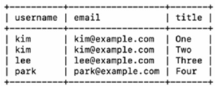

## 1.2 서브 쿼리(Subquery)
쿼리 쿼리에 포함된 또 다른 쿼리 → 외부 쿼리와 서브 쿼리로 구성
⇒ `내부에 있는 다른 SQL문이 포함되어 있는 SQL문`
- MySQL 공식 문서
  - 서브 쿼리: 다른 SQL문 안에 있는 SELECT문
  - 서브 쿼리를 소괄호()로 감싸 외부 쿼리와 구분 → SELECT문은 소괄호로 감싸진 서브 쿼리 형태
  - 다른 SELECT, INSERT, UPDATE, DELETE문 안에 포함 가능

### 외부 쿼리와 서브 쿼리가 별개의 SQL문이라고 보고, 서브 쿼리가 있는 위치에 서브 쿼리의 결과가 명시
#### SELECT문 안에 SELECT문이 포함된 서브 쿼리
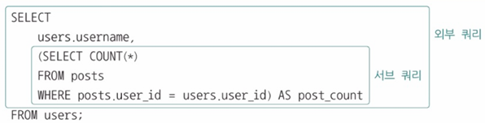
- 외부 쿼리에서 'users' 테이블의 'username'과 서브 쿼리 결과 조회
- 서브 쿼리의 결과를 'post_count'로 간주(AS post_count)
- 서브 쿼리는 'posts' 테이블의 'user_id', 'users'테이블의 'user_id'가 같은 'posts' 테이블의 레코드 수 조회
- 사용자별로 작성한 글의 개수 조회 <br>
    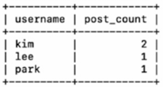

#### DELETE문 안에 SELECT문이 포함된 서브 쿼리
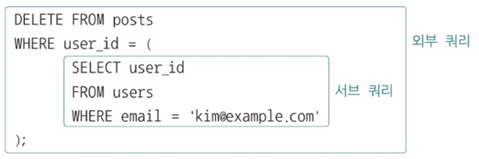
- 외부 쿼리는 'posts' 테이블의 'user_id'가 서브 쿼리의 결과와 같은 레코드 삭제
- 서브 쿼리는 'users' 테이블에서 'email'이 'kim@example.com'인 레코드 조회
- 'email'이 'kim@example.com'인 사용자의 글 삭제하는 SQL문

#### <정리> 서브 쿼리 특징
- 괄호() 안에 작성
- 주로 SELECT, FROM, WHERE 절에서 사용
- 단일 행/다중 행/다중 열 결과 반환 가능

## 1.3 조인(Join)
2개 이상의 테이블을 연결하여 데이터를 조회 → `여러 테이블을 하나로 합치기`
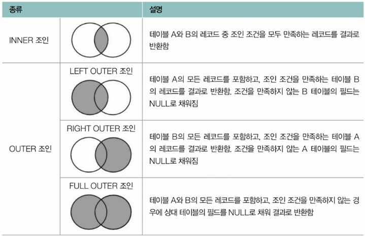

### INNER JOIN(내부 조인)
두 테이블에서 조인 조건을 만족하는 레코드만 반환 - 일종의 `교집합`
```sql
SELECT 필드
FROM 테이블1
    INNER JOIN 테이블2 ON 조인 조건;
```
- 'orders.customer_id'와 'customer.id' 기준으로 INNER 조인
- 'customers'의 'id' == 'orders'의 'customer_id' 인 레코드만 선택하고 결합해서 조회하는 SELECT문
- **INNER JOIN에서 INNER는 생략 가능**
```sql
-- INNER 조인
SELECT customers.name, customers.age, customers.email, orders.id, orders.product_id, orders.quantity, orders.amount
FROM customers
    INNER JOIN orders ON customers.id = orders.customer_id;
```
- 결과<br>
   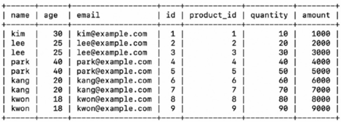

- WHERE절 추가 - 조건에 따라 레코트 필터링 해서 조회
```sql
-- 만족하는 데이터만 선택해 결합(WHERE절 추가)
SELECT customers.name, customers.age, customers.email, orders.id, orders.product_id, orders.quantity, orders.amount
FROM customers
INNER JOIN orders ON customers.id = orders.customer_id
    WHERE orders.amount >= 5000;
```
- 결과<br>
  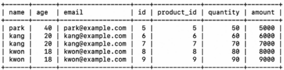

### OUTER JOIN(외부 조인)
조인 조건을 만족하지 않는 레코드도 결과에 포함

#### LEFT OUTER JOIN
: 왼쪽 테이블의 모든 레코드와 오른쪽 테이블에서 조건을 만족하는 레코드를 반환 → 조건을 만족하는 오른쪽 레코드가 없으면 NULL로 표시
- 테이블1의 모든 레코드를 기준으로 테이블2의 레코드를 합치되, 테이블2에 대응되는 레코드가 없다면 해당 값을 NULL로 간주
```sql
SELECT 필드
FROM 테이블1
    LEFT OUTER JOIN 테이블2 ON 조인 조건;
```
- 'customers' 테이블의 모든 항목 선택 후, 이를 기준으로 'orders' 테이블의 레코드를 합치되, 'customers' 테이블의 레코드 중 'orders' 테이블의 레코드에 대응되는 레코드가 없는 경우 NULL로 채워짐

```sql
SELECT customers.name, orders.id AS order_id, orders.product_id, orders.quantity, orders.amount
FROM customers
    LEFT OUTER JOIN orders ON customers.id = orders.customer_id;
```
- 결과<br>
  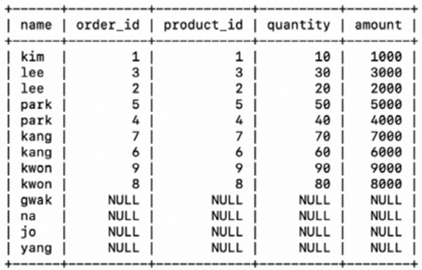

#### RIGHT OUTER JOIN
: 오른쪽 테이블의 모든 레코드와 왼쪽 테이블에서 조건을 만족하는 레코드를 반환
- LEFT OUTER JOIN과 반대
- 테이블2의 레코드 모두 선택, 이를 기준으로 테이블1로 합치되 대응되는 레코드가 없다면 NULL이 조인
```sql
SELECT 필드
FROM 테이블1
    RIGHT OUTER JOIN 테이블2 ON 조인 조건;
```
- 'orders' 테이블의 모든 항목 선택 후, 이를 기준으로 'customers' 테이블의 레코드를 합치되, 'orders' 테이블 레코드 중 'customers' 테이블의 레코드에 대응되는 레코드가 없는 경우 NULL로 채워짐
```sql
SELECT customers.name, orders.id AS order_id, orders.product_id, orders.quantity, orders.amount
FROM customers
    RIGHT OUTER JOIN orders ON customers.id = orders.customer_id;
``` 
- 결과<br>
  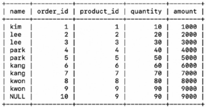


#### FULL OUTER JOIN(완전 외부 조인)
: 양쪽 테이블의 모든 레코드를 반환하며 조건을 만족하지 않는 경우 NULL로 표시
- 많은 RDBMS(MySQL 포함)에서 FULL OUTER JOIN 문법 따로X
- LEFT OUTER JOIN + RIGHT OUTER JOIN == FULL OUTER JOIN 구현 가능
- 이 과정에서 SQL문 결합하는 `UNION` 사용 → SQL문 실행 결과의 합집합
```sql
SELECT 필드
FROM 테이블1
    LEFT JOIN 테이블2 ON 조인 조건
    UNION
SELECT 필드
FROM 테이블1
    RIGHT JOIN 테이블2 ON 조인 조건;
```
- 'customers'테이블 LEFT OUTER JOIN & 'orders'테이블 RIGHT OUTER JOIN 후, 하나로 合
```sql
SELECT customers.name, orders.id AS order_id, orders.product_id, orders.quantity, orders.amount
FROM customers
    LEFT OUTER JOIN orders ON customers.id = orders.customer_id
    UNION
SELECT customers.name, orders.id AS order_id, orders.product_id, orders.quantity, orders.amount
FROM customers
    RIGHT OUTER JOIN orders ON customers.id = orders.customer_id;
```
- 결과
  - 조인의 결과: 'products' 테이블에 없는 'customers' 테이블의 레코드가 NULL로 채워짐, 'customers' 테이블에 없는 'products' 테이블의 레코드가 NULL로 채워짐
  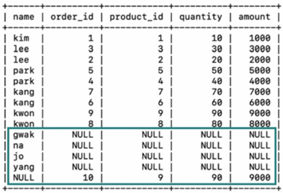

#### <추가> 일부 서브 쿼리 연산은 조인으로 대체 가능
- 원래 코드
```sql
SELECT
    users.username,
    (SELECT COUNT(*)
    FROM posts
    WHERE posts.user_id = users.user_id) AS post_count
    FROM users;
```
- JOIN으로 서브 쿼리 연산 대체
```sql
SELECT users.username, COUNT(posts.post_id) AS post_count
FROM users
    LEFT JOIN posts ON users.user_id = posts.user_id
    GROUP BY users.username;
```
- 결과<br>
  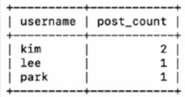


# 2. 뷰(View)
- SELECT문의 결과로 만들어진 가상의 테이블
- 하나 이상의 테이블에서 원하는 데이터를 선택하여 가상 테이블로 저장
- 중복되는 서브 쿼리를 단순화
- 뷰 생성 방법: `CREATE VIEW 뷰_이름 AS SELECT문;`
- 뷰 삭제: `DROP VIEW`
- 뷰 조회: `SHOW TABLES;` → 마치 하나의 논리적인 테이블처럼 활용 가능
```sql
-- 뷰 생성
CREATE VIEW myview AS
    SELECT users.username, users.email, posts.title
    FROM users, posts
    WHERE users.user_id = posts.user_id;

-- 뷰 조회
SELECT username, email, title
    FROM myview
    WHERE username = 'kim';
```

### <정리> 뷰의 장점
- 복잡한 쿼리를 단순화
- 재사용성 향상
- 데이터 보안 강화(접근 제한)
- 데이터 일관성 유지

### VIEW의 특징
- 특정 사용자에게 테이블의 특정 데이터만 보여주고자 할 때 사용 가능
- 테이블 상 모든 데이터를 모든 DB 사용자에게 노출X
- 노출 가능한 데이터만 포함하는 뷰를 만들어서 특정 사용자에게 해당 뷰에 대한 접근 권한 부여
  - GRANT: 특정 사용자에게 특정 테이블(뷰)에 대한 권한 부여 명령<br>
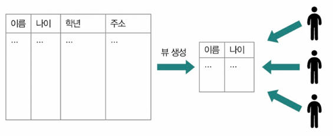

### VIEW 사용 시 유의점
- VIEW에 대한 조회(SELECT)에는 제한X
- 삽입(INSERT), 수정(UPDATE), 삭제(DELETE) 등은 제한 있을 수 있음
  - 여러 테이블을 SELECT한 결과로 만들어진 뷰
    - 삽입/수정/삭제 연산이 제약 조건 어기기 쉽기 때문에 불가능
    - 따라서 **뷰는 조회 목적으로 사용 多**


# 3. 인덱스(Index)
- 데이터베이스 검색 속도를 향상시키기 위한 자료구조
- 책의 '찾아보기'와 비슷
  - 단, 테이블에 2개의 인덱스가 있을 수 있고, 테이블(필드)에 종속된 개념이라 테이블이 삭제되면 테이블과 관련된 인덱스도 모두 삭제

## MySQL에서의 인덱스 종류
### 3.1 클러스터형 인덱스(Clustered Index)
- **테이블당 하나만** 생성 가능
- 물리적으로 데이터 행을 인덱스 키 값에 따라 정렬
- **기본 키(Primary Key)에 자동 생성**
  - 기본 키 지정된 필드 없는 경우?
    - NOT NULL 제약 조건, UNIQUE 제약 조건 있는 필드를 클러스터형 인덱스로 간주
    - 즉, NULL값이 될 수 없는 고유한 값 갖는 필드가 클러스터형 인덱스로 간주
- 데이터 검색 속도가 빠름

### 3.2 세컨더리 인덱스 = 논클러스터형 인덱스(Secondary Index/Non-Clustered Index)
- **테이블당 여러 개** 생성 가능
- 일반적으로 클러스터형 인덱스 검색 보다 느림
- 물리적 데이터 정렬 없이 별도의 인덱스 페이지 생성
- 자주 조회되는 컬럼에 생성
- MySQL에서 세컨더리 인덱스 생성, 조회, 삭제 예시
    ```sql
    -- '테이블_이름'의 '필드'에 세컨더리 인덱스인 '인덱스_이름' 생성
    CREATE INDEX 인덱스_이름 ON 테이블_이름(필드);

    -- 인덱스 조회
    SHOW INDEX FROM 테이블_이름;

    -- 인덱스 삭제
    DROP INDEX 인덱스_이름 FROM 테이블_이름;
    ```

## ➕ 인덱스로 사용되는 자료구조
대표적으로 해시 테이블, B트리

### 해시 테이블(Hash Table)
- 키-값 쌍으로 데이터 저장
- 정확한 일치 검색(=)에 최적화
- 범위 검색에는 비효율적
- 메모리 기반 데이터베이스에서 주로 사용

### B 트리(B-Tree)
- 균형 잡힌 트리 구조
- 범위 검색, 정렬에 최적화
- 대부분의 RDBMS에서 기본 인덱스 구조로 사용
- 각 노드에는 키로써 인덱스 값 포함, 인덱스 값 탐색하면 실제 데이터(레코드)의 저장된 위치 알 수 있음 ⇒ B트리(B+트리) 특성 상, 다량의 노드에 대한 빠른 검색 가능<br>
  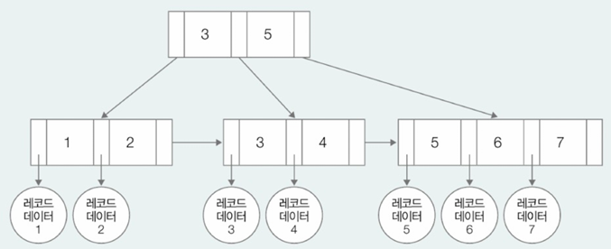
- 리프 노드가 연결 리스트로 구성되어 순차 접근 가능
- B+ 트리는 B 트리의 변형으로, 모든 키가 리프 노드에 저장되며 RDBMS에서 더 널리 사용

## 인덱스로 성능 얼마나 향상?
- `(세컨더리) 인덱스` 예제
    - 70만 개의 레코드 삽입된 테이블 가정, 현재 생성된 인덱스X<br>
        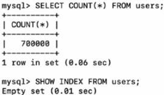
    - 테이블에 삽입되어 있는 레코드<br>
        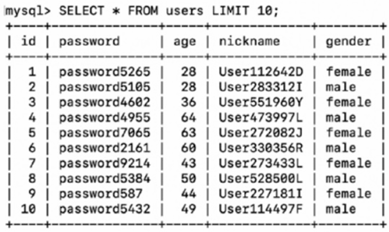
    - 인덱스 없는 상태에서 3개의 SELECT문 실행 및 소요 시간 측정
        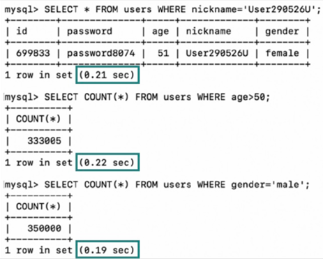
    - 인덱스 있는 상태 - 'nickname'에 인덱스 만들기
      - 인덱스 생성 : `CREATE INDEX idx_user ON users(nickname)`
        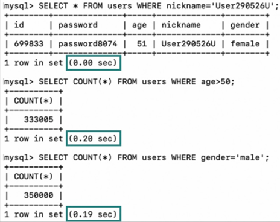

### 인덱스 사용 시 고려사항
- 인덱스가 많을수록 SELECT는 빨라지지만 INSERT, UPDATE, DELETE는 느려짐
  - 새로운 데이터 삽입하거나 기존 데이터 수정/삭제 시, 인덱스에 대한 작업도 동시에 이뤄져야 하니까
  - 인덱스 유지, 갱신하는 추가적인 자원과 연산 필요
- 데이터가 충분히 많지 않은 상황에서는 굳이 인덱스 삽입할 필요X
- 인덱스가 성능 높일 수 있는 조회(SELECT) 연산이 적거나, 삽입(INSERT)/수정(UPDATE)/삭제(DELETE) 연산 많을 때는 굳이 필요X
- **인덱스는 데이터가 충분히 많은 테이블, 조회가 빈번히 이뤄지는 테이블 필드에 만들어 활용!**
  - SELECT문 中 자주 조인되거나 WHERE, ORDER BY에서 자주 언급되는 필드가 인덱스로 활용하기 좋음
- 인덱스 개수 너무 많은 것 지양
  - 일반적으로 테이블당 3개 이하 권고
- 중복되는 데이터 많은 필드에 인덱스 생성하는 것은 인덱스의 효능↓
  - 중복되는 데이터 많으면 인덱스 사용 하든, 안 하든 수많은 레코드 탐색해봐야 하는 점은 달라지지 않음


---
# Question
## Q1. 서브쿼리와 조인의 차이를 설명하고, 서브쿼리를 조인으로 바꿔야 하는 경우는 언제인가요?
서브쿼리는 하나의 쿼리 안에 또 다른 SELECT문이 들어간 형태고 조인은 두 테이블을 조건에 따라 연결해서 조회하는 방식입니다.

서브쿼리는 보통 단일 값을 가져오거나, WHERE절 조건처럼 내부 계산용으로 많이 쓰는데 반복 실행될 수 있어서 성능이 떨어질 수 있습니다.

예를 들어 사용자별 글 개수를 구할 때, 서브쿼리로 하면 사용자 수만큼 서브쿼리가 실행되지만, 조인으로 바꾸면 한 번에 처리할 수 있어서 훨씬 효율적입니다. 그래서 같은 결과를 반복해서 계산할 필요가 있을 때는 조인으로 바꾸는 게 좋습니다.

## Q2. INNER JOIN과 OUTER JOIN의 차이점을 설명해 주세요. 그리고 OUTER JOIN이 필요한 예를 하나 들어 주세요.
INNER JOIN은 조건을 만족하는 데이터만 보여주고, OUTER JOIN은 한쪽 테이블의 모든 데이터를 유지하면서 나머지를 붙여주는 방식입니다.

예를 들어 고객 테이블과 주문 테이블이 있을 때, 모든 고객을 보여주되 주문이 있는 고객만 주문정보를 붙이고 싶다면 LEFT OUTER JOIN을 써야 합니다.

주문 안 한 고객도 결과에 포함되고 주문 정보는 없으면 NULL로 표시되기 때문에 주문 여부 통계나 빈값 확인이 필요한 경우에 유용합니다.

## Q3. 인덱스(Index)의 장단점을 설명하고 인덱스를 사용하지 않는 것이 나은 경우는 언제인가요?
인덱스는 검색 속도를 빠르게 해주는 구조로, 책의 찾아보기처럼 필요한 데이터 위치를 바로 찾게 해줍니다.

장점은 SELECT 성능 향상이고, 단점은 INSERT나 UPDATE, DELETE 시마다 인덱스도 같이 관리해야 하다 보니 쓰기 작업이 느려질 수 있다는 점입니다.

그리고 데이터가 별로 없거나 중복값이 많은 필드에 인덱스를 걸어도 효과가 거의 없습니다. 조회보다 쓰기가 많은 경우엔 오히려 성능이 나빠질 수 있어서 인덱스를 안 쓰는 게 나은 경우도 있습니다.
