- [Ch.6-5 데이터베이스 설계](#ch6-5-데이터베이스-설계)
- [1. ER 다이어그램 (ERD; Entity Relationship Diagram)](#1-er-다이어그램-erd-entity-relationship-diagram)
  - [ER 다이어그램 (ERD; ER Diagram)](#er-다이어그램-erd-er-diagram)
  - [표기법 종류](#표기법-종류)
    - [1️⃣ 피터 첸 표기법 (Peter Chen Diagram)](#1️⃣-피터-첸-표기법-peter-chen-diagram)
    - [2️⃣ IE 표기법 (Information Engineering Notation) = 새 발/까마귀 발 표기법(Crow Feet Notation)](#2️⃣-ie-표기법-information-engineering-notation--새-발까마귀-발-표기법crow-feet-notation)
    - [➕ 식별 관계 / 비식별 관계](#-식별-관계--비식별-관계)
- [2. 정규화 (Normalization)](#2-정규화-normalization)
    - [\<참고\> 정규화 목적](#참고-정규화-목적)
  - [2.1 제1 정규형 (1NF: First Normal Form)](#21-제1-정규형-1nf-first-normal-form)
  - [2.2 제2 정규형 (2NF: Second Normal Form)](#22-제2-정규형-2nf-second-normal-form)
  - [2.3 제3 정규형 (3NF: Third Normal Form)](#23-제3-정규형-3nf-third-normal-form)
  - [2.4 보이스/코드 정규형 (BCNF: Boyce–Codd Normal Form)](#24-보이스코드-정규형-bcnf-boycecodd-normal-form)
  - [\<정리\> 1NF ~ BCNF 테이블 정규화 과정](#정리-1nf--bcnf-테이블-정규화-과정)
  - [➕ 역정규화: 정규화가 무조건적인 미덕일까](#-역정규화-정규화가-무조건적인-미덕일까)
    - [정규화 거듭](#정규화-거듭)
    - [역정규화 (Denormalization)](#역정규화-denormalization)
- [Ch.6-6 NoSQL](#ch6-6-nosql)
- [1. RDBMS vs NoSQL: NoSQL의 특징](#1-rdbms-vs-nosql-nosql의-특징)
    - [NoSQL(Not Only SQL)](#nosqlnot-only-sql)
  - [NoSQL 데이터베이스 유형](#nosql-데이터베이스-유형)
    - [1.1 키-값 데이터베이스 (Key-Value Database)](#11-키-값-데이터베이스-key-value-database)
    - [1.2 도큐먼트 데이터베이스 (Document(-oriented) Database) == 문서지향 데이터베이스](#12-도큐먼트-데이터베이스-document-oriented-database--문서지향-데이터베이스)
    - [1.3 그래프 데이터베이스 (Graph Database)](#13-그래프-데이터베이스-graph-database)
    - [1.4 칼럼 패밀리 데이터베이스 (Column Family DB)](#14-칼럼-패밀리-데이터베이스-column-family-db)
    - [\<정리\> NoSQL](#정리-nosql)
- [2. 다양한 NoSQL: MongoDB와 Redis 맛보기](#2-다양한-nosql-mongodb와-redis-맛보기)
  - [2.1 MongoDB](#21-mongodb)
    - [MongoDB에서 데이터베이스와 컬렉션 생성, 조회, 삭제](#mongodb에서-데이터베이스와-컬렉션-생성-조회-삭제)
    - [MongoDB에 데이터 삽입](#mongodb에-데이터-삽입)
      - [1️⃣ 단일 레코드 삽입하는 방법](#1️⃣-단일-레코드-삽입하는-방법)
      - [특정 컬렉션의 도큐먼트 확인](#특정-컬렉션의-도큐먼트-확인)
      - [2️⃣ 여러 레코드를 삽입하는 방법](#2️⃣-여러-레코드를-삽입하는-방법)
    - [MongoDB에서 도큐먼트 갱신](#mongodb에서-도큐먼트-갱신)
      - [1️⃣ 단일 도큐먼트 갱신하는 방법](#1️⃣-단일-도큐먼트-갱신하는-방법)
      - [2️⃣ 여러 도큐먼트 갱신하는 방법](#2️⃣-여러-도큐먼트-갱신하는-방법)
    - [➕ MongoDB의 연산자](#-mongodb의-연산자)
  - [2.2 Redis](#22-redis)
    - [문자열 타입 값 다루는 대표적인 명령](#문자열-타입-값-다루는-대표적인-명령)
    - [리스트 타입 값 다루는 대표적인 명령](#리스트-타입-값-다루는-대표적인-명령)
- [➕ 데이터베이스 분할과 샤딩](#-데이터베이스-분할과-샤딩)
  - [데이터베이스 분할 (Database Partitioning)](#데이터베이스-분할-database-partitioning)
  - [수평 분할 (Horizontal Partitioning)](#수평-분할-horizontal-partitioning)
    - [언제 사용?](#언제-사용)
    - [분할 방식](#분할-방식)
      - [\<참고\> 해시 분할, 키 분할 차이](#참고-해시-분할-키-분할-차이)
  - [수직 분할 (Vertical Partitioning)](#수직-분할-vertical-partitioning)
    - [언제 사용?](#언제-사용-1)
- [Question](#question)
  - [Q1. ERD란 무엇이며, 왜 데이터베이스 설계에서 중요한가요?](#q1-erd란-무엇이며-왜-데이터베이스-설계에서-중요한가요)
  - [Q2. 제 1, 2, 3 정규화에 대해 설명하고 각 정규화 단계의 목적은 무엇인가요?](#q2-제-1-2-3-정규화에-대해-설명하고-각-정규화-단계의-목적은-무엇인가요)
  - [Q3. RDBMS와 NoSQL의 차이점은 무엇이며 각각 어떤 상황에서 사용하는 것이 적합한가요?](#q3-rdbms와-nosql의-차이점은-무엇이며-각각-어떤-상황에서-사용하는-것이-적합한가요)


# Ch.6-5 데이터베이스 설계

# 1. ER 다이어그램 (ERD; Entity Relationship Diagram)
- 엔티티 (Entity): 현실 세계의 객체나 개념을 데이터베이스에서 표현한 것  

## ER 다이어그램 (ERD; ER Diagram)
- 엔티티 간의 관계(엔티티 관계; ER; Entity Relationship)를 도식화한 다이어그램
- 데이터 구조와 관계를 시각적으로 표현
- 목적: DB에 저장되는 엔티티의 구조 모델링
  - DB 설계 초기 단계에서 시각적 모델링 표현 중요
  - ERD로 DB 구조 명확히 정의 → 추후 DB 확장/수정 시, 유지보수 용이, 개발자 간 원활한 소통
  - 효율적인 데이터 관리에 매우 중요한 과정
- ERD 그리는 도구: draw.io, ERWin, ERDCloud 등

## 표기법 종류
### 1️⃣ 피터 첸 표기법 (Peter Chen Diagram)
   - 전통적인 ERD 표기
   - 사각형(엔티티), 타원(속성), 마름모(관계) 사용
   - 장점: 엔티티 개념적으로 모델링 유용
   - 단점
     - 엔티티 많아지면 그림 복잡
     - RDBMS 상 어떻게 테이블 형태로 표현되는지 한 눈에 파악 어려움
   - 예시<br>
    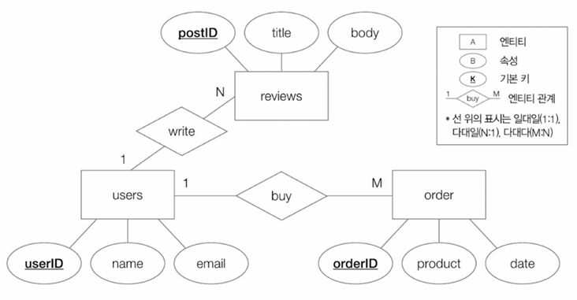

### 2️⃣ IE 표기법 (Information Engineering Notation) = 새 발/까마귀 발 표기법(Crow Feet Notation)
   - 오늘 날 RDBMS에서 사용
   - 관계의 수(1:1, 1:N, N:M)를 선 모양으로 표현
   - 예시<br>
    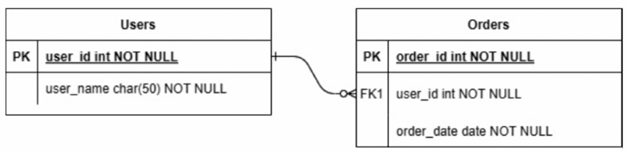
   - 표현
     - 사각형 하나 == 테이블 하나
     - 상단 사각형: 테이블 이름
     - 사각형 내부: 속성(필드) 이름, 필드 타입, 기본 키 표기(밑줄 or PK), 외래 키(FK)
     - **관계 표시**\
        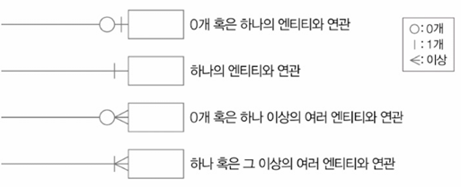

### ➕ 식별 관계 / 비식별 관계
1. 식별 관계 (Identifying Relationship)
   - 참조되는 엔티티가 존재해야만 참조하는 엔티티가 존재할 수 있는 관계
   - 자식 엔티티가 부모의 기본 키를 **기본 키로 포함**
   - 실선\
    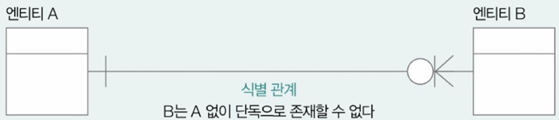
  
2. 비식별 관계 (Non-identifying Relationship)
   - 참조되는 엔티티가 존재하지 않아도 참조하는 엔티티가 존재할 수 있는 관계
   - 자식 엔티티가 부모의 기본 키를 **외래 키로만 참조**
   - 점선\
    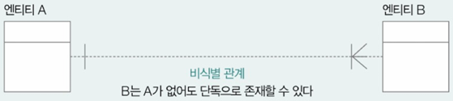


# 2. 정규화 (Normalization)
- 정규화
  - 하나의 테이블을 어떤 필드로 구성할지 결정하기 위한 작업
  - 잠재적인 문제가 발생하지 않도록 테이블의 필드 구성, 필요한 경우 테이블 나누는 작업
- 정규형(NF; Normal Form): 정규화된 테이블

### <참고> 정규화 목적
- 중복 데이터 제거
- 데이터 무결성 유지
- 이상 현상(삽입/삭제/갱신 이상) 방지

## 2.1 제1 정규형 (1NF: First Normal Form)

> **모든 속성이 원자값을 가진다**
> 필드 데이터가 더 이상 쪼개질 수 없는 값을 가져야 함

- 예시: '수강 과목' 필드의 데이터가 단일한 값이 아니라 더 많은 데이터로 쪼개질 수 있음
  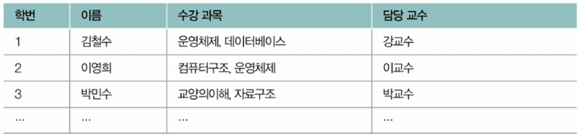
  - 제1 정규형 - A : 중복되는 레코드 감수하고 하나의 테이블로 설계
    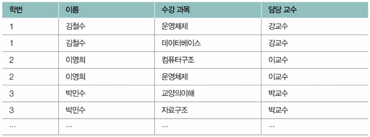
  - 제1 정규형 - B : 테이블 2개로 쪼갬
    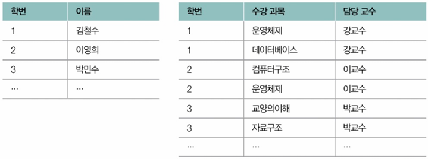


## 2.2 제2 정규형 (2NF: Second Normal Form)

> **1NF 만족 + 기본 키의 부분집합에 종속된 속성 제거**(기본 키가 아닌 모든 필드들이 모든 기본 키에 종속)
> → 기본 키에 완전 함수 종속이어야 함(필요충분조건)

- 부분 함수 종속성 (Partial Dependency): 기본 키가 아닌 필드가 기본 키의 일부에 종속
- 완전 함수 종속성 (Full Functional Dependency): 기본 키 전체에 완전하게 종속

➡️ **부분 함수 종속성X, 완전 함수 종속인 상태**

- 예시1: 기본 키 - '회원ID', '구매 항목'
  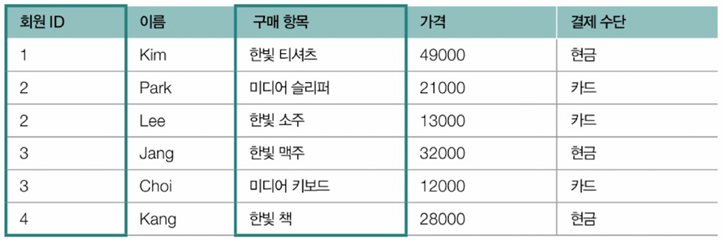
  - 기본 키 완전 종속? 기본 키 일부에만 종속된 필드 있나? `있다!`(제2 정규형 만족X)
    - '가격'은 '구매 항목'과 종속 관계, '회원 ID'와는 관계X
- 예시2: 기본 키 - '학번', '과목'\
  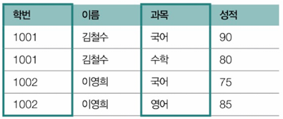
  - 제2 정규형 만족X - '이름'은 '학번'과 종속 관계, '과목'과는 관계X
  - 만족 위해서는 기본 키에 완전히 종속되는 필드로만 테이블 구성해야 → `테이블 분할`
    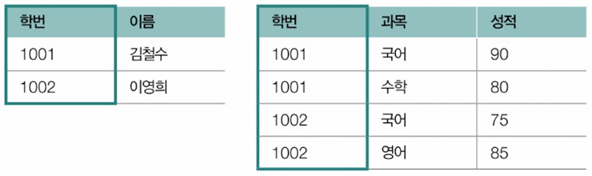


## 2.3 제3 정규형 (3NF: Third Normal Form)

> **2NF 만족 + 이행적 종속 제거**
>
> 기본 키가 아닌 모든 필드는 기본 키에 대해
> └── 부분 함수 종속성이 없고, 완전 함수 종속성이 있어야 함(2NF)
> └── **이행 함수 종속성**이 없어야 함(3NF)

- 이행적 종속 관계 (Transitive Dependency) == `함수의 종속성이 있다`
  ```
  A → B, B → C 이면 A → C
  ```

➡️ 기본 키가 아닌 나머지 모든 필드들이 간접적으로라도 종속되어서는 안 됨<br>
    기본 키가 아닌 나머지 모든 필드는 서로를 유추하거나 결정할 수 없어야 함

- 예시: 기본 키 - '학번'\
  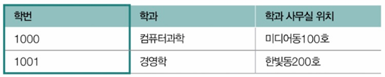
  - 한 학생 당 하나의 학과에 속해 있고 학과당 학과 사무실의 위치가 하나뿐?
    - '학번' → '학과', '학과' → '학과 사무실 위치' ⇒ '학번'과 '학과 사무실 위치'는 이행적 종속 관계
    - **3NF 만족 위해 이행적 종속 관계 없애야** → 테이블 쪼개기('학번'+'학과' 테이블 // '학과'+'학과 사무실 위치')
    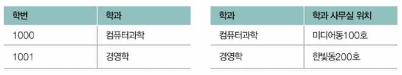


## 2.4 보이스/코드 정규형 (BCNF: Boyce–Codd Normal Form)

> **3NF 만족 + 모든 결정자가 후보 키여야 함**

- 결정자: 특정 필드를 식별할 수 있는 필드
  - 필드 A가 필드 B 결정(B가 A에 종속적인 경우) → 'A는 B의 결정자이다'
- 예시: 한 교수가 한 과목 담당, '학번','과목 코드' 필드의 조합으로 고유하게 식별
  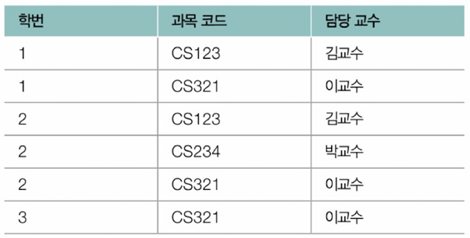
  - 3NF 만족(이행적 종속 관계 필드X)
  - BCNF 만족X - '담당 교수' 필드는 키X, '과목 코드'의 결정자 역할 → '학번'+'과목 코드' 필드 테이블 // '과목 코드'+'담당 교수' 필드 테이블

## <정리> 1NF ~ BCNF 테이블 정규화 과정
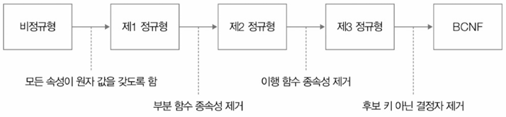


## ➕ 역정규화: 정규화가 무조건적인 미덕일까
### 정규화 거듭
  - 테이블 쪼개지는 경향
  - 테이블 많아지면 조인 연산↑, 다른 테이블 참조하기 위한 성능상 비용↑
  - 정규화 단계 거듭할수록 데이터는 깔끔하게 정돈, DB 작업 시 이상 현상↓ **BUT 오히려 성능 저해**

### 역정규화 (Denormalization)
- 성능 향상을 위해 정규화된 테이블을 다시 병합하는 과정
- 중복 데이터를 일부 허용(어느 정도 데이터 중복, 삭입/수정/삭제 연산의 번거로움 감수)
- 성능상 이점을 최대한 활용하기 위해 가급적 하나의 테이블로 데이터 관리
- NoSQL에서는 기본적으로 정규화X, 검색 속도 높이기 위해 역정규화

---

# Ch.6-6 NoSQL

# 1. RDBMS vs NoSQL: NoSQL의 특징

### NoSQL(Not Only SQL)
- cf: RDBMS - 테이블 형태로 레코드 저장, SQL로 다룸
- NoSQL은 다양한 형태로 저장, SQL 외의 방법으로 저장된 데이터 다룰 수 있음
- 특징
  - 스키마 없음(Schema-less)
  - 수평적 확장 
  - 비정형/반정형 데이터 처리에 적합
  - 다양한 데이터 모델 지원

## NoSQL 데이터베이스 유형

### 1.1 키-값 데이터베이스 (Key-Value Database)
- DB에 레코드를 키(필드)와 값의 쌍으로 저장하는 DB
- 가장 간단한 형태의 NoSQL DB 유형
- 예: Redis, Memcached 등
- 특징
  - 인 메모리 데이터베이스(In-memory Database): 레코드를 메모리에 저장(보조기억장치X)
  - 비교적 가벼운 정보(예: 캐시, 세션 등) 저장
  - 단독 사용 보다는 다른 주요 DB의 보조 DB로 사용 多
  - 단순한 구조
  - 빠른 조회 속도

### 1.2 도큐먼트 데이터베이스 (Document(-oriented) Database) == 문서지향 데이터베이스
- 레코드를 도큐먼트 단위로 저장하고 관리하는 DB
  - 도큐먼트(Document): 정형화되어 있지 않은 NoSQL 레코드의 단위
- 예: MongoDB
  - JSON 또는 BSON(Binary JSON) 기반의 문서 단위 저장
  - JSON 데이터 하나 하나가 RDBMS의 행
  - RDBMS와 달리 고정된 스키마X → 각 도큐먼트가 유연한 스키마 가질 수 있음
    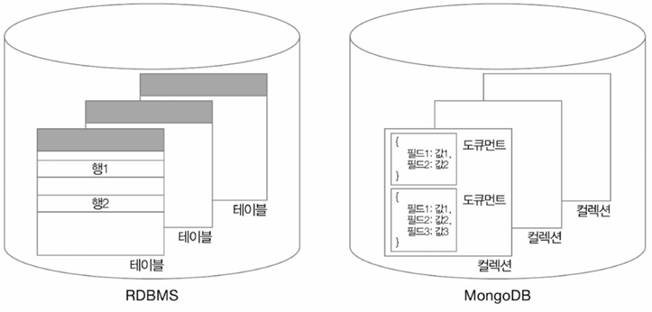
  - 구조: `Document → Collection → Database`

### 1.3 그래프 데이터베이스 (Graph Database)
- 저장하려는 데이터를 그래프의 노드 형태로 저장하는 DB
- 예: Neo4j
- 방향 그래프 표현하기 위해 활용 - 노드(Node), 간선(Edge) 구조
- 주로 관계 중심 레코드 저장 → 예시: SNS 친구 관계, 교통망

### 1.4 칼럼 패밀리 데이터베이스 (Column Family DB)
- 예: Cassandra, HBase 등
- RDBMS처럼 행(row), 열(column) 사용
- 로우 키(Row Key): 특정 행 식별
- 대용량 분산 처리에 적합
- RDBMS와 다른 점
  - 정규화나 조인 사용X
  - 스키마 고정X → 자유롭게 열 추가 가능
  - 행과 열의 집합이 반드시 엄격한 테이블 형태X(동적 가능) → `모든 Row가 꼭 같은 Column들을 가져야 할 필요가 없다`
    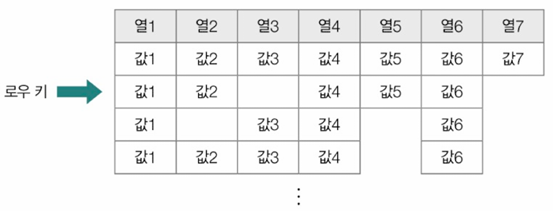
  - 칼럼 패밀리(Column Family): 관련 있는 열들의 모여 형성된 단위
    └── 칼럼 패밀리는 키스페이스(Keyspace) 단위 형성
    - 키스페이스: 여러 칼럼 패밀리 포괄하는 칼럼 패밀리 데이터의 최상위 단위
      - 일반적으로 애플리케이션마다 키스페이스 하나씩 사용
- 구성: `Row(Key + Columns) → Column Family → Keyspace`

### <정리> NoSQL
- **높은 부하를 감당하거나 대용량 데이터 다루는 분산 환경에 적합**
- WHY? 확장성, 유연성, 가용성, 성능
- 용이한 스케일 아웃(수평적 확장)
- 성능 향상 위해 ACID, 정규화 엄격히 준수X (옵션으로 ACID 트랜잭션 지원)<br>
  → RDBMS 보다 데이터 무결성, 일관성 다소 저하<br>
  → RDBMS 보다 큰 성능 향상
- `주어진 상황, 장단점 따라` RDBMS, NoSQL 선택!
  - ACID 엄격한 준수, 데이터 무결성, 일관성 유지 중요, 스키마 비교적 고정, 확장성 크게 염두X → RDBMS 선택
  - 가용성 중점, 비정형화된 형태 다뤄야 함 → NoSQL 선택

| 구분           | RDBMS (관계형 데이터베이스)                     | NoSQL (비관계형 데이터베이스)                       |
|----------------|--------------------------------------------------|-----------------------------------------------------|
| 데이터 구조    | 고정된 스키마 (정형 데이터)                     | 유연한 스키마 (비정형, 반정형 데이터)              |
| 데이터 관계    | 테이블 간 관계가 복잡하고 중요한 경우 (JOIN 사용) | 관계보다 개별 엔터티 중심 저장                     |
| 트랜잭션       | ACID 보장 | 일반적으로 eventual consistency(최종 일관성), 일부만 ACID 지원 |
| 확장성         | 수직 확장 (서버 성능 업그레이드 중심)           | 수평 확장 (서버를 여러 대로 분산)                  |
| 데이터 크기    | 기가~테라바이트 수준에 최적                     | 테라~페타바이트, 초대용량 데이터 분산처리에 유리   |
| 성능 특징      | 쓰기보다 읽기 위주의 정형 데이터 처리에 강점     | 쓰기와 읽기 모두 고속 처리, 비정형/빅데이터에 최적화 |

<참고>
- ACID의 일관성(Consistency): 트랜잭션이 끝나는 순간, 모든 데이터는 일관성 있는 상태여야 함
- Eventual Consistency: 트랜잭션 직후에는 일관성이 없어도 되지만, 언젠가는 일관된 상태로 수렴

# 2. 다양한 NoSQL: MongoDB와 Redis 맛보기

## 2.1 MongoDB
- 도큐먼트 단위로 JSON 문서 저장
- 레코드 → 컬렉션 → 데이터베이스
- 스키마 유연, 복잡한 쿼리 가능
- 예시 구조:
  ```json
  {
    "_id": "12345",
    "name": "홍길동",
    "age": 30
  }
  ```
### MongoDB에서 데이터베이스와 컬렉션 생성, 조회, 삭제
- 생성
    ```javascript
    use my_database                       // 데이터베이스 생성/사용

    db.createCollection("컬렉션_이름");     // 컬렉션 생성
    ```
- 조회
    ```javascript
    show dbs

    show collections
    ```
- 삭제
  ```javascript
  db.dropDatabase()

  db.컬렉션_이름.drop()
  ```

### MongoDB에 데이터 삽입
#### 1️⃣ 단일 레코드 삽입하는 방법
`db.컬렉션_이름.insertOne()` - 소괄호() 안에 삽입하려는 도큐먼트(레코드)를 JSON 형태로 명시<br>
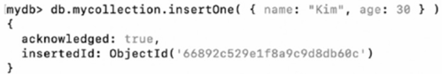
- **ObjectId**: 도큐먼트마다 부여되는 고유한 값, 특정 도큐먼트 식별할 수 있는 정보<br>
  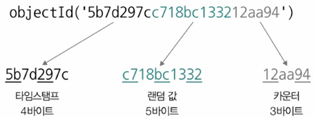
- JSON 형태의 도큐먼트는 변수 형태로 사용 가능
  - 예시: 도큐먼트를 'mydoc'에 저장해서 활용
    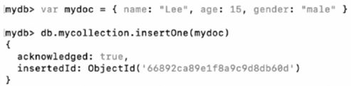

#### 특정 컬렉션의 도큐먼트 확인
`db.컬렉션_이름.find()`\
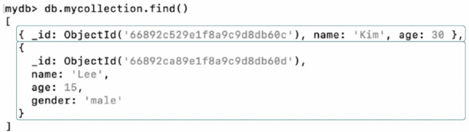
- 인자로 도큐먼트의 필드(JSON의 키)의 값을 하나 이상 명시하면 원하는 도큐먼트만 필터링해서 조회 가능
- 예시: 'name'='Kim'인 도큐먼트 조회
  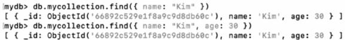

#### 2️⃣ 여러 레코드를 삽입하는 방법
`db.컬렉션_이름.insertMany()` - 소괄호() 안에 삽입할 여러 도큐먼트를 리스트 형태로 명시, 리스트는 대괄호[]로 표시
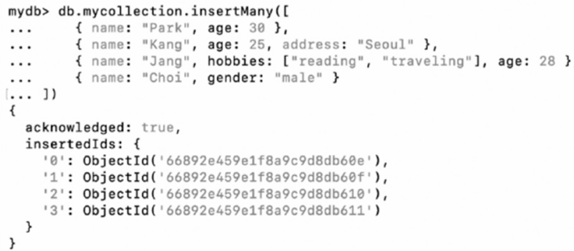

### MongoDB에서 도큐먼트 갱신
#### 1️⃣ 단일 도큐먼트 갱신하는 방법
`db.컬렉션_이름.updateOne()`
- 첫 번째 인자: 갱신할 도큐먼트 식별하는 필터
- 두 번째 인자: 갱신할 내용
  - 갱신할 내용 명시할 때는 MongoDB의 연산자 명시
  - 주로 `$set` 연산자 사용: `$set: { 변경할_필드: 변경할_내용, ... }`
- 예시: 'name'='Kang'인 도큐먼트의 'age'를 '30'으로 변경
  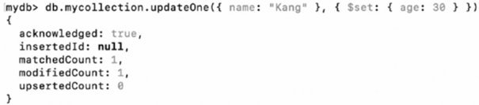

#### 2️⃣ 여러 도큐먼트 갱신하는 방법
`db.컬렉션_이름.updateMany()`
- 방법은 updateOne과 유사
- 예시: 'age'가 '20' 이상인 모든 도큐먼트(age: { $gte: 20 })의 'status'필드를 'active'로 갱신
  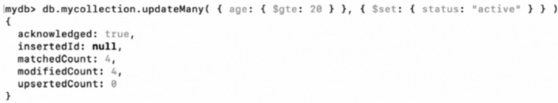
  - 갱신 결과 - 'status'필드 없으면 새로 생성, 모든 레코드의 'status'필드가 'active'로 변경
    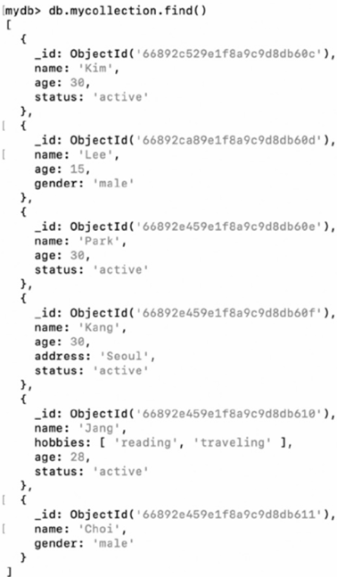
- **특정 필드 없앨 때**: `$unset` 연산자 사용
  - 예시: 'age'가 '10'이상인 도큐먼트의 'status'필드 없애기
    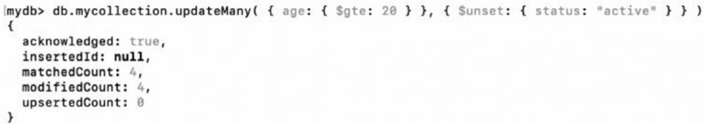
- 도큐먼트 삭제
  - 단일 도큐먼트 삭제: `db.컬렉션_이름.deleteOne()`
  - 여러 도큐먼트 삭제: `db.컬렉션_이름.deleteMany()`
  - 첫번째 인자를 통해 삭제하려는 도큐먼트의 필드를 필터로 지정, 연산자 사용
  - 예시: 'name'필드가 'Lee'인 도큐먼트 삭제, 'age'필드가 '20' 이상인 도큐먼트 삭제
    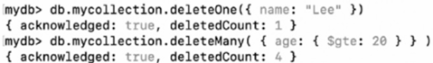


### ➕ MongoDB의 연산자

1. 비교 연산자 (Comparison Operators)

| 연산자 | 의미 | 예시 |
|--------|------|------|
| `$eq` | 같음 (equal) | `{ age: { $eq: 25 } }` |
| `$ne` | 같지 않음 (not equal) | `{ name: { $ne: "홍길동" } }` |
| `$gt` | 크다 (greater than) | `{ age: { $gt: 30 } }` |
| `$gte` | 크거나 같다 (greater than or equal) | `{ age: { $gte: 30 } }` |
| `$lt` | 작다 (less than) | `{ age: { $lt: 20 } }` |
| `$lte` | 작거나 같다 (less than or equal) | `{ age: { $lte: 20 } }` |
| `$in` | 값 목록 중 하나와 일치 | `{ city: { $in: ["서울", "부산"] } }` |
| `$nin` | 목록에 없는 값 | `{ status: { $nin: ["휴가", "퇴사"] } }` |

2. 논리 연산자 (Logical Operators)

| 연산자 | 의미 | 예시 |
|--------|------|------|
| `$and` | 모두 참일 때 | `{ $and: [ { age: { $gte: 20 } }, { age: { $lt: 30 } } ] }` |
| `$or` | 둘 중 하나 이상 참이면 | `{ $or: [ { name: "홍길동" }, { name: "김철수" } ] }` |
| `$not` | 조건 부정 | `{ age: { $not: { $gt: 30 } } }` |
| `$nor` | 모두 거짓일 때 | `{ $nor: [ { age: 30 }, { name: "김철수" } ] }` |

3. 요소 연산자 (Element Operators)

| 연산자 | 의미 | 예시 |
|--------|------|------|
| `$exists` | 해당 필드가 존재하는지 확인 | `{ email: { $exists: true } }` |
| `$type` | 데이터 타입 검사 | `{ age: { $type: "int" } }` |

4. 평가 연산자 (Evaluation Operators)

| 연산자 | 의미 | 예시 |
|--------|------|------|
| `$expr` | 표현식 비교 | `{ $expr: { $gt: ["$age", "$experience"] } }` |
| `$regex` | 정규표현식 검색 | `{ name: { $regex: "^김" } }` |
| `$mod` | 나머지 연산 | `{ age: { $mod: [5, 0] } }` → 5의 배수 |

5. 배열 연산자 (Array Operators)

| 연산자 | 의미 | 예시 |
|--------|------|------|
| `$all` | 배열이 특정 값 모두 포함 | `{ tags: { $all: ["mongodb", "nosql"] } }` |
| `$elemMatch` | 배열 요소 중 조건 만족하는 게 하나라도 있어야 함 | `{ scores: { $elemMatch: { $gt: 80, $lt: 90 } } }` |
| `$size` | 배열 길이 조건 | `{ tags: { $size: 3 } }` |

6. 업데이트 연산자 (Update Operators)

| 연산자 | 의미 | 예시 |
|--------|------|------|
| `$set` | 값 설정 | `{ $set: { age: 28 } }` |
| `$unset` | 필드 제거 | `{ $unset: { email: "" } }` |
| `$inc` | 숫자 증가 | `{ $inc: { age: 1 } }` |
| `$mul` | 숫자 곱셈 | `{ $mul: { price: 1.1 } }` |
| `$rename` | 필드 이름 변경 | `{ $rename: { "nickname": "alias" } }` |
| `$push` | 배열에 값 추가 | `{ $push: { tags: "new" } }` |
| `$addToSet` | 배열에 값 추가 (중복 제거) | `{ $addToSet: { tags: "unique" } }` |
| `$pull` | 배열에서 값 제거 | `{ $pull: { tags: "outdated" } }` |

7. 집계 연산자 (Aggregation Operators)

| 연산자 | 의미 | 예시 |
|--------|------|------|
| `$sum` | 합계 | `{ $group: { _id: "$dept", total: { $sum: "$salary" } } }` |
| `$avg` | 평균 | `{ $group: { _id: "$dept", avg: { $avg: "$score" } } }` |
| `$min`, `$max` | 최소/최대 | `{ $group: { _id: null, minAge: { $min: "$age" } } }` |
| `$count` | 문서 개수 | `{ $count: "total_docs" }` |


## 2.2 Redis
- 인메모리 기반 키-값 데이터베이스
- 저장되는 레코드를 키-값 대응 쌍으로 관리
- 빠른 속도, 캐시 용도로 많이 사용
- '값'의 자료구조: String, List, Set, Hash Table 등
  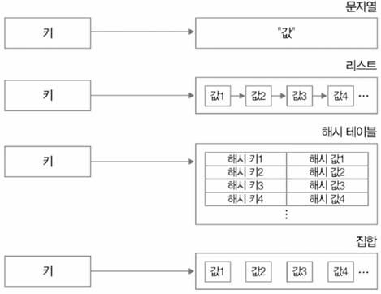

### 문자열 타입 값 다루는 대표적인 명령

| 종류   | 설명                                    |
|--------|-----------------------------------------|
| SET    | 문자열 값 저장                          |
| SETNX(SET if Not eXists)  | 키가 존재하지 않는 경우에만 문자열 값 저장 |
| GET    | 문자열 값 조회(키를 통해 대응되는 값 조회) |
| MGET   | 여러 문자열 값 조회                     |
| DEL    | 키 삭제 → 잘 삭제되면 (nil)       |

### 리스트 타입 값 다루는 대표적인 명령

| 종류    | 설명                                      |
|---------|-------------------------------------------|
| LPUSH   | 리스트의 왼쪽(앞)에 새로운 요소 추가       |
| RPUSH   | 리스트의 오른쪽(뒤)에 새로운 요소 추가     |
| LPOP    | 리스트의 왼쪽(앞)에서 요소를 제거 후 반환  |
| RPOP    | 리스트의 오른쪽(뒤)에서 요소를 제거 후 반환|
| LRANGE  | 지정된 범위의 요소들을 반환                |
| LLEN    | 리스트 길이 반환                           |

---

# ➕ 데이터베이스 분할과 샤딩

## 데이터베이스 분할 (Database Partitioning)
- 대용량 데이터를 나눠서 저장/관리
- 파티션: 분할되어 저장되는 단위
- 테이블 내 수 많은 레코드가 효율적으로 저장되어야 하는 경우 or DB에 대한 부하의 분산 고려해야 하는 경우 유용하게 사용\
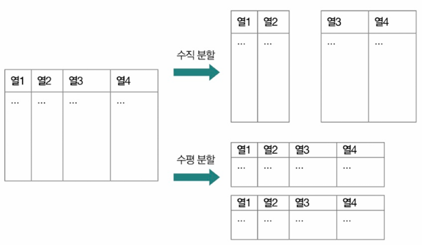

## 수평 분할 (Horizontal Partitioning)
테이블의 행(row)을 기준으로 테이블 나누어 저장
### 언제 사용?
- 데이터 양이 많고 행이 많을 때
- 특정 범위의 데이터를 자주 조회할 때
- 데이터를 나눠서 서버에 분산 저장하거나 샤딩하려고 할 때

### 분할 방식

1. 범위 분할 (Range Partitioning): 특정 값의 범위로 나눔 (예: ID 1~1000)\
  예시: 회원들의 가입 연도를 범위로 정의, 그 범위에 따라 테이블 분할\
  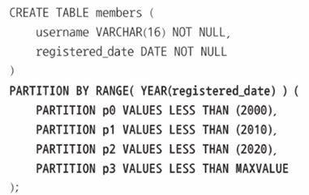

2. 목록 분할 (List Partitioning): 명시적 목록(리스트) 기준 분할 (예: 지역명, 카테고리 등)\
  예시: 고객 주소 데이터 따라 분할\
  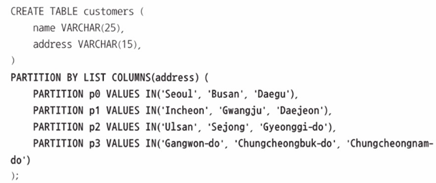

3. 해시 분할 (Hash Partitioning): 해시 함수로 균등 분배\
  예시: 학생들의 전공 과목 데이터 따라 분할('major_id'열 기준으로 파티션 4개로 분할)\
  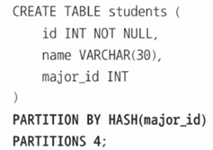

4. 키 분할 (Key-based Sharding): 키를 기준으로 별도의 테이블로 분할 → 파티션별 레코드가 키를 기준으로 균등하게 분배\
  예시: 기본키 'id'를 기준으로 파티셔닝\
  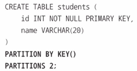

- 분할된 테이블 조회: 특정 레코드가 속한 파티션의 식별은 `파티셔닝 키(Partitioning Key)`라는 키를 통해 이뤄짐 → 파티셔닝 키는 테이블 열 기준으로 만들어짐

- **샤딩 (Sharding)**: 데이터를 여러 서버(샤드)에 분산 저장하는 기술  
  - 샤드 (Shard): 분산된 각 데이터 저장 단위

#### <참고> 해시 분할, 키 분할 차이
**해시 방식**이 **고정된 알고리즘 기반**, **키 분할**은 **애플리케이션 차원에서 유연하게 키를 설계해서 분할**(특정 샤딩 키)

## 수직 분할 (Vertical Partitioning)
- 테이블의 속성(열(column))을 나누어 별도 테이블로 분할  
  예: 자주 조회되는 컬럼만 모은 테이블 구성
- 장점: 자주 쓰는 데이터만 메모리에 적재 가능, 캐시 효율 향상
- 단점: 다시 합쳐야 할 때 조인 비용 발생 가능

### 언제 사용?
- 테이블의 칼럼(Column) 수가 많고 어떤 칼럼만 자주 조회될 때
- 보안, 성능, 관리 목적상 자주 쓰는 칼럼과 덜 쓰는 칼럼을 분리하고 싶을 때

---
# Question

## Q1. ERD란 무엇이며, 왜 데이터베이스 설계에서 중요한가요?

ERD는 엔티티 간의 관계를 시각적으로 나타낸 다이어그램입니다. 
데이터베이스에 저장되는 엔티티의 구조를 모델링하는 데 사용되며 데이터 구조와 관계를 명확하게 정의하여 데이터베이스의 확장, 수정, 유지 보수를 용이하게 합니다. 
그리고 개발자 간의 원활한 소통을 돕고 효율적인 데이터 관리를 가능하게 합니다.

## Q2. 제 1, 2, 3 정규화에 대해 설명하고 각 정규화 단계의 목적은 무엇인가요?

정규화는 테이블을 어떤 필드로 구성할지 결정하고 잠재적인 문제 발생을 방지하기 위해 테이블을 나누는 작업입니다.

- 제1 정규화 (1NF): 모든 속성이 원자값을 가지도록 합니다.
- 제2 정규화 (2NF): 1NF를 만족하고 기본 키의 부분집합에 종속된 속성을 제거합니다. 즉, 기본 키에 완전 함수 종속이어야 합니다.
- 제3 정규화 (3NF): 2NF를 만족하고 이행적 종속성을 제거합니다. 즉, 기본 키가 아닌 모든 필드는 기본 키에 직접적으로 종속되어야 합니다.

각 정규화 단계의 목적은 데이터 중복을 제거하고 데이터 무결성을 유지하며 이상 현상(삽입/삭제/갱신 이상)을 방지하는 것입니다.

## Q3. RDBMS와 NoSQL의 차이점은 무엇이며 각각 어떤 상황에서 사용하는 것이 적합한가요?

RDBMS는 테이블 형태로 데이터를 저장하고 SQL을 사용하여 데이터를 다루는 관계형 데이터베이스입니다. ACID 트랜잭션을 보장하며 데이터 무결성과 일관성이 중요한 상황에서 사용하기에 적합합니다. 

NoSQL은 다양한 형태로 데이터를 저장하고 SQL 외의 방법으로 데이터를 다루는 비관계형 데이터베이스입니다. 스키마가 유연하고 수평적 확장이 용이하며 대용량 데이터를 분산 처리하는 데 적합합니다.