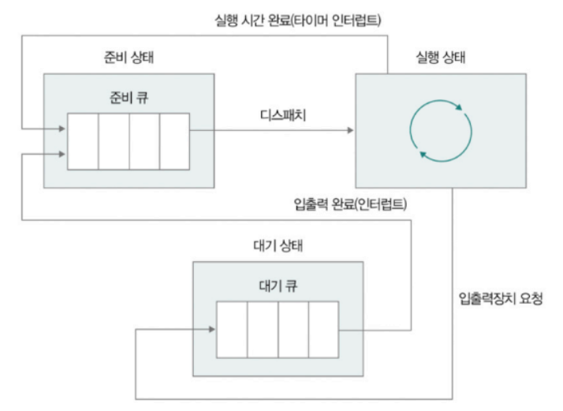
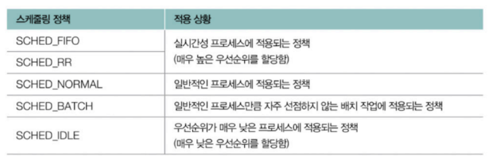

# Chapter 03-4. CPU 스케줄링
- [Chapter 03-4. CPU 스케줄링](#chapter-03-4-cpu-스케줄링)
  - [CPU 스케줄링이란](#cpu-스케줄링이란)
  - [스케줄링 큐](#스케줄링-큐)
  - [선점형 스케줄링-비선점형 스케줄링](#선점형-스케줄링-비선점형-스케줄링)
  - [CPU 스케줄링 알고리즘](#cpu-스케줄링-알고리즘)
  - [리눅스 CPU 스케줄링](#리눅스-cpu-스케줄링)

## CPU 스케줄링이란
- `CPU 스케줄링` : 실행 문맥을 가지고 있는 모든 대상에 운영체제가 공정하고 합리적인 방법으로 CPU를 배분하는 방법
  - 프로세스별 우선 순위 판단 → PCB에 명시 → 우선순위가 높은 프로세스에 CPU 더 빨리, 더 많이 할당
  - 우선 순위를 판단하는 방법 : CPU 활용률
    - 전체 CPU 가동 시간 중 작업을 처리하는 시간의 비율
      - 대부분 프로세스는 CPU와 입출력 장치를 모두 사용 → 실행과 대기 오감
      - 프로세스 마다 각각 이용 시간 다름
        - 입출력 버스트 : 입출력 장치 기다리는 작업 = 대기 상태
        - CPU 버스트 : CPU 이용하는 작업 = 실행 상태
        - 입출력 집중 프로세스 : 입출력 작업 더 많은 프로세스(실행 상태 < 대기 상태)
        - CPU 집중 프로세스 : CPU 작업 더 많은 프로세스(대기 상태 < 실행 상태)
      - 입출력 집중 프로세스를 가능한 빨리 실행시켜 대기 시간에 CPU 집중 프로스세가 CPU 쓰도록 해야 함

## 스케줄링 큐
- CPU를 비롯한 자원을 이용하려면 프로세스는 줄을 서서 기다려야 함
  - CPU 쓰고 싶은 프로세스의 PCB
  - 메모리로 적재되고 싶은 프로세스의 PCB
  - 특정 입출력장치를 이용하고 싶은 프로세스의 PCB
- 운영체제가 관리하는 줄(큐) => 스케줄링 큐
  - 자료구조 관점과는 달리 반드시 선입선출일 필요 없음
  - 준비 큐 : CPU를 이용하고 싶은 프로세스의 PCB가 서는 줄
  - 대기 큐 : 대기 상태에 접어드는 PCB가 서는 줄
    

## 선점형 스케줄링-비선점형 스케줄링
- 일반적으로 프로세스의 실행이 끝나면 스케줄링이 일어남
- 실행 도중 스케줄링이 이루어지는 경우
  - 실행 상태 → 대기 상태(입출력 작업 위해) ⇒ 비선점형 스케줄링
  - 실행 상태 → 준비 상태(타이머 인터럽트 발생해)
    - 두 상황 모두 수행되는 유형 ⇒ 선점형 스케줄링
- **선점형 스케줄링**
  - 운영체제가 프로세스로부터 CPU자원을 **강제로 빼앗아** 다른 프로세스에 할당할 수 있는 스케줄링 방식
  - 한 프로세스의 CPU 독점을 막고 여러 프로세스에 골고루 자원 배분 가능
  - 문맥 교환에서 오버 헤드 발생 가능
- **비선점형 스케줄링**
  - 어떤 프로세스가 CPU를 사용하고 있을 때 그 프로세스가 종료되거나 스스로 대기 상태에 접어들기 전까지 **다른 프로세스가 끼어들 수 없는** 스케줄링 방식
  - 상대적으로 문맥 교환 횟수가 적어 오버헤드 발생 적음
  - 당장 CPU를 사용해야 하는 프로세스라도 무작정 기다려야 함

## CPU 스케줄링 알고리즘
- **선입 선처리 스케줄링**
  - 준비 큐에 삽입된 순서대로 CPU 할당
  - `호위 효과` : 먼저 삽입된 프로세스의 오랜 실행 시간으로 인해 나중에 삽입된 프로세스의 실행이 지연되는 문제
- **최단 작업 우선 스케줄링**
  - 준비 큐에 삽입된 프로세스 중 CPU 이용 시간 길이가 가장 짧은 프로세스부터 실행
  - 비선점형 스케줄링으로 분류되나 선점형으로 구현될 수도 있음
- **라운드 로빈 스케줄링**
  - 선입 선처리 + 타임 슬라이스
    - 타임 슬라이스 : 프로세스가 CPU를 사용하도록 정해진 시간
  - 준비 큐에 삽입된 순서대로 CPU를 이용하되, 정해진 시간 만큼만 사용
  - 시간 내에 작업을 완료하지 못하면 문맥 교환 발생 → 준비 큐의 맨 뒤에 삽입
- **최소 잔여 시간 우선 스케줄링**
  - 최단 작업 우선 스케줄링 + 라운드 로빈 스케줄링
  - 정해진 타임 슬라이스만큼 CPU를 이용하되, 남아 있는 작업 시간이 가장 적은 프로세스를 다음 프로세스로 선택
- **우선순위 스케줄링**
  - 프로세스에 우선순위를 부여해 가장 높은 우선순위대로 프로세스 실행
  - `아사 현상(기아 현상)` : 준비 큐에 먼저 삽입되었더라도 우선순위가 낮을 경우 계속 실행이 연기되는 상황
  - `에이징` : 오랫동안 대기한 프로세스의 우선순위 점차 높이는 방식
- **다단계 큐 스케줄링**
  - 우선순위 스케줄링의 발전된 형태
  - 우선순위 별 여러 개의 준비 큐 사용 → 우선순위가 가장 높은 큐에 있는 프로세스 먼저 처리
  - 프로세스가 큐 간 이동 불가해 우선순위 낮은 프로세스의 작업이 계속 연기될 수 있음
- **다단계 피드백 큐 스케줄링**
  - 다단계 큐 스케줄링 + 프로세스가 큐 간 이동 가능
  - 새롭게 진입할 경우 가장 높은 우선순위 큐에 삽입 → 타입 슬라이스 동안 실행
    - 작업이 끝나지 않으면 다음 우선순위 큐에 삽입되어 실행
    - CPU를 오래 사용해야 할 수록 프로세스의 우선순위 점차 낮아짐
    - 입출력 집중 프로세스는 우선순위 높은 큐에서 끝남(CPU 집중 프로세스는 우선순위 낮아짐)
  - 낮은 우선순위 큐에서 오래 기다리고 있는 프로세스를 우선순위 높은 큐로 이동시키는 에이징 기법 사용
- 참고
  - 타임 슬라이스는 프로세스의 가중치에 따라 달리 할당받을 수 있으므로 고정된 값 아님

## 리눅스 CPU 스케줄링
- `스케줄링 정책` : 새로운 프로세스를 언제, 어떻게 선택하여 실행할지를 결정하기 위한 규칙의 집합
  
- **SCHED_NORMAL**
  - CFS 스케줄러에 의해 이뤄지는 스케줄링
    - CFS(Completely Fair Scheduler) : 프로세스에 대해 완전히 공평한 CPU 시간 배분을 지향하는 CPU 스케줄러
    - 리눅스에서는 프로세스마다 가중치를 고려한 가상 실행 시간 정보 유지
    - 타임 슬라이스 = (프로세스의 가중치 / CFS 큐에서 대기하는 프로세스들의 전체 가중치) * CFS 큐에서 대기하는 프로세스들의 타임 슬라이스 전체 합