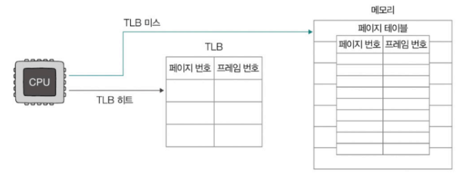
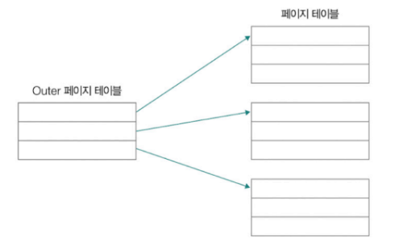
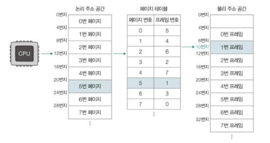

# Chapter 03-5. 가상 메모리

- [Chapter 03-5. 가상 메모리](#chapter-03-5-가상-메모리)
  - [CPU와 메모리의 주소](#cpu와-메모리의-주소)
  - [스와핑과 연속 메모리 할당](#스와핑과-연속-메모리-할당)
  - [페이징을 통한 가상 메모리 관리](#페이징을-통한-가상-메모리-관리)
  - [페이지 교체 알고리즘](#페이지-교체-알고리즘)

## CPU와 메모리의 주소
- CPU와 프로세스가 메모리 몇 번지에 무엇이 저장되어 있는지 전부 알지는 못함
  - 레지스터 용량이 메모리 용량보다 작기 때문
  - 메모리 정보가 계속 바뀌기 때문
- 물리 주소 : 메모리의 하드웨어 상 실제 주소
- 논리 주소 : 프로세스마다 부여되는 0번지부터 시작하는 주소 체계
  - CPU와 프로세스가 사용하는 주소 체계
  - 중복되는 번지 수 존재
- 논리 주소(CPU)와 물리 주소(메모리)가 원활하게 통신하기 위해선 주소 간 변환 필요 => MMU(메모리 관리 장치)
  - CPU와 메모리 사이 위치

## 스와핑과 연속 메모리 할당
- 스와핑
  - 메모리에 적재되었으나 현재 실행되지 않는 프로세스를 스왑 영역으로 보내고, 빈 메모리 공간에 다른 프로세스를 적재해 실행하는 메모리 관리 방식
  - 스왑 영역 : 보조기억장치의 일부 영역
    - 스왑 아웃 : 메모리 내의 현재 실행되지 않는 프로세스 -> 스왑 영역으로 이동
    - 스왑 인 : 스왑 영역의 프로세스 -> 메모리로 이동
      - 스왑 인 시, 이전 물리 주소와 다른 주소에 적재될 수 있음
- 연속 메모리 할당
  - 각 프로세스의 크기에 맞게 연속적으로 메모리 공간을 할당하는 방식
  - 외부 단편화 문제 내포
    - 외부 단편화 : 프로세스가 메모리에 연속적으로 할당될 때, 프로세스의 실행과 종료를 반복하게 되면서 빈 공간이 생기게 됨. 그 공간에 프로세스를 적재할 수 없어 메모리가 낭비되는 현상
      - 빈 공간 20MB, 30MB라고 했을 때 총 50MB이지만 31MB 이상 크기의 프로세스는 적재 불가
      - 즉, 물리 메모리보다 큰 프로세스 실행 불가

## 페이징을 통한 가상 메모리 관리
- 가상 메모리
  - (실행하고자 하는)프로그램의 일부만 메모리에 적재해, 실제 메모리보다 더 큰 프로세스를 실행할 수 있도록 만드는 메모리 관리 기법
  - 보조기억장치의 일부를 메모리처럼 사용하거나 프로세스의 일부만 메모리에 적재함으로써 메모리를 실제 크기보다 더 크게 보이게 하는 기술
  - 가상 메모리 기법으로 생성된 논리 주소 공간 => 가상 주소 공간
  - 대표적 기법 : 페이징, 세그멘테이션
    - 세그멘테이션 : 프로세스를 가변 크기의 세그먼트 단위로 분할하는 방식
      - 한 세그먼트는 코드 영역 또는 데이터 영역
      - 가변 크기이기 때문에 외부 단편화 발생할 수 있음
- 페이징
  - 프로세스의 논리 주소 공간을 페이지 단위로 나누고, 물리 주소 공간을 프레임 단위로 나눠 페이지를 프레임에 할당하는 기법
  - 특징
    - 페이지와 프레임은 동일한 크기
    - 페이지는 물리 메모리 내에 불연속으로 배치될 수 있어 외부 단편화 발생X
    - 페이지 단위로 스왑 아웃(페이지 아웃), 스왑 인(페이지 인) 가능하기 때문에 프로세스를 실행하기 위해 전체 프로세스가 메모리에 적재될 필요 없음
      - 논리 메모리의 크기가 실제 메모리 크기보다 더 클 수 있음
    - 내부 단편화 문제 내포
      - 내부 단편화 : 페이지 하나의 크기보다 작은 크기로 발생하게 되는 메모리 낭비
        - 페이징은 논리 주소 공간을 일정한 크기의 페이지로 나누지만 모든 프로세스가 페이지 크기에 딱 맞진 않음
        - 모든 프로세스의 크기가 페이지의 배수가 아니기 때문
        - 프로세스 크기가 107KB인데, 페이지 크기가 10KB라면 3KB가 남음
  - 페이지 테이블
    - 프로세스의 페이지와 실제로 적재된 프레임을 짝지어 주는 정보
      - 물리 메모리 내에 페이이지를 불연속 배치해 CPU가 다음에 실행할 페이지 위치 찾기 어려움
      - 프로세스마다 각자의 페이지 테이블 정보 가짐 -> 서로 다른 프로세스를 실행할 때 각 프로세스의 페이지 테이블 참조해 메모리 접근
    - 페이지 테이블 엔트리
      - 페이지 테이블을 구성하고 있는 각각의 행
      - 페이지 번호, 프레임 번호, 유효 비트, 보호 비트, 참조 비트, 수정 비트
        - 유효 비트 : 해당 페이지에 접근 가능한 지(메모리 적재시 0, 보조기억장치 적재 중일 땐 1)
          - CPU는 보조기억장치에 저장된 페이지에 곧장 접근 불가 => 페이지 폴트(예외) 발생
          - 종류 : 메이저 페이지 폴트(CPU가 접근하려는 페이지가 물리 메모리에 없을 때 발생), 마이너 페이지 폴트(CPU가 요청한 페이지가 물리 메모리에는 존재하지만, 페이지 테이블 상에는 반영되지 않은 경우)
          - 페이지 폴트 처리 과정 : 기존 작업 내역 백업 -> 페이지 폴트 처리 루틴(원하는 페이지를 메모리로 가져와 유효 비트 1로 변경) -> 메모리에 적재된 페이지 실행
        - 보호 비트 : 페이지 보호 기능을 위해 존재
          - r(읽기), w(쓰기), x(실행) 조합으로 페이지 접근 권한 제한
        - 참조 비트 : CPU가 해당 페이지에 접근한 적 있는지(CPU가 읽거나 썼다면 1, 아니면 0)
        - 수정 비트(더티 비트) : 해당 페이지에 데이터를 쓴 적 있는지(변경된 적 있으면 1, 아니면 0)
          - 1일 때는 페이지의 수정 내역을 보조기억장치에도 반영해 두어야 하기 때문에 보조기억장치에 대한 쓰기 작업 필요 
    - 페이지 테이블 베이스 레지스터
      - 특정 프로세스의 페이지 테이블이 적재된 메모리 상의 위치를 가리키는 레지스터
      - 각 프로세스의 페이지 테이블은 메모리에 적재될 수 있음
        - 메모리 접근 횟수가 많아지고, 메모리 용량을 많이 차지하게 되면 비효율적이므로 가급적 지양
        - 메모리 접근 횟수
          - 문제 상황
            - 모든 프로세스의 페이지 테이블이 메모리에 적재되어 있으면 CPU는 총 두 번 메모리에 접근 해야 함 -> 페이지 테이블 접근, 실제 프레임 접근
            - 메모리에 접근하는 시간이 두 배로 늘어날 수 있음
          - 해결 방법
            - TLB(Translation Look-aside Buffer) 사용
              - 페이지 테이블의 캐시 메모리, MMU 내부에 위치
              - 참조 지역성의 원리에 따라 자주 사용할 법한 페이지 위주로 페이지 테이블의 일부 내용 저장
              - CPU가 접근하려는 논리 주소의 페이지 번호가 TLB에 있을 경우 => TLB 히트
                - TLB는 해당 페이지 번호가 적재된 프레임 번호 알려줌
                - 한 번만 메모리 접근
              - 페이지 번호가 TLB에 없을 경우 => TLB 미스
                - 메모리 내의 페이지 테이블에 접근
                - 추가적인 메모리 접근 필요
              - 메모리 접근 횟수를 낮추기 위해 TLB 히트율 높여야 함
                

        - 메모리 용량
          - 문제 상황
            - 프로세스의 크기가 커지면 페이지 테이블의 크기도 커짐
            - 모든 페이지 테이블 엔트리들을 메모리에 두는 것은 메모리 낭비
          - 해결 방법
            - 계층적 페이징(다단계 페이지 테이블 기법)
              - 페이지 테이블을 페이징하는 방식
              - 프로세스의 페이지 테이블을 여러 개의 페이지로 자름
              - CPU와 가까이 위치한 바깥 쪽에 페이지 테이블(Outer 페이지 테이블) 두어 잘린 페이지 테이블의 페이지를 가리키게 함
              - 메모리에 Outer 페이지 테이블만 유지하면 됨

                
  - 페이징 주소 체계
    - `<페이지 번호, 변위>`
      - 페이지 번호 : 몇 번째 페이지 번호에 접근할 지
        - 하나의 페이지 내에 여러 주소 포함 됨
      - 변위 : 접근하려는 주소가 페이지와 매칭된 프레임의 시작 번지로부터 얼마나 떨어져 있는지
      - 논리 주소 <페이지 번호, 변위> → 페이지 테이블 → 물리 주소 <프레임 번호, 변위>
        - 

## 페이지 교체 알고리즘
- 메모리에 적재된 페이지 중 보조기억장치로 내보낼 페이지를 선택하는 방법
  - 요구 페이징을 통해 페이지들을 메모리에 적재하다보면 일부 페이지 스왑 아웃 필요하기 때문
    - 요구 페이징 : 메모리에 프로세스를 적재할 때 메모리에 필요한(요구되는) 페이지만 적재하는 기법
    - 기본적인 양상
      - CPU가 특정 페이지에 접근하는 명령어 실행
      - 해당 페이지가 현재 메모리에 있을 경우(유효 비트가 1일 경우) CPU는 페이지가 적재된 프레임에 접근
      - 해당 페이지가 현재 메모리에 없을 경우(유효 비트가 0일 경우) 페이지 폴트 발생
      - 페이지 폴트가 발생하면 페이지 폴트 처리 루틴을 통해 해당 페이지를 메모리로 적재, 유효 비트 1로 설정
      - 다시 처음부터 수행
    - 순수 요구 페이징 : 아무런 페이지도 메모리에 적재하지 않은 채 무작정 프로세스 실행하는 기법
      - 프로세스의 첫 명령어 실행 순간부터 페이지 폴트 발생
      - 실행에 필요한 페이지가 어느 정도 적재된 이후부터 페이지 폴트의 발생 빈도 떨어짐
- 페이지 교체 알고리즘의 성능
  - 어떤 페이지 교체 알고리즘이 사용되느냐에 따라 페이지 폴트의 발생 빈도가 달라짐
    - 좋은 페이지 교체 알고리즘 - 페이지 폴트의 발생 빈도↓
      - 메모리에서 사용되지 않을 페이지를 적절하게 보조기억장치로 내보냄
    - 나쁜 페이지 교체 알고리즘 - 페이지 폴트의 발생 빈도↑
      - 머지않아 사용될 페이지를 보조기억장치로 내보내 페이지 폴트를 자주 발생시킬 수 있음
      - 빈번한 페이지 폴트의 발생 → 보조기억장치로부터 필요한 페이지를 가져와야 하는시간만큼 성능 저하
      - 스래싱(thrashing) : 프로세스가 실제로 실행되는 시간보다 페이징에 더 많은 시간을 소요해 성능이 저하되는 문제
- 종류
  - FIFO(First-In First-Out) 페이지 교체 알고리즘
    - 메모리에 가장 먼저 적재된 페이지부터 스왑 아웃하는 페이지 교체 알고리즘
    - 아이디어와 구현 간단
    - 초기에 적재되어 계속 참조되고 있는 페이지를 스왑 아웃할 수 있음
  - 최적(Optimal) 페이지 교체 알고리즘
    - 앞으로의 사용 빈도가 가장 낮은 페이지를 교체하는 알고리즘
    - 메모리에 적재된 페이지들 중 앞으로 가장 적게 사용할 페이지를 스왑 아웃해 가장 낮은 페이지 폴트율 보장
    - '앞으로 가장 적게 사용할 페이지'를 미리 예측하기 어려워 실제 구현 어려움
  - LRU(Least Recently Used) 페이지 교체 알고리즘
    - 가장 오래 사용한 페이지를 교체하는 알고리즘
    - 보편적으로 사용되는 페이지 교체 알고리즘의 원형
