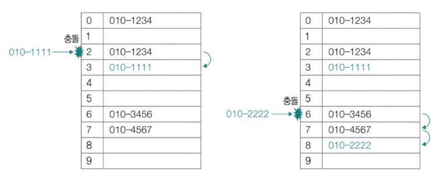
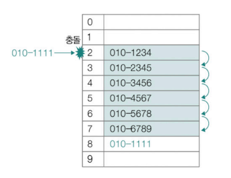
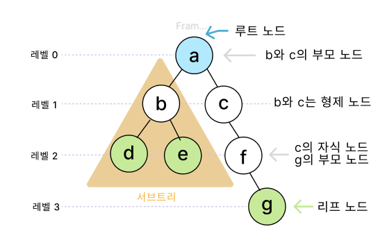
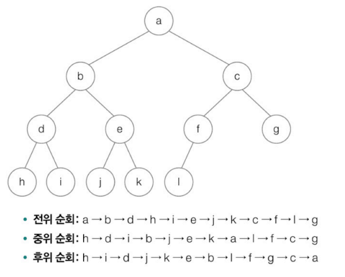
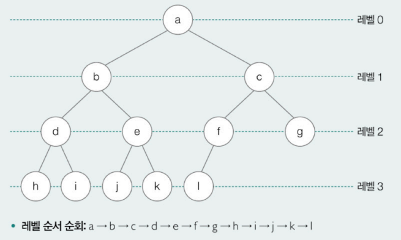

# Chapter 04. 해시 및 트리

- [Chapter 04. 해시 및 트리](#chapter-04-해시-및-트리)
  - [해시 테이블](#해시-테이블)
    - [해시 테이블의 구조](#해시-테이블의-구조)
    - [해시 충돌](#해시-충돌)
  - [트리](#트리)
    - [용어 정리](#용어-정리)
    - [트리의 순회](#트리의-순회)

## 해시 테이블
- **키와 값**의 대응으로 이루어진 표(테이블)와 같은 형태의 자료 구조
  - 특징
    - 빠른 검색 속도 : 검색, 삽입, 삭제 연산의 시간 복잡도 O(1) -> 입력과 무관하게 항상 일정한 속도 보장
    - 상대적으로 많은 메모리 공간 소모, 해시 충돌 -> 데이터가 많을 경우 공간 복잡도가 시간 복잡도만큼 우수하지 않음
  - 프로그래밍 언어에서의 구현
    - 자바 : HashMap
    - 자바스크립트 : Map
    - 파이썬 : Dictionary

### 해시 테이블의 구조
- **키와 값**
  - 키 : 해시 테이블에 대한 입력
  - 값 : 키를 통해 얻고자 하는 데이터
- **버킷과 로드 팩터**
  - 버킷 : 값이 저장되어 있는 공간
    - 키를 해시 함수에 통과시키면 인덱스(버킷 배열의 인덱스)를 반환해 그에 해당하는 버킷에 접근 가능
  - 로드 팩터 : 해시 테이블이 얼마나 차 있는지에 대한 지표
    - 해시 테이블에 저장된 데이터 수 / 버킷의 수
    - 로드 팩터가 클수록 해시 테이블의 성능 떨어짐
- **해시 함수**
  - 임의의 길이를 지닌 데이터를 **고정된 길이의 데이터로 변환**하는 **단방향** 함수
    - 반대로 해시 값을 통해 어떤 데이터가 입력되었는지 도출하기 어려움
    - 해시 알고리즘
      - 해시 함수의 연산 방법
      - MD5, SHA-1, SHA-256, SHA-512, SHA3, HMAC 등
      - 같은 데이터라도 적용된 해시 알고리즘이 다르면 해시 값이나 길이 달라짐
      - 무작위 값을 만들거나 단방향 암호를 만들 때 **데이터 무결성 검증**을 위해 사용
        - 예시) 웹 서비스 접속 시 비밀번호 입력
    - 모듈러 연산으로 구현
      - 해시 값 = 키 % 해시 테이블 크기
      - 해시 충돌이 발생할 여지가 높아 실제 해시 테이블에 사용되는 경우 드묾

### 해시 충돌
- 서로 다른 2개 이상의 키에 대해 같은 해시 값이 대응되는 상황
  - 해시 충돌이 일어나면 무결성 검증에서 같지 않은 데이터를 동일하다고 판단할 수 있음
  - 전송 과정 중 데이터를 가로채 바꾸는 보안 상 위험 발생할 수 있음
- **해결 방법**
  - 체이닝 : 충돌이 발생한 데이터를 연결 리스트로 추가하는 방법
    - 하나의 테이블 인덱스에 여러 데이터가 연결 리스트의 노드로써 존재
    - 아이디어와 구현이 단순함
    - 충돌이 반복되어 연결 리스트의 노드가 계속 추가되면 성능이 O(n)로 떨어질 수 있음
      - 해시 테이블의 장점인 빠른 속도가 어려워짐
    [alt text](이미지/04체이닝.png)
  - 개방 주소법 : 충돌이 발생했을 때 충돌이 발생한 버킷의 인덱스가 아닌 다른 인덱스에 데이터를 저장하는 방법
    - 선형 조사법
      - 충돌이 발생한 인덱스의 다음 인덱스부터 순차적으로 가용한 인덱스를 찾는 방법
      - 해시 충돌이 발생하는 인덱스 인근에 충돌이 발생한 데이터가 몰려 군집화 현상이 발생할 수 있음 -> 오랜 순차 탐색이 필요해 성능 악화로 이어짐
      
    - 이차 조사법 : 충돌이 발생했을 때 충돌이 발생한 인덱스에서 제곱수만큼 떨어진 거리에 위치한 인덱스를 찾는 방법
      - 데이터 군집화 문제를 해결함으로써 선형 조사법의 문제를 완화할 수 있음
      - 그러나 제곱수의 규칙성으로 인해 데이터 군집화를 해결하는 근본적인 방법이라고 보기는 어려움
  - 이중 해싱 : 충돌이 발생했을 때 다른 해시 함수(보조 해시 함수)에 대한 해시 값만큼 떨어진 거리에 위치한 인덱스를 찾는 방법
    - 2개의 해시 함수 사용
    - f(key) + g(key) > f(key) + 2g(key) > f(key) + 3g(key)…
    - 해시 함수를 통해 무작위로 인덱스가 생성되므로 군집화 문제를 상당 부분 피할 수 있음

## 트리
- 주로 계층적인 구조를 표현하기 위한 자료 구조
- 노드와 간선으로 이루어짐 -> 간선으로 이어진 노드는 상하 관계 형성
  - 하나의 노드 = 데이터를 저장할 공간 + 자식 노드의 위치 정보(메모리 상의 주소)를 저장한 공간
  

### 용어 정리
- 노드 : 데이터를 저장하는 구성 요소
- 간선(링크) : 노드를 연결하는 구성 요소
- 부모 노드 : 어떤 노드의 상위에 연결된 노드
- 자식 노드 : 어떤 노드의 하위에 연결된 노드
  - 부모 노드와 자식 노드는 상대적인 개념
  - 최상단 노드가 아닌 부모 노드는 하나만 존재
  - 자식 노드는 하나 이상 존재 가능
- 형제 노드 : 같은 부모 노드를 공유하는 노드
- 조상 노드 : 부모 노드와 그 부모 노드들
- 자손 노드 : 자식 노드와 그 자식 노드들
- 루트 노드 : 부모 노드가 없는 트리의 최상단 노드
- 리프 노드 : 자식 노드가 없는 트리의 최하단 노드
- 차수 : 어떤 노드가 가지고 있는 자식 노드의 수
- 레벨(깊이) : 루트 노드에서 시작해 특정 노드에 이르기까지 거치게 되는 간선의 수
- 높이 : 가장 높은 레벨
- 서브 트리 : 트리에 포함되어 있는 부분 트리


### 트리의 순회
- 트리의 모든 노드를 한 번씩 방문하는 것
  
  - 전위 순회 : ① 루트 노드 ② 왼쪽 서브트리 ③ 오른쪽 서브트리
    ```js
    def preorder(node) :
	if node가 존재하지 않으면 : 
		return
		
	print(node)
	preorder(node의 왼쪽 자식)
	preorder(node의 오른쪽 자식)
    ```
  - 중위 순회 : ① 왼쪽 서브트리 ② 루트 노드 ③ 오른쪽 서브트리
    ```js
    def inorder(node) :
	if node가 존재하지 않으면 : 
		return
		
	inorder(node의 왼쪽 자식)
	print(node)
	inorder(node의 오른쪽 자식)
    ```
  - 후위 순회 : ① 왼쪽 서브트리 ② 오른쪽 서브트리 ③ 루트 노드
    ```js
    def postorder(node) :
	if node가 존재하지 않으면 : 
		return
		
	postorder(node의 왼쪽 자식)
	postorder(node의 오른쪽 자식)
	print(node)
    ```
  - 참고 : 레벨 순서 순회
    - 가장 레벨이 낮은 순서(루트 노드부터) 차례로 노드를 순회하는 방법
    