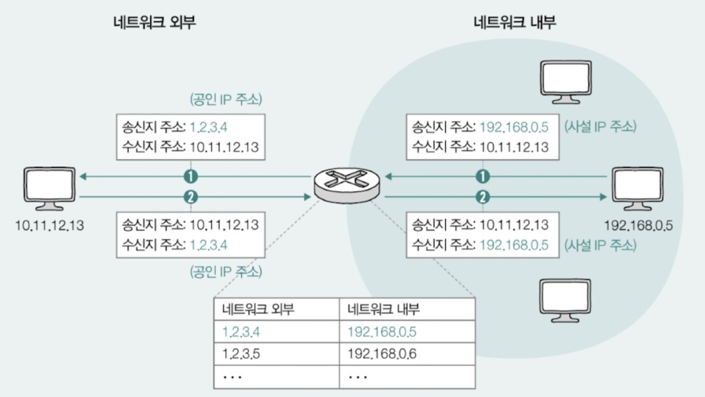
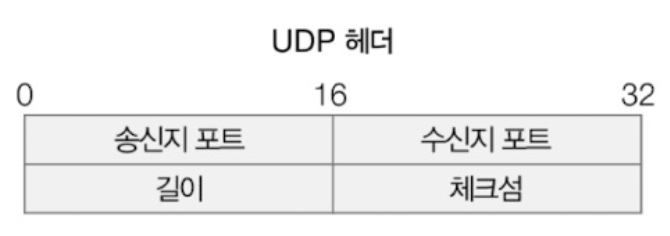
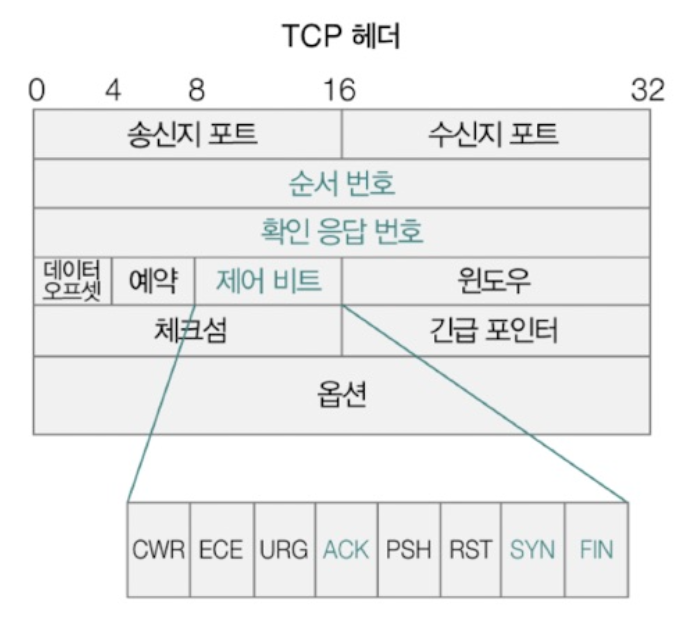
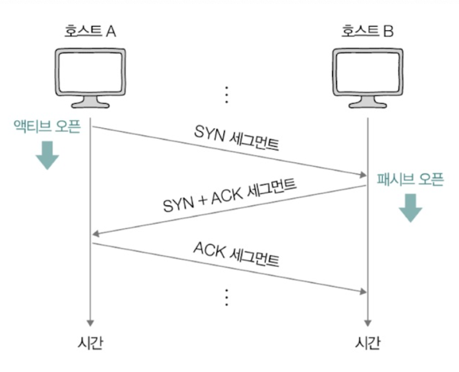
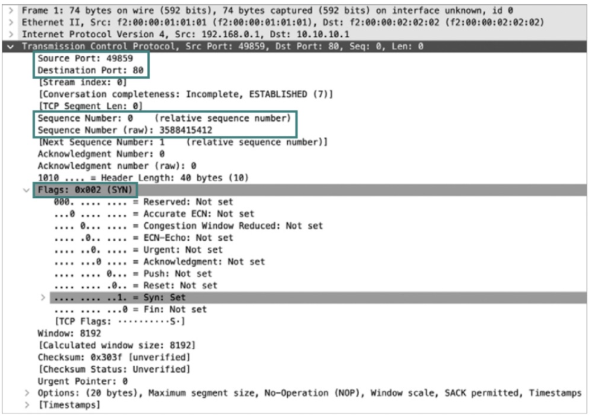
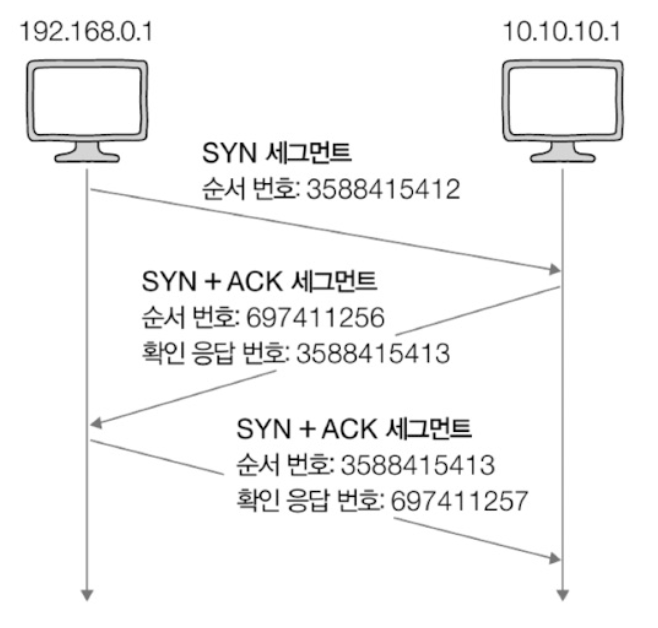
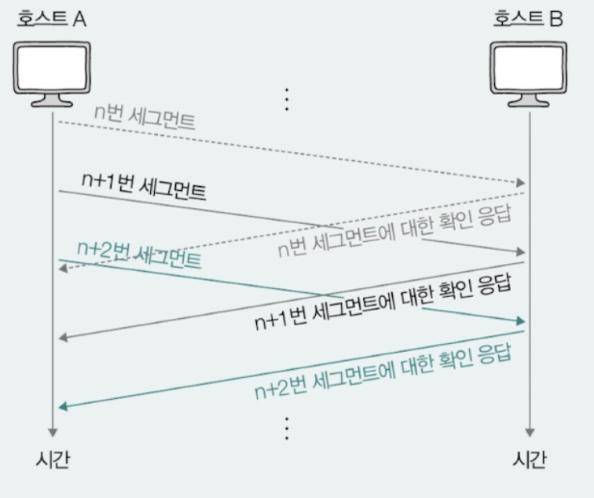
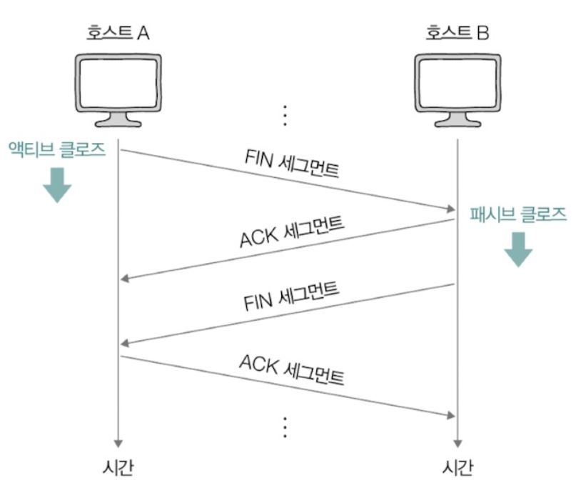

# Chapter 05-4. TCP와 UDP
- [Chapter 05-4. TCP와 UDP](#chapter-05-4-tcp와-udp)
  - [TCP와 UDP의 목적과 특징](#tcp와-udp의-목적과-특징)
    - [포트를 통한 프로세스 식별](#포트를-통한-프로세스-식별)
    - [(비)신뢰성과 (비)연결형 보장](#비신뢰성과-비연결형-보장)
  - [TCP의 연결 및 종료 과정](#tcp의-연결-및-종료-과정)
    - [TCP의 연결 수립](#tcp의-연결-수립)
    - [TCP의 오류, 흐름, 혼잡 제어](#tcp의-오류-흐름-혼잡-제어)
    - [TCP의 종료](#tcp의-종료)
  - [TCP의 상태 관리](#tcp의-상태-관리)

> 전송 계층에서 가장 중요한 프로토콜 : TCP, UDP

## TCP와 UDP의 목적과 특징
### 포트를 통한 프로세스 식별
- 전송 계층의 주된 목적
  - 패킷은 네트워크를 통해 최종적으로 호스트가 실행하는 **프로세스**에 전달되어야 함
    - IP 주소, MAC 주소는 패킷을 송수신하는 호스트를 특정할 수 있음
    - 하나의 호스트는 다양한 프로세스를 동시에 실행할 수 있음
    - TCP, UDP는 헤더의 송수신지 포트 필드에 포함된 포트 번호를 통해 프로세스 식별  
  
- **포트(port)**
  - 네트워크 패킷을 주고 받는 프로세스에는 포트 번호가 할당됨
  - **IP 주소와 포트 번호의 조합** => 특정 호스트가 실행하는 특정 프로세스 식별 가능
  - 표기 형식 : IP 주소(호스트 식별) : 포트 번호(애플리케이션 프로세스 식별)
  - 포트 번호 종류
    - 개수 : 2^16 = 65536개 (0번 ~ 65535번)
    - **잘 알려진 포트** : 0 ~ 1023번
      - 대중적으로 사용되는 애플리케이션을 위한 포트
      - 범용적으로 사용되는 프로토콜이 주로 사용하는 포트 번호 목록  
      - |잘 알려진 포트 번호|설명|  
        |---|---|  
        |20, 21|FTP|
        |22|SSH|
        |23|TELNET|
        |53|DNS|
        |67, 68|DHCP|
        |80|HTTP|
        |443|HTTPS|
    - **등록된 포트** : 1024 ~ 49151번
      - 잘 알려진 포트보다는 덜 범용적이지만 흔하게 사용되는 애플리케이션 프로토콜에 할당하기 위한 포트 번호
      - |등록된 포트 번호|설명|  
        |---|---|  
        |1194|OpenVPN|
        |1433|Microsoft SQL Server 데이터베이스|
        |3306|MySQL 데이터베이스|
        |6379|Redis|
        |8080|HTTP 대체|
    - 두 포트는 **서버로 동작하는 프로그램 환경**에서 자주 볼 수 있음
    - **사설 포트(임시 포트, 동적 포트)** : 49152 ~ 65535번
      - 자유롭게 사용 가능한 포트
      - **클라이언트로서 동작하는 프로그램**의 경우 자주 사용
      - 웹 브라우저 등
  > 참고 : NAT와 NAPT
  >
  > - **NAT** : 공인 IP 주소와 사설 IP 주소 간 변환을 위해 사용되는 기술
  >   - 사설 IP 주소를 사용하는 호스트가 네트워크 외부에 있는 호스트와 패킷을 주고 받기 위해선 공인 IP 주소와 사설 IP 주소 간 변환 필요
  >   - 대부분의 라우터와 (가정용)공유기는 NAT 기능 내장
  >   - 패킷이 **네트워크 외부**로 전송되는 과정 : 사설 IP 주소 -> 공인 IP 주소로 변환
  >   - 네트워크 외부 패킷이 **사설 네트워크 속 호스트**에 이르는 과정 : 공인 IP 주소 -> 사설 IP 주소로 변환
  >   
  >   - 사설 IP 주소(1) : 공인 IP 주소(1) 변환은 공인 IP 주소가 현저하게 부족함 => **포트 활용**
  >
  > - **NAPT** : 주소 변환 과정에서 변환할 IP 주소의 쌍과 더불어 포트 번호도 함께 고려하는 포트 기반의 NAT
  >   - 사설 IP 주소(N) : 공인 IP 주소(1)

### (비)신뢰성과 (비)연결형 보장
- **UDP**
  - 신뢰할 수 없는 비연결형 프로토콜
  - 연결 수립이나 종료 단계를 거치지 않고 신뢰성을 높이기 위한 기능들 제공X  
   
   - 송신지 포트 : 송신 프로세스가 할당된 포트 번호
    - 수신지 포트 : 수신 프로세스가 할당된 포트 번호
    - 길이 필드 : UDP 패킷 (UDP 데이터그램)의 바이트 크키
    - 체크섬 필드 : 송수신 과정에서의 데이터그램 훼손 여부
- **TCP**
  - 신뢰할 수 있는 연결형 프로토콜
  - 패킷을 주고 받기 전 연결 수립 과정 거침
  - 연결 수립 후 **패킷의 신뢰성**을 보장하기 위해 상태 관리, 흐름 제어, 오류 제어, 혼자 제어 등의 기능 제공
    - UDP보다 시간 느림
  - 패킷의 송수신 모두 끝나면 연결 종료
  
  - UDP 헤더에 있는 모든 필드 (송수신지 포트, 길이 필드, 체크섬 필드) 포함 + 추가 필드
    - *순서 번호 필드* : TCP 패킷 (TCP 세그먼트)의 **올바른 송수신 순서**를 보장하기 위해 세그먼트 첫 바이트에 매겨진 번호
      - 순서 번호를 통해 현재 주고 받는 TCP 세그먼트가 송수신하고자 하는 데이터의 몇번째 바이트에 해당하는지 알 수 있음
      - 확인 응답 번호 필드와 함께 사용되기도 함
    - *확인 응답 번호 필드* : 상대 호스트가 보낸 세그먼트에 대한 **응답**으로, 다음으로 수신하길 기대하는 순서 번호
      - 올바르게 수신한 순서 번호에 1이 더해진 값
      - 순서 번호 필드와 함께 사용됨
      - ✨ TCP의 신뢰성 보장은 대부분 확인 응답 번호를 통해 이루어짐
        - 확인 응답 번호를 포함하고 있다면 `ACK 플래그(제어 비트, 승인 의미)`는 **1**, `확인 응답 번호 필드`는 **순서 번호 필드 +1**
    - *제어 비트 (플래그 비트)* : 현재 세그먼트에 대한 **부가 정보**를 나타내는 정보
      - 8비트로 구성
      - ACK : 세그먼트의 승인을 나타내기 위한 비트
      - SYN : 연결을 수립하기 위한 비트
      - FIN : 연결을 종료하기 위한 비트

## TCP의 연결 및 종료 과정
- 상태 관리 - 연결 수립 - 송수신 - 연결 종료 - 상태 관리

### TCP의 연결 수립
- **3-way handshake**
  - 세 단계로 이루어진 TCP의 연결 수립 과정
  - ① A -> B (SYN 세그먼트 전송)
    - 호스트 A는 SYN 비트가 1로 설정된 세그먼트를 호스트 B에게 전송
    - 세그먼트 *순서 번호*에는 호스트 A의 순서 번호 포함
    - **액티브 오픈** : 호스트 A가 SYN 비트가 1로 설정된 패킷을 보내 **처음으로 연결을 시작**하는 과정(주로 클라이언트에서 수행됨)
  - ② B -> A (SYN + ACK 세그먼트 전송)
    - ①에 대한 호스트 B의 응답
    - 호스트 B는 ACK 비트와 SYN 비트가 1로 설정된 세그먼트 (SYN + ACK 세그먼트)를 호스트 A에게 전송
    - 세그먼트 *순서 번호*에 호스트 B의 순서 번호와 ①에서 보낸 세그먼트에 대한 확인 응답 번호 포함
      - 호스트마다 자신만의 순서 번호 가짐
    - **패시브 오픈** : 호스트 B처럼 **연결 요청을 수**신한 뒤 그에 대한 **연결을 수립**하는 과정(주로 서버에서 수행됨)
  - ③ A -> B (ACK 세그먼트 전송)
    - 호스트 A는 ACK 비트가 1로 설정된 세그먼트 (ACK 세그먼트)를 호스트 B에게 전송
    - 세그먼트 *순서 번호*에는 호스트 A의 기존 순서 번호가 포함되며, *확인 응답 번호*에는 호스트 B가 보낸 세그먼트 순서 번호 +1이 포함됨
  
  

    
3-way handshake 상세 단계

    - SYN 세그먼트 전송
      - 
      - 호스트 192.168.0.1 -> 호스트 10.10.10.1
      - 송신지 포트 번호 49859 (동적 포트) -> 수신지 포트 번호 80 (잘 알려진 포트 번호, HTTP)
      - 상대적 순서 번호(0), 실제 순서 번호 (3588415412)
      - SYN 비트 : 1
    - SYN + ACK 세그먼트 전송
      - 
      - 80번 포트의 호스트 10.10.10.1 프로세스 -> 499859 포트의 호스트 192.168.0.1 프로세스에게 세그먼트 전송
      - 순서 번호 : 697411256
        - 연결 요청을 받은 호스트의 순서 번호
      - 확인 응답 번호 : 3588415413
      - SYN, ACK 비트 : 1
    - ACK 세그먼트 전송 
      - 
      - 순서 번호 : 3588415413 (두번째 세그먼트의 확인 응답 번호와 동일)
      - 확인 응답 번호 : 697411257
      - ACK 비트 : 1
    - 마지막 세그먼트까지 수신되면 TCP 연결 수립 완료
      - 
  

### TCP의 오류, 흐름, 혼잡 제어
- 송수신하는 패킷의 신뢰성을 보장하기 위해 제공하는 기능

- **오류 제어**
  - TCP 송수신 과정 중 잘못 전송된 세그먼트가 있는 경우 **재전송**하여 오류 제어
  - 잘못 전송된 세그먼트 인식하는 방법
    - ① 중복된 ACK 세그먼트 도착
      - 세그먼트 일부가 전송 중 유실되면 중복으로 ACK 세그먼트 받게 됨
    - ② 타임아웃 발생
      - 타임아웃 : TCP 세그먼트를 송신하는 호스트가 세그먼트를 전송할 때마다 재전송 타이머를 시작하는데, 이 타이머의 카운트 다운이 끝난 상황
      - 타임 아웃 발생 시점까지 ACK 세그먼트를 받지 못하면 전송 과정 중 문제가 발생했다고 간주하여 세그먼트 재전송
- **흐름 제어**
  - 수신 호스트가 한 번에 받아 처리할 수 있을 만큼만 전송하는 것
  - 송신 호스트가 **수신 호스트의 처리 속도를 고려**하여 송수신 속도를 균일하게 맞추는 기능
    - 전송량은 TCP 수신 버퍼(임시 저장 공간)의 크기에 의해 결정됨, 커널에 정의되어 있음
  - **수신 윈도우 (receiver window, RWND)** : TCP 헤더에 있는 윈도우 필드로 수신 호스트의 한 번에 처리 가능한 양, 커널에 정의됨
- **혼잡 제어**
  - 송신 호스트가 얼마나 네트워크가 혼잡한지 판단하고, **판단된 혼잡의 정도**에 따라 세그먼트의 전송량을 조절하는 것
    - 혼잡 : 많은 트래픽으로 인해 패킷의 처리 속도가 느려지거나 유실될 수 있는 상황
    - 혼잡 판단 기준 : 중복된 ACK 세그먼트 도착, 타임아웃 발생
  - 송신 호스트가 혼잡 가능성을 검출하면 최대 전송량이 아닌 혼잡 윈도우만 송신함
    - **혼잡 윈도우 (congestion window, CWND)** : 혼잡 없이 전송할 수 있을 정도의 양, 커널에 정의됨
      - 혼잡 윈도우의 크기와 한 번에 전송할 수 있는 세그먼트의 수는 정비례
  - 혼잡 제어 알고리즘
    - 혼잡 윈도우 크기를 연산하는 방법
    - **AIMD (Additive increase/Multiplicative Decrease)** : 합으로 증가, 곱으로 감소하는 혼잡 제어 알고리즘
      - 세그먼트를 보내고 그에 응답이 오기까지(RTT마다) 
      - 혼잡이 감지되지 않으면 혼잡 윈도우를 1씩 선형적으로 증가
      - 혼잡이 감지되면 혼잡 윈도우를 절반으로 떨어뜨리는 동작 반복
        - **RTT** : 패킷을 보내고 그에 대한 응답이 수신되기까지의 시간
      - 혼잡 윈도우가 톱니 모양으로 변화함  
      
  

    
파이프라이닝 전송

    - 확인 응답을 받기 전이라도 여러 세그먼트를 보내 한 번에 송신하고 한 번에 각 세그먼트에 대한 응답을 받는 것
    - 기존 TCP 송수신 방식은 확인 응답을 받기 전까진 다른 세그먼트를 보낼 수 없음 -> 한번에 하나의 세그먼트만 주고 받아야 함  
    

  

### TCP의 종료
- **4-way handshake**
  - 수신 호스트가 각자 한번씩 FIN과 ACK를 주고 받으며 이루어짐
  - ① A -> B : FIN 세그먼트 (액티브 클로즈)
    - 호스트 A가 FIN 세그먼트 (1로 설정된 FIN 비트)를 호스트 B에게 전송
    - **액티브 클로즈** : 먼저 연결을 종료하려는 호스트에 의해 수행되는 동작
  - ② B -> A : ACK 세그먼트
    - ①에 대한 응답으로 호스트 B가 ACK 세그먼트를 호스트 A에게 전송
  - ③ B -> A : FIN 세그먼트 (패시브 클로즈)
    - 호스트 B가 FIN 세그먼트를 호스트 A에게 전송
    - **패시브 클로즈** : 연결 종료 요청을 받아들이는 호스트에 의해 수행되는 동작
  - ④ A -> B : ACK 세그먼트
    - ③에 대한 호스트 A의 응답으로 ACK 세그먼트를 호스트 B에게 전송
  

## TCP의 상태 관리
- **스테이트풀 프로토콜** : TCP 프로토콜의 상태를 유지하고 관리
  - 상태 : 현재 어떤 통신 과정에 있는지를 나타내는 정보
  - TCP의 상태 정보로 현재 TCP 송수신 현황을 판단하고 디버깅의 힌트로도 활용할 수 있음!
  - 
- **연결이 수립되지 않았을 때**
  - |상태|설명|
    |---|---|
    |CLOSED|아무런 연결이 없는 상태|
    |LISTEN|연결 대기 상태 (첫 번째 SYN 세그먼트를 대기하는 상태)
- **연결 수립 과정일 때**
  - |상태|설명|
    |---|---|
    |SYN-SENT|액티브 오픈 호스트가 SYN 세그먼트를 보낸 뒤, 그에 대한 응답인 SYN + ACK세그먼트를 기다리는 상태 (연결 요청 전송)|
    |SYN-RECEIVED|패시브 오픈 호스트가 SYN + ACK 세그먼트를 보낸 뒤 그에 대한 ACK 세그먼트를 기다리는 상태 (연결 요청 수신)|
    |ESTABLISHED|연결 수립이 완료되고 데이터를 송수신할 수 있는 상태|
- **연결 종료 과정일 때**
  - |상태|설명|
    |---|---|
    |FIN-WAIT-1|액티브 클로즈 호스트가 FIN 세그먼트로 연결 종료 요청을 보낸 상태 (연결 종료 요청 전송)|
    |CLOSE-WAIT|FIN 세그먼트를 받은 패시브 클로즈 호스트가 그에 대한 응답으로 ACK 세그먼트를 보낸 후 대기하는 상태 (연결 종료 요청 승인)|
    |FIN-WAIT-2|FIN-WAIT-1 상태에서 ACK 세그먼트를 받은 상태|
    |LAST-ACK|CLOSE-WAIT 상태에서 FIN 세그먼트를 전송한 뒤 대기하는 상태|
    |TIME-WAIT|액티브 클로즈 호스트가 마지막 ACK 세그먼트를 전송한 뒤 접어드는 상태, 마지막 ACK 전송 확인을 위해 일정 시간 대기 후 CLOSED 상태로 전환|
> 참고 : CLOSING 상태
> 
> - 서로 FIN 세그먼트를 보내고 받은 뒤 각자 그에 대한 ACK 세그먼트를 보냈지만 아직 자신의 FIN 세그먼트에 대한 ACK 세그먼트를 응답 받지 못했을 때 접어드는 상태
> - 양쪽이 동시에 연결 종료를 요청하고 서로의 종료 응답을 기다릴 경우 발생