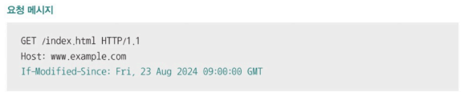
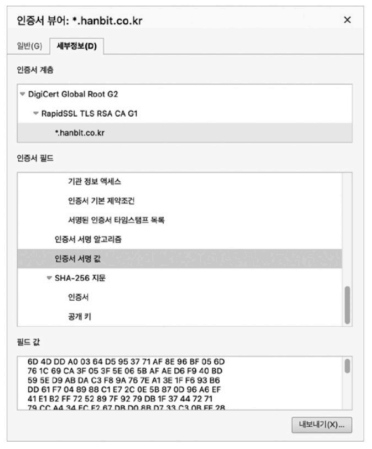

# Chapter 05-6. HTTP의 응용

- [Chapter 05-6. HTTP의 응용](#chapter-05-6-http의-응용)
  - [쿠키와 웹 스토리지](#쿠키와-웹-스토리지)
    - [쿠키](#쿠키)
    - [웹 스토리지 - 로컬 스토리지, 세션 스토리지](#웹-스토리지---로컬-스토리지-세션-스토리지)
  - [HTTP 캐시(= 웹 캐시, 캐시)](#http-캐시-웹-캐시-캐시)
    - [캐시된 데이터의 유효 기간](#캐시된-데이터의-유효-기간)
    - [캐시 데이터 변경 방식](#캐시-데이터-변경-방식)
  - [콘텐츠 협상](#콘텐츠-협상)
    - [콘텐츠 협상](#콘텐츠-협상-1)
    - [대표적인 콘텐츠 협상 헤더](#대표적인-콘텐츠-협상-헤더)
  - [보안 - SSL/TLS와 HTTPS](#보안---ssltls와-https)
    - [SSL/TLS와 HTTPS](#ssltls와-https)
    - [TLS 1.3 핸드셰이크](#tls-13-핸드셰이크)

> HTTP 기반 대표적인 기술 : 쿠키, 캐시, 콘텐츠 협상, 인증, 보안 등

## 쿠키와 웹 스토리지
- HTTP는 기본적으로 **스테이트리스 프로토콜**
  - HTTP의 모든 요청 메시지는 독립된 메시지
  - 클라이언트의 상태를 알고 있어야 할 경우는?

### 쿠키
- HTTP의 스테이트리스한 특성을 보완하기 위한 대표적인 수단
- 서버에서 생성되어 클라이언트 측에 저장되는 <이름, 값> 형태의 데이터
- 클라이언트는 서버로부터 받은 쿠키 -> 브라우저에 저장!
- [alt text](이미지/브라우저에%20저장된%20쿠키.png)

**동작 방식**
- 서버는 쿠키를 생성해 클라이언트에 전송
  - 
  - 응답 메시지의 `Set-Cooke` 헤더 활용
  - 쿠키의 이름, 값, 세미콜론, 속성 ...
  - 쿠키를 여러 개 전달할 땐 여러 개의 Set-Cookie 헤더 사용
- 클라이언트는 서버로부터 받은 쿠키를 브라우저에 저장
  - 이후 같은 서버에 요청을 보낼 때 자동으로 요청 메시지에 쿠키 포함해 전송
  - 
  - 요청 메시지의 `Cookie` 헤더 활용
  - 여러 쿠키를 전달할 경우 세미 콜론으로 <이름, 값> 쌍 구분

**대표 속성**
- domain, path 속성
  - 쿠키를 전송할 도메인과 경로 제한
  - 
- Expires, Max-Age 속성
  - 명시된 시점이나 유효기간이 지나면 삭제되어 전달되지 않게 함
  - Expires 형식 : `요일, DD-MM-YY HH:MM:SS GMT`
    - 쿠키의 만료 시점 의미
  - Max-Age 형식 : `초` 단위
    - 초 단위 유효기간 의미
    - 
- Secure, HttpOnly 속성
  - Secure : HTTP의 더 안전한 방식인 HTTPS를 통해서만 쿠키를 송수신하도록 하는 속성
  - HttpOnly : 자바스크립트를 통한 쿠키의 접근 제한하고 HTTP 송수신을 통해서만(HTTP 헤더를 주고 받는 방식으로만) 쿠키 접근
  - 

### 웹 스토리지 - 로컬 스토리지, 세션 스토리지
- **웹 스토리지**
  - 웹 브라우저 내의 저장 공간으로 일반적으로 쿠키보다 더 큰 데이터 저장 가능
  - 쿠키는 서버로 자동 전송되지만 웹 스토리지의 정보는 서버로 자동 전송되지 않음
- **웹 스토리지의 종류**
    - **로컬 스토리지** : 별도로 삭제하지 않는 한 영구적으로 저장이 가능한 정보
    - **세션 스토리지** : 세션이 유지되는 동안(브라우저가 열려있는 동안) 유지되는 정보

## HTTP 캐시(= 웹 캐시, 캐시)
- 응답받은 자원의 사본을 임시 저장해 **불필요한 대역폭 낭비와 응답 지연을 방지**하는 기술
  - **개인 전용 캐시(private cache)** : 클라이언트(주로 웹 브라우저)에 저장되는 데이터
  - **공용 캐시(public cache)** : 클라이언트와 서버 사이에 위치한 중간 서버에 저장되는 데이터

### 캐시된 데이터의 유효 기간
- 대부분의 캐시된 데이터에는 유효기간이 설정됨
- 응답 메시지의 `Expires 헤더`(캐시한 데이터의 만료 날짜)와 `Cache Control 헤더`의 `Max-Age` 값(캐시하여 사용 가능한 초 단위 시간)을 사용할 수 있음
- 클라이언트가 응답 받은 자원을 임시 저장해 이용하다가 유효기간이 만료되면 다시 서버에 자원을 요청해야 함
- **✨ 캐시 데이터의 유효기간 존재 이유**
  - 클라이언트가 캐시를 참조하는 사이 서버의 원본 데이터가 변경되어 원본 데이터와 캐시된 사본 데이터 간의 일관성이 깨질 수 있기 때문에 유효 기간 부여
- **캐시 신선도** : 캐시된 사본 데이터가 서버의 원본 데이터와 얼마나 유사한지의 정도

### 캐시 데이터 변경 방식
- 클라이언트는 캐시된 자원의 유효기간이 만료되었을 때 서버에게 **원본 자원의 변경 여부** 질의(날짜, 엔티티 태그 기반)
- 이 응답에 따라 유효기간을 연장하여 사용할지, 새로운 자원을 응답 받아 사용할지 결정

- **날짜를 기반으로 원본 자원 변경 여부 질의**
  - 헤더 : `If-Modified-Since`
    - 특정 시점 (날짜와 시각) 이후로 원본 자원에 변경이 있었다면 그때만 변경된 자원을 메시지 본문으로 응답하도록 서버에 요청함
    - 
  - 응답
    - ① 서버가 요청 받은 자원이 변경된 경우
      - 상태 코드 `200 (OK)`와 함께 새로운 자원 반환
    - ② 서버가 요청받은 자원이 변경되지 않은 경우
      - 메시지 본문 없이 상태 코드 `304`(Not Modified, 캐시된 자원을 참고하라는 뜻)를 통해 클라이언트에게 자원이 변경되지 않았음을 알림 -> 클라이언트는 캐시된 자원 사용
      - `Last-Modified` 헤더로 자원의 마지막 변경 시점을 알릴 수 있음
    - ③ 서버가 요청받은 자원이 삭제된 경우
      - 상태 코드 `404`(Not Found)를 통해 자원이 존재하지 않음을 알림

- **엔티티 태그를 기반으로 원본 자원 변경 여부 질의**
  - 엔티티 태그 (Etag) : **자원의 버전**을 식별하기 위한 정보
    - 자원이 변경될 때마다 자원의 버전을 식별하는 Etag 값이 변경됨
  - 헤더 : `If-None-Match`
    - 요청할 자원의 Etag 값이 명시되고 일치하는 Etag가 없다면(자원이 변경되어 Etag가 변경됐다면) 변경된 자원을 응답하도록 서버에게 요청
    - 
  - 응답
    - ① 서버가 요청받은 자원이 변경된 경우
      - 상태 코드 `200(OK)`과 함께 새로운 자원을 반환
    - ② 서버가 요청받은 자원이 변경되지 않은 경우
      - 메시지 본문 없이 상태 코드 `304`(Not Modified)를 통해 클라이언트에게 자원이 변경되지 않았음을 알림 -> 클라이언트는 캐시된 자원 사용
    - ③ 서버가 요청받은 자원이 삭제된 경우
      - 상태 코드 `404`(Not Found)를 통해 요청한 자원이 존재하지 않음을 알림

## 콘텐츠 협상
- **자원의 표현** : 서버와 클라이언트가 HTTP 메시지를 통해 주고 받는 것
  - 표현 : 송수신 가능한 **자원의 형태**
  - 같은 자원에 대해서도 여러 가지 표현 존재
    - 예 : computer science를 검색한 결과라는 동일한 자원 요청
      - 한국어 / 영어로 표현된 자원 응답
      - 자원을 식별할 수 있는 URI(URL)가 같더라도 다른 자원의 표현이 있을 수 있음
      - **GET 메서드의 정확한 목적** : 자원의 특정 표현 조회

### 콘텐츠 협상
- 같은 자원에 대해 할 수 있는 여러 표현 중 클라이언트가 **가장 적합한 자원의 표현**을 제공하는 기술
  - 클라이언트가 선호하는 자원의 표현을 콘텐츠 협상 헤더를 통해 서버에게 전송하면 서버는 클라이언트가 요청한 자원의 표현을 응답

### 대표적인 콘텐츠 협상 헤더
- `Accept` : 선호하는 미디어 타입을 나타내는 헤더
- `Accept-Language` : 선호하는 언어를 나타내는 헤더
- `Accept-Encoding` : 선호하는 인코딩 방식을 나타내는 헤더
- 우선순위를 반영하여 여러 표현에 대한 선호도를 서버에 알릴 수 있음
  - q(Quality Value) : 특정 표현을 얼마나 선호하는지 나타냄(0~1)
    - 생략된 경우 : 1
    - 값이 클수록 우선순위가 높아짐
    - 

## 보안 - SSL/TLS와 HTTPS
### SSL/TLS와 HTTPS
- **HTTPS(HTTP over TLS, HTTP Secure)** : HTTP에 SSL 혹은 TLS라는 프로토콜 동작을 추가하여 안정성을 더한 프로토콜
  - 오늘날 많은 웹 서비스 사용
  - 도메인 네임 좌측 🔒(자물쇠 모양 아이콘) : HTTPS 사용한다는 의미
  - 웹 사이트와 브라우저 간 SSL/TLS 기반 통신이 이루어짐
- **SSL과 TLS**
  - 인증과 암호화를 수행하는 프로토콜로, 세부적인 것은 다르지만 큰 틀로 보면 유사
    - SSL(Secure Sockets Layer) : **인증과 암호화**를 수행하는 프로토콜
    - TLS(Transport Layer Security) : SSL을 계승한 프로토콜
      - TLS 1.2, 1.3 버전을 주로 사용
  - TLS 1.3 기반 HTTP 메시지 송수신 단계
    - ① TCP 쓰리 웨이 핸드셰이크
    - ② TLS 핸드셰이크
    - ③ 메시지 송수신
    - 일반적인 HTTP 메시지 송수신에 2단계가 추가됨

### TLS 1.3 핸드셰이크

- 주요 메시지 : ClientHello와 ServerHello, Certificate, Certificateverify, Finished 메시지
- **TLS 핸드셰이크의 핵심 내용 및 단계**
  - **① 암호화 통신을 위한 키를 생성/교환**
    - 암호화 통신을 위한 키 : TLS에서 활용되는 암호화 알고리즘을 통해 평문을 **암호화**하거나 반대로 암호문을 **복호화**하기 위한 정보
      - 암호화 통신을 수행하는 두 호스트만 알고 있어야 하는 정보
    - `ClientHello`, `ServerHello` 메시지를 주고 받으며 생성/교환
      - `ClientHello` : TLS 버전, 암호 스위트 목록, 키를 만들기 위해 사용할 클라이언트의 난수 포함
        - **암호 스위트** : 사용 가능한 암호화 알고리즘과 해시 함수를 알리기 위해 전송하는 정보
        - 
      - `ServerHello` : 선택된 TLS 버전, 암호 스위트 등의 정보, 키를 만들기 위해 사용할 서버의 난수 포함
    - ClientHello, ServerHello 메시지를 송수신하며 암호화된 통신을 위해 사전 협의해야 할 정보들이 결정되고 이를 기반으로 서버와 클라이언트가 암호화에 사용할 키를 만들어 암호화함
  - **② 인증서 송수신과 검증**
    - 인증서(공개 키 인증서, public key certificate) : 통신을 주고 받는 대상이 의도한 대상이 맞다는 사실을 입증하기 위한 정보
      - 
      - 인증 기관(CA, certification authority) : 제 3의 공인 기관인 CA에서 인증서의 발급, 검증, 저장 등의 역할을 수행함
    - `Certificate` 메시지
      - 인증서 서명 값 등 앞서 제시한 그림과 같은 인증서 내용들 포함됨
    - `CertificateVerify` 메시지
      - 인증서의 내용이 올바른지 검증하기 위한 메시지
    - **③ Finished 메시지**
      - 인증 이후 TLS 핸드셰이크의 마지막을 의미하는 Finished 메시지를 주고 받음
      - 이후부터는 TLS 핸드셰이크를 통해 얻어낸 키를 기반으로 암호화된 데이터를 주고 받음