- [2.5 보조기억장치와 입출력장치](#25-보조기억장치와-입출력장치)
  - [RAID](#raid)
    - [RAID0](#raid0)
    - [RAID1](#raid1)
    - [RAID4](#raid4)
    - [RAID5](#raid5)
    - [RAID6](#raid6)
  - [입출력 기법](#입출력-기법)
    - [장치 컨트롤러와 장치 드라이버](#장치-컨트롤러와-장치-드라이버)
    - [프로그램 입출력(Programmed I/O)](#프로그램-입출력programmed-io)
    - [인터럽트 기반 입출력: 다중 인터럽트](#인터럽트-기반-입출력-다중-인터럽트)
    - [DMA 입출력](#dma-입출력)
  - [추가학습 NOTE](#추가학습-note)
    - [GPU의 용도와 처리 방식](#gpu의-용도와-처리-방식)

# 2.5 보조기억장치와 입출력장치
## RAID
- 보조기억장치
  - 하드 디스크 드라이브(이하 하드 디스크, HDD, Hard Disk Drive)
    - 자기적인 방식으로 데이터를 읽고 쓰는 보조기억장치
      - 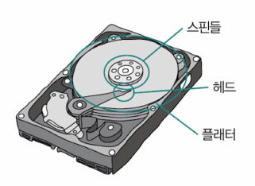
      - 플래터(원판) 위에 있는 뵤족한 리더기인 헤드를 통해 플래터에 저장된 데이터에 접근할 수 있음
  - 플래시 메모리 기반 저장장치
    - 전기적인 방식으로 데이터를 읽고 쓰는 반도체 기반의 저장장치
      - 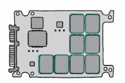
      - ex) USB, SD카드, SSD(Solid-State Drive)
      - 보조기억장치로 주로 사용되는 플래시 메모리: SSD
- 보조기억장치의 본분
  - 전원이 꺼져도 데이터를 안전하게 보관하는 것
  - CPU가 필요로 하는 정보를 조금이라도 빠른 성능으로 메모리에게 전달하는 것

- RAID(Redundant Array of Independent Disks)
  - 데이터의 안전성 혹은 성능을 확보하기 위해 여러 개의 독립적인 보조기억장치를 마치 하나의 보조기억장치처럼 사용하는 기술
  - 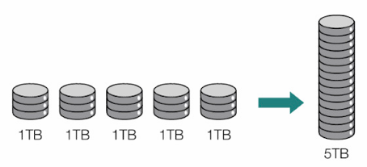

- RAID를 구성하는 방법(RAID 레벨)
  - RAID0
  - RAID1
  - RAID2
  - RAID3
  - RAID4
  - RAID5
  - RAID6
    - 파생된 RAID 레벨
      - RAID10
      - RAID50 

### RAID0
- 데이터를 여러 보조기억장치에 단순하게 나누어 저장하는 구성 방식
- 스트라입(stripe): 줄무늬처럼 분산되어 저장된 데이터
- 스트라이핑(striping): 분산하여 저장하는 동작
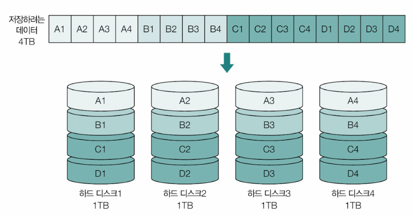
- 장점: 빠른 입출력 속도
  - 4TB인 저장장치 1개를 읽고 쓰는 속도보다 RAID0으로 구성된 1TB 저장장치 4개의 속도가 이론상 4배 가량 빠름
- 단점: 저장된 정보가 안전하지 않음
  - 하드 디스크1에 문제가 생기면 나머지 하드디스크에 저장된 데이터는 불완전한 데이터가 됨

### RAID1
- 완전한 복사본을 만들어 저장하는 구성 방식
- 미러링(mirroring)이라고도 부름
- 쓰기 작업을 할 때는 원본과 복사본 두 곳에 써야하므로 RAID0보다 쓰기 속도는 느림
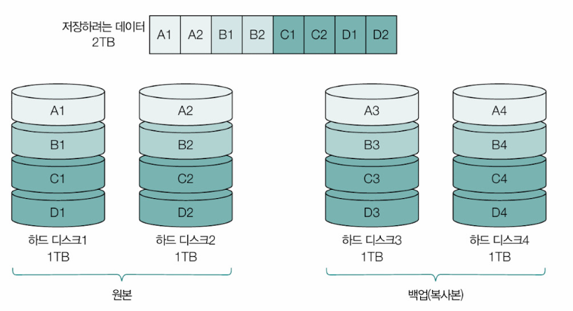
- 장점: 복구가 간단하고 안전성이 높다
- 단점: 복사본이 저장된 크기만큼 사용  가능한 용량이 적어진다

### RAID4
- 패리티 정보를 저장하는 디스크를 따로 두는 구성 방식
  - 패리티(parity): 오류를 검출할 수 있는 정보
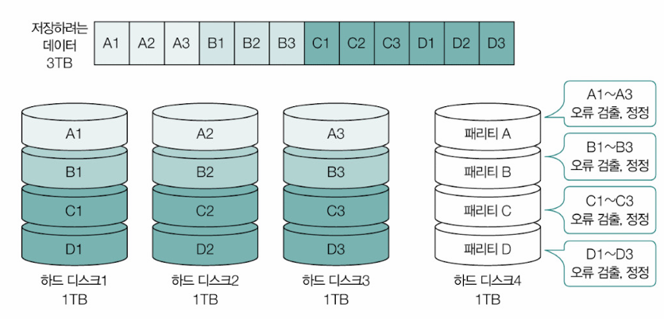
- 장점: RAID1에 비해 적은 하드디스크로도 안전하게 데이터를 보관할 수 있음
- 단점: 패리티를 저장하는 장치에 병목 현상이 발생

### RAID5
- 패리티를 분산하여 저장하는 구성방식
- RAID4의 단점인 병목 현상 보완 가능
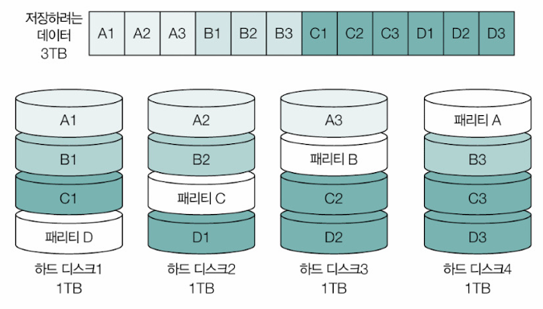

### RAID6
- 서로 다른 2개의 패리티를 두는 구성 방식
- 오류를 검출하고 복구할 수 있는 수단이 2개가 생긴 셈
- RAID4나 RAID5에 비해 안정성이 높음
- 새로운 정보를 저장할 때마다 함께 저장할 패리티가 2개이르로 RAID5에 비해 쓰기 속도는 일반적으로 느림
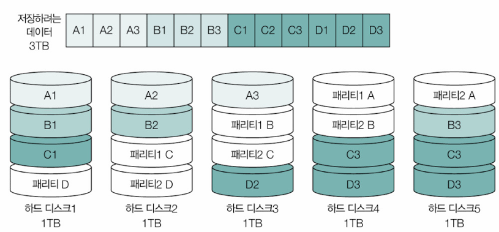

> **Nested RAID**
> - RAID10: RAID0과 RAID1을 혼합한 방식
> - RAID50: RAID0과 RAID5을 혼합한 방식
> - Nested RAID: RAID10, RAID50과 같이 RAID의 여러 레벨을 혼합한 방식
> 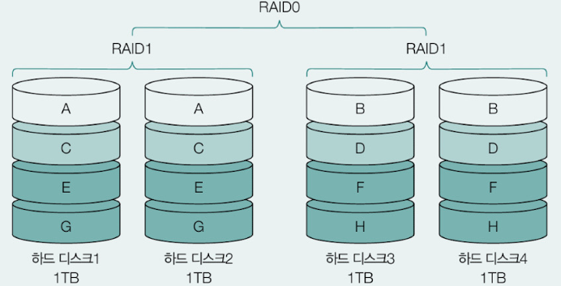

## 입출력 기법
- 입출력장치들이 컴퓨터 내부와 정보를 주고 받는 방식

### 장치 컨트롤러와 장치 드라이버
- CPU는 모든 입출력장치의 작동 방식을 알긴 어려움(∵ 제조사, 규격, 작동방식 상이)
  - => 입출력장치는 CPU와 직접 연결되어 정보를 주고받지 않고 장치 컨트롤러라는 하드웨어를 통해 연결됨
  - 장치 컨트롤러: CPU와 입출력장치 사이의 통신을 중개하는 중개자 역할의 하드웨어
  - 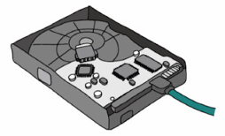
  - CPU가 장치 컨트롤러와 상호작용함으로써 입출력장치를 작동시키는 것 또한 CPU가 실행하는 프로그램을 통해 이루어진다는 말과 같음
    - 장치 드라이브(device driver): 장치 컨트롤러의 동작을 알고, 장치 컨트롤러가 컴퓨터 내부와 정보를 주고받을 수 있도록 하는 프로그램
  - 대중적인 장치 드라이버의 경우, 운영체제에 포함되어 있는 경우가 많으나 대형 프린터와 같이 전형적이지 않은 입출력장치의 장치 드라이버는 별도로 설치해야 함

**CPU와 장치 컨트롤러가 정보를 주고받는 방법**
- 프로그램 입출력
- 인터럽트 기반 입출력
- DMA 입출력

### 프로그램 입출력(Programmed I/O)
- 프로그램 속 명령어로 입출력 작업을 수행하는 방법
- CPU는 입출력 명령어를 실행함으로써 장치 컨트롤러와 상호작용할 수 있으며 이를 통해 입출력 작업을 수행
  - ex) "프린터 컨트롤러의 상태를 확인하라"
  - ex) "하드 디스크 컨트롤러에 10을 써라"

> **프로그램 입출력의 두 종류**
> - 고립형 입출력(isolated I/O)
>   - 입출력장치에 접근하는 주소와 메모리에 접근하는 주소를 별도의 주소 공간으로 간주하는 방식
> - 메모리 맵 입출력(memory mapped I/O)
>   - 입출력장치에 접근하는 주소 공간과 메모리에 접근하는 주소 공간을 구분하지 않고, 메모리에 부여된 주소 공간 일부를 입출력장치를 식별하기 위한 주소 공간으로 사용하는 방식
> 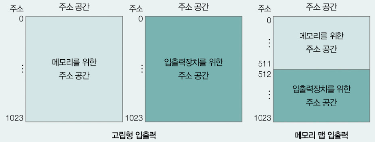

### 인터럽트 기반 입출력: 다중 인터럽트
- 여러 종류의 입출력장치를 동시에 사용하는 상황에서 CPU는 동시 다발적으로 발생하는 입출력장치들의 인터럽트를 모두 처리해야 함
- CPU가 플래그 레지스터 속 인터럽트 비트를 비활성화한 채 인터럽트를 처리할 경우, 다른 하드웨어 인터럽트를 받아들이지 않음

- 인터럽트는 일반적으로 우선순위가 더 높은 인터럽트가 우선적으로 처리됨
- CPU는 플래그 레지스터 속 인터럽트 비트가 활성화되어 있는 경우 혹은 인터럽트 비트를 비활성화해도 무시할 수 없는 인터럽트인 NMI(Non-Maskable Interrupt)가 발생한 경우 아래와 같이 우선순위가 높은 인터럽트부터 먼저 처리
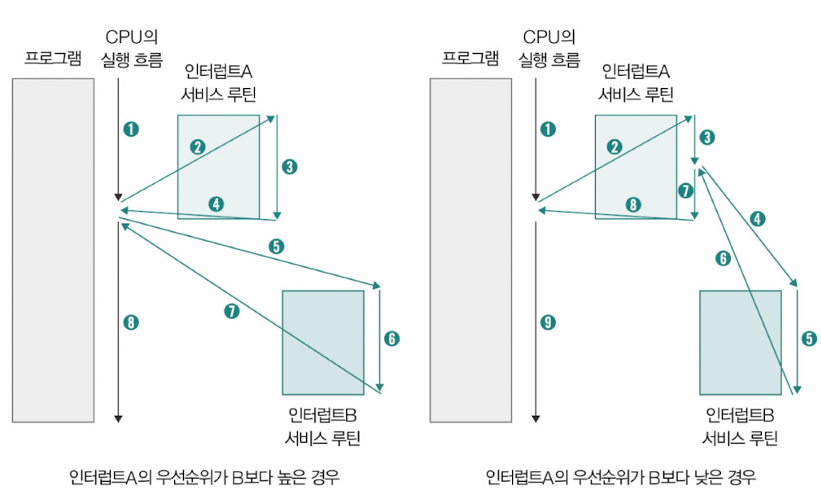

- 프로그래머블 인터럽트 컨트롤러(이하 PIC, Programmable Interrupt Controller): 다중 인터럽트를 처리하기 위해 사용되는 하드웨어
  - 여러 장치 컨트롤러와 연결되어 있어 장치 컨트롤러에서 보낸 하드웨어 인터럽트 요청들의 우선순위를 판별한 뒤, CPU에게 지금 처리해야 할 하드웨어 인터럽트가 무엇인지를 알려주는 장치
  - 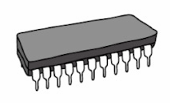
  - 각각의 핀에는 CPU에게 하드웨어 인터럽트 요청을 보낼 수 있도록 약속된 하드웨어가 연결되어 있음
> PIC가 NMI까지 우선순위를 판별하진 않음

  - 일반적으로 2개 이상의 계층으로 구성됨
  - 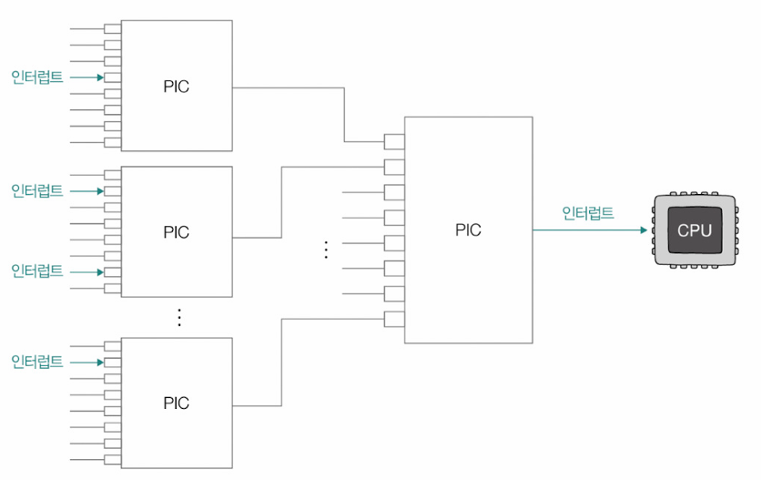
  - 윈도우의 경우 `[장치관리자]-[인터럽트 요청(IRQ)]`에서 확인 가능
  - 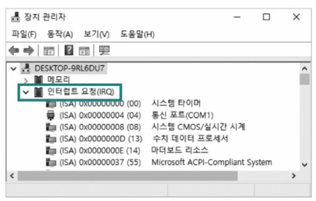

### DMA 입출력
- 프로그램 기반 입출력과 인터럽트 기반 입출력의 공통점: CPU가 입출력장치와 메모리간의 데이터 이동을 주도해야 하며, 이동하는 데이터들도 반드시 CPU를 거친다는 것
- ex) 입출력장치의 데이터를 메모리에 저장하는 경우
- 1) 장치 컨트롤러로부터 데이터를 하나씩 읽어 레지스터에 적재
- 2) 적재한 데이터를 하나씩 메모리에 저장
- 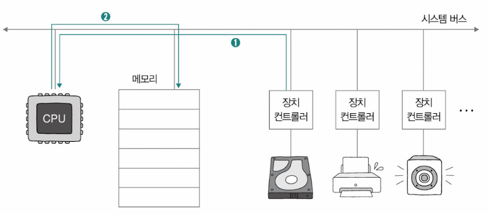

- 모든 데이터가 반드시 CPU를 거치는 건 비효율적임 => DMA
- DMA(Direct Memory Access): 직접 메모리에 접근할 수 있는 입출력 기능
- DMA 입출력을 위해서는 시스템 버스에 연결된 DMA 컨트롤러라는 하드웨어가 필요
- DMA 컨트롤러가 포함될 경우 DMA 컨트롤러는 시스템 버스에 연결되고, 입출력장치들의 장치 컨트롤러들은 입출력 버스(input/output bus)라는 입출력장치 컨트롤러의 전용 버스와 연결됨
- 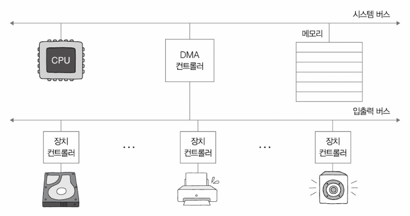

**DMA 입출력 과정**
1. CPU가 DMA 컨트롤러에게 입출력장치의 주소, 수행할 연산, 연산할 메모리 주소 등의 정보와 함께 입출력 작업을 명령
2. DMA 컨트롤러가 CPU 대신 장치 컨트롤러와 상호작용하며 입출력 작업을 수행함. 이때 DMA 컨트롤러는 필요한 경우 메모리에 직접 접근하여 정보를 읽거나 씀. 입출력장치와 메모리 사이에 주고받을 데이터가 CPU를 거치지 않음
3. DMA 컨트롤러는 입출력 작업이 끝나면 CPU에게 인터럽트를 걸어 작업이 끝났음을 알림

- CPU 입장에서는 DMA 컨트롤러에게 입출력 작업 명령을 내리고, 인터럽트만 받으면 됨

> **사이클 스틸링**
> - 시스템 버스는 동시 사용이 불가능함
> - DMA 컨트롤러는 CPU가 시스템 버스를 사용하지 않을 때마다 조금씩 사용하거나, CPU가 시스템 버스 사용을 양보하게 됨
> - => 사이클 스틸링(cycle stealing)이라고 부름

- PCIe(Peripheral Component Interconnect express): PCI라는 입출력 버스의 발전된 형태
  - 가장 대중적으로 볼 수 있는 입출력 버스 중 하나
  - SSD, GPU 네트워크 인터페이스 카드 등 다양한 입출력장치를 연결할 수 있음
  - 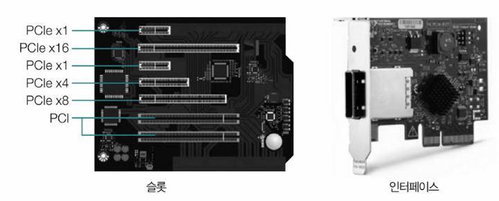

- PCIe버전에 따라 최대 속도가 달라질 수 있음
  - 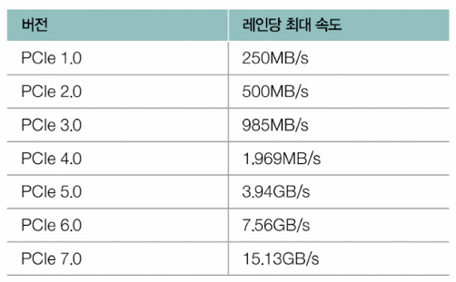
- PCIe 버스가 여러 레인을 이용해 정보를 주고받을 수 있음
  - 레인(lane): PCIe 버스를 통해 정보를 송수신하는 단위
  - 레인의 수가 2개, 4개, 8개가 되면 한 번에 통신을 주고받을 수 있는 양도 2배 4배 8배가 됨
  - PCIe 4.0 × 4 => 4개의 레인을 활용하는 PCIe 4.0

## 추가학습 NOTE
### GPU의 용도와 처리 방식
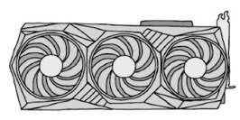
- GPU(Graphic Processing Unit): 그래픽 처리 장치
  - 화면에 그림을 그리는 등 대량의 그래픽 연산을 위해 탄생한 장치
  - GPU의 연산 가능 범위가 CPU의 연산 범위까지 확대되어 딥러닝 연산, 가상화폐 채굴 등 다양한 분야에 대한 연산이 가능해짐
    - GPGPU(General-Purpose computing on Graphics Processing Units): 범용적인 목적의 GPU 사용 기술
- 특징: 코어 개수
  - GPU 개별 코어의 성능은 CPU의 코어보다 떨어지지만, 수백 개에서 많게는 수천 개의 코어가 포함되어 있음 => 병렬 처리에 용이함
    - 병렬 처리(parallel processing): 여러 개로 쪼개진 문제를 나눈 뒤, 각 코어에서 처리하는 연산 방식
    - 1. 어떠한 크고 복잡한 문제를
    - 2. 쉽고 간단한 여러 문제로 쪼갠 뒤
    - 3. 쉽고 간단한 문제를 처리할 수 있는 수단을 동시에 동원하여 빠르게 문제를 해결하는 방식
    - 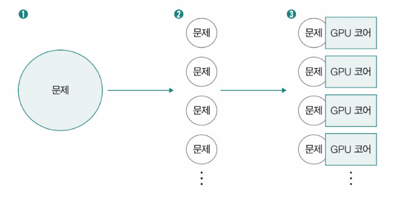
  - GPU는 자체적으로 캐시 메모리를 갖추고 있고, 많게는 수십 기가바이트에 이르는 메모리도 가지고 있음

- GPU가 CPU를 완전히 대체할 수 있는 건 아님
- CPU는 메모리 접근을 가급적 최소화하는 것을 목표로 함
- GPU는 메모리의 대역폭을 넓혀 최대한 많은 코어가 많은 작업을 받아 처리하는 것을 목표로 함
- GPU는 주로 산술 연산과 같이 단순한 연산을 빠르게, 병렬적으로 수행하기 위한 장치
- CPU는 범용적인 연산을 수행하기 위한 장치
  - GPU가 CPU의 산술 연산을 보조한다는 점에서 GPU를 보조프로세서(coprocessor)라고 부르기도 함
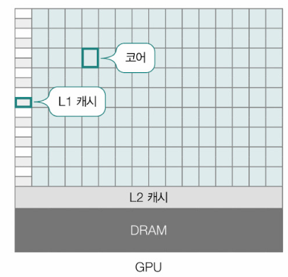
- GPU는 프린터, 키보드와 같은 입출력장치와 달리 직접 소스 코드를 통해 수행할 작업을 지정하는 경우가 많음
- 엔비디아(Nvidia)가 개발한 CUDA를 이용하면 일반적인 프로그래밍 언어를 통해 GPU가 수행할 작업을 쉽게 작성할 수 있음

**CUDA의 구성**
- 호스트 코드(host code): CPU가 실행할 코드
- 디바이스 코드(device code): GPU가 실행할 코드
▼ CUDA 프로그램 코드 예\
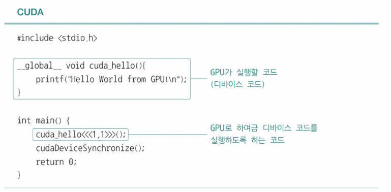
- CPU가 호스트 코드(main 함수)를 실행하다가 디바이스 코드(cuda_hello 함수)를 맞닥뜨리면 GPU가 실행할 디바이스 코드가 GPU 메모리로 복사되고, GPU는 복사된 디바이스 코드를 실행해 CPU에 실행 결과를 알림