- [3.6\_파일 시스템](#36_파일-시스템)
  - [파일과 디렉터리](#파일과-디렉터리)
    - [파일](#파일)
    - [디렉터리](#디렉터리)
    - [파일 할당](#파일-할당)
  - [파일 시스템](#파일-시스템)
    - [아이노드 기반 파일 시스템](#아이노드-기반-파일-시스템)
    - [마운트](#마운트)
- [추가학습 NOTE](#추가학습-note)
  - [전원 버튼을 누르고 부팅이 되기까지](#전원-버튼을-누르고-부팅이-되기까지)
  - [가상 머신과 컨테이너](#가상-머신과-컨테이너)


# 3.6_파일 시스템
- 파일 시스템(file system): 보조기억장치의 정보를 파일 및 디렉터리(폴더)의 형태로 저장하고 관리할 수 있도록 하는 운영체제 내부 프로그램
- 한 운영체제 내에서도 여러 파일 시스템을 사용할 수 있음
- 파일 시스템이 달라지면 보조기억장치의 정보를 다루는 방법도 달라지게 됨

## 파일과 디렉터리
### 파일
- 파일(file)의 구성
  - : 파일의 이름, 파일을 실행하기 위한 정보, 파일과 관련한 부가 정보
    - 파일과 관련한 부가 정보 === 속성(attribute) or 메타데이터(metadata)
    - ex) 파일의 형식, 위치, 크기 등
- 파일을 다루는 모든 작업이 운영체제에 의해 이뤄짐 => 응용프로그램은 파일을 다루는 시스템 콜을 이용해야 함

- 프로세스가 시스템 콜을 통해 읽고 쓸 수 있는 10개의 파일을 할당받았다면 프로세스는 할당 받아 사용중인 파일을 구분할 수 있어야 함 => 파일 디스크립터
- 파일 디스크립터(file descriptor, 윈도우: file handle(파일 핸들)): 저수준에서 파일을 식별하는 정보로, 0 이상의 정수 형태를 띄고 있음
  - 저수준의 파일 식별 및 입출력에 자주 사용됨
- 운영체제는 프로세스가 새로 파일을 열거나 생성할 때 해당 파일에 대한 파일 디스크립터를 프로세스에 할당

- ex) 
- open() 
  - 파일을 여는 데 사용되는 시스템 콜
  - => 연 파일의 파일 디스크립터를 반환
- write()
  - 파일 입출력을 위한 시스템 콜
  - =>파일 디스크립터를 입자로 받음
- close()
  - 파일을 닫는 시스템 콜
  - =>파일 디스크립터를 입자로 받음

▼ open(), write(), close() 파일 디스크립터를 이용해 'example.txt', 'example2.txt', 'example3.txt'라는 파일에 "Hello World!"를 입력하는 코드 예\
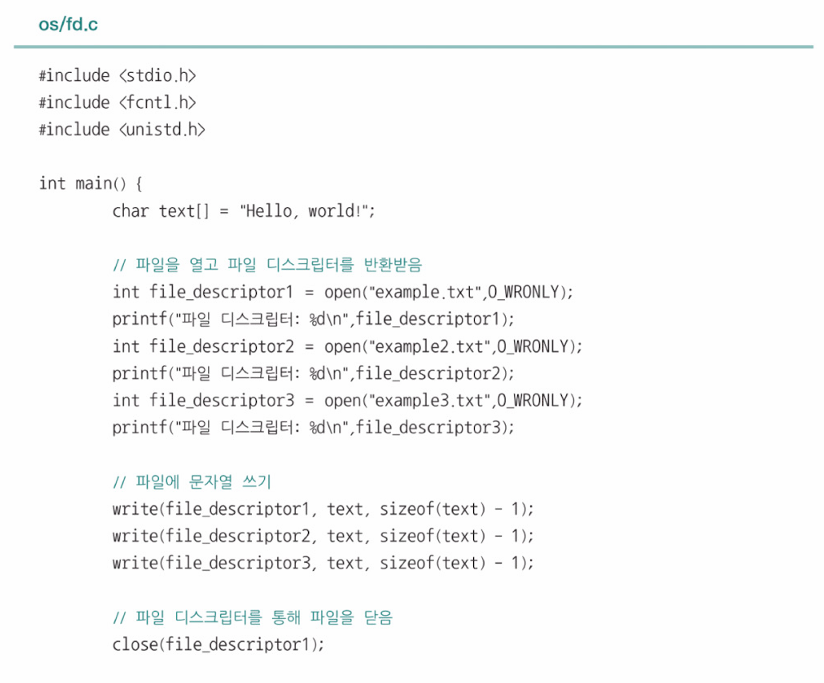
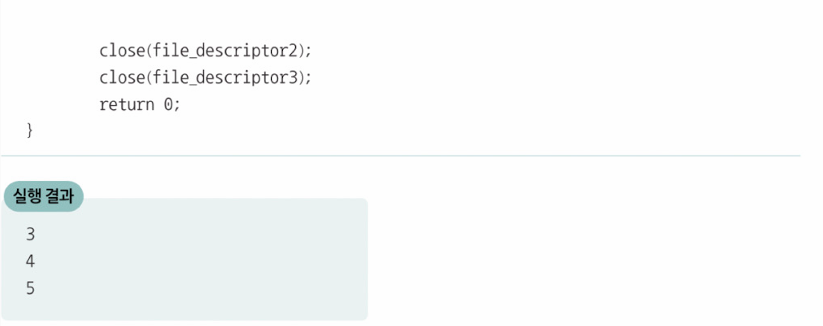

> **파일 디스크립터는 파일만 식별하지는 않는다**
> - 파일뿐만 아니라 입출력장치, IPC의 수단인 파이프, 소켓 또한 (일종의 파일로 간주하여)파일 디스크립터로 식별
> - 위의 예제에서 파일 디스크립터가 3부터 할당된 이유는 파일 디스크립터 '0, 1, 2'가 이미 표준 입력, 표준 출력, 표준 에러를 나타내기 위해 할당되었기 때문
> 


### 디렉터리
- 디렉터리는 여러 계층을 가진 트리 구조 디렉터리(tree-structured directory)로 관리됨
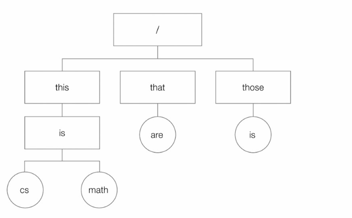
- 루트 디렉터리(root directory): (/), 최상위 디렉터리
- 경로(path): 디렉터리 정보를 활용해 파일 위치를 특정하는 정보
  - 위의 그림에서의 cs라는 파일은 `/this/is/cs`로 표현할 수 있음
> 윈도우 운영체제에서 최상위 디렉터리를 `C:￦`로 표현하고, ￦(백슬래시)를 디렉터리 구분자로 사용


- 많은 운영체제는 디렉터리를 조금 특별한 파일(디렉터리에 속한 요소의 관련 정보가 포함된 파일)로 간주
- 디렉터리에 속한 요소의 관련 정보는 테이블(표)의 형태로 표현
- 디렉터리 엔트리(directory entry): 테이블 형태로 표현된 정보의 행 하나 하나
  - '파일 이름', '파일이 저장된 위치를 유추할 수 있는 정보'가 반드시 포함되어 있음
  - 보조기억장치에 저장되어 있는 위치 혹은 디렉터리에 속한 다른 디렉터리의 위치를 알 수 있음
- ex)
- 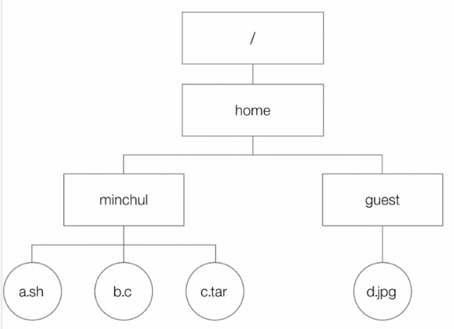
- 'home' 디렉터리와 'minchul' 디렉터리는 아래와 같이 파일의 이름과 위치 정보가 포함되어 있음
- 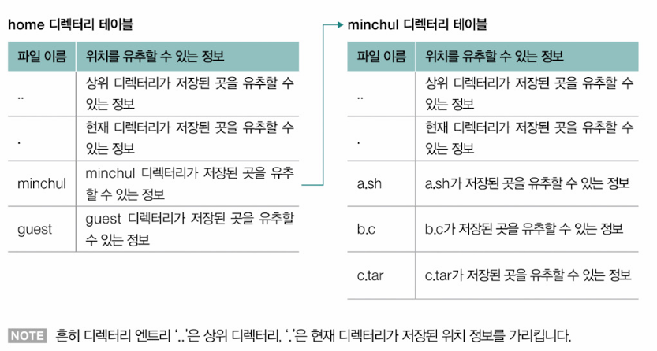
- 일부 파일 시스템은 아래와 같이 디렉터리 엔트리에 파일의 속성을 함께 명시하기도 함
- 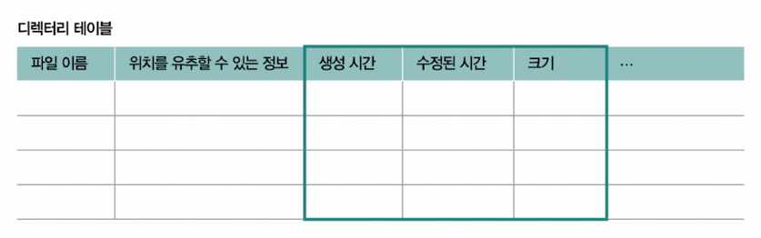

▼ 리눅스 운영체제의 디렉터리 엔트리\
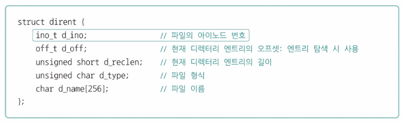

### 파일 할당
- 블록(block): 운영체제가 파일과 디렉터리를 읽고 쓰는 단위
  - 하나의 파일이 보조기억장치에 저장될 때는 하나 이상의 블록을 할당받아 저장됨
  - 블록 하나는 보통 4096바이트 정도
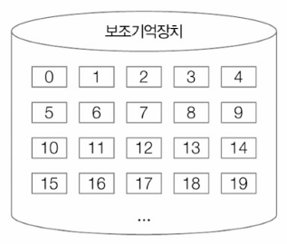

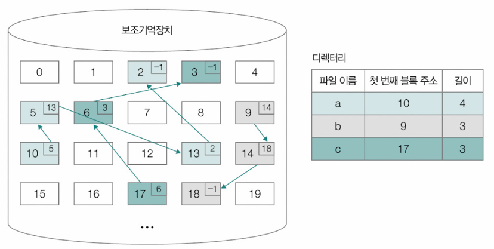
- 연결 할당(linked allocation): 각 블록의 일부에 다음 블록의 주소를 저장하여 각각의 블록이 다음 블록을 가리키는 형태로 할당하는 것
  - 디렉터리 엔트리에 명시되는 정보: 파일 이름, 파일을 이루는 첫 번째 블록 주소, 파일을 이루는 블록 단위의 길이
  - 블록이 없다는 표현을 -1로 표시함

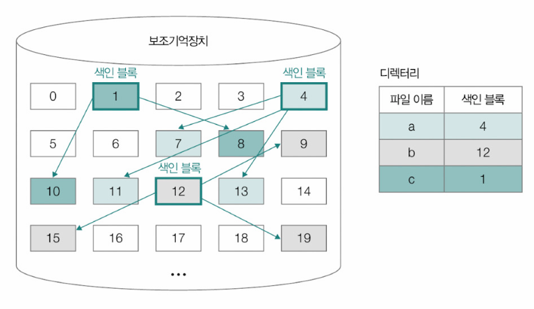
- 색인 할당(Indexed allocation): 파일을 이루는 모든 블록의 주소를 색인 블록(index block)이라는 특별한 블록에 모아 관리하는 방식
  - 디렉터리 엔트리에 명시되는 정보: 파일 이름, 색인 블록 주소

## 파일 시스템
- 파일 시스템의 종류는 다양함
- 운영체제마다 다른 파일 시스템 지원
- 같은 운영체제라도 다른 파일 시스템을 사용하거나 하나의 컴퓨터에서 여러 파일 시스템을 사용할 수 있음
> **파티셔닝**
> - 보조기억장치의 영역을 구획하는 작업
> - 파티션(partition): 파티셔닝되어 나누어진 하나 하나의 영역
> - 파티션마다 다른 파일 시스템을 사용할 수 있음
> 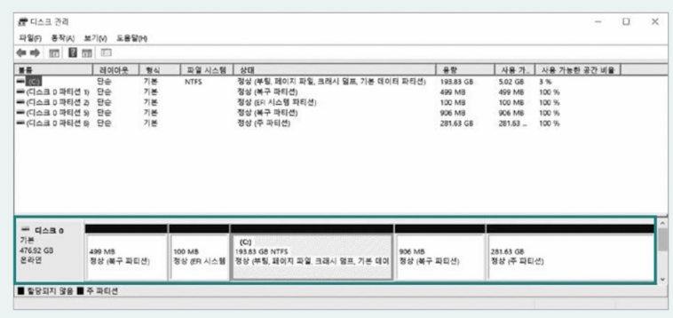


- 포매팅(formatting): 파일 시스템을 설정하여 어떤 방식으로 파일을 저장하고 관리할 것인지를 결정하고, 새로운 데이터를 쓸 준비를 하는 작업
  - 어떤 파일 시스템을 사용할지는 보조기억장치를 포매팅할 때 결정할 수 있음

- ex) USB 메모리의 포매팅과 데스크탑에 리눅스 운영체제(Red Hat Enterprise Linux 7.1)를 설치하는 과정에서 SSD를 포매팅하는 화면
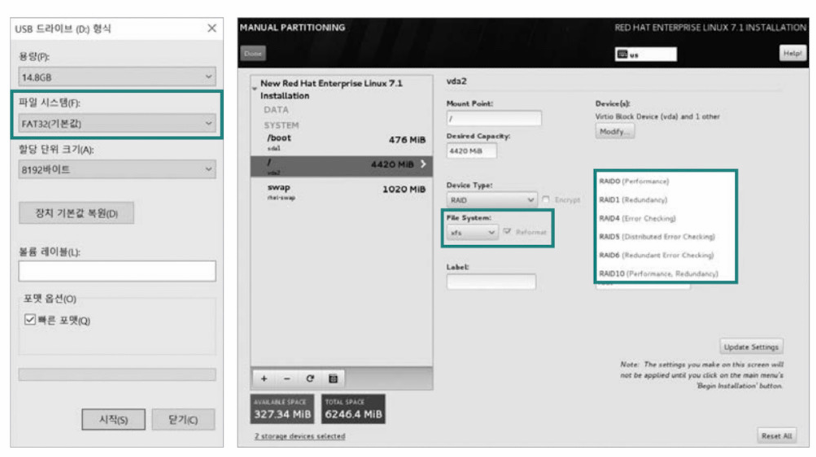

- 운영체제별로 지원하는 파일 시스템의 종류는 다양함
- 파일 시스템마다 제공되는 기능과 특성, 성능, 지원하는 최대 파일 크기 등이 다를 수 있음
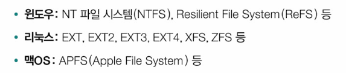
- EXT, EXT2, EXT3, EXT4, XFS, ZFS 등에서는 아이노드라는 색인 블록을 기반으로 파일을 할당함
- 아이노드에는 파일이 저장된 위치와 속성 등 파일 이름을 제외한 파일의 모든 것이 담겨있음


### 아이노드 기반 파일 시스템
- 아이노드(i-node, index-node)기반 파일 시스템에서는 파일마다 각각의 아이노드를 가지고 있으며 아이노드에는 각각의 번호가 부여되어 있음
- ▼ 맥OS나 리눅스 운영체제에선 ls 커맨드의 i 옵션을 통해 확일할 수 있음
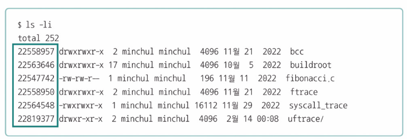

- ex) EXT4 파일 시스템(아이노드 기반 파일 시스템)
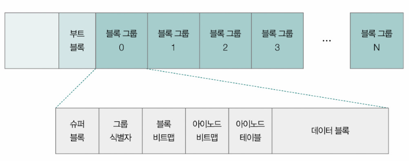

- 여러 블록의 그룹으로 이루어져있음
  - 첫 번째 부트 블록 영역: 
    - 실질적인 파일 데이터가 저장되는 영역은 아님
    - 부팅과 파티션 관리를 위한 특별한 정보가 모여 있는 영역
  - 각 블록 그룹은 슈퍼 블록, 그룹 식별자, 블록 비트맵, 아이노드 비트맵, 아이노드 테이블, 데이터 블록으로 구성됨
  - 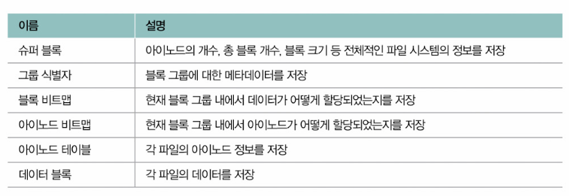
  - 아이노드는 파티션 내 특정 영역에 모여 있음
  - 아이노드 기반 파일 시스템에서는 데이터 영역에 공간이 남아 있더라도 아이노드 영역이 가득 차 더 이상의 아이노드를 할당할 수 없다면 운영체제는 새로운 파일을 생성할 수 없음


> **하드 링크와 심볼릭 링크**
> - 디렉터리 A에 속한 파일 A가 있다고 가정했을 때, 디렉터리 엔트리에 파일 이름(A)과 아이노드 번호가 명시되어 있다면 해당 아이노드에 접근할 수 있고, 아이노드를 통해 파일 데이터에 접근할 수 있음
> 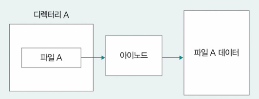
>
> - 이런 아이노드를 조금만 응용하면 동일한 파일 속성과 데이터 블록을 공유하는 다른 이름의 파일(하드 링크(hard link) 파일)을 만들 수 있고, 윈도우의 바로가기 파일처럼 파일을 가리키는 파일(심볼릭 링크(symbolic link) 파일)을 만들 수 있음
> 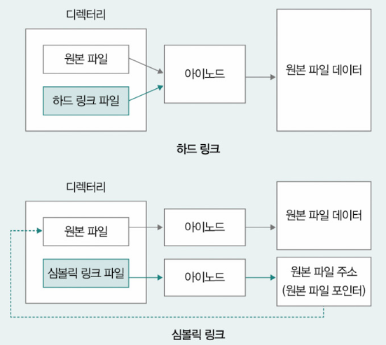
>
> 
> - 하드 링크는 같은 아이노드 번호를 갖는 파일을 생성하는 작업 => 하드 링크 파일과 원본 파일은 같은 파일 데이터를 공유, 하드 링크 파일을 변경하면 원본 파일도 변경됨.
>   - 하드 링크 파일이 남아있다면 원본 파일이 삭제되거나 이동되더라도 파일 데이터에 접근할 수 있음
> - 심볼릭 링크 파일은 같은 파일 데이터를 공유하지 않고 원본 파일의 위치만을 저장 => 원본 파일이 삭제되거나 이동되는 경우에는 사용이 불가


### 마운트
- 마운트(mount): 어떤 저장장치의 파일 시스템에서 다른 저장장치의 파일 시스템으로 접근할 수 있도록 파일 시스템을 편입시키는 작업
  - USB메모리를 데스크탑 컴퓨터에 연결하면 데스크톱 컴퓨터의 파일 시스템을 통해 USB 메모리의 파일 시스템에 접근 가능 → USB 메모리의 파일 시스템이 데스크톱 컴퓨터의 파일 시스템에 마운트 되었기 때문


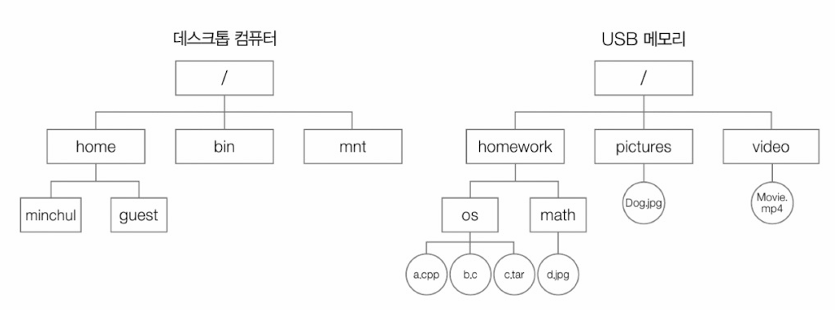
- USB 메모리의 파일 시스템을 컴퓨터의 '/mnt' 경로로 마운트 하면 USB 메모리의 파일 시스템은 아래와 같이 '/mnt'경로를 통해 연결됨
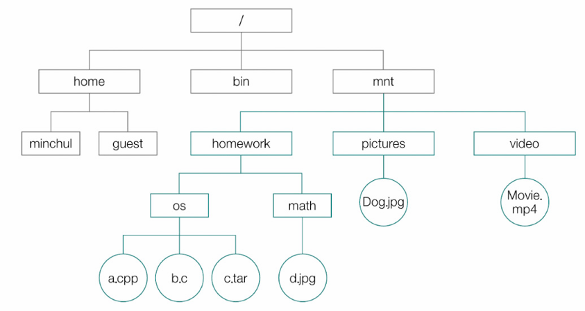

- 일부 운영체제(맥OS)의 경우 아래와 같은 설정 메뉴를 통해 간단히 마운트하거나 마운트 해제(추출)할 수 있음
- 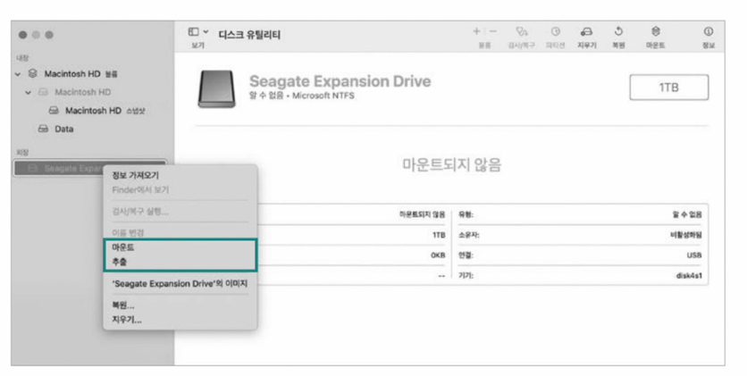
  
- 유닉스나 리눅스 같은 운영체제들은 아래와 같이 명령어를 기반으로 마운트하기도 함
```
# mount -t ext4 -o ro /dev/sda /mnt/test
```


# 추가학습 NOTE
## 전원 버튼을 누르고 부팅이 되기까지
- 부팅(booting, 시스템 부팅): 커널을 메모리에 적재하여 컴퓨터를 시작하는 과정
- 처음 컴퓨터의 전원 버트을 누르면 휘발성 메모리인 RAM이 아닌 비휘발성 메모리인 ROM과 같은 메모리에서 정보를 읽어 들이게 됨
- CPU는 컴퓨터 전원이 들어오면 미리 정해진 특정 주소를 읽어들이는데, 이 주소에는 아래와 같은 바이오스(BIOS, Basic Input/Output System)라는 프로그램이 있음
- 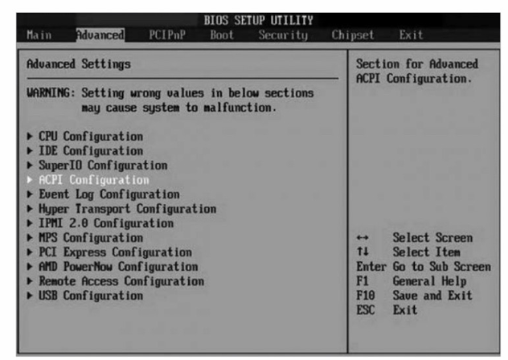
- 바이오스는 하드웨어를 검색할 뒤 문제가 있는지 여부를 검사(POST, PowerOn Self Test)
- 이상이 없으면 보조기억장치의 마스터 부트 레코드(이하 MBR, Master Boot Record)라는 영역으로부터 부팅에 필요한 특별한 정보를 읽어오게 됨
- 일반적으로 보조기억장치의 첫 부분(하드 디스크의 경우 첫 번째 섹터)에 위치해 있는 MBR에는 부트스트랩(bootstrap)이라는 특별한 프로그램이 있음
  - 보통 부트 로더라고도 부르며 커널의 위치를 찾아 메모리에 적재하는 프로그램임
- 바이오스는 최근 대용량 환경에서도 부팅이 가능하고, 빠르고 안전한 부팅 기능 및 그래픽 인터페이스를 지원하는 UEFI(Unified Extensible Firmware Interface, 통합 확장 펌웨어 인터페이스)로 대체되는 추세
- 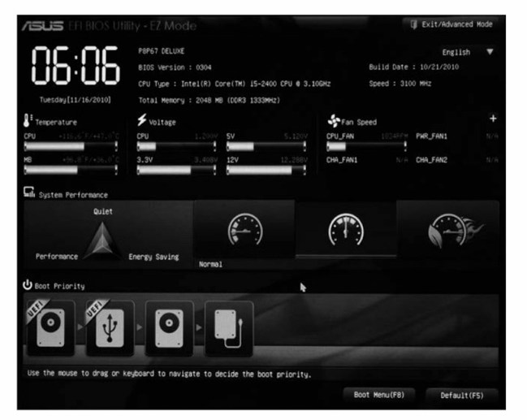


## 가상 머신과 컨테이너
- 가상 머신(virtual machine): 소프트웨어적으로 만들어 낸 가상의 컴퓨터
- 하이퍼바이저(hypervisor): 가상 머신을 만들고 실행하기 위해 사용하는 소프트웨어
  - 하이퍼바이저를 통해 기존 운영체제(호스트 OS)와 독립된 환경을 구축할 수 있고, 현재의 환경 상에서 또 다른 운영체제(게스트 OS) 및 애플리케이션을 작동시킬 수 있음

- ex) 윈도우 운영체제의 대표적인 하이퍼바이저 중 하나인 VirtualBox를 활용해 리눅스 운영체제가 설치된 가상 머신을 생성하는 화면
- 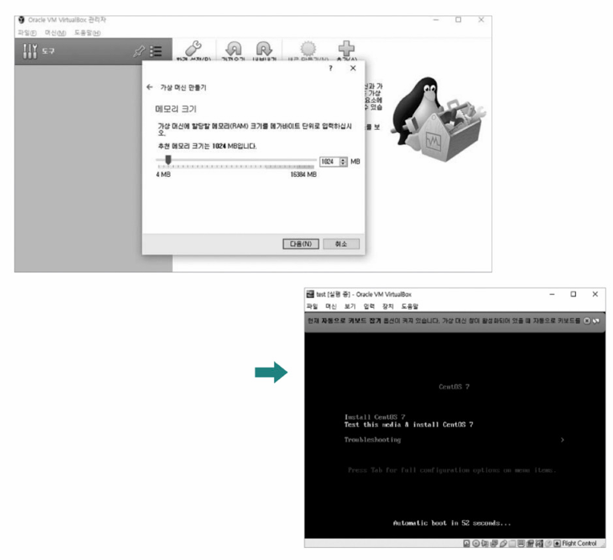


- 하이퍼바이저는 하드웨어 수준의 자원 격리 및 가상화를 제공한다는 점에서 중요
- 하이퍼바이저가 생성하고 관리하는 가상 머신(들)은 서로가 마치 각기 다른 컴퓨터처럼 작동함
- 장점: 높은 격리성
- 단점: 큰 오버헤드로 인해 속도가 다소 느리거나 용량을 많이 차지함

- 컨테이너(container): 또 다른 가상화 및 자원 격리 기술
  - 대표적인 컨테이너: 도커(docker), LXC 등
  - 운영체제 수준의 가상화 및 자원 격리에 해당함
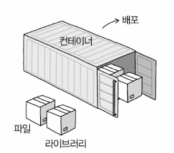


- 각기 독립적인 운영체제(커널)을 유지하는 가상 머신과 달리, 컨테이너는 기본적으로 동일한 커널을 공유
- 하이퍼바이저: 가상 머신에서 어떤 프로세스를 실행할지에 구애받지 않고 가상 머신마다 하드웨어를 격리
- 컨테이너: 주어진 특정 프로세스를 실행하는 데 필요한 자원만을 격리
  - 특정 애플리케이션 실행에 필요한 라이브러리를 비롯한 코드, 파일 등이 모두 담겨 있는 통, 혹은 특정 애플리케이션 실행에 필요한 것들의 묶음이라 생각하면 됨

- 컨테이너 오케스트레이션(container orchestration): 다양한 컨테이너를 관리하는 것
  - 대표적인 컨테이너 오케스트레이션 도구: 쿠버네티스(kubernetes) 등
  - 여러 컨테이너를 자동으로 배포하거나 환경에 맞게 동적으로 컨테이너의 수를 가감할 수 있고, 컨테이너 간 네트워크를 구성할 수 있음
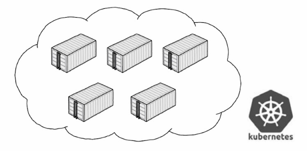
