- [4.6\_그래프](#46_그래프)
  - [그래프의 종류와 구현](#그래프의-종류와-구현)
    - [인접 행렬 기반 그래프 표현](#인접-행렬-기반-그래프-표현)
    - [인접 리스트 기반 그래프 표현](#인접-리스트-기반-그래프-표현)
  - [깊이 우선 탐색과 너비 우선 탐색](#깊이-우선-탐색과-너비-우선-탐색)
    - [깊이 우선 탐색(DFS, Depth-First Search)](#깊이-우선-탐색dfs-depth-first-search)
    - [너비 우선 탐색(BFS, Breath-Frist Search)](#너비-우선-탐색bfs-breath-frist-search)
  - [최단 경로 알고리즘](#최단-경로-알고리즘)

# 4.6_그래프
## 그래프의 종류와 구현
- 그래프(graph): 정점(vertex)이라 불리는 데이터를 간선(edge) 혹은 링크(link)로 연결한 형태의 자료구조

|트리|그래프|
|:-:|:-:|
|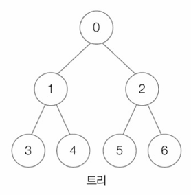|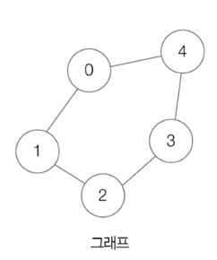|
|사이클을 형성하지 않음|사이클을 형성할 수 있음|
|노드 간에 상하 관계 존재|상하 관계 존재하지 않음|

- 간선이 어떠한 형태로 정점을 연결하느냐에 따라 그래프의 종류가 달라질 수 있음
  - 연결/비연결 그래프
    - 임의의 두 정점 사이를 잇는 경로의 유무로 나뉨
    - 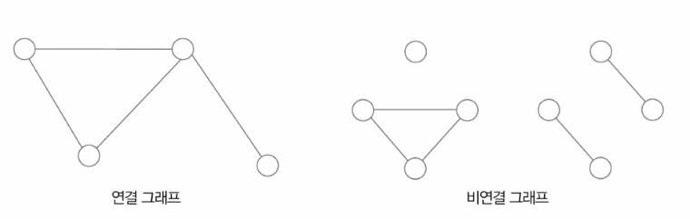
  - 방향/무방향 그래프
    - 간선에 방향의 유무에 따라 나뉨
    - 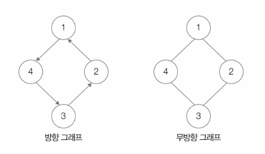
  - 가중치 그래프
    - 간선에 가중치(비용, cost)가 부여된 그래프
      - 가중치는 양수, 음수 모두 가능
  - 서브그래프
    - 부분 그래프
    - 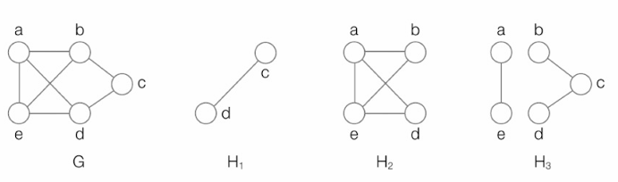

**그래프의 구현 및 메모리에 저장하는 방법**
- 그래프를 인접 행렬로 표현
- 그래프를 인접 리스트로 표현

### 인접 행렬 기반 그래프 표현
- N×N 크기의 행렬로 그래프를 표현하는 방법
  - N: 정점의 개수
  - N×N 행렬의 <행, 열> 값 === <출발 정점, 도착 정점>
  - 연결 되었을 경우: 1, 연결되지 않았을 경우: 0
▼ 방향 그래프 예\
- 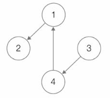
- 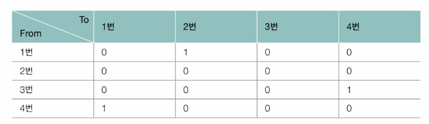

▼ 무방향 그래프 예\
- 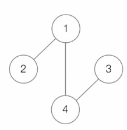
- 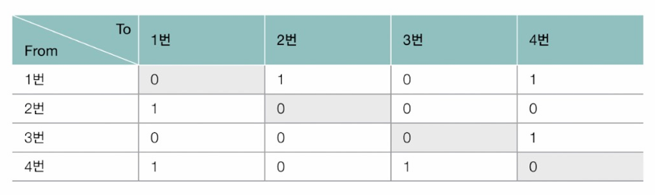

▼ 가중치 그래프 예\
- 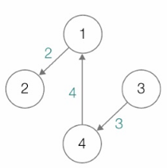
- 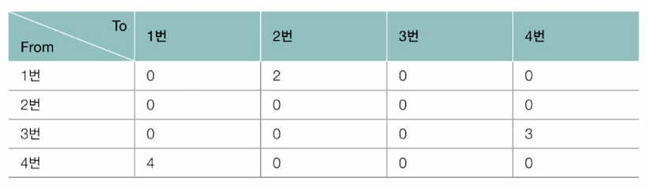

### 인접 리스트 기반 그래프 표현
- 그래프의 특정 정점과 연결된 정점들을 연결 리스트로 표현하는 방법
- 각각의 정점마다 연결 리스트를 가짐

▼ 방향 그래프 예\
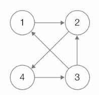
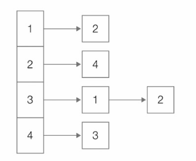
 
▼ 가중치 그래프 예\
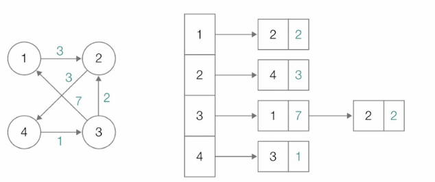

## 깊이 우선 탐색과 너비 우선 탐색
### 깊이 우선 탐색(DFS, Depth-First Search)
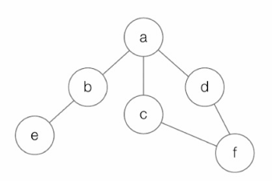
- 위의 예에서는 a → b → e → c → f → d 순서로 탐색하게 됨

- 주로 사용되는 자료구조: 배열, 스택
  - 배열: 특정 정점의 방문 여부를 확인하는 용도
  - 스택: 방문 중 뒤로가기가 필요한 경우 사용

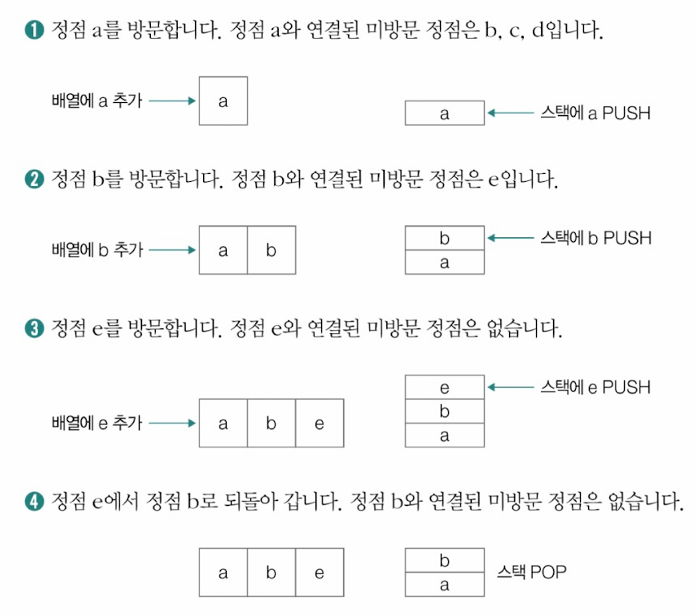
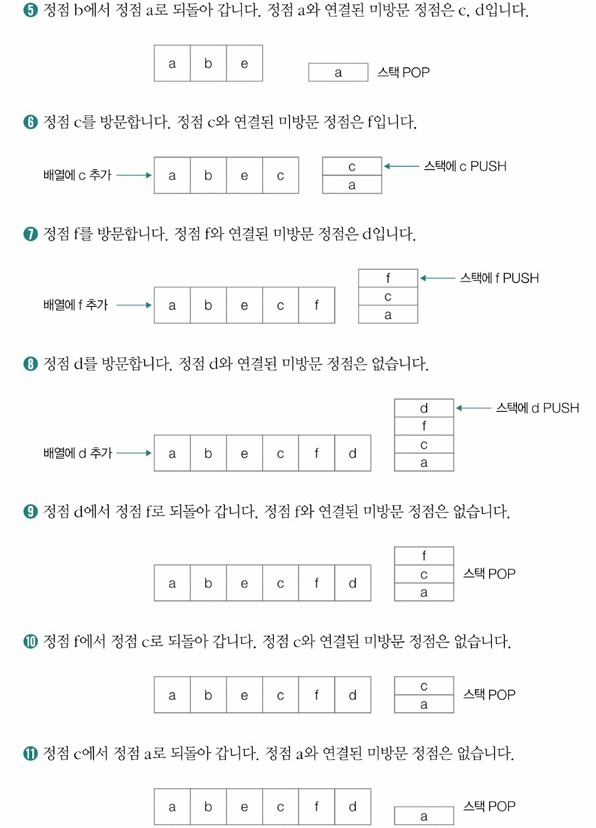

### 너비 우선 탐색(BFS, Breath-Frist Search)
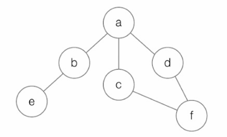
- 위의 예에서는 a → b → c → d → e → f 순서로 탐색하게 됨

- 주로 사용되는 자료구조: 배열, 큐
  - 배열: 특정 정점의 방문 여부를 확인하는 용도
  - 큐: 연결된 정점들을 저장하기 위해 사용

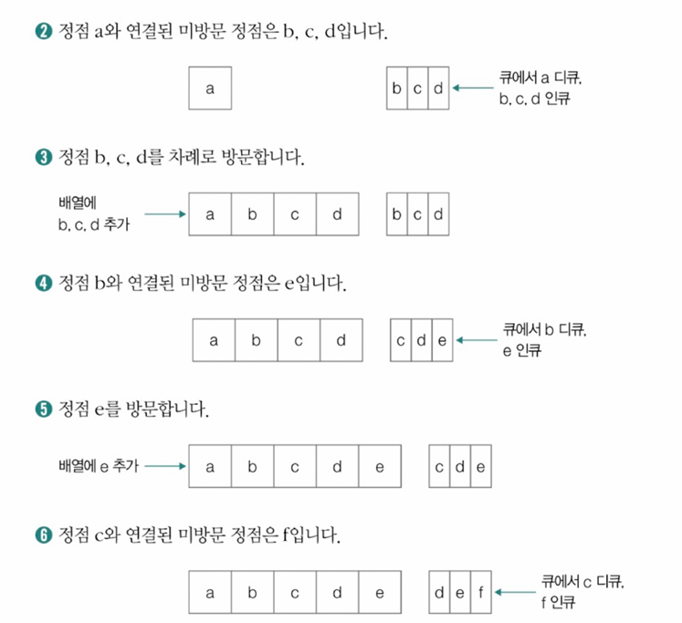
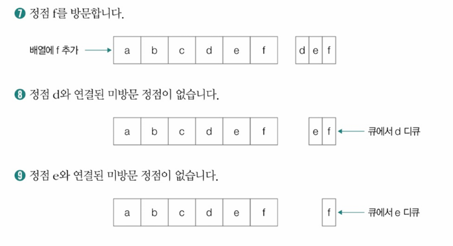

## 최단 경로 알고리즘
- 한 정점에서 목적지 정점까지 이르는 가중치의 합이 최소가 되는 경로를 결정하는 알고리즘
- 대표적인 알고리즘: 다익스트라 알고리즘(Dijkstra's algorithm)
  - 간선의 가중치가 음이 아닌 수라는 가정 하에 사용 가능한 알고리즘

**다익스트라 알고리즘 작동 과정**
1. 최단 거리 테이블 상에서 시작 정점을 제외한 정점들은 모두 충분히 큰 수로 초기화
2. (시작) 정점을 방문
3. 방문한 정점과 인접한 정점들을 탐색
4. 경로 상의 가중치 합과 최단 거리 테이블 상의 값을 비교
5. 최단 거리 테이블을 갱신할 수 있다면 갱신
6. 방문하지 않은 정점 중 최단 거리가 가장 작은 정점을 방문
7. 더 이상 방문할 정점이 없을 때까지 3~6의 과정을 반복하고 종료

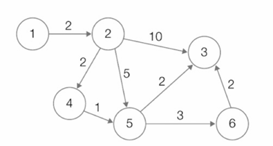
- ex) 시작 정점: 1, 나머지 정점들의 최단 거리를 구하기

1. 
   1. 최단 거리 테이블 상에서 시작 정점을 제외한 정점들은 모두 충분히 큰 수로 초기화
   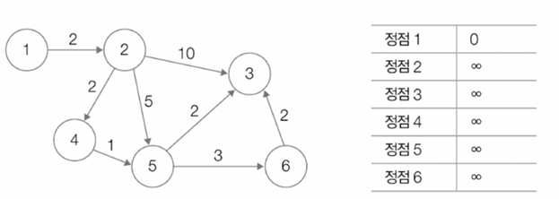
   - 최단 거리 테이블 상에서 시작 정점인 정점 1에서 정점 1까지의 거리는 0으로 표기하고, 나머지 정점들은 모두 충분히 큰 수로 표현

   2. (시작) 정점을 방문
      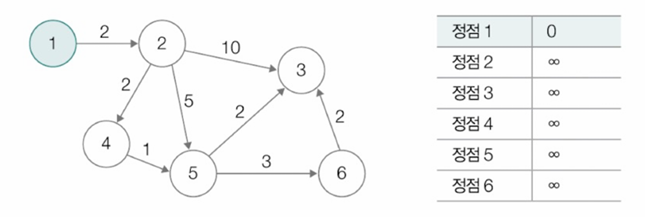

   3. 방문한 정점과 인접한 정점들을 탐색
    - 정점 1과 인접한 정점: 정점 2

   4. 경로 상의 가중치 합과 최단 거리 테이블 상의 값을 비교
      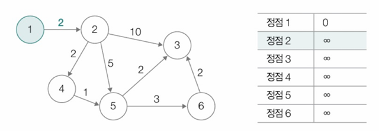

   5. 최단 거리 테이블상의 값을 더 작은 값으로 갱신
      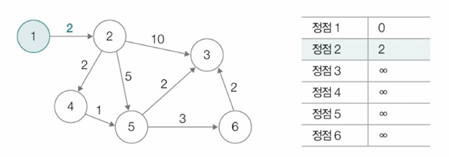
      - 최단 거리 테이블 상의 값 ∞가 정점 2의 가중치 2로 변경됨
      
   6. 방문하지 않은 정점 중 최단 거리가 가장 작은 정점을 방문
      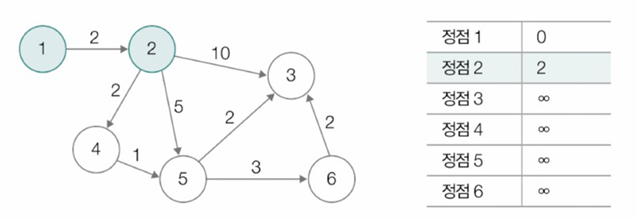
      - 정점 2 방문

   7. 더 이상 방문할 정점이 없을 때까지 3~6의 과정을 반복
    - 아직 방문할 정점들이 있으므로 3으로 돌아가 방문한 정점들을 탐색
    - 정점 2와 인접한 정점: 정점 3, 4, 5

2. 
   4. 다시 경로 상의 가중치 합과 최단 거리 테이블 상의 값을 비교
   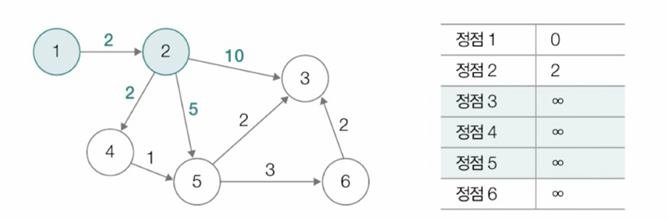
   - 정점 3, 4, 5에 이르는 가중치 합과 최단 거리 테이블 상의 값 비교

   5. 최단 거리 테이블 상의 값을 더 작은 값으로 갱신
    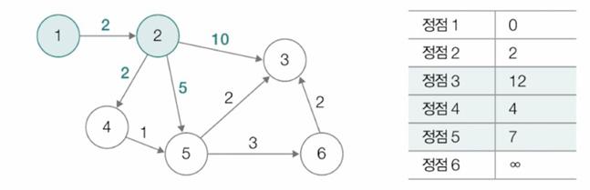

   6. 방문하지 않은 정점 중 최단 거리가 가장 작은 정점을 방문
    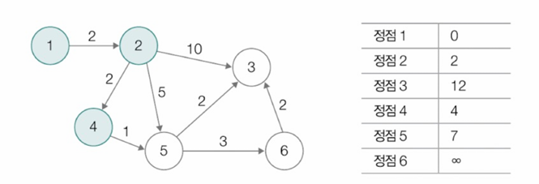
    - 정점 4 방문

3. 
   3. 방문한 정점과 인접한 정점들을 탐색
    - 정점 4와 인접한 정점: 정점 5

   4. 경로 상의 가중치 합과 최단 거리 테이블 상의 값을 비교
    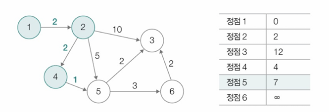
    - 정점 5에 이르는 가중치의 합과 최단 거리 테이블 상의 값을 비교
    - 정점 5에 이르는 가중치의 합: 2+2+1(==5)

   5. 최단 거리 테이블 상의 값을 더 작은 값으로 갱신
    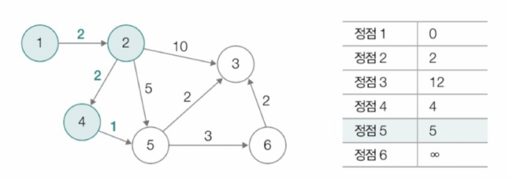
    - 5와 7중에 5가 더 작으므로 갱신

   6. 방문하지 않은 정점 중 최단 거리가 가장 작은 정점을 방문
    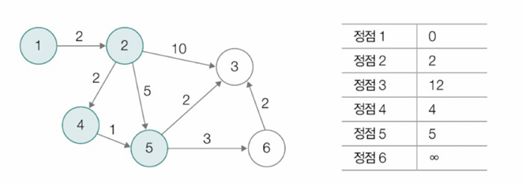
    - 정점 5 방문

4. 
   3. 방문한 정점과 인접한 정점들을 탐색
    - 정점 5와 인접한 정점: 정점 3, 6

   4. 경로 상의 가중치 합과 최단 거리 테이블 상의 값을 비교
    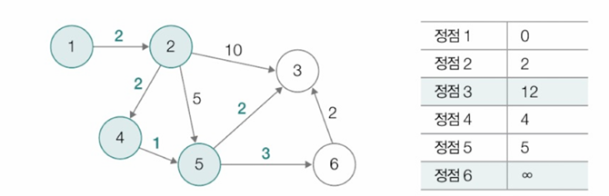
    - 정점 3과 6에 이르는 가중치의 합과 최단 거리 테이블 상의 값을 비교

   5. 최단 거리 테이블 상의 값을 더 작은 값으로 갱신
    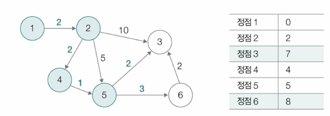

   6. 방문하지 않은 정점 중 최단 거리가 가장 작은 정점을 방문
    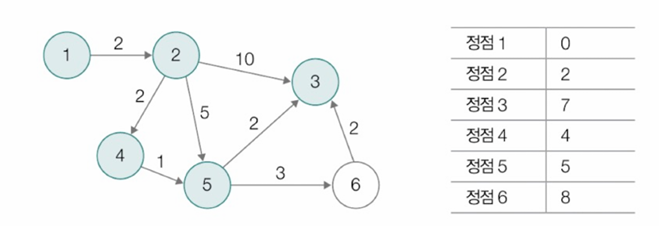
    - 정점 3 방문

5. 
   3. 방문한 정점과 인접한 정점들을 탐색
    - 정점 3에서 갈 수 있는 인접한 정점이 없음 -> 정점 5와 인접한 또 다른 정점을 확인

   6. 방문하지 않은 정점 중 최단 거리가 가장 작은 정점을 방문
    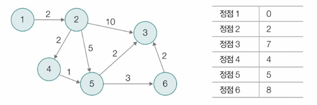
    - 아직 방문하지 않은 정점 6을 방문

6. 
   3. 방문한 정점과 인접한 정점들을 탐색
    - 정점 6과 인접한 정점: 정점 3

   4. 경로 상의 가중치 합과 최단 거리 테이블 상의 값을 비교
    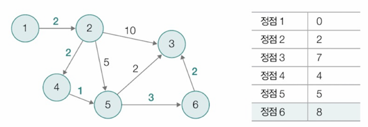
    - 정점 3에 이르는 가중치의 합과 최단 거리 테이블 상의 값을 비교

   5. 최단 거리 테이블 상의 값을 더 작은 값으로 갱신
    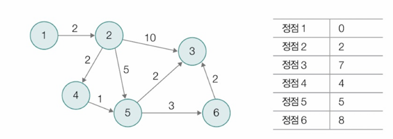
    - 더 이상 방문할 정점이 없으므로 탐색을 종료