- [물리 계층과 데이터 링크 계층](#물리-계층과-데이터-링크-계층)
  - [이더넷](#이더넷)
    - [이더넷 표준](#이더넷-표준)
    - [이더넷 프레임](#이더넷-프레임)
  - [유무선 통신 매체](#유무선-통신-매체)
    - [유선 매체-트위스티드 페어 케이블](#유선-매체-트위스티드-페어-케이블)
    - [무선 매체 - 전파와 WiFi](#무선-매체---전파와-wifi)
  - [네트워크 인터페이스: NIC](#네트워크-인터페이스-nic)
  - [허브와 스위치](#허브와-스위치)
    - [물리 계층의 허브](#물리-계층의-허브)
    - [데이터 링크 계층의 스위치](#데이터-링크-계층의-스위치)

# 물리 계층과 데이터 링크 계층
## 이더넷
- 이더넷(Ethernet): 통신 매체를 통해 신호를 송수신하는 방법, 데이터 링크 계층에서 주고받는 데이터(프레임) 형식 등이 정의된 기술

### 이더넷 표준
- IEEE 802.3이라는 이름으로 국제 표준화 된 기술임
- 서로 다른 제조사의 네트워크 장비라 하더라도 LAN내의 모든 컴퓨터가 문제없이 호환되는 이유: 네트워크 장비들이 관련 표준을 준수하여 제작됨
- ▼ 802.3 뒤에 붙은 알파벳으로 버전을 나타냄
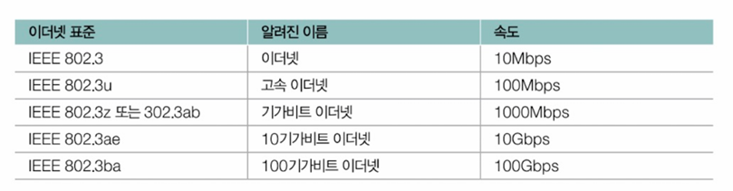

1. 오늘날의 (유선)LAN 대부분이 이더넷 표준을 따르기 때문에 대다수의 LAN 장비들이 특정 이더넷 표준을 따른다.
2. 이더넷 표준이 달라지면 통신 매체의 종류를 비롯한 신호 송수신 방법, 나아가 최대 지원 속도도 달라질 수 있다.

### 이더넷 프레임
- 이더넷 프레임(Ethernet frame): 이더넷 기반의 네트워크에서 주고받는 프레임
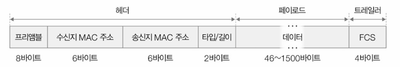
1. 프리앰블
   - 프리앰블(preamble): 송수신지 동기화를 위해 사용되는 8바이트(64비트) 크기의 정보
     - 첫 7바이트는 10101010이라는 값을 가지고, 마지막 바이트는 10101011이라는 값을 가짐
   - 수신지 입장에선 프리앰블 비트를 통해 현재 이더넷 프레임이 수신되고 있다는 사실을 알게 됨

2. 송수신지 MAC 주소
  - 송신지와 수신지를 특정할 수 있는 6바이트(48비트) 길이의 MAC 주소가 명시됨
  - 콜론(:)으로 구분된 12자리 16진수로 구성됨
  - 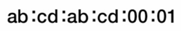
  - 네트워크 인터페이스마다 하나씩 부여되는 주소
    - 네트워크 인터페이스: 네트워크를 향하는 통로, 연결 매체와의 연결 지점.
    - 보통 NIC라는 장치가 네트워크 인터페이스를 담당
  - 네트워크 인터페이스가 여럿이면 한 호스트가 여러 개의 MAC 주소를 가질 수 있음

3. 타입/길이
  - 명시된 크기에 따라 나타내는 게 다름
    - 1500이하(16진수 05DC) => 프레임 크기
    - 1536이상(16진수 0600) => 타입
  - 타입은 캡슐화된 상위 계층의 정보를 의미하기 때문에 타입을 통해 어떤 상위 계층 프로토콜이 캡슐화되었는지를 알 수 있음
    - ex) IP(IPv4)가 캡슐화된 정보 => 16진수 0080이 명시됨

4. 데이터
  - 상위 계층으로 전달하거나 전달받을 데이터(페이로드)가 명시됨
  - 데이터 필드에 포함될 수 있는 데이터의 최대 크기는 1500바이트
    - 이보다 클 경우 => 여러 패킷으로 나뉘어 보내짐

5. FCS
  - FCS(Frame Check Sequence): 트레일러
    - 프레임의 오류가 있는지의 여부를 확인하기 위한 필드
    - CRC(Cyclic Redundancy Check)라는 오류 검출용 값이 명시됨
  - 송신지에서 전송할 데이터와 전송할 데이터에 대한 CRC 값을 계산해서 전달 -> 수신지: 전달받은 CRC값과 전달받은 데이터에 대한 CRC값을 계산한 값을 대조 -> 같을 경우에 오류가 없다고 판단

## 유무선 통신 매체
### 유선 매체-트위스티드 페어 케이블
- 구리선을 통해 전기적으로 신호를 주고받는 통신 매체
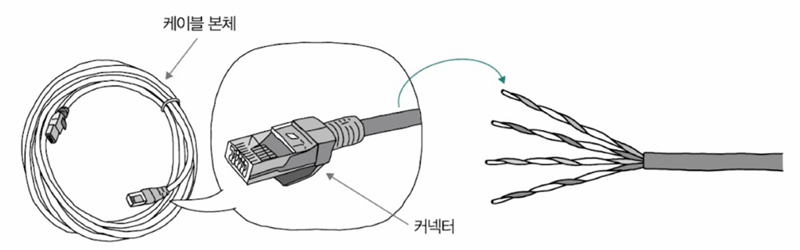
- 카테고리(category)를 통해 성늘을 알 수 있음
  - 카테고리에 따라 대응되는 중요 이더넷 표준이 다름
▼ 카테고리 종류
- 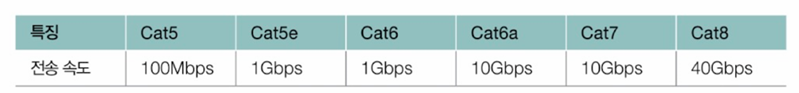

- 노이즈(noise)를 낮추기 위해 그물 모양의 철사나 포일(foil)로 감싸 방지하는 경우가 많음
- 구리선 주변을 보호해 노이즈를 감소시키는 방식: 차폐(shielding)
  - 브레이드 실드(braided shield): 차폐에 사용된 그물 모양의 철사
    - STP(Shieled Twisted Pair)케이블: 브레이드 실드로 노이즈를 감소시킨 케이블
  - 포일 실드(foil shield): 차폐에 사용된 포일
    - FTP(Foil Twisted Pair)케이블: 포일 실드로 노이즈를 감소시킨 케이블
  - UTP(Unshielded Twisted Pair)케이블: 구리선만 있는 케이블

> **실드의 상세한 표기**\
> 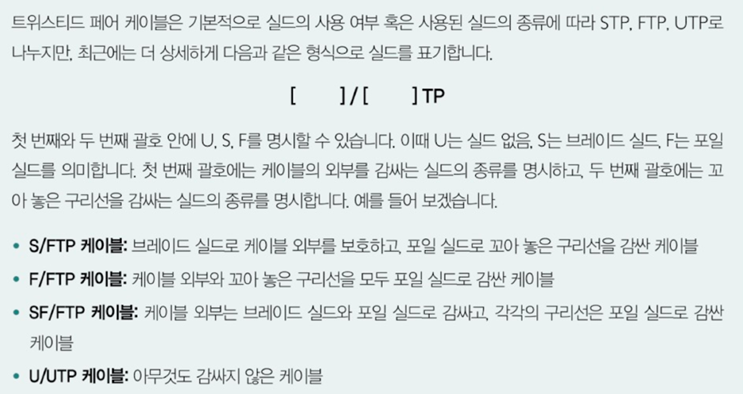
> 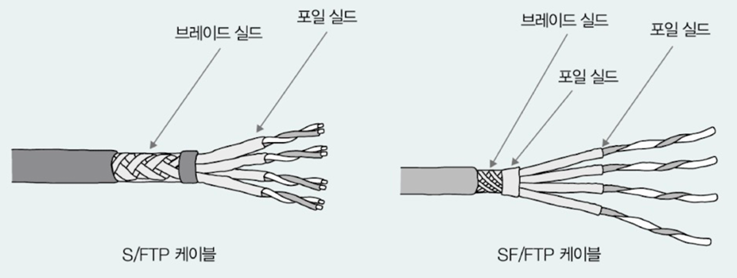

### 무선 매체 - 전파와 WiFi
- 대표적인 무선 매체: 전파
  - 전파: 3kHz부터 3THz 사이의 진동수를 갖는 전자기파
- 무선 LAN에서 가장 대중적으로 사용되는 기술: 와이파이
  - 와이파이: 'IEEE 802.11'이라는 표준을 따르는 무선 LAN 기술
- ▼ 와이파이 세대에 따른 표준 규격
- 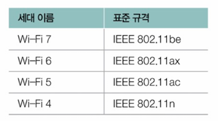
- 와이파이에 주로 사용되는 주파수 대역: 2.4GHz, 5GHz
- 같은 주파수 대역을 사용하는 여러 무선 네트워크가 존재할 수 있음
- 그러나 전파 통신을 주고받을 때 주파수 대역이 겹치면 신호의 간섭이 발생할 수 있음
- => 주파수 대역은 같은 대역을 사용하는 서로 다른 무선 네트워크를 구분하기 위해 채널(channel)이라는 하위 주파수 대역으로 세분화되고, 해당 채널 대역에서 무선 통신이 이루어짐

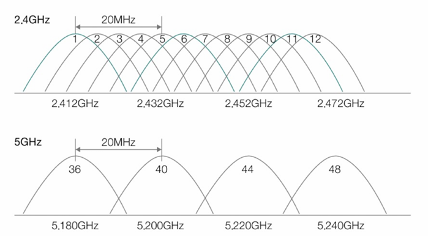
- 2.4GHz 대역의 채널: 1, 6, 11번 채널의 주파수는 서로 중첩되지 않음
  - => 1, 6, 11번 채널을 사용하는 무선 네트워크는 신호 간섭으로 인한 성능 저하가 발생하지 않음

> **AP와 SSID**
> - 여러 무선 통신 기기를 연결해 무선 네트워크를 구성하는 장비: AP(Access Point)
> - 서비스 셋(Service Set): AP를 중심으로 구성된 무선 네트워크
> - SSID(Service Set Identifier): 서비스 셋 식별자

## 네트워크 인터페이스: NIC
- 네트워크 인터페이스: 네트워크 상에서 노드와 통신 매체가 연결되는 지점
  - 노드와 네트워크 사이의 통로와도 같음
- 네트워크 인터페이스(일반적으로 NIC)마다 물리적 주소라고 불리는 MAC 주소가 부여됨
  - NIC: 
    - 통신 매체의 신호를 호스트가 이해하는 프레임으로 변환하거나 호스트가 이해하는 프레임을 통신 매체의 신호로 변환하는 역할을 수행
    - MAC 주소를 토대로 잘못 전송된 패킷이 없는지 확인하기도 함
    - 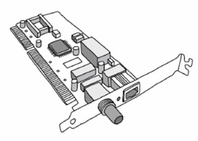

**NIC의 동작 방식**
- NIC를 작동시키는 시스템 콜 호출 => (커널 모드 전환 후) 송수신 수행 => 입출력 완료되면 인터럽트를 통해 CPU에게 작업이 완료됨을 알림
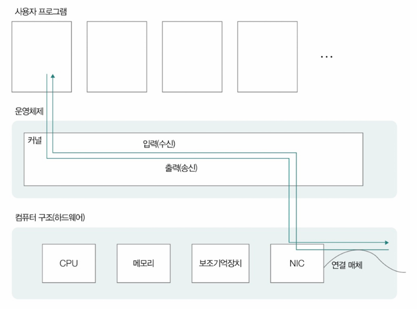

- NIC는 각각의 지원속도가 다름 => 네트워크 속도에 큰 영향을 끼침

> **티밍과 본딩**
> - 여러 물리적인 NIC를 마치 하나의 고속 NIC처럼 구성하는 것

## 허브와 스위치
### 물리 계층의 허브
- 허브: 물리 계층의 대표적인 네트워크 장비. 여러 대의 호스트를 연결하는 장치
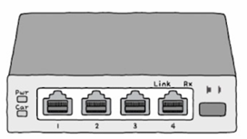
- 포트(port): 허브에서 케이블의 커넥터가 꽂히는 부분

**허브의 특징**
1. 전달받은 신호를 모든 포트로 내보냄
   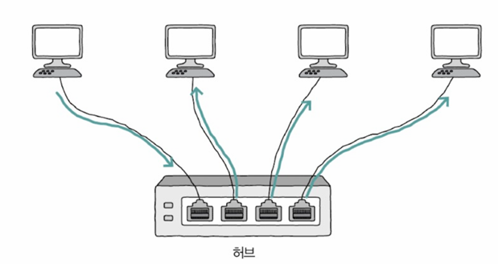
2. 반이중 모드로 통신
   - 반이중 모드: 송신 또는 수신을 번갈아 가면서 수행해야 하는 통신 방식

- 전이중 통신: 전이중 모드로 송수신 하는 것. 양방향 송수신이 가능

> **충돌과 충돌 도메인**
> - 허브는 반이중 모드로 통신하기 때문에 허브를 향해 동시에 메시지를 보내면 충돌(collision)이라는 문제가 발생
> - 콜리전(충돌) 도메인: 충돌이 발생할 수 있는 영역
>
> - 앞서 말했던 상황에서의 충돌 도메인: 허브에 연결된 모든 호스트
> 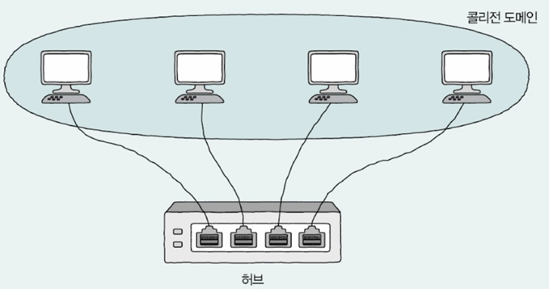

### 데이터 링크 계층의 스위치
- 스위치(switch): 허브의 한계를 보완하기 위한 네트워크 장비
  - 전달받은 신호를 목적지 호스트가 연결된 포트로만 내보냄
  - 전이중 모드 지원
    - => 허브와 비교했을 때 콜리전 도메인이 좁음
- 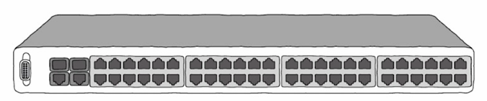

- 스위치에 MAC주소 학습 기능이 있음 => 스위치가 전달받은 신호를 원하는 포트에만 내보낼 수 있음
- 스위치는 데이터 링크 계층에 속한 장비이므로 MAC주로를 이해할 수 있음
- 프레임 속 MAC 주소를 토대로 현재 어떤 포트에 어떤 MAC주소를 가진 호스트가 연결되어 있는지 파악 => '포트, 연결된 호스트의 MAC 주소'의 대응 관계를 테이블의 형태로 메모리에 저장(MAC 주소 테이블)
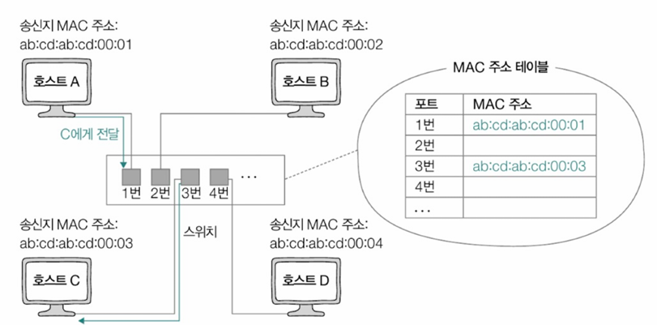

- 스위치의 대표기능: MAC 주소 학습, VLAN
- VLAN(Virtual LAN): 가상의 LAN
  - 같은 스위치에 연결된 모든 호스트를 하나의 네트워크로 간주하고 싶지 않을 때, 여러 논리적인 네트워크로 나누고 싶을 때 사용됨
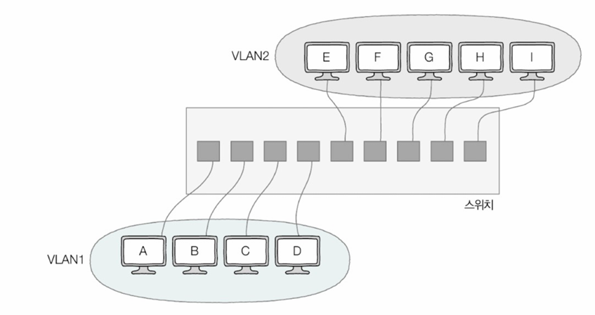

ex) 위와 같이 스위치에 연결된 호스트 A ~ I를 2개의 네트워크(VLAN)로 나누는 경우

- 호스트 A ~ D와 호스트 E ~ I는 서로 다른 VLAN에 속해 있으므로 서로 다른 네트워크로 간주됨
- 브로드캐스트 도메인도 겹치지 않아 VLAN1의 브로드캐스트 메시지가 VLAN2에 도달하지 않음
- 호스트 A ~ D와 호스트 E ~ I가 서로 통신을 주고 받으려면 네트워크 계층 이상의 장비가 필요