- [5.5\_응용 계층 - HTTP의 기초](#55_응용-계층---http의-기초)
  - [DNS와 URI/URL](#dns와-uriurl)
    - [도메인 네임과 DNS](#도메인-네임과-dns)
    - [자원과 URI/URL](#자원과-uriurl)
  - [HTTP의 특징와 메시지 구조](#http의-특징와-메시지-구조)
    - [HTTP의 특징](#http의-특징)
    - [HTTP 메시지 구조](#http-메시지-구조)
  - [HTTP 메서드와 상태 코드](#http-메서드와-상태-코드)
    - [HTTP 메서드](#http-메서드)
    - [HTTP 상태 코드](#http-상태-코드)
  - [HTTP 주요 헤더](#http-주요-헤더)
    - [요청 메시지에서 주로 사용되는 HTTP 헤더](#요청-메시지에서-주로-사용되는-http-헤더)
    - [응답 메시지에서 주로 활용되는 HTTP 헤더](#응답-메시지에서-주로-활용되는-http-헤더)
    - [요청과 응답 메시지 모두에서 활용되는 HTTP 헤더](#요청과-응답-메시지-모두에서-활용되는-http-헤더)


# 5.5_응용 계층 - HTTP의 기초
## DNS와 URI/URL
### 도메인 네임과 DNS
- 도메인 네임(domain name): 네트워크 상의 호스트를 식별하기 위한 정보
  - 'www.example.com' 과 같은 문자열 형태의 호스트 특정 정보
  - 호스트의 IP 주소와 대응됨
- 네임 서버(name server): '도메인 네임-IP 주소'를 관리하는 서버
- DNS 서버(DNS server): 도메인 네임을 관리하는 네임 서버
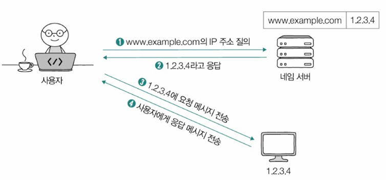
- IP 주소를 모르는 상태에서 도메인 네임과 대응되는 IP 주소를 알아내는 과정 === 도메인 네임을 풀이(resolve) 한다 === 리졸빙(resolve+ing)한다

**도메인 네임**
1. 계층적 구조
2. 도메인 네임을 관리하는 네임 서버의 계층적 구조

- 하나의 도메인 네임은 점(.)을 기준으로 계층적으로 분류되어 있음

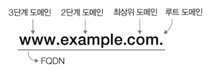
- 대표적인 최상위 도메인: 'com, net, org, kr(대한민국)', 'jp(일본)', 'cn(중국)', 'us(미국)' 등
- 전체 주소 도메인 네임(FQDN, Fully-Qualified Domain Name): 도메인 네임을 모두 포함하는 도메인 네임

> - 서브 도메인: 다른 도메인이 포함된 도메인
> - ex) 'mail.example.com', 'www.example.com'은 'example.com'의 서브 도메인

**네임 서버**
- 도메인 네임을 관리하는 네임 서버는 전 세계 여러 곳에 위치함 <- 분산 관리
- 도메인 네임 시스템(DNS, Domain Name System): 계층적으로 분산되어 있는 도메인 네임에 대한 관리 체계
  - DNS는 호스트가 이러한 DNS를 이용할 수 있도록 하는 애플리케이션 계층 프로토콜을 의미하기도 함

**리졸빙 과정**
- 한 호스트가 'minchul.net'이라는 도메인 네임을 통해 IP 주소를 알아내고자 하는 경우
1. 호스트 -> 로컬 네임 서버에 도메인 네임 질의
   - 로컬 네임 서버(local name server): 클라이언트와 맞닿아 있는 네임 서버. 클라이언트가 도메인 네임을 통해 IP 주소를 알아내고자 할 때 가장 먼저 찾게 되는 네임 서버
     - 로컬 네임의 주소는 ISP가 자동으로 할당해 주거나 공개 DNS 서버(public DNS Server)를 이용
2. 로컬 네임 서버가 FQDN에 대응하는 IP 주소를 알고 있다면 해당 IP 주소 반환
   - 모른다면 IP 주소를 알아낼 때까지 루트 네임 서버부터 순차적으로 여러 네임 서버를 거쳐 질의(루트 네임 서버, TLD 네임 서버 등)
   - 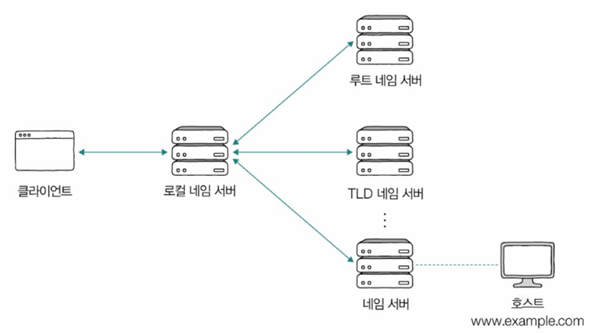
3. 반환받은 IP주소를 클라이언트에 전달

- 실제론 네임 서버에 기존에 응답받은 결과를 임시 저장했다가 추후 같은 질의에 활용하는 경우가 많음 => DNS 캐시
> - DNS 서버에 캐시된 값은 저마다 TTL(Time To Live)값이 정해져 있음
> - IP 헤더 내의 TTL 필드와는 무관

> **DNS 레코드 타입**
> - DNS 자원 레코드(DNS resource record): IP 주소에 도메인 네임을 대응시키기 위해 설정해야 하는 정보
> - 해당 정보를 추가한 후에야 네임 서버가 IP 주소와 도메인 네임의 대응 사실을 알 수 있음
>
> 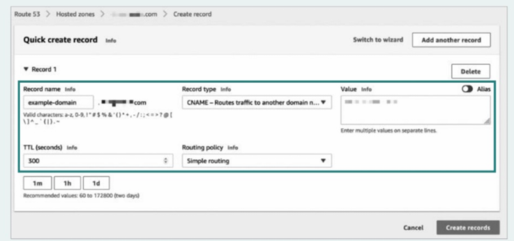
> - DNS 레코드 구성: 이름, 값, <이름, 값>쌍의 유형을 나타내는 레코드 타입
> - 레코드 타입이 달라지면 레코드의 이름과 값의 의미가 달라짐
>
> 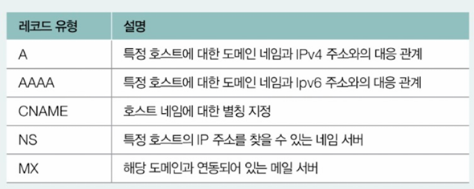
> - ex) 첫 번째 레코드는 'example.com'이 1.2.3.4에 대응되어 있다는 것을 보여줌
> 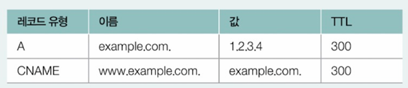

### 자원과 URI/URL
- 자원(resource): 네트워크 상의 메시지를 통해 주고받는 최종 대상
  - HTML 파일, 이미지, 동영상, 텍스트 파일 등
- URI(Uniform Resource Identifier): 웹 상에서의 자원을 식별하기 위한 정보
  - '이름', '위치' 기반으로 식별
  - URN(Uniform Resource Name): 이름으로 자원을 식별하는 방식
  - URL(Uniform Resource Locator): 위치로 자원을 식별하는 방식

**URL의 구조**\
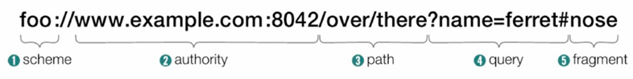

1. scheme
  - 자원에 접근하는 방법
  - 일반적으로 사용할 프로토콜이 명시됨(ex: 'http://')

2. authority
  - 호스트를 특정할 수 있는 IP 주소나 도메인 네임 명시
  - 콜론(:) 뒤에 포트 번호를 명시할 수도 있음

3. path
  - 자원이 위치하고 있는 경로 명시
  - 슬래시(/)를 기준으로 계층적으로 표현
  - ex: 'http://example.com/home/images/a.png'

4. query
  - URL에 대한 매개변수 역할을 하는 문자열
  - 쿼리 문자열(query string), 쿼리 파라미터(query parameter) 등으로도 불림
  - 물음표(?)로 시작되는 <키=값> 형태의 데이터
  - 앰퍼센트(&)를 사용하여 여러 쿼리 문자열 연결 가능
  - ex) 수많은 단어 목록 중 특정 단어를 검색한 결과에 해당하는 자원을 찾을 때 용이
  - 

5. fragment
  - 자원의 일부분, 자원의 한 조각을 가리키기 위한 정보
  - 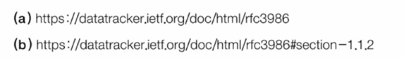
  - (a): HTML의 첫 부분이 나타남
  - (b): HTML 파일의 특정 부분으로 이동해서 보여짐

> **URN**
> - 자원의 위치가 변하면 유효하지 않은 URL과 달리 URN은 자원에 고유한 이름을 붙이는 이름 기반 식별자이기 때문에 자원의 위치와 무관하게 자원을 식별할 수 있음
> - ex) ISBN
> 
> 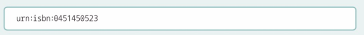


## HTTP의 특징와 메시지 구조
- HTTP의 목적: 애플리케이션의 다양한 자원을 네트워크를 통해 송수신하는 것
### HTTP의 특징
1. 요청 응답 기반 프로토콜
   - 요청 메시지를 보내는 클라이언트와 이에 대한 응답 메시지를 보내는 서버가 서로 HTTP 요청 메시지와 HTTP 응답 메시지를 주고받는 구조로 작동함
   - 같은 HTTP 메시지라도 HTTP 요청 메시지와 HTTP 응답 메시지의 형태는 다름

2. 미디어 독립적 프로토콜
   - 다양한 종류의 자원을 주고받을 수 있음
   - HTTP는 주고받을 미디어 타입에 특별한 제한을 두지 않고, 독립적으로 작동이 가능한 **미디어 독립적인 프로토콜**이라 할 수 있음
   - 미디어 타입: HTTP에서 메시지로 주고받는 자원의 종류. 
     - 네트워크 세상의 확장자와 같음
     - '타입/서브타입'의 형식으로 구성됨
       - 타입: 데이터의 유형
       - 서브타입: 주어진 타입에 대한 세부 유형
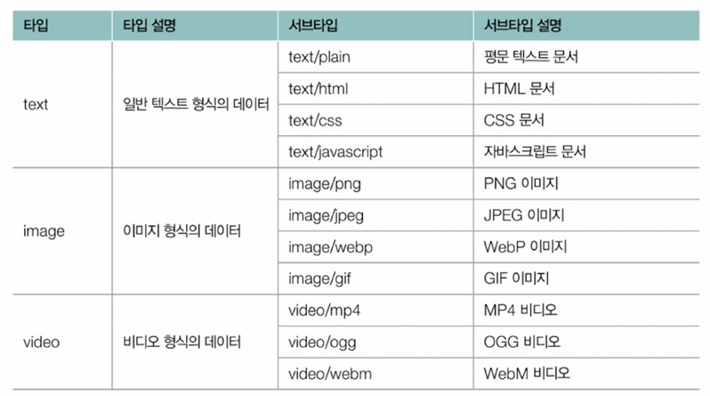
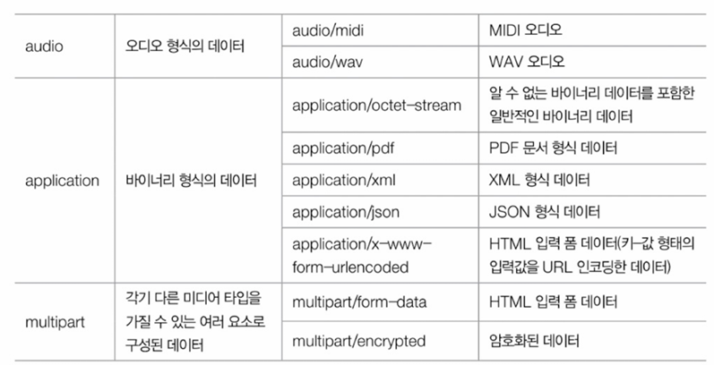


3. 스테이트리스 프로토콜
   - 서버는 HTTP 요청을 보낸 클라이언트 관련 상태를 기억하지 않음
     - 일반적으로 HTTP 서버는 많은 클라이언트와 동시에 상호작용하기 때문에 상태정보를 유지하기에 부담이 됨
     - 여러 대로 구성된 서버가 모든 클라이언트 상태를 공유해야한다면 모든 서버가 클라이언트 상태 정보를 공유해야 함
     - 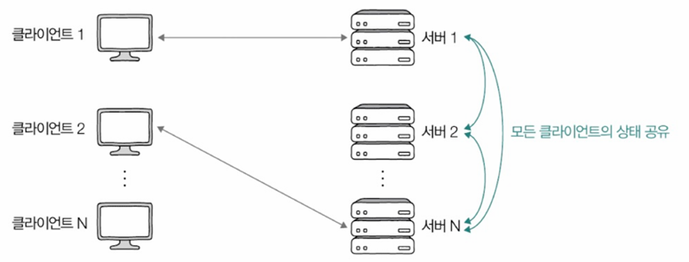
   - HTTP 서버가 지켜야 할 중요한 설계 목표: 확장성, 견고성

4. 지속 연결 프로토콜
   - 초기 HTTP 버전(HTTP 1.0이하)에서는 쓰리 웨이 핸드셰이크를 통해 TCP 연결을 수립한 후, 요청에 대한 응답을 받으면 연결을 종료하는 방식으로 동작함 => 추가적인 요청-응답 메시지를 주고 받으려면 매번 새롭게 연결을 수립하고 종료해야함(비지속 연결)
   - 최근 사용되는 HTTP 버전(HTTP 1.1 이상)에서는 지속 연결(persistent connection) 기술 제공
     - 킵 얼라이브(keep-alive)라고도 부름
     - TCP 연결 상에서 여러 개의 요청-응답을 주고받을 수 있는 기술
   - 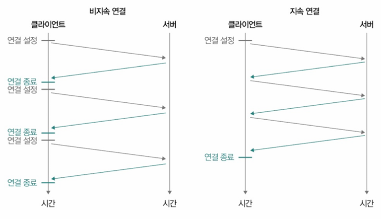

> **HTTP 버전별 특징**
> 1. HTTP 1.1
>   - 메시지를 평문으로 주고받는다는 특징
> 2. HTTP 2.0
>   - HTTP 1.1의 단점을 보완하고 개선하기 위한 버전. 아래와 같은 대표적인 특징 및 추가 기능들이 있음
>   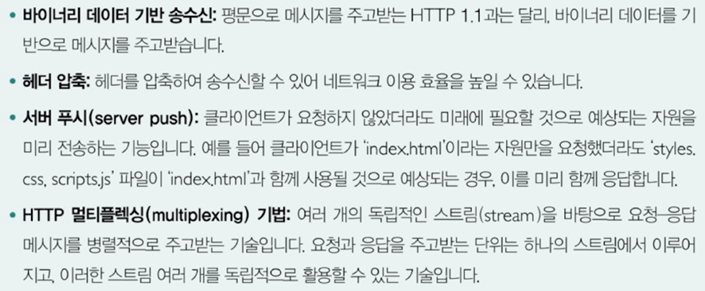
>   - HOL 블로킹(Head-Of-Line blocking)의 문제를 완화한 버전
>     - HOL 블로킹: 같은 큐에 대기하며 순차적으로 처리되는 여러 패킷이 있을 때, 첫 번째 패킷의 처리 지연으로 인해 나머지 패킷들의 처리도 모두 지연되는 문제 상황
>   - 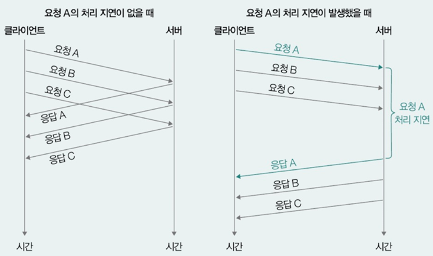
> 3. HTTP 3.0
>   - UDP를 기반으로 동작함
>   - 상대적으로 TCP를 이용하는 방식에 비해 송수신 속도가 빠름


### HTTP 메시지 구조
- 시작 라인, 필드 라인, 메시지 본문으로 이루어짐
  - 필드라인은 여러 개가 존재할 수 있음
  - 메시지 본문은 없을 수도 있음
  - 메시지 본문에는 HTTP를 통해 주고받는 자원이 명시됨
- **시작 라인**으로 HTTP 메시지가 요청 메시지인지 응답 메시지인지 구분
  - HTTP 메시지가 요청 메시지 => 요청 라인
  - HTTP 메시지가 응답 메시지 => 상태 라인
  - 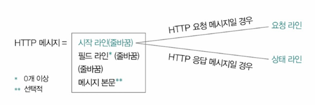

**요청 라인과 상태 라인의 형식**
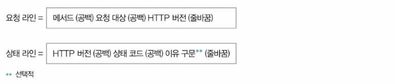
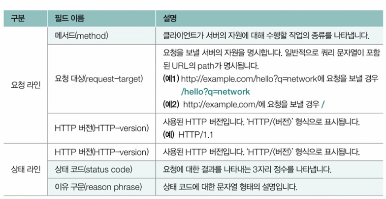

ex)
`HTTP/1.1 200 OK`
- 상태 코드 200은 '요청이 성공적으로 받아들여지고 수행되었음'을 의미
`HTTP/1.1 404 Not Found`
- 상태코드 404는 '요청한 자원이 존재하지 않음'을 의미

**필드 라인**
- HTTP 헤더가 명시됨
  - HTTP 헤더: HTTP 메시지 전송과 관련한 부가 정보이자 제어 정보
  - 일반적으로 하나의 HTTP 메시지에는 여러 헤더가 포함되어 있음
  - 콜론(:)을 기준으로 **헤더 이름**과 그에 대응하는 **헤더 값**으로 구성됨
- 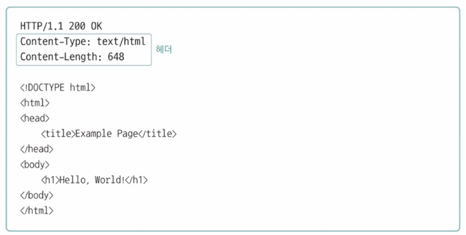

## HTTP 메서드와 상태 코드
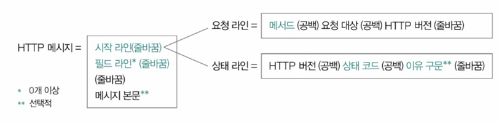
### HTTP 메서드
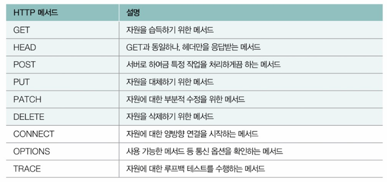
1. GET과 HEAD
- GET
  - 자원을 조회하는 용도의 메서드
  - 웹 브라우저를 통한 웹 페이지 조회는 웹 브라우저의 GET 요청 메시지에 대한 응답을 의미함
  - ex) GET 요청 메시지와 그에 대한 응답 메시지 
  ```
  <!-- 요청 메시지 -->
  GET /example-page HTTP/1.1
  Host: www.example.com
  Accept: *
  ```
  ```html
  <!-- 응답 메시지 -->
  HTTP/1.1 200 OK
  Content-Type: text/html
  Content-Length: 648

  <!DOCTYPE html>
  <html>
  <head>
    <title>Example Page</title>
  </head>
  <body>
    <h1>Hello, World!</h1>
  </body>
  </html>
  ```
- HEAD
  - 응답 메시지에 메시지 본문이 포함되지 않는다는 점을 제외하면 사실상 GET 메서드와 동일
  ```
  <!-- 요청 메시지 -->
  HEAD /example-page HTTP/1.1
  Host: www.example.com
  Accept: *
  ```
  ```
  <!-- 응답 메시지 -->
  HTTP/1.1 200 OK
  Content-Type: text/html
  Content-Length: 648
  ```

2. POST
   - 서버로 하여금 특정 작업을 처리하도록 요청하는 용도로 사용되는 메서드
   - '클라이언트가 서버에 새로운 자원을 생성하고자 할 때'주로 사용
   - ex) 박스 안에 있는 메시지 본문을 처리하도록 서버에 요청하는 메시지
   - 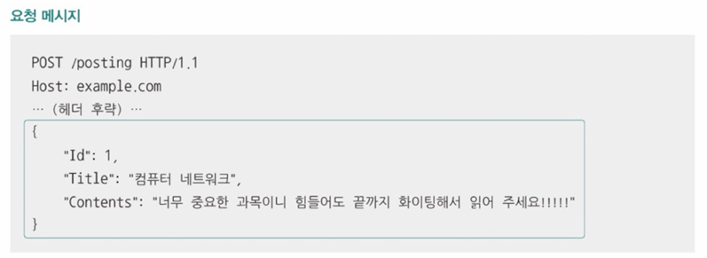
   - 만약 위의 요청 메시지가 '메시지 본문에 해당하는 자원을 새롭게 생성하도록'요청하는 메시지였고, 성공적으로 자원이 생성되었다면 아래와 같은 형태의 응답 메시지를 보내게 됨
   - 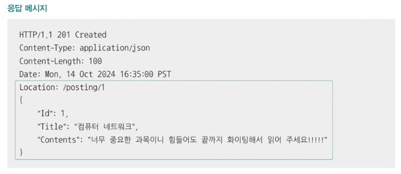
     - Location 헤더를 통해 생성된 자원의 위치를 응답, 메시지 본문으로 생성된 자원을 응답

3. PUT과 PATCH
   - ex) 서버에 아래와 같은 형태의 자원이 있다고 가정
    ```
    {
      "Id": 1,
      "Title": "오늘도 즐거운 날입니다",
      "Contents": "재미있는 글 보고 가세요~"
    }
    ```

   - PUT
     - '덮어쓰기'를 요청
     - 자원은 요청 메시지 본문으로 완전히 대체됨
     - 요청 메시지가 성공적으로 수정되었을 경우, 서버의 자원은 결과적으로 아래와 같은 형태가 됨
    ```
    <!-- 요청 메시지 -->
    PUT /posting HTTP/1.1
    Host: example.com
    ... (헤더 후략) ...
    {
      "Id": 1,
      "Title": "수정된 제목입니다",
    }
    ```
    ```
    <!-- 응답 -->
    {
      "Id": 1,
      "Title": "수정된 제목입니다",
    }
    ```
   - PATCH
     - '부분적 수정'을 요청
     - 메시지 본문에 해당하는 부분만 수정됨
    ```
    <!-- 요청 메시지 -->
    PATCH /posting HTTP/1.1
    Host: example.com
    ... (헤더 후략) ...
    {
      "Id": 1,
      "Title": "수정된 제목입니다",
    }
    ```
    ```
    <!-- 응답 -->
    {
      "Id": 1,
      "Title": "수정된 제목입니다",
      "Contents": "재미있는 글 보고 가세요~"
    }
    ```

4. DELETE
   - 특정 자원의 삭제를 요청할 때 사용되는 메서드
   - ex) 'example.com'이라는 호스트의 '/texts/a.txt'를 삭제하도록 요청하는 메시지
    ```
    DELETE /test/a.txt HTTP/1.1
    Host: example.com
    ```

### HTTP 상태 코드
- 상태 코드: 요청의 결과를 나타내는 3자리 정수
- 백의 자릿수를 기준으로 요청 결과의 유형을 나눌 수 있음

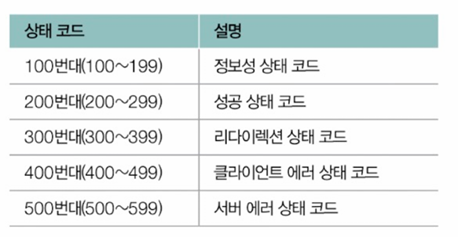

1. 200번대: 성공 상태 코드
   - '요청이 성공했음'을 의미함
  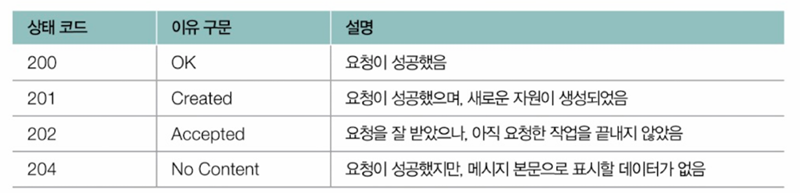

2. 300번대: 리다이렉션 상태 코드
   - 리다이렉션과 관련된 상태 코드
     - 리다이렉션(redirection): 클라이언트가 요청한 자원이 다른 곳에 있을 때 다른 곳으로 요청을 이동시키는 것
   - 클라이언트가 요청한 자원이 다른 URL에 있을 경우, 서버는 리다이렉션 관련 상태 코드와 함께 응답 메시지의 Location 헤더를 통해 요청한 자원이 위치한 URL을 안내해 줄 수 있음 -> 이를 수신한 클라이언트는 Location 헤더에 명시된 URL로 재요청을 보내 새로운 URL에 대한 응답을 받게 됨
   - ex) 'http://example.com/old'로 GET 요청을 보낸 호스트가 'http://example.com/new'로 리다이렉트 되어 상태 코드 200(OK)를 최종적으로 수신하는 예
   - 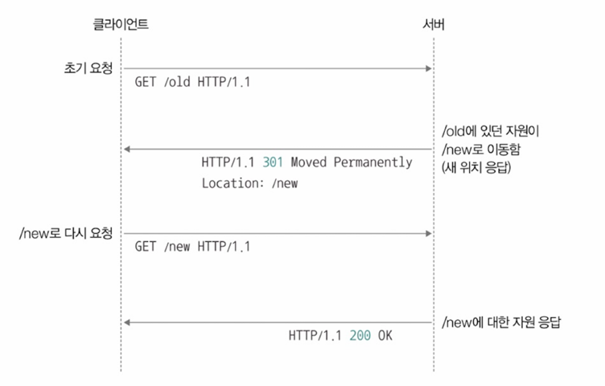
   - ▼ 대표적인 리다이렉션 상태 코드
   - 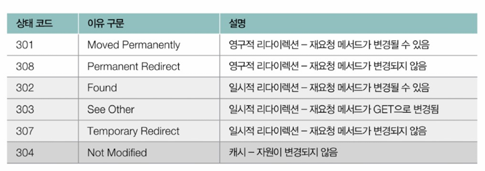
   - 영구적 리다이렉션(permanent redirection): 자원이 완전히 새로운 곳으로 이동하여 경로가 영구적으로 재지정되는 것
   - 일시적 리다이렉션(temporary redirection): 자원의 위치가 임시로 변경되었거나 임시로 사용할 URL이 필요한 경우에 주로 사용
   - 301과 308, 302와 303과 307은 재요청 메서드가 어떻게 변경되는지에 따라 구분할 수 있음
     - 301과 308
       - 처음 요청을 보낸 메서드가 GET이 아닌 메서드(ex: POST)일 경우 301의 재요청 메서드는 GET으로 변경됨 '가능성이 있지만', 308의 재요청 메서드는 첫 번째 요청 메서드에서 변경되지 않음
       - 308은 301의 애매모호함을 보완하기 위해 만들어진 상태코드라고 볼 수 있음
       - 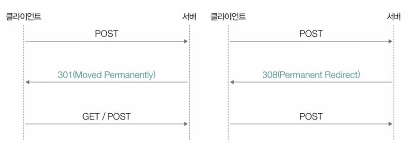
     - 302와 303과 307
       - 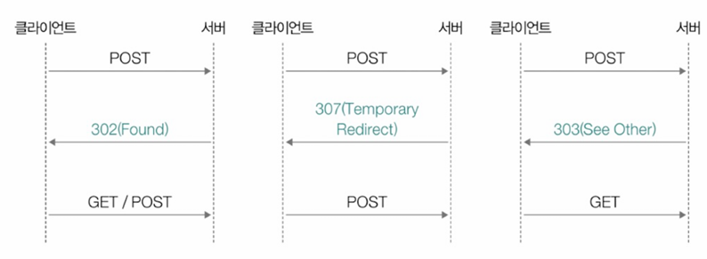

2. 400번대: 클라이언트 에러 상태 코드
   - '클라이언트에게 잘못이 있음'을 나타내는 상태 코드
   - 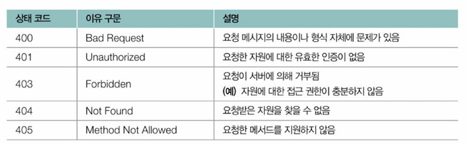
   - 401은 **인증(authentication)**을 요구하는 상태 코드, 403은 **권한(authorization_'인가'라고도 함)**을 요구하는 상태 코드
     - 인증: '자신이 누구인지를 증명하는 작업'
     - 권한: '인증된 주체에게 허용된 작업'
   - 로그인된 모든 유저는 인증된 유저이지만, 로그인된 모든 유저가 관리자 페이지에 들어갈 수는 없음
   - 즉, 인증이 되었더라도 권한이 충분하지 않을 수 있음

3. 500번대 상태 코드
   - '서버에게 잘못이 있음'을 나타내는 상태 코드
   - 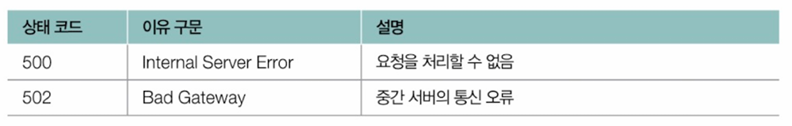
   - 서버에 어떤 문제가 발생했을 때, 익명의 다수 사용자에게 로그를 비롯한 문제의 발생 원인을 상세히 공개하는 것은 보안상 좋지 않기 때문에 보통 서버 문제를 가리키는 상태 코드는 500으로 통칭하는 경우가 많음
   - 클라이언트와 서버 사이에 위치한 중간 서버에서 통신 오류가 있었음을 나타내는 상태 코드 502도 종종 마주칠 수 있음
   - 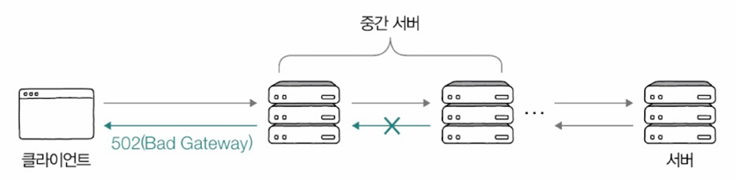


## HTTP 주요 헤더
### 요청 메시지에서 주로 사용되는 HTTP 헤더
1. Host
- 요청을 보낼 호스트가 명시되는 헤더
- 도메인 네임이나 IP 주소로 표현되며, 포트 번호가 포함될 수도 있음
- ex) 'http://info.cern.ch/hypertext/WWW/TheProject.html'에 GET 요청 메시지를 보낼 때의 HTTP 요청 메시지
  ```
  GET /hypertext/WWW/TheProject.html HTTP/1.1
  Host: info.cern.ch
  ...
  ```
2. User-Agent
- 유저 에이전트: HTTP 요청을 시작하는 클라이언트 측의 프로그램
- ▼ User-Agent 헤더 예시
- 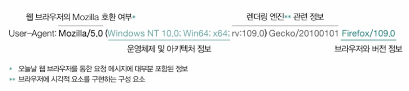
 - HTTP 요청 메시지를 보낸 클라이언트의 접속 수단(대표적으로 웹 브라우저)을 유추할 수 있음

3. Referer
- 클라이언트가 요청을 보낼 때 머무르던 URL이 명시되며, 이를 통해 클라이언트의 유입 경로를 파악할 수 있음
- ex) 아래와 같은 Referer 헤더가 있다면, 이는 클라이언트가 'https://minchul.net'에 머무르다가 요청을 보냈음을 의미
`Referer: https://minchul.net`

### 응답 메시지에서 주로 활용되는 HTTP 헤더
1. Server
   - HTTP 응답 메시지를 보내는 서버 호스트와 관련된 정보가 명시됨
   - ex) 아래와 같이 유닉스 운영체제에서 동작하는 아파치 HTTP 서버에서 응답 메시지를 보냈음을 알 수 있음
  `Server: Apache/2.4.1 (Unix)`


2. Allow
   - 처리 가능한 HTTP 헤더 목록을 알리기 위해 사용됨
   - Allow 헤더는 상태코드 405를 응답할 때 함께 사용할 수 있음
     - 상태 코드 405(Method Not Allowed)는 '수신한 요청 메시지의 메서드를 지원하지 않는다'는 상태 코드
     - 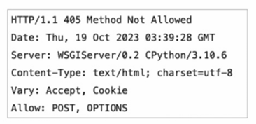


3. Location
   - 클라이언트에게 자원의 위치를 알려주기 위해 사용됨
   - 주로 리다이렉션이 발생했을 때나 새로운 자원이 생성되었을 때 사용


### 요청과 응답 메시지 모두에서 활용되는 HTTP 헤더
1. Date
   - 메시지가 생성된 날짜와 시각에 관련된 정보를 담은 헤더
  `Date: Tue, 15 Nov 1994 08:12:31 GMT`

2. Content-Length
   - 본문의 바이트 단위 크기(길이)를 표현하기 위해 사용됨
  `Content-Length: 123`

3. Content-Type, Content-Language, Content-Encoding
   - 메시지 본문이 어떻게 '표현'되었는지와 관련된 헤더라서 **표현 헤더(representation header)**라고 부르기도 함
   - Content-Type
     - 본문에 사용된 미디어 타입을 의미함
     `Content-Type: text/html; charset=UTF-8`
   - Content-Language
     - 메시지 본문에 어떤 자연어가 사용되었는지를 나타냄
     - 언어 태그로 명시되며, 언어 태그는 다음과 같이 하이픈(-)으로 여러 서브 태그가 구분된 구조를 따름
     - 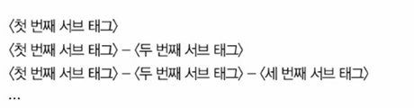
       - 첫 번째 서브 태그: '특정 언어'를 나타내는 언어코드 명시
       - 두 번째 언어 태그: '특정 국가'를 나타내는 국가 코드가 명시
     - '어떤 국가에서 사용하는 어떤 언어'인지를 알 수 있음
     - ex) 'ko-KR'은 '한국에서 사용하는 한국어'를 의미
     - 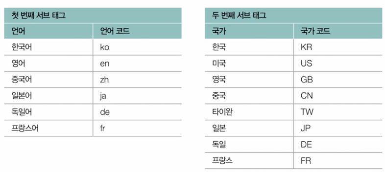
   - Content-Encoding
     - 메시지 본문을 압축하거나 변환한 방식이 명시됨
     - 명시될 수 있는 값은 'gzip', 'compress', 'deflate', 'br'등이 대표적
     - 메시지 본문은 여러 번 압축/변환될 수 있으며, 이 경우 세 번째 예시와 같이 압축/변환된 순서대로 명시됨
    ```java
    Content-Encoding: gzip
    Content-Encoding: br

    // 여러 인코딩이 사용된 경우
    Content-Encoding: deflate, gzip
    ```

4. Connection
   - HTTP 메시지를 송신하는 호스트가 어떠한 방식의 연결을 원하는지 명시하는 헤더
   - ex) Connection 헤더의 값으로 'keep-alive'를 명시하여 지속 연결을 희망함을 알릴 수 있고, 'close'를 명시하여 연결 종료를 희망함을 알릴수도 있음
    ```
    Connection: keep-alive
    Connection: close
    ```