- [6.5 데이터베이스 설계](#65-데이터베이스-설계)
  - [ER 다이어그램](#er-다이어그램)
  - [정규화](#정규화)
    - [제1 정규형](#제1-정규형)
    - [제2 정규형](#제2-정규형)
    - [제3 정규형](#제3-정규형)
    - [보이스/코드 정규형(BCNF)](#보이스코드-정규형bcnf)
- [6.6 NoSQL](#66-nosql)
  - [RDBMS vs NoSQL: NoSQL의 특징](#rdbms-vs-nosql-nosql의-특징)
    - [키-값 데이터베이스](#키-값-데이터베이스)
    - [도큐먼트 데이터베이스](#도큐먼트-데이터베이스)
    - [그래프 데이터베이스](#그래프-데이터베이스)
    - [칼럼 패밀리 데이터베이스](#칼럼-패밀리-데이터베이스)
  - [다양한 NoSQL: MongoDB와 Redis 맛보기](#다양한-nosql-mongodb와-redis-맛보기)
    - [MongoDB](#mongodb)
    - [Redis](#redis)
- [추가학습 NOTE](#추가학습-note)
  - [데이터베이스 분할과 샤딩](#데이터베이스-분할과-샤딩)


# 6.5 데이터베이스 설계
## ER 다이어그램
- ER 다이어그램(ERD): 데이터베이스를 구성하는 요소들의 관계를 나타내는 그림
- 유지보수가 용이하고 개발자 간 원활한 소통이 가능하게 함

- 세부적인 표기법은 ERD마다 다를 수 있음
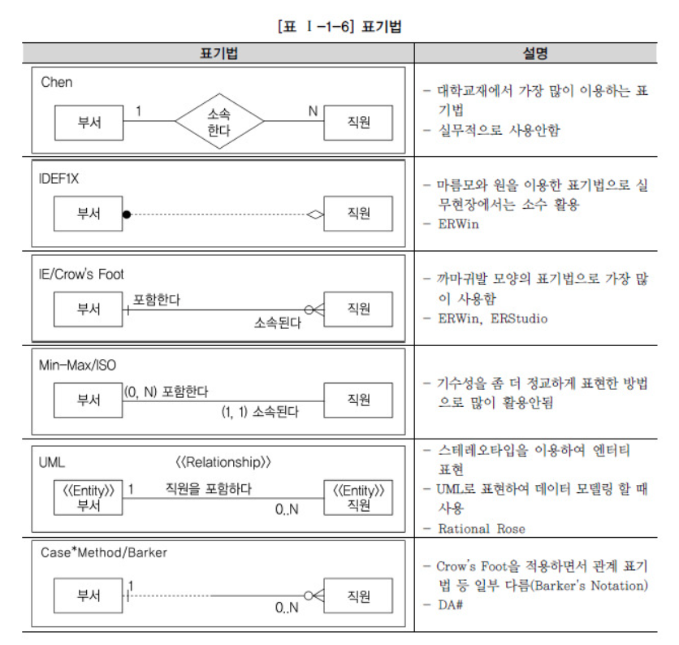

▼ ERD 예(피터 첸 표기법)
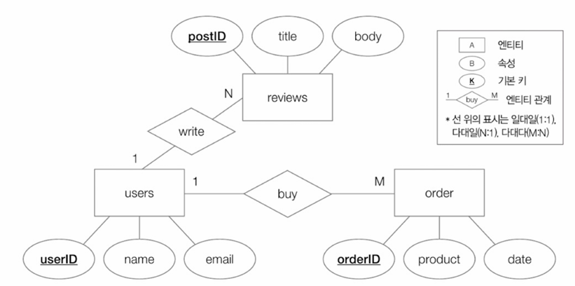

▼ 최근에 사용하는 ERD 형태(까마귀 발 표기법/IE 표기법)
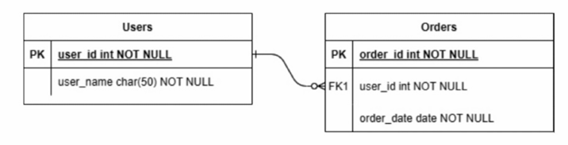
- 연관 관계에 따라 표기법이 달라짐
- 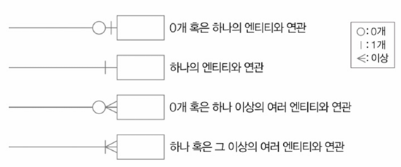

> **식별/비식별 관계**
> - 식별 관계: 참조되는 테이블의 기본키를 참조하는 테이블의 외래키이자 기본키로 활용하는 경우
> - 비식별 관계: 참조되는 테이블의 기본키를 참조하는 테이블의 기본키가 아닌 일반적인 외래키로 이용할 경우
> 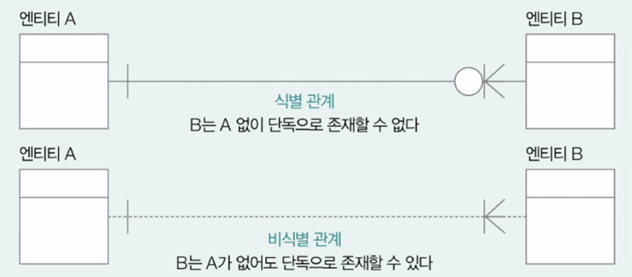

## 정규화
- 정규화: 잠재적인 문제가 발생하지 않도록 테이블의 필드를 구성하고, 필요할 경우 테이블을 나누는 작업
- 정규화 종류:
  - 제1 정규형
  - 제2 정규형
  - 제3 정규형
  - 보이스/코드 정규형
  - 제4 정규형
  - 제5 정규형

### 제1 정규형
- 제1 정규형 ⇔ 모든 속성이 원자 값을 가진다
▼ 제1 정규형 만족X
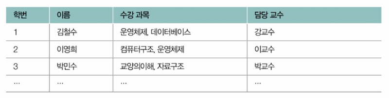
▼ 제1 정규형을 만족하는 방법들
- 중복 레코드를 감수하고 하나의 테이블로 설계하는 방법
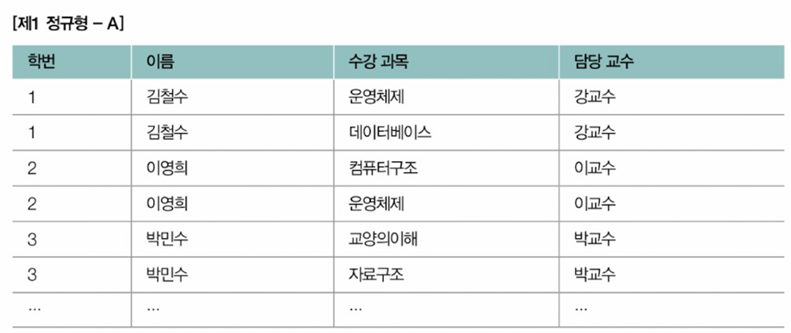
- 테이블을 2개로 쪼개는 방법
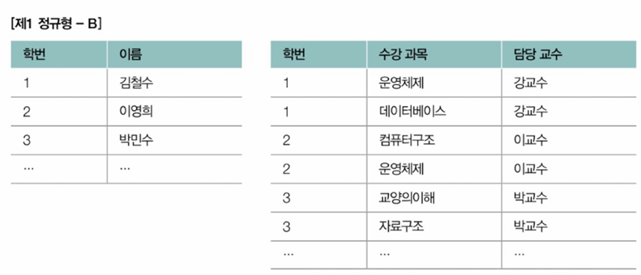

### 제2 정규형
- 제2 정규형 ⇔ 제1 정규형 ⋀ 기본키가 아닌 모든 필드들이 모든 기본키에 완전히 종속
- 부분 함수 종속성: 기본 키가 아닌 필드가 기본 키의 일부에 종속되어 있는 경우
- 완전 함수 종속성: 기본 키 전체에 완전하게 종속되어 있는 경우
  - ex) 기본키: {학번, 과목}
  - 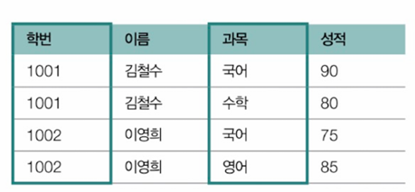
  - => 이름은 과목과 관계가 없음 => 부분 함수 종속 => 제2 정규형 만족X
  - 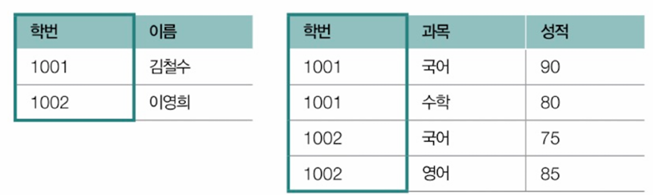
  - => 위 처럼 분할 후 각각의 테이블이 제2 정규형을 만족

### 제3 정규형
- 제3 정규형 ⇔ 제2 정규형 ⋀ 기본키가 아닌 모든 필드가 기본 키에 이행적 종속성이 없는 상태
  - 이행적 종속성: 한 테이블에 필드 A, B, C가 있을 때, A가 B를 결정하고 B가 C를 결정하는 상황이라면 A도 C를 결정하게 되어 종속 관계를 형성하게 되는 것
- ▼ 학번 -> 학과, 학과 -> 사무실 위치 => 학번 -> 사무실 위치(이행적 종속 관계)
- 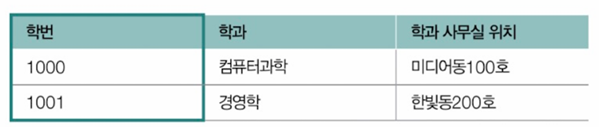
- ▼ 제3 정규형을 만족하도록 테이블 쪼개기
- 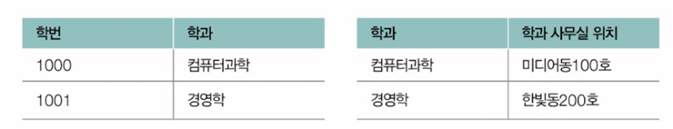

### 보이스/코드 정규형(BCNF)
- 보이스/코드 정규형 ⇔ 제3 정규형 ⋀ 모든 결정자가 후보키
  - 결정자: 특정 필드를 식별할 수 있는 필드
    - 필드 A가 필트 B를 결정할 경우(B가 A에 종속적일 경우) => A는 B의 결정자
  - ex) 기본키: {학번, 과목 코드}
  - 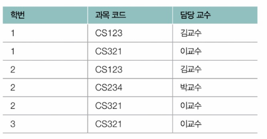
  - => 담당 교수는 과목 코드의 결정자 역할이지만 후보키는 아님 => BCNF 만족X

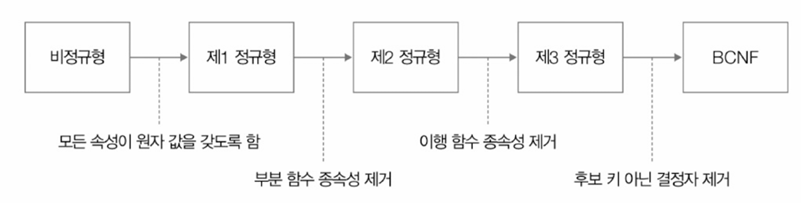
> **역정규화**
> - 정규화 후 검색의 속도를 높이기 위해 분할되어 있는 테이블을 하나로 합치는 작업

# 6.6 NoSQL
## RDBMS vs NoSQL: NoSQL의 특징
- NoSQL(Not Only SQL)
  - 레코드를 다양한 형태로 저장할 수 있음
- 대표적인 NoSQL: 키-값 데이터베이스, 도큐먼트 데이터베이스, 그래프 데이터베이스, 칼럼 패밀리 데이터베이스

### 키-값 데이터베이스
- 키-값 데이터베이스: 레코드를 키(필드)와 값의 쌍으로 저장하는 데이터베이스
- 대표: Redis, Memcached 등
- 레코드를 메모리에 저장해(인메모리 데이터베이스) 빠른 데이터베이스 접근 속도를 제공하는 경우도 있음

### 도큐먼트 데이터베이스
- 도큐먼트 데이터베이스: 레코드를 도큐먼트라는 단위로 저장하고 관리하는 데이터베이스
  - 도큐먼트: 정형화되어 있지 않은 NoSQL 레코드의 단위
  - 주로 JSON, XML과 같은 형식을 도큐먼트로 활용
- 대표: MongoDB
  - 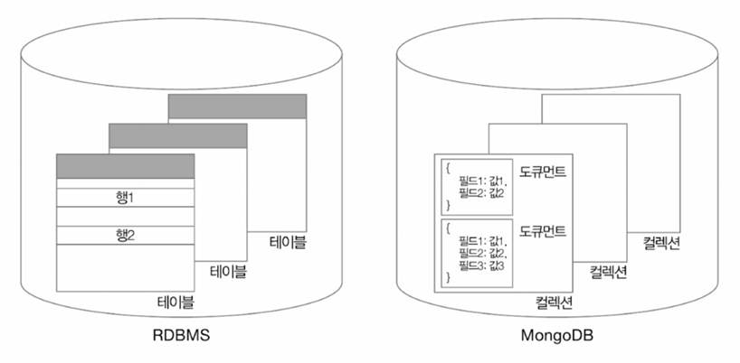
  - 도큐먼트가 모여 컬렉션을 이룸

### 그래프 데이터베이스
- 그래프 데이터베이스: 데이터베이스에 저장하고자 하는 데이터를 그래프의 노드 형태로 저장하는 데이터베이스
- 대표: neo4j
- SNS의 친구 관계나 교통망과 같이 데이터 간의 관계성이 중요한 레코드를 저장하기 위해 주로 사용

### 칼럼 패밀리 데이터베이스
- 칼럼 패밀리 데이터베이스: 행, 열 개념이 있고 로우키를 통해 특정 행을 식별(RDBMS와 유사), 정규화나 조인을 사용하지 않고 스키마가 고정되어 있지 않아 자유롭게 열 추가 가능(RDBMS와의 차이)한 데이터베이스
- 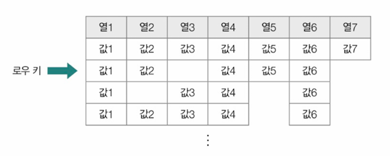
  - 관련 있는 열 집합 => 칼럼 패밀리(단위) 형성
  - 칼럼 패밀리 집합 => 키스페이스(단위) 형성

**NoSQL vs RDBMS**
- ACID에 대한 엄격한 주수나 데이터의 무결성, 일관성 유지가 중요한 환경 => RDBMS
- 저장해야 하는 데이터가 비교적 정형화되어 있거나 확장성을 크게 염두하고 있지 않음 => NoSQL

## 다양한 NoSQL: MongoDB와 Redis 맛보기
- 사용 빈도가 높은 유형: 키-값 데이터베이스(Redis), 도큐먼트 데이터베이스(MongoDB)

### MongoDB
**데이터베이스와 컬렉션 생성**
```sql
use 데이터베이스_이름  -- 데이터베이스 생성/사용
db.createCollection("컬렉션_이름")  -- 컬렉션 생성
```
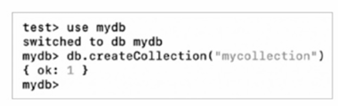

**데이터베이스와 컬렉션 조회**
```sql
show dbs
show collections
```
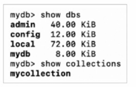

**데이터베이스와 컬렉션 삭제**
```sql
db.dropDatabase()
db.컬렉션_이름.drop()
```

1. 단일 레코드를 삽입하는 방법
```
db.컬렉션_이름.insertOne()
```
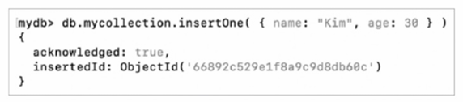
- ObjectID: 도큐먼트마다 부여되는 고유한 값
- 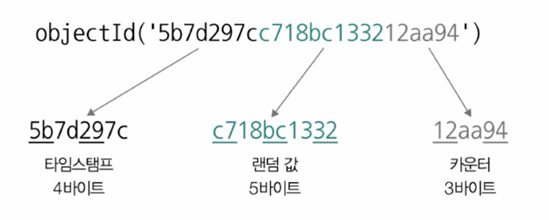

- JSON 형태의 도큐먼트는 변수 형태로도 사용 가능
- 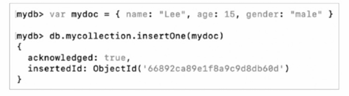

**특정 컬렉션의 도큐먼트를 확인하는 명령**
```sql
db.컬렉션_이름.find()
```
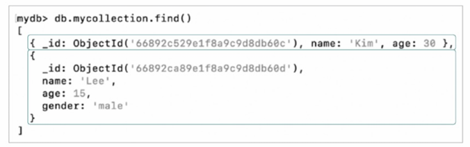

▼ 인자로 도큐먼트의 필드(JSON의 키)의 값을 하나 이상 명시하면 원하는 도큐먼트만 필터링 해서 조회
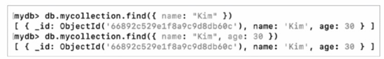

> **MongoDB의 연산자**
> 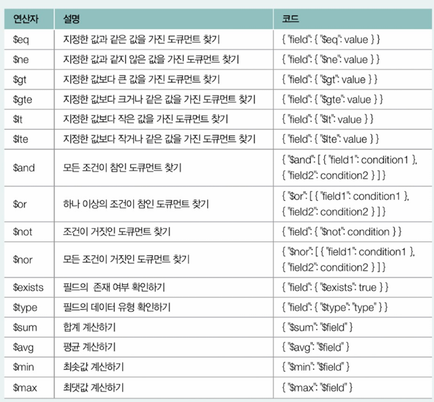
>
> 'age'가 '20'보다 큰 도큐먼트와 'name'이 'Lee'이고, 'age'가 '12'인 도큐먼트 조회 예시
```sql
db.mycollection.find({age: { $gt: 20 }});
db.mycollection.find({ $and: [{name: "Lee"}, { age: 12 }]});
```

2. 여러 레코드를 삽입하는 방법
```sql
db.컬렉션_이름.insertMany()
```
- 소괄호 안에 삽입할 여러 도큐먼트를 리스트 형태로 명시하면 됨
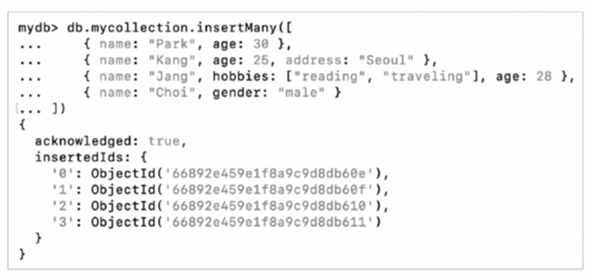

1. 단일 도큐먼트를 갱신하는 방법
```
db.컬렉션_이름.updateOne()
```
- 첫 번째 인자: 갱신할 도큐먼트를 식별하는 필터
- 두 번째 인자: 갱신할 내용
  - `$set: {변결할_필드: 변경할_내용, ...}`
- ▼ 'name'이 'Kang'과 일치하는 도큐먼트를 찾아 해당 도큐먼트의 'age'를 '30'으로 변경하는 예시
- 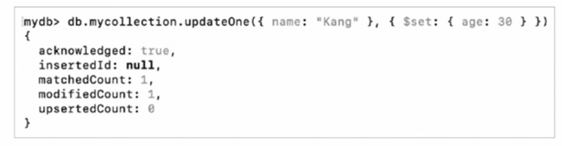

2. 여러 도큐먼트를 갱신하는 방법
```
db.컬렉션_이름.updateMany()
```
▼ 'age'가 '20' 이상인 모든 도큐먼트(age: {$gte: 20})의 'status' 필드를 'active'로 설정하도록 갱신하는 명령
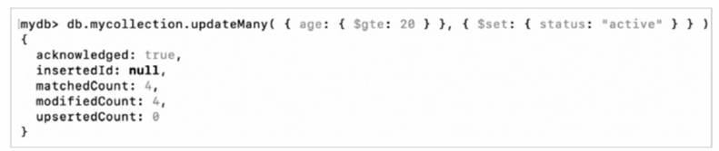

▼ 조회 결과
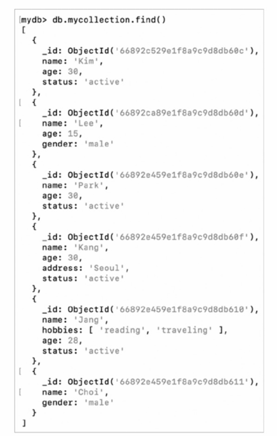

**특정 필드 삭제**
- ▼ 'age'가 '10' 이상인 모든 도큐먼트의 'status' 필드를 없애는 명령
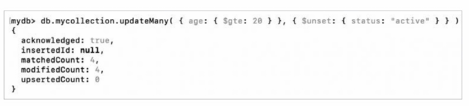

**도큐먼트 삭제**
- 단일 도큐먼트 삭제: `db.컬렉션_이름.deleteOne()`
- 여러 도큐먼트 삭제: `db.컬렉션_이름.deleteMany()`

▼ 'name' 필드가 'Lee'인 도큐먼트 삭제 / 'age' 필드가 '20' 이상인 도큐먼트 삭제
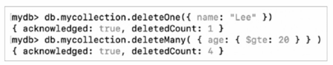

### Redis
- 레코드를 키-값의 대응 쌍으로 관리
  - '값'으로 활용할 수 있는 자료 구조의 종류가 다양함
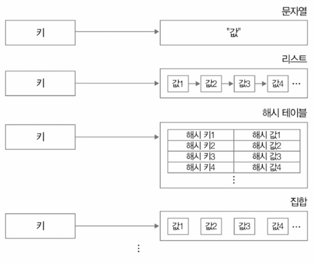

1. 문자열 명령
▼ 문자열 타입의 값을 타룰 때 사용 가능한 대표적인 명령
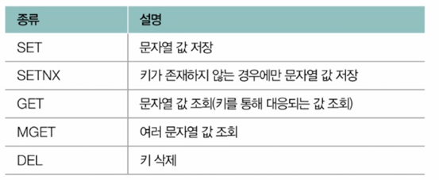

- SET
  - 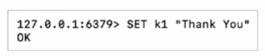
  - 'k1' 이라는 키에 'Thank You'라는 문자열 값이 대응되어 저장됨
- SETNX(SET if Not eXists)
  - 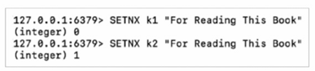
  - 'k1'이 존재하기 때문에 첫 번째 명령은 실패

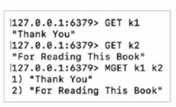
- GET
  - GET 명령어 뒤에 키 이름을 명시하면 해당 키에 대응된 값 조회
- MGET
  - MGET 명령 뒤에 여러 키 이름을 나열하면 해당 키들에 대응된 값들 조회

- DEL
  - 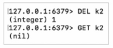
  - DEL 명령 뒤에 키 이름 명시하면 해당 키-값의 대응 관계 삭제됨

2. 리스트 명령
▼ 리스트 타입의 값을 타룰 때 사용 가능한 대표적인 명령
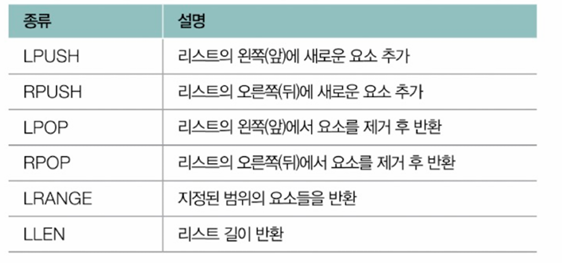

- LPUSH/RPUSH
  - 리스트의 왼(L)/오른(R) 쪽에 요소를 추가하는 명령
  - 리스트가 비어있을 경우 새 리스트를 생성하고 명령 방향에 맞게 리스트에 추가함
  - 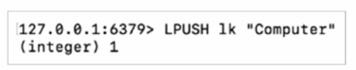
  - 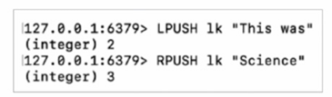
  - 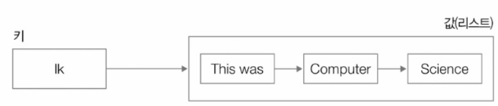
- LRANGE
  - 지정된 범위의 요소들을 반환
  - '0': 리스트의 첫 번째 요소, '-1': 리스트의 마지막 요소
  - ▼ '1k'의 모든 요소를 조회
  - 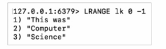
- LLEN
  - ▼ '1k' 리스트의 길이(요소 개수) 확인
  - 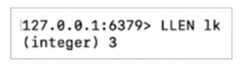
- LPOP/RPOP
  - 리스트의 왼(L)/오른(R) 쪽 요소를 제거하고 반환
  - 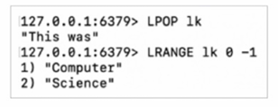
  - 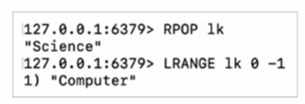


# 추가학습 NOTE
## 데이터베이스 분할과 샤딩
- 데이터베이스 분할(데이터베이스 파티셔닝): 테이블 내에 수많은 레코드가 효율적으로 저장되어야 하는 경우, 혹은 데이터베이스에 대한 부하의 분산을 고려해야 하는 경우에 사용할 수 있는 기술

- 수평적 분할: 테이블의 행을 기준으로 테이블을 나누어 저장하는 방식
- 수직적 분할: 테이블의 열을 기준으로 테이블을 나누어 저장하는 방식
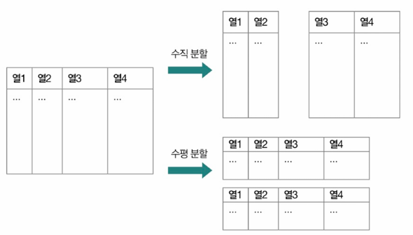

**수평적 분할 방법**
1. 범위 분할
- 레코드 데이터가 가질 수 있는 범위를 정의하고, 해당 범위를 기준으로 테이블을 나눔
- ▼ 2000년 이전 가입 회원들 -> 'p0', 2000 ~ 2009 -> 'p1', 2010 ~ 2019 -> 'p2', 2020 이후 -> 'p3' 파티션에 저장하는 예 
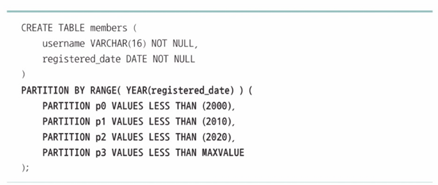

2. 목록 분할
- 레코드 데이터가 특정 목록(리스트)에 포함된 값을 가질 경우 해당 레코드를 별도의 테이블로 분할
- ▼ 주소가 'Seoul'인 고객 레코드 -> 'p0', 주소가 'Incheon'인 고객 레코드 -> 'p1' 파티션에 저장하는 예
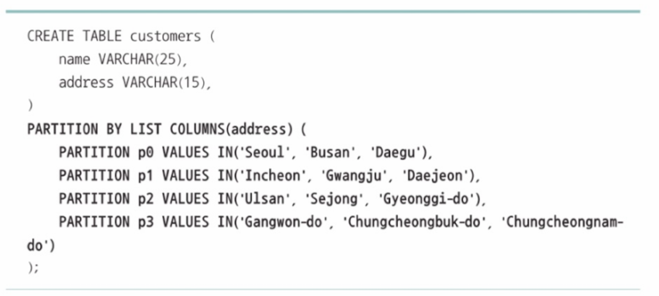

3. 해시 분할
- 특정 열 데이터에 대한 해시 값을 기준으로 별도의 테이블로 분할
- ▼ 'students'라는 테이블을 'major_id'열을 기준으로 분할. 레코드는 'major_id' 값에 해시 함수를 적용하여 생성된 해시 값에 따라 4개의 파티션으로 나뉘어 저장됨
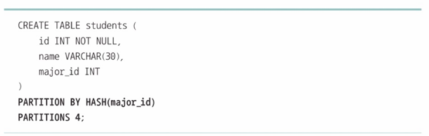

4. 키 분할
- 키를 기준으로 별도의 테이블로 분할
- ▼ 'students'라는 테이블의 기본 키 'id'를 기준으로 파티셔닝 됨. 레코드가 'id'값에 따라 2개의 파티션으로 나뉨
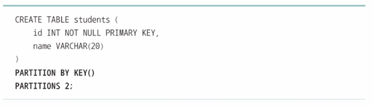

- 기본적으로 수평적 분할을 통해 만들어진 파티션들은 동일한 데이터베이스 서버 내에 위치 => 해당 서버에 요청이 몰릴 수 있음 => 샤딩을 통해 해결
- 사딩: 분할된 테이블을 별개의 데이터베이스 서버에 분산하여 저장하는 기술
- 샤드: 분할되어 저장된 단위
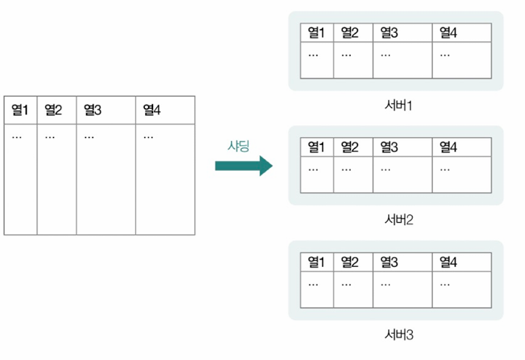