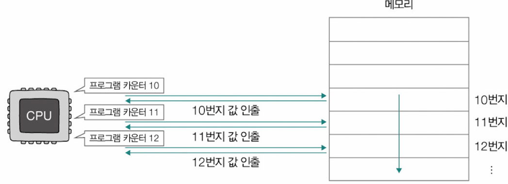
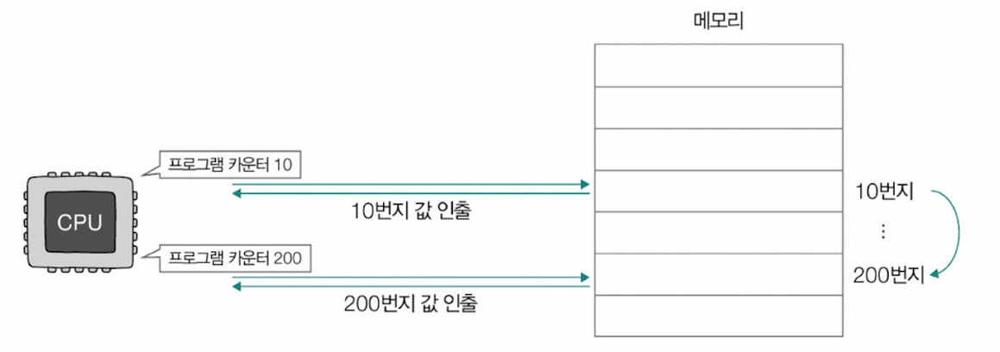
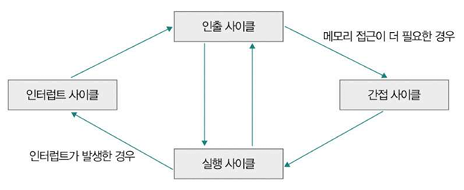
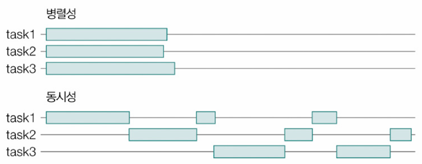
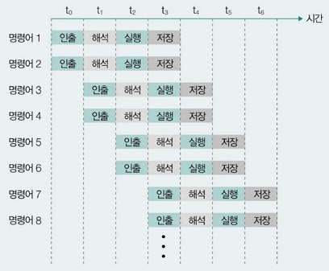
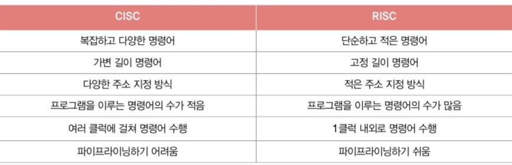

# Ch.2-3. CPU

# 3. CPU
**CPU = ALU + 제어장치 + 레지스터**
## 레지스터
- CPU 내부에서 데이터를 임시로 저장하는 고속 메모리(주요 레지스터만 정리)
- 프로그램 이루는 데이터와 명령어가 프로그램 실행 전후로 레지스터에 저장
- CPU 안에 다양한 레지스터 有 → WinDbg, gdb 등의 디버깅 도구로 레지스터 관찰 가능

### 1️⃣ 프로그램 카운터 (PC; Program Counter) = 명령어 포인터(IP; Instruction Point)
- 다음에 실행할 명령어의 주소를 저장
- 명령어 실행 후 자동으로 증가하여 다음 명령어를 가리킴
- 일반적으로 1씩 증가 
  
- 언제나 증가만 하는 건X
  - 예: 조건문, 리턴문
  - 프로그램 실행 흐름이 순차적이지 않을 때는 PC 값이 임의의 위치로 변경
  

### 2️⃣ 명령어 레지스터 (IR; Instruction Register)
- 해석할 명령어(= 방금 메모리에서 읽어들인 명령어) 저장
- 제어장치가 이를 해석하여 ALU로 연산 지시 OR 필요한 제어 신호 생성 → 해당 부품 작동

### 3️⃣ 범용 레지스터 (General Purpose Register)
- 데이터와 주소를 임시로 저장할 수 있는 레지스터
- 다양하고 일반적인 상황에서 자유롭게 사용 가능
- 일반적으로 CPU 안에는 여러 범용 레지스터 존재

### 4️⃣ 플래그 레지스터 (Flag Register)
- 연산 결과 or CPU 상태에 대한 부가 정보인 `플래그 값` 저장
  - 플래그(flag): CPU가 명령어 처리하는 과정에서 반드시 참조해야 할 상태 정보
  - 플래그 레지스터는 플래그(비트)들로 구성
  
  | 종류               | 설명                                                      | 사용 예시                                                                 |
  |------------------|---------------------------------------------------------|-------------------------------------------------------------------------|
  | 부호 플래그        | 연산 결과의 부호                                              | 부호 플래그가 1일 경우의 연산 결과는 음수, 0일 경우의 연산 결과는 양수를 의미한다. |
  | 제로 플래그        | 연산 결과가 0인지의 여부                                        | 제로 플래그가 1일 경우의 연산 결과는 0, 0일 경우의 연산 결과는 0이 아님을 의미한다.  |
  | 캐리 플래그        | 연산 결과에 올림수나 빌림수가 발생했는지의 여부                         | 캐리 플래그가 1일 경우에는 연산 결과에 올림수나 빌림수가 발생했음을 의미하고, 0일 경우에는 발생하지 않았음을 의미한다. |
  | 오버플로우 플래그   | 오버플로우가 발생했는지의 여부                                      | 오버플로우 플래그가 1일 경우에는 오버플로우가 발생했음을 의미하고, 0일 경우에는 발생하지 않았음을 의미한다. |
  | 인터럽트 플래그     | 인터럽트가 가능한지의 여부                                         | 인터럽트 플래그가 1일 경우에는 인터럽트가 가능함을 의미하고, 0일 경우에는 인터럽트가 불가능함을 의미한다. |
  | 슈퍼바이저 플래그   | 커널 모드로 실행 중인지, 사용자 모드로 실행 중인지의 여부                 | 슈퍼바이저 플래그가 1일 경우에는 커널 모드로 실행 중임을 의미하고, 0일 경우에는 사용자 모드로 실행 중임을 의미한다. |

### 5️⃣스택 포인터 (SP: Stack Pointer)
- 스택의 최상위 주소를 가리키는 포인터
- PUSH/POP 명령에 따라 자동으로 증감

## 인터럽트
CPU의 작업을 방해하는 신호  

### 하드웨어 인터럽트(비동기 인터럽트)
- 입출력장치에 의해 발생하는 인터럽트
- 입출력 작업 완료, 타이머 만료 등의 상황에서 발생(알림 역할)
- 우선순위에 따라 처리되며 마스킹 가능
- 장점
  - CPU 사이클 낭비 최소화
  - CPU가 다른 일을 수행할 수 있는 시간 벌어줌 → 효율적으로 명령어 처리하게 도움
- **CPU가 하드웨어 인터럽트 처리하는 순서**
  1. 입출력장치는 CPU에 **인터럽트 요청 신호** 보냄
  2. CPU는 실행 사이클이 끝나고 명령어를 인출하기 전, 항상 입터럽트 여부 확인
  3. CPU는 인터럽트 요청 확인, **인터럽트 플래그**로 현재 인터럽트 받아들일 수 있는지 여부 확인
  4. 인터럽트를 받아들일 수 있다면 CPU가 지금까지 작업 백업
  5. CPU는 **인터럽트 벡터** 참조해서 **인터럽트 서비스 루틴** 실행
  6. 인터럽트 서비스 루틴 실행 끝나면 4에서 백업해 둔 작업 복구해서 실행 재개
- 용어
  - 인터럽트 플래그: 하드웨어 인터럽트 받아들일지 무시할지 결정하는 플래그 → 인터럽트 요청 수용하기 위해서는 활성화되어 있어야
  - 하드웨어 인터럽트의 종류
    - 막을 수 있는 인터럽트
    - 막을 수 없는 인터럽트: 가장 우선 순위가 높은, 가장 먼저 처리해야 하는 인터럽트
      - 예: 정전, 하드웨어 고장으로 인한 인터럽트
  - **인터럽트 서비스 루틴(ISR; Interrupt Service Routine) = 인터럽트 핸들러**: 인터럽트 발생 시, 해당 인터럽트 처리 및 작동에 대한 정보로 이뤄진 프로그램
  - `CPU가 인터럽트를 처리한다`: ISR 실행 후 본래 수행하던 작업으로 다시 되돌아옴
  - 입출력장치마다 ISR 여러개 → 인터럽트 벡터로 식별
    - 인터럽트 벡터(Interrupt Vector): ISR 식별 위한 정보 -ISR 시작 주소도 포함

### 예외(동기 인터럽트)
- CPU 내부에서 발생하는 인터럽트
- 폴트, 트랩, 중단, 소프트웨어 인터럽트 등
  - 예외가 발생한 명령어부터 실행 : `폴트`
  - 예외 발생한 명령어의 다음 명령어부터 실행 : `트랩`
  - `중단`: CPU가 실행 중인 프로그램 강제로 중단
  - `소프트웨어 인터럽트`: 시스템 콜 발생했을 때 발생하는 예외
- 프로그램 실행 중 비정상적인 상황 처리

## CPU 성능 향상 설계

### CPU 클럭 속도
- **클럭(clock)**: 컴퓨터 부품 일사불란하게 움직일 수 있게 하는 단위
- 클럭 속도 - Hz 단위로 측정
- 클럭 속도는 CPU의 속도 단위로 간주되기도
- 발열 문제로 인한 한계 존재

### 멀티코어와 멀티 스레드
- 코어(core): CPU 내에서 명령어 읽어 들이고 해석하고 실행하는 부품

#### 멀티코어 CPU = 멀티코어 프로세서
- 하나의 CPU에 여러 개의 코어 탑재
- 실제 물리적인 병렬 처리 가능
- 코어 간 캐시 일관성 유지 필요
- 코어 수에 비례한 성능 향상은 어려움

- **스레드(thread)**: 실행 흐름의 단위
  - **하드웨어적 스레드(하드웨어 스레드, 논리 프로세서)**: 하나의 코어가 동시에 처리하는 명령어의 단위
  - **소프트웨어 스레드(스레드)**: 하나의 프로그램에서 독립적으로 실행되는 단위
- **병렬성**: 작업 물리적으로 동시 처리
- **동시성**: 동시에 작업 처리하는 것처럼 보이는 성질(빠르게 번갈아 처리하면 동시에 처리하는 것처럼 보임)
  
  
#### 멀티스레드 프로세서 = 멀티스레드 CPU
- 하나의 코어에서 여러 스레드 동시 처리
- 명령어 파이프라인과 레지스터 세트 공유
- 메모리 지연 시간을 다른 스레드 실행으로 가림
- 하이퍼스레딩: 인텔의 멀티스레드 구현 기술

## 파이프라이닝을 통한 명령어 병렬 처리
- **명령어 병렬 처리 기법(ILP; Instruction-Level Parallelism)**: 여러 명령어 동시 처리해서 CPU를 한시도 쉬지 않고 작동시킴으로써 CPU 성능 높이는 기법
- **명령어 파이프라이닝** - 각 단계가 겹치지만 않는다면 동시 실행 가능
  - 명령어 인출
  - 명령어 해석
  - 명령어 실행
  - 결과 저장  
  
  

### ➕ 슈퍼스칼라(superscalar)
- CPU 내부에 여러 명령어 파이프라인 포함하는 구조
  
  

#### CISC와 RISC 구조

- CISC(Complex Instruction Set Computing)
  - 복잡하고 다양한 명령어 제공
  - 가변 길이 명령어 형식
  - 메모리-메모리 연산 지원
  - 마이크로코드 제어 방식
  - ex) 인텔 x86, x86-64

- RISC(Reduced Instruction Set Computing)
  - 단순하고 정형화된 명령어 사용
  - 고정 길이 명령어 형식
  - 로드-스토어 구조
  - 파이프라이닝에 최적화
  - ex) 애플 M1

- <참고> **CISC vs RISC**
  

#### 파이프라이닝 위험(Pipeline Hazard)
**1. 데이터 위험(Data Hazard)**
   - 명령어 간 `데이터 의존성`으로 인한 위험
   - 어떤 명령어들은 동시 처리X, 이전 명령어 끝까지 실행해야만 비로소 실행 가능

**2. 제어 위험(Control Hazard)**
   - 프로그램 카운터의 갑작스러운 변화로 발생

**3. 구조적 위험(Structural Hazard) = 자원 위험(Resource Hazard)**
   - 명령어 겹쳐 실행하는 과정에서 서로 다른 명령어가 동시에 ALU, 레지스터 등 CPU 부품 사용하려 할 때

