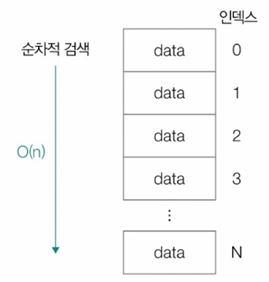
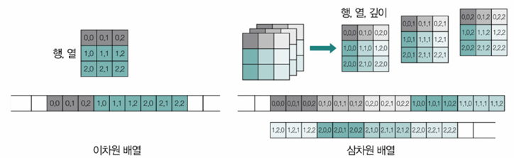
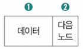
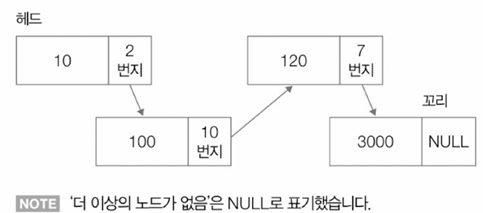
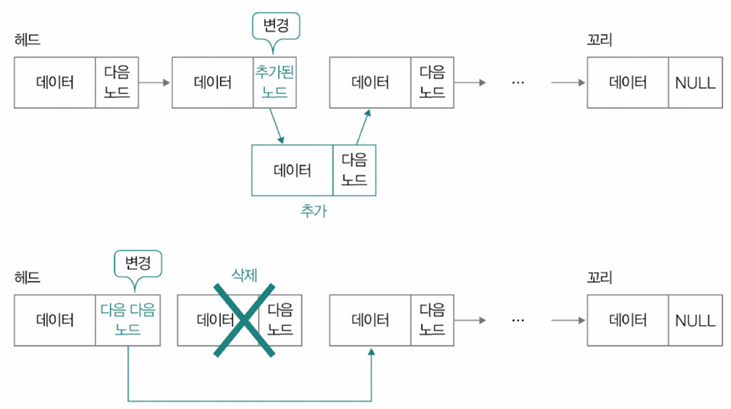
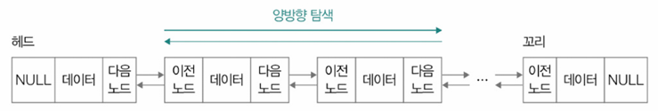
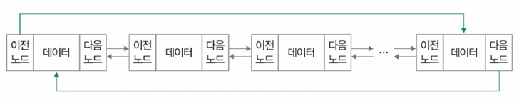
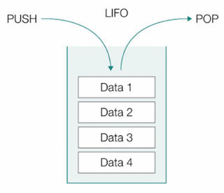
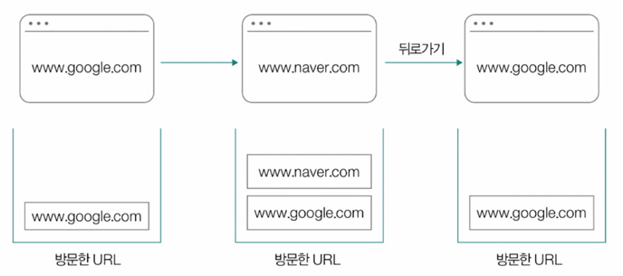
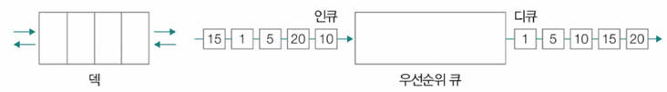

- [Ch4-2. 배열과 연결 리스트](#ch4-2-배열과-연결-리스트)
  - [1. 배열(Array)](#1-배열array)
    - [➕ 정적 배열(Static Array)과 동적 배열(Dynamic Array)](#-정적-배열static-array과-동적-배열dynamic-array)
      - [\<추가\> Python의 동적 배열](#추가-python의-동적-배열)
  - [2. 연결 리스트(Linked List)](#2-연결-리스트linked-list)
    - [연결 리스트 종류](#연결-리스트-종류)
- [Ch4-3. 스택과 큐](#ch4-3-스택과-큐)
  - [1. 스택(Stack)](#1-스택stack)
  - [2. 큐(Queue)](#2-큐queue)
  - [3. 큐의 여러 변형된 형태](#3-큐의-여러-변형된-형태)
    - [원형 큐(Circular Queue)](#원형-큐circular-queue)
    - [덱(Deque)](#덱deque)
    - [우선순위 큐(Priority Queue)](#우선순위-큐priority-queue)

# Ch4-2. 배열과 연결 리스트

## 1. 배열(Array)
**일정한 메모리 공간 차지하는 여러 요소들이 순차적으로 나열된 자료구조**
- **인덱스(index)**: 배열 각 요소 접근 위한 위치 정보 → 0부터 시작하는 고유한 순서 번호
- 배열과 유사한 형태의 컴퓨터 부품 - `RAM`
- 어떤 주소에 접근하든 인덱스로 접근하면 `O(1)`으로 일정<br>
  
- 앞에서부터 차례대로 특정 요소 찾아가는 연산: `O(n)`<br>
  
- 특정 요소 추가 or 삭제: `O(n)` → 중간에 추가/삭제 요소로 인해 이후 요소들 이동해야 해서!<br>
  
- 배열의 차원 확장(2차원 → 3차원)
  - 2차원 - 인덱스 2개
  - 3차원 - 인덱스 3개<br>
  

### ➕ 정적 배열(Static Array)과 동적 배열(Dynamic Array)
| 특징     | 정적 배열              | 동적 배열         |
| ------ | ------------------ | ------------- |
| 크기     | 고정                 | 변경 가능         |
| 메모리 할당 | 컴파일 시 or 프로그램 시작 시 | 실행 중 할당/재할당   |
| 장점     | 빠른 접근, 간단 관리       | 유연한 크기 조절     |
| 단점     | 낭비 가능, 크기 제한       | 재할당 비용, 관리 필요 |

#### <추가> Python의 동적 배열
```python
arr = []
arr.append(1)
arr.append(2)
arr.append(3)
print(arr)  # [1, 2, 3]
```
- Python의 list 객체는 사실상 동적 배열처럼 동작
- 내부 구현(예: CPython)은 C 배열을 사용하지만, append 시 공간이 부족하면 더 큰 메모리를 새로 확보하고 기존 데이터를 복사해 넣는 식
- append, extend로 크기를 마음대로 늘릴 수 있음

## 2. 연결 리스트(Linked List)
**노드 연결 통해 데이터 순차적 저장 자료구조(노드의 모음으로 구성)**
- **노드(node)**: 데이터와 다음 노드 주소 포함 요소<br>
  
- **헤드(head)**: 연결 리스트 첫 번째 노드
- **꼬리(tail)**: 연결 리스트 마지막 노드
- **연속적으로 구성되어 있는 데이터를 불연속적으로 저장**할 때 유용<br>

  - 배열과 연결 리스트 차이
    - 배열: 메모리 상에서도 **연속적**(붙어있는 공간에 저장)
    - 연결 리스트: 메모리 상에서는 **불연속적**(아무 데나 흩어져 있어도 됨), 대신 포인터로 연결
- 연결 리스트 요소 접근 시간 - 특정 요소 접근 시, 앞에서부터 순차적으로 접근(`O(n)`)
  
- 연결 리스트 요소 삽입/삭제 시에도 다른 요소들 재정렬 필요X(`O(1)`)
  - 노드 위치만 변경해서 저장하면 됨
  - ⇒ 포인터(링크)를 수정해서 연결 순서를 바꾼다는 의미
  

### 연결 리스트 종류
- **싱글 연결 리스트(Singly Linked List)**: 각 노드가 다음 노드만 가리킴(기본적 연결 리스트)
  - 단점: 특정 노드를 통해 다음 노드 위치만 알 수 있어서 이전 노드 위치는 알 수 없음(`단방향 탐색`만 가능)
- **이중 연결 리스트(Doubly Linked List)**: 각 노드가 이전, 다음 노드 모두 가리킴
  - 장점: 이전 노드 위치 정보 포함하므로 `양방향 탐색` 가능
  - 단점: 2개의 위치 정보(메모리 주소) 저장하니까 저장 공간 더 필요<br>
  
- **환형 연결 리스트(Circular Linked List)**: 꼬리(마지막) 노드가 헤드(첫 번째) 노드 가리킴<br>
  <br>
  - 이중 연결 리스트로 환형 연결 리스트 구현 가능
    - 헤드 노드 이전 노드 → 꼬리
    - 꼬리 노드 다음 노드 → 헤드<br>
    

---
# Ch4-3. 스택과 큐

## 1. 스택(Stack)
**후입선출 (LIFO, Last-In First-Out) 데이터 저장 방식**
- **푸시(push)**: 스택 데이터 추가 연산
- **팝(pop)**: 스택 데이터 제거 연산<br>

- 한쪽에서만 데이터 삽입, 삭제 가능
- 유용한 상황
  - 최근에 임시 저장한 데이터 가장 먼저 활용해야 할 때
  - 뒤로가기 기능 만들 때\
    
  - 미로 이동\
    

## 2. 큐(Queue)
**선입선출 (FIFO, First-In First-Out) 데이터 저장 방식**
- **인큐(enque)**: 큐 데이터 추가 연산
- **디큐(deque)**: 큐 데이터 제거 연산
- 한 쪽으로는 데이터 삽입, 다른 한 쪽으로는 데이터 삭제<br>
  
- **버퍼(buffer)**: 데이터 임시 저장 메모리 영역 → 큐는 버퍼로도 활용(Like 줄 세우기)

## 3. 큐의 여러 변형된 형태

### 원형 큐(Circular Queue)
- 마지막 요소 뒤 첫 번째 요소 연결 형태
- 데이터를 삽입하는 쪽 ↔ 삭제하는 쪽 - 연결해 원형으로 사용
- 고정 크기 배열 효율적 사용 가능<br>


### 덱(Deque)
- 양방향 큐(Double-Ended Queue)의 줄임말
- 양쪽 끝 삽입 및 삭제 가능한 큐

### 우선순위 큐(Priority Queue)
<br>
- 각 요소 우선순위 부여, 높은 우선순위 요소부터 처리 큐
- **힙(heap) 자료구조 사용** 구현 일반적
- 운영체제 작업 스케줄링, 네트워크 트래픽 관리 등에 사용
- **힙(Heap)**
    - 우선순위 큐 구현 위한 트리 기반 자료구조
    - 최대 힙(max heap), 최소 힙(min heap) 존재
    - **최대 힙은 부모노드 값이 자식노드 값보다 크거나 같음, 최소 힙은 그 반대**