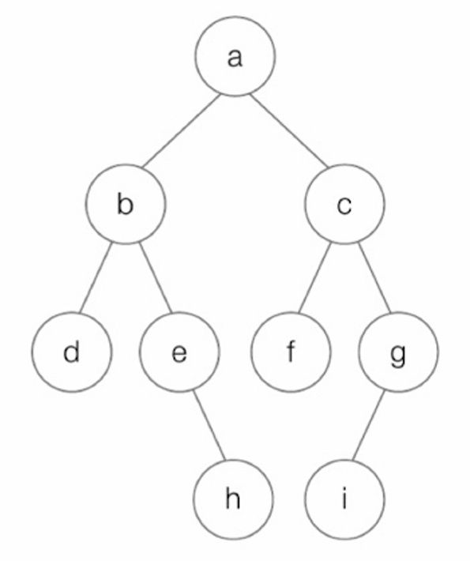
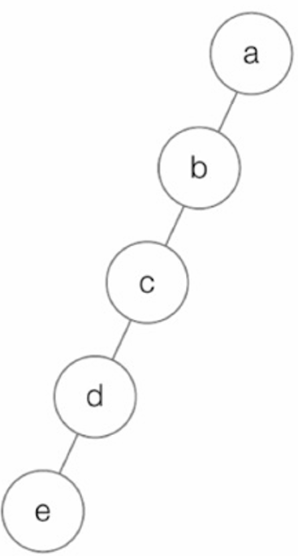
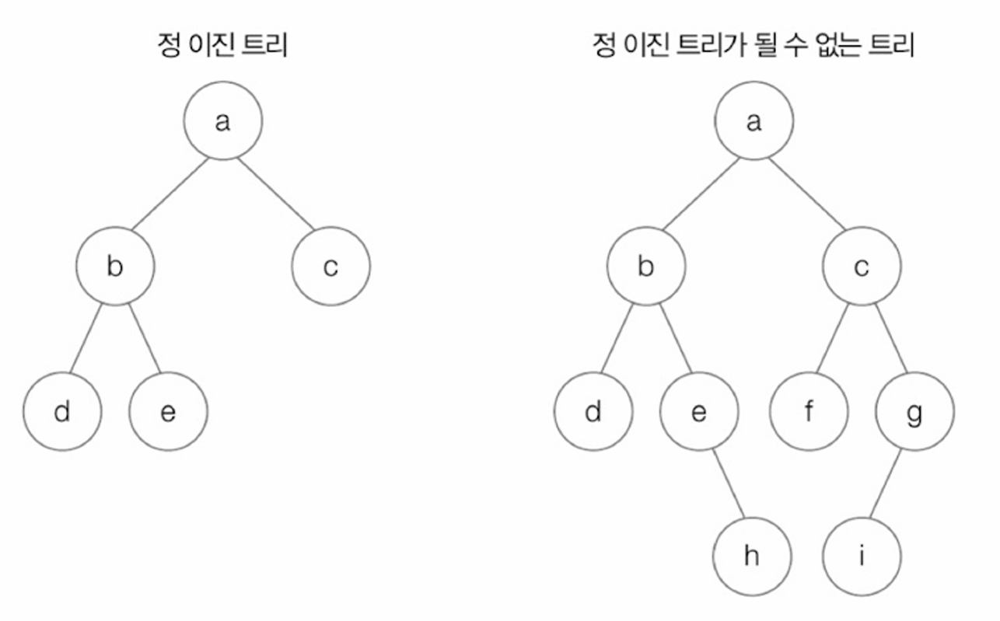
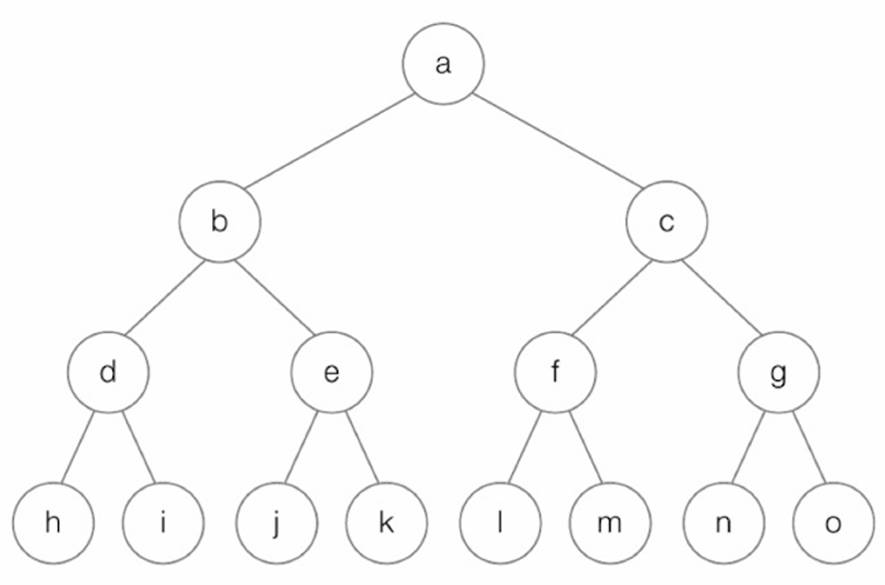
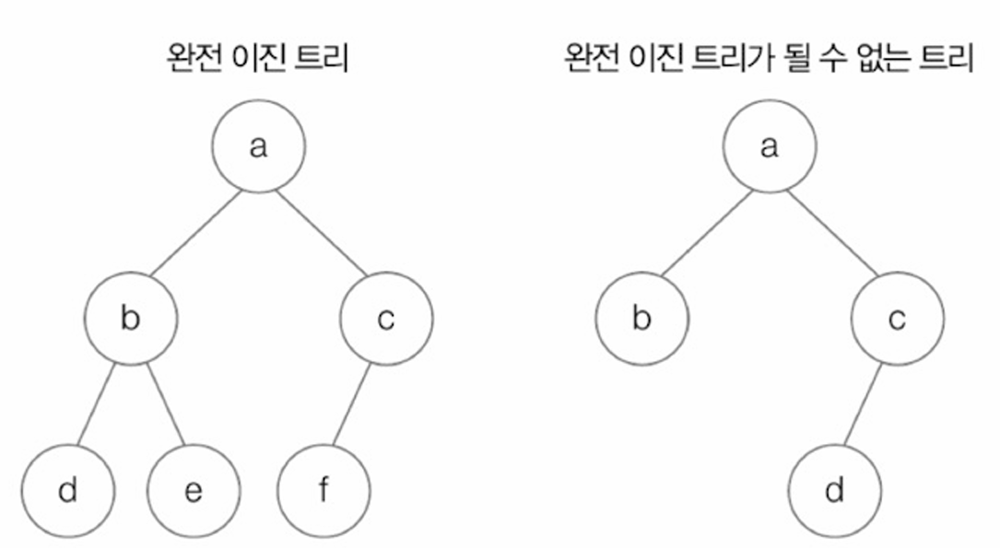
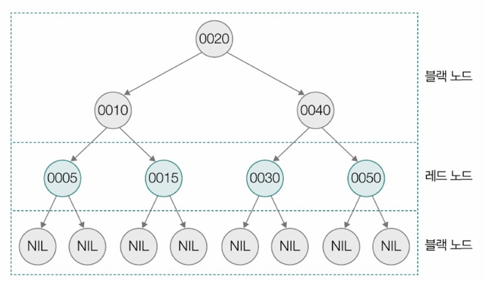
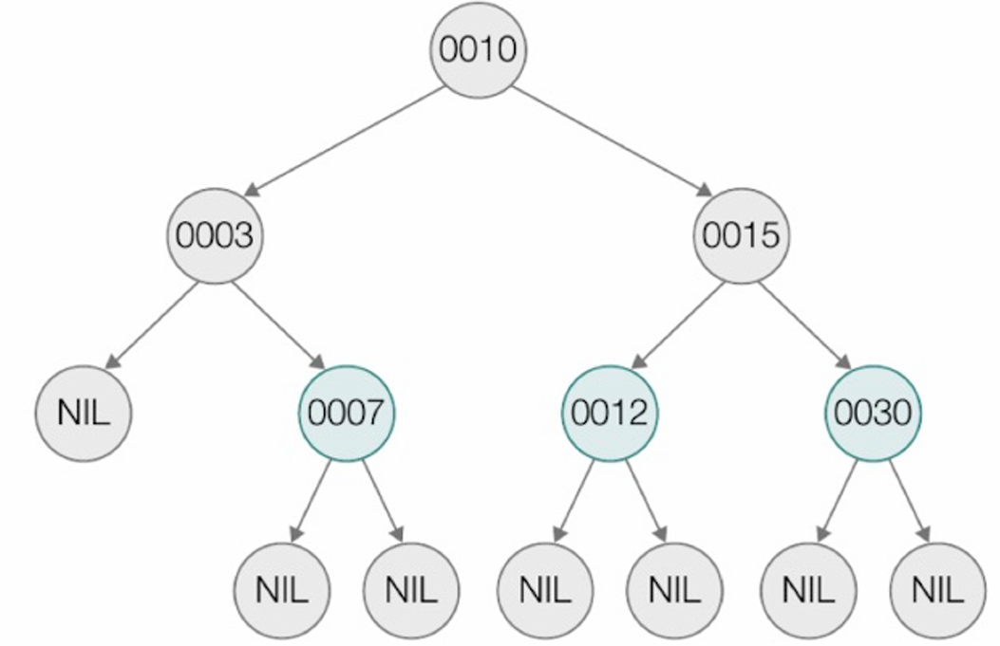
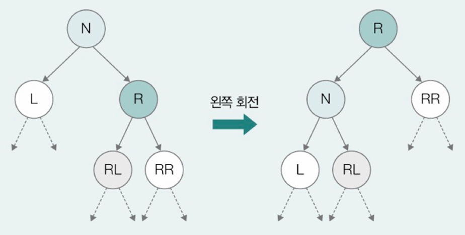
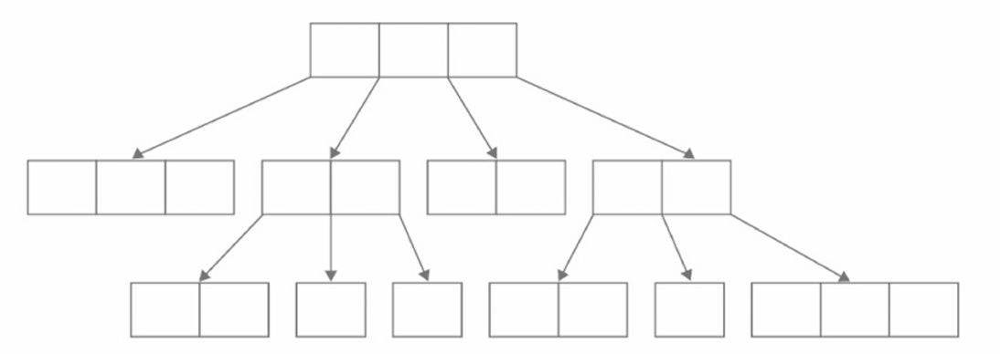
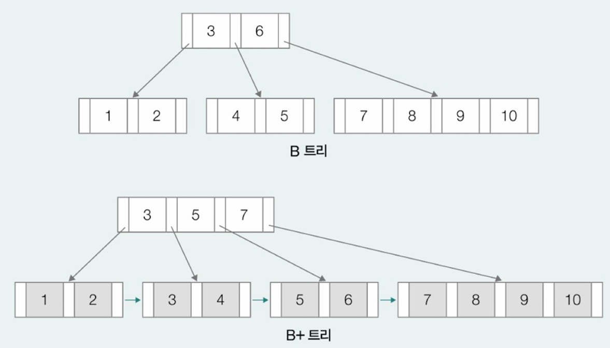

- [Ch4-5-2. 트리의 종류](#ch4-5-2-트리의-종류)
  - [1. 이진 트리(Binary Tree)](#1-이진-트리binary-tree)
  - [2. 탐색에 활용되는 트리: 이진 탐색 트리와 힙](#2-탐색에-활용되는-트리-이진-탐색-트리와-힙)
    - [이진 탐색 트리(BST; Binary Search Tree)](#이진-탐색-트리bst-binary-search-tree)
      - [\<참고\> 이진 탐색 트리와 힙의 차이점](#참고-이진-탐색-트리와-힙의-차이점)
  - [3. 균형을 맞추는 트리: RB 트리](#3-균형을-맞추는-트리-rb-트리)
    - [자기 균형 이진 탐색 트리(Self-Balancing Binary Search Tree)](#자기-균형-이진-탐색-트리self-balancing-binary-search-tree)
    - [RB 트리](#rb-트리)
    - [➕ 트리의 회전](#-트리의-회전)
  - [4. 대용량 입출력을 위한 트리: B 트리](#4-대용량-입출력을-위한-트리-b-트리)
    - [B트리](#b트리)
    - [➕ B 트리의 변형 - B+ 트리](#-b-트리의-변형---b-트리)
    - [\<정리\> 트리 정리](#정리-트리-정리)
---
# Ch4-5-2. 트리의 종류
## 1. 이진 트리(Binary Tree)
자식 노드의 개수가 2개 이하인 트리, 가장 대표적인 트리\

- **편향된 이진트리(Skewed Binary Tree)**: 모든 자식 노드가 한 쪽으로 치우친 이진 트리\

- **정 이진 트리(Full Binary Tree)**: 자식 노드의 개수가 1개가 아닌 이진 트리 → 자식 노드의 개수가 0개 or 2개\
  
- **포화 이진 트리(Perfect Binary Tree)**: 리프 노드를 제외한 모든 노드들이 자식 노드를 2개씩 가지고 있고, 모든 리프 노드의 레벨이 동일한 이진 트리\
  
- **완전 이진 트리(Complete Binary Tree)**: 마지막 레벨을 제외한 모든 레벨이 2개의 자식 노드를 갖고 있고, 마지막 레벨의 모든 노드들이 왼쪽부터 존재하는 이진 트리\
  

## 2. 탐색에 활용되는 트리: 이진 탐색 트리와 힙
### 이진 탐색 트리(BST; Binary Search Tree)
- 특정 노드의 왼쪽 서브트리에는 해당 노드보다 작은 값을 지닌 노드들이 있고, 오른쪽 서브트리에는 해당 노드보다 큰 값을 지닌 노드들이 있는 구조의 이진 트리
  - 이진 탐색 트리 탐색 속도: `O(logn)`
  - 예외: 편향된 이진 트리의 경우 탐색 속도: `O(n)` → 최악의 상황
  - 힙(Heap): 탐색에 특화된 또 다른 이진 트리
    - 주로 최댓값, 최솟값 빠르게 찾기 위해 사용
    - 탐색 속도: `O(logn)`
    - 최대 힙: 부모 노드가 자식 노드의 값보다 큰 값으로 이뤄진 이진 트리
    - 최소 힙: 부모 노드가 자식 노드의 값보다 작은 값으로 이뤄진 이진 트리\
        
    - 노드 간 크기(크다/작다) 비교 - 숫자 뿐만 아니라 문자도 가능, 원하는 우선순위 지정도 가능
    - 최대 힙 구현 시, 최상단 루트 노드는 언제나 `우선순위가 가장 높은 값` → 우선순위 큐의 원리
    - 우선순위 큐에 데이터가 어떤 순서로 저장되었든 빼낼 때는 우선순위 높은 데이터 순으로 뺀다\
        
#### <참고> 이진 탐색 트리와 힙의 차이점
- Heap은 이진트리에서 파생된 자료구조로, 완전 이진트리를 기반으로 함
- Heap은 부모-자식 간의 "우선순위 관계"만 유지, 탐색 트리처럼 왼/오른쪽 정렬 규칙이 없음
- Heap → 최대/최소값 빠르게 꺼내기

## 3. 균형을 맞추는 트리: RB 트리
- 이진 탐색 트리의 문제: 삽입/삭제 연산 반복하면서 편향된 이진 트리가 될 수 있음
  - 이러면 연결 리스트와 다를 바가 없어서 트리 자료구조 사용할 이유X\
  

### 자기 균형 이진 탐색 트리(Self-Balancing Binary Search Tree)
   왼쪽 서브트리와 오른쪽 서브트리 높이의 균형을 맞추는 특별한 이진 탐색 트리
  - `AVL (Adeison-Velsky and Landis Tree) 트리`와 `RB (Red Black) 트리`가 대표적 

### RB 트리
- 컴퓨터 과학 전반에 녹아있는 근원적인 자료구조 중 하나 더 많이 사용됨
- 예 
  - 리눅스의 CPU 스케쥴러 - CFS 스케쥴러
  - 프로그래밍 언어 내부 구현 - C++의 키-쌍 데이터를 저장하는 맵(map)
       
- **RB 트리 특징**
  - 모든 노드를 빨간색(Red) 혹은 검은색(Black)으로 칠한 트리 
  - 노드에 색을 칠하는 규칙과 노드에 칠해진 색을 기준으로 좌우 서브트리 높이의 균형을 맞춤 
  - `노드에 색상을 칠하는 규칙` = `RB 트리가 유지되는 조건`
    1. 루트 노드 = 블랙 노드
    2. 리프 노드 = 블랙 노드
    3. 레드 노드의 자식 노드 = 블랙 노드 
    4. 루트 노드에서 임의의 리프 노드에 이르는 경로의 블랙 노드 수는 같음

- 리프 노드 = 실질적인 데이터가 저장되어 있지 않는 노드라고 가정 => **NIL (Null Leaf) 노드**
- 예시\
  

- RB 노드에 새 노드를 삽입할 때는 루트 노드가 아닌 이상 **삽입할 노드를 레드로 간주**
  - 일반 이진 탐색 트리와 동일하게 삽입 수행
  - 단, 노드 삽입 이후에도 RB 트리가 유지되기 위해 4개의 조건에 부합해야
  - 만약 부합하지 않는 경우 부합할 때까지 트리를 회전하거나 색상을 재지정해야

- 예시 : RB트리에 30이라는 노드 삽입\
  
  - 삽입 노드를 레드로 간주하고 일반 이진 탐색 트리와 동일하게 삽입 연산 수행  
    - 노드가 레드 노드인 경우 자식 노드는 블랙 노드라는 3번째 조건에 불만족  
    - 트리 왼쪽으로 회전하고 색상 재지정

  
  - 12를 15의 자식으로 만들고 12를 레드 노드로 15를 블랙 노드로 변환\
    
   ➡️ RB트리 조건 부합

- 예시 : 5 삭제
  - 일반적인 이진 탐색 트리와 동일하게 삭제 연산을 수행한 뒤 RB 트리 유지 조건에 부합하도록 트리를 회전하거나 색상을 재지정\
    
  

### ➕ 트리의 회전
- 왼쪽 회전\

- 오른쪽 회전\

## 4. 대용량 입출력을 위한 트리: B 트리
### B트리
RB트리와 마찬가지로 균형을 유지하는 트리 중 하나로 **다진 탐색 트리**의 한 종류 
- **다진 탐색 트리** : 한 노드가 다음과 같이 여러 자식 노드를 가질 수 있는 트리
  
  - 한 노드가 가질 수 있는 자식 노드의 수는 최소, 최대 개수가 정해져 있음
  - **M차 B트리** : 한 노드가 가질 수 있는 **최대 자식 노드의 개수가 M개인 B트리**
    - M차 B트리의 최소 자식 노드의 개수 : M/2개의 올림 

- B 트리의 각 노드에는 `하나 이상의 키값이 존재하고 오름차순`으로 저장
  - 예시 : 루트 노드에는 2개의 키가 존재하며 key1은 key2보다 작은 값을 가짐

- 각 노드는 B트리로 다룰 실질적인 데이터의 위치도 포함
  - 키 값 자체를 B트리로 다룰 데이터로 삼을 수도 있지만 일반적으로 키는 데이터를 찾기 위한 인덱스로 활용
  - 키를 알면 키에 대응되는 데이터를 알 수 있음

- 각 키 사이 사이에 자식 노드 (혹은 서브트리)의 위치를 저장하고 있으며 키가 자식 노드(혹은 서브트리)가 가질 수 있는 값의 범위를 나타냄
  - 키가 N개인 노드가 가질 수 있는 자식 노드의 수는 반드시 (N+1)개\
      
    - A의 키 = 2개
    - 노드 A의 자식 노드 = 3개
    - 노드 A의 자식 노드인 B, C, D 값의 범위
      - 노드 B < key 1
      - key1 < 노드 C < key 2
      - 노드 D > key 2  
    ➡️ 자식 노드의 값이 왼쪽 자식 노드(서브트리)부터 오른쪽 자식 노드(서브트리)까지 정렬되어 있는 것
  
  - **B트리는 모든 리프 노드의 깊이가 같음**
    - 특정 노드에만 자식 노드가 존재하는 편향된 형태는 발생하지 않음

- **B트리의 사용**
  - 파일 시스템, 데이터베이스와 같이 대량의 데이터를 기반으로 탐색, 접근, 저장을 수행할 때 활용됨
    - 입출력 연산은 일반적으로 메모리 접근에 비해 수행 속도가 느리기 때문에 파일 시스템, 데이터베이스 같은 프로그램을 실행할 때는 입출력 연산 횟수를 최소화하는 것이 좋음
    - 운영체제는 블록 단위로 보조기억장치를 읽고 쓰기 때문에 한 블록은 여러 데이터를 포괄하고 있어 한 노드에 하나의 데이터만 저장되는 이진 탐색 트리와 달리 여러 데이터를 저장할 수 있는 B트리를 사용하면 입출력 연산을 줄일 수 있어 성능 면에서 이득
- 이 외 트리
  - 트라이(Trie): 문자열 효율적으로 탐색하고 저장
  - 세그먼트 트리(Segment Tree): 빠른 구간 연산
  - 펜윅 트리(Fenwick Tree)

### ➕ B 트리의 변형 - B+ 트리
오늘날 B 트리는 실제 파일 시스템이나 데이터베이스에서 그대로 사용하기보다는 약간 변형된 형태의 B+ 트리를 사용하는 경우 多
B 트리와 B+ 트리는 구조적으로 유사하지만, 가장 중요한 차이점 2가지가 있습니다.

1. 실질적인 데이터의 위치
- B 트리: 실질적인 데이터가 모든 리프 노드에 위치하지 않고 내부 노드에도 위치할 수 있음 
  - 리프 노드가 아닌 노드는 자식 노드(혹은 서브 트리)의 범위를 분할하는 용도로 사용되는 키와, 자식 노드의 주소만을 저장
- B+ 트리: 실질적인 데이터가 모두 최하위 리프 노드에 위치합니다. 내부 노드는 키 값만을 저장하여 검색 경로를 안내하는 역할

2. 리프 노드의 연결 방식
- B 트리: 리프 노드 간에 연결 리스트 형태가 없음
- B+ 트리: 실질적인 데이터를 저장하는 최하위 리프 노드끼리 연결 리스트 형태
➡️이러한 B+ 트리의 특징 덕분에 다음 B+ 트리 그림에서 박스로 표시된 것처럼 부모 노드와 다른 리프 노드들 간의 범위 연산이 용이\

---
### <정리> 트리 정리
| 트리 종류         | 시간 복잡도 (탐색/삽입/삭제)    | 특징                        | 장점                 | 단점                     |
| ------------- | -------------------- | ------------------------- | ------------------ | ---------------------- |
| **BST**       | 평균 O(log n), 최악 O(n) | 왼쪽 < 루트 < 오른쪽             | 구현이 간단, 직관적        | 편향되면 성능 저하 (O(n))      |
| **AVL**       | O(log n)             | 엄격한 균형 유지 (높이 차이 ≤ 1)     | 탐색 매우 빠름           | 삽입·삭제 시 회전 많아 코드 복잡    |
| **Red-Black** | O(log n)             | 느슨한 균형 (색 속성으로 유지)        | 삽입·삭제가 효율적         | AVL보다 탐색 속도 약간 느릴 수 있음 |
| **B 트리**      | O(log n)             | 다진 노드(다수 자식)              | 디스크 접근 최소화, 대용량 적합 | 구현이 복잡                 |
| **B+ 트리**     | O(log n)             | 리프 노드에 모든 키 저장, 연결 리스트 형태 | 범위 검색, 순차 접근 효율적   | 메모리 소비량 더 큼, 구현 복잡     |
