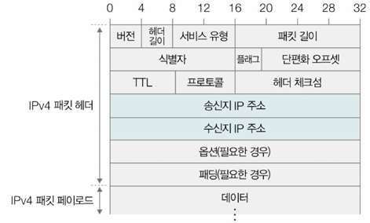
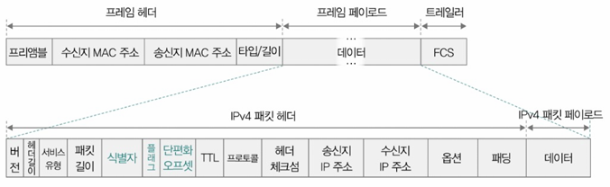
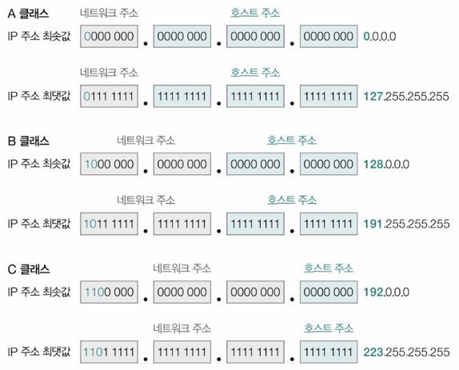
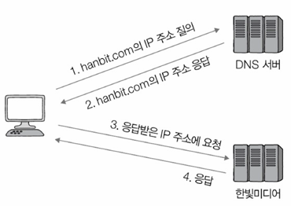
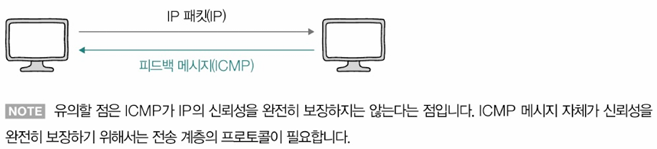
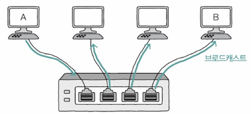
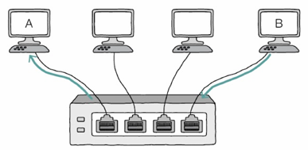

- [Ch.5-3 네트워크 계층 - IP](#ch5-3-네트워크-계층---ip)
  - [1. IP의 목적과 특징](#1-ip의-목적과-특징)
    - [IP의 본래 목적 - 주소 지정과 단편화](#ip의-본래-목적---주소-지정과-단편화)
      - [단편화 관련 필드](#단편화-관련-필드)
    - [➕ IP 단편화 피하기 - 경로 MTU 발견](#-ip-단편화-피하기---경로-mtu-발견)
    - [IP 통신 특성](#ip-통신-특성)
  - [2. IP 주소의 구조](#2-ip-주소의-구조)
    - [클래스풀 주소 체계](#클래스풀-주소-체계)
    - [클래스리스 주소 체계(Classless Addressing)](#클래스리스-주소-체계classless-addressing)
      - [서브넷 마스크와 IP 주소의 AND 연산 과정](#서브넷-마스크와-ip-주소의-and-연산-과정)
    - [연산 과정 설명](#연산-과정-설명)
    - [실제 활용 예시](#실제-활용-예시)
    - [CIDR 표기법과의 관계](#cidr-표기법과의-관계)
  - [3. 공인 IP주소와 사설 IP주소](#3-공인-ip주소와-사설-ip주소)
  - [4. IP 주소 할당](#4-ip-주소-할당)
    - [정적 할당](#정적-할당)
    - [동적 할당(DHCP)](#동적-할당dhcp)
  - [5. ICMP(Internet Control Message Protocol)](#5-icmpinternet-control-message-protocol)
  - [6. IP 주소와 MAC 주소의 대응: ARP (Address Resolution Protocol)](#6-ip-주소와-mac-주소의-대응-arp-address-resolution-protocol)

# Ch.5-3 네트워크 계층 - IP
## 1. IP의 목적과 특징
- **주소 지정(Addressing)**: 네트워크 간의 통신 과정에서 호스트 특정
- **단편화(Fragmentation)**: 데이터를 여러 IP 패킷으로 올바르게 쪼개어 보내는 것
- IP는 네트워크 상에서 데이터를 전달하기 위한 프로토콜

### IP의 본래 목적 - 주소 지정과 단편화
\
➡️ 패킷 = 페이로드 + 헤더 (+트레일러)
- 옥텟 단위로 구성된 주소 체계 사용
  - 옥텟(octet): 점으로 구분된 하나의 10진수, 8비트로 표현
- 라우터를 통해 패킷을 목적지까지 전달 ; `라우팅` (IP주소를 바탕으로 IP 패킷 전달하는 네트워크 장비: 라우터)
- IP 헤더에는 송신지와 수신지 IP 주소(각 32비트) 포함
- **MTU**(Maximum Transmission Unit): 최대 전송 단위 → 프레임을 통해 주고받을 수 있는 최대 페이로드 크기
#### 단편화 관련 필드
  
  - **식별자**(identifier): 원본 패킷 식별
  - **플래그**(flag): 단편화 가능 여부, 마지막 단편 표시
  - **단편화 오프셋**(fragment offset): 원본 패킷에서의 위치

### ➕ IP 단편화 피하기 - 경로 MTU 발견
- IP 단편화를 피하기 위한 기술
  - 잦은 단편화는 네트워크에 악영향
    - 단편화된 패킷 많아지면 전송해야 할 패킷의 헤더 많아져서 불필요한 트래픽 증가, 대역폭 낭비 초래
    - 단편화된 패킷 재조립 과정에서 발생하는 부하도 성능 저하로 이어질수도
- 경로상의 최소 MTU를 찾아 패킷 크기 조절

### IP 통신 특성
- **신뢰할 수 없는 통신(Unreliable)**
  - **Best Effort 전달(최선형 전달)**: 최선을 다해 전달
    - 신뢰성 높은 전송X
    - 실은 어떠한 보장도 하지 않는 전송 특징
  - 패킷 손실, 중복, 순서 바뀜 가능
- **비연결형 프로토콜(Connectionless)**
  - 패킷마다 독립적으로 전송
  - 사전 연결 설정 없음
  - 반대 예시: 연결형 프로토콜 - TCP(송수신지 간 연결 설정으로 패킷 주고받을 호스트 간 송수신 준비 되었는지 확인)

## 2. IP 주소의 구조

### 클래스풀 주소 체계
- A~E 클래스로 구분(주로 A~C 사용)
  
- 네트워크 주소와 호스트 주소로 구성
  - **네트워크 주소**: 네트워크 ID, 네트워크 식별자 등으로 불림 → 호스트가 속한 네트워크 특정 위해 사용
  - **호스트 주소**: 호스트 ID, 호스트 식별자 등으로 불림 → 네트워크에 속한 호스트 특정 위해 사용
- 네트워크 주소 표현하는 크기, 호스트 표현하는 크기 **유동적**
- 특수 목적 주소 - `예약된 IP 주소`; 호스트 주소 공간 모두 다 사용가능X
  | 예약 IP 주소의 범위           | 사용 목적                           |
  |------------------------------|--------------------------------|
  | 0.0.0.0 ~ 0.255.255.255      | '이 네트워크의 이 호스트' 지칭에 사용 |
  | 127.0.0.0 ~ 127.255.255.255  | 루프백 주소로 사용                  |
  | 10.0.0.0 ~ 10.255.255.255    | 사설 네트워크 주소로 사용             |
  | 172.16.0.0 ~ 172.31.255.255  | 사설 네트워크 주소로 사용             |
  | 192.168.0.0 ~ 192.168.255.255 | 사설 네트워크 주소로 사용             |
  - **루프백 주소**: 자기 자신 기리키는 주소 (= 로컬호스트(localhost))

### 클래스리스 주소 체계(Classless Addressing)
- 서브넷 마스크 사용
  - **서브넷 마스크**: IP 주소 상 네트워크 주소를 1로 표기, 호스트 주소를 0으로 표기한 비트열
  - 서브네트워크 = 서브넷: IP 주소에서 네트워크 주소로 구분할 수 있는 네트워크의 부분집합
  - 즉, 서브넷 마스크는 서브넷을 구분(마스크)하는 비트열
- **서브네팅**: 큰 네트워크를 작은 네트워크로 분할
- CIDR 표기법: IP주소/서브넷 비트 수 → IP 주소/서브넷 마스크상의 1의 개수
- 서브넷 마스크와 IP 주소 간 AND 연산으로 네트워크 구분

#### 서브넷 마스크와 IP 주소의 AND 연산 과정
```
IP 주소:        192.168.1.10   (11000000.10101000.00000001.00001010)
서브넷 마스크:   255.255.255.0  (11111111.11111111.11111111.00000000)
AND 연산 결과:   192.168.1.0    (11000000.10101000.00000001.00000000)
```
### 연산 과정 설명
1. IP 주소와 서브넷 마스크를 2진수로 변환
2. 각 비트별로 AND 연산을 수행
3. 연산 결과가 해당 IP가 속한 네트워크 주소가 됨

### 실제 활용 예시
- 서브넷 마스크가 255.255.255.0인 경우
  - 192.168.1.10 → 네트워크 주소: 192.168.1.0
  - 192.168.1.50 → 네트워크 주소: 192.168.1.0
  - 192.168.2.10 → 네트워크 주소: 192.168.2.0

### CIDR 표기법과의 관계
서브넷 마스크는 CIDR 표기법으로도 나타낼 수 있음
- 255.255.255.0 = /24 (이진수로 바꾸면 앞부터 연속된 1이 24개)
- 255.255.0.0 = /16 (연속된 1이 16개)
- 255.0.0.0 = /8 (연속된 1이 8개)

## 3. 공인 IP주소와 사설 IP주소
- 공인 IP 주소: 인터넷에서 직접 사용 가능한 주소
- 사설 IP 주소: 내부 네트워크에서만 사용하는 주소

## 4. IP 주소 할당

### 정적 할당
- 수동으로 IP 주소 설정
- 서버나 프린터처럼 주소 바뀌면 안 되는 장비에 사용
- 입력해야 하는 것들: IP주소, 서브넷 마스크(어디까지 네트워크인가), 게이트웨이
- **게이트웨이(Gateway)**: 일반적으로 서로 다른 네트워크 연결하는 HW/SW적 수단
  - **기본 게이트웨이(default gateway)**: 호스트가 속한 네트워크 외부로 나가기 위한 첫 기본 경로
  - 기본 게이트웨이는 네트워크 외부와 연결된 라우터(공유기) 주소 의미하는 경우 多<br>


### 동적 할당(DHCP)
- DHCP 서버가 자동으로 IP 주소 할당
- 네트워크 연결 시 - IP 주소, 서브넷 마스크, 게이트웨이, DNS 등 자동으로 받아 옴
- **임대 기간 존재** - 주기적 임대 갱신 필요
- **동적 IP 주소는 할당받을 때마다 다른 주소 받을 수 있음**

## 5. ICMP(Internet Control Message Protocol)
- IP의 신뢰성 향상을 위한 보조 프로토콜
  - IP는 데이터를 목적지까지 보내는 기본 역할만 수행
  - IP는 신뢰성 보장X, 오류 처리X ➡️ 이걸 돕는 게 `ICMP`
- **오류 보고 및 상태 확인**
- ICMP 메시지: IP 패킷 전송 과정에 대한 피드백 메시지 → 이를 통해 패킷이 상대방에게 어떻게 전송되었는지 알 수 있음(IP 전송 결과 확인 가능)<br>
  
  - 오류 보고: 전송 과정에서 발생한 오류 보고
  - 상태 확인: 네트워크에 대한 진단 정보(네트워크 상 정보 제공) → ping 테스트
    | 유형                         | 메시지                                                                 |
    |------------------------------|------------------------------------------------------------------------|
    | **① 오류 보고**              | 네트워크 도달 불가 (Destination network unreachable)                  |
    |                              | 호스트 도달 불가 (Destination host unreachable)                      |
    |                              | 프로토콜 도달 불가, 수신지에서 특정 프로토콜을 사용할 수 없음 (Destination protocol unreachable) |
    |                              | 포트 도달 불가 (Destination port unreachable)                        |
    |                              | 단편화가 필요하지만 DF가 1로 설정되어 단편화할 수 없음 (Fragmentation required, and DF flag set) |
    |                              | TTL 만료 (TTL expired in transit)                                    |
    | **② 네트워크 상의 정보 제공** | Echo 요청 (Echo request)                                             |
    |                              | Echo 응답 (Echo reply)                                               |

- 홉(Hop): 패킷이 호스트 or 라우터에 한 번 전달되는 것
  - 패킷이 라우터나 장비 한 번 지나칠 때마다 `1hop`
  - TTL(Time To Live; 시간 초과) 필드의 존재 이유 - 무의미한 패킷이 네트워크상 지속적으로 남아있는 것 방지 위함
  - TTL 필드의 값은 홉마다 1씩 감소
  - `TTL = 0`: 패킷 버려지고, ICMP TTL expired 메시지 전송

## 6. IP 주소와 MAC 주소의 대응: ARP (Address Resolution Protocol)
- IP 주소를 MAC 주소로 변환
- ARP 요청/응답 메시지로 주소 정보 교환
  - ARP 요청 메시지는 브로드캐스트 메시지 → 네트워크 내 모든 호스트가 수신<br>
    
  - 관련 있는 경우 ARP 응답 메시지 보냄<br>
    
- ARP 테이블: IP-MAC 주소 매핑 정보 저장
- <정리>
  - IP → MAC: ARP
  - MAC → IP: RARP(최근에 잘 쓰지는 않음)