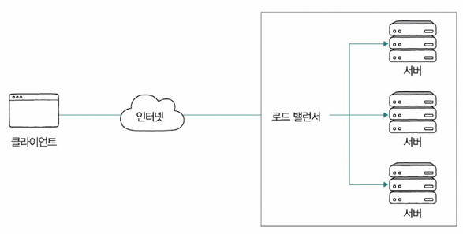
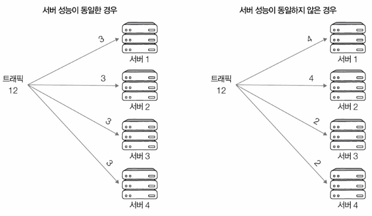
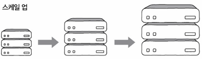
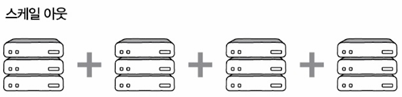
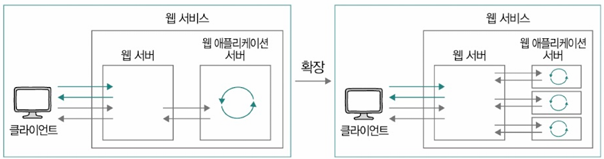
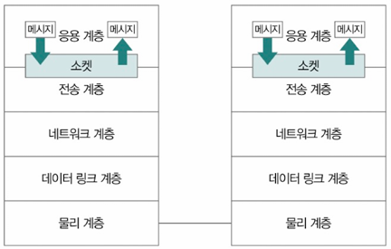

# Ch.5-7 프록시와 안정적인 트래픽
- [Ch.5-7 프록시와 안정적인 트래픽](#ch5-7-프록시와-안정적인-트래픽)
- [1. 오리진 서버와 중간 서버: 포워드 프록시와 리버스 프록시](#1-오리진-서버와-중간-서버-포워드-프록시와-리버스-프록시)
    - [➕ 가용성과 고가용성](#-가용성과-고가용성)
  - [1.1 대표적 HTTP 중간 서버 유형](#11-대표적-http-중간-서버-유형)
    - [\<참고\>](#참고)
- [2. 고가용성: 로드 밸런싱과 스케일링](#2-고가용성-로드-밸런싱과-스케일링)
  - [2.1 고가용성](#21-고가용성)
    - [➡️ 결함 감내(Fault Tolerance)](#️-결함-감내fault-tolerance)
    - [➕ 헬스 체크와 하트비트](#-헬스-체크와-하트비트)
  - [2.2 로드 밸런싱(Load Balancing)](#22-로드-밸런싱load-balancing)
    - [로드 밸런싱 알고리즘](#로드-밸런싱-알고리즘)
  - [2.3 스케일링: 스케일 업 스케일 아웃 오토스케일링](#23-스케일링-스케일-업-스케일-아웃-오토스케일링)
    - [➕ 오토스케일링(Auto Scaling)](#-오토스케일링auto-scaling)
- [3. Nginx를 활용한 로드 밸런싱](#3-nginx를-활용한-로드-밸런싱)
    - [➕ 업스트림/다운스트림과 인바운드/아웃바운드](#-업스트림다운스트림과-인바운드아웃바운드)
- [\<추가 학습\> 웹 서버와 웹 애플리케이션 서버](#추가-학습-웹-서버와-웹-애플리케이션-서버)
- [\<추가 학습\> 소켓 프로그래밍](#추가-학습-소켓-프로그래밍)

# 1. 오리진 서버와 중간 서버: 포워드 프록시와 리버스 프록시
- 실제 네트워크
  - 클라이언트-서버 사이에 수많은 네트워크 장비와 중간 서버들이 존재하는 복잡한 구조
  - 서비스 안정성 위해 서버 다중화해서 운영하는 것이 일반적
- **오리진 서버**
  - 자원을 생성하고 클라이언트에게 권한 있는 응답 보낼 수 있는 HTTP 서버
  - 클라이언트의 요청을 직접 처리하는 서버 → 원본 데이터를 저장하고 응답을 제공하는 역할
  - 하지만 대량의 트래픽이 발생하면 부하가 증가할 수 있어서 **프록시(proxy)**를 통해 요청을 중개하는 방식이 활용
  - 다중화된 오리진 서버 
    

### ➕ 가용성과 고가용성
- **가용성(availability)**: 서버, 네트워크, 특정 HW 부품 비롯한 특정 컴퓨터 시스템이 주어진 기능 실제로 수행할 수 있는 시간의 비율
- **고가용성(HA**; High availability) = 가용성이 높다 : 주어진 기능 문제없이 수행하는 시간의 비율 높으면
- 서버의 다중화 → 고가용성을 위한 설계

## 1.1 대표적 HTTP 중간 서버 유형
1. **프록시(Proxy)**
   
   - 클라이언트가 선택한 **메시지 전달의 대리자(심부름꾼, 대리인)**
   - 주로 캐시 저장, 클라언트 암호화 및 접근 제한 등의 기능 제공
   - 일반적으로 오리진 서버보다 클라이언트와 더 가까이 위치
2. **게이트웨이(Gateway)**
   
   - 오리진 서버(들) 향하는 요청 메시지를 먼저 받아서 오리진 서버(들)에게 전달하는 문지기 및 경비
   - 요청 메시지 보내는 네트워크 외부 클라이언트 시각에서 보면 오리진 서버같이 보임(게이트웨이가 클라이언트 요청받고, 클라이언트에게 응답보내니까)
   - 그래서 일반적으로 클라이언트보다 오리진 서버(들)에 더 가까이 위치
   - 캐시 저장, 부하 분산하는 로드 밸런서 동작

### <참고>
- **포워드 프록시(Forward Proxy)** = 프록시
  - `클라이언트(사용자PC)` 앞에 놓여서 클라이언트의 요청을 대신 인터넷으로 전달(`forward`)
  - 기업 내부망에서 인터넷 접근을 통제하거나 캐싱을 활용해 성능을 최적화하는 데 사용
- **리버스 프록시(Reverse Proxy)**+α ≒ 게이트웨이 
  - `서버` 앞에 놓여서 인터넷으로부터 들어오는 요청 받아서 내부 서버로 역으로(`reverse`) 전달 → 이때, 외부 요청 받아서 내부 서버로 연결해주는 관문(Gateway)처럼 동작
  - 로드 밸런싱을 통해 부하를 분산, SSL 암호화를 수행, 캐싱을 활용해 응답 속도를 최적화하는 기능
  - 리버스 프록시는 게이트웨이의 한 종류일 뿐(다른 예: API 게이트웨이, NAT 게이트웨이)

# 2. 고가용성: 로드 밸런싱과 스케일링
## 2.1 고가용성
> **가용성 = 업타임 / (업타임 + 다운타임)**
- **업타임(uptime)**: 정상적인 사용 시간
- **다운타임(downtime)**: 모종의 이유로 정상적인 사용 불가능한 시간
  - 다운 타임 발생 원인(아주 다양)
    - 과도한 트래픽으로 인한 서비스 다운
    - 예기치 못한 SW 상 오류 또는 HW 장애
    - 보안 공격
    - 자연 재해 등
  - 다운 타임 원인 너무 다양 → **원천 차단은 현실적으로 불가능**
- `안정적` 시스템의 가용성 백분율: **99.999% 이상**(파이브 나인스)

### ➡️ 결함 감내(Fault Tolerance)
  - 문제 원천 차단 불가 → 고가용성 유지하기 위해 `문제 발생해도 계속 기능할 수 있도록 설계`
  - 다운타임↓, 가용성↑ → 서비스, 인프라가 결함 감내할 수 있도록 설계하는 것이 중요
  - 결함 감내 대표 기술: **다중화** - 서버 다중화 시, 특정 서버 문제 생겨도 다른 예비 서버가 대신 동작 가능
  - 페일오버(Failover): 동작하는 시스템 문제 생겼을 때 예비된 시스템으로 자동 전환 기능

### ➕ 헬스 체크와 하트비트
- **헬스 체크(Health Check)**: 다중화된 서버 환경에서 현재 문제 있는 서버가 있는지, 현재 요청에 올바른 응답 가능한 상태인지 주기적으로 검사 
  
  - 로드 밸런서에 의해 이뤄지는 경우 多, HTTP나 ICMP 등 다양한 프로토콜 활용 가능
- **하트비트(heartbeat)**: 서버 간 주기적으로 하트비트 메시지 주고 받다가 메시지 끊기면 문제 발생 감지

## 2.2 로드 밸런싱(Load Balancing)
- 서버 다중화 != 고가용성
  - 서버의 가용성에 가장 큰 영향 대표 요소: 감당하기 어려울 정도의 트래픽
  - 서버 다중화해도 특정 서버만 트래픽 몰리면서 분산X → 가용성↓
- **로드 밸런싱(Load Balancing)**: 여러 서버에 트래픽을 분산해 부하를 줄이는 기술 
  
- **로드 밸런서(Load Balancer)**
  - 로드 밸런싱 수행
  - 다중화된 서버와 클라이언트 사이 위치해서 클라이언트의 요청(들)을 각 서버에 균등하게 분배
- 로드 밸런서 HW: L4스위치, L7스위치 같은 네트워크 장비
- 대표적인 로드 밸런싱 SW: HAProxy, Envoy 등 (Nginx는 로드 밸런싱 기능 내장) ⇒ **일반 호스트도 로드 밸런서로 사용가능**

### 로드 밸런싱 알고리즘
부하 균등하게 분산되도록 요청 전달할 서버 선택하는 방법
- **라운드 로빈 알고리즘**: 순차적으로 서버에 요청 분배
- **최소 연결 알고리즘**: 현재 연결이 가장 적은 서버로 분배
- 해시 이용, 단순 무작위 부하 전달, 응답시간 가장 짧은 서버로 분배 등 여럿 있음
- **가중치 기반 분배** - 서버 성능에 따라 트래픽을 차등 분배
  - 다중화된 모든 서버에 균일한 부하 부여는 모든 서버의 성능이 동일하단 전제에서만 유효
  - 각각 알고리즘을 바탕으로 동작하되, `가중치`가 높은 서버가 더 많이 선택되어 더 많은 부하 받도록 
    

## 2.3 스케일링: 스케일 업 스케일 아웃 오토스케일링
- 꼭 비싼 장비만으로 고가용성X
- **스케일링**: 트래픽 증가에 맞춰 서버 자원을 확장하는 방법
  - **스케일 업(=수직적 확장)(scale-up)**은 기존 서버의 성능을 향상시키는 방식 
    
    - 장점: 설치와 구성 단순 - 더 좋은 장비로 교체하면 됨
    - 단점: 스케일 아웃 보다 유연성↓ - 하나의 스케일 업 장비 성능에 한계 있으면 스케일 아웃 하지 않는 이상 계속 더 비싸고 성능 좋은 장비 필요
  - **스케일 아웃(=수평적 확장)(scale-down)** 은 서버의 개수를 증가시키는 방식 
  - 
    - 장점: 스케입 업 확장 보다 결함 감내 용이 - 장비 하나 고장나도 다른 장비가 그 장비 대체 용이(안정적 운용 가능)
    - 단점: 스케일 업보다는 설치와 구성 단순X
- <정리> 스케일 업, 스케일 아웃 차이
  - 스케입 업: 더 높은 사양의 HW 추가하는 등 더 뛰어난 성능의 자원으로 대체해서 성능 높이는 방법
  - 스케일 아웃: 여러 시스템 추가하여 처리 능력 확장

### ➕ 오토스케일링(Auto Scaling)
실시간 트래픽 변화에 따라 서버를 자동으로 확장하거나 축소하는 기술
- 필요할 때마다 시스템 동적으로 확대/축소 가능
- 자원 더욱 경제적, 탄력적 이용 가능
- 대부분의 클라우드 서비스 업체에서 이런 오토스케일링 서비스 제공

# 3. Nginx를 활용한 로드 밸런싱
로드 밸런싱을 구현하는 대표적인 방법 - **Nginx**를 활용
1. `${nginx}/nginx.conf` - 가장 기본적인 설정 파일이나 모든 설정들의 시작점 파일
2. `${nginx}/log/nginx/디렉터리` - Nginx 관련 로그 정보 저장
3. `${nginx}/conf.d/디렉터리` - 각종 설정 파일 포함
  - http: 웹 서버 관련 설정
  - access log: 웹 서버가 수신한 개별 요청 관련 로그 - '/var/log/nginx/access.log'
  - error log: 웹 서버와 관련한 오류 관련 로그 - '/var/log/nginx/error.log'
  - conf.d: '/etc/nginx/conf.d' 경로에 놓인 <파일명>.conf 내용은 모두 웹 서버 관련 설정으로 간주

### ➕ 업스트림/다운스트림과 인바운드/아웃바운드
오리진 서버가 최상위 위치한 서버로 간주 시, 

- **업스트림(upstream)**: 상위 서버로 데이터 보내는 방향
  - 업스트림 트래픽: 클라이언트에서 오리진 서버로 향하는 트래픽  
- **다운스트림(downstream)**: 상위 서버에서 클라이언트로 데이터 보내는 방향
- **인바운드(inbound)** 트래픽: 외부에서 서버로 접근하려는 요청
  - 주로 외부 사용자가 내부 네트워크의 서버나 서비스 접근하려는 요청
  - 예: 외부 인터넷 사용자들이 회사 웹사이트 접속하는 트래픽 → 회사 입장에서 인바운드 트래픽
- **아웃바운드(outbound)** 트래픽: 서버에서 클라이언트로(내부→외부) 나가는 트래픽
  - 내부 시스템이나 사용자들이 외부 서버나 서비스에 요청 보내는 경우
  - 예: 회사 직원이 외부 웹사이트 방문할 때 생성되는 트래픽 → 회사 입장에서 아웃바운드 트래픽

# <추가 학습> 웹 서버와 웹 애플리케이션 서버
- **웹 서버** 
  - 서버의 역할 수행하는 HW + 서버 역할의 SW
    - SW 맥락에서의 웹 서버 - Nginx, 아파치 HTTP 서버, 마이크로소프트 IIS 등
  - `정적인 정보` 응답
    - 송수신 과정에서 수정, 처리 필요 없는 정보
    - 언제, 어디서, 누가 봐도 변치 않을 정보
    - 예: HTML, CSS, JavaScript 등의 파일, 이미지 파일, 동영상 파일 등
  - HTTP 요청을 처리하는 역할 
  +) `동적인 정보`: 송수신 과정에서 수정, 처리 필요한 정보, 언제/어디서/누가 보는지에 따라 변할 수 있는 정보 → DB에 저장된 값을 다양하게 조회하거나 데이터를 다양하게 전처리해야 하는 정보 
    
- **웹 애플리케이션 서버(WAS; Web Application Server)**: 데이터베이스와의 연동, 비즈니스 로직 실행 등 동적 콘텐츠 처리를 담당
  - 예: 아파치 톰캣, JBOSS, WebSphere 등
- **웹 서비스에서 웹 서버 & 웹 애플리케이셥 서버 동시에 사용**되는 경우 많음
  - 예: 웹 서비스가 수신하는 요청 - 정적인 정보는 웹 서버가 응답, 동적인 정보는 WAS가 응답
  - 이런 식으로 설계하면 **과도한 부하 분산 가능, 여러 웹 애플리케이션 연동해서 확장에도 유리**
    
- **미들웨어(Middleware)**
  - OS와 응용 프로그램 사이 조정하고 중개하는 중간 다리 역할의 SW
  - **웹 애플리케이션 서버는 미들웨어의 일종**
  - 서버 개발 맥락에서 응용 프로그램 예시: 각종 웹 프레임워크로 만든 프로그램 
    - SpringBoot 실행 후 로그에 웹 애플리케이션 서버(Tomcat)도 덩달아 실행
- <정리> 웹 서버, 웹 애플리케이션 차이 & 함께 사용하는 이유
  - 웹 서버: 정적인 콘텐츠 응답
  - 웹 애플리케이션 서버(WAS): 정적인 콘텐츠 & 동적인 콘텐츠 응답 가능
  - 함께 사용 시: 정적인 정보는 웹 서버가 응답, 동적인 정보는 WAS가 응답 → 부하 분산, 여러 웹 서버 및 웹 애플리케이션 확장에 유리

# <추가 학습> 소켓 프로그래밍
- **네트워크 소켓(socket)** - Like. 우체통 
  프로세스 간 네트워크 통신의 엔드포인트(endpoint)
  - 두 프로세스가 소켓 `열고`, 송신지 프로세스가 메시지를 소켓에 `쓰고`, 수신지 프로세스가 메시지를 소켓에서 `읽음`
  - 많은 OS에서 파일처럼 간주
  - 소켓 입출력과 관련해 다양한 시스템 콜 존재
    