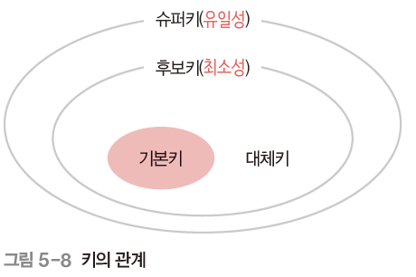
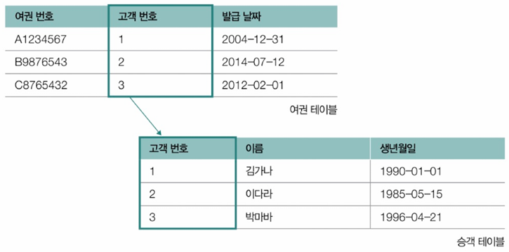
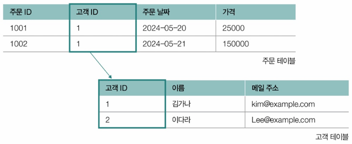
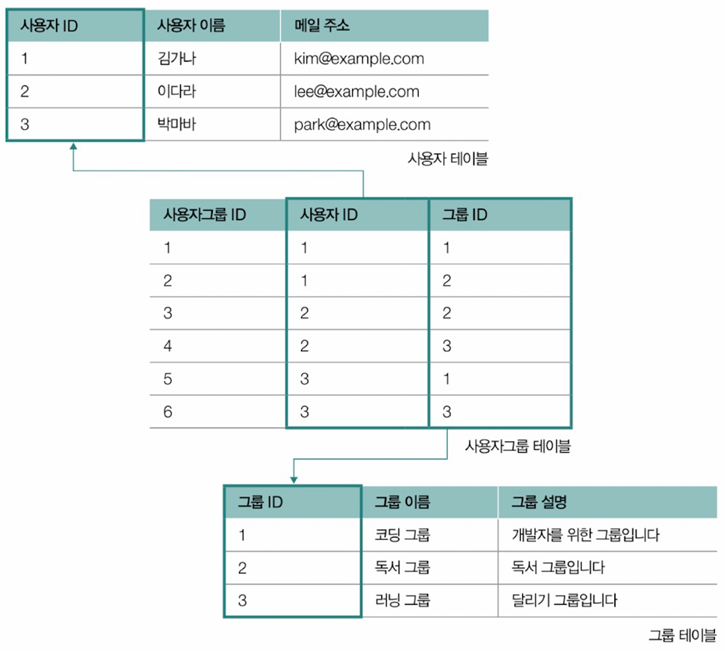
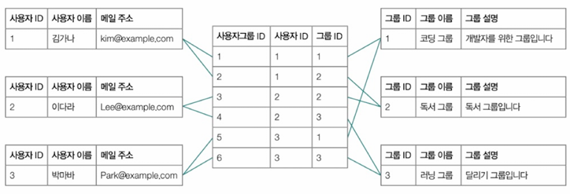
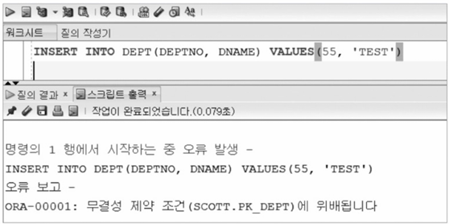
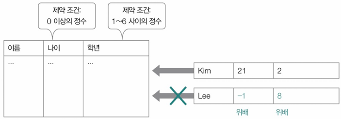
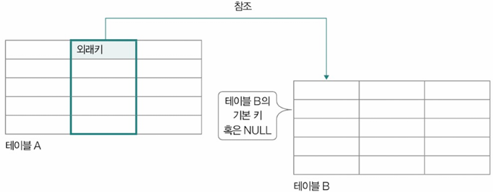
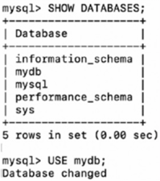

- [Ch.6-2 RDBMS의 기본](#ch6-2-rdbms의-기본)
- [1. 테이블의 구성: 필드와 레코드](#1-테이블의-구성-필드와-레코드)
  - [1.1 필드 타입](#11-필드-타입)
  - [1.2 키(key)](#12-키key)
    - [키의 종류](#키의-종류)
- [2. 테이블의 관계](#2-테이블의-관계)
  - [2.1 일대일(1:1) 대응 관계](#21-일대일11-대응-관계)
  - [2.2 일대다(1:N) 대응 관계](#22-일대다1n-대응-관계)
  - [2.3 다대다(M:N) 대응 관계](#23-다대다mn-대응-관계)
- [3. 무결성 제약 조건](#3-무결성-제약-조건)
  - [3.1 도메인 제약 조건(Domain Constraint)](#31-도메인-제약-조건domain-constraint)
  - [3.2 키 제약 조건(Key Constraint)](#32-키-제약-조건key-constraint)
  - [3.3 엔티티 무결성 제약 조건(=기본 키 제약 조건) (Entity Integrity Constraint)](#33-엔티티-무결성-제약-조건기본-키-제약-조건-entity-integrity-constraint)
  - [3.4 참조 무결성 제약 조건(= 외래 키 제약 조건) (Referential Integrity Constraint)](#34-참조-무결성-제약-조건-외래-키-제약-조건-referential-integrity-constraint)
  - [\<참고\> 참조하는 테이블이 삭제/수정될 경우의 처리 방식](#참고-참조하는-테이블이-삭제수정될-경우의-처리-방식)
- [Ch.6-3 SQL](#ch6-3-sql)
- [1. 데이터 정의 언어(DDL; Data Definition Language)](#1-데이터-정의-언어ddl-data-definition-language)
  - [1.1 CREATE](#11-create)
    - [➕ 데이터베이스 조회 및 사용](#-데이터베이스-조회-및-사용)
    - [CREATE TABLE 문](#create-table-문)
      - [테이블 생성 및 제약 조건](#테이블-생성-및-제약-조건)
    - [➕ 테이블 조회](#-테이블-조회)
  - [1.2 ALTER](#12-alter)
    - [새로운 필드 추가](#새로운-필드-추가)
    - [기존 필드 수정](#기존-필드-수정)
    - [기존 필드 삭제](#기존-필드-삭제)
    - [외래 키 제약 조건 추가](#외래-키-제약-조건-추가)
    - [UNIQUE 제약 조건 추가](#unique-제약-조건-추가)
    - [NOT NULL 제약 조건 추가](#not-null-제약-조건-추가)
    - [기본 키 설정(PRIMARY KEY로 사용 중인 필드가 없을 경우)](#기본-키-설정primary-key로-사용-중인-필드가-없을-경우)
  - [1.3 DROP](#13-drop)
  - [1.4 TRUNCATE](#14-truncate)
- [2. 데이터 조작 언어(DML)](#2-데이터-조작-언어dml)
  - [2.1 SELECT](#21-select)
    - [GROUP BY](#group-by)
    - [HAVING](#having)
    - [ORDER BY](#order-by)
    - [LIMIT](#limit)
    - [SELECT문 실행 순서](#select문-실행-순서)
  - [2.2 INSERT](#22-insert)
    - [레코드 하나 삽입](#레코드-하나-삽입)
    - [여러 개의 레코드 삽입](#여러-개의-레코드-삽입)
    - [레코드 삽입 시 유의 - 무결성 제약 조건 준수](#레코드-삽입-시-유의---무결성-제약-조건-준수)
  - [2.3 UPDATE](#23-update)
    - [연산자](#연산자)
  - [2.4 DELETE](#24-delete)
    - [➕ 외래 키 제약 조건 (ON UPDATE, ON DELETE)](#-외래-키-제약-조건-on-update-on-delete)
- [3. 트랜잭션 제어 언어(TCL)](#3-트랜잭션-제어-언어tcl)
  - [3.1 COMMIT](#31-commit)
  - [3.2 ROLLBACK](#32-rollback)
    - [➕ 자동 커밋(auto commit)](#-자동-커밋auto-commit)
  - [3.3 SAVEPOINT](#33-savepoint)
- [4. 데이터 제어 언어(DCL)](#4-데이터-제어-언어dcl)
  - [4.1 GRANT](#41-grant)
  - [4.2 REVOKE](#42-revoke)
---
# Ch.6-2 RDBMS의 기본

# 1. 테이블의 구성: 필드와 레코드  
- **필드(Field)**: 테이블의 열(column) → 하나의 속성 
- **레코드(Record, 튜플)**: 테이블의 행(row) → 하나의 개별 데이터 항목  

## 1.1 필드 타입
> RDBMS 내 레코드들은 테이블 형태<br>
> → 이때 각 필드로 사용 가능한 데이터 유형 ; **필드 타입**<br>

<MySQL 기준>

| **유형**      | **타입**     | **설명** |
|--------------|------------|----------|
| **숫자형**   | TINYINT    | 1바이트의 정수(-128 ~ 127) |
|              | SMALLINT   | 2바이트의 정수(-32768 ~ 32767) |
|              | MEDIUMINT  | 3바이트의 정수(-8388608 ~ 8388607) |
|              | INT        | 4바이트의 정수(-2147483648 ~ 2147483647) |
|              | BIGINT     | 8바이트의 정수(-9223372036854775808 ~ 9223372036854775807) |
|              | FLOAT      | 4바이트 부동 소수점 실수 |
|              | DOUBLE     | 8바이트 부동 소수점 실수 |
|              | DECIMAL    | DECIMAL(전체 자리수, 소수점 자리수) 형식의 고정 소수점 실수 (예: DECIMAL(3,2)는 소수점 이하 2자리로 총 3자리의 숫자) |
| **문자형**   | CHAR       | 고정 길이 문자열 |
|              | VARCHAR    | 가변 길이의 문자열 |
|              | BLOB       | 이미지, 미디어 같은 대형 바이너리 데이터 |
|              | TEXT       | 대량 텍스트 문자열 |
| **날짜/시간형** | DATE       | YYYY-MM-DD 형식의 날짜 |
|              | TIME       | HH:MM:SS 형식의 시간 |
|              | DATETIME   | 8바이트 YYYY-MM-DD HH:MM:SS 형식의 날짜와 시간 |
|              | TIMESTAMP  | 4바이트 YYYY-MM-DD HH:MM:SS 형식의 타임스탬프 |
| **기타**     | ENUM       | 정해진 값 중 하나 (예: 남, 여) |
|              | GEOMETRY   | 지리 정보 데이터 타입 (좌표) |
|              | XML        | XML 데이터 |
|              | JSON       | JSON 데이터 |


## 1.2 키(key)
- 테이블 내에서 레코드를 식별할 수 있는 하나 이상의 필드
- 테이블 간 참조하거나 테이블 접근 속도 높이기 위해 사용
### 키의 종류

- **후보 키(Candidate Key)**
  - 유일성과 최소성을 모두 만족하는 키
  - 테이블 내 하나 이상 존재 가능
- **복합 키(Composite Key)**: 최소 2개 이상 필드로 구성된 후보 키
- 슈퍼 키(Super Key)
  - 레코드 식별하기 위한 필드의 최소 집합이 아닌, `레코드 식별하기 위한 필드의 집합`
  - 유일성을 만족하지만 최소성을 만족하지 않는 키 → 슈퍼 키에는 레코드 식별에 꼭 필요하지 않은 필드도 포함될 수 있음
- **기본 키(PK; Primary Key)**
  - 테이블 당 하나만 존재
  - 여러 후보 키 중, 테이블 레코드 대표하도록 선택된 키
  - 후보 키 중에서 한 개를 선택하여 테이블의 주 식별자로 지정 
  - 후보 키 일부 → 유일성, 최소성 모두 만족
  - 여러 필드로 구성된 기본 키도 존재할 수 있음
  - 단, NULL 값은 가질 수 없음 
- 대체 키(Alternate Key): 후보 키 중에서 기본 키로 선택되지 않은 나머지 키
- **외래 키(FK; Foreign Key)**: 다른 테이블의 기본 키를 참조하여 관계를 맺는 키

# 2. 테이블의 관계 
## 2.1 일대일(1:1) 대응 관계  
- 한 테이블의 한 레코드가 다른 테이블의 한 레코드와만 대응  
- 예: 승객 테이블과 여권 테이블<br>
  

## 2.2 일대다(1:N) 대응 관계  
- 한 테이블의 한 레코드가 다른 테이블의 여러 레코드와 대응  
- 예: 고객 테이블과 주문 테이블 (한 명의 고객이 여러 개의 주문을 가질 수 있지만, 각 주문은 한 명의 고객에게만 속함)<br>
  

## 2.3 다대다(M:N) 대응 관계
- 한 테이블의 여러 레코드가 다른 테이블의 여러 레코드와 대응되는 경우
- 예: SNS - 하나의 사용자 계정이 여러 그룹에 가입(각 사용자는 여러 그룹 가입, 각 그룹에는 여러 사용자가 속함)<br>
  
  

# 3. 무결성 제약 조건  
- 데이터베이스에 저장된 데이터의 일관성과 유효성을 유지하기 위해 적용되는 제약 조건
- 무결성 제약 조건의 종류 4가지 있음
- 안지키면 오류 메시지<br>
  

## 3.1 도메인 제약 조건(Domain Constraint)
- 특정 필드가 가질 수 있는 값의 범위를 제한하는 규칙  
- 예: `AGE` 필드는 `0~150` 사이의 값만 가질 수 있음
- 각각 필드 데이터는 원자 값 가져야 함
- 지정된 필드 타입 준수
- 값의 범위나 기본값이 지정되면 따라야 함
- NULL 허용되지 않으면 NULL 저장X
- 예: 제약 조건 위배하는 데이터가 삽입/ 수정된 경우 → 도메인 제약 조건 위배
  
- **원자 값(Atomic Value)**
  - 더 이상 쪼갤 수 없는 단일한 값
  - 필드에는 하나의 값만 저장되어야 함 (정규화의 원칙)

## 3.2 키 제약 조건(Key Constraint)
레코드를 고유하게 식별할 수 있는 키로 지정된 필드에 중복 값 존재하면 안 됨

## 3.3 엔티티 무결성 제약 조건(=기본 키 제약 조건) (Entity Integrity Constraint)
- **각 레코드는 고유해야 함**
- **기본 키는 NULL 값을 가질 수 없음** 

## 3.4 참조 무결성 제약 조건(= 외래 키 제약 조건) (Referential Integrity Constraint)
- 외래 키는 참조하는 테이블의 기본 키와 같은 값을 같거나 NULL 값을 가져야 함
- 외래 키를 통해 다른 테이블 참조할 때, 데이터의 일관성 지키기 위한 제약 조건<br>
  

## <참고> 참조하는 테이블이 삭제/수정될 경우의 처리 방식
RDBMS는 참조 무결성을 유지하기 위해 4가지 동작

1. **연산 제한 (RESTRICT / NO ACTION)**  
   - 부모 테이블의 데이터가 참조되고 있으면 삭제/수정을 허용하지 않음(거부)
   - 기본 설정 (참조 무결성 제약 조건을 명시하지 않았을 때, RDBMS가 기본적으로 적용하는 동작)
   - 외래 키로 참조된 부모 테이블의 데이터가 삭제 또는 수정될 때, 해당 데이터를 참조하는 자식 테이블의 데이터가 존재하면 삭제/수정을 막음

2. **기본값 설정 (SET DEFAULT)**  
   - 부모 테이블의 데이터가 삭제되면, 자식 테이블의 외래 키 값을 기본값으로 변경  

3. **NULL 값 설정 (SET NULL)**  
   - 부모 테이블의 데이터가 삭제되면, 자식 테이블의 외래 키 값을 `NULL`로 변경  

4. **연쇄 변경 (CASCADE)**  
   - 부모 테이블의 데이터가 삭제/수정되면, 자식 테이블의 데이터도 자동으로 삭제/수정됨  
---
# Ch.6-3 SQL
# 1. 데이터 정의 언어(DDL; Data Definition Language)

## 1.1 CREATE
데이터베이스 혹은 데이터베이스 객체 생성
- 데이터베이스 객체
  - 데이터베이스에서 정의될 수 있는 대상 통칭
  - 테이블, 인덱스, 뷰, 사용자 등
- SQL문의 끝마다 `세미콜론(;)` 표기해야

### ➕ 데이터베이스 조회 및 사용
- 현재 데이터베이스 조회
    ```sql
    SHOW DATABASES;
    ```
    
- 특정 데이터베이스 사용
    ```sql
    USE 데이터베이스_이름;
    ```

### CREATE TABLE 문
```sql
CREATE TABLE 테이블_이름 (
    필드_이름1 필드_타입,
    필드_이름2 필드_타입,
    필드_이름3 필드_타입,
    ...
);
```

#### 테이블 생성 및 제약 조건
- `CREATE TABLE` 문 하단에서 **특정 필드에 대한 제약 조건 명시** 가능
    - `PRIMARY KEY`: 특정 필드를 기본 키로 지정
    - `UNIQUE`: 특정 필드가 고유한 값 갖도록 설정
      - 고유키(UNIQUE KEY): UNIQUE 제약 조건 명시된 필드
        - 기본 키와 유사하게 중복되는 값 가질 수 없음
        - 기본 키와 달리 테이블 내 여러 개 존재할 수 있음, NULL 값 가질 수 있음
    - `FOREIGN KEY`: 특정 필드를 외래 키로 지정
    - `DEFAULT 기본값`: 기본값 지정
    - `NULL/NOT NULL`: 특정 필드에 NULL 값 허용/허용하지 않음

➕ 추가
- AUTO_INCREMENT: 레코드 추가될 때마다 자동으로 1씩 증가
- CURRENT_TIMESTAMP: 현재 시간

### ➕ 테이블 조회
- 테이블 구조 조회
    ```sql
    DESCRIBE 테이블_이름;
    DESC 테이블_이름;
    ```
- 데이터베이스 내 모든 테이블 조회
    ```sql
    SHOW TABLES;
    SHOW TABLES FROM 데이터베이스_이름;
    ```

## 1.2 ALTER
데이터베이스 객체 갱신

### 새로운 필드 추가
> ALTER TABLE 테이블_이름 ADD COLUMN 필드_이름 필드_타입 [제약 조건];
```sql
ALTER TABLE posts ADD COLUMN new_field VARCHAR(50) NOT NULL;
```

### 기존 필드 수정
> ALTER TABLE 테이블_이름 CHANGE COLUMN 기존_필드_이름 새_필드_이름 필드_타입 [제약 조건];
```sql
ALTER TABLE posts CHANGE COLUMN old_field new_field VARCHAR(30) NOT NULL;
```

### 기존 필드 삭제
> ALTER TABLE 테이블_이름 DROP COLUMN 필드_이름;
```sql
ALTER TABLE posts DROP COLUMN old_field;
```

### 외래 키 제약 조건 추가
> ALTER TABLE 테이블_이름 [ADD CONSTRAINT 제약_조건_이름]
>    ADD FOREIGN KEY (필드_이름) REFERENCES 참조_테이블_이름(참조_필드)
```sql
ALTER TABLE posts ADD FOREIGN KEY (user_id) REFERENCES users(user_id);
```

### UNIQUE 제약 조건 추가
> ALTER TABLE 테이블_이름 ADD UNIQUE (필드_이름);
```sql
ALTER TABLE posts ADD UNIQUE (title);
```

### NOT NULL 제약 조건 추가
> ALTER TABLE 테이블_이름 MODIFY 필드_이름 필드_타입 NOT NULL;
```sql
ALTER TABLE users MODIFY email VARCHAR(100) NOT NULL;
```

### 기본 키 설정(PRIMARY KEY로 사용 중인 필드가 없을 경우)
> ALTER TABLE 테이블_이름 ADD PRIMARY KEY (필드_이름);
```sql
ALTER TABLE posts ADD PRIMARY KEY (post_id);
```

## 1.3 DROP
- 데이터베이스 객체 삭제
- DROP 문 테이블, 뷰, 인덱스 등 적용 가능
```sql
DROP DATABASE 데이터베이스_이름;

DROP TABLE 테이블_이름;
```
DROP 명령 이후 조회X<br>


## 1.4 TRUNCATE
**테이블 구조를 유지한 채** 모든 레코드 삭제
```sql
TRUNCATE TABLE 테이블_이름;
```
TRUNCATE 명령 후에도 테이블 조회 OK<br>


# 2. 데이터 조작 언어(DML)

## 2.1 SELECT
테이블의 레코드 조회 → 가장 중요한 SQL 문
```sql
SELECT 필드1, 필드2, ...
    FROM 테이블_이름
    WHERE 조건식
    GROUP BY 그룹화할_필드
    HAVING 필터_조건
    ORDER BY 정렬할_필드
    LIMIT 레코드_제한
```
- `*` : 모든 필드 의미
- ➕ 패턴 검색과 연산/집계 함수
  - SELECT 문은 패턴 검색이나 연산/집계 함수와 사용 多
  - 패턴 검색: 문자열 데이터에서 특정 패턴 찾는 기능
      - LIKE 연산자
      - %: 0개 이상 임의의 문자와 일치
      - _: 정확히 1개인 임의의 문자와 일치
      - 연산/집계 함수: `COUNT()`, `SUM()`, `AVG()`, `MAX()`, `MIN()`

### GROUP BY
- 특정 필드를 기준으로 그룹화
- ‘A AS B’: A를 B로 지칭

### HAVING
- GROUP BY 절로 그룹화된 데이터에 조건 적용
  - WHERE절 조건식 - `그룹화 되기 전 개별 레코드` 에 대한 조건식
  - HAVING절 조건식 - `그룹화된 레코드` 에 대한 조건식

### ORDER BY
- 특정 필드 기준으로 데이터 정렬
    - `ASC` : 오름차순 (기본값)
    - `DESC` : 내림차순

### LIMIT
- 조회할 레코드 수 제한

### SELECT문 실행 순서
**FROM → WHERE → GROUP BY → HAVING → SELECT → ORDER BY → LIMIT**

## 2.2 INSERT
테이블에 레코드 삽입
### 레코드 하나 삽입
```sql
INSERT INTO 테이블_이름 (필드1, 필드2) VALUES (값1, 값2);
```

### 여러 개의 레코드 삽입
```sql
INSERT INTO 테이블_이름 (필드1, 필드2) VALUES
    (값1, 값2, 값3),
    (값1, 값2, 값3),
    (값1, 값2, 값3);
    ...
    ;
```

### 레코드 삽입 시 유의 - 무결성 제약 조건 준수
무결성 제약 조건에 위배된 레코드 삽입
- NOT NULL 제약 조건 위배; username은 NULL이 될 수 없어서 실행X
    
    ```sql
    INSERT INTO users (username, email) VALUES (NULL, 'no_name@example.com');
    ```
    
- UNIQUE 제약 조건 위배; kim@example.com 이미 존재할 경우 실행X
    
    ```sql
    INSERT INTO users (username, email) VALUES ('kim', 'kim@example.com');
    ```
    
- 외래 키 제약 조건 위배; users 테이블에 user_10 = 10 인 레코드가 존재X → 실행X
    
    ```sql
    INSERT INTO posts (user_id, title, content) VALUES (10, 'Hi', 'Hello');
    ```

## 2.3 UPDATE
테이블의 레코드 수정
```sql
UPDATE 테이블_이름
SET 필드1 = 값1, 필드2 = 값2
WHERE 조건식;
```
- WHERE 조건식 생략 가능
- 일반적으로는 대부분 사용
  - 특정 조건 부합하는 레코드만 선별하는 일종의 필터
  - 갱신하고자 하는 레코드 식별 위해 사용
  - WHERE 절 생략되면 모든 레코드 갱신
- `=`
  - SET - 대입 연산자
  - WHERE절 - 비교 연산자

### 연산자
| 연산자 | 설명 |
|--------|--------------------------------|
| =      | 같을 경우 참 |
| >      | 클 경우 참 |
| <      | 작을 경우 참 |
| >=     | 크거나 같을 경우 참 |
| <=     | 작거나 같을 경우 참 |
| <>     | 다를 경우 참 |
| AND    | 두 조건이 모두 참일 경우 |
| OR     | 두 조건 중 하나라도 참일 경우 |
| NOT    | 조건이 아닐 경우 |
| IN     | 주어진 값 중 하나라도 일치할 경우 |

- WHERE 절 잘 사용하면 하나의 UPDATE문으로 조건 부합하는 여러 레코드 수정 가능
```sql
UPDATE posts
    SET title = 'Updated Title'
    WHERE post_id > 5;
```

## 2.4 DELETE
테이블의 레코드 삭제
```sql
DELETE FROM 테이블_이름 WHERE 조건식;
```


### ➕ 외래 키 제약 조건 (ON UPDATE, ON DELETE)
참조된 레코드 수정/삭제될 시, 참조하는 레코드는 이렇게 동작

| 제약 조건 | 설명 |
|-----------|--------------------------------|
| CASCADE | 참조하는 데이터도 함께 수정/삭제함 |
| SET NULL | 참조하는 데이터를 NULL로 변경함 |
| SET DEFAULT | 참조하는 데이터를 기본값(default)으로 변경함 |
| RESTRICT | 수정/삭제를 허용하지 않음 |
| NO ACTION | (MySQL의 경우) RESTRICT와 동일하게 동작함 |

```sql
CREATE TABLE posts (
    post_id INT PRIMARY KEY AUTO_INCREMENT,
    user_id INT,
    title VARCHAR(50) NOT NULL,
    content VARCHAR(50),
    created_at TIMESTAMP DEFAULT CURRENT_TIMESTAMP,
    FOREIGN KEY (user_id) REFERENCES users(user_id)
    ON UPDATE CASCADE
    ON DELETE SET NULL
);
```


# 3. 트랜잭션 제어 언어(TCL)
- 여러 작업 포함하는 트랜잭션 나타낼 때
  - `START TRANSACTION` 혹은 `BEGIN` 명령 사용
  - 이는 DBMS에 '이제부터 트랜잭션 시작됨'을 알리는 명령

## 3.1 COMMIT
- 데이터베이스에 작업 반영(**변경사항 확정**)
- 현재까지 모든 변경 사항 **영구 반영**
```sql
START TRANSACTION;

-- ① 현재 상태 확인
SELECT * FROM accounts;

-- ② 변경 작업
UPDATE accounts SET balance = balance - 100 WHERE account_id = 1;
UPDATE accounts SET balance = balance + 100 WHERE account_id = 2;

-- ③ 커밋
COMMIT;

-- ④ 이후 상태 확인
SELECT * FROM accounts;
```

## 3.2 ROLLBACK
- 마지막 COMMIT 이후의 작업 모두 **되돌림**(**변경사항 취소**)
```sql
ROLLBACK;
```
- 트랜잭션 실행 도중 모종의 이유로 롤백되는 상황
```sql
START TRANSACTION;

-- 시점 ①: 2개의 레코드 확인
SELECT * FROM accounts;

UPDATE accounts SET balance = balance - 100 WHERE account_id = 1;

-- 시점 ②: account_id가 1인 레코드의 balance가 100 감소되었음을 확인
SELECT * FROM accounts;
-- 롤백
ROLLBACK;

-- 시점 ③: 롤백된 상태 확인
SELECT * FROM accounts;

```

### ➕ 자동 커밋(auto commit)
- MySQL에서는(DDL 이외의 SQL 문에서도) 실행하는 SQL문 자동으로 커밋
- 다만, START TRANSACTION 실행 OR BEGIN 실행 시 → 자동 커밋 꺼진 상태로 실행
  - 이때 명시된 작업들은 COMMIT이나 ROLLBACK 만나기 전까지 커밋X


## 3.3 SAVEPOINT
- 특정 시점으로 되돌릴 수 있도록 저장점 설정(롤백의 기준점 설정)
- **중간 저장 지점 만들기**
- 이후 `ROLLBACK TO`로 해당 지점까지 되돌릴 수 있음
```sql
START TRANSACTION;

SAVEPOINT sp1;
UPDATE accounts SET balance = balance - 100 WHERE account_id = 1;

SAVEPOINT sp2;
UPDATE accounts SET balance = balance + 100 WHERE account_id = 2;

SAVEPOINT sp3;
UPDATE accounts SET account_name = 'new_Kim' WHERE account_id = 1;

-- 실수 발견 → sp2까지 되돌림
ROLLBACK TO SAVEPOINT sp2;
```

# 4. 데이터 제어 언어(DCL)
RDBMS에서도 접속 가능한 사용자 계정의 사용가능한 SQL 명령 제한하는 등의 권한 관리 가능
⇒ 이때 사용하는 게 DCL

## 4.1 GRANT
- 특정 사용자에게 권한 부여
```sql
GRANT 권한 ON 데이터베이스_이름.테이블_이름 TO 사용자;
```

## 4.2 REVOKE
- 특정 사용자의 권한 회수
```sql
REVOKE 권한 ON 데이터베이스_이름.테이블_이름 FROM 사용자;
```