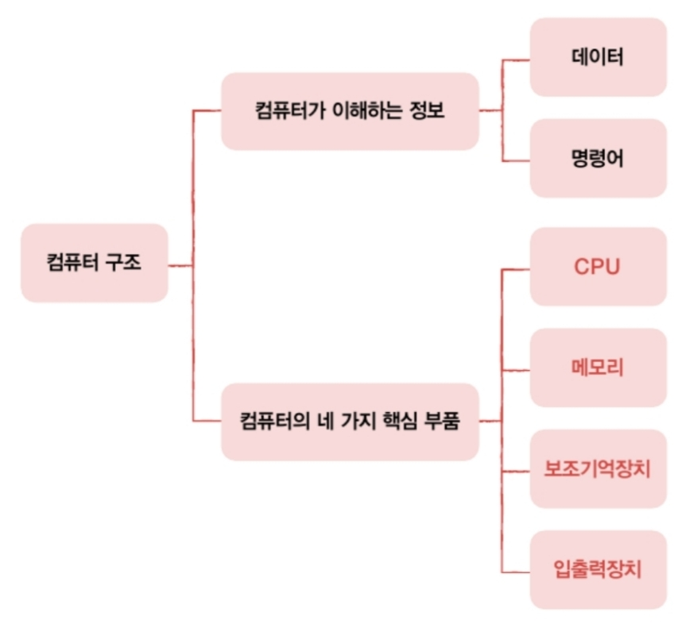

# 1회차

## Title: 컴퓨터 구조 시작하기

### Subject: 컴퓨터구조,운영체제

### Date: 240714

<aside>
 **QUESTIONS**

- 컴퓨터 프로그램과 관련해 보조기억장치와 메모리의 역할 차이는?
    - 보조기억장치 : 보관할 프로그램 저장 - 전원이 꺼져도 보관할 프로그램 저장 가능
    - 메모리 : 실행되는 프로그램 저장
- CPU의 중요 내부 구성 요소 3가지
    - 산술논리연산장치(ALU) : 계산기
    - 레지스터 : 작은 임시저장 장치 → 프로그램 실행에 필요한 값들 임시로 저장
    - 제어장치 : 제어 신호라는 전기 신호를 내보내고 명령어 해석
- 시스템 버스의 3가지는?
    
    주소버스, 데이터버스, 제어버스
    
</aside>

<aside>
 **NOTES**

1. **컴퓨터 구조를 알아야 하는 이유**
    - 문제 해결 능력 향상
    - 문법만으로는 알기 어려운 성능/용량/비용 고려하며 개발 가능
2. **컴퓨터 구조의 큰 그림**

1) 데이터 : 컴퓨터가 이해하는 숫자, 문자, 이미지, 동영상과 같은 정적인 정보

2) 명령어 : 데이터를 움직이고 컴퓨터 작동시키는 정보

⇒ ‘명령어’는 컴퓨터 작동시키는 정보 / ‘데이터’는 명령어 위해 존재하는 일종의 재료

- 메인보드(=마더 보드)
- 시스템 버스 : 4가지 핵심 부품 연결
    - 주소 버스 : 주소 주고받는 통로
    - 데이터 버스 : 명령어, 데이터 주고받는 통로
    - 제어 버스 : 제어 신호 주고받는 통로
</aside>

<aside>
 **SUMMARY**

- 
</aside>