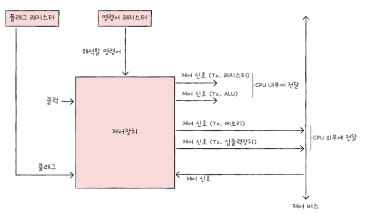
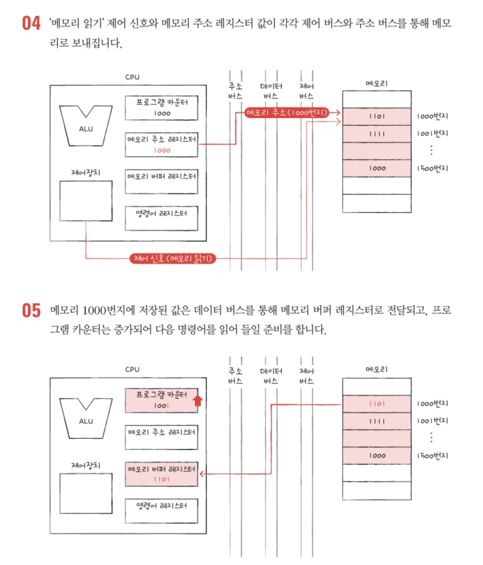
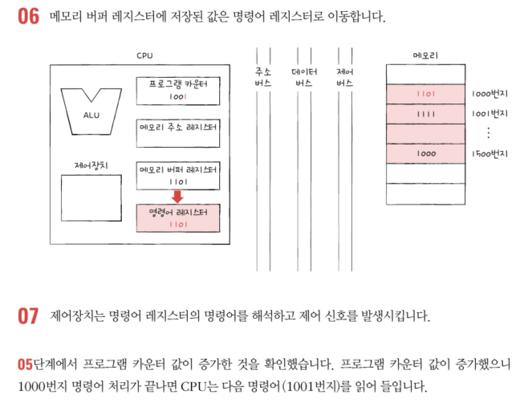
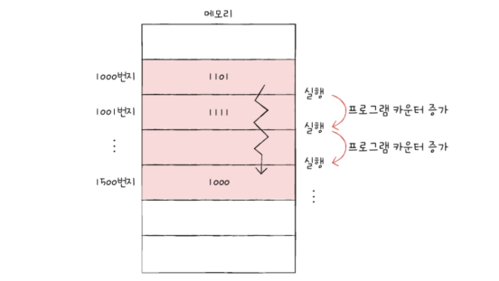
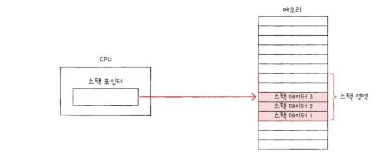
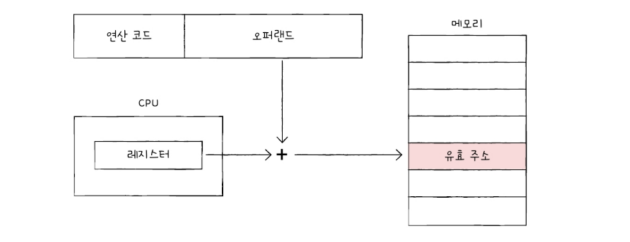
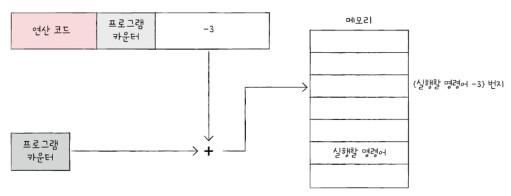
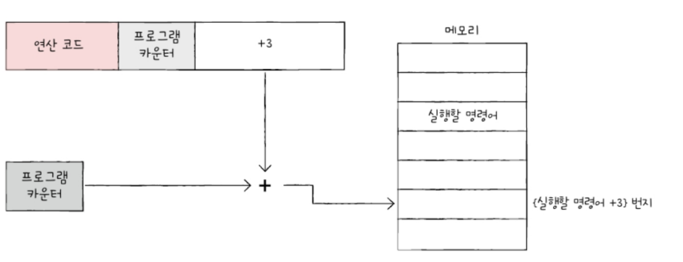

- [4-1 ALU와 제어장치](#4-1-alu와-제어장치)
  - [ALU](#alu)
  - [제어장치](#제어장치)
- [4-2 레지스터](#4-2-레지스터)
    - [특정 레지스터를 이용한 주소 지정 방식(1): 스택 주소 지정 방식](#특정-레지스터를-이용한-주소-지정-방식1-스택-주소-지정-방식)
    - [특정 레지스터를 이용한 주소 지정 방식(2): 변위 주소 지정 방식](#특정-레지스터를-이용한-주소-지정-방식2-변위-주소-지정-방식)
      - [상대 주소 지정 방식](#상대-주소-지정-방식)
      - [베이스 레지스터 주소 지정 방식](#베이스-레지스터-주소-지정-방식)
  - [📖](#)

# 4-1 ALU와 제어장치

## ALU

- ALU가 받아들이는 정보: 피연산자(from 레지스터), 제어신호(수행할 연산. from 제어장치)
- ALU가 내보내는 정보: 연산 수행 결과(특정 숫자/문자/메모리 주소. 메모리가 아닌 레지스터에 일시적으로 저장됨), 플래그

**ALU가 내보내는 대표적인 플래그(flag)**\

: CPU가 프로그램을 실행하는 도중 반드시 기억해야 하는 일종의 참고 정보.\
**플래그 레지스터**라는 레지스터에 저장됨.
|연산 결과가 음수임을 알 수 있음|연산 결과가 0임을 알 수 있음|
|:---:|:---:|
|||

## 제어장치
제어장치: 제어 신호를 내보내고 명령어를 해석하는 부품
제어 신호: 컴퓨터 부품들을 관리하고 작동시키기 위한 일종의 전기 신호

- 받아들이는 정보
   1. 클럭(clock)\
      : 컴퓨터의 모든 부품을 움직일 수 있게 하는 시간 단위. 클럭의 주기에 맞춰 작동함(주의: 부품이 클럭 박자에 맞춰 작동하는 것이지 한 클럭마다 작동한다는 것이 아님.)\
      
   2. 해석해야 할 명령어
      : 명령어 레지스터에 저장됨. 명령어 레지스터로부터 해석할 명령어를 받아들이고 해석한 뒤, 제어 신호를 발생시켜 컴퓨터 부품들이 수행해야 할 내용을 알려줌
   3. 플래그 레지스터 속 플래그 값
   4. 시스템 버스 중 제어 버스로 전달된 제어 신호
      제어 버스를 통해 외부로부터 전달된 제어신호를 받아들이기도 함

- 내보내는 정보: CPU 외부에 전달하는 제어신호(메모리에 전달하는 제어신호, 입출력장치(보조기억장치 포함)에 전달하는 제어 신호), CPU 내부에 전달하는 제어신호

# 4-2 레지스터
알아야 할 대표적인 레지스터\

1. 프로그램 카운터
   메모리에서 가져올 명령어의 주소를 저장. '명령어 포인터'라고 부르는 CPU도 있음

2. 명령어 레지스터
   해석할 명령어, 즉 방금 메모리에서 읽어 들인 명령어를 저장하는 레지스터

3. 메모리 주소 레지스터
   메모리의 주소를 저장하는 레지스터(ex: CPU가 읽어 들이고자 하는 주소 값을 주소 버스로 보낼 때 메모리 주소 레지스터를 거치게 됨)

4. 메모리 버터 레지스터
   메모리와 주고 받ㅅ을 값(데이터와 명령어)을 저장하는 레지스터. 메모리에 쓰고 싶은 값이나 메모리로부터 전달받은 값은 메모리 버퍼 레지스터를 거침

CPU 속 프로그램 카운터가 꾸준히 증가하기 때문에 CPU가 메모리 속 프로그램을 순차적으로 읽어 들이고 실행해 나갈 수 있음.

5. 범용 레지스터
   다양하고 일반적인 상황에서 자유롭게 사용할 수 있는 레지스터.
   메모리 버퍼 레지스터와 메모리 주소 레지스터는 각각 데이터 버스, 주소 버스로 보낼 값만 저장하는 반면 범용 레지스터는 데이터와 주소를 모두 저장할 수 있음

6. 플래그 레지스터
   ALU 연산 결과에 따른 플래그를 플래그 레지스터에 저장. 연산 결과 또는 CPU 상태에 대한 부가적인 정보를 저장하는 레지스터

### 특정 레지스터를 이용한 주소 지정 방식(1): 스택 주소 지정 방식
7. 스택 포인터
   스택 주소 지정 방식이라는 주소 지정 방식에 사용되고, 프로그램 카운터와 베이스 레지스터는 변위 주소 지정방식이라는 주소 지정 방식에 사용됨

   - **스택 주소 지정 방식**: 스택과 스택 포인터를 이용한 주소 지정 방식
   - **스택 포인터**: 스택의 꼭대기를 가리키는 레지스터. 즉, 스택에 마지막으로 저장한 값의 위치를 저장하는 레지스터
  
  ex) 스택 포인터: 4번지를 저장함(어디까지 데이터가 채워져 있는지에 대한 표시라고 보면 됨) 
  

  데이터를 꺼낼 경우 1 -> 2 -> 3 순서로 데이터를 꺼낼 수 있음. 만약 하나의 데이터를 꺼냈다면 스택 포인터는 5번지를 가리키고, 후에 하나를 다시 집어넣는다면 스택 포인터는 4번지를 가리키게 됨

스택 영역: 메모리 안에 스택처럼 사용하기로 암묵적으로 약속된 영역

### 특정 레지스터를 이용한 주소 지정 방식(2): 변위 주소 지정 방식
변위 주소 지정 방식: 오퍼랜드 필드의 값(변위)과 특정 레지스터의 값을 더하여 유효 주소를 얻어내는 주소 지정 방식\

변위 주소 지정 방식을 사용하는 명령어는 기존 명령어 필드에 어떤 레지스터의 값과 더할지 나타내는 레지스터 필드가 있다는 점에서 차이가 있다.\
\
이때 변위 주소 지정 방식은 오퍼랜드 필드의 주소와 어떤 레지스터를 더하는지에 따라 `상대 주소 지정방식`, `베이스 레지스터 주소 지정 방식` 등으로 나뉨

#### 상대 주소 지정 방식
: 오퍼랜드와 프로그램 카운터의 값을 더하여 유효 주소를 얻는 방식

ex) 오퍼랜드가 -3이었다면 CPU는 읽어 들이기로 한 명령어로부터 세 번째 이전 번지로 접근하고, 3이었다면 세 번째 이후 번지로 접근한다.\

\
if문과 유사하게 모든 코드를 실행하는 것이 아닌, 분기하여 특정 주소의 코드를 실행할 때 사용된다.

#### 베이스 레지스터 주소 지정 방식
: 오퍼랜드와 베이스 레지스터의 값을 더하여 유효 주소를 얻는 방식

베이스 레지스터는 '기준 주소' 오퍼랜드는 '기준 주소로부터 떨어진 거리' 의 역할을 한다.
ex) 베이스 레지스터에 200이라는 값이 저장되어 있고 오퍼랜드가 50이라면 "기준 주소 200번지로부터 50만큼 떨어진 250번지로 접근하라"를 의미한다.

---

## 📖

Q1. ALU가 받아들이는 정보와 내보내는 정보에 대해 각각 설명하시오.

A1. ALU가 받아들이는 정보로는 피연산자와 수행할 연산인 제어신호가 있고, 내보내는 정보로는 ALU를 통한 연산 결과인 데이터 혹은 데이터의 메모리 주소와 플래그가있다.

Q2. 클럭(Clock)에 대해 간략하게 설명하시오.

A2. 클럭은 컴퓨터의 모든 부품을 움직일 수 있게 하는 시간 단위이며, 클럭의 주기에 맞춰 컴퓨터의 작동이 이루어진다.

Q3. 범용 레지스터에 대해 설명하고, 범용 레지스터는 메모리 버퍼 레지스터 및 메모리 주소 레지스터와 어떤 차이가 있는지에 대해 설명하시오.

A3. 범용 레지스터는 다양하고 일반적인 상황에서 자유롭게 사용할 수 있는 레지스터이며, 메모리 버퍼 레지스터와 메모리 주소 레지스터는 각각 데이터 버스, 주소 버스로 내보낼 주소값만 저장하는 반면, 범용 레지스터는 데이터와 주소를 모두 저장할 수 있다는 점에서 차이가 있다.
 